## Redission 

一个client 内部创建两个Bootstrap

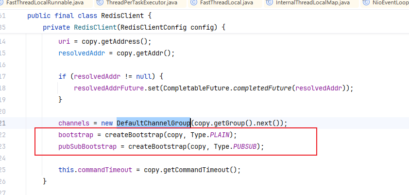


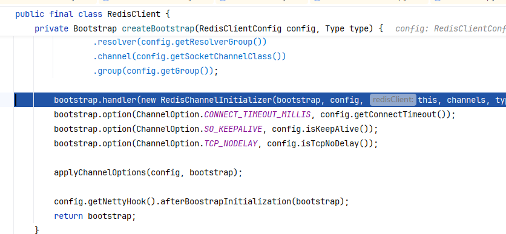


### 分布式锁
redissonClient.getLock

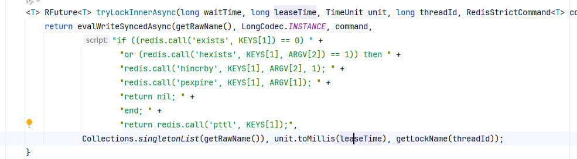

如果有其他线程持有锁，将会返回锁过期时间，然后订阅channel，当锁过期时会发布事件唤醒
redisson_lock__channel:{test_lock}

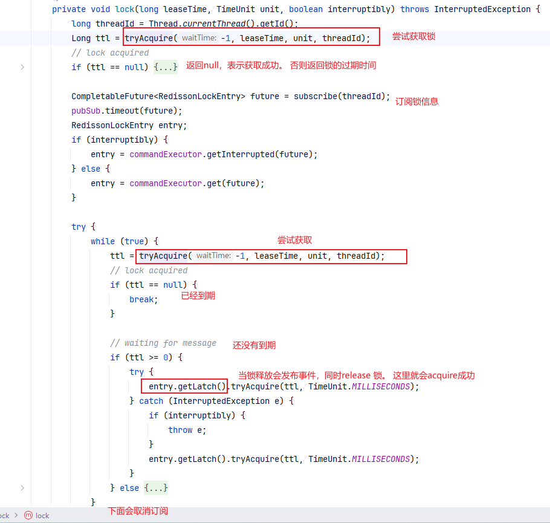


### unlock：

org.redisson.RedissonLock#unlockInnerAsync

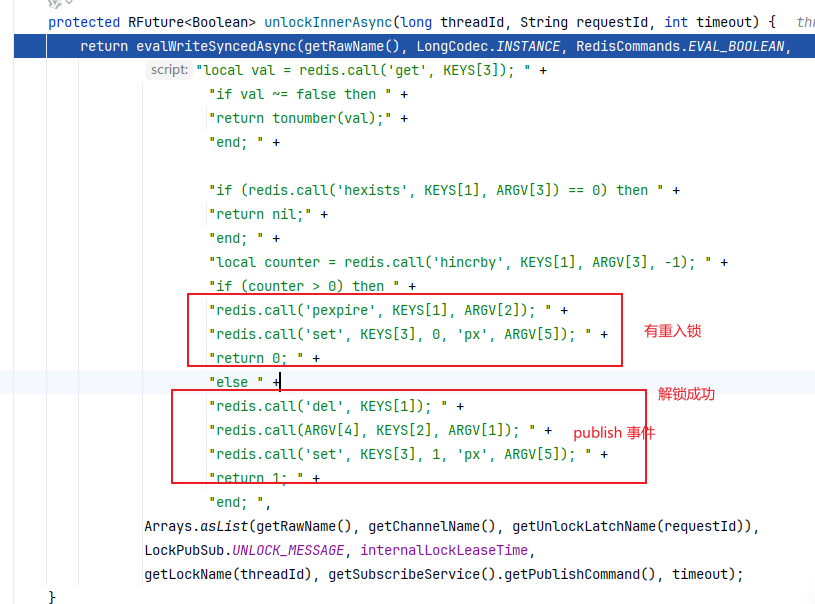

当解锁成功时，会发送事件唤醒等待获取锁的线程。


### watchdog：


获取到锁后会生成任务放入时间轮： 延迟时间10秒， 每次续期30秒

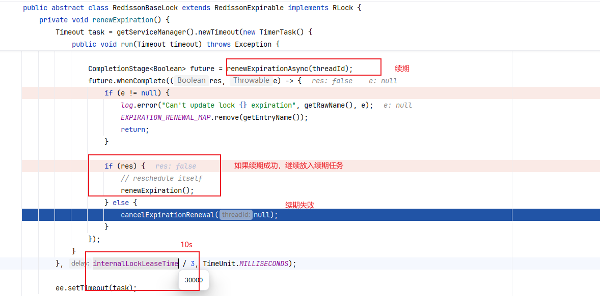

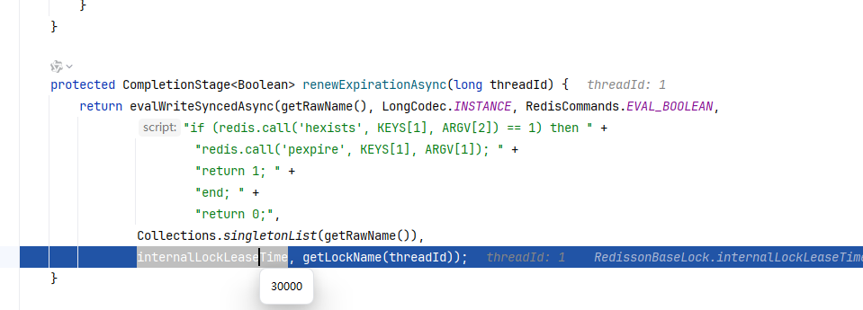


### 延时队列
redis 本身可以通过订阅过期事件来实现延时队列，但是有一些缺点： 时效性差，只有真正删除时才通知。 丢消息：Redis 的 pub/sub 模式中的消息并不支持持久化。多服务实例下消息重复消费：Redis 的 pub/sub 模式目前只有广播模式
命令：`SUBSCRIBE __keyevent@1__:expired`， 需要配置过期发送通知事件

Redisson 通过 SortedSet (过期时间作为score)、 list、pub/sub 多种数据结构实现按时间顺序延迟消费任务。
```java
 private static void delay_queue(RedissonClient redissonClient) throws InterruptedException {
        RBlockingQueue<String> blockingQueue = redissonClient.getBlockingQueue("myDelayedQueue");
        RDelayedQueue<String> delayedQueue = redissonClient.getDelayedQueue(blockingQueue);

        Thread.ofVirtual().start(() -> {
            // 向延迟队列添加任务，延迟时间为 10 秒
            delayedQueue.offer("Delayed Task 1", 10, TimeUnit.SECONDS);
            // 向延迟队列添加任务，延迟时间为 5 秒
            delayedQueue.offer("Delayed Task 2", 5, TimeUnit.SECONDS);
        });
        // 阻塞式获取并消费任务，等待任务到期
        while (true) {
            // 注意这里不是 delayedQueue
            String task = blockingQueue.poll(); // take: 阻塞获取任务
            if (task != null) {
                System.out.println("Consuming task: " + task);
            } else {
                System.out.println("No task available or all tasks have been processed.");
            }
            Thread.sleep(1000); // 每秒检查一次
        }
    }
```

#### Stream
Redis 5.0 新增了 Stream 数据结构。这是一个基于 Radix Tree（基数树）实现的有序消息日志，天然支持消费者组和 ACK 机制，可用于构建轻量级消息队列。

### 线程模型：

redisson-timer： 时间轮，单线程， ticket 100ms， wheel：1024

redission-netty-n：NioEventLoop， 默认32

redission-3-1:   执行外部任务线程。

RedisConnection Pool： 最小空闲24 ，最大64.   subscription 最小空闲1 个，最大50。 

- org.redisson.connection.ClientConnectionsEntry#ClientConnectionsEntry

```java
Config config = new Config();
config.setNettyThreads(8);     // NioEventLoop 线程
config.setThreads(10);        // redission默认线程池大小： FixedThreadPool
config.useSingleServer()
        .setDatabase(0)
        .setConnectionMinimumIdleSize(10)
        .setConnectionPoolSize(30) // max
        .setSubscriptionConnectionMinimumIdleSize(1) // sub
        .setSubscriptionConnectionPoolSize(10)
        .setAddress("redis://127.0.0.1:6379");
RedissonClient redissonClient = Redisson.create(config);
```


初始化连接：

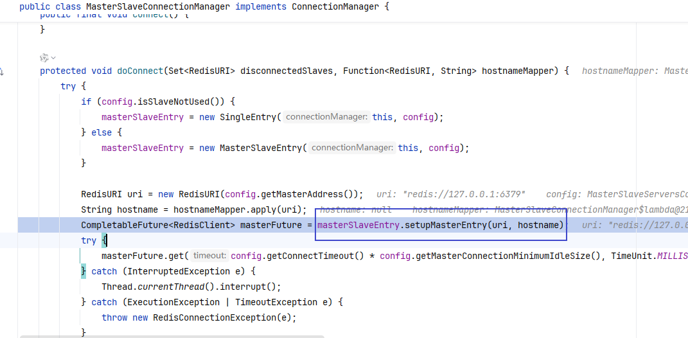


初始化connection、pubSubConnection

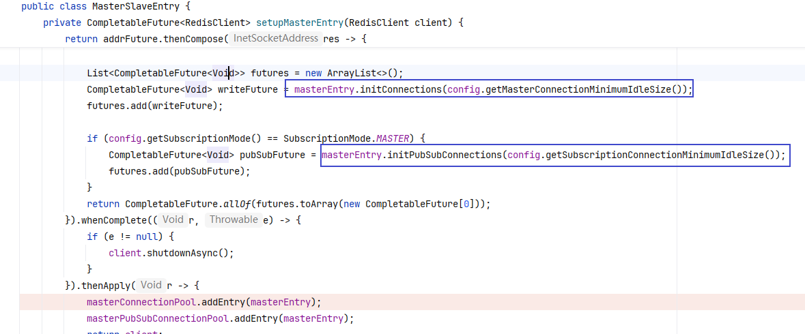


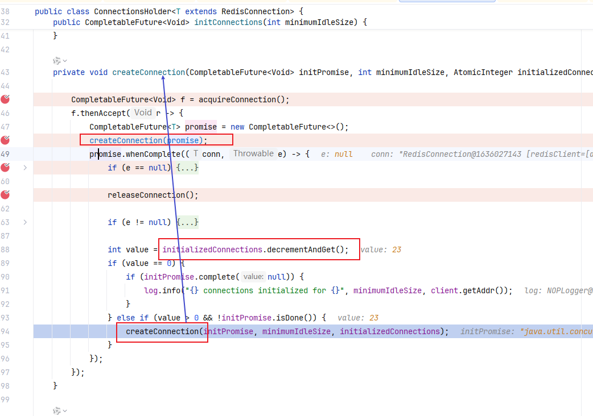


### 命令执行流程：

org.redisson.command.CommandAsyncService#syncedEval

--> 

org.redisson.command.CommandAsyncService#evalAsync

```
new RedisExecutor
--> execute:
	-- 获取redis 连接
	-- sendCommand： 
```


从ConnectionsHolder中获取一个连接

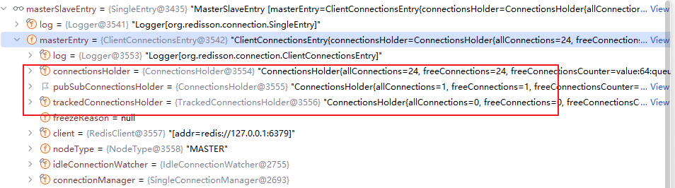


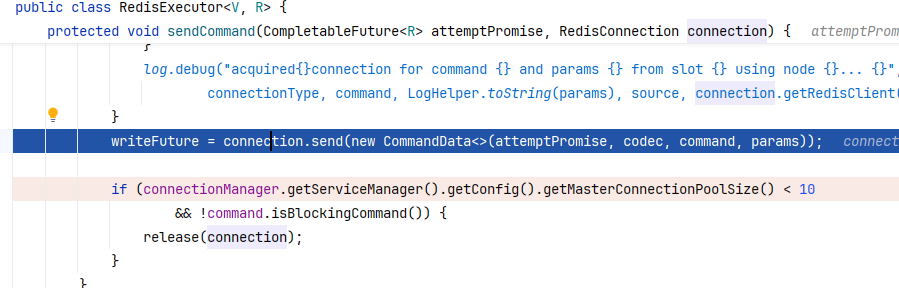

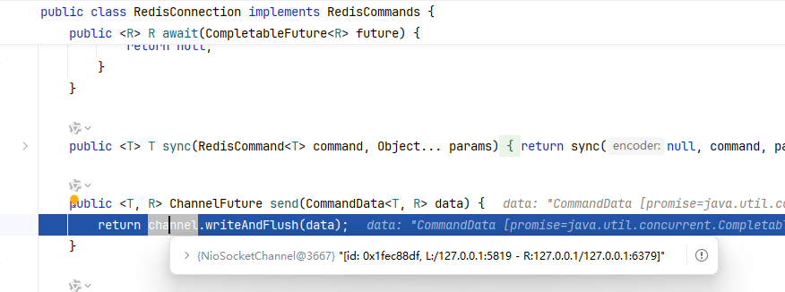


## Redission 集成Spring

将下面添加到Configuration或者启动类：由于优先扫描的关系，会自动跳过 RedisCacheConfiguration定义的默认RedisManager

```java
@Bean(destroyMethod="shutdown")
RedissonClient redisson() throws IOException {
    Config config = new Config();
    config.useSingleServer()
            .setAddress("redis://127.0.0.1:6379");
    return Redisson.create(config);
}

@Bean
public CacheManager redisCacheManagement(RedissonClient client) {

    Map<String, CacheConfig> config = new HashMap<String, CacheConfig>();
    CacheConfig cacheConfig = new CacheConfig(24 * 60 * 1000, 12 * 60 * 1000);
    config.put("test", cacheConfig);

    RedissonSpringCacheManager cacheManager = new RedissonSpringCacheManager(client, config);
    return cacheManager;
}
```

