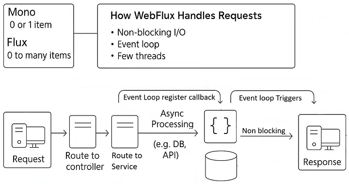

spring webFlux
reactor(default)/Rxjava

publishOn: call blocking library, processing on a different thread. used to switch processing to a different thread pool


HttpHandler
Reactor Netty/ Jetty HttpClient

WebHandler


ServerWebExchange: for accessing form data



```shell
Publisher:  Flux/Mono,  FluxGenerate
subscribe(Subscriber<? super T> s); 

Subscriber:   BaseSubscriber,  消费任务
onSubscribe(Subscription s);
onNext(T t);  处理每个元素
onError(Throwable t);
onComplete();


Subscription: 
long requested;     
request(long n);  update requested field
cancel();


Publisher#subscribe -->
    Subscriber#onSubscribe:
      Subscription#request: 无背压：fastPath(MAX) / 有背压：slowPath(n),没有新的request将退出
        Subscriber#onNext:  处理每个元素
```

```java
Flux<String> flux = Flux.generate(
                () -> 0, // 初始值
                (state, sink) -> {   // sink: GenerateSubscription
                    sink.next("3 x " + state + " = " + 3*state);   // 传递给 LambdaSubscriber
                    if (state == 10) sink.complete();   // 终止
                    return state + 1;   // 下一次计算的值
                }, System.out::println); // complete后的 consumer
        flux.subscribe(System.out::println);    // LambdaSubscriber
        // toStream会生成SubscriberIterator (替换上面的LambdaSubscriber)，重新执行一遍上面的GenerateSubscription
        List<String> collect = flux.toStream().collect(Collectors.toList());
        System.out.println(collect);
```


Scheduler:
.publishOn() // placement matter  后续的操作切换到scheduler中执行. FluxPublishOn
.subscribeOn()  // placement no matter， 所有的操作都会切换到scheduler.  FluxSubscribeOn, 


handing Errors:
onErrorReturn
onErrorResume

doOnError: 可以记录错误日志，不影响错误信息的传播
doFinally
Flux.using()
Flux.interval

retry
retryWhen: Retry.from/ Retry.max(3)/ Retry.backoff()


Spring WebMVC 中返回Mono，Flux时。 结果处理器会选择**ResponseBodyEmitterReturnValueHandler**
执行：ReactiveTypeHandler#handleValue
```java
        DeferredResult<Object> result = new DeferredResult<>();
        // returnValue： controller中返回的Mono对象。
        // 这里新建一个DeferredResultSubscriber 作为Mono订阅对象： .subscribe(this).  执行完成后complete将值设置到DeferredResult中
        new DeferredResultSubscriber(result, adapter, elementType).connect(adapter, returnValue);
        WebAsyncUtils.getAsyncManager(request).startDeferredResultProcessing(result, mav);
```


