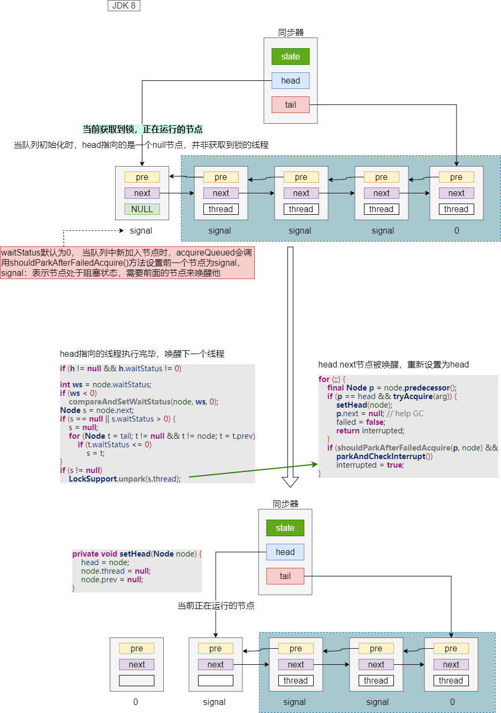
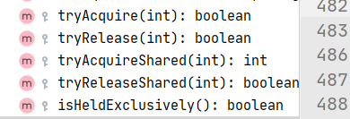
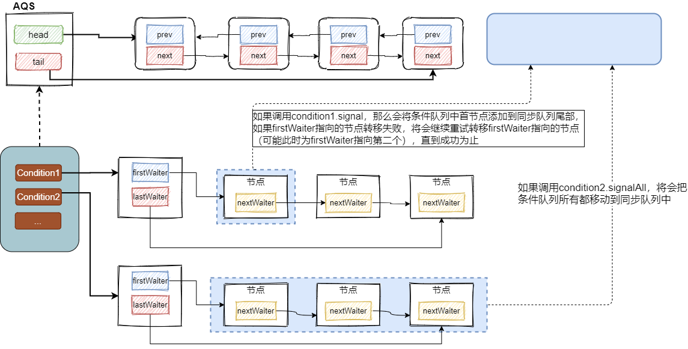
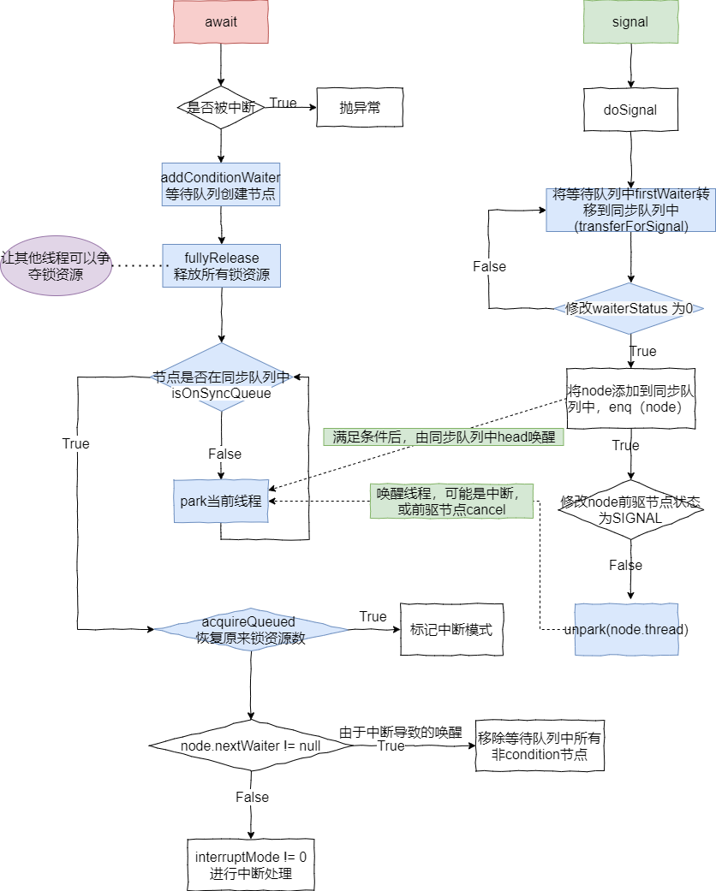
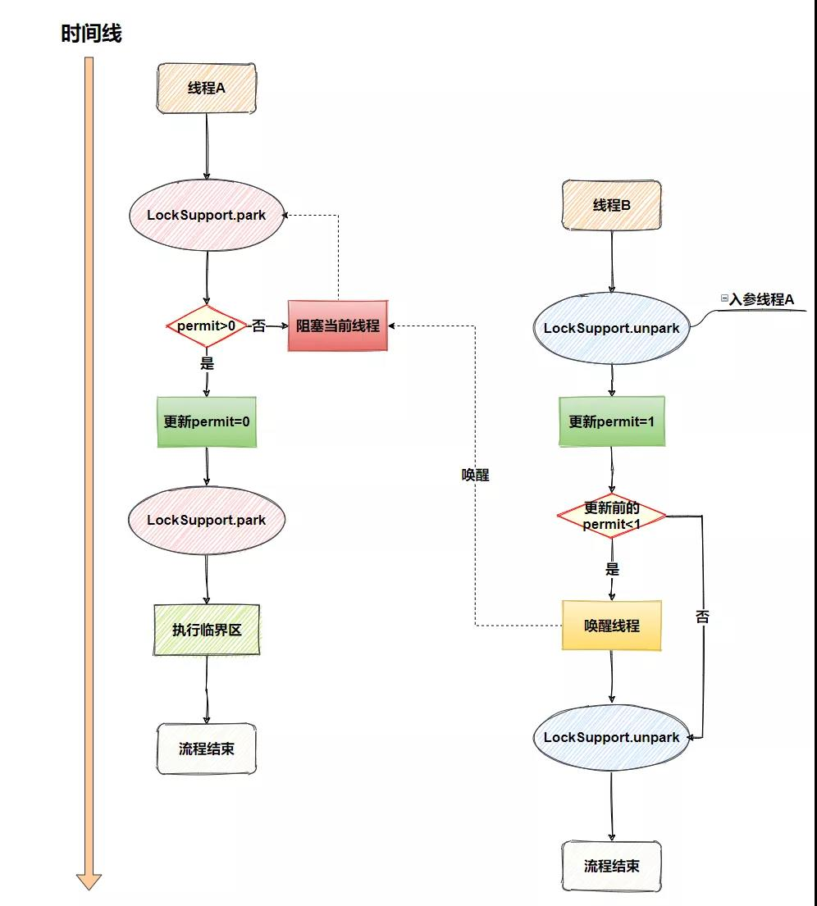
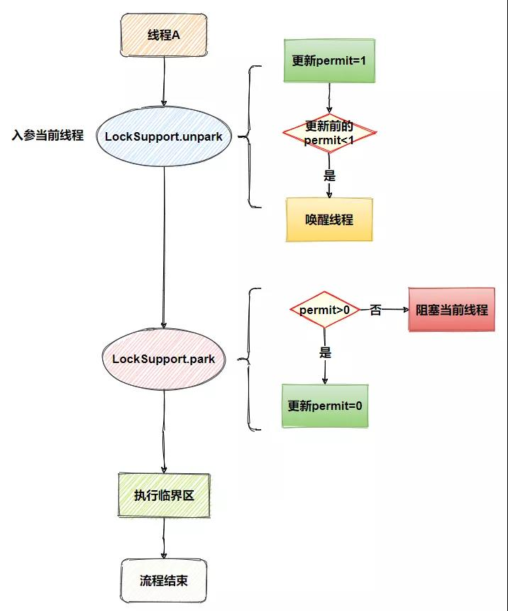
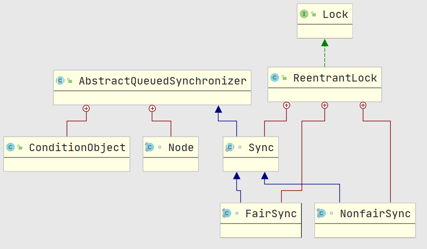
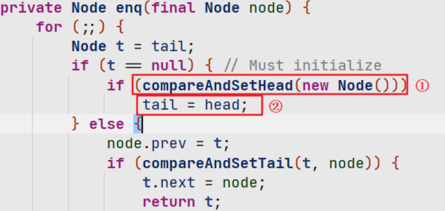
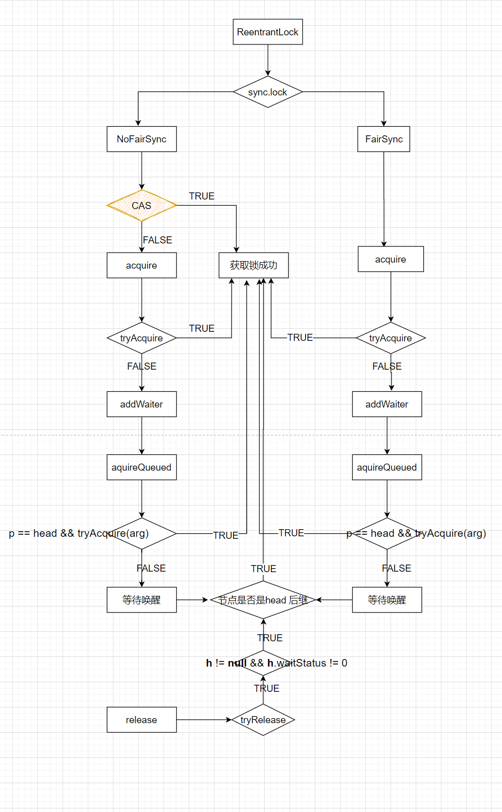

AQS

### 简介		

​		AQS全称`AbstractQueueSynchronizer`，基于FIFO等待队列实现的一个同步器框架，JUC包中的很多类都基础自AQS，比如：ReentrantLock，ReentrantReadWriteLock、CountDownLatch等，AQS是在Java语言层面实现锁的机制，避免了用户态跟内核态之间的切换，我们知道Synchronized属于操作系统层面，在JDK6之前，使用synchronized对程序进行加锁，对应操作系统的MUTEX实现，在线程竞争激烈的环境下会造成频繁的上下文切换，进而严重影响并发性能，在JDK6 之后，官方对Synchronized做了很多的优化，比如偏向锁、轻量级锁、自适应锁，目前用Synchronized也是没有好大的性能问题了。

相比Synchronized 来说， `AQS功能更加丰富`：

- 支持快速响应(tryAcquire)，获取失败立即返回false

-  支持指定获取锁等待时间(tryAcquireNanos)
- 支持响应中断
- 支持共享锁
- 支持多个等待队列
- 支持唤醒指定线程


​		AQS使用CLH锁队列 的变体 来实现， 通过`state`的值来记录是否有线程持有锁，具体变化根据具体实现来看，通常state为0表示没有线程持有锁，> 0 表示有线程持有该资源


​		同步器中的head始终指向的是当前正在运行的节点，tail指向队列最后一个节点， 当前持有锁的节点（也就是head节点）调用release后，会将后续节点唤醒，同时当前节点的指针赋null，大致变化如下：





### 核心源码

由于AQS只是提供的一个模板，对于锁如何实现独占，共享的具体方式将由自己进行重写，需要重写的方法有：

可以根据具体的需求选择性重写

- tryAcquire():  独占式获取同步状态
- tryRelease(): 独占式释放同步转态
- tryAcquireShared(): 共享式获取同步状态  ，重写时 一般 0 表示当前获取成功，随后的会获取失败，正数表示还有资源可用，负数表示获取失败
- tryReleaseShared(): 共享式释放同步状态
- isHeldExclusively(): 当前同步器是否在独占模式下被占用




#### Node  属性：

```java
// 以共享模式存在的节点
static final Node SHARED = new Node();
// 以独享模式
static final Node EXCLUSIVE = null;
// 该节点线程在同步对列中等待超时或则被中断，将会从同步队列中取消等待，并移除该节点
static final int CANCELLED =  1;
// 标记后继节点的线程处于等待状态，用于unpark后继节点，让后继节点运行，后继节点入队时将前驱结点设置为SIGNAL
static final int SIGNAL    = -1;
// 节点处于等待队列中
static final int CONDITION = -2;
// 表示下一次共享式同步状态获取将会无条件地传播下去
static final int PROPAGATE = -3;
// 记录当前节点的状态，默认0表示初始状态
volatile int waitStatus;
// 前驱节点
volatile Node prev;
// 后继节点
volatile Node next;
// 节点线程
volatile Thread thread;
// 当前线程是独占，还是共享, 或者条件队列中的下一个节点
Node nextWaiter;
```


需要关注的核心方法：

#### 独占模式相关方法

- acquire： 获取同步状态，实际就是将state修改为arg

    ```java
    public final void acquire(int arg) {
        // tryAcquire: 尝试获取锁，该方法由具体的实现类进行重写，AQS中并没有实现该方法
        // 				非公平锁通常会使用CAS尝试获取锁
        // 如果尝试获取锁失败，那么将当前节点加入到同步队列的尾部， 在调用acquireQueued进行获取锁，或则阻塞线程
        if (!tryAcquire(arg) &&
            acquireQueued(addWaiter(Node.EXCLUSIVE), arg))
            // 中断当前线程，acquireQueued返回true，说明有其他线程中断了当前线程而导致线程唤醒，并非其他线程调用的unpark唤醒
            selfInterrupt();
    }
    ```

- addWaiter： 将当前线程节点添加到队列尾

    ```java
    private Node addWaiter(Node mode) {
        // 为当前线程新建一个Node节点
        Node node = new Node(Thread.currentThread(), mode);
        // 通过CAS将node节点添加到同步队列的尾部
        Node pred = tail;
        if (pred != null) { // 这里首先尝试将新节点加入队列，失败就走enq方法就行入队
            node.prev = pred;
            if (compareAndSetTail(pred, node)) {
                pred.next = node;
                return node;
            }
        }
        // 上面逻辑执行失败，则进入这个方法入队
        enq(node);
        return node;
    }
    
    // 入队，返回尾节点
    // 如果队列中目前还是空节点的话,会创建一个head节点,   head(null) --> node
    private Node enq(final Node node) {
            for (;;) {
                Node t = tail;
                if (t == null) { // 队列为空进行初始化
                    if (compareAndSetHead(new Node()))
                        tail = head;
                } else {
                    node.prev = t;
                    if (compareAndSetTail(t, node)) { // 将新节点作为tail
                        t.next = node;
                        return t;
                    }
                }
            }
        }
    ```

- acquireQueued： 节点入队成功后，判断是否应该轮到当前节点运行

    ```java
    final boolean acquireQueued(final Node node, int arg) {
        // 获取锁是否失败
        boolean failed = true;
        try {
            // 记录是否被其他线程中断而导致的唤醒
            boolean interrupted = false;
            for (;;) {
                final Node p = node.predecessor(); // 获得前驱节点
                // 前驱结点是head就尝试获取锁
                if (p == head && tryAcquire(arg)) {
                    // 获取锁成功，将当前节点设置为head
                    setHead(node);
                    p.next = null; // 清空的head节点，便于GC
                    failed = false;
                    return interrupted;  // 返回中断状态
                }
                // shouldParkAfterFailedAcquire: 检查是否符合park要求,通常第一次调用会返回false，用于设置前一个节点为signal，第二次循环将返回true
                // parkAndCheckInterrupt: 调用park，唤醒后检查是否被中断
                if (shouldParkAfterFailedAcquire(p, node) &&
                    parkAndCheckInterrupt())
                    interrupted = true;
            }
        } finally {
            if (failed)  // tryAcquire()方法执行过程中抛出了异常，一般是线程数达到极限
                cancelAcquire(node);  // 取消该线程
        }
    }
    ```

- shouldParkAfterFailedAcquire： 用于判断入队的节点是否能够安全地阻塞起来，就是判断前一个节点状态是否为`signal`，用于标记其后续能够唤醒当前节点

    ```java
    private static boolean shouldParkAfterFailedAcquire(Node pred, Node node) {
        int ws = pred.waitStatus;
        // 前一个节点已经是SIGNAL说明可以安全的阻塞node
        if (ws == Node.SIGNAL)
            return true;
        // 如果前驱节点有被取消的，那么将其从同步队列中移除
        if (ws > 0) {
            do {
                node.prev = pred = pred.prev;
            } while (pred.waitStatus > 0);
            pred.next = node;
        } else {
            // 将pred节点的前驱设置为SIGNAL状态
            compareAndSetWaitStatus(pred, ws, Node.SIGNAL);
        }
        return false;
    }
    ```
- parkAndCheckInterrupt: 阻塞当前线程并检查中断信息

  ```java
  private final boolean parkAndCheckInterrupt() {
      // 进行阻塞线程
      LockSupport.park(this);
      // 线程被意外中断，会重置中断状态
      return Thread.interrupted();
  }
  ```
  
  


-  cancelAcquire： 如果当前线程获取锁过程发生了异常，将节点重队列中移除， 通常为调用tryAcquire后导致

  ```java
  private void cancelAcquire(Node node) {
      // 如果当前节点为null，直接返回，还能有这种情况出现？
      if (node == null)
          return;
      node.thread = null;
  
      // 将node节点前面挨着的已经取消(cancel: 1)的节点也一并移除
      Node pred = node.prev;
      while (pred.waitStatus > 0)
          node.prev = pred = pred.prev;
  
      // 记录preNext（也是cancel的），用于下面执行CAS修改
      Node predNext = pred.next;
  
      // 设置当前节点状态
      node.waitStatus = Node.CANCELLED;
  
      // 如果node是尾结点，那么将pred设置为tail，同时将pre的next设置为null
      if (node == tail && compareAndSetTail(node, pred)) {
          compareAndSetNext(pred, predNext, null);
      } else {
          // 如果node不是尾结点，也不是头节点，将node删除，将node前后连接
          int ws;
          // 不太懂
          if (pred != head &&
              ((ws = pred.waitStatus) == Node.SIGNAL ||
               (ws <= 0 && compareAndSetWaitStatus(pred, ws, Node.SIGNAL))) &&
              pred.thread != null) {
              Node next = node.next;
              // 将队列中cancel的节点从队列中彻底断开，  pred --> next
              if (next != null && next.waitStatus <= 0)
                  compareAndSetNext(pred, predNext, next);
          } else {
              // 唤醒node后续节点
              unparkSuccessor(node);
          }
  
          node.next = node; // help GC
      }
  ```
  
-  unparkSuccessor：用于唤醒node后续节点

   ```java
   private void unparkSuccessor(Node node) {
       // 将node的状态设置为0
       int ws = node.waitStatus;
       if (ws < 0) // 唤醒后续节点前需要将自己设置为0
           compareAndSetWaitStatus(node, ws, 0);
   
       // 寻找node后面一个非concelled的节点来唤醒
       Node s = node.next;
       if (s == null || s.waitStatus > 0) {
           s = null;
           // 从tail开始遍历查找离node最近的非concelled节点
           for (Node t = tail; t != null && t != node; t = t.prev)
               if (t.waitStatus <= 0)
                   s = t;
       }
       if (s != null)
           // 唤醒s节点的线程
           LockSupport.unpark(s.thread);
   }
   ```

- release： 释放锁

  ```java
  public final boolean release(int arg) {
      // tryRelease: aqs没有具体实现
      if (tryRelease(arg)) {
          Node h = head;
          // 如果头节点不为空，且状态不为0， 则唤醒h的后续节点
          if (h != null && h.waitStatus != 0)
              unparkSuccessor(h);
          return true;
      }
      return false;
  }
  ```

  

#### 共享模式相关方法

通常在初始化时指定state为某一值，后续多个线程可以来操作state

>  如CountDownLatch，当调用一次countdown，state就-1，当最后一个线程调用countdown减为0时，就开始唤醒调用await方法的线程  (countDownLatch中，await 的线程会一直阻塞，直到countdown调用次数达到state）
>
> Semaphore、ReentrantReadWriteLock中都有应用

下面以`CountDownLatch`为例，介绍AQS中的`xxxxShared`方法


​		CountDownLatch在初始化时会指定state 的值，CountDownLatch的await方法支持 等待`n( >= state)` 次调用countDown方法后，await阻塞(`同步队列`中)的线程将会被唤醒继续向下执行， 这里需要注意只有` 0---->state `内的调用每次会让`state - 1`， 后面继续调用countDown直接返回。

- countDown():  

  ```java
  // CountDownLatch
  public void countDown() {
      sync.releaseShared(1);
  }
  // AQS
  public final boolean releaseShared(int arg) {
      if (tryReleaseShared(arg)) {  // 当第state次(重入)调用CountDown方法后，这里会返回true， 唤醒调用await导致阻塞的线程，阻塞队列中
          doReleaseShared();	
          return true;
      }
      return false;
  }
  // CountDownLatch
  protected int tryAcquireShared(int acquires) {
      return (getState() == 0) ? 1 : -1;
  }
  // CountDownLatch
  protected boolean tryReleaseShared(int releases) {
      // Decrement count; signal when transition to zero
      for (;;) {
          int c = getState();
          if (c == 0)
              return false;
          int nextc = c-1;
          if (compareAndSetState(c, nextc))
              return nextc == 0;
      }
  }
  ```

- doReleaseShared： 当state为0时，将调用该方法唤醒await的线程

    ```java
    private void doReleaseShared() {
        for (;;) {
            Node h = head;
            if (h != null && h != tail) {
                int ws = h.waitStatus;
                // 如果有多个线程调用await(t1, t2, t3....)， t1 将会为signal
                if (ws == Node.SIGNAL) { 
                    // 先将signal状态设置为0，然后在唤醒后面的节点
                    // 由于t1被唤醒后，setHeadAndPropagate方法会立即执行重新set head，
                    // setHeadAndPropagate方法也会调用doReleaseShared来唤醒t2
                    if (!compareAndSetWaitStatus(h, Node.SIGNAL, 0))
                        continue;            // loop to recheck cases
                   // 唤醒t1
                   // 内部执行：if (ws < 0) compareAndSetWaitStatus(node, ws, 0);
                     unparkSuccessor(h); 
                }
                // 第一次循环通常会走这里将状态(同步队列节点默认0)设置为propagate:-3
                // 多线程情况下也可能 状态变化为：0 --> signal---> propagate
                // 这个 CAS 失败的场景是：执行到这里的时候，刚好有一个节点入队，入队会将这个 ws 设置为 -1
                else if (ws == 0 &&
                         !compareAndSetWaitStatus(h, 0, Node.PROPAGATE))
                    continue;                // loop on failed CAS
            }
            // 如果只有一个await 的线程，肯定成立，直接返回
            // 当t1 被set 为head时，这里就不成立， 下一次循环可能唤醒的t1 也会通过setHeadAndPropagate方法来调用本方法，造成冲突，导致上面第一个CAS执行可能有一个会失败
            if (h == head)                   // loop if head changed
                break;
        }
    }
    ```

    

- await(): 阻塞线程，等待countDown调用到state次，被最后一次countDown调用唤醒,  这里假设有多个线程（t1, t2, t3…）调用await方法， 当t1 被唤醒后，t1唤醒t2， t2—> t3, ….

  ```java
  public void await() throws InterruptedException {
      sync.acquireSharedInterruptibly(1);
  }
  // AQS:
  public final void acquireSharedInterruptibly(int arg)
      throws InterruptedException {
      if (Thread.interrupted()) // 线程是否已中断
          throw new InterruptedException();
      if (tryAcquireShared(arg) < 0) 	// return (getState() == 0) ? 1 : -1;
          doAcquireSharedInterruptibly(arg);
  }
  
  ```

- doAcquireSharedInterruptibly: 创建shared节点，放入队列中

  ```java
  private void doAcquireSharedInterruptibly(int arg)
      throws InterruptedException {
      final Node node = addWaiter(Node.SHARED);
      boolean failed = true;
      try {
          for (;;) {
              final Node p = node.predecessor();
              if (p == head) {
                  int r = tryAcquireShared(arg); // (getState() == 0) ? 1 : -1;
                  if (r >= 0) {  // 被唤醒后，state为0
                      setHeadAndPropagate(node, r);
                      p.next = null; // help GC
                      failed = false;
                      return;
                  }
              }
              if (shouldParkAfterFailedAcquire(p, node) &&
                  parkAndCheckInterrupt())
                  throw new InterruptedException();
          }
      } finally {
          if (failed)
              cancelAcquire(node);
      }
  }
  ```

- setHeadAndPropagate

    ```java
    private void setHeadAndPropagate(Node node, int propagate) {
            Node h = head; // Record old head for check below
            setHead(node); // 重新set head
       		// 判断是否进行传播唤醒下一个节点
            if (propagate > 0 || h == null || h.waitStatus < 0 ||
                (h = head) == null || h.waitStatus < 0) {
                Node s = node.next;
                if (s == null || s.isShared())  
                    doReleaseShared();   // 传播唤醒下一个节点
            }
        }
    ```


### Condition

> 在使用synchronized加锁时，当线程调用wait方法后，会将线程放入等待队列中，其他线程调用notify（或notifyAll）方法后才会将当前线程唤醒，进入同步队列，而notifyAll是将等待队列中的`所有线程`都放入同步队列中，notify是`挑选其中一个`线程进入同步队列
>
>  这种原始的通知方法不能够指定通知某个线程，为了达到`精准`通知，因此JDK5后引入了AQS，而AQS中包含一个`ConditionObject`的内部类（我们经常说的Condition)

- Condition是由Lock对象的newCondition创建，依赖于Lock对象

- ConditionObject是AQS的内部类，实现Condition接口，每个Condition对象都包含着一个`等待队列`， 等待队列依然是使用AQS中的Node节点实现， 这里的等待队列是一个`单向队列`， 一个同步器可以有多个等待队列


基本结构如下：




#### await()

> 该方法会调用fullyRelease方法释放所有锁资源，因此调用该方法后，其他线程可以成功争夺锁资源

```java
public final void await() throws InterruptedException {
    // 判断当前线程是否中断
    if (Thread.interrupted())
        throw new InterruptedException();
    // 将当前线程添加到等待队列中
    Node node = addConditionWaiter();
    // 释放当前对象所有锁资源，会unpark head 的后续线程
    int savedState = fullyRelease(node);
    // 记录中断的标记
    int interruptMode = 0;
    // isOnSyncQueue： 判断node是否在同步队列中
    while (!isOnSyncQueue(node)) { // 正常情况下第一次调用都是返回false
        // 阻塞当前线程
        LockSupport.park(this);
        // checkInterruptWhileWaiting： 检查阻塞时是否发生中断
        // 0: 没有发生中断
        // 1：重新中断
        // -1: 抛出异常
        if ((interruptMode = checkInterruptWhileWaiting(node)) != 0)
            break;
    }
    // node 所属线程被唤醒后，继续向下执行
    // acquireQueued: 再次获取await前的资源数，可能之前重入了多次
    if (acquireQueued(node, savedState) && interruptMode != THROW_IE)
        // 执行到这里说明acquireQueued方法中，再次被中断
        interruptMode = REINTERRUPT;
    if (node.nextWaiter != null) // clean up if cancelled
        // 这里主要是由于中断唤醒，而signal 方法没有执行，因为signal 中会执行first.nextWaiter = null;
        // 将非condition状态的节点从条件队列中移除
        unlinkCancelledWaiters();
    // ！= 0 说明有中断发生，进行中断处理
    if (interruptMode != 0)
        reportInterruptAfterWait(interruptMode);
}
// 处理中断
private void reportInterruptAfterWait(int interruptMode)
    throws InterruptedException {
    if (interruptMode == THROW_IE) // 直接抛异常
        throw new InterruptedException(); 
    else if (interruptMode == REINTERRUPT)
        selfInterrupt();  // 标记中断状态，由用于程序处理
}
static void selfInterrupt() {
    Thread.currentThread().interrupt();
}
```


#### addConditionWaiter

将当前await 的线程添加到条件队列中

```java
private Node addConditionWaiter() {
    Node t = lastWaiter;
    // If lastWaiter is cancelled, clean out.
    if (t != null && t.waitStatus != Node.CONDITION) {
        unlinkCancelledWaiters();	// 取消条件队列中的所有cancel节点
        t = lastWaiter;
    }
    // 新建condition节点放入条件队列中
    Node node = new Node(Thread.currentThread(), Node.CONDITION);
    if (t == null)
        firstWaiter = node;
    else
        t.nextWaiter = node;
    lastWaiter = node;
    return node;
}
```

#### fullyRelease

将当前锁持有的资源全部释放，会唤醒同步队列的其他线程

```java
final int fullyRelease(Node node) {
    boolean failed = true;
    try {
        int savedState = getState();  // 记录当前锁资源，用于后期唤醒后再次获取该资源数
        if (release(savedState)) {
            failed = false;
            return savedState;
        } else {
            throw new IllegalMonitorStateException();
        }
    } finally {
        if (failed) // 当调用await的方法没有获取到锁，即之前没有调用lock方法
            node.waitStatus = Node.CANCELLED;
    }
}
public final boolean release(int arg) {
    if (tryRelease(arg)) {
        Node h = head;
        if (h != null && h.waitStatus != 0)
            unparkSuccessor(h);	// 唤醒head 的后续节点
        return true;
    }
    return false;
}
```

#### checkInterruptWhileWaiting

检查是否是由于发生中断而唤醒的

THROW_IE：说明在signal 调用前发生的中断

REINTERRUPT：signal调用后发生的中断

```java
private int checkInterruptWhileWaiting(Node node) {
    return Thread.interrupted() ?
        (transferAfterCancelledWait(node) ? THROW_IE : REINTERRUPT) :
    0;
}
```


#### transferAfterCancelledWait

取消条件队列中的等待节点，然后将其转移到同步队列

返回值可以判断：中断是signal前还是后发生的

```java
final boolean transferAfterCancelledWait(Node node) {
    // true： 说明是signal 调用前发生中断
    if (compareAndSetWaitStatus(node, Node.CONDITION, 0)) {
        enq(node);
        return true;
    }
    	// signal---> transferForSignal, 下面cas成功后发生的中断，
        // if (!compareAndSetWaitStatus(node, Node.CONDITION, 0))
        //        return false
        //    Node p = enq(node);
        //   int ws = p.waitStatus;
        //    if (ws > 0 || !compareAndSetWaitStatus(p, ws, Node.SIGNAL))
        //        LockSupport.unpark(node.thread);
        //    return true;
    // 到这里是因为 CAS 失败，肯定是因为 signal 方法已经将 waitStatus 设置为了 0(上面代码)
    // signal 方法会将节点转移到阻塞队列，但是可能还没完成，这边自旋等待其完成
    // 还有种较少的情况：signal 调用之后，没完成转移之前，发生了中断          
    while (!isOnSyncQueue(node))  // 自旋等待transferForSignal方法将节点转移到队列
        Thread.yield();
    return false;
}
```

#### isOnSyncQueue

检查节点是否以及被转移到同步队列中

```java
final boolean isOnSyncQueue(Node node) {
    // 转移同步队列成功后，pre注定不为null
    if (node.waitStatus == Node.CONDITION || node.prev == null)
        return false;
    if (node.next != null) // 有next，肯定转移成功
        return true;
   	// 走到这里说明singal调用的enq操作还没有成功，那么在同步队列中查找是否已存在node
    return findNodeFromTail(node);
}
private boolean findNodeFromTail(Node node) {
    Node t = tail;
    for (;;) {
        if (t == node)
            return true;
        if (t == null)
            return false;
        t = t.prev;
    }
}
```

==无论是否发生中断，条件队列中的节点都将会转移到同步队列中==

#### Signal

> 唤醒等待队列中的第一个线程

```java
public final void signal() {
    // 如果不是拥有锁的线程调用这个方法将抛出异常
    if (!isHeldExclusively())
        throw new IllegalMonitorStateException();
    Node first = firstWaiter;
    if (first != null)
        doSignal(first);
}

// 将等待队列第一个元素转移到同步队列中，直到转移成功后才返回
private void doSignal(Node first) {
    // transferForSignal: 将等待队列第一个转移到同步队列中
    do {
        // 成立： 说明first此时为等待队列最后一个元素
        if ( (firstWaiter = first.nextWaiter) == null)
            lastWaiter = null;
        // 在转移之前将nextWaiter赋值null
        first.nextWaiter = null;
        // 条件1：确保doSignal方法能够将等待队列中的第一个节点转移到同步队列中
        // 条件2：transferForSignal失败(可能被其他线程转移，中断唤醒，或者某些类中运行多个类获取锁，如读写锁)， 那么重新赋值first
    } while (!transferForSignal(first) &&
             (first = firstWaiter) != null);
}


```

#### transferForSignal

将节点转移到同步队列

```java
final boolean transferForSignal(Node node) {
 	// 失败，可能在signal之前线程已经被中断唤醒，调用transferAfterCancelledWait，status已经被设置为0
    if (!compareAndSetWaitStatus(node, Node.CONDITION, 0))
        return false;

  	// 将node添加到同步队列中
    Node p = enq(node);
    int ws = p.waitStatus;
	// ws > 0 说明 p 在阻塞队列中取消了等待锁（状态被设置cancel，但是从队列中断开还未执行），直接唤醒 node 对应的线程
    // 如果 ws <= 0, 那么 compareAndSetWaitStatus 将会被调用， 将node前驱节点（p）状态修改为SIGNAL， 用于被唤醒
    if (ws > 0 || !compareAndSetWaitStatus(p, ws, Node.SIGNAL))
        // 如果前驱节点取消或者 CAS 失败，会进到这里唤醒线程
        
        // CAS失败场景：node 的前驱节点(p)status ws==0， 中断后唤醒 await方法，然后会调用acquireQueued方法，if (shouldParkAfterFailedAcquire(p, node) &&
        //             parkAndCheckInterrupt())
        // 当shouldParkAfterFailedAcquire方法将p节点状态set 为signal后，这里的cas就会失败，那么唤醒node线程（node节点在parkAndCheckInterrupt中被阻塞），让其继续争夺锁资源
        LockSupport.unpark(node.thread);
    return true;
}
```


#### signalAll

- 唤醒等待队列的所有线程， 只是一个Condition等待队列

```java
public final void signalAll() {
    if (!isHeldExclusively())
        throw new IllegalMonitorStateException();
    Node first = firstWaiter;
    if (first != null)
        doSignalAll(first);
}

private void doSignalAll(Node first) {
    lastWaiter = firstWaiter = null;
    // 循环转移每个结点到同步队列中
    do {
        Node next = first.nextWaiter;
        first.nextWaiter = null;
        transferForSignal(first);
        first = next;
    } while (first != null);
}
```


#### awaitNanos

指定当前线程等待多久

```java
public final long awaitNanos(long nanosTimeout)
    throws InterruptedException {
    if (Thread.interrupted())
        throw new InterruptedException();
    // 在等待队列中添加等待节点
    Node node = addConditionWaiter();
    // 释放所有状态， 这里释放成功后，其他线程可以获取到锁
    int savedState = fullyRelease(node);
    // 终止时间
    final long deadline = System.nanoTime() + nanosTimeout;
    int interruptMode = 0;
    while (!isOnSyncQueue(node)) {
        // 等待时间结束
        if (nanosTimeout <= 0L) {
            // 将当前线程节点转移到同步队列中
            transferAfterCancelledWait(node);
            break;
        }
        // 等待时间超过自旋超时阈值，直接阻塞当前线程
        if (nanosTimeout >= spinForTimeoutThreshold)
            LockSupport.parkNanos(this, nanosTimeout);
        // 如果中断，就break
        if ((interruptMode = checkInterruptWhileWaiting(node)) != 0)
            break;
        // 每次循环就再次计算剩余时间
        nanosTimeout = deadline - System.nanoTime();
    }
    // 等待时间结束，重新获取资源
    if (acquireQueued(node, savedState) && interruptMode != THROW_IE)
        interruptMode = REINTERRUPT;
   
    if (node.nextWaiter != null)
        // 取消等待队列中被取消的节点
        unlinkCancelledWaiters();
    // 发生了中断
    if (interruptMode != 0)
        reportInterruptAfterWait(interruptMode);
    return deadline - System.nanoTime();
}
```


#### 大致流程：





参考：

《Java并发编程的艺术》

​	

## LockSupport

https://mp.weixin.qq.com/s/xSro-bwg__ir9EXwoCJ-rg

permit默认为0





经过上面的分析得出结论`unpark`的语义明确为「**使线程持有许可证**」，`park`的语义明确为「**消费线程持有的许可**」，所以`unpark`与`park`的执行顺序没有强制要求，只要控制好使用的线程即可，`unpark=>park`执行流程如下



- **`permit`默认是`0`，线程`A`执行`LockSupport.unpark`，`permit`更新为`1`，线程`A`持有许可证**
- **线程`A`执行`LockSupport.park`，此时`permit`是`1`，消费许可证，`permit`更新为`0`**
- **执行临界区**
- **流程结束**

最后再补充下`park`注意点，因`park`阻塞的线程不仅仅会被`unpark`唤醒，还可能会被线程中断（`Thread.interrupt`）唤醒，而且不会抛出`InterruptedException`异常，所以建议在`park`后自行判断**线程中断状态**，来做对应的业务处理。


使用LockSupport优点：

- **以线程为操作对象更符合阻塞线程的直观语义**
- **操作更精准，可以准确地唤醒某一个线程（`notify`随机唤醒一个线程，`notifyAll`唤醒所有等待的线程）**
- **无需竞争锁对象（以线程作为操作对象），不会因竞争锁对象产生死锁问题**
- **`unpark`与`park`没有严格的执行顺序，不会因执行顺序引起死锁问题，比如「`Thread.suspend`和`Thread.resume`」没按照严格顺序执行，就会产生死锁**


另外`LockSupport`还提供了`park`的重载函数，提升灵活性

- **`void parkNanos(long nanos)`：增加了超时机制**
- **`void parkUntil(long deadline)`：加入超时机制（指定到某个时间点，`1970`年到指定时间点的毫秒数）**
- **`void park(Object blocker)`：设置`blocker`对象，当线程没有许可证被阻塞时，该对象会被记录到该线程的内部，方便后续使用诊断工具进行问题排查**


## ReentrantLock

- 实现Lock接口，Lock接口只是定义了一些加锁，解锁的一些抽象方法

- 有一个静态的抽象类Sync，继承AQS，

- 静态内部类FairSync、NoFairSync 继承Sync ， 默认为非公平锁

  




使用比较简单，如下：

```java
public void testLock() {
    ReentrantLock lock = new ReentrantLock();
    lock.lock();
    try {
        // 处理业务逻辑
    } finally {
        lock.unlock();
    }
}
```

​		ReentrantLock 顾名思义，可重入锁，`支持公平，非公平锁`， 而Synchronized只支持非公平锁，通常来说非公平锁的性能要高于公平锁，因为在公平锁下，之前的线程运行时间很长而导致后来的线程始终得不到执行，非公平锁类似于抢占式，不管同步队列是否有线程，先尝试获取锁看下，如果获取成功就直接执行，没有获取成功就放入同步队列中


### Sync

使用AQS的state来代表持有锁的数量

```java
// 非公平获取锁
final boolean nonfairTryAcquire(int acquires) {
    final Thread current = Thread.currentThread();
    int c = getState();
    // 没有其他线程持有锁
    if (c == 0) {
        if (compareAndSetState(0, acquires)) {
            setExclusiveOwnerThread(current);
            return true;
        }
    }
    // 当前获取锁的线程已经持有锁，进行重入
    else if (current == getExclusiveOwnerThread()) {
        int nextc = c + acquires;
        if (nextc < 0) // overflow
            throw new Error("Maximum lock count exceeded");
        setState(nextc);
        return true;
    }
    return false;
}

protected final boolean tryRelease(int releases) {
    // 释放锁资源
    int c = getState() - releases;
    // 非持有锁的线程调用了tryRelease，抛出异常
    if (Thread.currentThread() != getExclusiveOwnerThread())
        throw new IllegalMonitorStateException();
    // 锁是否被线程持有
    boolean free = false;
    if (c == 0) {
        // 没有线程持有锁
        free = true;
        setExclusiveOwnerThread(null);
    }
    setState(c);
    return free;
}

// 锁是否被当前线程独占
protected final boolean isHeldExclusively() {
    return getExclusiveOwnerThread() == Thread.currentThread();
}
```


### 非公平锁

> ReentrantLock默认为非公平

```java
static final class NonfairSync extends Sync {
    final void lock() {
        // 首先使用CAS尝试修改状态，成功则设置当前线程为独占
        if (compareAndSetState(0, 1))
            setExclusiveOwnerThread(Thread.currentThread());
        else
            // 修改失败，进行重试，重试失败，入队，继续重试，这里调用父类AQS的方法
            acquire(1);
    }

    protected final boolean tryAcquire(int acquires) {
        return nonfairTryAcquire(acquires);
    }
}
```


### 公平锁

```java
static final class FairSync extends Sync {

    final void lock() {
        acquire(1);
    }
    protected final boolean tryAcquire(int acquires) {
        final Thread current = Thread.currentThread();
        int c = getState();
        if (c == 0) {
            // hasQueuedPredecessors: 当前节点是否需要排队
            if (!hasQueuedPredecessors() &&
                compareAndSetState(0, acquires)) {
                setExclusiveOwnerThread(current);
                return true;
            }
        }
        
        // 获取锁的线程已经持有锁，进行重入
        else if (current == getExclusiveOwnerThread()) {
            int nextc = c + acquires;
            if (nextc < 0)
                throw new Error("Maximum lock count exceeded");
            setState(nextc);
            return true;
        }
        return false;
    }
}


```

#### hasQueuedPredecessors

```java
//当前线程前面是否有排队的节点，保证公平性嘛，先来的先抢锁
// 返回false: 当前节点不需要排队
// https://blog.csdn.net/weixin_38106322/article/details/107154961
public final boolean hasQueuedPredecessors() {
    Node t = tail; // 以相反的顺序来读取，保证volatile的可见性（happen-before规则）
    Node h = head;
    Node s;
    return h != t &&
        ((s = h.next) == null || s.thread != Thread.currentThread());
}
```

解释下条件：假设三个线程t1， t2， t3，同时执行，t1最先获取锁，t2 进入队列，t3 也进入队列

- 不需要排队，返回false：
  - h != t 返回false，  head、tail还没有初始化 都为null
  - h != t 返回true，(s = h.next) == null，s.thread != Thread.currentThread() 都返回false
    - 也就是说head–>next 刚好就是当前线程节点，这种情况应该是线程刚好被唤醒，然后再次执行tryAcquire方法，从而再次进入hasQueuedPredecessors

- 需要排队，返回true：
  - h != t， (s = h.next) == null 都为true： t2正在初始化队列刚好执行完enq方法中的①，②还未执行
  - h != t 返回true，(s = h.next) == null 返回false，s.thread != Thread.currentThread()返回true：t2已成功添加到队列中，当前线程t3肯定得排在t2 后面，这应该是`最常见`的排队情况



**大致流程如下：**



