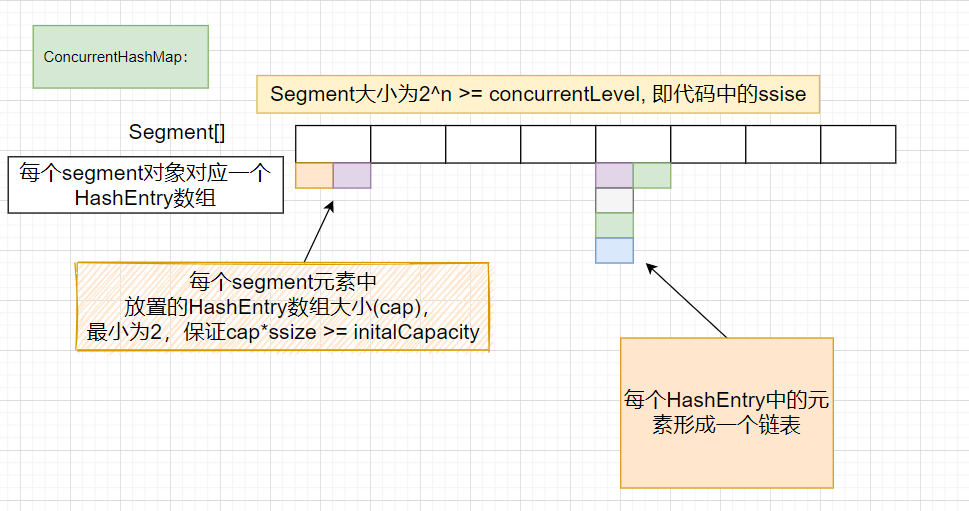
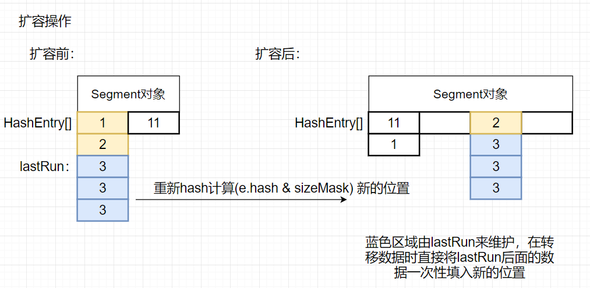
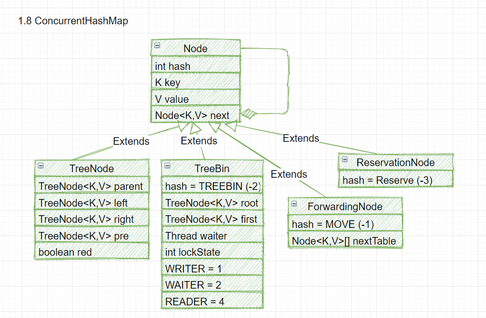
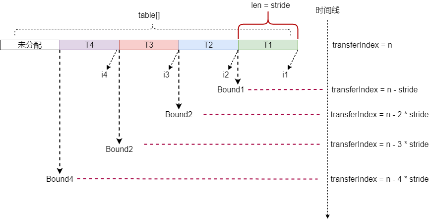
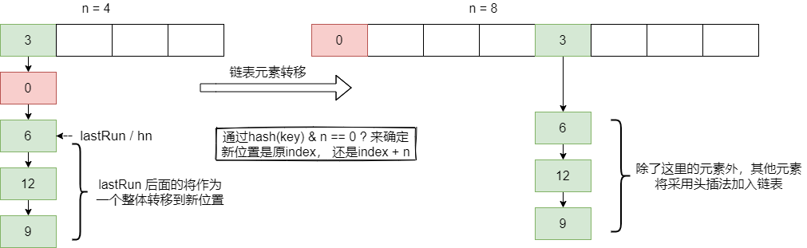
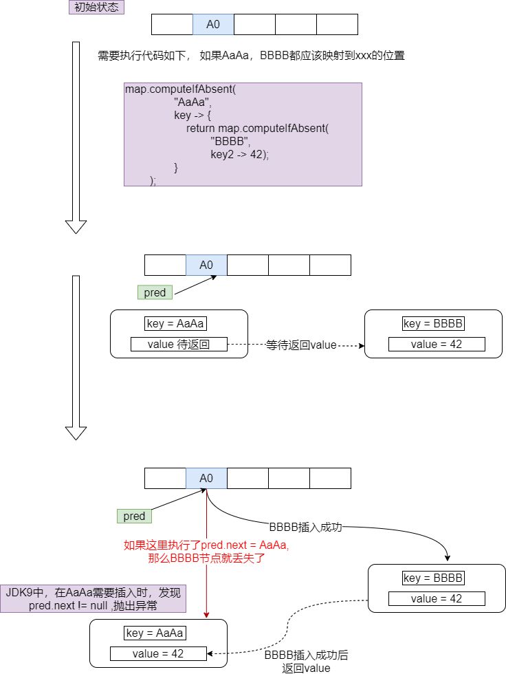
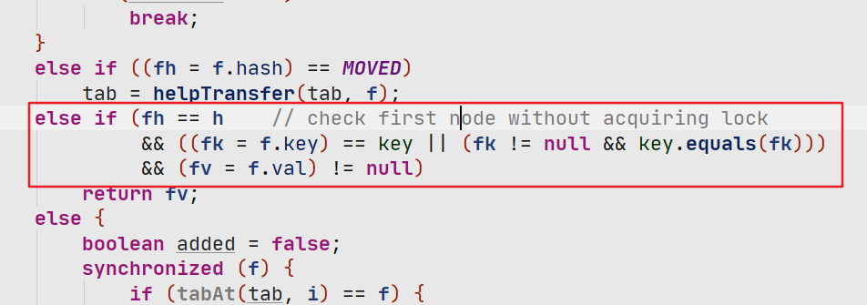

## ConcurrentHashMap

### Unsafe基本操作

```java
public class Person {
    private int i = 0;
    private static sun.misc.Unsafe UNSAFE;
    // 获取偏移量
    private static long I_OFFSET;
    private String[] table = {"1", "2", "3", "4"};
    static {
        try {
            Field field = Unsafe.class.getDeclaredField("theUnsafe");
            field.setAccessible(true);
            UNSAFE = (Unsafe) field.get(null);
            I_OFFSET = UNSAFE.objectFieldOffset(Person.class.getDeclaredField("i"));
        } catch (IllegalAccessException e) {
            e.printStackTrace();
        } catch (NoSuchFieldException e) {
            e.printStackTrace();
        }
    }

    public static void main(String[] args) {
        final Person person = new Person();
        new Thread(new Runnable() {
            @Override
            public void run() {
                while (true) {
                    // person.i++;

                    // CAS操作的对象，操作属性的偏移量，当前值，更改后的值
                    boolean flag  = UNSAFE.compareAndSwapInt(person, I_OFFSET, person.i, person.i + 1);
                    if (flag) {
                        // 获取内存中的值
                        System.out.println(UNSAFE.getIntVolatile(person, I_OFFSET));
                    }
                    try {
                        TimeUnit.SECONDS.sleep(1);
                    } catch (InterruptedException e) {
                        e.printStackTrace();
                    }
                }
            }
        }).start();

        new Thread(new Runnable() {
            @Override
            public void run() {
                while (true) {
                    boolean flag  = UNSAFE.compareAndSwapInt(person, I_OFFSET, person.i, person.i + 1);
                    if (flag) {
                        // 获取内存中的值
                        System.out.println(UNSAFE.getIntVolatile(person, I_OFFSET));
                    }
                    try {
                        TimeUnit.SECONDS.sleep(1);
                    } catch (InterruptedException e) {
                        e.printStackTrace();
                    }
                }
            }
        }).start();

        // 获取数组中的值
        
        // 数组中存储的对象的对象头的大小  4
        int ns = UNSAFE.arrayIndexScale(String[].class);
        // 数组中第一个元素的起始位置
        int base = UNSAFE.arrayBaseOffset(String[].class);
        System.out.println(UNSAFE.getObject(person.table, base + 1 * ns));
    }
}
```


### JDK7

> 使用分段锁的机制，多数操作都是使用Unsafe方法来操作内存中的数据，而不是通过修改工作空间的数据，以及CAS操作来修改数据
>
> 初始化segment数组大小（concurrentLevel， 默认16）后，就不会变了
>
> 扩容时是对Segment中HashEntry进行扩容(元素数量大于阈值），而不是对整个Segment数组进行扩容
>
> 插入数据时对单个Segment进行加锁，Segment继承了ReentrantLock，依然是采用的头插法
>
> get元素时不需要加锁，因为HashEntry中的value是由volatile修饰的




#### 构造方法

```java
// 用于存储数据的数组
final Segment<K,V>[] segments;
Segment {
    HashEntry[] tab;
}
transient Set<K> keySet;
transient Set<Map.Entry<K,V>> entrySet;
transient Collection<V> values;

public ConcurrentHashMap(int initialCapacity,
                         float loadFactor, int concurrencyLevel) {
    if (!(loadFactor > 0) || initialCapacity < 0 || concurrencyLevel <= 0)
        throw new IllegalArgumentException();
    if (concurrencyLevel > MAX_SEGMENTS)
        concurrencyLevel = MAX_SEGMENTS;
    // Find power-of-two sizes best matching arguments
    int sshift = 0;
    int ssize = 1;  // segment 数组的大小
    // ssize = 2 ^ n >= concurrentLevel
    while (ssize < concurrencyLevel) {
        // 
        ++sshift;
        ssize <<= 1;
    }
    // sshift : 4
    this.segmentShift = 32 - sshift; // 28
    this.segmentMask = ssize - 1;  	// segment.length - 1, 用于后面运算存储的下标，
	//  在put方法中运算下标：  int j = (hash >>> segmentShift) & segmentMask;
    if (initialCapacity > MAXIMUM_CAPACITY)
        initialCapacity = MAXIMUM_CAPACITY;
    int c = initialCapacity / ssize;
    // c向上取整，为了保证能够将initialCapacity存储下来
    // 如果inititalCapacity：33， ssize 16， 那么c为3，才能将33(ssize* c >= capacity)个capacity保存下来
    if (c * ssize < initialCapacity)
        ++c;
    // 每个Segment中最少为2
    int cap = MIN_SEGMENT_TABLE_CAPACITY;
    while (cap < c)
        cap <<= 1;
    // create segments and segments[0]
    Segment<K,V> s0 =
        new Segment<K,V>(loadFactor, (int)(cap * loadFactor),
                         (HashEntry<K,V>[])new HashEntry[cap]);
    Segment<K,V>[] ss = (Segment<K,V>[])new Segment[ssize];
    // 将s0放到ss中的第0个位置，在后续的添加元素时，如果这个位置为空，则会进行new Segment来生成一个Segment对象，通过ss0中的元素来确定每个位置中的数据到底有几个HashEntry 
    UNSAFE.putOrderedObject(ss, SBASE, s0); // ordered write of segments[0]
    this.segments = ss;
}

```

#### HashEntry

```java
static final class HashEntry<K,V> {
    final int hash;
    final K key;
    volatile V value;
    volatile HashEntry<K,V> next;

    HashEntry(int hash, K key, V value, HashEntry<K,V> next) {
        this.hash = hash;
        this.key = key;
        this.value = value;
        this.next = next;
    }
```


#### put元素

```java
// put元素

public V put(K key, V value) {
    Segment<K,V> s;
    if (value == null)
        throw new NullPointerException();
    int hash = hash(key);
    // 获取应该放入segment的位置
    // segmentShift在构造方法中生成的默认值为28，将高四位来与segmentMask进行与操作
    int j = (hash >>> segmentShift) & segmentMask;
    
	
    // Class sc = Segment[].class;
    //SBASE = UNSAFE.arrayBaseOffset(sc);
    // ss = UNSAFE.arrayIndexScale(sc);
    // SSHIFT = 31 - Integer.numberOfLeadingZeros(ss);
    // Integer.numberOfLeadingZeros(1) ： 返回除了低位1右边的位数0后，剩下0的个数
	
    //都是取数组中第j个位置的元素
	// UNSAFE.getObject(segments, (j <<SSHIFT) + SBASE)
	// UNSAFE.getObject(segments, SBASE + j*ss)
   // 判断j位置中是否为null，如果为null的话，就调用ensureSegment生成一个segment对象
    if ((s = (Segment<K,V>)UNSAFE.getObject          // nonvolatile; recheck
         (segments, (j << SSHIFT) + SBASE)) == null) //  in ensureSegment
        s = ensureSegment(j);
    return s.put(key, hash, value, false);
}

			
// 静态内部类segment中的方法
final V put(K key, int hash, V value, boolean onlyIfAbsent) {
    // 尝试进行加锁
    HashEntry<K,V> node = tryLock() ? null :
    scanAndLockForPut(key, hash, value);
    V oldValue;
    try {
        HashEntry<K,V>[] tab = table;
        int index = (tab.length - 1) & hash;
        //first 相当于index位置的一个链表，类似于hashMap
        HashEntry<K,V> first = entryAt(tab, index);
        // 从first开始遍历这个链表
        for (HashEntry<K,V> e = first;;) {
            // 依次遍历
            if (e != null) {
                K k;
                // 如果有一个相同的key存在，则根据onlyIfAbsent的值来觉得是否替换成为新值
                if ((k = e.key) == key ||
                    (e.hash == hash && key.equals(k))) {
                    oldValue = e.value;
                    if (!onlyIfAbsent) {
                        e.value = value;
                        ++modCount;
                    }
                    break;
                }
                e = e.next;
            }
            // 遍历到末尾没有发现相同的值，则在头部插入一个新值
            else {
                if (node != null)
                    node.setNext(first);
                else
                    // 将新值插入到头部，node.next = first
                    node = new HashEntry<K,V>(hash, key, value, first);
                int c = count + 1;
                // 判断是否进行扩容
                if (c > threshold && tab.length < MAXIMUM_CAPACITY)
                    rehash(node);
                else
                    // 更新index位置的链表
                    setEntryAt(tab, index, node);
                ++modCount;
                count = c;
                oldValue = null;
                break;
            }
        }
    } finally {
        unlock();
    }
    return oldValue;
}

// 尝试进行加锁，同时new一个对象
private HashEntry<K,V> scanAndLockForPut(K key, int hash, V value) {
    // 获取hash值对应的链表
    HashEntry<K,V> first = entryForHash(this, hash);
    HashEntry<K,V> e = first;
    HashEntry<K,V> node = null;
    int retries = -1; // negative while locating node
    while (!tryLock()) {
        HashEntry<K,V> f; // to recheck first below
        if (retries < 0) {
            // 如果当前first为null，则new 一个HashEntry
            if (e == null) {
                if (node == null) // speculatively create node
                    node = new HashEntry<K,V>(hash, key, value, null);
                retries = 0;
            }
            else if (key.equals(e.key))
                retries = 0;
            else
                e = e.next;
        }
        // 重试最大CPU核心数 64
        else if (++retries > MAX_SCAN_RETRIES) {
            lock();
            break;
        }
        // retries为偶数时进行判断一次first是否变化
        else if ((retries & 1) == 0 &&
                 (f = entryForHash(this, hash)) != first) {
            e = first = f; // re-traverse if entry changed
            retries = -1;
        }
    }
    return node;
}

/**
     * Returns the segment for the given index, creating it and
     * recording in segment table (via CAS) if not already present.
     *
     * @param k the index
     * @return the segment
     */
@SuppressWarnings("unchecked")
private Segment<K,V> ensureSegment(int k) {
    final Segment<K,V>[] ss = this.segments;
    // 获取当前位置偏移量
    long u = (k << SSHIFT) + SBASE; // raw offset
    // 需要生成的segment对象
    Segment<K,V> seg;
    // 判断第u个位置是否为空
    if ((seg = (Segment<K,V>)UNSAFE.getObjectVolatile(ss, u)) == null) {
        // 获取ss[0]位置的对象作为原型，计算每个segment中的元素的个数
        Segment<K,V> proto = ss[0]; // use segment 0 as prototype
        int cap = proto.table.length;
        float lf = proto.loadFactor;
        int threshold = (int)(cap * lf);
        HashEntry<K,V>[] tab = (HashEntry<K,V>[])new HashEntry[cap];
        if ((seg = (Segment<K,V>)UNSAFE.getObjectVolatile(ss, u))
            == null) { // recheck， 为了性能问题，进行多次check
            // 真正要插入的对象
            Segment<K,V> s = new Segment<K,V>(lf, threshold, tab);
            // 通过自旋来判断第u个位置是否已经成功添加对象成功
            // 使用while可以防止在下面if判断false后，又有另外一个线程将这个值remove掉了，那么会继续循环，而不是直接跳出循环
            while ((seg = (Segment<K,V>)UNSAFE.getObjectVolatile(ss, u))
                   == null) {
                // 防止多个线程同时修改，前面的判断主要是为了性能的优化，防止做过多的CAS
                if (UNSAFE.compareAndSwapObject(ss, u, null, seg = s))
                    break;
            }
        }
    }
    return seg;
}
```


#### 扩容

- 

  

```java
// 进行扩容操作，同时将node插入到合适的位置上
private void rehash(HashEntry<K,V> node) {
    HashEntry<K,V>[] oldTable = table;
    int oldCapacity = oldTable.length;
    int newCapacity = oldCapacity << 1;
    threshold = (int)(newCapacity * loadFactor);
    HashEntry<K,V>[] newTable =
        (HashEntry<K,V>[]) new HashEntry[newCapacity];
    int sizeMask = newCapacity - 1;
    for (int i = 0; i < oldCapacity ; i++) {
        HashEntry<K,V> e = oldTable[i];
        if (e != null) {
            HashEntry<K,V> next = e.next;
            int idx = e.hash & sizeMask;
            if (next == null)   //  Single node on list
                newTable[idx] = e;
            else { // Reuse consecutive sequence at same slot
                // 如果最后几个元素将插入的位置算出来是一样的， 那么将最后几个元素直接插入到新的位置上
                HashEntry<K,V> lastRun = e;
                int lastIdx = idx;
                for (HashEntry<K,V> last = next;
                     last != null;
                     last = last.next) {
                    int k = last.hash & sizeMask;
                    if (k != lastIdx) {
                        lastIdx = k;
                        lastRun = last;
                    }
                }
                newTable[lastIdx] = lastRun;
                // Clone remaining nodes
                // 采用头插法插入到新的位置上， lastRun后面的元素都在上面一步插入完成
                for (HashEntry<K,V> p = e; p != lastRun; p = p.next) {
                    V v = p.value;
                    int h = p.hash;
                    int k = h & sizeMask;
                    HashEntry<K,V> n = newTable[k];
                    newTable[k] = new HashEntry<K,V>(h, p.key, v, n);
                }
            }
        }
    }
    // 将要插入的元素放到合适的位置，因为这个方法是在put中调用的。
    int nodeIndex = node.hash & sizeMask; // add the new node
    node.setNext(newTable[nodeIndex]);
    newTable[nodeIndex] = node;
    table = newTable;
}
```


#### get

```java
public V get(Object key) {
    Segment<K,V> s; // manually integrate access methods to reduce overhead
    HashEntry<K,V>[] tab;
    int h = hash(key);
    // 算出key在segment数组中的位置
    long u = (((h >>> segmentShift) & segmentMask) << SSHIFT) + SBASE;
    if ((s = (Segment<K,V>)UNSAFE.getObjectVolatile(segments, u)) != null &&
        (tab = s.table) != null) {
        // 计算当前key在HashEntry数组中的位置，同时遍历这个链表，来查找这个数据
        for (HashEntry<K,V> e = (HashEntry<K,V>) UNSAFE.getObjectVolatile
             (tab, ((long)(((tab.length - 1) & h)) << TSHIFT) + TBASE);
             e != null; e = e.next) {
            K k;
            if ((k = e.key) == key || (e.hash == h && key.equals(k)))
                return e.value;
        }
    }
    return null;
}
```

#### size

> 先尝试2次（实际会循环3次，第一次统计初始值）不加锁来统计count的值，如果每次统计的结果跟上次得出的值相同，则说明没有被其他线程修改，直接返回此时的值。
>
> 如果2次统计内每次的结果跟上次所得出的值不同，那么就对所有segment进行加锁，统计完成后在解锁

```java
public int size() {
    // 先尝试2次不加锁的方式进行获取count的值，如果count的值跟modCount不同说明被其他线程改变了，那么使用加锁的方式来统计所有segment中元素的大小
    final Segment<K,V>[] segments = this.segments;
    int size;
    boolean overflow; // true if size overflows 32 bits
    long sum;         // sum of modCounts
    long last = 0L;   // previous sum
    int retries = -1; // first iteration isn't retry
    try {
        for (;;) {
            // 在加锁之前只重试2次
            if (retries++ == RETRIES_BEFORE_LOCK) {
                // 对所有segment进行加锁
                for (int j = 0; j < segments.length; ++j)
                    ensureSegment(j).lock(); // force creation
            }
            sum = 0L;
            size = 0;
            overflow = false;
            for (int j = 0; j < segments.length; ++j) {
                Segment<K,V> seg = segmentAt(segments, j);
                if (seg != null) {
                    sum += seg.modCount;
                    int c = seg.count;
                    if (c < 0 || (size += c) < 0)
                        overflow = true;
                }
            }
            // 进行多次遍历判断是否相等，相等则break
            if (sum == last)
                break;
            last = sum;
        }
    } finally {
        if (retries > RETRIES_BEFORE_LOCK) {
            // 解锁
            for (int j = 0; j < segments.length; ++j)
                segmentAt(segments, j).unlock();
        }
    }
    return overflow ? Integer.MAX_VALUE : size;
}
```


### JDK8

参考：https://mp.weixin.qq.com/s/UXV34hYMHwsFBe9AQCZvLg

> 使用Node进行元素存储
>
> CAS+自旋锁+synchronized，
>
> put: 
>
> 1. 首先计算hash，遍历node数组，如果node是空的话就采用CAS+自旋的方式进行初始化
> 2. 当元素达到阈值就触发扩容
> 3. 如果hash == MOVE， 说明有元素在扩容，执行帮助扩容代码
> 4. 如果都不满足，就使用synchronized加锁，写入数据，写入时同样需要判断是在链表上写入还是在红黑树上写入，如果是链表写入，则采用的方法与hashmap一样，使用尾插法，最后判断链表的长度是否大于8，同时数组长度大于64时， 转换为红黑树
> 5. 加载因子`固定0.75`，不可以修改，为了防止经常发生冲突
> 6. 数组采用懒初始化，在put元素时才会对数组进行初始化（默认16），如果初始化指定空间大小，那么真实capacity = `tableSizeFor(1.5 * 参数 +1)`，同时满足 capacity = 2 ^n,   如传入11~16，那么capacity就是32， 传入10，那么会变成16， tableSizeFor(n): 返回>=n且满足2^x的数

- 不能插入空值


内部节点联系图：


#### 常用属性

``` java
    // 存储数据的数组，第一次insert时被初始化，大小为2的幂
    transient volatile Node<K,V>[] table;
    
    // 扩容时使用的数组
    private transient volatile Node<K,V>[] nextTable;

    // 基本计数器的值，主要用于没有线程争夺资源时使用，通过CAS修改这个值
    private transient volatile long baseCount;

    // 0 表示未初始化
    // <0 时：-1 表示正在初始化， -(1 + 扩容线程的数量) 表示正在扩容，
    // > 0：表示下一次扩容时表的大小(阈值)，初始化后会设置sizeCtl
    // sizeCtl高16位为扩容结束标记，低16位为并发现线程数
    private transient volatile int sizeCtl;

	/**  resizeStamp()
	
	Integer.numberOfLeadingZeros(n): 返回32 - (最低位1到低位0的个数 + 1)
	
    Integer.numberOfLeadingZeros(n) | (1 << (RESIZE_STAMP_BITS - 1));
    n = 16

    0000 0000 0000 0000 0000 0000 0001 1011
    |
    0000 0000 0000 0000 1000 0000 0000 0000
    = rs = 
    0000 0000 0000 0000 1000 0000 0001 1011

    1000 0000 0001 1011 ： 作为扩容标记

    第一个线程进入时，是+2，后续线程进入时+1，退出时-1，
    然后检查-2后是否符合resizeStamp()获得的值以判断扩容是否结束。

    sizeCtl的工作逻辑为：sizeCtl = 0，为初始状态sizeCtl = -1, 
    为table创建状态sizeCtl = 2^x * 0.75，表示当前table允许的最大容量扩容时，
    sizeCtl高16位为扩容结束标记，低16位为并发现线程数
    **/

    // 扩容时开始索引
    private transient volatile int transferIndex; 
    // 转移数据时最小步长
    private static final int MIN_TRANSFER_STRIDE = 16;
    // 当扩容或创建counterCells时，使用自旋锁
    private transient volatile int cellsBusy;

    // counter cells 的数组，不为null时，大小为2^n
    private transient volatile CounterCell[] counterCells;

    // Node对象中hash取值范围：
    static final int MOVED     = -1; // hash for forwarding nodes
    static final int TREEBIN   = -2; // hash for roots of trees
    static final int RESERVED  = -3; // hash for transient reservations
    static final int HASH_BITS = 0x7fffffff; // usable bits of normal node hash
```


#### 插入数据：

```java
// 第一次插入数据时，调用这个方法进行初始化
private final Node<K,V>[] initTable() {
    Node<K,V>[] tab; int sc;
    while ((tab = table) == null || tab.length == 0) {
        if ((sc = sizeCtl) < 0)		// sizeCtl 默认为0
            // 当一个线程unsafe成功后，sizeCtl的值会被改变，让当前线程重新进入就绪对列，让CPU重新调度线程
            Thread.yield(); // lost initialization race; just spin
        else if (U.compareAndSwapInt(this, SIZECTL, sc, -1)) {
            try {
                if ((tab = table) == null || tab.length == 0) {
                    // 初始化时DEFAULT_CAPACITY = 16
                    int n = (sc > 0) ? sc : DEFAULT_CAPACITY;
                    @SuppressWarnings("unchecked")
                    Node<K,V>[] nt = (Node<K,V>[])new Node<?,?>[n];
                    table = tab = nt;
                    
                    sc = n - (n >>> 2);
                }
            } finally {
                // first: sizeCtl = sc = 12
                sizeCtl = sc;
            }
            break;
        }
    }
    return tab;
}


/** Implementation for put and putIfAbsent */
final V putVal(K key, V value, boolean onlyIfAbsent) {
    // 如果key，value中有null，则抛出异常
    if (key == null || value == null) throw new NullPointerException();
    // 计算当前要插入的hash值
    int hash = spread(key.hashCode());
    int binCount = 0;
    for (Node<K,V>[] tab = table;;) {
        Node<K,V> f; int n, i, fh;
        if (tab == null || (n = tab.length) == 0)
            // 初始化数组
            tab = initTable();
        else if ((f = tabAt(tab, i = (n - 1) & hash)) == null) { // 计算当前下标是否有元素存在
            // 使用CAS在tab的i位置创建一个Node对象
            if (casTabAt(tab, i, null,
                         new Node<K,V>(hash, key, value, null)))
                break;                   // no lock when adding to empty bin
        }
        else if ((fh = f.hash) == MOVED)
            // 如果在扩容，帮助转移元素
            tab = helpTransfer(tab, f);
        else {	
            V oldVal = null;
            // 对计算出的数组下标的对象加synchronized
            synchronized (f) {
                // 再次判断当前下标对应的对象是否被修改过
                if (tabAt(tab, i) == f) {
                    // 为链表
                    if (fh >= 0) {
                        binCount = 1;	// 链表长度为1，能够进入这个方法说明当前位置上肯定至少有一个元素存在
                        // 遍历链表，将待插入的元素插入或则更新
                        for (Node<K,V> e = f;; ++binCount) {
                            K ek;
                            // 如果在当前链表中找到了一个相同的key，那么更新这个位置的value
                            if (e.hash == hash &&
                                ((ek = e.key) == key ||
                                 (ek != null && key.equals(ek)))) {
                                oldVal = e.val;
                                if (!onlyIfAbsent)
                                    e.val = value;
                                break;
                            }
                            Node<K,V> pred = e;
                            // 遍历到链表上最后一个元素，在链表最后一个元素上插入一个Node结点
                            if ((e = e.next) == null) {
                                pred.next = new Node<K,V>(hash, key,
                                                          value, null);
                                break;
                            }
                        }
                    }
                    else if (f instanceof TreeBin) { // 如果是红黑树，则调用红黑树的插入操作
                        Node<K,V> p;
                        binCount = 2;
                        if ((p = ((TreeBin<K,V>)f).putTreeVal(hash, key,
                                                              value)) != null) {
                            oldVal = p.val;
                            if (!onlyIfAbsent)
                                p.val = value;
                        }
                    }
                }
            }
            if (binCount != 0) {
                // 如果链表长度>= 8 , 调用树化方法将链表转为双向链表，这里还没有转红黑树
                if (binCount >= TREEIFY_THRESHOLD)
                    treeifyBin(tab, i);
                if (oldVal != null)
                    return oldVal;
                break;
            }
        }
    }
    addCount(1L, binCount);
    return null;
}

```


#### 并发计算元素大小

**addCount()**

> 主要用于存储hashMap中元素的个数，使用cell数组来对多个线程进行分开计算，采用分而治之的办法来减少锁的粒度， 类似于LongAdder类

```java
/**
     * Adds to count, and if table is too small and not already
     * resizing, initiates transfer. If already resizing, helps
     * perform transfer if work is available.  Rechecks occupancy
     * after a transfer to see if another resize is already needed
     * because resizings are lagging additions.
     * @param x the count to add.
     * @param check if <0, don't check resize, if <= 1 only check if uncontended
     */
// check : 如果是从putVal方法调用的话，check > 0， 表示binCount
// 在remove方法中： addCount(-1L, -1)，即减少一个元素
private final void addCount(long x, int check) {
    CounterCell[] as; long b, s;
    // counterCells数组为空、 修改BASECOUNT存在线程竞争
    if ((as = counterCells) != null ||
        !U.compareAndSwapLong(this, BASECOUNT, b = baseCount, s = b + x)) {
        CounterCell a; long v; int m;
        boolean uncontended = true;
        // 如果CounterCell数组为null、当前hash值对应的下标位置为null、CAS操作失败
        if (as == null || (m = as.length - 1) < 0 ||
            (a = as[ThreadLocalRandom.getProbe() & m]) == null ||
            !(uncontended =
              U.compareAndSwapLong(a, CELLVALUE, v = a.value, v + x))) {
            // 将x值填入到CounterCell数组中
            fullAddCount(x, uncontended);
            return;
        }
        // 这里是有remvoe方法触发的
        if (check <= 1)
            return;
        // 计算HashMap中所有元素的大小
        s = sumCount();
    }
    if (check >= 0) {
        Node<K,V>[] tab, nt; int n, sc;
        // 当元素的个数> sizeCtl(阈值)，tab长度 < 	MAXIMUM_CAPACITY，进行扩容操作，
        // 使用while：为了防止当前线程扩容完成后，在这个扩容过程中，其他线程又插入了很多元素，满足二次扩容的条件时，则继续调用扩容
        while (s >= (long)(sc = sizeCtl) && (tab = table) != null &&
               (n = tab.length) < MAXIMUM_CAPACITY) {
            int rs = resizeStamp(n);
            if (sc < 0) {
                if ((sc >>> RESIZE_STAMP_SHIFT) != rs || sc == rs + 1 ||
                    sc == rs + MAX_RESIZERS || (nt = nextTable) == null ||
                    transferIndex <= 0)
                    break;
                // 继续CAS更该SIZECTL，调用transfer帮助扩容
                if (U.compareAndSwapInt(this, SIZECTL, sc, sc + 1))
                    transfer(tab, nt);
            }
            // 进入这个while中，首先是满足这个if，然后将sc更改为一个很小的负数，这里CAS成功后其他线程才可能执行第一个if语句
            else if (U.compareAndSwapInt(this, SIZECTL, sc,
                                         (rs << RESIZE_STAMP_SHIFT) + 2))
                transfer(tab, null);
            s = sumCount();
        }
    }
}
/**
     * Returns the stamp bits for resizing a table of size n.
     * Must be negative when shifted left by RESIZE_STAMP_SHIFT.
     */
// 当返回的值向左移动RESIZE_STAMP_SHIFT位一定返回一个负数
static final int resizeStamp(int n) {
    // numberOfLeadingZeros：返回最高位之前0的个数
    return Integer.numberOfLeadingZeros(n) | (1 << (RESIZE_STAMP_BITS - 1));
}
// 参考LongAdder类
private final void fullAddCount(long x, boolean wasUncontended) {
    int h;
    if ((h = ThreadLocalRandom.getProbe()) == 0) {
        ThreadLocalRandom.localInit();      // force initialization
        h = ThreadLocalRandom.getProbe();
        wasUncontended = true;
    }
    boolean collide = false;                // True if last slot nonempty
    for (;;) {
        CounterCell[] as; CounterCell a; int n; long v;
        if ((as = counterCells) != null && (n = as.length) > 0) {
            if ((a = as[(n - 1) & h]) == null) {
                if (cellsBusy == 0) {            // Try to attach new Cell
                    CounterCell r = new CounterCell(x); // Optimistic create
                    if (cellsBusy == 0 &&
                        U.compareAndSwapInt(this, CELLSBUSY, 0, 1)) {
                        boolean created = false;
                        try {               // Recheck under lock
                            CounterCell[] rs; int m, j;
                            if ((rs = counterCells) != null &&
                                (m = rs.length) > 0 &&
                                rs[j = (m - 1) & h] == null) {
                                rs[j] = r;
                                created = true;
                            }
                        } finally {
                            cellsBusy = 0;
                        }
                        if (created)
                            break;
                        continue;           // Slot is now non-empty
                    }
                }
                collide = false;
            }
            else if (!wasUncontended)       // CAS already known to fail
                wasUncontended = true;      // Continue after rehash
            else if (U.compareAndSwapLong(a, CELLVALUE, v = a.value, v + x))
                break;
            else if (counterCells != as || n >= NCPU)
                collide = false;            // At max size or stale
            else if (!collide)
                collide = true;
            else if (cellsBusy == 0 &&
                     U.compareAndSwapInt(this, CELLSBUSY, 0, 1)) {
                try {
                    // 对CounterCell数组进行扩容
                    if (counterCells == as) {// Expand table unless stale
                        CounterCell[] rs = new CounterCell[n << 1];
                        for (int i = 0; i < n; ++i)
                            rs[i] = as[i];
                        counterCells = rs;
                    }
                } finally {
                    cellsBusy = 0;
                }
                collide = false;
                continue;                   // Retry with expanded table
            }
            // 重新计算出一个新的hash值
            h = ThreadLocalRandom.advanceProbe(h);
        }
        else if (cellsBusy == 0 && counterCells == as &&
                 U.compareAndSwapInt(this, CELLSBUSY, 0, 1)) {
            boolean init = false;
            try {                           // Initialize table
                if (counterCells == as) {
                    CounterCell[] rs = new CounterCell[2];
                    rs[h & 1] = new CounterCell(x);
                    counterCells = rs;
                    init = true;
                }
            } finally {
                cellsBusy = 0;
            }
            if (init)
                break;
        }
        else if (U.compareAndSwapLong(this, BASECOUNT, v = baseCount, v + x))
            break;                          // Fall back on using base
    }
}
```


#### 并发扩容

transfer()

> 采用多个线程同时扩容，通过竞争transferIndex来区分扩容的哪一部分元素，当一个位置元素转移完成后将会把原数组原位置置为forwardingNode，forwardingNode节点中包含了扩容后的数组nextTab




#### 数据转移

> 扩容后新位置变化过程

链表元素转移， 这里的`头插法`并不会发生循环链表，在转移元素时加了synchronized




代码如下：

```java
synchronized (f) {	// f表示数组元素Node，首先进行加锁
    if (tabAt(tab, i) == f) {
        Node<K,V> ln, hn;
        if (fh >= 0) {	// 表示当前位置的元素的是以链表形式存在，而不是以红黑树
            int runBit = fh & n;	// 通过位运算判断新的元素应该转移到的目标地址
            Node<K,V> lastRun = f;
            for (Node<K,V> p = f.next; p != null; p = p.next) {
                int b = p.hash & n; // b == 0 说明元素在新数组中的位置不变
                if (b != runBit) {
                    runBit = b;
                    lastRun = p;
                }
            }
            if (runBit == 0) {
                ln = lastRun;
                hn = null;
            }
            else {
                hn = lastRun;
                ln = null;
            }
            // 将lastRun 前面的数据以头插法连接到ln，hn上
            for (Node<K,V> p = f; p != lastRun; p = p.next) {
                int ph = p.hash; K pk = p.key; V pv = p.val;
                if ((ph & n) == 0)
                    ln = new Node<K,V>(ph, pk, pv, ln);
                else
                    hn = new Node<K,V>(ph, pk, pv, hn);
            }
            // 转移链表到新数组中
            setTabAt(nextTab, i, ln);
            setTabAt(nextTab, i + n, hn);
            setTabAt(tab, i, fwd);	// 对老数组填充fwd，标记已经被转移
            advance = true;
        }
        else if (f instanceof TreeBin) {	// 红黑树转移
            TreeBin<K,V> t = (TreeBin<K,V>)f;
            TreeNode<K,V> lo = null, loTail = null;
            TreeNode<K,V> hi = null, hiTail = null;
            int lc = 0, hc = 0;
            for (Node<K,V> e = t.first; e != null; e = e.next) {
                int h = e.hash;
                TreeNode<K,V> p = new TreeNode<K,V>
                    (h, e.key, e.val, null, null);
                if ((h & n) == 0) {	// true: 新数组中的位置索引等于当前位置索引
                    if ((p.prev = loTail) == null)	
                        lo = p;	// 以p作为根结点
                    else
                        loTail.next = p;
                    loTail = p;
                    ++lc; // 记录元素个数
                }
                else {
                    if ((p.prev = hiTail) == null)
                        hi = p; // 作为根结点
                    else
                        hiTail.next = p;
                    hiTail = p;
                    ++hc;
                }
            }
            // 是否树化
            ln = (lc <= UNTREEIFY_THRESHOLD) ? untreeify(lo) :
            (hc != 0) ? new TreeBin<K,V>(lo) : t;
            hn = (hc <= UNTREEIFY_THRESHOLD) ? untreeify(hi) :
            (lc != 0) ? new TreeBin<K,V>(hi) : t;
            setTabAt(nextTab, i, ln);
            setTabAt(nextTab, i + n, hn);
            setTabAt(tab, i, fwd);
            advance = true;
        }
    }
}
```


**key(hash) & n 理解：**

> 为什么是用key(hash) & n 而不用  key(hash) & (n - 1)？

- 他们都能区分该元素的新位置是 原位置， 还是原位置+n

- 采用第二种运算是为了计算应该放在哪个具体位置，而这里并不需要计算具体位置，因为元素位置只有两种选择，加上运算方便采用了key(hash) & n

```java
// 如果n = 16， 扩容后 2n = 32
// 在计算索引时，index = hash(key) & (n - 1)
// 即  n = 16 时，计算索引如下
    0000 1111
&   **** xxxx
	0000 xxxx	// 结果

// 当  n = 32 时
    0001 1111
&   ***x xxxx
	000b xxxx
// 此时结果为 000b 0000 + 0000 xxxx         
// 如果b为1， 那么000b 0000 就等于n，也即原数组长度， 如果b为0，结果跟原来是一样的
        
 // 因此一个链表中的元素重新计算位置得出的结果，要么是原来同一个位置（高位为0），要么是加上原数组长度（高位为1）


/* 代码中2430行 解释
int runBit = fh & n;	// 计算高位是否为0
*/
如果原来数组长度为n = 16，扩容后n = 32
运算如下：
   0001 0000  // n = 16
&  xxxx xxxx
   000x 0000 
    
从上面运算可以看出，结果只与n的高位1位置有关，如果高位1对应位置的hash值也是1，那么扩容后该元素的位置一定是原位置+n

// ln 的链表用来放在低位，hn的链表放在高位
// runBit为0 说明lastRun后面的节点都应该放在原来相同的索引位置
if (runBit == 0) {
    ln = lastRun;
    hn = null;
}
else { // 这里runBit只能是高位为1， lastRun后面的节点都移动到原位置+n 的位置
    hn = lastRun;
    ln = null;
}
```


#### 获取元素

> 获取元素不需要加锁，即便是在扩容过程中，也不影响该操作

```java
public V get(Object key) {
    Node<K,V>[] tab; Node<K,V> e, p; int n, eh; K ek;
    int h = spread(key.hashCode());
    if ((tab = table) != null && (n = tab.length) > 0 &&
        (e = tabAt(tab, (n - 1) & h)) != null) {
        
        if ((eh = e.hash) == h) {
            if ((ek = e.key) == key || (ek != null && key.equals(ek)))
                return e.val;
        }
        // < 0: -1，说明此时可能是forwardingNode 填充， 表示多线程扩容进行过程中，将会通过nextTable 来查找元素
        // 		-2，调用红黑树中的查找方法
        //		-3, 被ReservationNode填充，该处为空元素，find方法直接返回null
        else if (eh < 0) 
            return (p = e.find(h, key)) != null ? p.val : null;
        while ((e = e.next) != null) {	// 普通Node节点，表示该位置还是一个链表结构
            if (e.hash == h &&
                ((ek = e.key) == key || (ek != null && key.equals(ek))))
                return e.val;
        }
    }
    return null;
}
```


#### sizeCtl属性理解

- volatile修饰，保证了内存可见性，当一个线程修改后，其他线程能够获取到新的值

- 根据注释，sizeCtl 大概有下面含义：

  - sizeCtl == 0时，表示table数组还没有初始化，还处于默认值，默认当putVal调用后才会初始化（初始化指定空间时， sizeCtl 为数组的初始大小）

  - sizeCtl == -1时，表示table数组正在初始化，此时其他线程如果发现为-1，则让出时间片 

    （JDK8中 ,   2227行，Thread.yield)

  - sizeCtl > 0时，表示下一次扩容时的阈值，数组容量的0.75倍 （JDK 8 loadFactor 始终为0.75）
  - sizeCtl < -1时， 此时说明`有线程在进行扩容`，  扩容线程数为低16位的值 - 1

- 先看下resizeStamp这个方法：

  ```java
  static final int resizeStamp(int n) {
      return Integer.numberOfLeadingZeros(n) | (1 << (RESIZE_STAMP_BITS - 1));
  }
  numberOfLeadingZeros(n)：
      这个方法表示将n表示成二进制时，高位1左边0的位数
      n = 5， 即 0101， 高位1在第3位， int 一共32 位， 左边0的位数 = 32 - 3 = 29
  
  如果  n = 16，resizeStamp计算过程如下
  0000 0000 0000 0000 0000 0000 0001 1011	// numberOfLeadingZeros(16)=27
  |
  0000 0000 0000 0000 1000 0000 0000 0000	// RESIZE_STAMP_BITS = 16
  =
  0000 0000 0000 0000 1000 0000 0001 1011 = rs
  
  // compareAndSwapInt(this, SIZECTL, sc, (rs << RESIZE_STAMP_SHIFT) + 2)
  sc = rs << 16 + 2 = 
  1000 0000 0001 1011 0000 0000 0000 0000 + 2 ： 作为扩容标记，此时 sc < 0
      
  // 简单说下第一次扩容时在addCount的代码，大体如下
  sc = sizeCtl	// 记录最初阈值
  int rs = resizeStamp(n);	// 计算得出标志信息
  // 对rs 左移16 位 + 2， 赋给sizeCtl， 此时sizeCtl首位为1  < 0, 通过这个标记来判断是否有线程在扩容
  U.compareAndSwapInt(this, SIZECTL, sc, (rs << RESIZE_STAMP_SHIFT) + 2)
      
  // 也就是说扩容的第一个线程让sizectl 低16位为2， 
  ```
  
  

**下面详细介绍，扩容时sizeCtl变化过程：**

- 最初table数组初始化完成后，sizeCtl记录的是阈值
- 在执行putVal方法结束时，会调用addCount 重新计算 元素个数s，
- 最开始处理扩容的线程将最后退出方法

##### addCount 部分代码如下：

> JDK14 中有一些变化，JDK8有bug
>
> https://github.com/openjdk/jdk/blame/jdk-19%2B11/src/java.base/share/classes/java/util/concurrent/ConcurrentHashMap.java

```java
private final void addCount(long x, int check) {
    CounterCell[] as; long b, s;
    if ((as = counterCells) != null ||
        !U.compareAndSwapLong(this, BASECOUNT, b = baseCount, s = b + x)) {
         ...// 通过 countCell 数组来记录table数组的元素数量 
        // s 为元素的个数
        s = sumCount();
    }
    
    // check: 如果当前方法是有插入操作调用来的，则
    // 如果插入元素位置为链表，表示该链表的长度， 该位置为红黑树，则为2
    if (check >= 0) {
        Node<K,V>[] tab, nt; int n, sc;
        // s是否大于sizeCtl（没有扩容前为阈值， 开始扩容后 < -1）
        // 这里成立说明需要进行扩容
        // while 表示如果当前转移完成，继续进入transfer转移下一个位置元素
        while (s >= (long)(sc = sizeCtl) && (tab = table) != null &&
               (n = tab.length) < MAXIMUM_CAPACITY) {
            // resizeStamp 计算得出一个标志信息
            int rs = resizeStamp(n); // JDK14 改为 resizeStamp << 16, 不然下面的判断都是有bug 的
            // sc < 0 为true: 说明有其他线程在进行扩容，
            // false：sc等于阈值, 所有扩容线程以及结束
            if (sc < 0) {
                // if 。。判断扩容是否已经完成 true: 表示已完成， false：没有结束
                // condition1： 在扩容时，第一个线程左移16 + 2，完成时-2，
                // 				这里判断本次扩容标记值是否改变,按道理同一次扩容应该保持相等， JDK14 已经删除
                // condition2： 表示扩容已经完成，即：扩容前的resizeStamp = 扩容后的resizeStamp + 1， 这里有bug，JDK14 靠上面rs的更改修复
	            //    int i = Integer.numberOfLeadingZeros(8) | (1 << (15));
     			//    int i2 = Integer.numberOfLeadingZeros(16) | (1 << (15));
                //    即：  i == i2 + 1
                // condition3: 是否达到最大扩容线程数， sc低16位全部为1， JDK14 靠上面rs的更改修复BUG
                // condition4: nextTable 是否为null，为null说明扩容已经结束，这里的判断也保证了多个线程在扩容时nextTab是同一个数组
                // condition5： transferIndex<= 0: 表示其他线程将扩容区间竞争完了，本线程无法继续帮助转移数据
                if ((sc >>> RESIZE_STAMP_SHIFT) != rs || sc == rs + 1 ||
                    sc == rs + MAX_RESIZERS || (nt = nextTable) == null ||
                    transferIndex <= 0)
                    break;
                // 当前线程进行transfer帮助转移数据， sizeCtl +1
                if (U.compareAndSwapInt(this, SIZECTL, sc, sc + 1))
                    transfer(tab, nt);
            }
            // 没有其他线程扩容, 当前线程为第一个扩容的线程
            // 修改sizeCtl， rs 左移16 + 2， 修改后sizeCtl < 0
            else if (U.compareAndSwapInt(this, SIZECTL, sc,
                                         (rs << RESIZE_STAMP_SHIFT) + 2))
                // 传入null,nextTab将在transfer里面初始化
                transfer(tab, null);
            s = sumCount();
        }
    }
}
```


##### helpTransfer()

在putVal方法执行时，如果发现待插入位置为 `MOVE`， 说明有线程正在对数组扩容，那么进入helpTransfer方法帮助扩容

helpTransfer方法如下：

```java
final Node<K,V>[] helpTransfer(Node<K,V>[] tab, Node<K,V> f) {
    Node<K,V>[] nextTab; int sc;
    // condition2: true 待插入位置元素已经被转移到新的数组中
    // condition3: 新数组是否已经创建，当每个位置的元素成功转移完成后都会赋ForwardingNode，同时ForwardingNode中有个属性nextTable 表示新数组
    if (tab != null && (f instanceof ForwardingNode) &&
        (nextTab = ((ForwardingNode<K,V>)f).nextTable) != null) {
        // 计算标志信息， JDK14，resizeStamp(tab.length) << RESIZE_STAMP_SHIFT;
        int rs = resizeStamp(tab.length);
        // condition1: true表示nextTab扩容正在进行，扩容结束时，nextTable = null
        // condition2: 还在进行当次扩容，在类似compute方法中会执行一些function可能有阻塞之类的
        // condition3: 小于0 说明有线程扩容
        // while 表示如果本次转移完成，继续转移其他元素
        while (nextTab == nextTable && table == tab &&
               (sc = sizeCtl) < 0) {
            // 跟addCount中类似
            if ((sc >>> RESIZE_STAMP_SHIFT) != rs || sc == rs + 1 ||
                sc == rs + MAX_RESIZERS || transferIndex <= 0)
                break;
            // 帮助扩容前， sizeCtl + 1
            if (U.compareAndSwapInt(this, SIZECTL, sc, sc + 1)) {
                transfer(tab, nextTab);
                break;
            }
        }
        return nextTab;
    }
    return table;
}
```


##### **进入transfer方法：**

```java
private final void transfer(Node<K,V>[] tab, Node<K,V>[] nextTab) {
    int n = tab.length, stride;
    // 得到每个线程转移元素时需分配的长度...
    if ((stride = (NCPU > 1) ? (n >>> 3) / NCPU : n) < MIN_TRANSFER_STRIDE)
            stride = MIN_TRANSFER_STRIDE; // subdivide range
    if (nextTab == null) {            // initiating
        // 初始化nextTab数组，长度 2n
        Node<K,V>[] nt = (Node<K,V>[])new Node<?,?>[n << 1];
        nextTab = nt;
        nextTable = nextTab;
        transferIndex = n;
    }
    // 记录新表的长度
    int nextn = nextTab.length;
    // 当原数组某个位置(K)元素转移到新数组中后，会让ForwardingNode节点放在原数组的K位置上，用于标记原数组某个位置是否已经被转移
    ForwardingNode<K,V> fwd = new ForwardingNode<K,V>(nextTab);
    boolean advance = true;		// 标记是否继续循环
    boolean finishing = false; // 所有线程转移元素是否都已完成
    for (int i = 0, bound = 0;;) {
        while (advance) {
            int nextIndex, nextBound;
            // condition1： true： 表示当前线程分配的转移区间还没有结束，继续转移未转移的元素到新数组中，--i 控制需要转移元素的位置
            // condition2： true：表示所有线程转移都已完成，正在进行回归检测
            if (--i >= bound || finishing)	
                advance = false;
            else if ((nextIndex = transferIndex) <= 0) { // 区间被分配完，无法继续竞争转移区间
                i = -1;
                advance = false;
            }
            else if (U.compareAndSwapInt
                     (this, TRANSFERINDEX, nextIndex,
                      nextBound = (nextIndex > stride ?
                                   nextIndex - stride : 0))) {
                // 得到竞争到的转移区间， bound ~ nextIndex - 1
                bound = nextBound;
                i = nextIndex - 1;
                advance = false;
            }
        }
        // condition1: true 转移区间结束,上面while中的条件二会赋值i = -1，表示transferIndex被其他线程竞争完了，无法再次竞争到区间，本线程扩容任务结束
        // 另外两个条件不可能发生， 不可能有int溢出的情况
        // https://stackoverflow.com/questions/63597067/in-concurrenthashmaps-transfer-method-i-dont-understand-the-meaning-of-these
        if (i < 0 || i >= n || i + n >= nextn) {
            int sc;
            // true: 所有线程转移都已经完成
            if (finishing) {
                nextTable = null;
                // 对table、 sizeCtl 赋新值
                table = nextTab;
                sizeCtl = (n << 1) - (n >>> 1);	// 阈值 1.5 n， 即 0.75 * (2 *n)
                return;
            }
            // 每个线程对分配的区间转移完成后，sizeCtl - 1
            if (U.compareAndSwapInt(this, SIZECTL, sc = sizeCtl, sc - 1)) {
                // 判断所有线程是否都已经完成扩容
                // 因为第一个线程扩容时， sizeCtl = resizeStamp(n) << 16 + 2
                // 注意： 这里使用的sc，而不是sizeCtl，如果这里是sizeCtl的话，可能会导致线程在这里死循环
                if ((sc - 2) != resizeStamp(n) << RESIZE_STAMP_SHIFT)
                    return;
                // 标记所有线程转移都完成
                finishing = advance = true;
                i = n; // 对i赋值n，让线程对当前数组重新扫描检查一遍，查看是否有还没有转移成功的元素，如果有，那么将其转移
            }
        }
        else if ((f = tabAt(tab, i)) == null) // 当前位置为null， 赋值ForwardingNode
            advance = casTabAt(tab, i, null, fwd);
        else if ((fh = f.hash) == MOVED)	// 当前位置元素已经被转移
            advance = true; // already processed
        else {
            synchronized (f) {
                // .... 转移f位置元素到新的位置
                // 转移结束时，i位置赋值为fwd，表示此位置元素已经被转移成功
                        setTabAt(tab, i, fwd);
                        advance = true;
                    }
                }
            }
        }
    }
}
```


#### computeIfAbsent

递归调用将会出现bug，官方建议不要递归调用，递归可能会出现`死循环`，在后面的版本中修正了这个问题，采用抛出异常解决


absent: 不存在， 意思就是如果不存在就计算

- 如果hash(key) 映射到table数组 中的槽`是空`， 说明key 不存在， 那么根据key计算一个value，插入该元素
  - 根据函数得出value，最终插入Node (key, value) 到该槽中
- 如果hash(key) 映射到table数组 中的槽`不为空`，那么对槽中的Node节点加锁进行遍历，判断是否有对应的key存在
  - 如果key对应的Node存在， 那么直接返回value
  - key对应的Node不存在，使用函数对key计算得出一个val， 如果val不为null，那么直接新将一个Node(key, val) 添加到`链表尾部`或则添加到`红黑树`, 返回val

**该方法在JDK8 中的bug**

```java
public V computeIfAbsent(K key, Function<? super K, ? extends V> mappingFunction) {
    if (key == null || mappingFunction == null)
        throw new NullPointerException();
    // 计算hash值
    int h = spread(key.hashCode());
    V val = null;
    // 记录链表中的元素数量，如果大于8 就进行树化，转为红黑树
    int binCount = 0;
	
    for (Node<K,V>[] tab = table;;) {
        Node<K,V> f; int n, i, fh;
        // 数组是否已经初始化
        if (tab == null || (n = tab.length) == 0)
            tab = initTable();
        // 数组中i位置是空的
        else if ((f = tabAt(tab, i = (n - 1) & h)) == null) {
            // 创建一个站位的节点
            Node<K,V> r = new ReservationNode<K,V>();
            synchronized (r) {
				// 将i位置设置为占位节点
                if (casTabAt(tab, i, null, r)) {
                    binCount = 1;
                    Node<K,V> node = null;
                    try {
                        // 计算key对应的value
                        if ((val = mappingFunction.apply(key)) != null)
                            // 根据得出的value创建一个节点
                            node = new Node<K,V>(h, key, val, null);
                    } finally {
                        // 插入这个新节点
                        setTabAt(tab, i, node);
                    }
                }
            }
            if (binCount != 0)
                break;
        }
        // 如果数组正在扩容，帮助扩容
        else if ((fh = f.hash) == MOVED)
            tab = helpTransfer(tab, f);
        else {
            boolean added = false;
            // 对节点进行加锁，防止其他线程操作
            synchronized (f) {
                if (tabAt(tab, i) == f) {
                    // i位置是一个链表，那么遍历这个链表寻找是否有key对应的节点
                    if (fh >= 0) {
                        binCount = 1;
                        for (Node<K,V> e = f;; ++binCount) {
                            K ek; V ev;
                            if (e.hash == h &&
                                ((ek = e.key) == key ||
                                 (ek != null && key.equals(ek)))) {
                                val = e.val;
                                break;
                            }
                            Node<K,V> pred = e;
                            // 找到了链表最后，没有发现跟key相同的节点，那么调用函数计算val
                            if ((e = e.next) == null) {
                                if ((val = mappingFunction.apply(key)) != null) {
                                    // 标志位，已添加元素
                                    added = true;
                                    // 添加到链表尾部
                                    pred.next = new Node<K,V>(h, key, val, null);
                                }
                                break;
                            }
                        }
                    }
                    // 如果是红黑树，红黑树具体操作比较复杂，这里不在解释
                    else if (f instanceof TreeBin) {
                        binCount = 2;
                        TreeBin<K,V> t = (TreeBin<K,V>)f;
                        TreeNode<K,V> r, p;
                        if ((r = t.root) != null &&
                            (p = r.findTreeNode(h, key, null)) != null)
                            val = p.val;
                        // 计算并添加节点
                        else if ((val = mappingFunction.apply(key)) != null) {
                            added = true;
                            t.putTreeVal(h, key, val);
                        }
                    }
                }
            }
            // 是否进行树化
            if (binCount != 0) {
                if (binCount >= TREEIFY_THRESHOLD)
                    treeifyBin(tab, i);
                if (!added)
                    return val;
                break;
            }
        }
    }
    if (val != null)
        addCount(1L, binCount);
    return val;
}
```


#### computeIfPresent 

Present： 存在

- 如果hash(key) 映射到table数组 中的槽`是空`， 说明key 不存在， 直接返回null

- 如果hash(key) 映射到table数组 中的槽`不为空`，那么对槽中的Node节点加锁进行遍历，判断是否有对应的key存在
  -  如果key在map中已经存在，那么调用remappingFunction重新计算一个新的value，`计算出的vlalue不为null`，那么将新的value替换旧value， 如果为`计算结果为null`， 那么将该节点删除，返回新的value
  - 如果key没有在map上，直接返回null

  

```java
public V computeIfPresent(K key, BiFunction<? super K, ? super V, ? extends V> remappingFunction) {
    // 判断是否为null
    if (key == null || remappingFunction == null)
        throw new NullPointerException();
    // 获取hash值
    int h = spread(key.hashCode());
    V val = null;
    int delta = 0;
    int binCount = 0;
    // 自旋
    for (Node<K,V>[] tab = table;;) {
        Node<K,V> f; int n, i, fh;
        if (tab == null || (n = tab.length) == 0)
            tab = initTable();
        // 计算key所对应table中哪一个元素
        else if ((f = tabAt(tab, i = (n - 1) & h)) == null)
            break;
        // 是否在扩容
        else if ((fh = f.hash) == MOVED)
            tab = helpTransfer(tab, f);
        else {
            // 对key锁对应的元素table[i]加锁
            synchronized (f) {
                // 元素是否被转移
                if (tabAt(tab, i) == f) {
                    // fh >= 0: 说明此时是链表
                    if (fh >= 0) {
                        binCount = 1;
                        // 遍历table[i] 中的元素，寻找key相同的元素
                        for (Node<K,V> e = f, pred = null;; ++binCount) {
                            K ek;
                            // 成立：说明找到key相同的元素
                            if (e.hash == h &&
                                ((ek = e.key) == key ||
                                 (ek != null && key.equals(ek)))) {
                                // 计算得出一个新的value
                                val = remappingFunction.apply(key, e.val);
                                // 不为null，直接赋值
                                if (val != null)
                                    e.val = val;
                                else {	// 为null，那么key对应的元素将被删除
                                    delta = -1;
                                    Node<K,V> en = e.next;
                                    if (pred != null)
                                        pred.next = en;
                                    else
                                        setTabAt(tab, i, en);
                                }
                                break;
                            }
                            pred = e;
                            if ((e = e.next) == null)
                                break;
                        }
                    }
                    // 红黑树中查找节点
                    else if (f instanceof TreeBin) {
                        binCount = 2;
                        TreeBin<K,V> t = (TreeBin<K,V>)f;
                        TreeNode<K,V> r, p;
                        if ((r = t.root) != null &&
                            (p = r.findTreeNode(h, key, null)) != null) {
                            val = remappingFunction.apply(key, p.val);
                            if (val != null)
                                p.val = val;
                            else {
                                delta = -1;
                                if (t.removeTreeNode(p))
                                    setTabAt(tab, i, untreeify(t.first));
                            }
                        }
                    }
                }
            }
            if (binCount != 0)
                break;
        }
    }
    // 当调用remappingFunction后计算得出为null时，delta会变为-1，意味着key对应的元素删除，这里将map数量-1
    if (delta != 0)
        addCount((long)delta, binCount);
    // 返回计算得出的值
    return val;
}
```


#### BUG分析

这里只分析computeIfAbsent代码，computeIfPresent类似

##### bug1

实例代码：

```java
public static void main(String[] args) {
    Map<String, Integer> map = new ConcurrentHashMap<>(16);
    // 这里会阻塞，因为AaAa的hash跟BBBB相同， 在插入BBBB时会导致for无限循环
    map.computeIfAbsent(
        "AaAa",
        key -> {
            return map.computeIfAbsent(
                "BBBB",
                key2 -> 42);
        }
    );
```

此代码来自https://bugs.openjdk.java.net/browse/JDK-8062841

以上面案例来分析BUG： `标号代码见最下面`，建议将代码复制到一边，在读下面的解释

1. AaAa跟BBBB计算出的hash值都是一样的，因此他们会放在同一个位置

2. 在插入AaAa时，在执行①时，发现数组中没有这个元素，那么创建一个ReservationNode

   (hash = -3)节点作为占位，对该节点加synchronized锁，将该节点放在需要插入元素的位置i上（③）

3. 向下执行到③，调用apply计算value，调用上述代码第7行的 map.computeIfAbsent("BBBB", 

    key2 -> 42)；将这个结果作为AaAa的value

4. 执行上述7行代码后再次进入`computeIfAbsent`方法，此时①不成立，因为在第二步插入了占位符

5. 判断条件⑤（表示的是这个位置是否正在进行扩容）， 不成立，进入条件⑥，在⑦获取锁，因为当前线程在第二步已经获取过锁，因为`synchronized是可重入`的，继续向下走

6. 进入条件⑧发现不满足，因为ReservationNode的hash为-3，向下执行，发现条件⑨也不满足

7. 进入下一次for循环，往复执行 for语句和 ⑥⑦⑧⑨，导致死循环 


由于广大开发者发现了这个bug， 官方也建议过不要使用递归调用，为了让开发者感知这个错误因此在JDK 9中对代码进行了升级

在上面的案例中，因为程序会在⑥⑦⑧⑨来回往复执行，程序bug主要是在⑧⑨判断时都无法满足条件，因此陷入了死循环，JDK 9 在⑨下面新增加了一个条件，代码如下

```java
else if (f instanceof ReservationNode)
    throw new IllegalStateException("Recursive update");
```

当程序检查出f是一个占位符节点直接抛出异常，以此来阻止死循环


##### bug2

1. 上面的案例是基于待插入元素位置i处为空的情况，如果`i位置已经有元素`的话，可能会造成数据丢失的bug， 如下代码：

   ```java
   // 保证初始化空间为16(传入16 会变成32) 才能满足插入的三个元素在长度16的数组中是相同的位置
   ConcurrentHashMap<String, Integer> map = new ConcurrentHashMap<>(10);
   
   map.put("A0", 1);	// 这里会首先放到数组15位置， 另外两个计算结果同样在15位置
   // map.put("AaAa", 1);
   // map.put("BBBB", 1);
   
   map.computeIfAbsent(
       "AaAa",
       key -> {
           return map.computeIfAbsent(
               "BBBB",
               key2 -> 42);
       }
   );
   
   Enumeration<String> keys = map.keys();
   while (keys.hasMoreElements()) {
       String s = keys.nextElement();
       System.out.println(s);
   }
   
   ```

   运行上述代码会发现`BBBB丢失`了

   此时运行过程将会变为如下：

   1. 首先插入A0到15位置

   1. 执行computeIfAbsent，插入AaAa节点（同样在15位置），执行⑦⑧，遍历链表到末尾（pred 记录链表最后一个元素，即A0），执行到⑩继续调用apply计算value

   2. 在次调用   map.computeIfAbsent("BBBB"…. ， 将pred.next 赋值为BBBB，即`此时A0.next = BBBB,` 返回42，回到第一次插入AaAa时

   3. 因为`第一步的pred记录的是最开始链表最后一个节点A0`，现在在次执行pred.next = AaAa,

      此时`A0并没有指向第二步插入的BBBB节点了`，BBBB节点就被丢失

   这种情况虽然`不会死循环`，但是会造成数据的丢失，因此为了防止这种情况发生，在④内部新增了代码：

   ```java
    if ((val = mappingFunction.apply(key)) != null) {
    	 if (pred.next != null)
   	    throw new IllegalStateException("Recursive update");
   ```

   如果发现pred.next != null, 说明已经被赋值了，如果在次对pred.next赋值，就会造成`数据丢失`

   

   执行流程如下图：
   
   

```java
// 建议将代码复制到一边，在读上面的解释
public V computeIfAbsent(K key, Function<? super K, ? extends V> mappingFunction) {
   
    int h = spread(key.hashCode());
    V val = null;
    int binCount = 0;
    for (Node<K,V>[] tab = table;;) {
        Node<K,V> f; int n, i, fh;
        if 表为空  对表进行初始化
        // ①
        else if ((f = tabAt(tab, i = (n - 1) & h)) == null) {
            Node<K,V> r = new ReservationNode<K,V>();
            // ②
            synchronized (r) {
                // ③
                if (casTabAt(tab, i, null, r)) {
                    binCount = 1;
                    Node<K,V> node = null;
                    try {
                        // ④
                        if ((val = mappingFunction.apply(key)) != null)
                            node = new Node<K,V>(h, key, val, null);
                    } finally {
                        setTabAt(tab, i, node);
                    }
                }
            }
           
        }
        // ⑤
        else if ((fh = f.hash) == MOVED)
        // ⑥
        else {
            // ⑦
            synchronized (f) {
                if (tabAt(tab, i) == f) {
                    // ⑧
                    if (fh >= 0) {
                        binCount = 1;
                        for (Node<K,V> e = f;; ++binCount) {
                            K ek; V ev;
                            if (存在key) {
                               // 将老的value替换为新的value
                                break;
                            }
                            Node<K,V> pred = e;
                            // ⑩
                            if ((e = e.next) == null) {
                                if ((val = mappingFunction.apply(key)) != null) {
                                    pred.next = new Node<K,V>(h, key, val, null);
                                }
                                break;
                            }
                        }
                    }
                    // ⑨
                    else if (f instanceof TreeBin) {
                        .... // 跟链表逻辑类似
                    }
                }
            }

        }
    }

    return val;
}
```


##### bug3

这应该不叫bug，仅仅是性能问题

地址： https://bugs.openjdk.java.net/browse/JDK-8161372

由于computeIfAbsent(key , ..) 在执行时，如果key已经存在也会对链表进行加锁，就降低了性能，

于是官方加了如下代码，这是我在JDK 14 中截下来的：



这里仅仅是判断key对应的元素是否为链表第一个元素，如果是的话，直接返回， 如果key对应的元素不在第一个位置，那么依然会加锁

大概测试了下，100个线程，每个线程插入10000的数，效率提升了一倍

提交bug的人建议更改如下：

```java
public V computeIfAbsent2(K key, Function<? super K, ? extends V> mappingFunction) {
    V value = get(key);
    if (value == null) {
        value = mappingFunction.apply(key);
        put(key, value);
    }
    return value;
}
```

但是官方并没有这样改，亲自测试了下，发现这代码没有官方的效率高，这里的get时耗费了太多时间


测试代码如下：

```java
public class ConcurrentHashMapBug2Test {
    static final int MAP_SIZE=20;
    static final int THREADS=100;
    static final ConcurrentHashMap<Integer,Integer> map = new ConcurrentHashMap<>();
    static {
        for (int i = 0; i < MAP_SIZE; i++) map.put(i, i);
    }
    static class TestThread extends Thread {
        public void run() {
            int i=0; int result =0;
            while(result<10000) {
                i = (i+1) % MAP_SIZE;
                result += computeIfAbsent(i, (key)->key+key);
                //result += computeIfAbsent2(i, (key)->key+key);
            }
        }
    }

    public static Integer computeIfAbsent2(Integer key, Function<? super Integer, ? extends Integer> mappingFunction) {
        Integer value = map.get(key);
        if (value == null) {
            value = mappingFunction.apply(key);
            map.put(key, value);
        }
        return value;
    }
    public static void main(String[] v) throws InterruptedException {
        long start = System.currentTimeMillis();

        ArrayList<Thread> threads = new ArrayList<>();
        for (int i=0;i<THREADS;i++) {
            TestThread t = new TestThread();
            threads.add(t);
            t.start();
        }
        threads.get(0).join();
        long end = System.currentTimeMillis();
        System.out.println((end - start));

    }
```

