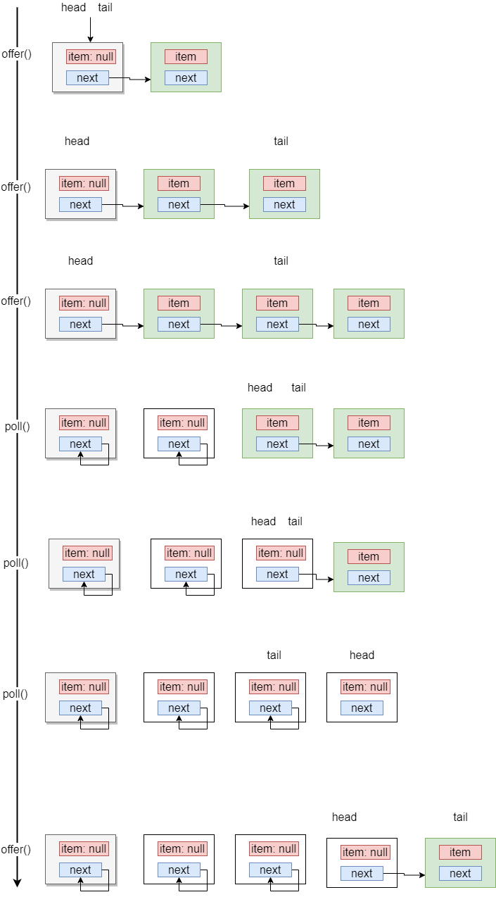

<h1><center>ConcurrentLinkedQueue</center></h1>

## 前言

- 基于链表实现的一个线程安全的无界队列
- 链表中的head、tail 并不是始终指向链表的头尾节点，估计是为了减少CAS操作，提高性能


队列实现如下：



## 源码分析

### Node

```java
private static class Node<E> {
    // 当Node节点移除后，item 被设置为null
    volatile E item;
    // Node被移除后，next将指向自己
    volatile Node<E> next;
	// 设置item属性
    Node(E item) {
        UNSAFE.putObject(this, itemOffset, item);
    }
    ......
}
```


### 核心参数

```java
 /**
     * A node from which the first live (non-deleted) node (if any)
     * can be reached in O(1) time.
     * Invariants(不变的):
     * - 所有的节点都可以从head通过succ()方法访问到
     * - head != null
     * - (tmp = head).next != tmp || tmp != head
     * Non-invariants:
     * - head.item may or may not be null.
     * - it is permitted for tail to lag behind head, that is, for tail
     *   to not be reachable from head!
     */
private transient volatile Node<E> head;
/**
     * A node from which the last node on list (that is, the unique
     * node with node.next == null) can be reached in O(1) time.
     * Invariants:
     * - the last node is always reachable from tail via succ()
     * - tail != null
     * Non-invariants:
     * - tail.item may or may not be null.
     * - it is permitted for tail to lag behind head, that is, for tail
     *   to not be reachable from head!
     * - tail.next may or may not be self-pointing to tail.
     */
private transient volatile Node<E> tail;

// 默认构造
public ConcurrentLinkedQueue() {
    head = tail = new Node<E>(null);
}

// CAS 更新head节点，将之前的head next指向自己，便于GC， 将新节点p作为新的head
final void updateHead(Node<E> h, Node<E> p) {
    if (h != p && casHead(h, p))
        h.lazySetNext(h);
}
// 返回p节点的后续节点，如果p节点指向自己，说明当前节点已经被移除
final Node<E> succ(Node<E> p) {
    Node<E> next = p.next;
    return (p == next) ? head : next;
}
```


### offer

```java
public boolean offer(E e) {
    checkNotNull(e);
    final Node<E> newNode = new Node<E>(e);

    for (Node<E> t = tail, p = t;;) {
        Node<E> q = p.next;
        if (q == null) {
            // p is last node
            if (p.casNext(null, newNode)) { // p.next = newNode
                // 跳跃这设置tail，并不是每次都来设置tail
                if (p != t) // hop two nodes at a time
                    casTail(t, newNode);  // Failure is OK.
                return true;
            }
            // Lost CAS race to another thread; re-read next
            // 竞争导致CAS丢失，重新读取新值
        }
        // 当链表中的节点完全移除后，tail 节点可能在head之前，这种情况可能成立
        // 或者其他线程将p节点移除
        else if (p == q) 
            p = (t != (t = tail)) ? t : head;
        else
            // p != t: 表示自旋已经超过一次.
            // t != (t = tail): 表示原来的tail 已经发生变化，需要重新赋值
            p = (p != t && t != (t = tail)) ? t : q;
    }
}
```


### poll

```java
public E poll() {
    restartFromHead:
    for (;;) {
        for (Node<E> h = head, p = h, q;;) {
            E item = p.item;
			// 将待移除的节点item设置为null
            if (item != null && p.casItem(item, null)) {
                // 跳跃这设置head
                if (p != h) // hop two nodes at a time
                    updateHead(h, ((q = p.next) != null) ? q : p);
                return item;
            }
            else if ((q = p.next) == null) { // 队列中已经没有元素了
                updateHead(h, p); // 重新将最后一个节点设置为head
                return null;
            }
            else if (p == q)	// 其他线程将p节点移除了(p.next = p)
                continue restartFromHead;
            else	
                p = q;
        }
    }
}
```


### peek

```java
public E peek() {
    restartFromHead:
    for (;;) {
        for (Node<E> h = head, p = h, q;;) {
            E item = p.item;
            if (item != null || (q = p.next) == null) {
                updateHead(h, p);  // 更新head
                return item;
            }
            else if (p == q) // p 节点被移除，重试
                continue restartFromHead;
            else
                p = q;
        }
    }
}
```


### remove

> 如果队列中存在一个或多个元素o， 那么删除一个节点，返回true
>
> 删除节点仅仅是将节点的item设置为null

```java
public boolean remove(Object o) {
    if (o != null) {
        Node<E> next, pred = null;
        for (Node<E> p = first(); p != null; pred = p, p = next) {
            boolean removed = false;
            E item = p.item;
            if (item != null) {
                if (!o.equals(item)) {
                    next = succ(p);
                    continue;
                }
                removed = p.casItem(item, null);
            }

            next = succ(p);
            if (pred != null && next != null) // unlink
                pred.casNext(p, next);
            if (removed)
                return true;
        }
    }
    return false;
}
```

### first

```java
Node<E> first() {
    restartFromHead:
    for (;;) {
        for (Node<E> h = head, p = h, q;;) {
            boolean hasItem = (p.item != null);
            if (hasItem || (q = p.next) == null) {
                updateHead(h, p);
                return hasItem ? p : null;
            }
            else if (p == q)
                continue restartFromHead;
            else
                p = q;
        }
    }
}
```