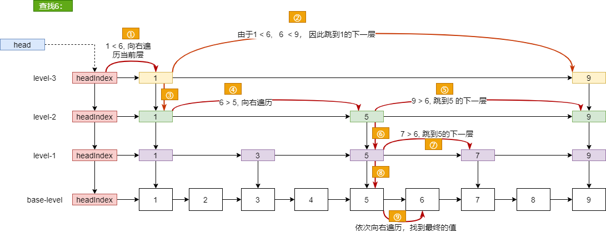
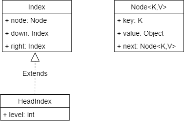
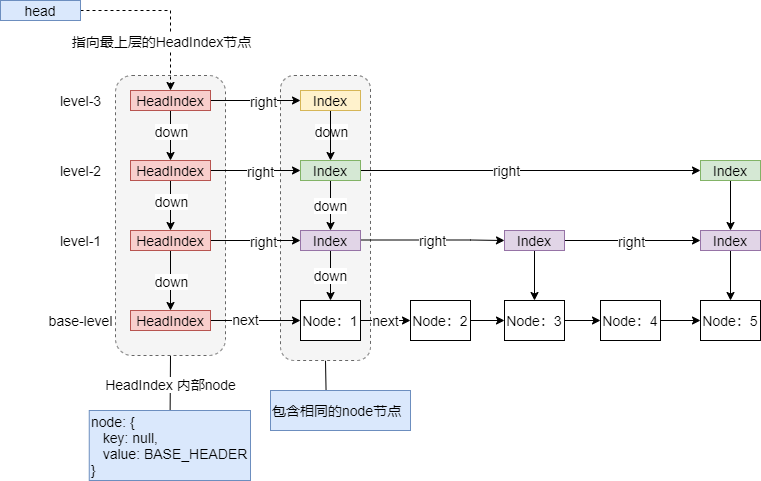
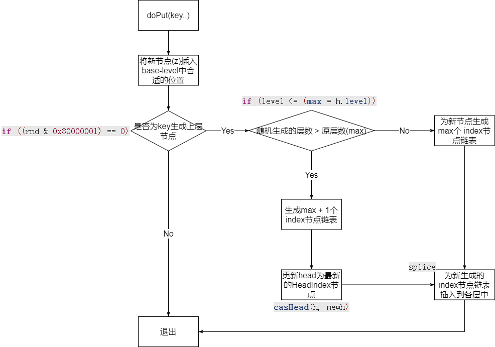
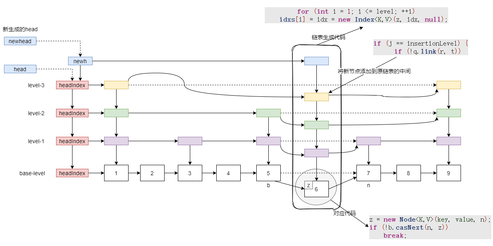
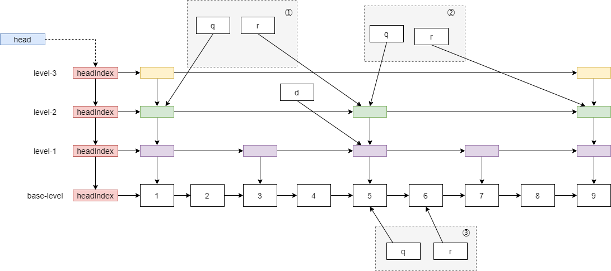
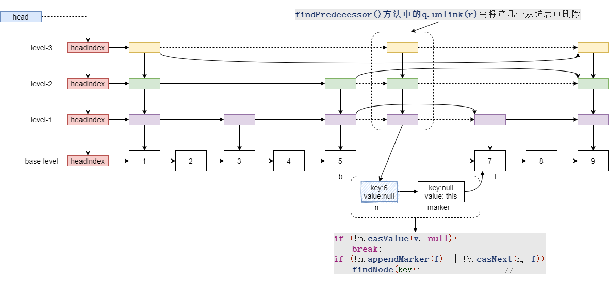

# ConcurrentSkipListMap

- 使用跳跃表实现，能够以O(logN) 的时间复杂度实现，查找、更新、删除、添加
- 支持范围查询

- 获取元素个数需要遍历所有节点，如果遍历过程中其他线程在更新跳表，那么获取的个数可能是不准确的

- 在Redis中的Sorted set 内部也使用了跳表，能够快速的进行范围查询


**跳表的查询过程：**





源码中的一些变量意义：


```java
/**
*Notation guide for local variables
* Node:         b, n, f    for  predecessor, node, successor
* Index:        q, r, d    for index node, right, down.
*               t          for another index node
* Head:         h
* Levels:       j
* Keys:         k, key
* Values:       v, value
* Comparisons:  c
*/
```


## 内部节点

ConcurrentSkipListMap的跳表中定义了三个类型节点, 如下：




跳表中的结构如下：




## 初始化

```java
public ConcurrentSkipListMap() {
    this.comparator = null;
    initialize();
}

private void initialize() {
    keySet = null;
    entrySet = null;
    values = null;
    descendingMap = null;
    // 创建一个HeadIndex，此时只有一层节点
    head = new HeadIndex<K,V>(new Node<K,V>(null, BASE_HEADER, null),
                              null, null, 1);
}
```


## 插入元素

> value 不能为null
>
> onlyIfAbsent： 如果存在key，是否使用新的value覆盖，默认false（覆盖）

主要逻辑：




**源码如下：**


``` java
private V doPut(K key, V value, boolean onlyIfAbsent) {
    Node<K,V> z;             // added node
    if (key == null)
        throw new NullPointerException();
    Comparator<? super K> cmp = comparator;
    outer: for (;;) {
        // findPredecessor: 返回base-level 中小于key 的最大的节点
        for (Node<K,V> b = findPredecessor(key, cmp), n = b.next;;) {
            if (n != null) {
                Object v; int c;
                Node<K,V> f = n.next;
                
                // b - n中间可能有其他线程插入了元素
                if (n != b.next)               // inconsistent read
                    break;
                if ((v = n.value) == null) {   // n is deleted
                    n.helpDelete(b, f);
                    break;
                }
                if (b.value == null || v == n) // b is deleted
                    break;
                // > 0: 那么继续在base—level中遍历，寻找一个合适的位置
                // 一般情况下这里应该是 < 0, 这种情况可能在该循环过程中，其他线程插入了值
                if ((c = cpr(cmp, key, n.key)) > 0) {
                    b = n;
                    n = f;
                    continue;
                }
                // 说明base-level中有与key 相同的node存在
                if (c == 0) {
                    if (onlyIfAbsent || n.casValue(v, value)) {
                        @SuppressWarnings("unchecked") V vv = (V)v;
                        return vv;
                    }
                    // 可能有竞争出现
                    break; // restart if lost race to replace value
                }
                // else c < 0; fall through
            }
			// 创建一个新的节点 指向n
            z = new Node<K,V>(key, value, n);
            if (!b.casNext(n, z))
                break;         // restart if lost race to append to b
            break outer;
        }
    }
	
    // 生成一个随机数
    int rnd = ThreadLocalRandom.nextSecondarySeed();
    // 0x80000001 --> 0b: 1000 0000 0000 0000 0000 0000 0000 0001
    // 如果最高位和最低位同时为0， 那么将会为base-level上层提取创建节点
    if ((rnd & 0x80000001) == 0) { // test highest and lowest bits
        // max: 记录跳跃表目前最大层数
        int level = 1, max;
        // 计算低位开始连续为1的个数，   0000 0111： 这里为 level + 2 = 3
        while (((rnd >>>= 1) & 1) != 0)
            ++level;
        Index<K,V> idx = null;
        HeadIndex<K,V> h = head;
        if (level <= (max = h.level)) {	// 此时生成的层数与原最大层数相同
            for (int i = 1; i <= level; ++i)
                idx = new Index<K,V>(z, idx, null);
            // 到目前为止，为新的节点生成了一个链表, 大致如下：
            // level-3: Index
            //			  ↓
            // level-2: Index
            //			  ↓
            // level-1: Index
            //			  ↓
            // base-level: z
        }
        else { // try to grow by one level
            // 生成的随机层大于了max， 那么只新创建一层节点
            level = max + 1; // hold in array and later pick the one to use
            @SuppressWarnings("unchecked")Index<K,V>[] idxs =
                (Index<K,V>[])new Index<?,?>[level+1];
            // 为新插入的元素生成链表
            for (int i = 1; i <= level; ++i)
                idxs[i] = idx = new Index<K,V>(z, idx, null);
            for (;;) { // 这里为生成的最上层元素添加down指针，指向headIndex节点
                h = head;
                int oldLevel = h.level;
                if (level <= oldLevel) // lost race to add level
                    break;
                HeadIndex<K,V> newh = h;
                Node<K,V> oldbase = h.node;
                for (int j = oldLevel+1; j <= level; ++j)
                    newh = new HeadIndex<K,V>(oldbase, newh, idxs[j], j);
                if (casHead(h, newh)) {
                    h = newh;
                    idx = idxs[level = oldLevel];
                    break;
                }
            }
        }
        // find insertion points and splice in
        // 这里的主要逻辑为链表中的每个元素添加到各层合适的位置，此时链表中的元素还没有后续指针
        splice: for (int insertionLevel = level;;) {
            int j = h.level;
            for (Index<K,V> q = h, r = q.right, t = idx;;) {
                if (q == null || t == null)
                    break splice;
                if (r != null) {
                    Node<K,V> n = r.node;
                    // compare before deletion check avoids needing recheck
                    int c = cpr(cmp, key, n.key);
                    if (n.value == null) {	// n (r) 节点已经被删除
                        if (!q.unlink(r))	// 从链表中移除n节点， 让q.next = r.next;
                            break;
                        r = q.right;
                        continue;
                    }
                    if (c > 0) {
                        q = r;
                        r = r.right;
                        continue;
                    }
                }

                if (j == insertionLevel) {
                    if (!q.link(r, t))	// 让q.next 指向 链表中的元素
                        break; // restart
                    if (t.node.value == null) {
                        findNode(key);	// 内部会删除无效的节点
                        break splice;
                    }
                    if (--insertionLevel == 0)	// 结束
                        break splice;
                }
				// 更新下一层节点
                if (--j >= insertionLevel && j < level)
                    t = t.down;
                q = q.down;
                r = q.right;
            }
        }
    }
    return null;
}
```


插入元素6，最终结果如下：




## 查询元素

在调用get(key)方法时， 内部会调用findPredecessor方法在base-level 中找到比key 小的第一个节点，然后doGet方法中的循环从该元素依次向右遍历，得到最终的值。

### findPredecessor

> 1. 返回base-level 层， 小于key 的Node节点，如果没有，直接返回base-level层的header。
>
> 2. 同时遍历过程中还会判断中间是否有删除的节点，有的话则清除。

```java
private Node<K,V> findPredecessor(Object key, Comparator<? super K> cmp) {
    if (key == null)
        throw new NullPointerException(); // don't postpone errors
    for (;;) {
        // 最开始在最上层找，即head开始
        // for每一次循环表示找到当前层小于key的最后一个节点
        for (Index<K,V> q = head, r = q.right, d;;) {
            if (r != null) {
                Node<K,V> n = r.node;
                K k = n.key;
                // 删除节点，  具体逻辑看文章后面
                if (n.value == null) { // 说明r节点需要被删除
                    if (!q.unlink(r))	// q.unlink(r)== true: 说明删除后续节点成功
                        break;           // restart    这里说明可能有其他线程修改的后续节点，重新开始
                    // 已经将该删除的节点移除，r重新赋值
                    r = q.right;         // reread r
                    continue;
                }
                if (cpr(cmp, key, k) > 0) {
                    // 当前层还没有找到合适的， 继续在当前层移动指针
                    q = r;
                    r = r.right;
                    continue;
                }
            }
            if ((d = q.down) == null)
                // 此时表示已经到达最下层
                return q.node;
            // 切换到下一层， d 上面被赋值 q.down
            q = d;
            r = d.right;
        }
    }
}
```


q、r、d指向如下：

随着遍历， q， r依次向右平移，  找到合适的时候，q重新赋值为d，将q，r转移到下层


调用findPredecessor(6)， q、r 变量变化如下(省略了走level-3， level-1)，

最终返回q节点




### doGet

> 查找元素的核心方法, 与`findNode`方法类似，该方法主要是通过findPredecessor方法，找到base-level层小于key 的元素，然后doGet方法中的循环从该元素依次向下遍历，得到最终的值。

```java
private V doGet(Object key) {
    if (key == null)
        throw new NullPointerException();
    Comparator<? super K> cmp = comparator;
    outer: for (;;) {
        // findPredecessor 返回base-level中，小于key 的最大元素
        // 依次寻找key对应的元素
        // 三个遍历：  b: 前序节点，  n： b的next，  f： n的后续
        // 当n的key与待查找的key 相等时，说明找到
        for (Node<K,V> b = findPredecessor(key, cmp), n = b.next;;) {
            Object v; int c;
            if (n == null)	// 找不到该值
                break outer;
            Node<K,V> f = n.next;
            // 其他线程修改了链表
            if (n != b.next)                // inconsistent read
                break;
            // value 为null 说明被删除，只是还没从链表中断开
            if ((v = n.value) == null) {    // n is deleted
                n.helpDelete(b, f);	// 处理删除逻辑
                break;
            }
            if (b.value == null || v == n)  // b is deleted
                break;
            // 找到key对应的元素
            if ((c = cpr(cmp, key, n.key)) == 0) {
                @SuppressWarnings("unchecked") V vv = (V)v;
                return vv;
            }
            // 元素被其他线程删除
            if (c < 0)
                break outer;
            b = n;
            n = f;
        }
    }
    return null;
}
```


## 移除元素

doRemove方法

> 1. 当在base-level层找到待删除的节点后，将节点value赋值null， 添加一个删除的标记节点marker，同时让n的前序节点的next指针指向f
> 2. 在findPredecessor方法中(get会调用) 会将index节点删除(即为n节点生成的层级链表)


当调用remove(key)后, 内部会调用doRemove(key, null);

```java
final V doRemove(Object key, Object value) {
    if (key == null)
        throw new NullPointerException();
    Comparator<? super K> cmp = comparator;
    outer: for (;;) {
        // findPredecessor 找到base-level中最接近的元素
        for (Node<K,V> b = findPredecessor(key, cmp), n = b.next;;) {
            Object v; int c;
            if (n == null)	// 说明需要元素的元素不存在
                break outer;
            Node<K,V> f = n.next;
            if (n != b.next)            // 可能被其他线程修改结构 // inconsistent read
                break;
            // value为null 说明该元素已经被删除
            if ((v = n.value) == null) {        // n is deleted
                n.helpDelete(b, f);	 // 处理未完成的删除逻辑
                break;
            }
            if (b.value == null || v == n)      // b is deleted
                break;
            if ((c = cpr(cmp, key, n.key)) < 0)	// 未找到需要删除的元素
                break outer;
            if (c > 0) {	// 继续向右边查找
                b = n;
                n = f;
                continue;
            }
            // remove(key)方法中， value 始终为null，其他方法暂时不考虑
            if (value != null && !value.equals(v))
                break outer;
            if (!n.casValue(v, null))	// 更新n的value失败直接break
                break;
            // 为待删除元素n 添加后续标记节点marker，同时让n的next指向f节点
            if (!n.appendMarker(f) || !b.casNext(n, f))
                // 说明上面操作有一个失败，调用findNode重新处理，内部主要靠helpDelete处理
                findNode(key);                  // retry via findNode
            else {
                // 清除待删除的节点
                findPredecessor(key, cmp);      // clean index
                if (head.right == null)		// 考虑是否降低层数
                    tryReduceLevel();
            }
            @SuppressWarnings("unchecked") V vv = (V)v;
            return vv;
        }
    }
    return null;
}
```


删除元素6后的跳表结构图如下：



删除的节点由于没有GC ROOTS相关联， 后续GC时将会回收该节点的内存空间