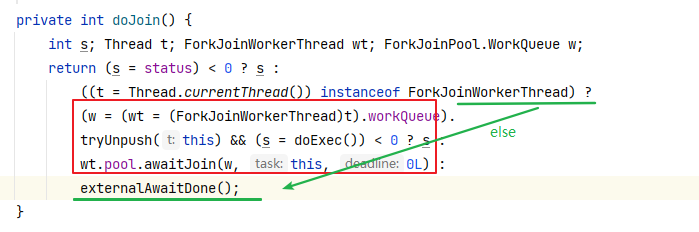

# ForkJoinPool

Fork-Join： 见名知意，采用分而治之对任务进行拆分，在归并的过程。 体现在提交一些**需要递归计算**之类的任务。

主要用于处理密集型任务，内部设计采用工作窃取机制，尽量压榨系统CPU资源。


## 核心设计：

默认内部为 2*(CPU - 1) 的WorkQueue数组，只有基数位置拥有线程，即ForkJoinPool只有 CPU核心数量 - 1 的线程数。

偶数位置记录外部线程提交的任务队列，奇数位置记录的 ForkJoin 工作线程的任务队列。


ForkJoin 内部工作线程首先会从随机位置扫描WorkQueue的任务进行处理，处理完成后，在次查看自己的工作队列是否有任务需要处理。

循环上面逻辑，当所有任务都处理完成了，进行阻塞。


相关应用： CompletableFuture默认池， JDK 21中虚拟线程默认调度器（默认CPU 数量的载体线程）


**源码主要为JDK8：**

## 初始化

> parallelism： 并行度，默认为CPU 核心数 - 1
>
> mode: 默认LIFO，主要是为了满足fork-join 任务处理习惯。
>
> ctl：long类型，用于内部全局状态控制
>
> - 63 - 48：高16位，AC. 记录forkjoin中的活跃的worker数。 active worker = AC + parallelism
> - 47 - 32：TC. 记录所有worker数量。包含阻塞的，因此可能 tc > ac.   total worker = TC + parallelism
> - 31 - 0: SP: 记录阻塞队列的指针

```java
private ForkJoinPool(int parallelism,
     ForkJoinWorkerThreadFactory factory,
     UncaughtExceptionHandler handler,
     int mode,
     String workerNamePrefix) {
this.workerNamePrefix = workerNamePrefix;
this.factory = factory;
this.ueh = handler;
this.config = (parallelism & SMASK) | mode;
long np = (long)(-parallelism); // offset ctl counts
this.ctl = ((np << AC_SHIFT) & AC_MASK) | ((np << TC_SHIFT) & TC_MASK);
}
```


## 提交任务

pool.submit(callable):  最终会包装一个ForkJoinTask#AdaptedCallable提交给forkjoinPool。 最终调用externalPush

### externalPush

> 最开始 workQueues 没有初始化，将会调用externalSubmit进行初始化，workQueues = new workQueue[2 * parallelism] 
>
> 
>
> 随机选择一个偶数位置，将任务放入WorkQueue队列中top位置。

```java
final void externalPush(ForkJoinTask<?> task) {
    WorkQueue[] ws; WorkQueue q; int m;
    int r = ThreadLocalRandom.getProbe(); // 随机数，如果没有更新，同一个线程一直相同
    int rs = runState;
    if ((ws = workQueues) != null && (m = (ws.length - 1)) >= 0 &&
        (q = ws[m & r & SQMASK]) != null && r != 0 && rs > 0 &&
        U.compareAndSwapInt(q, QLOCK, 0, 1)) { // 已经初始化，随机选择偶数位置，放入WorkQueue队列中top位置
        ForkJoinTask<?>[] a; int am, n, s;
        if ((a = q.array) != null &&
            (am = a.length - 1) > (n = (s = q.top) - q.base)) {
            int j = ((am & s) << ASHIFT) + ABASE;
            U.putOrderedObject(a, j, task);
            U.putOrderedInt(q, QTOP, s + 1);
            U.putIntVolatile(q, QLOCK, 0);
            if (n <= 1) // 如果之前没有任务或者有一个任务，现在有加了一个任务，尝试创建或唤醒空闲的线程
                signalWork(ws, q);
            return;
        }
        U.compareAndSwapInt(q, QLOCK, 1, 0);
    }
    externalSubmit(task);
}
```


### signalWork 

> 最开始提交任务后，forkjoinpool中还没有工作线程，将尝试创建工作线程。
>
> 
>
> 后面运行过程中当激活的线程太少，也会尝试创建新线程。当有阻塞线程，会激活、唤醒栈顶队列

```java
final void signalWork(WorkQueue[] ws, WorkQueue q) {
    long c; int sp, i; WorkQueue v; Thread p;
    while ((c = ctl) < 0L) {                       // too few active，  当等于0 才表示达到parallelism
        if ((sp = (int)c) == 0) {                  // no idle workers
            if ((c & ADD_WORKER) != 0L)            // too few workers
                tryAddWorker(c);  // 工作线程没有达到parallelism
            break;
        }
        if (ws == null)                            // unstarted/terminated
            break;
         // SP 指向的是一个栈结构，这里会出栈，  第一次到这里sp 应该是0
        if (ws.length <= (i = sp & SMASK))         // terminated
            break;
        if ((v = ws[i]) == null)                   // terminating
            break;
        // 有阻塞的工作线程
        int vs = (sp + SS_SEQ) & ~INACTIVE;        // next scanState
        int d = sp - v.scanState;                  // screen CAS
        long nc = (UC_MASK & (c + AC_UNIT)) | (SP_MASK & v.stackPred);
        // d==0: 判断v.scanState是否被其他线程更改
        if (d == 0 && U.compareAndSwapLong(this, CTL, c, nc)) {
            v.scanState = vs;                      // activate v
            if ((p = v.parker) != null) // 唤醒出栈队列阻塞的线程
                U.unpark(p);
            break;
        }
        if (q != null && q.base == q.top)          // no more work
            break;
    }
}
```


### tryAddWorker

添加一个新的worker 

```java
private void tryAddWorker(long c) {
    boolean add = false;
    do {
//        ac + 1, tc + 1
        long nc = ((AC_MASK & (c + AC_UNIT)) |
                   (TC_MASK & (c + TC_UNIT)));
        if (ctl == c) { // ctl 状态没有被其他线程修改
            int rs, stop;                 // check if terminating
            if ((stop = (rs = lockRunState()) & STOP) == 0)
                add = U.compareAndSwapLong(this, CTL, c, nc); // update ctl
            unlockRunState(rs, rs & ~RSLOCK);
            if (stop != 0)
                break;
            if (add) {
                createWorker(); // 创建worker线程：ForkJoinWorkerThread
                break;
            }
        }
    } while (((c = ctl) & ADD_WORKER) != 0L && (int)c == 0);
}
```


## 等待结果

ForkJoinTask#get()

```java
public final V get() throws InterruptedException, ExecutionException {
    int s = (Thread.currentThread() instanceof ForkJoinWorkerThread) ?
        doJoin() :  // 内部线程等待处理结果，见后面分析
    	externalInterruptibleAwaitDone(); // 外部线程
    Throwable ex;
    if ((s &= DONE_MASK) == CANCELLED)
        throw new CancellationException();
    if (s == EXCEPTIONAL && (ex = getThrowableException()) != null)
        throw new ExecutionException(ex);
    return getRawResult();
}


private int externalInterruptibleAwaitDone() throws InterruptedException {
        int s;
        if ((s = status) >= 0 &&
            (s = ((this instanceof CountedCompleter) ?
                  ForkJoinPool.common.externalHelpComplete(
                      (CountedCompleter<?>)this, 0) :  // 在其他偶数位置队列 帮忙执行任务
                  ForkJoinPool.common.tryExternalUnpush(this) ?  // 把当前任务直接重队列中取出来 自己执行
                  doExec() : // 自己执行任务
                  0)) >= 0) {
            while ((s = status) >= 0) { // 当前任务已经被其他线程执行了，这里等待。
                if (U.compareAndSwapInt(this, STATUS, s, s | SIGNAL)) {
                    synchronized (this) {
                        if (status >= 0)
                            wait(0L);
                        else
                            notifyAll();
                    }
                }
            }
        }
        return s;
    }
```


### tryRelease

> 会尝试激活栈顶队列

```java
private boolean tryRelease(long c, WorkQueue v, long inc) {
    int sp = (int)c, vs = (sp + SS_SEQ) & ~INACTIVE; Thread p;
    if (v != null && v.scanState == sp) {          // v is at top of stack
        long nc = (UC_MASK & (c + inc)) | (SP_MASK & v.stackPred);
        if (U.compareAndSwapLong(this, CTL, c, nc)) {
            v.scanState = vs;
            if ((p = v.parker) != null)
                U.unpark(p);
            return true;
        }
    }
    return false;
}
```


## worker线程

**ForkJoinWorkerThread**

```java
protected ForkJoinWorkerThread(ForkJoinPool pool) {
    // Use a placeholder until a useful name can be set in registerWorker
    super("aForkJoinWorkerThread");
    this.pool = pool;
    this.workQueue = pool.registerWorker(this); 
}
```

### registerWorker

创建WorkQueue绑定到 pool#**workQueues** 中， 或者扩容pool#**workQueues**


内部线程创建的WorkQueue 会放入workQueues的奇数位置，WorkQueue 也会记录当前队列中的状态信息

```java
final WorkQueue registerWorker(ForkJoinWorkerThread wt) {
    UncaughtExceptionHandler handler;
    wt.setDaemon(true);                           // configure thread
    if ((handler = ueh) != null)
        wt.setUncaughtExceptionHandler(handler);
    WorkQueue w = new WorkQueue(this, wt);
    int i = 0;                                    // assign a pool index
    int mode = config & MODE_MASK;
    int rs = lockRunState();
    try {
        WorkQueue[] ws; int n;                    // skip if no array
        if ((ws = workQueues) != null && (n = ws.length) > 0) {
            int s = indexSeed += SEED_INCREMENT;  // unlikely to collide
            int m = n - 1;
            i = ((s << 1) | 1) & m;               // odd-numbered indices， 随机选择基数位置
            if (ws[i] != null) {                  // collision
                int probes = 0;                   // step by approx half n
                int step = (n <= 4) ? 2 : ((n >>> 1) & EVENMASK) + 2; // 探测步长
                while (ws[i = (i + step) & m] != null) {  
                    if (++probes >= n) { // 所有位置都没有找到空闲的，那么需要扩容
                        workQueues = ws = Arrays.copyOf(ws, n <<= 1);
                        m = n - 1;
                        probes = 0;
                    }
                }
            }
            w.hint = s;                           // use as random seed
            w.config = i | mode;
            w.scanState = i;                      // publication fence
            ws[i] = w;
        }
    } finally {
        unlockRunState(rs, rs & ~RSLOCK);
    }
    wt.setName(workerNamePrefix.concat(Integer.toString(i >>> 1)));
    return w;
}


 WorkQueue(ForkJoinPool pool, ForkJoinWorkerThread owner) {
            this.pool = pool;
            this.owner = owner;
            // Place indices in the center of array (that is not yet allocated)
            base = top = INITIAL_QUEUE_CAPACITY >>> 1;  // 4096
}
```


### run

```java
public void run() {
    // workQueue为上面创建，第一次是始终为null
    if (workQueue.array == null) { // only run once
        Throwable exception = null;
        try {
            onStart();	// 钩子，默认空实现
            pool.runWorker(workQueue);
        } catch (Throwable ex) {
            exception = ex;
        } finally {
            try {
                onTermination(exception);
            } catch (Throwable ex) {
                if (exception == null)
                    exception = ex;
            } finally {
                pool.deregisterWorker(this, exception);
            }
        }
    }
}
```


```java
final void runWorker(WorkQueue w) {
    w.growArray();                   // 初始化array数组(8192)，或者双倍扩容
    int seed = w.hint;               // hint：初始化WorkQueue时产生的随机数
    int r = (seed == 0) ? 1 : seed;  // avoid 0 for xorShift
    for (ForkJoinTask<?> t;;) {
        if ((t = scan(w, r)) != null) // scan: 窃取任务
            w.runTask(t);	// 执行窃取的任务，调用exec() 方法
        else if (!awaitWork(w, r))  // 没有窃取到任务，等待
            break;
        r ^= r << 13; r ^= r >>> 17; r ^= r << 5; // xorshift
    }
}
```


### scan

> 窃取任务: 从一个**随机位置**开始遍历WorkQueue数组，从array的base开始窃取。如果在扫描过程中发生了竞争关系，那么将会重新生成一个随机位置重新扫描。
>
>
> 当连续两次扫描发现没有队列中没有任何任务时，会设置当前scanState 为inActive， 下一次扫描如果还是没有出现任务，将break，返回null。


```java
private ForkJoinTask<?> scan(WorkQueue w, int r) {
    WorkQueue[] ws; int m;
    if ((ws = workQueues) != null && (m = ws.length - 1) > 0 && w != null) {
        // scanState 在WorkQueue对象初始化的时候为 workQueue数组的索引
        int ss = w.scanState;                     // initially non-negative
        
        // 找到任务返回
        for (int origin = r & m, k = origin, oldSum = 0, checkSum = 0;;) {
            WorkQueue q; ForkJoinTask<?>[] a; ForkJoinTask<?> t;
            int b, n; long c;
            if ((q = ws[k]) != null) {
                if ((n = (b = q.base) - q.top) < 0 &&
                    (a = q.array) != null) {      // non-empty
                    long i = (((a.length - 1) & b) << ASHIFT) + ABASE;
                    if ((t = ((ForkJoinTask<?>)
                              U.getObjectVolatile(a, i))) != null &&
                        q.base == b) {
                        if (ss >= 0) { // 当前队列状态空闲
                            if (U.compareAndSwapObject(a, i, t, null)) {
                                q.base = b + 1;
                                // top > base + 1: 还有多余的任务可以窃取
                                if (n < -1)       // signal others
                                    signalWork(ws, q);
                                return t;	
                            }
                        }
                       // oldSum = 0: 发生竞争关系后，第一次遍历，
                        // scanState < 0: 当前方法中oldSum 为0， 应该不会出现 scanState < 0.
                        else if (oldSum == 0 &&   // try to activate
                                 w.scanState < 0)
                            // 尝试激活栈顶队列， ac + 1， 再次重新扫描
                            tryRelease(c = ctl, ws[m & (int)c], AC_UNIT);
                    }
                    // 上面发生竞争， 需要重新定位一个开始位置扫描
                    if (ss < 0)                   // refresh， <0,inactive, 
                        ss = w.scanState;  // 更新状态
   
                    r ^= r << 1; r ^= r >>> 3; r ^= r << 10;
                    origin = k = r & m;           // move and rescan
                    oldSum = checkSum = 0;
                    continue;
                }
                checkSum += b;
            }
            // 表示WorkQueue数组都遍历了一遍
            if ((k = (k + 1) & m) == origin) {    // continue until stable
                if ((ss >= 0 || (ss == (ss = w.scanState))) &&
                    oldSum == (oldSum = checkSum)) {
                    if (ss < 0 || w.qlock < 0) // ss<0:下面执行过一遍
                        break;
                    // 没有窃取到任务
                    // 修改scanState为inactive状态
                    int ns = ss | INACTIVE;       // try to inactivate
                    // 将AC - 1
                    long nc = ((SP_MASK & ns) |
                               (UC_MASK & ((c = ctl) - AC_UNIT)));
                    w.stackPred = (int)c;         // hold prev stack top
                    U.putInt(w, QSCANSTATE, ns); // 写入scanState 的状态，inactive
                    if (U.compareAndSwapLong(this, CTL, c, nc))
                        ss = ns;
                    else	// 线程竞争，ctl修改失败
                        w.scanState = ss;         // back out
                }
                checkSum = 0;
            }
        }
    }
    return null;
}
```


### runTask

> 先执行窃取到的任务，然后执行本地任务（根据模式设定，common池为 默认LIFO）。

```java
final void runTask(ForkJoinTask<?> task) {
    if (task != null) {
        scanState &= ~SCANNING; // mark as busy
        (currentSteal = task).doExec();	// 执行窃取的任务
        U.putOrderedObject(this, QCURRENTSTEAL, null); // release for GC
        // 以FIFO或FILO方式执行当前workqueue中的任务(doExec方法提交进来的任务，RecursiveTask.fork)
        execLocalTasks();
        ForkJoinWorkerThread thread = owner;
        if (++nsteals < 0)      // collect on overflow
            transferStealCount(pool);	// stealCount + 1
        scanState |= SCANNING;
        if (thread != null)
            thread.afterTopLevelExec(); // InnocuousForkJoinWorkerThread 有实现
    }
}
```


### awaitWork

> 窃取线程没有窃取到任务时会执行该方法，阻塞当前线程； 
>
> 返回false，表示当前work 需要终止，可能是没有任务，或者线程池终止。

```java
// 走到这里说明w为栈顶元素
private boolean awaitWork(WorkQueue w, int r) {
    // qlock < 0: 表示队列将被终止
    if (w == null || w.qlock < 0)                 // w is terminating
        return false;
    for (int pred = w.stackPred, spins = SPINS, ss;;) {
        if ((ss = w.scanState) >= 0)	// 被激活了，可能是signalWork方法
            break;
        else if (spins > 0) {
            r ^= r << 6; r ^= r >>> 21; r ^= r << 7;
            if (r >= 0 && --spins == 0) {         // randomize spins
                WorkQueue v; WorkQueue[] ws; int s, j; AtomicLong sc;
                if (pred != 0 && (ws = workQueues) != null &&
                    (j = pred & SMASK) < ws.length &&
                    (v = ws[j]) != null &&        // see if pred parking
                    (v.parker == null || v.scanState >= 0))
                    // 继续自旋，直到栈顶第二个元素阻塞，或者灭活
                    spins = SPINS;                // continue spinning
            }
        }
        else if (w.qlock < 0)                     // recheck after spins
            return false;
        else if (!Thread.interrupted()) {
            long c, prevctl, parkTime, deadline;
            // config & SMASK: 并行度, ac 表示激活的线程数
            int ac = (int)((c = ctl) >> AC_SHIFT) + (config & SMASK);
            // ac <= 0: 线程全部未激活， 可能由于没有任务，都park中（下面park方法）
            // tryTerminate:尝试清理队列 (非默认线程池)
            if ((ac <= 0 && tryTerminate(false, false)) ||
                (runState & STOP) != 0)           // pool terminating
                return false;
            
            // 这里是判断当前队列是否是 栈顶元素(SP 指向的Queue) 如果是，那么没有其他线程来唤醒他，因此下面使用超时阻塞
            if (ac <= 0 && ss == (int)c) {        // is last waiter
                // scan 方法中 ac - 1， 针对补偿线程
                prevctl = (UC_MASK & (c + AC_UNIT)) | (SP_MASK & pred);
                int t = (short)(c >>> TC_SHIFT);  // shrink excess spares
                // t > 2： 说明是补偿线程(t > 0), 防止过多的补偿线程等待
                // tl，返回false，该补偿线程将会结束
                if (t > 2 && U.compareAndSwapLong(this, CTL, c, prevctl))
                    return false;                 // else use timed wait
                parkTime = IDLE_TIMEOUT * ((t >= 0) ? 1 : 1 - t);
                deadline = System.nanoTime() + parkTime - TIMEOUT_SLOP;
            }
            else   // 上面if 判断失败，超时时间0，只能被其他线程唤醒
                prevctl = parkTime = deadline = 0L;
            Thread wt = Thread.currentThread();
            U.putObject(wt, PARKBLOCKER, this);   // emulate LockSupport
            w.parker = wt;	// 唯一赋值的地方
            if (w.scanState < 0 && ctl == c)      // recheck before park
                U.park(false, parkTime);	//  signalWork 唤醒方法 会加AC
            U.putOrderedObject(w, QPARKER, null);
            U.putObject(wt, PARKBLOCKER, null);
            if (w.scanState >= 0)  // tryRelease唤醒后，scanState >= 0
                break;
            // 当前是补偿线程？
            if (parkTime != 0L && ctl == c &&
                deadline - System.nanoTime() <= 0L &&
                U.compareAndSwapLong(this, CTL, c, prevctl))
                return false;                     // shrink pool
        }
    }
    return true;
}
```


## RecursiveTask

> 用于处理递归任务，即fork-join相关任务。

例如下面计算斐波那契数列 F(n) = F(n-1) + F(n-2)

```java
class Fibonacci extends RecursiveTask<Integer> {
  final int n;
  Fibonacci(int n) { this.n = n; }
  Integer compute() {
    if (n <= 1)
      return n;
    Fibonacci f1 = new Fibonacci(n - 1);
    f1.fork(); // 提交任务，计算n - 1 的斐波纳契的和
    Fibonacci f2 = new Fibonacci(n - 2);
    return f2.compute() +  // 当前任务直接计算f2，不入队提升效率
        f1.join();  // 等待f1
  }
}
```


### fork()

提交任务到当前队列，通常为内部线程执行提交

```java
public final ForkJoinTask<V> fork() {
    Thread t;
    if ((t = Thread.currentThread()) instanceof ForkJoinWorkerThread)
        ((ForkJoinWorkerThread)t).workQueue.push(this);
    else
        ForkJoinPool.common.externalPush(this);
    return this;
}
```


内部线程提交任务(fork)

```java
final void push(ForkJoinTask<?> task) {
    ForkJoinTask<?>[] a; ForkJoinPool p;
    int b = base, s = top, n;
    if ((a = array) != null) {    // ignore if queue removed
        int m = a.length - 1;     // fenced write for task visibility
        U.putOrderedObject(a, ((m & s) << ASHIFT) + ABASE, task);
        U.putOrderedInt(this, QTOP, s + 1);
        if ((n = s - b) <= 1) { // 数组中 数量小于等于1， 为啥不是大于？
            if ((p = pool) != null)
                // 继续尝试创建线程 来处理任务
                p.signalWork(p.workQueues, this);
        }
        else if (n >= m)     // 数组中任务满了，进行扩容
            growArray();
    }
}
```


### doJoin

> 等待任务执行完成

```java
public final V join() {
    int s;
    if ((s = doJoin() & DONE_MASK) != NORMAL)	// 有异常
        reportException(s);
    return getRawResult();		// 获取结果
}
private void reportException(int s) {
    if (s == CANCELLED)
        throw new CancellationException();
    if (s == EXCEPTIONAL)
        rethrow(getThrowableException());
}
```


```java
private int doJoin() {
    int s; Thread t; ForkJoinWorkerThread wt; ForkJoinPool.WorkQueue w;
    return (s = status) < 0 ? s : // <0：说明任务已经结束（正常、异常），直接返回
    	// 是否为外部线程调用
        ((t = Thread.currentThread()) instanceof ForkJoinWorkerThread) ?
            // tryUnpush(this): 当前任务是否在top位置，是的话弹出，调用doExec执行
            // doExec: 执行当前任务， < 0: 说明已完成(可能是异常)
        (w = (wt = (ForkJoinWorkerThread)t).workQueue).
        tryUnpush(this) && (s = doExec()) < 0 ? s :
        wt.pool.awaitJoin(w, this, 0L) :  // 当前任务没在top位置，等待完成或超时
        externalAwaitDone();
}
```

具体分支




### awaitJoin

当前的任务可能被其他线程窃取了，需要等待任务被执行，这里可能会帮助窃取 线程执行任务，没有窃取的可能会阻塞等待

```java
final int awaitJoin(WorkQueue w, ForkJoinTask<?> task, long deadline) {
    int s = 0;
    if (task != null && w != null) {
        ForkJoinTask<?> prevJoin = w.currentJoin;
        // 保存当前任务到currentJoin
        U.putOrderedObject(w, QCURRENTJOIN, task);
        CountedCompleter<?> cc = (task instanceof CountedCompleter) ?
            (CountedCompleter<?>)task : null;
        for (;;) {
            if ((s = task.status) < 0)	// 如果当前任务已经完成直接返回
                break;
            if (cc != null)
                helpComplete(w, cc, 0);
            // 当前队列 任务为空(被窃取) || true：表示当前任务还没有被窃取，直接执行
            else if (w.base == w.top || w.tryRemoveAndExec(task))
                helpStealer(w, task);	// 帮助窃取当前任务的窃取者执行所窃取的任务(不一定是当前任务)，当前任务执行完成后结束
            if ((s = task.status) < 0) // 已完成
                break;
            long ms, ns;
            if (deadline == 0L)
                ms = 0L;
            else if ((ns = deadline - System.nanoTime()) <= 0L)
                break;
            else if ((ms = TimeUnit.NANOSECONDS.toMillis(ns)) <= 0L)
                ms = 1L;
            // 任务被其他线程正在执行，当前线程将会进入阻塞。因此将尝试补偿一个新线程来执行队列的任务
            if (tryCompensate(w)) {
                // 修改signal 状态，阻塞等待任务完成后（setComplete 会唤醒），通知当前线程
                task.internalWait(ms);
                U.getAndAddLong(this, CTL, AC_UNIT); // ac + 1
            }
        }
        // 恢复join前保存的任务
        U.putOrderedObject(w, QCURRENTJOIN, prevJoin);
    }
    return s;
}
```


### helpStealer

> 帮助 偷当前任务的worker 执行任务（即检查基数队列任务）， 直到当前任务完成。 或者连续两次检查队列的base都没变(**checkSum**), 那么退出

```java
// awaitJoin--> helpStealertask: 当前任务
private void helpStealer(WorkQueue w, ForkJoinTask<?> task) {
    WorkQueue[] ws = workQueues;
    int oldSum = 0, checkSum, m;
    if (ws != null && (m = ws.length - 1) >= 0 && w != null &&
        task != null) {
        do {                                       // restart point
            checkSum = 0;                          // for stability check
            ForkJoinTask<?> subtask;
            WorkQueue j = w, v;                    // v is subtask stealer
            descent: for (subtask = task; subtask.status >= 0; ) {
                // 遍历WorkQueue， 奇数位置， 奇数位置的才是内部线程(具有窃取任务的功能)
                // hint：最开始创建WorkQueue生成的随机数
                for (int h = j.hint | 1, k = 0, i; ; k += 2) {
                    if (k > m)                     // can't find stealer
                        break descent;
                    if ((v = ws[i = (h + k) & m]) != null) {
                        if (v.currentSteal == subtask) { // 找到窃取当前任务的workerQueue
                            j.hint = i;
                            break;
                        }
                        checkSum += v.base;
                    }
                }
                // 走到这里说明找到了窃取当前任务的WorkQueue
                for (;;) {                         // help v or descend
                    ForkJoinTask<?>[] a; int b;
                    checkSum += (b = v.base);
                    ForkJoinTask<?> next = v.currentJoin;
                    if (subtask.status < 0 || j.currentJoin != subtask ||
                        v.currentSteal != subtask) // stale，  立即被其他线程窃取？
                        break descent;
                    if (b - v.top >= 0 || (a = v.array) == null) {
                        if ((subtask = next) == null)
                            break descent;
                        j = v;
                        break;
                    }
                    int i = (((a.length - 1) & b) << ASHIFT) + ABASE;
                    ForkJoinTask<?> t = ((ForkJoinTask<?>)
                                         U.getObjectVolatile(a, i));
                    if (v.base == b) {	// base没变说明当前队列任务没有被其他线程窃取
                        if (t == null)             // stale
                            break descent;
                        if (U.compareAndSwapObject(a, i, t, null)) {
                            v.base = b + 1;
                            // 保存之前窃取的任务
                            ForkJoinTask<?> ps = w.currentSteal;
                            int top = w.top;
                            // 从base 开始窃取任务执行，直到将当前task 任务执行后结束
                            do {
                                U.putOrderedObject(w, QCURRENTSTEAL, t);
                                t.doExec();        // clear local tasks too
                            } while (task.status >= 0 &&
                                     w.top != top &&
                                     (t = w.pop()) != null);
                            U.putOrderedObject(w, QCURRENTSTEAL, ps);
                            if (w.base != w.top)
                                return;            // can't further help
                        }
                    }
                }
            }
            // 当前任务没有被执行
        } while (task.status >= 0 && oldSum != (oldSum = checkSum));
    }
}
```


### tryCompensate

> 尝试减少线程，或者补偿线程（在blocking情况下，补偿后可以让线程数量超过并行度）
>
> 
>
> 由于ForkJoin worker有时候会执行block操作，为了避免ForkJoin处理任务受到影响，因此会尝试补偿线程来处理任务
>
> - ForkJoin worke线程 执行CompletableFuture#join、get
>
> - JDK21 中虚拟线程使用默认scheduler（thread为CarrierThread）， 执行一些IO操作： Blocker.begin()

```java
private boolean tryCompensate(WorkQueue w) {
        boolean canBlock;
        WorkQueue[] ws; long c; int m, pc, sp;
        if (w == null || w.qlock < 0 ||           // caller terminating
            (ws = workQueues) == null || (m = ws.length - 1) <= 0 ||
            (pc = config & SMASK) == 0)           // parallelism disabled
            canBlock = false;
        else if ((sp = (int)(c = ctl)) != 0)      // release idle worker，唤醒空闲的内部线程 
            canBlock = tryRelease(c, ws[sp & m], 0L);       
        else {  // 进入补偿逻辑
            int ac = (int)(c >> AC_SHIFT) + pc;  // 激活的线程数
            int tc = (short)(c >> TC_SHIFT) + pc; // 所有线程数
            int nbusy = 0;                        // validate saturation
            for (int i = 0; i <= m; ++i) {        // two passes of odd indices
                WorkQueue v;
                // ((i << 1) | 1): 1,3,5,7. 相当于每个位置会判断两次(期间所有worker都在执行任务)
                if ((v = ws[((i << 1) | 1) & m]) != null) {
                    if ((v.scanState & SCANNING) != 0)
                        break;
                    ++nbusy;
                }
            }
			// nbusy: 上面遍历了两遍，当nbusy == tc << 1 说明所有工作线程(非外部线程)都在执行任务
          	//        这里表达的是：有空闲的工作线程存在，不能创建新的工作线程
          	// ctl != c: ctl 被修改了
            if (nbusy != (tc << 1) || ctl != c)
                canBlock = false;                 // unstable or stale
          	// tc >= pc: 已经满足并行度数量线程， ac > 1: 活跃的线程至少2个， 且当前队列空了，
            // 尝试减少活跃计数，即当前线程后面进入阻塞，不在活跃。 后面依然至少有一个线程在干活
            else if (tc >= pc && ac > 1 && w.isEmpty()) {
                // ac - 1: 由于当前线程即将阻塞
                long nc = ((AC_MASK & (c - AC_UNIT)) |
                           (~AC_MASK & c));       // uncompensated
                canBlock = U.compareAndSwapLong(this, CTL, c, nc);
            }
          	// tc 达到最大值
          	// commonMaxSpares: 允许超过并行度的最大值
            else if (tc >= MAX_CAP ||
                     (this == common && tc >= pc + commonMaxSpares))
                throw new RejectedExecutionException(
                    "Thread limit exceeded replacing blocked worker");
            else {                                // similar to tryAddWorker
              	// 尝试开启一个新工作线程，tc + 1： 这里可能会超过并行度的线程数量
                boolean add = false; int rs;      // CAS within lock
                long nc = ((AC_MASK & c) |
                           (TC_MASK & (c + TC_UNIT)));
                if (((rs = lockRunState()) & STOP) == 0)
                    add = U.compareAndSwapLong(this, CTL, c, nc);
                unlockRunState(rs, rs & ~RSLOCK);
                canBlock = add && createWorker(); // throws on exception
            }
        }
        return canBlock;
    }
```

### getThrowableException

```java
private Throwable getThrowableException() {
    if ((status & DONE_MASK) != EXCEPTIONAL)
        return null;
    int h = System.identityHashCode(this);
    ExceptionNode e;
    final ReentrantLock lock = exceptionTableLock;
    lock.lock();
    try {
        expungeStaleExceptions();	// 如果ExceptionNode对象将被GC回收，会清除exceptionTable 中的ExceptionNode异常
        ExceptionNode[] t = exceptionTable;
        e = t[h & (t.length - 1)];
        while (e != null && e.get() != this)	// 找到当前对象创建的异常对象
            e = e.next;
    } finally {
        lock.unlock();
    }
    Throwable ex;
    if (e == null || (ex = e.ex) == null)
        return null;
    if (e.thrower != Thread.currentThread().getId()) {
       ... 调用构造方法创建异常对象
    }
    return ex;
}
```


## tryTerminate

now：true 表示立即关闭

```java
private boolean tryTerminate(boolean now, boolean enable) {
    int rs;
    if (this == common)                       // cannot shut down
        return false;
    if ((rs = runState) >= 0) {
        if (!enable)
            return false;
        rs = lockRunState();                  // enter SHUTDOWN phase
        unlockRunState(rs, (rs & ~RSLOCK) | SHUTDOWN);
    }

    if ((rs & STOP) == 0) {		// 还没有STOP状态，下面会设置该状态
        if (!now) {                           // check quiescence
            for (long oldSum = 0L;;) {        // repeat until stable
                WorkQueue[] ws; WorkQueue w; int m, b; long c;
                long checkSum = ctl;
                // 还有激活的线程
                if ((int)(checkSum >> AC_SHIFT) + (config & SMASK) > 0)
                    return false;             // still active workers
                if ((ws = workQueues) == null || (m = ws.length - 1) <= 0)
                    break;                    // check queues
                for (int i = 0; i <= m; ++i) {
                    if ((w = ws[i]) != null) {
                        // 当前队列还有任务需要执行
                        if ((b = w.base) != w.top || w.scanState >= 0 ||
                            w.currentSteal != null) {
                            tryRelease(c = ctl, ws[m & (int)c], AC_UNIT);
                            return false;     // arrange for recheck
                        }
                        checkSum += b;
                        if ((i & 1) == 0)	// 偶数位置：禁止外部提交任务
                            w.qlock = -1;     // try to disable external
                    }
                }
                // 上一次遍历，跟这一次遍历base 都没有发生过变化
                if (oldSum == (oldSum = checkSum))
                    break;
            }
        }
        if ((runState & STOP) == 0) {
            rs = lockRunState();              // enter STOP phase
            unlockRunState(rs, (rs & ~RSLOCK) | STOP);
        }
    }

    int pass = 0;                             // 3 passes to help terminate
    for (long oldSum = 0L;;) {                // or until done or stable
        WorkQueue[] ws; WorkQueue w; ForkJoinWorkerThread wt; int m;
        long checkSum = ctl;
        // <= 0 ? 最多等于0吧，  这里应该是队列中已经没有任务的判断
        if ((short)(checkSum >>> TC_SHIFT) + (config & SMASK) <= 0 ||
            (ws = workQueues) == null || (m = ws.length - 1) <= 0) {
            if ((runState & TERMINATED) == 0) {
                rs = lockRunState();          // done
                unlockRunState(rs, (rs & ~RSLOCK) | TERMINATED);
                synchronized (this) { notifyAll(); } // for awaitTermination
            }
            break;
        }
        for (int i = 0; i <= m; ++i) {
            if ((w = ws[i]) != null) {
                checkSum += w.base;
                w.qlock = -1;                 // try to disable
                if (pass > 0) {  // 外层for 第三次循环才会到成立
                    w.cancelAll();            // clear queue，清理任务
                    if (pass > 1 && (wt = w.owner) != null) {
                        if (!wt.isInterrupted()) {
                            try {             // unblock join
                                wt.interrupt();
                            } catch (Throwable ignore) {
                            }
                        }
                        if (w.scanState < 0)   // 线程被阻塞
                            U.unpark(wt);     // wake up
                    }
                }
            }
        }
        // base 是否发生变化
        if (checkSum != oldSum) {             // unstable
            oldSum = checkSum;
            pass = 0;
        }
        else if (pass > 3 && pass > m)        // can't further help
            break;
        else if (++pass > 1) {                // try to dequeue
            long c; int j = 0, sp;            // bound attempts
            while (j++ <= m && (sp = (int)(c = ctl)) != 0)
                tryRelease(c, ws[sp & m], AC_UNIT);
        }
    }
    return true;
}
```


## 异常定义

```java
private static final ExceptionNode[] exceptionTable;
private static final ReentrantLock exceptionTableLock;
private static final ReferenceQueue<Object> exceptionTableRefQueue;
static {
    exceptionTableLock = new ReentrantLock();
    // 引用队列， 关联ExceptionNode对象
    exceptionTableRefQueue = new ReferenceQueue<Object>();
    // 存放任务执行时发生的异常， 弱引用，key 为执行失败的任务
    exceptionTable = new ExceptionNode[EXCEPTION_MAP_CAPACITY];// 32
}
```


## ForkJoinTask

```java
volatile int status; // accessed directly by pool and workers
// 用来判断是否完成的掩码
static final int DONE_MASK   = 0xf0000000;  // mask out non-completion bits
static final int NORMAL      = 0xf0000000;  // 任务正常完成
static final int CANCELLED   = 0xc0000000;  // must be < NORMAL
static final int EXCEPTIONAL = 0x80000000;  // 任务执行发生了异常，会将异常信息放入异常表
// 在setCompletion 方法中会判断该状态是否是该状态，如果是，会唤醒其他等待任务
static final int SIGNAL      = 0x00010000;  // must be >= 1 << 16
static final int SMASK       = 0x0000ffff;  // short bits for tags
```


## 参数总结

- 任务队列长度： workQueue 数组大小 = 2 * parallelism（同时满足2次幂）， 最大 2 ^ 16， array 任务队列，满了会二倍扩容。  

  - 注意：WorkQueues >= 2 * parallelism， 当parallelism 为3 的时候，那么worker线程为3。

    但是WorkQueues为8，因此会有一个基数位置空闲，没有worker线程

- 工作模式为：FILO，符合forkjoin 深度优先策略。

- 线程数量： 默认CPU数量 - 1，当没有任务时会缓慢回收线程 

- worker工作模式：runWorker： 先窃取任务，在执行本地

- JDK8死锁问题： 

  ```java
   @Test
      public void testWorkStealing() throws Exception {
          final int parallelism = 4;
          final ForkJoinPool pool = new ForkJoinPool(parallelism);
          final CyclicBarrier barrier = new CyclicBarrier(parallelism);
  
          final List<CallableTask> callableTasks = Collections.nCopies(parallelism, new CallableTask(barrier));
  
          int result = pool.submit(new Callable<Integer>() {
              @Override
              public Integer call() throws Exception {
                  int result = 0;
                  System.out.println("submit: " + Thread.currentThread().getName());
                  // Deadlock in invokeAll(), rather than stealing work
  
                  // invokeAll: 会将任务以外部任务的形式 (底层externalPush) 提交到非工作线程的队列上（同一个WorkQueue）。 每个工作线程都在执行任务，且每个任务都在wait。
                  // 当前的工作线程无法窃取到任务：awaitJoin只会调用helpStealer 窃取工作内部工作线程的任务，
                  // 此时由于当前线程队列为空，补偿线程也无法创建，因此会阻塞死锁
                  for (Future<Integer> future : pool.invokeAll(callableTasks)) {
                      result += future.get();
                  }
                  return result;
              }
          }).get();
          System.out.println(result == parallelism);
          // assertThat(result, equalTo(parallelism));
      }
  
   private static class CallableTask implements Callable<Integer> {
          private final CyclicBarrier barrier;
  
          CallableTask(CyclicBarrier barrier) {
              this.barrier = barrier;
          }
  
          @Override
          public Integer call() throws Exception {
              System.out.println(Thread.currentThread().getName());
              barrier.await();
              return 1;
          }
      }
  ```

  JDK 21中没有这个bug，invokeAll()的逻辑有所改变

  - 首先会调用poolSubmit 直接将任务放到当前线程的WorkQueue中。 **而不是放入非工作队列**
  - 然后逆向遍历任务 执行quietlyJoin()， 如果任务没有完成，执行tryRemoveAndExec将任务拿出来**主动执行**。

- 解释上面过程：当提交任务A、B、C、D； 并行度4。 由于submit 会暂用一个工作线程，因此还剩余3个工作线程

  - JDK 8：
    - 依次调用externalPush 将任务提交到**非工作线程队列**。任务都在同一个队列， 前三个都会被工作线程处理。第四个不会。 
    - 顺序调用quietlyJoin，首先等待A任务完成，但是A任务在执行过程中，调用 awaitJoin --> helpStealer， 检查是哪个基数队列的worker窃取了当前任务，找不到（因为A 是在偶数队列）。 尝试补偿线程，但是发现当前workerQueue 是空的，认为不需要额外补偿线程，因此阻塞。

  - JDK 21：
    - 依次调用poolSubmit将任务提交到**当前工作线程队列**，前三个都会被其他工作线程窃取处理。
    - **逆序**调用quietlyJoin， D 任务没有被处理，因此执行awaitDone --> tryRemoveAndExec, 从当前队列找是否有当前任务，如果有直接执行即可。因此可以正常结束。

​		


## **JDK21** ForkJoinPool

**JDK 21**中ForkJoinPool 做了一些重构逻辑，主要是为了适应虚拟线程，对相关控制变量进行了重新设计，重构了加锁逻辑synchronized为ReentrantLock，优化了工作队列默认长度为64，而不是原来的8192（原来为了缓存共享考虑）。

**common pool**相关核心参数：

```java
new ForkJoinPool((byte)0),  -->  forCommonPoolOnly: 0
parallelism = cpu - 1
config: 1 << 20
bounds  = maxSpare(256) << 16 | 1
        =  0 | maxSpares(256) | minRunnable(1)
           32              16    
keepAlive 60s

ctl: 默认0
rc | tc | sp
rc (release counts)：活跃worker数量
tc (total counts): worker总数
-- jdk8中 rc,tc 实际上是  rc/tc - parallelism
       
add worker: rs,tc + 1

WorkQueue
array: 64, base=top = 1, top++
```


JDK 21 将forkJoin作为了**虚拟线程**调度器

- worker 默认为CPU 核心数

- 默认模式为FIFO： 为了确保任务调度的公平性，防止某个虚拟线程被“饿死”

- 大部分场景下都不会进行补偿线程，直接切换Continuation来完成虚拟线程任务切换。

  只有当处理文件IO 等一些OS 未提供异步时需要额外补偿载体线程


```java
可以使用`jdk.virtualThreadScheduler.x` 进行指定虚拟线程并行度相关参数
asyncMode FIFO
keepAlive 30s
saturate = true  # 补偿线程失败不抛出异常. common 会抛异常
maxPoolSize = 256
minRunnable = parallelism / 2

maxSpares = maxPoolSize - parallelism
bounds =  parallelism | maxSpares | minRunnable
                   32          16    
```

代码入口：java.lang.VirtualThread.**createDefaultScheduler**


### **tryCompensate**

注意到上面有一个bounds变量，通过源码观察只有**tryCompensate**方法中会使用`bounds`，用来判断补偿线程是否达到了`minActive`(低16位)

补偿线程方法逻辑：
1. sp 有阻塞worker，唤醒
2. 活跃worker > `minActive`，worker总数 >= `parallelism`, 阻塞当前worker;  `active > minActive && total >= pc`
3. worker 没有达到maxPool，尝试补偿线程。


通过对比补偿逻辑总结如下：

JDK 8: tryCompensate 旨在维持接近 `parallelism` 的并行度。
JDK 21: tryCompensate 旨在维持至少 `minActive` 个活跃线程,而不再强求达到 `parallelism` 的数量. 减少不必要的线程创建和销毁。 避免过度并行化可以减少上下文切换和内存占用

从维持 `parallelism` 到维持 `minActive` 的转变，是 ForkJoinPool 为了更好地适应不同的工作负载、更精细地控制资源、提高性能和稳定性而做出的优化。它体现了 Java 平台对并行处理的更深入的理解和更精细的控制


# 面试题

1、ForkJoinPool中一个线程从共享队列中窃取到任务后是直接处理还是放到自己的队列里处理？

​	直接处理，不会放队列，currentSteal记录

2、ForkJoinTask数组啥时候开始分配的？

   外部任务提交时，workqueue中array为空时初始化，内部线程执行run方法时初始化（runWorker）

3、WorkQueue中top为什么不是volatile修饰的，而base是volatile修饰的？

​		top用于提交任务，会加锁QLOCK， 保证了可见性，   base 不会加锁，使用volatile保证可见性

4、在等待子任务结果的时候，线程被阻塞了吗？

​        外部线程会等待，内部线程不会阻塞(即便阻塞也会新键补偿线程执行来执行任务)

5、当join时，任务被其他线程窃取后，如果当前线程对应的队列里还有其他任务此时需要补偿线程时为什么只有总线程池+1了，而活跃线程数没有+1？

​     因为当前线程会阻塞，补偿线程代替了当前活跃线程

6、WorkQueue的偶数队列上能否有pop操作和steal操作的竞争？

​	会

7、构造函数中的asyncMode影响的是工作线程操作所有队列的行为吗？

​	 只影响工作线程，偶数队列都是共享模式

8、ForkJoinPool是如何控制多线程安全操作WorkQueues数组的？

​       加锁

9、ForkJoinPool是如何控制多线程安全操作WorkQueue队列的？

​    cas

10、请描述外部线程提交任务的完整流程

11、当外部提交任务后，什么情况下是创建一个新的线程来处理，什么情况是唤醒一个线程来处理？

​       当前队列数组任务数小于1， ac <0, sp ==0, 创建线程处理。

​          任务数小于1， ac <0,  有阻塞的线程存在，唤醒线程。

​     

12、唤醒一个线程时具体会做哪些事情？

​       ac + 1， sp 更新为 阻塞队列前一个的状态， unpark

13、创建一个新的工作线程时具体会做哪些事情？

​     runstate 加锁，随机选择一个奇数位置，检查冲突，如果冲突寻找下一个位置，如果全部都被用了，workQueue扩容， 记录最终的位置信息

14、scan方法中如果扫描没有任务，而线程所捆绑的队列又是激活状态，此时会怎样？说详细说明过程。
    修改为未激活状态，ac - 1，当前workqueue信息入栈，再次扫描一遍，如果还是没有任务后续阻塞， 如果有任务，那么激活栈顶元素，再次重新扫描
15、请描述ctl属性和stackPred属性、scanState属性3者之间的关系。
        ctl 低32 位 等于栈顶workqueue的scanState(workqueue位置)，stackPred表示当前workqueue的下一个栈元素

17、ForkJoinPool是如何运用弱引用处理异常信息的？
    没看
18、ForkJoinPool里面的线程退出后，虚拟机会退出吗？
    会，守护线程（registerWorker）