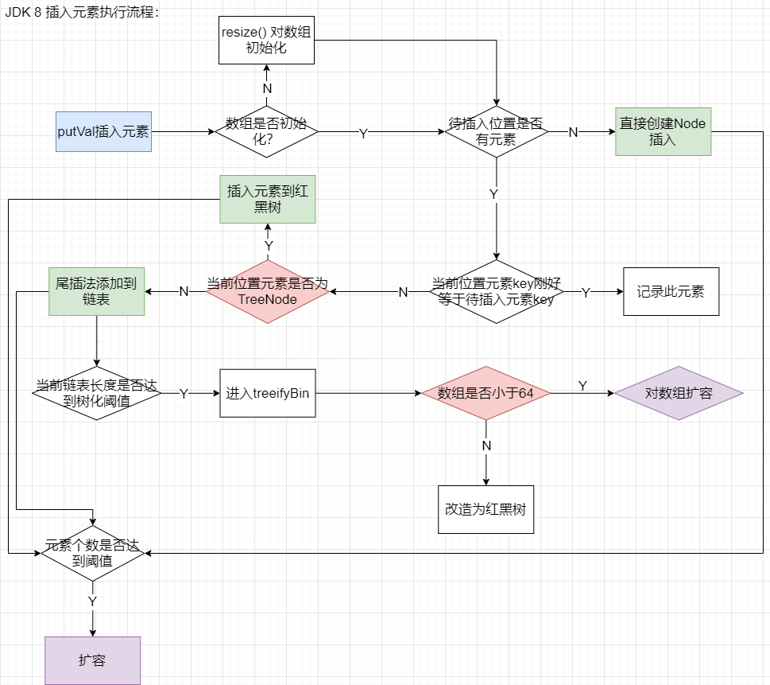
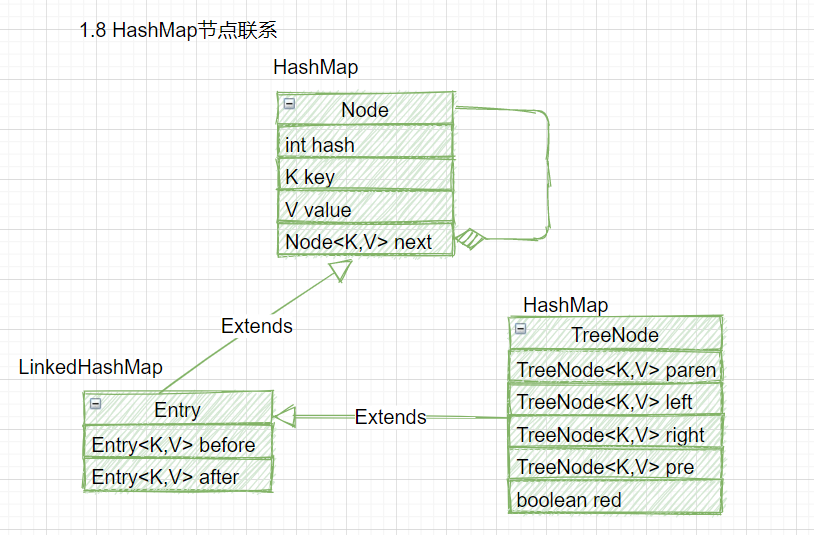
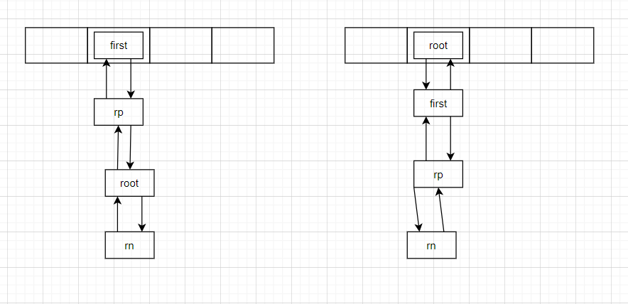
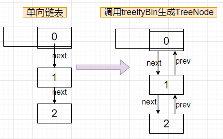
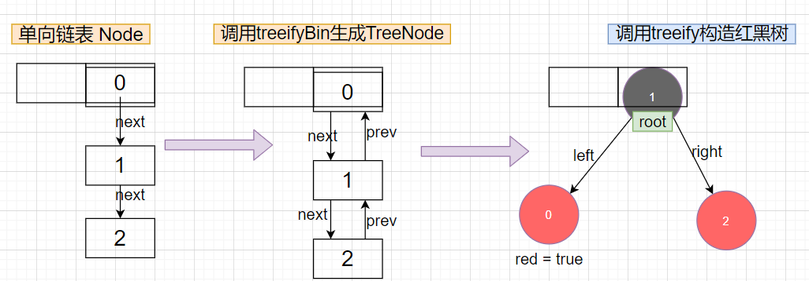
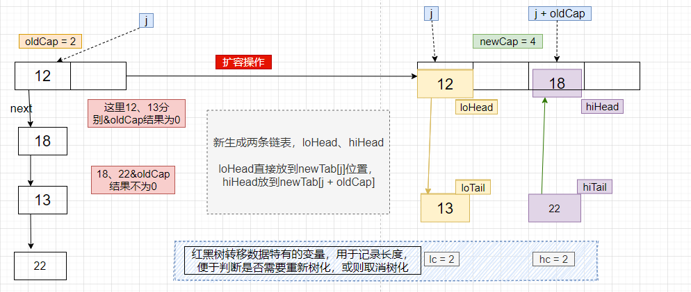
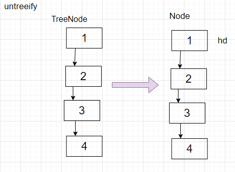

## HashMap

### 1.7 跟1.8 区别

- 数组+链表改成了数组+链表或红黑树；
- 链表的插入方式从头插法改成了尾插法，简单说就是插入时，如果数组位置上已经有元素，1.7将新元素放到数组中，原始节点作为新节点的后继节点，1.8遍历链表，将元素放置到链表的最后；
- 扩容的时候1.7需要对原数组中的元素进行重新hash定位在新数组的位置，1.8采用更简单的判断逻辑，`位置不变或索引+旧容量大小`；
- 在插入时，1.7先判断是否需要扩容，再插入，1.8先进行插入，插入完成再判断是否需要扩容；
- 在计算hashcode时，1.7 比1.8  异或次数多


#### 插入逻辑

1.8插入流程：




1.7 为Entry 数组


#### hash算法

插入元素时会通过key 的hash值 & hash表长度-1， 得到一个新位置， 

即: ` hash(key) & (table.length - 1)`,  为了使元素在hash表中尽量的分散， 选择合适的hash算法至关重要


由于hash表使用2的幂作为掩码， 如果直接使用原始的hash值来计算，当元素的hash值只在该掩码以上的位 发生变化时，将会发生冲突， 因此使用高16位右移16位来参与hash运算，尽可能的使元素映射到数组位置时能够更加分散

目的都是为了防止低位不变而导致冲突严重


1.7

```java
final int hash(Object k) {
    int h = hashSeed;
    if (0 != h && k instanceof String) {
        return sun.misc.Hashing.stringHash32((String) k);
    }

    h ^= k.hashCode();

    // This function ensures that hashCodes that differ only by
    // constant multiples at each bit position have a bounded
    // number of collisions (approximately 8 at default load factor).
    h ^= (h >>> 20) ^ (h >>> 12);
    return h ^ (h >>> 7) ^ (h >>> 4);
}
```


1.8


```java
static final int hash(Object key) {
    int h;
    return (key == null) ? 0 : (h = key.hashCode()) ^ (h >>> 16);
}
```


### JDK7：

> 插入数据时采用头插法，多个线程扩容时会发生并发异常，可能会有循环链表出现
>
> 循环链表产生介绍：https://coolshell.cn/articles/9606.html

#### **属性：**

```java
// 默认容量
static final int DEFAULT_INITIAL_CAPACITY = 1 << 4; // aka 16
static final int MAXIMUM_CAPACITY = 1 << 30;
static final float DEFAULT_LOAD_FACTOR = 0.75f;
static final Entry<?,?>[] EMPTY_TABLE = {};
// 初始化时为一个空数组
transient Entry<K,V>[] table = (Entry<K,V>[]) EMPTY_TABLE;
// The number of key-value mappings contained in this map
transient int size;
// 在resize时，值将更新为capacity * load factor
int threshold;
final float loadFactor; 
transient int modCount;
// 由于String keys 的hashcode比较低，容易造成冲突，为了降低冲突引入的alternativeHashing
// HashMap中有一个静态内部类，通过这个静态内部类获取alternativeHashing的值
static final int ALTERNATIVE_HASHING_THRESHOLD_DEFAULT = Integer.MAX_VALUE;
// hash种子，为了减低hash冲突
transient int hashSeed = 0;
```

#### **普通方法：**

```java
// 构造方法：
public HashMap(int initialCapacity, float loadFactor) {
    if (initialCapacity > MAXIMUM_CAPACITY)
        initialCapacity = MAXIMUM_CAPACITY;

    this.loadFactor = loadFactor;
    threshold = initialCapacity;
    init();
}

// 计算hashcode
final int hash(Object k) {
    // hashSeed 默认为 0
    int h = hashSeed;
    if (0 != h && k instanceof String) {
        return sun.misc.Hashing.stringHash32((String) k);
    }
	// 避免只有低位不同而导致冲突频繁，因而让高位跟低位同时参与计算
    h ^= k.hashCode();
    h ^= (h >>> 20) ^ (h >>> 12);
    return h ^ (h >>> 7) ^ (h >>> 4);
}

// 计算index
static int indexFor(int h, int length) {
   	// 结果只能返回0 - (length -1)
    return h & (length-1);
}

// 扩容
private void inflateTable(int toSize) {
    // Find a power of 2 >= toSize
    int capacity = roundUpToPowerOf2(toSize);

    threshold = (int) Math.min(capacity * loadFactor, MAXIMUM_CAPACITY + 1);
    table = new Entry[capacity];
    initHashSeedAsNeeded(capacity);
}

// 返回一个满足： power of 2>= number的数 ， 
// 如 17， 返回32， 
// 16，返回16
private static int roundUpToPowerOf2(int number) {
    // assert number >= 0 : "number must be non-negative";
    return number >= MAXIMUM_CAPACITY
        ? MAXIMUM_CAPACITY
        : (number > 1) ? Integer.highestOneBit((number - 1) << 1) : 1;
}

// Integer中的方法：取一个小于等于i，并且是2的幂
// 比如17，返回16
public static int highestOneBit(int i) {
    // HD, Figure 3-1
    i |= (i >>  1);
    i |= (i >>  2);
    i |= (i >>  4);
    i |= (i >>  8);
    i |= (i >> 16);
    return i - (i >>> 1);
}
```


#### **put方法：**

这里采用的头插法：

```java
// put map 
public V put(K key, V value) {
    if (table == EMPTY_TABLE) {
        inflateTable(threshold);
    }
    if (key == null)
        return putForNullKey(value);
    int hash = hash(key);
    int i = indexFor(hash, table.length);
    for (Entry<K,V> e = table[i]; e != null; e = e.next) {
        Object k;
        if (e.hash == hash && ((k = e.key) == key || key.equals(k))) {
            V oldValue = e.value;
            e.value = value;
            e.recordAccess(this);
            return oldValue;
        }
    }

    modCount++;
    addEntry(hash, key, value, i);
    return null;
}

// 添加元素
void addEntry(int hash, K key, V value, int bucketIndex) {
    // 如果元素大小大于了阈值，并且要插入元素的位置不为空，那么触发扩容机制
    if ((size >= threshold) && (null != table[bucketIndex])) {
        resize(2 * table.length);
        hash = (null != key) ? hash(key) : 0;
        bucketIndex = indexFor(hash, table.length);
    }
    createEntry(hash, key, value, bucketIndex);
}

void createEntry(int hash, K key, V value, int bucketIndex) {
    Entry<K,V> e = table[bucketIndex];
    table[bucketIndex] = new Entry<>(hash, key, value, e);
    size++;
}
```


#### 扩容：

```java

void resize(int newCapacity) {
    Entry[] oldTable = table;
    int oldCapacity = oldTable.length;
    if (oldCapacity == MAXIMUM_CAPACITY) {
        threshold = Integer.MAX_VALUE;
        return;
    }

    Entry[] newTable = new Entry[newCapacity];
    transfer(newTable, initHashSeedAsNeeded(newCapacity));
    table = newTable;
    threshold = (int)Math.min(newCapacity * loadFactor, MAXIMUM_CAPACITY + 1);
}
// 将旧元素转移到新的数组中
void transfer(Entry[] newTable, boolean rehash) {
    	// 执行到这个方法 newTable 线程私有
        int newCapacity = newTable.length;
    	// 遍历数组中的每一个Entry
        for (Entry<K,V> e : table) {
            // 将原来链表中的元素转移到新的链表中，这里采用的头插法，多线程可能会发生循环链表
            while(null != e) {
                Entry<K,V> next = e.next;
                if (rehash) {
                    e.hash = null == e.key ? 0 : hash(e.key);
                }
                int i = indexFor(e.hash, newCapacity);
                e.next = newTable[i];
                newTable[i] = e;
                e = next;
            }
        }
    }
```


### JDK8：

JDK8 中并没有使用Entry节点的before、after属性，这两个属性在LinkedHashMap中作为双向链表使用



> Hash table based implementation of the <tt>Map</tt> interface.  This implementation provides all of the optional map operations, and permits<tt>null</tt> values and the <tt>null</tt> key.  (The <tt>HashMap</tt>class is roughly equivalent to <tt>Hashtable</tt>, except that it is unsynchronized and permits nulls.)  This class makes no guarantees as to the order of the map; in particular, it does not guarantee that the order will remain constant over time.

- 存的一个一个Node
- 默认初始化空间：16（必须2的幂）
- 初始化阈值： 12 = capacity * 0.75
- 最小的树化空间：64 ， 
- 当链表长度大于8（阈值），并且数组长度大于64，会将链表转为红黑树（链表长度小于6时，会将红黑树转为链表），否则对数组进行扩容
- 当元素个数达到阈值，就进行双倍扩容


#### 常量信息：

```java

    static final int DEFAULT_INITIAL_CAPACITY = 1 << 4; // aka 16

    static final int MAXIMUM_CAPACITY = 1 << 30;

    static final float DEFAULT_LOAD_FACTOR = 0.75f;


    static final int TREEIFY_THRESHOLD = 8;

    static final int UNTREEIFY_THRESHOLD = 6;

    static final int MIN_TREEIFY_CAPACITY = 64;

     // The next size value at which to resize (capacity * load factor).
    int threshold;
	// 存储数据的数组
	transient Node<K,V>[] table;
```


#### put操作：

```java
/**
     * Implements Map.put and related methods.
     *
     * @param hash hash for key
     * @param key the key
     * @param value the value to put
     * @param onlyIfAbsent if true, don't change existing value
     * @param evict if false, the table is in creation mode.
     * @return previous value, or null if none
     */
final V putVal(int hash, K key, V value, boolean onlyIfAbsent,
               boolean evict) {
    Node<K,V>[] tab; Node<K,V> p; int n, i;
    // 数组还没有初始化，进行resize()进行初始化操作
    if ((tab = table) == null || (n = tab.length) == 0)
        n = (tab = resize()).length;
    // 计算当前插入的key应该对应数组的那个位置是否有元素存在，当前位置没有元素存在则直接创建一个节点放到当前计算出的位置上
    if ((p = tab[i = (n - 1) & hash]) == null)
        tab[i] = newNode(hash, key, value, null);
    else {
        // e用来表示在数组当前位置上找到一个key跟要插入的key相同，找到就赋值给e
        Node<K,V> e; K k;
        // 如果插入的元素的key与当前位置的key一样，则将当前位置节点赋值给e
        if (p.hash == hash &&
            ((k = p.key) == key || (key != null && key.equals(k))))
            e = p;
        // 如果当前位置是采用的红黑树来实现，则进入putTreeVal方法，同时判断红黑树中是否也有相同的key存在
        else if (p instanceof TreeNode)
            e = ((TreeNode<K,V>)p).putTreeVal(this, tab, hash, key, value);
        else {
            // 当前位置采用链表来实现，遍历整个链表
            for (int binCount = 0; ; ++binCount) {
                // 遍历到最后一个节点
                if ((e = p.next) == null) {
                    p.next = newNode(hash, key, value, null);
                    // 当binCount >= 7时，对整个链表进行树化，此时链表一共9个
                    if (binCount >= TREEIFY_THRESHOLD - 1) // -1 for 1st
                        treeifyBin(tab, hash);
                    break;
                }
                // 在当前链表中找到一个相同的key，赋值给e
                if (e.hash == hash &&
                    ((k = e.key) == key || (key != null && key.equals(k))))
                    break;
                p = e;
            }
        }
        // 是否找到相同的key存在
        if (e != null) { // existing mapping for key
            V oldValue = e.value;
            // 根据传入的onlyIfAbsent，来判断是否让新值覆盖旧值，默认false覆盖
            if (!onlyIfAbsent || oldValue == null)
                e.value = value;
            // 空构造，没有实现
            afterNodeAccess(e);
            return oldValue;
        }
    }
    ++modCount;
    // 判断size是否大于阈值，从而进行扩容
    if (++size > threshold)
        resize();
    // 空构造
    afterNodeInsertion(evict);
    return null;
}

```


#### putTreeVal:

TreeNode中的方法：红黑树内部维护了prev、next 相当于一个双向链表

```java
// LinkedHashMap.Entry<K,V> attribute
Entry<K,V> before, after
    
// TreeNode attribute:  extends LinkedHashMap.Entry<K,V>
TreeNode<K,V> parent;  // red-black tree links
TreeNode<K,V> left;
TreeNode<K,V> right;
TreeNode<K,V> prev;    // needed to unlink next upon deletion
boolean red;

// Node attribute:  extends HashMap.Node<K,V>
final int hash;
final K key;
V value;
Node<K,V> next;


final TreeNode<K,V> putTreeVal(HashMap<K,V> map, Node<K,V>[] tab,
                               int h, K k, V v) {
    Class<?> kc = null;
    boolean searched = false;
    // 得到红黑树的根结点
    TreeNode<K,V> root = (parent != null) ? root() : this;
    for (TreeNode<K,V> p = root;;) {
        // dir: -1,往左边，  1往右边
        int dir, ph; K pk;
        if ((ph = p.hash) > h)
            dir = -1;
        else if (ph < h)
            dir = 1;
        // 在红黑树中找到一个节点的key与要插入的key相同
        else if ((pk = p.key) == k || (k != null && k.equals(pk)))
            return p;
        // 判断key是否实现了Comparable比较器
        else if ((kc == null &&
                  (kc = comparableClassFor(k)) == null) ||
                 (dir = compareComparables(kc, k, pk)) == 0) {
            if (!searched) {
                TreeNode<K,V> q, ch;
                searched = true;
                if (((ch = p.left) != null &&
                     // 调用find()方法查找红黑树中是否有相同的key
                     (q = ch.find(h, k, kc)) != null) ||
                    ((ch = p.right) != null &&
                     (q = ch.find(h, k, kc)) != null))
                    return q;
            }
            dir = tieBreakOrder(k, pk);
        }

        TreeNode<K,V> xp = p;
        if ((p = (dir <= 0) ? p.left : p.right) == null) {
            Node<K,V> xpn = xp.next;
            TreeNode<K,V> x = map.newTreeNode(h, k, v, xpn);
            if (dir <= 0)
                xp.left = x;
            else
                xp.right = x;
            xp.next = x;
            x.parent = x.prev = xp;
            if (xpn != null)
                ((TreeNode<K,V>)xpn).prev = x;
            // 将红黑树的root作为数组的第一个元素，如下图
            moveRootToFront(tab, balanceInsertion(root, x));
            return null;
        }
    }
}

/**
* Ensures that the given root is the first node of its bin.
*/
static <K,V> void moveRootToFront(Node<K,V>[] tab, TreeNode<K,V> root) {
    int n;
    if (root != null && tab != null && (n = tab.length) > 0) {
        int index = (n - 1) & root.hash;
        TreeNode<K,V> first = (TreeNode<K,V>)tab[index];
        if (root != first) {
            Node<K,V> rn;
            tab[index] = root;
            TreeNode<K,V> rp = root.prev;
            if ((rn = root.next) != null)
                ((TreeNode<K,V>)rn).prev = rp;
            if (rp != null)
                rp.next = rn;
            if (first != null)
                first.prev = root;
            root.next = first;
            root.prev = null;
        }
        assert checkInvariants(root);
    }
}
```


**将root作为数组中的第一个元素**



#### 平衡红黑树：

##### 插入平衡：

```java
static <K,V> TreeNode<K,V> balanceInsertion(TreeNode<K,V> root,
                                            TreeNode<K,V> x) {
    // 新节点默认为红色
    x.red = true;
    // xp: x的父节点， xpp：x的祖父，  xppl:xpp的左孩子， xppr: xpp的右孩子
    for (TreeNode<K,V> xp, xpp, xppl, xppr;;) {
        // 如果当节点没有父节点，则将x作为根结点返回
        if ((xp = x.parent) == null) {
            x.red = false;
            return x;
        }
        // 父节点为黑色，同时没有祖父结点，相当于在一个孤立的节点下面插入元素
        else if (!xp.red || (xpp = xp.parent) == null)
            return root;
        // xp为xpp的左孩子
        if (xp == (xppl = xpp.left)) {
            // x的叔叔为红色，则父节点和叔叔变为黑色，祖父变红色
            if ((xppr = xpp.right) != null && xppr.red) {
                xppr.red = false;
                xp.red = false;
                xpp.red = true;
                // 将祖父结点赋值给x，继续递归向上平衡，可能会出现红黑树插入结点最后一个例子
               	// 即x的父节点可能也是红色，则要继续进行旋转+变色
                x = xpp;
            }
            else {
                // x为父节点的右孩子，对父节点进行左旋
                if (x == xp.right) {
                    root = rotateLeft(root, x = xp);
                    xpp = (xp = x.parent) == null ? null : xp.parent;
                }
               
                if (xp != null) {
                    // 父节点变为黑色
                    xp.red = false;
                    // 如果祖父结点不为null，则将祖父结点变为红色，同时对祖父结点进行右旋
                    if (xpp != null) {
                        xpp.red = true;
                        root = rotateRight(root, xpp);
                    }
                }
            }
        }
        // xp为xpp的右孩子
        else {
            if (xppl != null && xppl.red) {
                xppl.red = false;
                xp.red = false;
                xpp.red = true;
                x = xpp;
            }
            else {
                if (x == xp.left) {
                    root = rotateRight(root, x = xp);
                    xpp = (xp = x.parent) == null ? null : xp.parent;
                }
                if (xp != null) {
                    xp.red = false;
                    if (xpp != null) {
                        xpp.red = true;
                        root = rotateLeft(root, xpp);
                    }
                }
            }
        }
    }
}
```


#### 红黑树旋转：

```java
static <K,V> TreeNode<K,V> rotateLeft(TreeNode<K,V> root,
                                      TreeNode<K,V> p) {
    TreeNode<K,V> r, pp, rl;
    if (p != null && (r = p.right) != null) {
        if ((rl = p.right = r.left) != null)
            rl.parent = p;
        if ((pp = r.parent = p.parent) == null)
            (root = r).red = false;
        else if (pp.left == p)
            pp.left = r;
        else
            pp.right = r;
        r.left = p;
        p.parent = r;
    }
    return root;
}

// 右旋操作
static <K,V> TreeNode<K,V> rotateRight(TreeNode<K,V> root,
                                       TreeNode<K,V> p) {
    TreeNode<K,V> l, pp, lr;
    if (p != null && (l = p.left) != null) {
        if ((lr = p.left = l.right) != null)
            lr.parent = p;
        if ((pp = l.parent = p.parent) == null)
            (root = l).red = false;
        else if (pp.right == p)
            pp.right = l;
        else
            pp.left = l;
        l.right = p;
        p.parent = l;
    }
    return root;
}
```

#### treeifyBin

如果`链表长度达到8`时会调用这个方法，链表向红黑树转换的中间操作

```java
final void treeifyBin(Node<K,V>[] tab, int hash) {
        int n, index; Node<K,V> e;
    	// 判断当前数组长度是否小于64，小于64则进行扩容，否则转换为红黑树
        if (tab == null || (n = tab.length) < MIN_TREEIFY_CAPACITY)
            resize();
        else if ((e = tab[index = (n - 1) & hash]) != null) {
            TreeNode<K,V> hd = null, tl = null;
            // 将节点Node转为TreeNode
            do {
                TreeNode<K,V> p = replacementTreeNode(e, null);
                if (tl == null)
                    hd = p;
                else {
                    p.prev = tl;
                    tl.next = p;
                }
                tl = p;
            } while ((e = e.next) != null);
            if ((tab[index] = hd) != null)
                hd.treeify(tab);
        }
    }
```

上述代码完成工作如下：



**将上面生成的双向链表转为红黑树：**

``` java
final void treeify(Node<K,V>[] tab) {
    TreeNode<K,V> root = null;
    // this表示的TreeNode的根结点
    for (TreeNode<K,V> x = this, next; x != null; x = next) {
        next = (TreeNode<K,V>)x.next;
        x.left = x.right = null;
        // 将第一个节点暂时作为根结点，后面调用balanceInsert时root会调整
        if (root == null) {
            x.parent = null;
            x.red = false;
            root = x;
        }
        else {
            K k = x.key;
            int h = x.hash;
            Class<?> kc = null;
            // 依次将链表上的每个结点插入到红黑树中，通过balanceInsertion来确保平衡
            for (TreeNode<K,V> p = root;;) {
                int dir, ph;
                K pk = p.key;
                if ((ph = p.hash) > h)
                    dir = -1;
                else if (ph < h)
                    dir = 1;
                else if ((kc == null &&
                          (kc = comparableClassFor(k)) == null) ||
                         (dir = compareComparables(kc, k, pk)) == 0)
                    dir = tieBreakOrder(k, pk);

                TreeNode<K,V> xp = p;
                if ((p = (dir <= 0) ? p.left : p.right) == null) {
                    x.parent = xp;
                    if (dir <= 0)
                        xp.left = x;
                    else
                        xp.right = x;
                    // 每次遍历一个节点就执行一次平衡操作
                    root = balanceInsertion(root, x);
                    break;
                }
            }
        }
    }
    // 让红黑树的root作为数组第一个元素
    moveRootToFront(tab, root);
}
```

**图示：**




#### 扩容操作（resize）：

当size > threshold， 或则初始化时将会调用此方法

```java
final Node<K,V>[] resize() {
    Node<K,V>[] oldTab = table;
    int oldCap = (oldTab == null) ? 0 : oldTab.length;
    int oldThr = threshold;
    int newCap, newThr = 0;
    if (oldCap > 0) {
        // 原数组长度大于了最大整数
        if (oldCap >= MAXIMUM_CAPACITY) {
            threshold = Integer.MAX_VALUE;
            return oldTab;
        }
        // 原数组长度2倍小于MAXMUM_CAPACITY，同时大于16，对阈值进行双倍扩大
        else if ((newCap = oldCap << 1) < MAXIMUM_CAPACITY &&
                 oldCap >= DEFAULT_INITIAL_CAPACITY)
            newThr = oldThr << 1; // double threshold
    }
    else if (oldThr > 0) // initial capacity was placed in threshold
        newCap = oldThr;	// 如果初始化指定了默认空间，那么这里的oldThr就是指定的空间大小，同时满足 2^n, 比如传入12， 那么oldThr = 16
    // 初始化空间大小，以及阈值
    else {               // zero initial threshold signifies using defaults
        newCap = DEFAULT_INITIAL_CAPACITY;// 16
        newThr = (int)(DEFAULT_LOAD_FACTOR * DEFAULT_INITIAL_CAPACITY);//12
    }
    if (newThr == 0) {
        float ft = (float)newCap * loadFactor;
        newThr = (newCap < MAXIMUM_CAPACITY && ft < (float)MAXIMUM_CAPACITY ?
                  (int)ft : Integer.MAX_VALUE);
    }
    threshold = newThr;
    @SuppressWarnings({"rawtypes","unchecked"})
    // 创建newCap大小的数组
    Node<K,V>[] newTab = (Node<K,V>[])new Node[newCap];
    table = newTab;
    if (oldTab != null) {
        for (int j = 0; j < oldCap; ++j) {
            Node<K,V> e;
            if ((e = oldTab[j]) != null) {
                // 将原来数组位置置为null，便于gc回收
                oldTab[j] = null;
                // 数组位置只有一个节点时直接插入到新数组中
                if (e.next == null)
                    newTab[e.hash & (newCap - 1)] = e;
                else if (e instanceof TreeNode)	 // 如果当前节点链表是一个红黑树
                    ((TreeNode<K,V>)e).split(this, newTab, j, oldCap);
                else { // preserve order
                    Node<K,V> loHead = null, loTail = null;
                    Node<K,V> hiHead = null, hiTail = null;
                    Node<K,V> next;
                    // 生成高低位链表，不同于ConcurrentHashMap
                    do {
                        next = e.next;
                        if ((e.hash & oldCap) == 0) {
                            if (loTail == null)
                                loHead = e;
                            else
                                loTail.next = e;
                            loTail = e;
                        }
                        else {
                            if (hiTail == null)
                                hiHead = e;
                            else
                                hiTail.next = e;
                            hiTail = e;
                        }
                    } while ((e = next) != null);
                    if (loTail != null) {
                        loTail.next = null;
                        newTab[j] = loHead;
                    }
                    if (hiTail != null) {
                        hiTail.next = null;
                        newTab[j + oldCap] = hiHead;
                    }
                }
            }
        }
    }
    return newTab;
}
```


数据转移图示：

`链表与红黑树都是这种方式进行数据转移`

红黑树树转移数据中，多了个lc、hc变量，用来记录转移数据后链表长度，判断后续是否需要树化




**红黑树元素转移**

##### **split**

转移红黑树中的元素

```java
/**
 转移红黑树中的元素
* @param bit the bit of hash to split on，即原数组的大小
*/
final void split(HashMap<K,V> map, Node<K,V>[] tab, int index, int bit) {
    TreeNode<K,V> b = this;
    // Relink into lo and hi lists, preserving order
    TreeNode<K,V> loHead = null, loTail = null;
    TreeNode<K,V> hiHead = null, hiTail = null;
    int lc = 0, hc = 0;
    for (TreeNode<K,V> e = b, next; e != null; e = next) {
        next = (TreeNode<K,V>)e.next;
        e.next = null;
        // 结果要么为0，要么为bit
        if ((e.hash & bit) == 0) {
            if ((e.prev = loTail) == null)
                loHead = e;
            else
                loTail.next = e;
            loTail = e;
            ++lc;
        }
        else {
            if ((e.prev = hiTail) == null)
                hiHead = e;
            else
                hiTail.next = e;
            hiTail = e;
            ++hc;
        }
    }

    if (loHead != null) {
        // 如果低位的节点数量少于6，那么取消树化
        if (lc <= UNTREEIFY_THRESHOLD)
            // 取消树化，同时将返回的链表放入到index位置上
            tab[index] = loHead.untreeify(map);
        else { 	// 直接将低位的链表移动到新数组中的index位置，index是原来链表的位置
            tab[index] = loHead;
            // hiHead为空，则说明在之前的循环中进行计数时，节点中的所有元素还是属于loHead，没有元素存在hiHead中，因此不用再次树化
            if (hiHead != null) // (else is already treeified)
                loHead.treeify(tab);
        }
    }
    if (hiHead != null) {
        if (hc <= UNTREEIFY_THRESHOLD)
            tab[index + bit] = hiHead.untreeify(map);
        else {	// 将高位的链表移动到index + bit位置
            tab[index + bit] = hiHead;
            if (loHead != null)
                // 重新调整红黑树
                hiHead.treeify(tab);
        }
    }
}

```


##### untreeify

转移元素后，链表元素小于等于6，将会在这里对红黑树节点从新转移为单链表

```java
// 取消当前链表的树化，节点数量<=6
// 将当前红黑树的结构转换为普通的链表，并返回根结点
final Node<K,V> untreeify(HashMap<K,V> map) {
    Node<K,V> hd = null, tl = null;
    // this 指的是 TreeNode节点
    for (Node<K,V> q = this; q != null; q = q.next) {
        // 创建一个Node节点，next为null
        Node<K,V> p = map.replacementNode(q, null);
        if (tl == null)
            hd = p;
        else
            tl.next = p;
        tl = p;
    }
    return hd;
}
```




#### 移除元素

```java
final Node<K,V> removeNode(int hash, Object key, Object value,
                           boolean matchValue, boolean movable) {
    Node<K,V>[] tab; Node<K,V> p; int n, index;
    // 计算需要移除的元素所在的数组位置
    if ((tab = table) != null && (n = tab.length) > 0 &&
        (p = tab[index = (n - 1) & hash]) != null) {
        Node<K,V> node = null, e; K k; V v;
        // 如果链表中的第一个元素的key刚好是要移除的元素
        if (p.hash == hash &&
            ((k = p.key) == key || (key != null && key.equals(k))))
            node = p;
        else if ((e = p.next) != null) {
            // 如果节点是TreeNode，那么调用红黑树的方法找到该节点
            if (p instanceof TreeNode)
                node = ((TreeNode<K,V>)p).getTreeNode(hash, key);
            else {
                // 在链表中找出key的节点，赋给node，p是node的前一个节点，方便删除node节点，p.next = node.next;
                do {
                    if (e.hash == hash &&
                        ((k = e.key) == key ||
                         (key != null && key.equals(k)))) {
                        node = e;
                        break;
                    }
                    p = e;
                } while ((e = e.next) != null);
            }
        }
        if (node != null && (!matchValue || (v = node.value) == value ||
                             (value != null && value.equals(v)))) {
            // 找出的节点是一个红黑树中的节点，那么调用红黑树的removeTreeNode方法进行删除，删除较复杂
            if (node instanceof TreeNode)
                ((TreeNode<K,V>)node).removeTreeNode(this, tab, movable);
            else if (node == p)	// 找出的节点刚好是数组中的第一个节点
                tab[index] = node.next;
            else	// remove node 节点
                p.next = node.next;
            ++modCount;
            --size;
            afterNodeRemoval(node); // 空方法
            return node;
        }
    }
    return null;
}
```