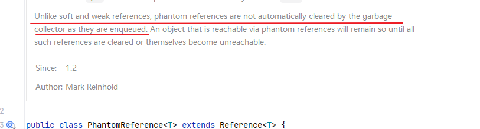
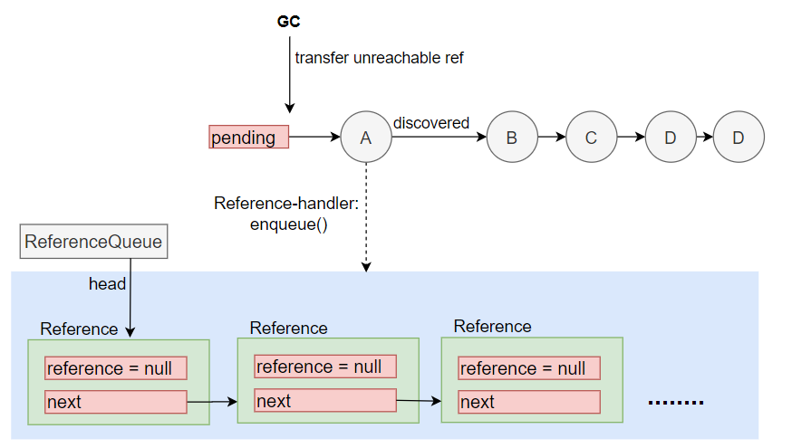
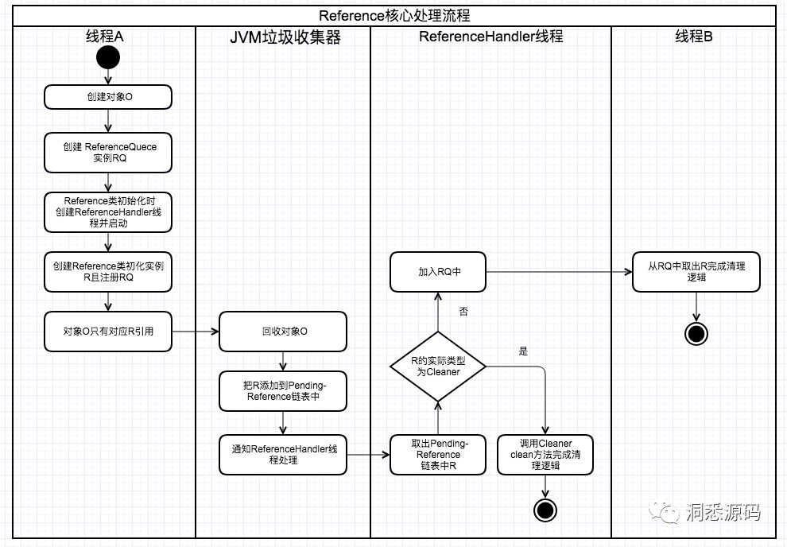

## Java中的引用

巨人的肩膀：

https://mp.weixin.qq.com/s/fALEUtnkDi9vyhLe5EDfEw              -- 公众号：洞悉源码

 http://blog.2baxb.me/archives/974                                                --  附带jvm源码分析

https://mp.weixin.qq.com/s/fftHK8gZXHCXWpHxhPQpBg           -- 你假笨：Finalizer解读


> 强引用、软引用、弱引用、虚引用(必须有引用队列)

只要对象被GC， reference 对象就被清理，即为null。   即：Reference.get() 永远返回null,

**虚引用比较特殊**：当虚引用对象被GC 后，debug 能看到 **reference属性**实际上还是有值。

doc上已注明： 当虚引用对象入队后， 并不会自动清理引用对象。 




```java
FinalizerThread extends Thread 
```

软引用中有一个timestamp 属性，每次get() 方法调用将会更新该字段，VM 在清理软引用对象时可以使用该字段


引用相关的一些类：WeakHashMap  ConcurrentReferenceHashMap  ThreadLocal 


**大概流程：**








### Reference

> 引用对象的抽象基类，定义了应用对象常用操作，该类与GC 密切相关。


四种内部状态：

Active：由垃圾收集器进行特殊处理。收集器检测到引用对象的可达性发生改变后，会将实例的状态更改为“pending”或“Inactive”，具体取决于实例创建时是否已在队列中注册。在前一种情况下，它还将实例添加到pending的引用列表中。新创建的实例处于**active**状态

Pending： pending Reference 列表， 等待Reference-handler 线程 处理或入队。 未注册的实例不会处于此状态。

Enqueued：创建实例时注册的队列元素，当实例从ReferenceQueue 中移除时，将变为Inactive。未注册的实例不会处于此状态。

Inactive：该状态没有什么可做。一旦实例变为该状态，那么他的状态将不会再改变。


Reference 状态在queue、next的变化如下：

Active： queue 为实例注册时指定的引用队列(没有指定则为ReferenceQueue.NULL )； next = null

Pending：queue 为注册时指定的引用队列； next = this

Enqueued：queue = ReferenceQueue.ENQUEUED;  next 为队列中的下一个实例( 下一个为空则为自己)

Inactive：queue = ReferenceQueue.NULL; next = this.


​                                                                                                                                                       --- 翻译JavaDoc

**核心变量**：

```java
// get、clear方法都是操作的这个对象, 如果该引用对象被GC 清理，那么会返回null
private T referent;	// 引用对象
// 存放已经被回收过的对象，tryHandlePending()方法会将回收过的引用对象入队
volatile ReferenceQueue<? super T> queue; // 引用队列

/* When active:   NULL
*     pending:   this
*    Enqueued:   next reference in queue (or this if last)
*    Inactive:   this
*/
@SuppressWarnings("rawtypes")
volatile Reference next;

/* When active:   next element in a discovered reference list maintained by GC (or this if last)
*     pending:   next element in the pending list (or null if last)
*     otherwise:   NULL
*/
transient private Reference<T> discovered;  
// 等待入队的Reference 对象列表，由GC添加到list， 直到ReferenceHandler线程 移除他们
// 操作时会受到lock 对象的保护，  全局唯一
private static Reference<Object> pending = null;

```

**队列操作**

```java
// 判断Reference是否已入队, 引用对象通常会被GC 入队
//      isEnqueued(): this.queue == ReferenceQueue.ENQUEUED
// 添加当前Reference对象到当前注册的引用队列中
//      enqueued(): return this.queue.enqueue(this);

// 基本构造
Reference(T referent) {
    this(referent, null);
}

Reference(T referent, ReferenceQueue<? super T> queue) {
    this.referent = referent;
    this.queue = (queue == null) ? ReferenceQueue.NULL : queue;
}
```


static 代码块：主要负责初始化ReferenceHandler线程，用于处理引用对象

```java
static {
    ThreadGroup tg = Thread.currentThread().getThreadGroup();
    // 获得最顶层线程组
    for (ThreadGroup tgn = tg;
         tgn != null;
         tg = tgn, tgn = tg.getParent());
    Thread handler = new ReferenceHandler(tg, "Reference Handler");
    /* If there were a special system-only priority greater than
         * MAX_PRIORITY, it would be used here
         */
    // 设置为最大优先级，具体调用由OS 实现
    handler.setPriority(Thread.MAX_PRIORITY);
    handler.setDaemon(true); // 当非守护线程执行完毕后，VM自动退出
    handler.start();

    // provide access in SharedSecrets
    // Finalizer#runFinalization 将会调用 (System.gc())
    SharedSecrets.setJavaLangRefAccess(new JavaLangRefAccess() {
        @Override
        public boolean tryHandlePendingReference() {
            return tryHandlePending(false);
        }
    });
}
```


**tryHandlePending**

> 尝试处理pending的Reference对象, 如果有的话
>
> 返回True 表示也许有一个pending的Reference，False 表示当前没有pending且此时会做一些额外的工作而不是循环

ReferenceHander#tryHandlePending(true)

SharedSecrets#tryHandlePendingReference —>      tryHandlePending (false)

```java
/**
waitForNotify: true: 如果没有pending Reference，那么等待，直到被VM通知或中断
			   false: 没有 pending Reference， 立即返回
*/
static boolean tryHandlePending(boolean waitForNotify) {
    Reference<Object> r;
    Cleaner c;
    try {
        synchronized (lock) {
            if (pending != null) {
                r = pending;
                // 'instanceof' might throw OutOfMemoryError sometimes
                // so do this before un-linking 'r' from the 'pending' chain...
                c = r instanceof Cleaner ? (Cleaner) r : null;
                // unlink 'r' from 'pending' chain
                pending = r.discovered;
                r.discovered = null;
            } else {
                // The waiting on the lock may cause an OutOfMemoryError
                // because it may try to allocate exception objects.
                if (waitForNotify) {
                    lock.wait();
                }
                // retry if waited
                return waitForNotify;
            }
        }
    } catch (OutOfMemoryError x) {
        Thread.yield();
        // retry
        return true;
    } catch (InterruptedException x) {
        // retry
        return true;
    }

    // Fast path for cleaners
    if (c != null) {
        c.clean(); // 执行一些特殊的操作，Cleaner中可以绑定Runnable
        return true;
    }

    ReferenceQueue<? super Object> q = r.queue;
    // 引用回收后将自身放入queue中，便于可以从queue中获取到对象，ReferenceQueue.remove()
    if (q != ReferenceQueue.NULL) q.enqueue(r);
    return true;
}
```


### ReferenceHandler

**ReferenceHandler extends Thread**

> 会初始化Cleaner.class ，便于后期为Cleaner 相关对象 处理清理逻辑， JVM启动时，该线程就会被创建、执行

核心方法

```java
public void run() {
    while (true) {
        // 处理pending 节点
        tryHandlePending(true);
    }
}

```

### ReferenceQueue

> 可达性分析发生改变时，GC 会将引用对象注册到该引用队列中

**核心变量**：

```java
private volatile Reference<? extends T> head = null;
private long queueLength = 0;
// 初始化时未指定引用队列默认值
static ReferenceQueue<Object> NULL = new Null<>();
// 当引用对象入队时，会将queue变量指定为ENQUEUED
static ReferenceQueue<Object> ENQUEUED = new Null<>();

```

enqueue(r):

> Reference 入队操作， 将新Reference 作为新的head

```java
synchronized (lock) {
    // Check that since getting the lock this reference hasn't already been
    // enqueued (and even then removed)
    ReferenceQueue<?> queue = r.queue;
    if ((queue == NULL) || (queue == ENQUEUED)) {
        return false;
    }
    assert queue == this;
    r.queue = ENQUEUED;
    r.next = (head == null) ? r : head;
    head = r;
    queueLength++;
    if (r instanceof FinalReference) {
        sun.misc.VM.addFinalRefCount(1);
    }
    lock.notifyAll();
    return true;
}
```


reallyPoll

> 弹出一个节点
>
> 即：将head 重新指向head.next, 原head 结点清空属性值, 返回原来的head

```java
Reference<? extends T> r = head;
if (r != null) {
    @SuppressWarnings("unchecked")
    Reference<? extends T> rn = r.next;
    head = (rn == r) ? null : rn;
    r.queue = NULL;
    r.next = r;
    queueLength--;
    if (r instanceof FinalReference) {
        sun.misc.VM.addFinalRefCount(-1);
    }
    return r;
}
return null;
```


remove:

> 指定时间弹出队列中的Reference，如果没有则阻塞(timeout or indefinitely)

```java
public Reference<? extends T> remove(long timeout)
    throws IllegalArgumentException, InterruptedException
{
    if (timeout < 0) {
        throw new IllegalArgumentException("Negative timeout value");
    }
    synchronized (lock) {
        Reference<? extends T> r = reallyPoll();
        if (r != null) return r;
        long start = (timeout == 0) ? 0 : System.nanoTime();
        for (;;) {
            lock.wait(timeout);
            r = reallyPoll();
            if (r != null) return r;
            if (timeout != 0) {
                long end = System.nanoTime();
                timeout -= (end - start) / 1000_000;
                if (timeout <= 0) return null;
                start = end;
            }
        }
    }
}
```


### Cleaner

> Cleaner extends PhantomReference<Object>

对象清除时，做一些清理工作之类的，如Nio 包中一些分配本地内存的后续清理操作

**一些属性**

```java
private static final ReferenceQueue<Object> dummyQueue = new ReferenceQueue();
private static Cleaner first = null;
private Cleaner next = null;
private Cleaner prev = null;
// Cleaner 回调函数（Deallocator）
private final Runnable thunk;

// 形成一个Cleaner 链表
private static synchronized Cleaner add(Cleaner var0) {
    if (first != null) {
        var0.next = first;
        first.prev = var0;
    }
    first = var0;
    return var0;
}
// Reference.tryHandlePending(): 会判断执行该方法
public void clean() {
    if (remove(this)) {
       this.thunk.run();

```


在创建直接内存使用的DirectByteBuffer类中，会附带创建一个Cleaner对象：

DirectByteBuffer.java# 构造方法

```java
DirectByteBuffer(int cap) { 
    .....
    long base = 0;
    base = unsafe.allocateMemory(size);
    unsafe.setMemory(base, size, (byte) 0);
    if (pa && (base % ps != 0)) {
        // Round up to page boundary
        address = base + ps - (base & (ps - 1));
    } else {
        address = base;
    }
    // 这里就是用于回收内存使用
    cleaner = Cleaner.create(this, new Deallocator(base, size, cap));
}
```


Deallocator 类继承 Runnable

```java
private Deallocator(long address, long size, int capacity) {
    assert (address != 0);
    this.address = address;
    this.size = size;
    this.capacity = capacity;
}
// 清理内存
public void run() {
    if (address == 0) {
        // Paranoia
        return;
    }
    unsafe.freeMemory(address);
    address = 0;
    Bits.unreserveMemory(size, capacity);
}
```


### Finalizer

> 主要由GC 使用

```java
private static ReferenceQueue<Object> queue = new ReferenceQueue<>();
private static Finalizer unfinalized = null;
private static final Object lock = new Object();

private Finalizer
next = null,
prev = null;

 /* Invoked by VM */
static void register(Object finalizee) {
    new Finalizer(finalizee);
}
```


**remove**

```java
private void remove() {
    synchronized (lock) {
        if (unfinalized == this) {
            if (this.next != null) {
                unfinalized = this.next;
            } else {
                unfinalized = this.prev;
            }
        }
        if (this.next != null) {
            this.next.prev = this.prev;
        }
        if (this.prev != null) {
            this.prev.next = this.next;
        }
        this.next = this;   /* Indicates that this has been finalized */
        this.prev = this;
    }
}
```


#### 内部类 FinalizerThread

> class Finalizer extends FinalReference<Object>
>
> Finalizer 类初始化时会创建该线程， 线程优先级较低，主要用于执行对象中重写的finalize方法


```java
// Reference-handler 线程会执行setJavaLangAccess() 方法
//         --->  Reference#tryHandlePending(false);
final JavaLangAccess jla = SharedSecrets.getJavaLangAccess();
running = true;
for (;;) {
    try {
        // System.gc() 方法调用后，会将对象添加到queue中
        Finalizer f = (Finalizer)queue.remove();
        f.runFinalizer(jla); // 执行对象的finalize方法
    } catch (InterruptedException x) {
        // ignore and continue
    }
}
private void runFinalizer(JavaLangAccess jla) {
    synchronized (this) {
        if (hasBeenFinalized()) return;
        remove();
    }
    try {
        Object finalizee = this.get();
        if (finalizee != null && !(finalizee instanceof java.lang.Enum)) {
            // 调用对象的finalize方法
            jla.invokeFinalize(finalizee);
            finalizee = null;
        }
    } catch (Throwable x) { }
    super.clear();
}

```


### System.gc()

> 由FinalizerThread进行处理


## ConcurrentReferenceHashMap

> Spring 中用于替代WeakHashMap的并发HashMap，可以指定使用软引用或者弱引用

默认并发读 16， 类似1.7 中CHM 的Segment，Segment 继承ReentrantLock, Segment中的Entry作为引用对象

内部使用Segment数组，

一个Segment 有一个ReferenceManager，一个数组：Reference[]

​               -- 每个Reference放入一个Reference 链表 （T：Entry,）


IdentityHashMap:

java 自带的map，采用数组实现，遇到相同的桶时不会采用拉链式，而是直接看当前位置 + 2 是否存在元素，依次向后遍历。

如果算出key 应该在index 位置存储key，那么将在index + 1 存储value


WeakCache


