集合

* LIst
* Set
* Map

transient: 对象在序列化时,transient标识的属性不被序列化,通常用于可以通过其他属性推断出此属性的值

# List、Map:

**无序,可以重复**

* ArrayList

  底层为数组组成的数据结构,可以利用下表访问元素

* linkedList

  链表实现

**线程安全类：**

- Vector： 通过加synchronized锁的方式
- HashTable： 方法层面加synchronized锁
- Collections生成的集合： 内部同样是采用的加synchronized锁
- CopyOnWriteArrayList（COW）： 写时复制，方法中才用了大量复制数组的操作，同时加入了Reen锁来保证线程安全性 ，CopyOnWriteArraySet实际上使用的是CopyOnWriteArrayList，
  - 写时复制只能保证数据的最终一致性，不能保证数据的实时一致性。因为多个线程进行add时，会加锁，在进行复制数组，写入新元素，赋值给Object数组。

## List

### ArrayList：

- 大小可扩容，底层数组实现，允许插入null
- ArrayList线程不安全，实现类似于vector， vector仅仅是在方法上加了synchronized，因此Vector是线程安全的
- 默认空间10， 扩容按照原来的1.5倍进行扩容

``` java
/**
 * Default initial capacity.
*/
private static final int DEFAULT_CAPACITY = 10;

// 扩容操作 minCapacity = max(size + 1, DEFAULT_CAPACITY)
private void grow(int minCapacity) {
    // overflow-conscious code
    int oldCapacity = elementData.length;
    // 1.5 倍扩容
    int newCapacity = oldCapacity + (oldCapacity >> 1);
    if (newCapacity - minCapacity < 0)
        newCapacity = minCapacity;
    if (newCapacity - MAX_ARRAY_SIZE > 0)
        newCapacity = hugeCapacity(minCapacity);
    // minCapacity is usually close to size, so this is a win:
    elementData = Arrays.copyOf(elementData, newCapacity);
}

// 移除元素：
public E remove(int index) {
    // 检查index是否越界
    rangeCheck(index);

    modCount++;
    E oldValue = elementData(index);
	// index 后面的元素数量，将后面的元素都向前移动一位
    int numMoved = size - index - 1;
    if (numMoved > 0)
        System.arraycopy(elementData, index+1, elementData, index,
                         numMoved);
    // 最后一位置空
    elementData[--size] = null; // clear to let GC do its work

    return oldValue;
}
// 移除指定的对象
public boolean remove(Object o) {
    if (o == null) {
        for (int index = 0; index < size; index++)
            if (elementData[index] == null) {
                fastRemove(index);
                return true;
            }
    } else {
        for (int index = 0; index < size; index++)
            if (o.equals(elementData[index])) {
                fastRemove(index);
                return true;
            }
    }
    return false;
}

```

### fail-fast

> 迭代器中遍历过程中原数组结构出现了更改，那么就会触发fail-fast，同时抛出ConcurrentModificationException， 如果是当前线程移除元素可以调用迭代器的remove来防止fast-fail

```java
private class Itr implements Iterator<E> {
    	// 保存当前遍历的元素下标
        int cursor;       // index of next element to return
    	// 记录当前遍历下标的上一个位置: = cursor - 1
        int lastRet = -1; // index of last element returned; -1 if no such
    	// 记录修改的次数
        int expectedModCount = modCount;

        Itr() {}
		// 判断cursor是否还在数组的范围内
        public boolean hasNext() {
            return cursor != size;
        }

        @SuppressWarnings("unchecked")
        public E next() {
            // 检查ExpectedModCount 是否等于modCount，如果不等，说明有其他线程更改了数组的结构，抛出异常
            checkForComodification();
            int i = cursor;
            // 判断i是否越界，如果中间有多个线程移除了多个元素可能会导致此时的i > size
            if (i >= size)
                throw new NoSuchElementException();
            Object[] elementData = ArrayList.this.elementData;
            // 继续判断是否越界
            if (i >= elementData.length)
                throw new ConcurrentModificationException();
            cursor = i + 1;
            return (E) elementData[lastRet = i];
        }

    	// 通过此方法来移除元素可以防止fast-fail
        public void remove() {
            if (lastRet < 0)
                throw new IllegalStateException();
            checkForComodification();

            try {
                // 移除元素重新设置lastRet的值
                ArrayList.this.remove(lastRet);
                cursor = lastRet;
                lastRet = -1;
                expectedModCount = modCount;
            } catch (IndexOutOfBoundsException ex) {
                throw new ConcurrentModificationException();
            }
        }
}
```

### fail-safe

fail-safe（安全失败）机制是指任何对集合结构的修改都会在一个复制的集合上进行修改，因此不会抛出ConcurrentModificationException。java.util.concurrent包下的容器(CopyOnWriteArrayList)都是安全失败，可以在多线程下并发使用，并发修改。

但是fail-safe机制有两个问题：

- 需要复制集合，产生大量的无效对象，开销大
- 无法保证读取的数据是目前原始数据结构中的数据，因为复制操作执行后，集合可能会发生改变

```java
static final class COWIterator<E> implements ListIterator<E> {
    /** Snapshot of the array */
    private final Object[] snapshot;
    /** Index of element to be returned by subsequent call to next.  */
    private int cursor;

    private COWIterator(Object[] elements, int initialCursor) {
        cursor = initialCursor;
        snapshot = elements;
    }
......
```


### LinkedList：

JDK1.6 之前为循环链表，JDK1.7 取消了循环，改用双向链表实现

- 双向链表，实现了List、Deque接口，允许元素为null
- 非同步，不保证并发安全

```java
// 属性：
transient int size = 0;
transient Node<E> first;
transient Node<E> last;
```

##### **添加元素：**

```java
/**
 * 将元素添加到最后
 * Links e as last element.
 */
// add 方法默认调用addLast -> linkLast
void linkLast(E e) {
    final Node<E> l = last;
    final Node<E> newNode = new Node<>(l, e, null);
    last = newNode;
    // 如果是第一次添加，那么将当前节点作为first
    if (l == null)
        first = newNode;
    else
        l.next = newNode;
    size++;
    modCount++;
}

/**
* 将元素添加到前面
* Links e as first element.
*/
private void linkFirst(E e) {
    final Node<E> f = first;
    final Node<E> newNode = new Node<>(null, e, f);
    first = newNode;
    if (f == null)
        last = newNode;
    else
        f.prev = newNode;
    size++;
    modCount++;
}
// 检查index位置的元素，先看index是在哪部分区间，将链表中间分为两个部分，分开查找
Node<E> node(int index) {
    // assert isElementIndex(index);
	// 从头开始找到index位置
    if (index < (size >> 1)) {
        Node<E> x = first;
        for (int i = 0; i < index; i++)
            x = x.next;
        return x;
    } else {
        // 从last开始向前遍历
        Node<E> x = last;
        for (int i = size - 1; i > index; i--)
            x = x.prev;
        return x;
    }
}
```

##### 移除元素：

```java
public boolean remove(Object o) {
    if (o == null) {
        for (Node<E> x = first; x != null; x = x.next) {
            if (x.item == null) {
                unlink(x);
                return true;
            }
        }
    } else {
        for (Node<E> x = first; x != null; x = x.next) {
            if (o.equals(x.item)) {
                unlink(x);
                return true;
            }
        }
    }
    return false;
}
// 将x前后的节点连接上，将x置空
E unlink(Node<E> x) {
    // assert x != null;
    final E element = x.item;
    final Node<E> next = x.next;
    final Node<E> prev = x.prev;

    if (prev == null) {
        first = next;
    } else {
        prev.next = next;
        x.prev = null;
    }

    if (next == null) {
        last = prev;
    } else {
        next.prev = prev;
        x.next = null;
    }

    x.item = null;
    size--;
    modCount++;
    return element;
}

// 断开最后一个节点l
private E unlinkLast(Node<E> l) {
        // assert l == last && l != null;
    final E element = l.item;
    final Node<E> prev = l.prev;
    l.item = null;
    l.prev = null; // help GC
    last = prev;
    if (prev == null)
        first = null;
    else
        prev.next = null;
    size--;
    modCount++;
    return element;
}
```


## HashTable

> 当执行put方法时会使用synchronized对对象进行加锁，会严重影响效率。

- 存的一个一个的entry

- 底层采用数组实现，当出现hash冲突时，使用链表解决冲突

- 默认空间11，加载因子0.75，

- 哈希函数：int index = (hash & 0x7FFFFFFF) % tab.length;

- 阈值：threshold = (int)Math.min(initialCapacity * loadFactor, MAX_ARRAY_SIZE + 1);
  - rehash后：threshold = (int)Math.min(newCapacity * loadFactor, MAX_ARRAY_SIZE + 1);
- 当count  > 阈值后，将调用rehash函数进行扩容，扩容为原来的2n + 1

### **常用属性**

```java
public class Hashtable<K,V>
    extends Dictionary<K,V>
    implements Map<K,V> {
    // 数组最大分配大小
    private static final int MAX_ARRAY_SIZE = Integer.MAX_VALUE - 8;
    // 使用数组来实现
    private transient Entry<?,?>[] table;
    // The total number of entries in the hash table.
    private transient int count;
    // 阈值：The value of this field is (int)(capacity * loadFactor)
    private int threshold;
    // the load factor for the hashtable
    private float loadFactor;
    // 记录修改的次数
    private transient int modCount = 0;
    // 有参构造
    public Hashtable(int initialCapacity, float loadFactor) {
        if (initialCapacity==0)
            initialCapacity = 1;
        this.loadFactor = loadFactor;
        table = new Entry<?,?>[initialCapacity];
        threshold = (int)Math.min(initialCapacity * loadFactor, MAX_ARRAY_SIZE + 1);
    }
    // public Hashtable(int initialCapacity) {
        this(initialCapacity, 0.75f);
    }
	public Hashtable() {   this(11, 0.75f);    }
	// 创建一个充足的Hashtable，来保存t
    public Hashtable(Map<? extends K, ? extends V> t) {
        this(Math.max(2*t.size(), 11), 0.75f);
        // 将t放入新创建的Hashtable中
        putAll(t);
    }
```
#### 获取元素
``` java
public synchronized boolean contains(Object value) {
        if (value == null) {
            throw new NullPointerException();
        }
		
        
        Entry<?,?> tab[] = table;
        // 从数组后往前寻找
        for (int i = tab.length ; i-- > 0 ;) {
            // 在同一位置遍历链表查询是否有相同的value
            for (Entry<?,?> e = tab[i] ; e != null ; e = e.next) {
                if (e.value.equals(value)) {
                    return true;
                }
            }
        }
        return false;
    }
    
    // Tests if the specified object is a key in this hashtable.
    public synchronized boolean containsKey(Object key) {
        Entry<?,?> tab[] = table;
        int hash = key.hashCode();
        // 通过hash函数求出下标
        int index = (hash & 0x7FFFFFFF) % tab.length;
        // 通过循环查询index位置链表的key是否与查找的值相等
        for (Entry<?,?> e = tab[index] ; e != null ; e = e.next) {
            if ((e.hash == hash) && e.key.equals(key)) {
                return true;
            }
        }
        return false;
    }
	// 与上面类似
    public synchronized V get(Object key) {
        Entry<?,?> tab[] = table;
        int hash = key.hashCode();
        int index = (hash & 0x7FFFFFFF) % tab.length;
        for (Entry<?,?> e = tab[index] ; e != null ; e = e.next) {
            if ((e.hash == hash) && e.key.equals(key)) {
                return (V)e.value;
            }
        }
        return null;
    }
```
#### 添加元素
``` java
	// 扩大并重新组织hashtable的空间，当hashtable的数量超过了容量和加载因子会自动调用此方法
	protected void rehash() {
        int oldCapacity = table.length;
        Entry<?,?>[] oldMap = table;

        // overflow-conscious code
        // 相当于oldCapacity*2 + 1
        int newCapacity = (oldCapacity << 1) + 1;
        // 如果扩容后的空间超过了最大值，那么依然保持最大值，不再进行扩容
        if (newCapacity - MAX_ARRAY_SIZE > 0) {
            if (oldCapacity == MAX_ARRAY_SIZE)
                // Keep running with MAX_ARRAY_SIZE buckets
                return;
            newCapacity = MAX_ARRAY_SIZE;
        }
        Entry<?,?>[] newMap = new Entry<?,?>[newCapacity];
        modCount++;
        // 更新阈值
        threshold = (int)Math.min(newCapacity * loadFactor, MAX_ARRAY_SIZE + 1);
        table = newMap;

        // 将旧的hashtable中的数据赋到newMap中
        for (int i = oldCapacity ; i-- > 0 ;) {
            // 如果原来某一位置的元素为：a->b->c->null, 在这里再次hash，位置将会发生改变，同时新位置中的元素也将变为c->b->a->null
            for (Entry<K,V> old = (Entry<K,V>)oldMap[i] ; old != null ; ) {
                Entry<K,V> e = old;
                old = old.next;

                int index = (e.hash & 0x7FFFFFFF) % newCapacity;
                e.next = (Entry<K,V>)newMap[index];
                newMap[index] = e;
            }
        }
    }

	// 将指定的key映射到指定的value
	public synchronized V put(K key, V value) {
        // Make sure the value is not null
        // Makes sure the key is not already in the hashtable.
        Entry<?,?> tab[] = table;
        int hash = key.hashCode();
        int index = (hash & 0x7FFFFFFF) % tab.length;
        @SuppressWarnings("unchecked")
        Entry<K,V> entry = (Entry<K,V>)tab[index];
        // 检索是否存在这个key，如果存在这个key，那么重新赋值，返回原来的value
        for(; entry != null ; entry = entry.next) {
            if ((entry.hash == hash) && entry.key.equals(key)) {
                V old = entry.value;
                entry.value = value;
                return old;
            }
        }
        addEntry(hash, key, value, index);
        return null;
    }
	
	// 添加一个key，value到hashtable中
	private void addEntry(int hash, K key, V value, int index) {
        modCount++;
        Entry<?,?> tab[] = table;
        // 如果count大于了阈值，则进行扩容
        if (count >= threshold) {
            // Rehash the table if the threshold is exceeded
            rehash();
            tab = table;
            hash = key.hashCode();
            index = (hash & 0x7FFFFFFF) % tab.length;
        }

        // Creates the new entry.
        @SuppressWarnings("unchecked")
        Entry<K,V> e = (Entry<K,V>) tab[index];
        // 将新插入的添加到链表最前面
        tab[index] = new Entry<>(hash, key, value, e);
        count++;
    }
```
#### 删除元素
``` java
	//Removes the key (and its corresponding value) from this hashtable.
	 public synchronized V remove(Object key) {
        Entry<?,?> tab[] = table;
        int hash = key.hashCode();
        int index = (hash & 0x7FFFFFFF) % tab.length;
        @SuppressWarnings("unchecked")
        Entry<K,V> e = (Entry<K,V>)tab[index];
        // 删除节点
        for(Entry<K,V> prev = null ; e != null ; prev = e, e = e.next) {
            if ((e.hash == hash) && e.key.equals(key)) {
                modCount++;
                // 断开中间的节点
                if (prev != null) {
                    prev.next = e.next;
                } else {
                    // 如果是第一个节点
                    tab[index] = e.next;
                }
                count--;
                V oldValue = e.value;
                // 赋值null，为了让JVM回收
                e.value = null;
                // 将原来的值返回
                return oldValue;
            }
        }
        return null;
    }
	
	
	// Copies all of the mappings from the specified map to this hashtable
	public synchronized void putAll(Map<? extends K, ? extends V> t) {
        for (Map.Entry<? extends K, ? extends V> e : t.entrySet())
            put(e.getKey(), e.getValue());
    }

	/**
     * Clears this hashtable so that it contains no keys.
     */
    public synchronized void clear() {
        Entry<?,?> tab[] = table;
        modCount++;
        // 将所有位置赋null
        for (int index = tab.length; --index >= 0; )
            tab[index] = null;
        count = 0;
    }

}
```


####  entry类

~~~java
// 这里的Entry为Map中的内部接口
interface Entry<K,V> {
    K getKey();
    V getValue();
    V setValue(V value);
}

private class EntrySet extends AbstractSet<Map.Entry<K,V>> {
        public Iterator<Map.Entry<K,V>> iterator() {
            return getIterator(ENTRIES);
        }

        public boolean add(Map.Entry<K,V> o) {
            return super.add(o);
        }

        public boolean contains(Object o) {
            if (!(o instanceof Map.Entry))
                return false;
            Map.Entry<?,?> entry = (Map.Entry<?,?>)o;
            Object key = entry.getKey();
            Entry<?,?>[] tab = table;
            int hash = key.hashCode();
            int index = (hash & 0x7FFFFFFF) % tab.length;

            for (Entry<?,?> e = tab[index]; e != null; e = e.next)
                if (e.hash==hash && e.equals(entry))
                    return true;
            return false;
        }

        public boolean remove(Object o) {
            if (!(o instanceof Map.Entry))
                return false;
            Map.Entry<?,?> entry = (Map.Entry<?,?>) o;
            Object key = entry.getKey();
            Entry<?,?>[] tab = table;
            int hash = key.hashCode();
            int index = (hash & 0x7FFFFFFF) % tab.length;

            @SuppressWarnings("unchecked")
            Entry<K,V> e = (Entry<K,V>)tab[index];
            for(Entry<K,V> prev = null; e != null; prev = e, e = e.next) {
                if (e.hash==hash && e.equals(entry)) {
                    modCount++;
                    if (prev != null)
                        prev.next = e.next;
                    else
                        tab[index] = e.next;

                    count--;
                    e.value = null;
                    return true;
                }
            }
            return false;
        }

        public int size() {
            return count;
        }

        public void clear() {
            Hashtable.this.clear();
        }
    }

~~~


#### 迭代访问

~~~ java
 // 
public interface Enumeration<E> {   
    boolean hasMoreElements();
    E nextElement();
}
public interface Interator<E> {
    boolean hasNext();
    E next();
    default void remove(){}
    default void forEachRemaing(Consumer<? super E> action) {
        Objects.requireNonNull(action);
        while (hasNext())
            action.accept(next());}
}

private static final int KEYS = 0;
private static final int VALUES = 1;
private static final int ENTRIES = 2;

private class Enumerator<T> implements Enumeration<T>, Iterator<T> {
    // 将Hashtable中的数据赋给table，方便输出
        Entry<?,?>[] table = Hashtable.this.table;
    	// 用于记录遍历后的索引
        int index = table.length;
    	// 记录每次遍历后的entry
        Entry<?,?> entry;
    	// 
        Entry<?,?> lastReturned;
    	// 表示返回的类型，key：1，value：2，entry：3
        int type;

     // serving an iterator or an Enumeration.(true -> iterator)
        boolean iterator;

      // 如果不等，说明有并发修改发生
        protected int expectedModCount = modCount;

        Enumerator(int type, boolean iterator) {
            this.type = type;
            this.iterator = iterator;
        }

        public boolean hasMoreElements() {
            Entry<?,?> e = entry;
            int i = index;
            Entry<?,?>[] t = table;
            while (e == null && i > 0) {
                e = t[--i];
            }
            entry = e;
            index = i;
            return e != null;
        }

        @SuppressWarnings("unchecked")
        public T nextElement() {
            Entry<?,?> et = entry;
            int i = index;
            Entry<?,?>[] t = table;
            /* Use locals for faster loop iteration */
            // 先迭代到最后一个
            while (et == null && i > 0) {
                et = t[--i];
            }
            entry = et;
            index = i;
            if (et != null) {
                Entry<?,?> e = lastReturned = entry;
                entry = e.next;
                return type == KEYS ? (T)e.key : (type == VALUES ? (T)e.value : (T)e);
            }
            throw new NoSuchElementException("Hashtable Enumerator");
        }

        // Iterator methods
        public boolean hasNext() {
            return hasMoreElements();
        }

    	// 判断是否有并发发生
        public T next() {
            if (modCount != expectedModCount)
                throw new ConcurrentModificationException();
            return nextElement();
        }

        public void remove() {
            if (!iterator)
                throw new UnsupportedOperationException();
            if (lastReturned == null)
                throw new IllegalStateException("Hashtable Enumerator");
            if (modCount != expectedModCount)
                throw new ConcurrentModificationException();

            synchronized(Hashtable.this) {
                Entry<?,?>[] tab = Hashtable.this.table;
                int index = (lastReturned.hash & 0x7FFFFFFF) % tab.length;

                @SuppressWarnings("unchecked")
                Entry<K,V> e = (Entry<K,V>)tab[index];
                for(Entry<K,V> prev = null; e != null; prev = e, e = e.next) {
                    if (e == lastReturned) {
                        modCount++;
                        expectedModCount++;
                        if (prev == null)
                            tab[index] = e.next;
                        else
                            prev.next = e.next;
                        count--;
                        lastReturned = null;
                        return;
                    }
                }
                throw new ConcurrentModificationException();
            }
        }
    }
~~~


## 红黑树：

> 也是一种`近似平衡`的二叉搜索树，它能够确保任何一个节点的左右子树的`高度差小于两倍`（黑结点平衡)，具体来说，红黑树要满足如下条件的二叉搜索树：
>
> - 每个结点要么是红色，要么是黑色。
> - 根结点是黑色。
> - 每个叶结点（NIL结点，空节点）是黑色的。
> - 不能有两个连续的红结点（如果一个结点是红色，那么他两个孩子是黑色的）
> - 从任一结点到其每个叶子结点的所有路径都包含相同数目的黑色结点。


根据定义：插入新结点默认为红色

**插入结点时：**

- 如果父节点是黑色的，不用进行调整
- 如果父节点是红色的：
  - 叔叔是空的，旋转+变色，
  
    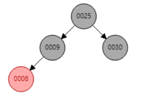
  
    如插入结点7：
  
    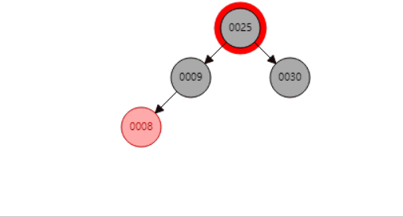
  
    
  
  - 叔叔是红色的，父节点和叔叔结点变为黑色，祖父结点变为红色
  
    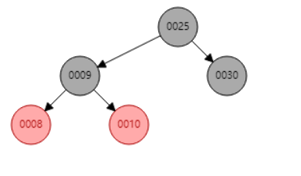
  
    插入结点7：
  
    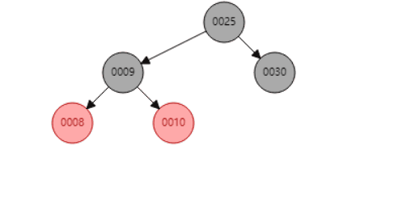
  
  - 叔叔是黑色的，旋转+变色
  
    在下面插入结点3：
  
    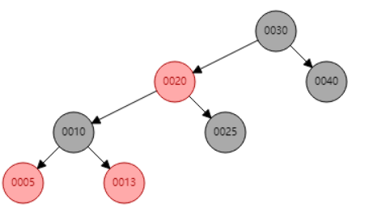
  
    全过程：
  
    
  
    这个位置对10来说，叔叔是黑色，会继续旋转，让20成为根结点，25成为30的左孩子，同时30变为红色

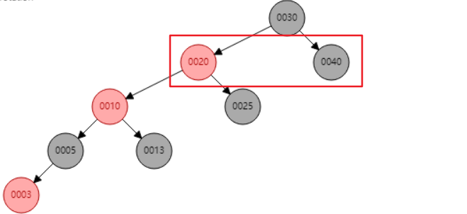


最终效果：
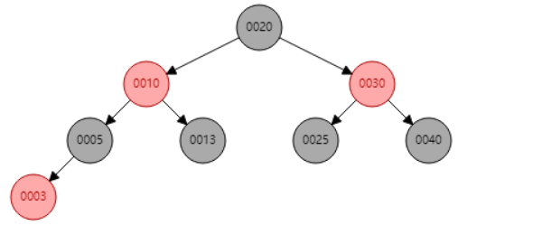


红黑树相对于AVL树来说实现更加简单，只保证黑色节点平衡即可，不用让所有的节点完全平衡


**继承关系图：瞎画**

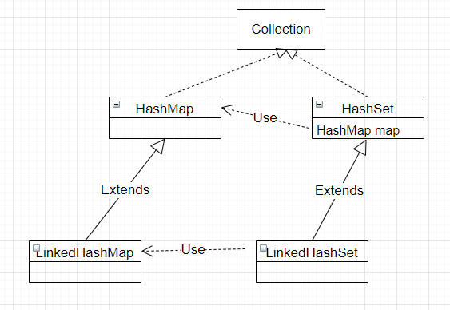

## LinkedHashMap

- 继承HashMap

- 双向链表实现

- 主要功能：可以用作缓存，控制存储元素的数量，实现LRU算法

- 非同步，多线程下不安全


- 元素会`同时存在`LinkedhashMap的链表以及hashMap中


put操作流程

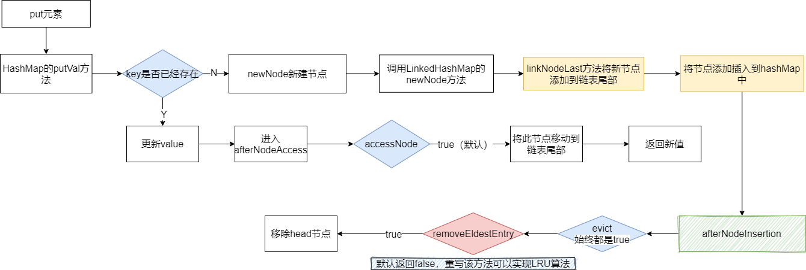


**属性：**

```java
// 双向链表的头结点、 尾结点
private transient Entry<K,V> header、tail;
// hash map链表的迭代方式，true: 以访问序列（默认）， false: 以插入序列
private final boolean accessOrder;

// 默认以插入序列
public LinkedHashMap(int initialCapacity, float loadFactor) {
    super(initialCapacity, loadFactor);
    accessOrder = false;
}
// Entry 类继承自HashMap中的Node，新增加了两个属性before、after
static class Entry<K,V> extends HashMap.Node<K,V> {
    Entry<K,V> before, after;
    Entry(int hash, K key, V value, Node<K,V> next) {
        super(hash, key, value, next);
    }
}
```


### 插入流程

```java
// HashMap中的方法
public V put(K key, V value) {
    // 调用hashMap中的pubVal方法，最后一个参数evict：true表示非创建模式，evict只有在afterNodeInsertion被重写后有作用
    return putVal(hash(key), key, value, false, true);
}

// putVal中创建节点
newNode(hash, key, value, null);
// 由于newNode方法被LinkedHashMap重写，重而走到LinkedHashMap中的方法，
Node<K,V> newNode(int hash, K key, V value, Node<K,V> e) {
    LinkedHashMap.Entry<K,V> p =
        new LinkedHashMap.Entry<K,V>(hash, key, value, e);
    linkNodeLast(p);	// 这里会将元素添加到tail
    return p;
}

// HashMap中pubVal方法中有下面一段，表示在原来的数据中存在将要插入的数据
if (e != null) { // existing mapping for key
    V oldValue = e.value;
    if (!onlyIfAbsent || oldValue == null)
        e.value = value;
    // 这里调用LinkedHashMap实现的方法，主要目的判断是否将e放入链表的最后
    afterNodeAccess(e);
    return oldValue;
}
// 如果原hashMap中没有待插入的元素，那么将继续调用removeEldestEntry方法判断是否移除head
afterNodeInsertion(evict);
void afterNodeInsertion(boolean evict) { // possibly remove eldest
    LinkedHashMap.Entry<K,V> first;
    if (evict && (first = head) != null && removeEldestEntry(first)) {
        K key = first.key;
        removeNode(hash(key), key, null, false, true);
    }
}
```


### afterNodeAccess

插入过程：

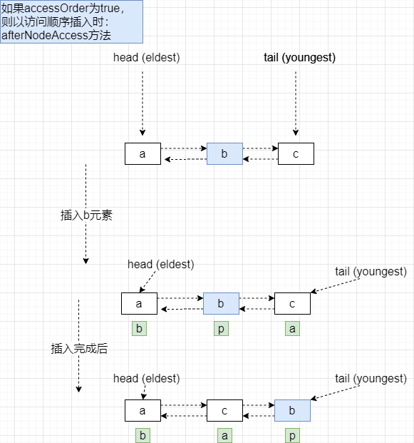


``` java
// 将e放到链表最后，需要accessOrder为true
void afterNodeAccess(Node<K,V> e) { // move node to last
    LinkedHashMap.Entry<K,V> last;
    if (accessOrder && (last = tail) != e) {
        LinkedHashMap.Entry<K,V> p =
            (LinkedHashMap.Entry<K,V>)e, b = p.before, a = p.after;
        p.after = null;
        if (b == null)
            head = a;
        else
            b.after = a;
        if (a != null)
            a.before = b;
        else
            last = b;
        if (last == null)
            head = p;
        else {
            p.before = last;
            last.after = p;
        }
        tail = p;
        ++modCount;
    }
}


```

### afterNodeInsertion

```java
void afterNodeInsertion(boolean evict) { // possibly remove eldest
    LinkedHashMap.Entry<K,V> first;
    if (evict && (first = head) != null && removeEldestEntry(first)) {
        K key = first.key;
        removeNode(hash(key), key, null, false, true);
    }
}
/* 
如果作为LRU，removeEldestEntry方法可重写如下：
*     private static final int MAX_ENTRIES = 100;
*     protected boolean removeEldestEntry(Map.Entry eldest) {
		// 链表长度超过了最大长度，返回true
*        return size() > MAX_ENTRIES;
*     }
*/ 

// HashMap中removeNode方法
final Node<K,V> removeNode(int hash, Object key, Object value,
                               boolean matchValue, boolean movable) {
    // 寻找是否存在key
    
    // if ()		如果找到了key，将节点从node数组中移除，同时调用下面方法
    afterNodeRemoval(node);
}

// LinkedHashMap， 将e节点移除
  void afterNodeRemoval(Node<K,V> e) { // unlink
        LinkedHashMap.Entry<K,V> p =
            (LinkedHashMap.Entry<K,V>)e, b = p.before, a = p.after;
        p.before = p.after = null;
        if (b == null)
            head = a;
        else
            b.after = a;
        if (a == null)
            tail = b;
        else
            a.before = b;
    }

```

### 实现LRU算法

```java
class LRUCache {
    private LinkedHashMap<Integer, Integer> map;
    private final int CAPACITY;
    // 初始化 LRU 缓存
    public LRUCache(int capacity)
    {
        CAPACITY = capacity;
        // 第三个参数： true： 表示以访问序列进行添加元素，即每次将访问过的元素作为新节点
        map = new LinkedHashMap<Integer, Integer>(capacity, 0.75f, true) {
            @Override
            protected boolean removeEldestEntry(Map.Entry eldest)
            {
                // 当size() > capacity时，才进行调整链表
                return size() > CAPACITY;
            }
        };
    }

    // 时间复杂度 O(1)
    public int get(int key)
    {
        return map.getOrDefault(key, -1);
    }

    // 时间复杂度 O(1)
    public void set(int key, int value)
    {
        map.put(key, value);
    }
}
```

## LinkedHashSet

- 继承了HashSet

- 在HashSet构造方法中，new LinkedHashMap

  ```java
  // 构造
  public LinkedHashSet(int initialCapacity, float loadFactor) {
      super(initialCapacity, loadFactor, true);
  }
  // 实际依然使用LinkedHashMap, dummy仅仅起一个标识作用，用于与其他构造方法区分
  HashSet(int initialCapacity, float loadFactor, boolean dummy) {
      map = new LinkedHashMap<>(initialCapacity, loadFactor);
  }
  ```

  


## TreeMap

- 基于红黑树实现，可以参考HashMap中的红黑树实现方式
- 通过实现Comparable接口对key进行自然排序，或则创建对象时提供Comparator
- get、remove、put、containsKey方法的时间复杂度都是logN


### 属性及构造：

```java
// TreeMap比较器，如果为null，那么将对key进行自然排序
private final Comparator<? super K> comparator;
// 根结点
private transient Entry<K,V> root;

// Tree中的entry数量
private transient int size = 0;

// 对结构的修改次数
private transient int modCount = 0;
// 无参构造，插入的key必须实现Comparable接口
public TreeMap() {
    comparator = null;
}
// 通过指定的comparator来创建新的TreeMap
public TreeMap(Comparator<? super K> comparator) {
    this.comparator = comparator;
}
public TreeMap(Map<? extends K, ? extends V> m) {
    comparator = null;
    putAll(m);
}

public TreeMap(SortedMap<K, ? extends V> m) {
    comparator = m.comparator();
    try {
        buildFromSorted(m.size(), m.entrySet().iterator(), null, null);
    } catch (java.io.IOException cannotHappen) {
    } catch (ClassNotFoundException cannotHappen) {
    }
}
```


### 插入元素：

```java

public V put(K key, V value) {
    Entry<K,V> t = root;
    // 如果当前树为null，那么直接将待插入的节点做为root
    if (t == null) {
        compare(key, key); // type (and possibly null) check

        root = new Entry<>(key, value, null);
        size = 1;
        modCount++;
        return null;
    }
    int cmp;
    Entry<K,V> parent;
    // split comparator and comparable paths
    Comparator<? super K> cpr = comparator;
    if (cpr != null) {
        // 循环遍历这棵树，找到该元素合适的位置
        do {
            parent = t;
            cmp = cpr.compare(key, t.key);
            if (cmp < 0)
                t = t.left;
            else if (cmp > 0)
                t = t.right;
           	// 如果相等，则覆盖原来的值
            else
                return t.setValue(value);
        } while (t != null);
    }
    else {
        if (key == null)
            throw new NullPointerException();
        @SuppressWarnings("unchecked")
        Comparable<? super K> k = (Comparable<? super K>) key;
        do {
            parent = t;
            cmp = k.compareTo(t.key);
            if (cmp < 0)
                t = t.left;
            else if (cmp > 0)
                t = t.right;
            else
                return t.setValue(value);
        } while (t != null);
    }
    // 将新节点添加到parent下面
    Entry<K,V> e = new Entry<>(key, value, parent);
    if (cmp < 0)
        parent.left = e;
    else
        parent.right = e;
    // 对红黑树进行调整，让红黑树满足本身的特性
    fixAfterInsertion(e);
    size++;
    modCount++;
    return null;
}
```

### 移除元素：

```java
 public V remove(Object key) {
     // 获取key对应的节点
     Entry<K,V> p = getEntry(key);
     if (p == null)
         return null;

     V oldValue = p.value;
     deleteEntry(p);
     return oldValue;
 }
// 获取key对应的节点
final Entry<K,V> getEntry(Object key) {
    // Offload comparator-based version for sake of performance
    if (comparator != null)
        // 痛过带比较器的方法获取
        return getEntryUsingComparator(key);
    if (key == null)
        throw new NullPointerException();
    @SuppressWarnings("unchecked")
    Comparable<? super K> k = (Comparable<? super K>) key;
    Entry<K,V> p = root;
    // 从根结点左右比较，直到找到key的节点
    while (p != null) {
        int cmp = k.compareTo(p.key);
        if (cmp < 0)
            p = p.left;
        else if (cmp > 0)
            p = p.right;
        else
            return p;
    }
    return null;
}
```


## LongAdder：

### 性能测试：

> 同时开100个线程，每个线程执行100000次：
>
> LongAdder waste time:   278
>
> AtomicLong waste time: 2276
>
> 当每个线程执行次数较低时，可能LongAdder的性能会慢于AtomicLong，随着单线程执行次数的增加，LongAdder的性能会明显高于AtomicLong

```java
public class LongAdderTest {
    // 总线程数量
    private final int THREAD_COUNT = 100;
    // 单线程执行次数
    private final int SINGLE_THREAD_RUNNING_COUNT = 1000000;
    public static void main(String[] args) throws InterruptedException {
        LongAdderTest streamTest = new LongAdderTest();
        System.out.println("LongAdder:");
        streamTest.testLongAdder();

        System.out.println("AtomicLong:");
        streamTest.testAtomicLong();
    }

    public void testLongAdder() throws InterruptedException {
        long start = System.currentTimeMillis();
        Thread[] threads = new Thread[THREAD_COUNT];
        LongAdder longAdder = new LongAdder();

        for (int i = 0; i < THREAD_COUNT; i++) {
            threads[i] = new Thread(() -> {
                for (int i1 = 0; i1 < SINGLE_THREAD_RUNNING_COUNT; i1++) {
                    longAdder.add(1L);
                }
            });
        }

        for (Thread thread : threads) {
            thread.start();
        }

        for (Thread thread : threads) {
            thread.join();
        }
        System.out.println("waste time: " + (System.currentTimeMillis() - start));
    }

    public void testAtomicLong() throws InterruptedException {
        long start = System.currentTimeMillis();
        Thread[] threads = new Thread[THREAD_COUNT];
        AtomicLong atomicLong = new AtomicLong();

        for (int i = 0; i < THREAD_COUNT; i++) {
            threads[i] = new Thread(() -> {
                for (int i1 = 0; i1 < SINGLE_THREAD_RUNNING_COUNT; i1++) {
                    atomicLong.incrementAndGet();
                }
            });
        }

        for (Thread thread : threads) {
            thread.start();
        }
        for (Thread thread : threads) {
            // 当前线程等待thread线程执行完成后，在执行，确保所有线程执行完
            thread.join();
        }
        System.out.println("waste time: " + (System.currentTimeMillis() - start));
    }
}
```


### LongAdder

> `LongAdder`类与`AtomicLong`类的区别在于高并发时前者将对单一变量的CAS操作分散为对数组`cells`中多个元素的CAS操作，取值时进行求和；而在并发较低时仅对`base`变量进行CAS操作，与`AtomicLong`类原理相同。

**LongAdder流程图：**

> 将多个线程分配到不同cell中同时进行操作数据，最终将所有cell的值求和，得到最终的值。


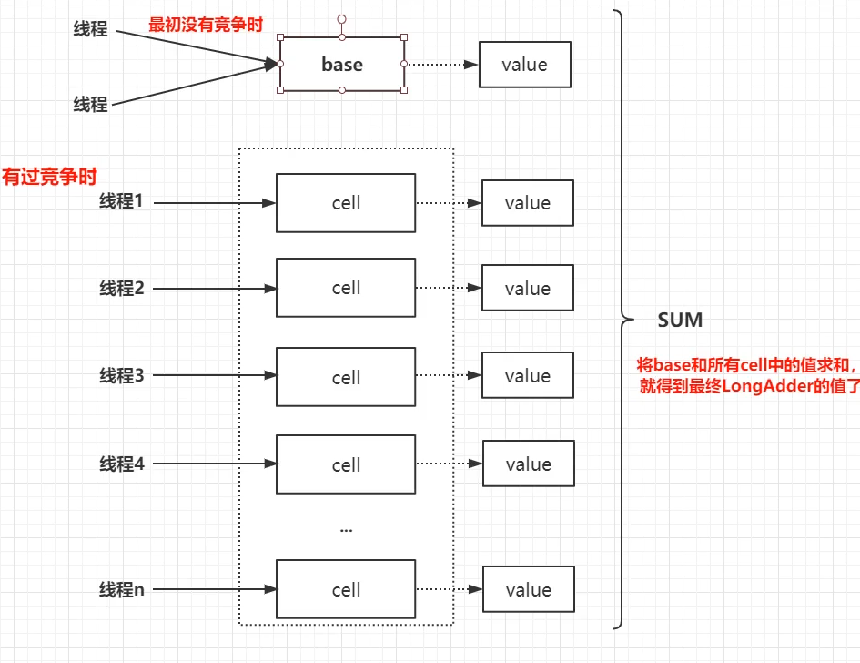


**LongAdder.java**

```java
public class LongAdder extends Striped64 {
    public LongAdder() {
    }
    public void increment() {
        add(1L);
    }
    public void decrement() {
        add(-1L);
    }
    
    // 返回当前的sum值，此时并不是一个原子操作，如果在计算过程中，有另一个线程正在更改as数组中的值，此时计算的结果可能并不是最新的值。
    public long sum() {
        Cell[] as = cells; Cell a;
        long sum = base;
        if (as != null) {
            for (int i = 0; i < as.length; ++i) {
                if ((a = as[i]) != null)
                    sum += a.value;
            }
        }
        return sum;
    }
    
    public void add(long x) {
        Cell[] as; long b, v; int m; Cell a;
        // condition1: true -> cells数组不为空，当前线程将数据写入到对应的cell中
        // 			   false -> 表示cells未初始化，直接将值添加到base中
        // condition2: true-> CAS修改base值失败，此时有线程竞争base资源
        // 			   false-> CAS修改base成功，不在继续向下执行
        if ((as = cells) != null || !casBase(b = base, b + x)) {
            // 
            boolean uncontended = true;
            // Condition1： true-> 说明cells未初始化，也就是多线程写base发生竞争了
            //				false -> 说明cells已经初始化了，当前线程应该是找自己的cell写值
            // condition2: getProbe() 获取当前线程的探测值，第一次获取时为0，m表示cells长度 - 1， 长度一定是2^n
            //  			true-> 说明当前线程对应的cell为空，需要创建cell对象填入
            // 				false-> 说明当前线程对应的cell不为空， 说明下一步要将x值添加到cell中
            // condition3: true-> 表示cas失败，意味着当前线程对应的cell有竞争
            // 			   false-> 表示cas成功
            if (as == null || (m = as.length - 1) < 0 ||
                (a = as[getProbe() & m]) == null ||
                !(uncontended = a.cas(v = a.value, v + x)))
                // cells未初始化、当前线程对应的cell为空、有多个线程竞争cell导致cas失败，调用Striped64.java中的longAccumulate方法
                longAccumulate(x, null, uncontended);
        }
    }
}
```


### Striped64.java

```java

// 默认构造方法，初始化Striped64对象时，并不会直接创建cells数组，因为Cells数组相对比较大，在没有竞争的条件下创建cells数组将是一种空间上的浪费
Striped64() {
}
 // 当没有竞争时所有的修改操作都是在base字段进行的，当第一次发生竞争时(有一个在base上的CAS修改操作失败)，cells数组就会被初始化，长度为2，如果有更多的线程竞争，数组将会以2倍的形式（2的n次幂）进行扩容，长度不会超过机器CPU的数量

transient volatile Cell[] cells;

// 主要是当没有竞争时作为计数，也可以作为表初始化期间作为反馈的值
transient volatile long base;


// 当创建或则扩容cells数组时，标记锁的状态
// 0: 表示无锁状态   1: 表示其他线程持有锁
transient volatile int cellsBusy;

// Cell对象
@sun.misc.Contended static final class Cell {
    volatile long value;
    Cell(long x) { value = x; }
    final boolean cas(long cmp, long val) {
        return UNSAFE.compareAndSwapLong(this, valueOffset, cmp, val);
    }

    // Unsafe mechanics
    private static final sun.misc.Unsafe UNSAFE;
    private static final long valueOffset;
    static {
        try {
            UNSAFE = sun.misc.Unsafe.getUnsafe();
            Class<?> ak = Cell.class;
            valueOffset = UNSAFE.objectFieldOffset
                (ak.getDeclaredField("value"));
        } catch (Exception e) {
            throw new Error(e);
        }
    }
}

// 当发生竞争时，调用该方法进行增加数据
// x: 要增加的数， fn： 修改的函数， wasUncontended：是否发生竞争
final void longAccumulate(long x, LongBinaryOperator fn,
                          boolean wasUncontended) {
    // 用于储存线程的探测值
    int h;
    // getProbe(): 获取当前线程的探测值，最开始都是0
    if ((h = getProbe()) == 0) {
        // 给当前线程分配探测值
        ThreadLocalRandom.current(); // force initialization
        h = getProbe();
        // 初始化为未发生竞争，由于在默认情况下，当前线程肯定是写入到了cells[0]位置，不把他当做一次真正的竞争
        wasUncontended = true;
    }
    // 表示扩容意向： false 一定不会扩容，true可能会扩容
    boolean collide = false;                // True if last slot nonempty
    // 自旋
    for (;;) {
        // a用于记录当前线程命中的cell，n：表示cells数组长度，v：表示期望值
        Cell[] as; Cell a; int n; long v;
        // case 1: 表示cells已经初始化了，当前线程应该将数据更新到对应的cell中
        if ((as = cells) != null && (n = as.length) > 0) {
            
            // case 1.1:
            //			true-> 说明当前线程对应的cell为空，需要创建cell对象
            if ((a = as[(n - 1) & h]) == null) {
                // true: 表示锁没有被占用
                if (cellsBusy == 0) {       // Try to attach new Cell
                	// 创建一个cell对象值为x
                    Cell r = new Cell(x);   // Optimistically create
                    // condition 1: true-> 表示当前锁未被占用
                    // condition 2: true-> 表示当前线程获取锁成功
                    if (cellsBusy == 0 && casCellsBusy()) {
                        // 是否创建成功的标记
                        boolean created = false;
                        try {               // Recheck under lock
                            Cell[] rs; int m, j;
                            // 再次检查，为了防止其他线程已经初始化过该位置，再次初始化将导致重复覆盖，造成性能浪费				
                            // 可能最开始有两个线程，thread1、thread2同时满足了condition1和condition2，此时由于cpu调度导致thread1进入就绪，thread2继续执行，在rs[j]位置放入了一个对象，thread2执行完当前if后，thread2刚好又被CPU唤醒进入运行态，继续判断rs[j]位置是否为null，发现不为null，结束当前if
                            if ((rs = cells) != null &&
                                (m = rs.length) > 0 &&
                                rs[j = (m - 1) & h] == null) {
                                rs[j] = r;
                                created = true;
                            }
                        } finally {
                            // 将锁设为空闲状态
                            cellsBusy = 0;
                        }
                        if (created)
                            break;
                        continue;           // Slot is now non-empty
                    }
                }
                collide = false;
            }
            else if (!wasUncontended)       // CAS already known to fail
                wasUncontended = true;      // Continue after rehash
            // case 1.3: 当前线程命中的cell不为空
            // 			true -> 写成功，退出循环
            // 			false-> 表示命中的新cell也有竞争
            else if (a.cas(v = a.value, ((fn == null) ? v + x :
                                         fn.applyAsLong(v, x))))
                break;
           	// case 1.4:
            // condition 1: true-> 数组长度>= CPU 数量，collide改为false，表示不再进行扩容，因为数组长度最大不能超过CPU的数量	
            // 				false-> 表示还可以进行扩容
            // condition 2： true-> 表示其他线程修改了数组，即已经扩容过了
            else if (n >= NCPU || cells != as)
                collide = false;            // At max size or stale
            // case 1.5:
            // 		将扩容意向改为true， 为true并不一定真正发生扩容
            else if (!collide)
                collide = true;
            // case 1.6: 真正的扩容逻辑
            // 		condition 1: cellsBusy == 0 true -> 表示当前无锁状态，当前线程可以去竞争这把锁，将0改为1
            // 		condition 2: true-> 表示当前线程竞争锁成功
            else if (cellsBusy == 0 && casCellsBusy()) {
                try {
                    // 判断cells是否已经被其他线程扩容
                    if (cells == as) {      // Expand table unless stale
                        // 2倍扩容
                        Cell[] rs = new Cell[n << 1];
                        // 将原来数组中值移动到新数组的相同位置中
                        for (int i = 0; i < n; ++i)
                            rs[i] = as[i];
                        cells = rs;
                    }
                } finally {
                    cellsBusy = 0;
                }
                collide = false;
                continue;                   // Retry with expanded table
            }
            // 重新为当前线程生成一个新的探测值
            h = advanceProbe(h);
        }
        // case 2: 前置条件cells还未初始化， as为null
        // condition 1: true表示当前没有线程持该锁
        // condition 2: 可能有其他线程在当前线程之前判断该条件之前已经把cells初始化过了
        // condition 3: 获取cellsBusy锁
        else if (cellsBusy == 0 && cells == as && casCellsBusy()) {
            boolean init = false;
            try {// Initialize table
                // 再次检查以防止其他线程已经初始化过cells了
                if (cells == as) {
                    // 最开始初始化数组长度为2
                    Cell[] rs = new Cell[2];
                    rs[h & 1] = new Cell(x);
                    cells = rs;
                    init = true;
                }
            } finally {
                cellsBusy = 0;
            }
            if (init)
                break;
        }
        // case 3: prepose condition:	cells为空，cellsBusy锁被其他线程持有
        // 直接使用CAS对base进行修改
        else if (casBase(v = base, ((fn == null) ? v + x :
                                    fn.applyAsLong(v, x))))
            break;                          // Fall back on using base
    }
}
```


## Set

### HashSet：

``` java
// 实际由HashMap实现，default initial capacity (16) and load factor (0.75).
public HashSet() {
       map = new HashMap<>();
}

// 初始化一个包含c中元素的set
public HashSet(Collection<? extends E> c) {
        map = new HashMap<>(Math.max((int) (c.size()/.75f) + 1, 16));
        addAll(c);
    }
```

### TreeSet：

> 基于TreeMap实现


### BitSet

内部使用long类型的words 数组实现，一个long 64 位。  如果需要set n， 那么即在第n+1 位设置为1.  当超过64 位，使用 words[1] 来表示。

```shell
# 连续调用set，结果分别如下：
set(1)
0010      --> 该long 表示： 2     0101 & 1110 -->100 2
set(2)
0110
set(3)
1110

# 获取 第一个位置是否有值， 有值则为 true
get(1)

```


#### nextClearBit(n):   

> 返回指定索引，或者指定索引之后 第一个为false 的索引。
>
> 即：
> 如果n 为true，n + 1 为false，那么返回n+1， 否则返回n。
> 如果n 为true，n + 1 为true， n+2 为false，那么返回n+2。
>
>
> 相关方法：previousClearBit


```java
public int nextClearBit(int fromIndex) {
    // ...
    int u = wordIndex(fromIndex); // 定位words 索引。
    if (u >= wordsInUse)  // 当前没有 此索引
        return fromIndex;

    // 
    // 当words[u]为 0110， 即存储了1,2. fromIndex 为1 时
    // 先取反在&，即：1001 & 1110 --> 1000
    long word = ~words[u] & (WORD_MASK << fromIndex);

    while (true) {
        if (word != 0) // 
            // numberOfTrailingZeros: 返回二进制 低位1 右边0的个数， 如： 0010 --> 1,  1000 --> 3
            return (u * BITS_PER_WORD) + Long.numberOfTrailingZeros(word);
        if (++u == wordsInUse)  // 计算出的word 为0，且u为最后一个word。
            return wordsInUse * BITS_PER_WORD;
        word = ~words[u]; // 计算出的word 为0，且u不是最后一个word，继续下一个word
    }
}
```


下面demo 将会使其循环多次

```java
BitSet bitSet = new BitSet();
// 设置从索引 1 开始的多个位，跨越3个单词， 即word[0] = -2(只有第一位为0), word[1] = -1 (全部1),  word[2] = 1
for (int i = 1; i < 129; i++) { // 当为128 即 可以满足  ++u == wordsInUse
    bitSet.set(i);
}
// 调用 nextClearBit 方法，从索引 1 开始
int nextClearBitIndex = bitSet.nextClearBit(1);
System.out.println("Next clear bit index: " + nextClearBitIndex);
```


#### nextSetBit(n)

> 从n 开始检查第一个被设置 的索引位置（包含n）， 没有返回-1
>
>
> 相关方法：previousSetBit

```java
public int nextSetBit(int fromIndex) {
    // 定位words 索引。
    int u = wordIndex(fromIndex);
    if (u >= wordsInUse)
        return -1;
	// 当words[u]为 0110， 即存储了1,2. fromIndex 为1 时
    // 即：0110 & 1110 --> 0110,   numberOfTrailingZeros即返回1.
    long word = words[u] & (WORD_MASK << fromIndex);

    while (true) {
        if (word != 0)
            return (u * BITS_PER_WORD) + Long.numberOfTrailingZeros(word);
        if (++u == wordsInUse)
            return -1;
        word = words[u];
    }
}
```


#### 相关应用

##### ArrayList

#removeIf：

下面为1.8，  17 之后 内部使用了一个long 数组来表示索引，原理类似，但是连续的并不会跳跃。（可能这种情况比较少吧，使用long 数组更加简单）

```java
public boolean removeIf(Predicate<? super E> filter) {
    final BitSet removeSet = new BitSet(size);
    final int size = this.size;
    for (int i=0; modCount == expectedModCount && i < size; i++) {
        final E element = (E) elementData[i];
        if (filter.test(element)) {
            removeSet.set(i);  // 先将满足条件的索引 放入BitSet
        }
    }
    if (anyToRemove) {
        final int newSize = size - removeCount;
        for (int i=0, j=0; (i < size) && (j < newSize); i++, j++) {
            i = removeSet.nextClearBit(i);  // 从bitSet 查找i 或i 之后的第一个false。 如果i 之后连续的都应该删除，那么效率会大大提高
            elementData[j] = elementData[i]; // 后面的覆盖前面的
        }
        for (int k=newSize; k < size; k++) {
            elementData[k] = null;  // Let gc do its work
        }
        this.size = newSize;
        if (modCount != expectedModCount) {
            throw new ConcurrentModificationException();
        }
        modCount++;
    }

    return anyToRemove;
}
```


##### **zookeeper**

> WatchManagerOptimized: 为优化WatchManager而生。 使用读写锁替代原来的重量级锁，以及使用BitSet 来保留引用关系
>
> https://github.com/apache/zookeeper/pull/590

- 在极端情况下：例如znode，watcher全订阅，可以节省巨大的内存。 即当znode、watcher 都为1000 时
  - 未优化：1000*1000 个entry（每一个znode 有1000watcher）
  - 优化版：
    - pathWatches会产生1000个entry，1000个BitHashSet。
    - **watcherBitIdMap**：1000个value2Bit，1000个bit2Value。 也就2000个entry， **远少于未优化版本**
- 在稀疏分配情况下，可能会比原来的版本更加耗费内存，bitSet没有连续需要耗费更大的空间。issue也提到了。
  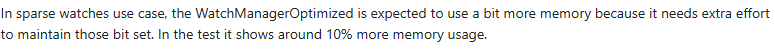


**实现：**

String(znode) -->watch: 从原来的 string --> hashSet 改为 string --> BitHashSet

```java
// WatchManager:
// znode --> watcher
private final Map<String, Set<Watcher>> watchTable = new HashMap<>();
// watcher --> znode
private final Map<Watcher, Set<String>> watch2Paths = new HashMap<>();


// 优化版： 只有znode --> watcher
ConcurrentHashMap<String, BitHashSet> pathWatches = new ConcurrentHashMap<String, BitHashSet>();
private final BitMap<Watcher> watcherBitIdMap = new BitMap<Watcher>();
```


BitHashSet

```java
private final BitSet elementBits = new BitSet();
```


**BitMap**

```java
// add Watcher 的时候会加入，仅仅判断Watcher 是否存在 的时候会使用
private final Map<T, Integer> value2Bit = new HashMap<T, Integer>();
private final Map<Integer, T> bit2Value = new HashMap<Integer, T>();
```


当查询某个znode 对应的watcher时：

1. 从pathWatches 找到对应的BitHashSet（即一个BitSet）, 即保存watcher 编号的BitSet
2. 通过上面的watcher编号继续从 **watcherBitIdMap**#bit2Value  查找， 即得到对应的watcher
