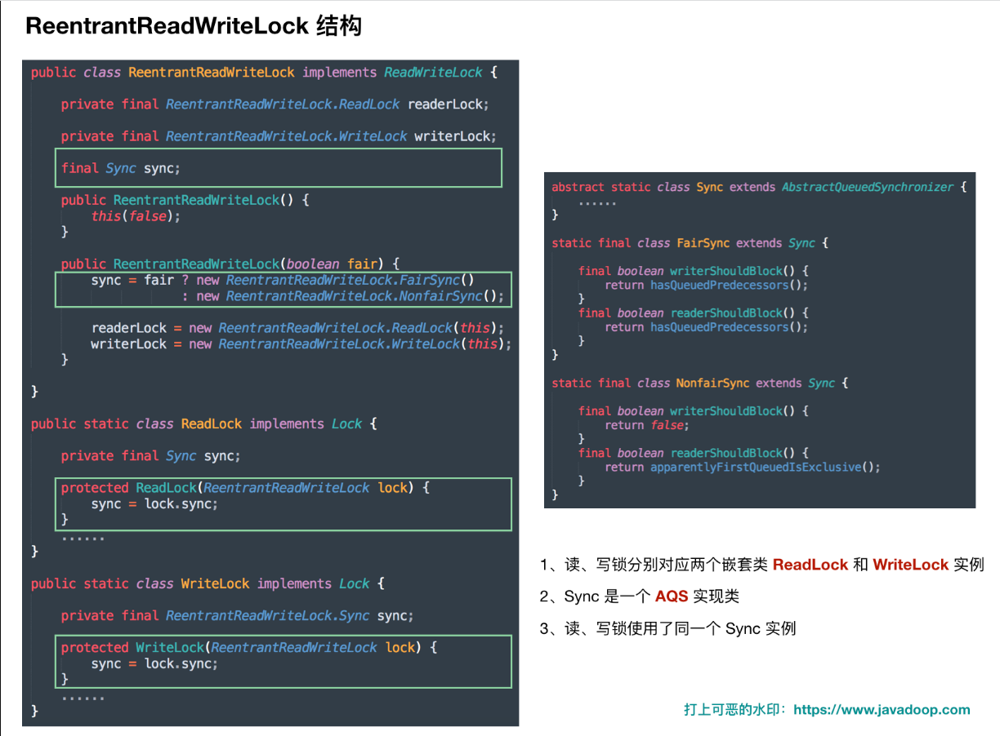
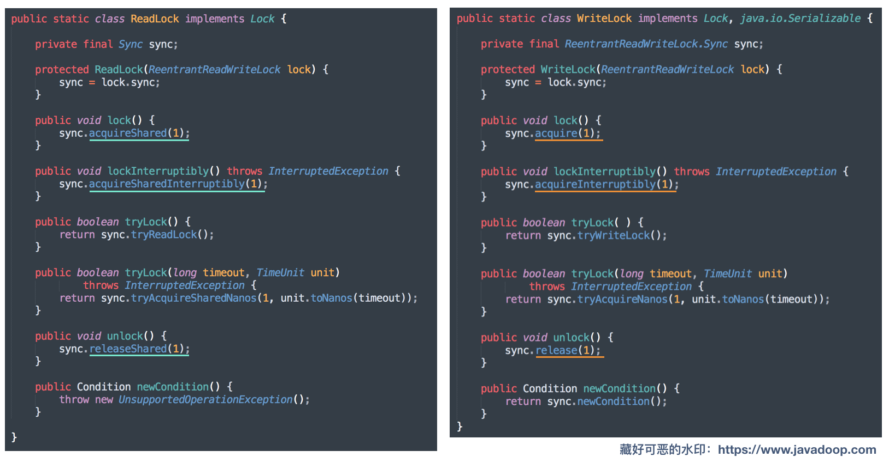
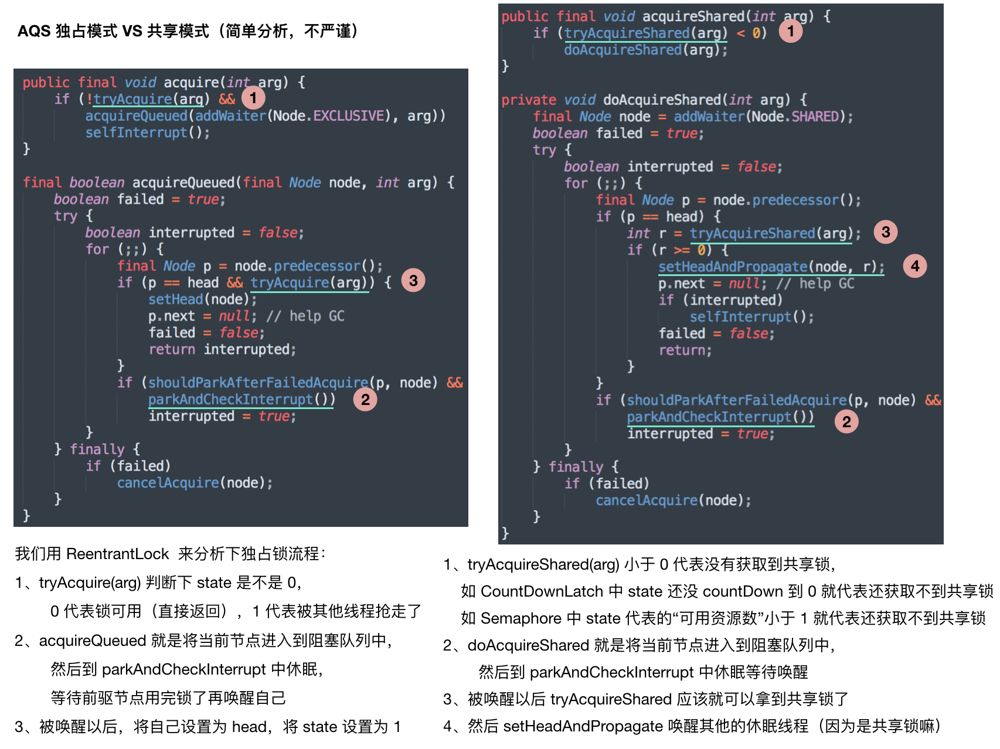
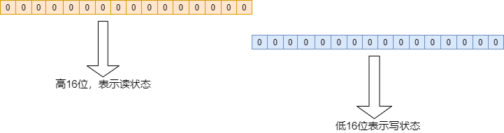
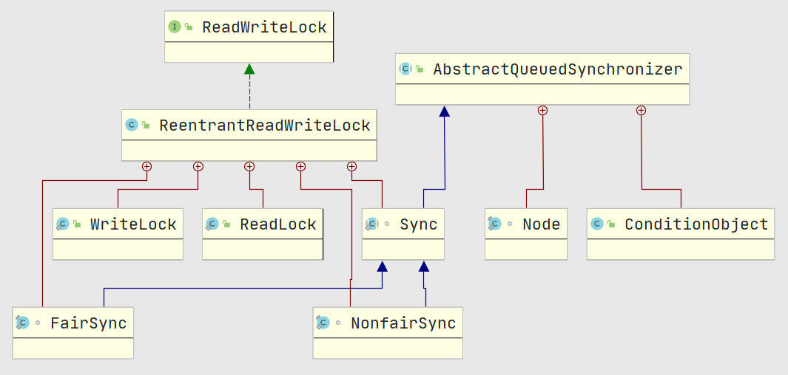
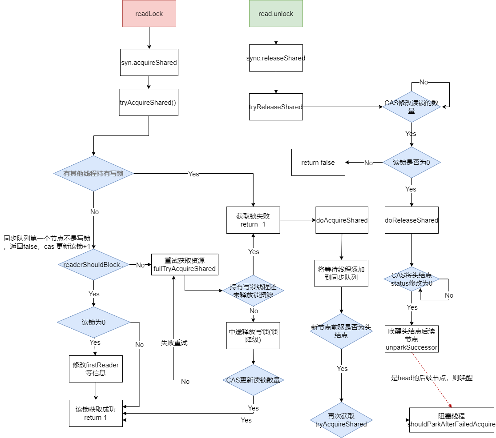
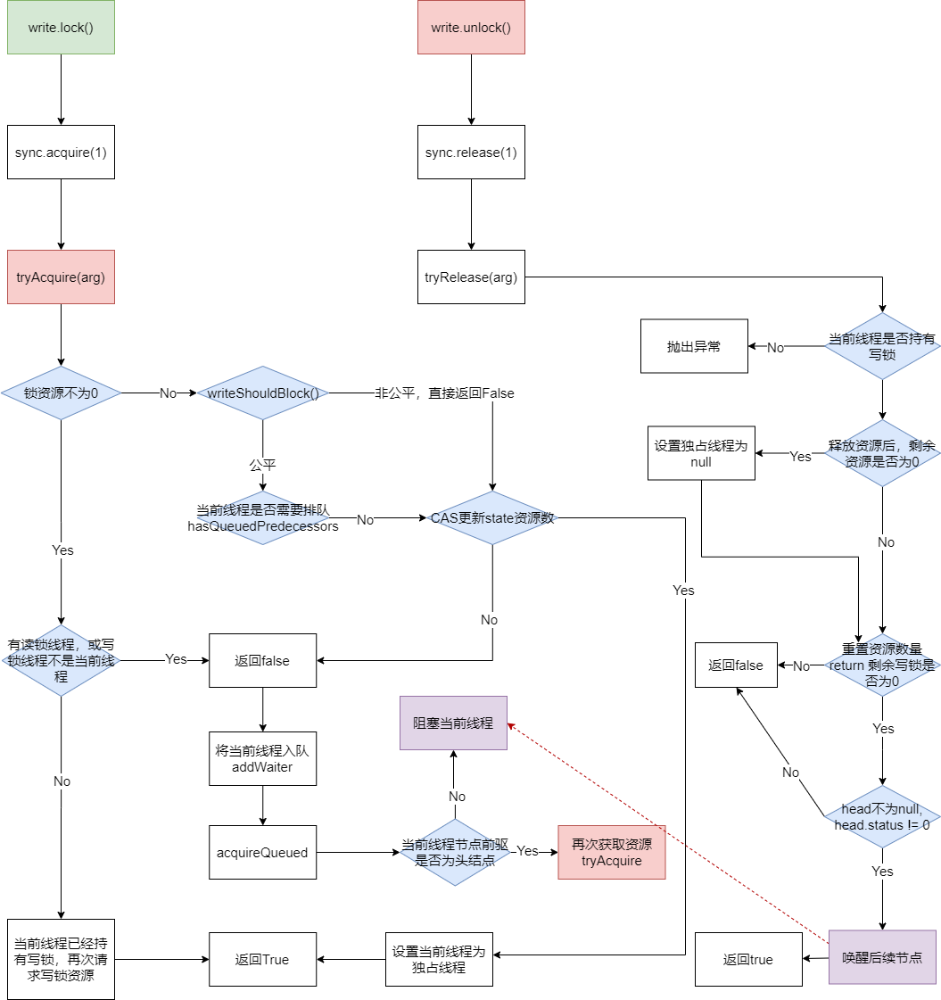

## ReentrantReadWriteLock

### 简介

> 在并发编程中，为了确保数据的安全性，我们常常采用synchronized来对代码段进行加锁，防止其他线程同时对数据进行修改，从而导致数据不一致的问题，大多数人都知道synchronized是一个重量级的锁（JDK 6 之前），在线程切换时OS会发生`用户态到内核态`切换，因此使用他来加锁，在线程数量较多的情况下会严重影响程序的性能，因此后面JDK引入了Java层面加锁的机制，即`Java.util.concurrent`包下的类
>
> `ReentrantReadWriteLock`的引入主要是为了控制`读操作`可以让所有线程同时进行，在`写操作`进行时，所有的读线程和其他写线程均被阻塞，在大多数情况下，`读都是大于写的`，因此读写锁能够提供比排它锁更好的`并发性和吞吐量`


相关特性

- 支持公平、非公平
  - 非公平通常有更高的吞吐量
  - 公平锁通常会唤醒等待时间较长的线程
- 重入
- 锁降级， writeLock ---> readLock
- 响应中断
- 写锁支持条件队列，读锁不支持
- 支持监控锁处于持有还是竞争


Demo：见javadoc


### 总览

> 来源Javadoop




读锁、写锁实现方法




独占与共享对比图：




对比下公平、非公平核心方法

```java
static final class FairSync extends Sync {
    private static final long serialVersionUID = -2274990926593161451L;
    final boolean writerShouldBlock() {
        return hasQueuedPredecessors();
    }
    final boolean readerShouldBlock() {
        return hasQueuedPredecessors();
    }
}

public final boolean hasQueuedPredecessors() {
    Node t = tail; // Read fields in reverse initialization order
    Node h = head;
    Node s;
    return h != t &&
        ((s = h.next) == null || s.thread != Thread.currentThread());
}
```


```java
static final class FairSync extends Sync {
    private static final long serialVersionUID = -2274990926593161451L;
    final boolean writerShouldBlock() {
        return hasQueuedPredecessors();
    }
    final boolean readerShouldBlock() {
        return hasQueuedPredecessors();
    }
}
public final boolean hasQueuedPredecessors() {
    Node t = tail; // Read fields in reverse initialization order
    Node h = head;
    Node s;
    return h != t &&
        ((s = h.next) == null || s.thread != Thread.currentThread());
}
```


由前面的学习我们知道AQS中是由state来维持当前资源数量，在ReentranReadWriteLock中同样是使用这个state变量来维护读写线程的状态信息, 因为state是int，在64位机器中int是有32位字节来存储，为了区分读写的状态，将高16位来记录读锁的信息，低16位记录写锁的状态信息，如：





### 基本属性

知道了区分的方式，如何计算读状态，写状态呢，相信你已经知道了答案，位运算

```java
// 在ReentrantReadWriteLock中有几个属性
// SHARED_SHIFT表示计算读时应该移动的位数
static final int SHARED_SHIFT   = 16;
// 用于计算读锁数量
static final int SHARED_UNIT    = (1 << SHARED_SHIFT);
// 读写资源的最大数量， 即16位都为1， 等于2^16 - 1
static final int MAX_COUNT      = (1 << SHARED_SHIFT) - 1;
// 计算写锁数量， 低16位全为1，其余都为0
static final int EXCLUSIVE_MASK = (1 << SHARED_SHIFT) - 1;

// 计算c对应的读锁数量， 即将高16位右移16位
static int sharedCount(int c)    { return c >>> SHARED_SHIFT; }
// 计算c对应的写锁数量， 即c跟低16位都为1的EXCLUSIVE_MASK 作与运算
static int exclusiveCount(int c) { return c & EXCLUSIVE_MASK; }

// 保存每个线程读锁的重入次数
static final class HoldCounter {
    int count = 0;
    // Use id, not reference, to avoid garbage retention
    final long tid = getThreadId(Thread.currentThread());
}

// 使用ThreadLocal来保存每个线程的读锁重入次数
static final class ThreadLocalHoldCounter
    extends ThreadLocal<HoldCounter> {
    public HoldCounter initialValue() {
        return new HoldCounter();
    }
}
// 使用该ThreadLocal变量来记录每个线程的读锁重入次数
private transient ThreadLocalHoldCounter readHolds;
// 记录最后一个获取读锁线程的重入次数，可以避免了从readHolds中获取，需要注意的是这个变量也是需要存入readHolds中的
private transient HoldCounter cachedHoldCounter;
// 第一个(state: 0 ---> 1)获取读锁的线程(未释放)， 以及其重入次数
private transient Thread firstReader = null;
private transient int firstReaderHoldCount;
```


先看下ReentrantReadWriteLock的继承关系吧：




```java
// 读锁
private final ReentrantReadWriteLock.ReadLock readerLock;
// 写锁
private final ReentrantReadWriteLock.WriteLock writerLock;
// 继承了同步器AQS
final Sync sync;

// 默认依然是采用非公平模式
public ReentrantReadWriteLock() {
    this(false);
}
// 初始化
public ReentrantReadWriteLock(boolean fair) {
    // 指定公平策略
    sync = fair ? new FairSync() : new NonfairSync();
    // 初始化读锁
    readerLock = new ReadLock(this);
    // 初始化写锁
    writerLock = new WriteLock(this);
}

// 内部重写了try开头的一些方法。。。
abstract static class Sync extends AbstractQueuedSynchronizer {
}

// 公平锁的实现
static final class FairSync extends Sync {
    final boolean writerShouldBlock() {
        // 当前节点是否需要排队
        return hasQueuedPredecessors();
    }
    final boolean readerShouldBlock() {
        return hasQueuedPredecessors();
    }
}
// 非公平锁的实现
static final class NonfairSync extends Sync {
    final boolean writerShouldBlock() {
        return false; // writers can always barge
    }
    final boolean readerShouldBlock() {
    	// 返回同步队列头结点的后继节点是否是一个写线程的节点， 确保非公平模式下造成写锁饥饿
        return apparentlyFirstQueuedIsExclusive();
    }
}
```


### 读锁实现

使用共享模式实现，多个读线程可以同时进行


#### acquireShared

```java
public final void acquireShared(int arg) {
    if (tryAcquireShared(arg) < 0) // < 0: 表示读锁获取失败，需要排队
        doAcquireShared(arg);
}
```

#### tryAcquireShared

```java
protected final int tryAcquireShared(int unused) {
    Thread current = Thread.currentThread();
    int c = getState();
    // 成立： 说明写锁被其他线程持有，返回-1
    if (exclusiveCount(c) != 0 &&
        getExclusiveOwnerThread() != current)
        return -1;
    int r = sharedCount(c);
    // condition1:  readerShouldBlock(), 是否需要阻塞，
    // 				如果队列第一个线程是写锁那么就阻塞
    // condition2: 是否大于最大资源
    // condition3: CAS 将读状态+1
    if (!readerShouldBlock() &&
        r < MAX_COUNT &&
        compareAndSetState(c, c + SHARED_UNIT)) {
        // 还没有其他线程获取过读锁，将当前线程作为第一个读取的线程
        if (r == 0) {  // 锁降级可以执行到这里返回
            firstReader = current;
            // 记录读锁的数量
            firstReaderHoldCount = 1;
        } else if (firstReader == current) {
            // 读锁数量++
            firstReaderHoldCount++;
        } else {
            // 已经有读锁存在，且当前线程不是第一个读线程
            HoldCounter rh = cachedHoldCounter;
            // condition1: 表示cachedHoldCounter还没有被使用，前面说了他用于保存最后一个获取读锁的线程
            // condition2： 表示最后一个读线程tid跟当前线程id不同，就表示不同线程吧
            if (rh == null || rh.tid != getThreadId(current))
                // 对cachedHoldCounter重新赋值为最新读线程所持有的资源
                cachedHoldCounter = rh = readHolds.get();
            
            // rh所记录线程 跟当前线程相同， 
            // 0表示：读线程t释放后(且cachedHoldCounter保存的为t线程，释放读锁会调用readHolds.remove, 同时cachedHoldCounter.count--)，t刚好又继续尝试获取锁
            else if (rh.count == 0)
                // 重新set，将cachedHoldCounter存入readHolds(ThreadLocal)
                readHolds.set(rh);
            // 记录最后一个读线程读的次数
            rh.count++;
        }
        return 1;
    }
    // 队列头结点是写操作线程， 或则修改读状态失败，进行重试
    return fullTryAcquireShared(current);
}

```


#### fullTryAcquireShared

上面方法获取读锁没有成功，将进入下面方法重试

进入当前的条件：

- readerShouldBlock() 返回 true，2 种情况：

  - 在 FairSync 中说的是 hasQueuedPredecessors()，即阻塞队列中有其他元素在等待锁。

    > 也就是说，公平模式下，有人在排队呢，你新来的不能直接获取锁

  - 在 NonFairSync 中说的是 apparentlyFirstQueuedIsExclusive()，即判断阻塞队列中 head 的第一个后继节点是否是来获取写锁的，如果是的话，让这个写锁先来，避免写锁饥饿。

    > 作者给写锁定义了更高的优先级，所以如果碰上获取写锁的线程**马上**就要获取到锁了，获取读锁的线程不应该和它抢。
    >
    > 如果 head.next 不是来获取写锁的，那么可以随便抢，因为是非公平模式，大家比比 CAS 速度

- compareAndSetState(c, c + SHARED_UNIT) 这里 CAS 失败，存在竞争。可能是和另一个读锁获取竞争，当然也可能是和另一个写锁获取操作竞争。

```java
final int fullTryAcquireShared(Thread current) {
    HoldCounter rh = null;
    for (;;) {
        int c = getState();
        // 是否有线程持有写锁
        if (exclusiveCount(c) != 0) {
            if (getExclusiveOwnerThread() != current)   
                return -1;    // 写锁不是当前线程，当前读线程将入队(doAcquireShared)
        } else if (readerShouldBlock()) {   // 没有持有写锁的线程，判断队列head.next是否是写锁在等待(notFair)或者队列是否有等待线程(fair)
            
            if (firstReader == current) { // firstReader 重入读锁
                // assert firstReaderHoldCount > 0;
            } else {  // 
                if (rh == null) {
                    rh = cachedHoldCounter;
                    if (rh == null || rh.tid != getThreadId(current)) {
                        // 如果当前线程没有初始化ThreadLocal，get()方法会进行初始化
                        rh = readHolds.get();
                        if (rh.count == 0) // 为0，说明之前没有获取过读锁，直接remove，进行排队
                            readHolds.remove();
                    }
                }
                // 之前还没有获取读锁，进入排队
                if (rh.count == 0)
                    return -1;
            }
        }
        if (sharedCount(c) == MAX_COUNT)
            throw new Error("Maximum lock count exceeded");

        if (compareAndSetState(c, c + SHARED_UNIT)) {   // 增加读锁
            if (sharedCount(c) == 0) {  // 之前没有读锁，那么修改firstReader为当前线程
                firstReader = current;
                firstReaderHoldCount = 1;
            } else if (firstReader == current) {  // 之前已经有读锁，重入，增加读锁的数量
                firstReaderHoldCount++;
            } else {  
                // 下面代码：赋值rh 为当前线程的HoldCounter对象
                if (rh == null)
                    rh = cachedHoldCounter;
                if (rh == null || rh.tid != getThreadId(current))
                 
                    rh = readHolds.get();
                else if (rh.count == 0)
                    readHolds.set(rh);
                rh.count++; // 增加当前读线程 读锁次数
                cachedHoldCounter = rh; // cache for release
            }
            return 1;
        }
    }
}
```


#### doAcquireShared

当tryAcquireShared失败后，走到这里

 获取共享锁，不响应中断，`自己处理中断信息`，响应中断就是发现中断直接抛异常

```java
private void doAcquireShared(int arg) {
    // 新增一个节点到同步队列中
    final Node node = addWaiter(Node.SHARED);
    boolean failed = true;
    try {
        boolean interrupted = false;
        for (;;) {
            // node前驱
            final Node p = node.predecessor();
            // 前驱是否为head， 如果是则重新获取锁
            if (p == head) {
                int r = tryAcquireShared(arg);
                // 成立： 重新获取锁成功
                if (r >= 0) {
                    // 重新将node设置为head，唤醒head后的读线程
                    setHeadAndPropagate(node, r);
                    // p 已经成功获得资源，可以从同步队列中移除
                    p.next = null; // help GC
                    if (interrupted)
                        selfInterrupt();
                    failed = false;
                    return;
                }
            }
            // shouldParkAfterFailedAcquire(): 将p的status设置为signal
            if (shouldParkAfterFailedAcquire(p, node) &&
                parkAndCheckInterrupt())
                interrupted = true;
        }
    } finally {
        if (failed)
            cancelAcquire(node);
    }
}
```


#### setHeadAndPropagate

```java
// 设置node为head，如果head.next 为共享模式，那么唤醒head.next元素
// 如果head.next 为写锁的话就不用唤醒，直到当前读锁释放的时候唤醒
private void setHeadAndPropagate(Node node, int propagate) {
    Node h = head; // Record old head for check below
    setHead(node);

    if (propagate > 0 || h == null || h.waitStatus < 0 ||
        (h = head) == null || h.waitStatus < 0) {
        Node s = node.next;
        if (s == null || s.isShared()) 
            doReleaseShared(); 
    }
}
```

#### doReleaseShared

- 唤醒同步队列中的其他读线程

```java
private void doReleaseShared() {

    for (;;) {
        Node h = head;
        if (h != null && h != tail) {
            int ws = h.waitStatus;
            // 如果head状态为SIGNAL，说明可以唤醒同步队列后面的线程
            if (ws == Node.SIGNAL) {
                // 修改SIGNAL为0， 将其从同步队列中去除
                if (!compareAndSetWaitStatus(h, Node.SIGNAL, 0))
                    continue;            // loop to recheck cases
                // 唤醒head后续节点
                unparkSuccessor(h);
            }
            // 如果ws为0，那么更新状态为PROPAGATE
            // 当前节点为队列中的最后一个读线程时，才可能为0，因为队列前面阻塞的线程状态都会被后面的设置为signal， 当前节点由于无后续，因此状态依然为0，当写线程入队时会将当前的PROPAGATE设置为signal
            else if (ws == 0 &&
                     !compareAndSetWaitStatus(h, 0, Node.PROPAGATE))
                continue;                // loop on failed CAS
        }
        if (h == head)                   // loop if head changed
            break;
    }
}
```


#### unlock

释放锁资源

```java
public void unlock() {
    sync.releaseShared(1);
}

public final boolean releaseShared(int arg) {
    if (tryReleaseShared(arg)) {
        // 唤醒队列中head的后续节点
        doReleaseShared();
        return true;
    }
    return false;
}
```


#### tryReleaseShared

```java
protected final boolean tryReleaseShared(int unused) {
    Thread current = Thread.currentThread();
    // 第一个读锁线程跟当前线程相同
    if (firstReader == current) {
        // assert firstReaderHoldCount > 0;
        // 当前线程持仅持有读锁一次，直接清空first
        if (firstReaderHoldCount == 1)
            firstReader = null;
        else
            firstReaderHoldCount--;
    } else {	// 释放的读锁线程不是firstReader
        HoldCounter rh = cachedHoldCounter;
		// cachedHoldCounter存储的线程不是当前线程，那么更新cachedHoldCounter为当前线程的ThreadLocal信息
        if (rh == null || rh.tid != getThreadId(current))
            rh = readHolds.get();
        int count = rh.count;
        if (count <= 1) {
            // 这一步将 ThreadLocal remove 掉，防止内存泄漏。因为已经不再持有读锁了
            readHolds.remove();
            if (count <= 0) // 防止读锁调用多次unlock
                throw unmatchedUnlockException();
        }
        --rh.count;
    }
    for (;;) {
        int c = getState();
        int nextc = c - SHARED_UNIT;
        // CAS 更新读锁的资源数量
        if (compareAndSetState(c, nextc))
            // 读锁、写锁都空了，需要唤醒队列中写锁（由于当前线程为读锁，所以队列不会有读线程等待）的线程
            return nextc == 0;
    }
}
```


#### 执行流程




### 写锁实现：

相对读锁来说比较简单

- 写锁采用的独占模式，当线程持有写锁时，其他读、写将会阻塞

#### acquire ：

跟ReentrantLock一样

```java
public final void acquire(int arg) {
    if (!tryAcquire(arg) &&
        acquireQueued(addWaiter(Node.EXCLUSIVE), arg))
        selfInterrupt();
}
```


#### tryAcquire

```java
protected final boolean tryAcquire(int acquires) {
    /*
             * Walkthrough:
             * 1. 如果读锁非0， 写锁非0， 有其他线程持有独占锁，返回-1.
             * 2. 如果当前数量已经饱和
             */
    Thread current = Thread.currentThread();
    int c = getState();
    int w = exclusiveCount(c);
    // 锁资源是否为0
    if (c != 0) {
        // condition1 成立: 没有写锁,有读锁存在(可能为当前线程)
        // condition2 成立: 说明有其他线程已经持有写锁
        if (w == 0 || current != getExclusiveOwnerThread())
            return false;  // 使当前线程进入同步队列等待
        
        // 这里说明c != 0, w != 0, getExclusiveOwnerTh === cur
        // 即当前线程再次重入获取写锁
        if (w + exclusiveCount(acquires) > MAX_COUNT)
            throw new Error("Maximum lock count exceeded");
        // 增加状态值
        setState(c + acquires);
        return true;
    }
    // 这里表示目前还没有线程获取过锁
    // condition1： 非公平下writerShouldBlock直接返回false
    // 				公平模式下writerShouldBlock 根据head.next 是否有其他线程等待
    // condition2: CAS修改state值，失败则表示获取锁失败 
    
    if (writerShouldBlock() ||
        !compareAndSetState(c, c + acquires))
        return false;
    // 写锁获取成功，设置当前线程为独占线程
    setExclusiveOwnerThread(current);
    return true;
}

```


#### addWaiter、acquireQueued

- AQS内部方法，没什么说的，就是入队的操作，之前介绍过


#### release

释放写锁

```java
public final boolean release(int arg) {
    // 条件成立： 当前线程已经释放完了写锁
    if (tryRelease(arg)) {
        Node h = head;
        if (h != null && h.waitStatus != 0)
            // 唤醒同步队列的后续节点
            unparkSuccessor(h);
        return true;
    }
    return false;
}
```

#### tryRelease

```java
protected final boolean tryRelease(int releases) {
    // 当前线程是否获取到写锁
    if (!isHeldExclusively())
        throw new IllegalMonitorStateException();
    // 计算释放写锁资源后剩余资源数
    int nextc = getState() - releases;
    // 释放锁资源后，是否还有写锁存在，可能当前线程重入了多个写锁
    boolean free = exclusiveCount(nextc) == 0;
    if (free)
        // 没有写锁存在，那么设置写锁线程为null
        setExclusiveOwnerThread(null);
    // 设置写锁资源数
    setState(nextc);
    return free; // 当写锁释放完毕后，才会唤醒队列中的后续线程
}
```


#### 写锁执行流程图：




### 锁降级

在已经获得写锁的同时，可以获取读锁，称为锁降级，反之锁升级是不可以的


如果获得一个读锁的同时，去获取一个写锁，写锁获取会失败，进入同步队列阻塞，等待别人唤醒，但是这里阻塞的是当前线程，由于**当前线程持有读锁**，当其他线程唤醒当前线程后，当前线程会**继续请求获取写锁**，由于有读锁(**自己**持有)的存在，获取会失败，再次park，因此导致**死锁**