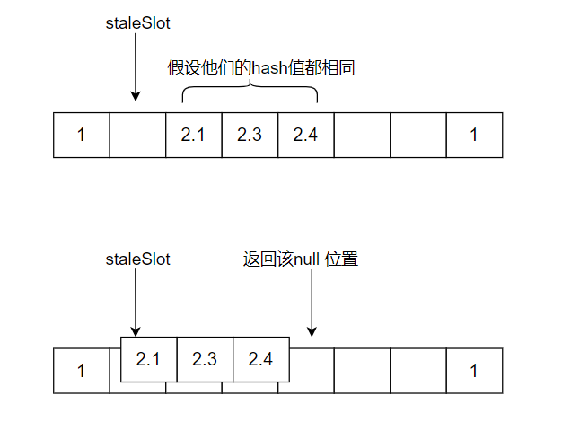
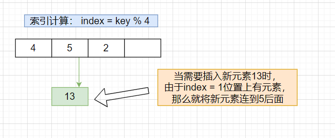
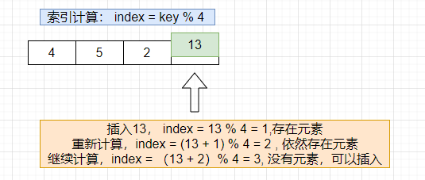
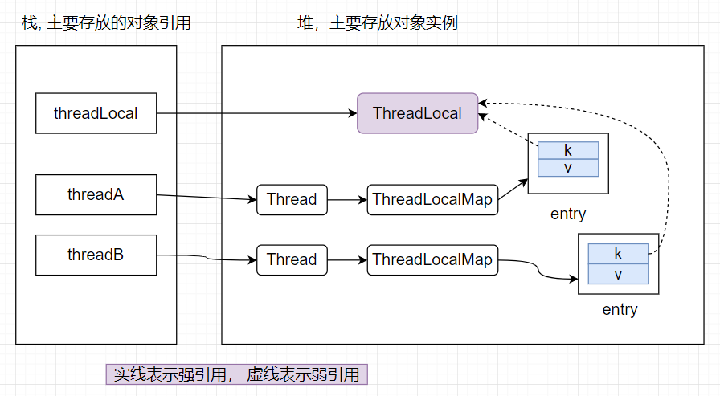

# ThreadLocal

https://mp.weixin.qq.com/s/ucxzyP3GlOdjCRlQgOiy9g

## **介绍：**

​		 在高并发环境下，对象中的共享数据经常会被多个线程同时进行修改，如果不使用同步机制，数据不一致的问题很有可能发生，为了避免数据的安全性可以采用一些同步机制，如：`synchronized关键字、Lock锁。`

​		在某些环境下，需要让某些数据在线程之间进行隔离，也就是每个线程访问的数据是相互独立的，ThreadLocal就是为了解决这一问题而诞生的， 比如在spring的事务管理中，Connection对象就是使用ThreadLocal对象来保存的。 

​		需要注意的是，ThreadLocal的出现`并不是`为了解决并发环境数据的安全性问题， ThreadLocal仅仅是为了让每个线程拥有自己`独立`的数据空间（一个`Map`对象）


**示例代码：**

ThreadLocal 数据的保存 本质上就是保存 在**Thread**对象中的一个变量， 因此Thread消亡，threadlocal注定消亡

> A线程只能获取到A线程中set到ThreadLocal中的值，B线程只能获取B线程中set到ThreadLocal中的值， 这样就做到了线程中的数据只能自己访问

```java
public class ThreadLocalTest {
    static ThreadLocal<Integer> threadLocal = new ThreadLocal<>();
    public static void main(String[] args) throws InterruptedException {

        new Thread(() -> {
            System.out.println("当前线程" + Thread.currentThread().getName() + "threadLocal中存储的数据：" + threadLocal.get());
            threadLocal.set(10);
            System.out.println("当前线程" + Thread.currentThread().getName() + "threadLocal中存储的数据：" + threadLocal.get());
        }, "A").start();

        TimeUnit.SECONDS.sleep(1);
        new Thread(() -> {
            System.out.println("当前线程" + Thread.currentThread().getName() + "threadLocal中存储的数据：" + threadLocal.get());
            threadLocal.set(11);
            System.out.println("当前线程" + Thread.currentThread().getName() + "threadLocal中存储的数据：" + threadLocal.get());
        }, "B").start();
    }
}
```


## ThreadLocal源码剖析：


Thread类中有如下属性：

```java
// 相当于线程的局部变量， 这里可以看出结构为一个ThreadLocalMap
ThreadLocal.ThreadLocalMap threadLocals = null;
// 继承自父类线程的threadlocal变量
ThreadLocal.ThreadLocalMap inheritableThreadLocals = null;
```

每个线程操作的数据，都是由ThreadLocal的内部类`ThreadLocalMap`来维护， set、get操作最终通过`threadLocals `对象来完成


### hash函数

> 下面内容都为ThreadLocal中的成员变量、方法

```java
// ThreadLocalMap调用该变量计算hash值，消除了在同一线程中连续的构造ThreadLoca造成的hash冲突，同时在一些不太常见的情况下也保持较好的效果

// 每个ThreadLocal对象初始化都会调用一次nextHashCode()来赋值，而由于nextHashCode是静态变量，保证了nextHashCode只初始化一次，所以所有的ThreadLocal对象都是在原nextHashCode上进行增加HASH_INCREMENT， 所以这里注释说了防止连续的ThreadLocal对象在同一位置发生冲突
private final int threadLocalHashCode = nextHashCode();
// 保证线程的安全
private static AtomicInteger nextHashCode =
    new AtomicInteger();
// 连续生成的hash值的间隔，采用黄金分割使hash更加分散，具体介绍见
// https://blog.csdn.net/y4x5M0nivSrJaY3X92c/article/details/81124944
private static final int HASH_INCREMENT = 0x61c88647;
private static int nextHashCode() {
    return nextHashCode.getAndAdd(HASH_INCREMENT);
}

```


### ThreadLocalMap

> ThreadLocal的静态内部类
>
> 类似HashMap结构，以< ThreadLocal, value> 的形式放入Entry数组中，ThreadLocalMap使用`线性探测法`来解决hash冲突

```java
static class ThreadLocalMap {
    // 这里继承了WeakReference， 使ThreadLocal对象变为弱引用，便于垃圾的回收，后文会介绍
    static class Entry extends WeakReference<ThreadLocal<?>> {
            Object value;
            Entry(ThreadLocal<?> k, Object v) {
                super(k);
                value = v;
            }
        }
    	// 数组初始长度
        private static final int INITIAL_CAPACITY = 16;
        private Entry[] table;
        private int size = 0;
    	// 阈值，默认0， 构造方法中将会被赋值
        private int threshold; // Default to 0
    	// 设置阈值为 数组长度的2 / 3,  hashMap 阈值为长度的0.75
        private void setThreshold(int len) {
            threshold = len * 2 / 3;
        }
    	// 数组i下一个位置, i位置发生冲突时将会调用该方法
        private static int nextIndex(int i, int len) {
            return ((i + 1 < len) ? i + 1 : 0);
        }
    	// i前一个位置
        private static int prevIndex(int i, int len) {
            return ((i - 1 >= 0) ? i - 1 : len - 1);
        }
    // 构造方法，对一些参数进行初始化
ThreadLocalMap(ThreadLocal<?> firstKey, Object firstValue) {
            table = new Entry[INITIAL_CAPACITY];
    		// 通过hash值计算出合适的位置，放入<firstKey, firstValue>
            int i = firstKey.threadLocalHashCode & (INITIAL_CAPACITY - 1);
            table[i] = new Entry(firstKey, firstValue);
            size = 1;
            setThreshold(INITIAL_CAPACITY);
        }
```


### 插入操作(set)

```java
// 执行threadLocal.set首先走到该方法
public void set(T value) {
    Thread t = Thread.currentThread();
    // 获取当前线程的ThreadLocalMap对象
    ThreadLocalMap map = getMap(t);
    // 最初每个线程的ThreadLocalMap对象都是null
    if (map != null)	
        // 将value存入map中， key为当前ThreadLocal对象
        map.set(this, value);	
    else
        createMap(t, value);	// 先为线程创建ThreadLocalMap对象，在将value 放入map中
}
// 为当前线程创建ThreadLocalMap对象
void createMap(Thread t, T firstValue) {
    t.threadLocals = new ThreadLocalMap(this, firstValue);
}

// ThreadLocalMap#set
private void set(ThreadLocal<?> key, Object value) {
    Entry[] tab = table;
    int len = tab.length;
    // 计算应该插入的位置
    int i = key.threadLocalHashCode & (len-1);

    // 出现冲突将采用线性探测找到一个空的位置
    for (Entry e = tab[i];
         // e != null: 说明发生冲突，将索引移动到下一个位置
         e != null;
         e = tab[i = nextIndex(i, len)]) {	// i 的下一个位置
        ThreadLocal<?> k = e.get();
		// 如果key已经存在，那么将原来的值替换成新的值即可
        if (k == key) {
            e.value = value;
            return;
        }
		// k == null : 说明被key已被GC 回收，此时需要将value清空，防止内存泄漏
        if (k == null) {
            replaceStaleEntry(key, value, i);
            return;
        }
    }

    tab[i] = new Entry(key, value);
    int sz = ++size;
    // cleanSomeSlots: 搜寻并清除i后面无效的entry， 有无效的entry会返回true
    // condition2: 元素数量达到阈值
    if (!cleanSomeSlots(i, sz) && sz >= threshold)
        rehash();	// 进行扩容
}

```


### get操作


```java
public T get() {
    Thread t = Thread.currentThread();
    ThreadLocalMap map = getMap(t);		// 获取当前线程的ThreadLocalMap对象
    if (map != null) {
        // 获取ThreadLocal对应的entry
        ThreadLocalMap.Entry e = map.getEntry(this);
        if (e != null) {
            @SuppressWarnings("unchecked")
            T result = (T)e.value;
            return result;
        }
    }
    // 当ThreadLocalMap还没有初始化时，会调用该方法进行初始化
    return setInitialValue(); // 可以重写initialValue()方法，确定初始值，否则初始值为null
}

private Entry getEntry(ThreadLocal<?> key) {
    // hash计算出相应的位置
    int i = key.threadLocalHashCode & (table.length - 1);
    Entry e = table[i];
    if (e != null && e.get() == key)
        return e;
    else	// i 位置的元素为null，或则i位置的key不为当前方法传入的key
        return getEntryAfterMiss(key, i, e);
}
// getEntry方法中通过hash直接确定的slot中没有找到key对应的entry
private Entry getEntryAfterMiss(ThreadLocal<?> key, int i, Entry e) {
    Entry[] tab = table;
    int len = tab.length;

    while (e != null) {
        ThreadLocal<?> k = e.get();
        if (k == key)
            return e;
        if (k == null)
            expungeStaleEntry(i);	// 清除无效的entry
        else
            i = nextIndex(i, len);	// 向下一个位置探测
        e = tab[i];
    }
    return null;
}
```


### 扩容操作

> 在set操作后，如果插入元素位置后面没有无效的entry， 并且数组中的元素个数达到阈值，将调用rehash方法， rehash中会遍历数组清除无效的entry，再次判断是否达到扩容条件

```java
private void rehash() {
    expungeStaleEntries();	// 遍历数组，清除数组中所有无效的entry

    // Use lower threshold for doubling to avoid hysteresis
    // 使用较低的阈值避免双倍扩容滞后
    if (size >= threshold - threshold / 4)
        resize();
}

// 进行双倍扩容
private void resize() {
    Entry[] oldTab = table;
    int oldLen = oldTab.length;
    int newLen = oldLen * 2;
    Entry[] newTab = new Entry[newLen];
    int count = 0;

    // 将原数组中有效的entry转移到新数组中
    for (int j = 0; j < oldLen; ++j) {
        Entry e = oldTab[j];
        if (e != null) {
            ThreadLocal<?> k = e.get();
            if (k == null) {
                e.value = null; // Help the GC
            } else {
                int h = k.threadLocalHashCode & (newLen - 1);
                while (newTab[h] != null)	// 寻找空位置
                    h = nextIndex(h, newLen);
                newTab[h] = e;
                count++;
            }
        }
    }
	// 重新设置阈值， newLen * 2 / 3
    setThreshold(newLen);
    size = count;
    table = newTab;
}
```


### replaceStaleEntry

>  在set操作时，发现staleSlot位置是一个一个过期的entry （key 为null），将会走到这里，这个方法也会将其他过期的Entry 删除


```java
private void replaceStaleEntry(ThreadLocal<?> key, Object value,
                               int staleSlot) {
    Entry[] tab = table;
    int len = tab.length;
    Entry e;
	// 记录当前过期的槽
    int slotToExpunge = staleSlot;
    for (int i = prevIndex(staleSlot, len);	
         (e = tab[i]) != null;
         i = prevIndex(i, len))		// 查看当前位置前面是否有相邻的空槽
        if (e.get() == null)
            slotToExpunge = i;
	// 查找staleSlot位置后面的空槽
    for (int i = nextIndex(staleSlot, len);
         (e = tab[i]) != null;
         i = nextIndex(i, len)) {
        ThreadLocal<?> k = e.get();
		// 如果找到了一个k正好与插入的key相同， 那么替换value
        if (k == key) {
            e.value = value;

            tab[i] = tab[staleSlot];
            tab[staleSlot] = e;

            if (slotToExpunge == staleSlot)
                slotToExpunge = i;
            // 搜寻并清除无效的entry
            cleanSomeSlots(expungeStaleEntry(slotToExpunge), len);
            return;
        }

        if (k == null && slotToExpunge == staleSlot)
            slotToExpunge = i;
    }

    // 没有找到其他无效的entry
    tab[staleSlot].value = null;
    tab[staleSlot] = new Entry(key, value);

    // If there are any other stale entries in run, expunge them
    // 如果还有其他无效的entry，那么清除掉
    if (slotToExpunge != staleSlot)
        cleanSomeSlots(expungeStaleEntry(slotToExpunge), len);
}
```


### expungeStaleEntry

>  通过重新散列staleSlot位置和下一个空槽之间的entry， 来清除过期的entry

```java
private int expungeStaleEntry(int staleSlot) {
    Entry[] tab = table;
    int len = tab.length;

    // 将stalSlot位置元素设置null
    tab[staleSlot].value = null;
    tab[staleSlot] = null;
    size--;

    // 从staleSlot位置向后遍历，将key为null的entry清除，
    // 同时将后面非空的元素重新调整位置
    Entry e;
    int i;
    for (i = nextIndex(staleSlot, len);
         (e = tab[i]) != null;
         i = nextIndex(i, len)) {
        ThreadLocal<?> k = e.get();
        if (k == null) {
            e.value = null;
            tab[i] = null;
            size--;
        } else { // 将非空的元素重新hash计算位置
            int h = k.threadLocalHashCode & (len - 1);
            // h != i, 说明当前元素是由于插入时hash冲突后，移动到后面的，现在需要将元素转移到前面位置
            if (h != i) {
                tab[i] = null;

                // 从h~i寻找一个null的位置，将元素插入
                while (tab[h] != null)
                    h = nextIndex(h, len);
                tab[h] = e;
            }
        }
    }
    return i;
}
```


大致过程如下：



### cleanSomeSlots

> 启发式的搜寻过期的entry， 在添加元素，或则删除过期的entry时，会调用该方法
>
> i： 表示不持有过期entry的位置
>
> n：控制扫描的时间复杂度， 在add时， n表示元素个数， 在replaceStaleEntry方法中传入的是数组的长度
>
> return： 如果有过期的entry，那么返回true


```java
private boolean cleanSomeSlots(int i, int n) {
    boolean removed = false;
    Entry[] tab = table;
    int len = tab.length;
    do {
        i = nextIndex(i, len);
        Entry e = tab[i];
        if (e != null && e.get() == null) {	// entry需要被清除
            n = len;
            removed = true;
            i = expungeStaleEntry(i);	// 清除该entry
        }
    } while ( (n >>>= 1) != 0);
    return removed;
}
```


### expungeStaleEntries

> 清除key为null的entry

```java
private void expungeStaleEntries() {
    Entry[] tab = table;
    int len = tab.length;
    for (int j = 0; j < len; j++) {
        Entry e = tab[j];
        if (e != null && e.get() == null)
            expungeStaleEntry(j);
    }
}
```


### hash冲突解决

- 跟HashMap实现方式不同，这里的`key 存储的是当前ThreadLocal对象`（有些文章说是当前线程，根据源码发现key为this，指的是ThreadLocal对象）， value存储实际的数据，同时hashMap 发生hash冲突时，采用链表、红黑树来解决冲突，而ThreadLocalMap是采用`开放地址法`( 也叫线性探测法)解决

  - HashMap冲突：
    

  - ThreadLocalMap冲突：

    如果当前位置发生冲突，那么将指针向下一个位置移动

    


## Java对象引用关系

Java中一共有4中引用

1. 强引用， 像 Object obj = new Object(); 这种引用关系属于强引用， 只要该强引用关系存在，不管任何时候都不会清除该对象
2. 软引用，指在为其他对象分配空间时，由于堆空间不够而触发GC ( 即将OOM时)，此时会将软引用对象清除
3. 弱引用， 不管堆空间是否足够，只要触发GC，都会将弱应用对象清除
4. 虚引用，用于在对象回收时，用来得到一些系统通知


- 
   弱引用示例：

  ```java
  // 系统GC时， 只要发现弱引用，且该弱引用没有任何强引用关联，不管空间是否充足，都会回收只被弱引用关联的对象
  public class WeakReferenceTest {
      public static class User {
          int age;
          String name;
          public User(int age, String name) {
              this.age = age;
              this.name = name;
          }
          @Override
          public String toString() {
              return "User{" +
                  "age=" + age +
                  ", name='" + name + '\'' +
                  '}';
          }
      }
  
      public static void main(String[] args) {
          // 创建一个弱引用对象，此时的User对象只有弱引用，没有强引用指向，如果有强引用关联时不会被回收的
          WeakReference<User> weakReference = new WeakReference<>(new User(10, "xiao"));
          // 这里可以得到User对象
          System.out.println(weakReference.get());
          // 显式触发GC
          System.gc();
          System.out.println("after GC");
          // 这里为null
          System.out.println(weakReference.get());
      }
  }
  ```

     ps： 对Java引用实在陌生可以参考B站，尚硅谷的JVM视频进行学习

- ThreadLocalMap的entry继承了`WeakReference`，将`key作为弱引用`，意味着当没有强引用关联时，将会被GC回收

  ```java
  // 存储数据的数组
  private Entry[] table;
  static class ThreadLocalMap {
          static class Entry extends WeakReference<ThreadLocal<?>> {
              Object value;
              Entry(ThreadLocal<?> k, Object v) {
                  super(k);
                  value = v;
              }
          }
  }
  ```


## 内存泄漏

> 由于程序中无效的对象存在，并且GC不能将其清除而导致的OOM


由于ThreadLocalMap中的entry 继承了WeakReference, 指定的key为弱引用，因此当key没有强引用指向时将会被GC回收，这里仅仅是回收作为key的ThreadLocal对象，而value是由线程中的ThreadLocalMap产生的`强引用关系`,  只要线程没有销毁，那么该entry对象就会一直存在，此时 entry对象为` <null, value>`。

如果该value存放的对象所占用的堆空间较大，且当程序中存在许多key为null的entry对象时，将会占用较多的堆空间，由于强引用的存在，使这部分空间一直无法被GC回收， 进而导致内存溢出


当然ThreadLocal的设计者（Josh Bloch and Doug Lea）也考虑到了这点，因此在set、get操作时，如果发现了某些key为null（一般是hash冲突时才会额外处理），那么就会将其value赋值为null， 便于GC

同时也会遍历该位置附近的元素，尽可能的找出所有key为null的entry。但是该方法并不能完全找出无效的entry，为了严格避免内存泄漏发生，最好的方式是在ThreadLocal不用的时候`手动调用remove`方法来释放无效的entry


引用关系图如下：



**说明：** 当threadLocal变量不在使用，被GC或赋null时，ThreadLocal强引用链会断开，此时ThreadLocal对象就只是一个弱引用对象，当JVM触发GC时，ThreadLocal将会被回收，但是此时entry并没有被回收，v如果是一个大对象，将会占据大量内存空间，因此在key被回收后，需要将value也清空，以此来防止发生内存泄漏


## 面试问题：

> 应该是B站某个up主下方复制的，好像是小刘说源码， 我没看过视频，可以看下他的视频，可能会理解更加深入

1、大体说下你对 ThreadLocal的理解？
2、ThreadLocal的原理是什么呢？
    追问1：ThreadLocalMap内存储的是什么？
    追问2：ThreadLocal它是怎样做到线程之间互不干扰的呢？
    追问3：老版本JDK的ThreadLocal是怎么设计的呢？
3、JDK8 版本的ThreadLocal设计有什么优势相比更早之前的老版本（不指jdk1.7，比jdk1.7还要老，可以认为是ThreadLocal第一版）？					

​		看博客说老版本： ThreadLocalMap中的key是存的线程，具体不知道哪个版本

4、ThreadLocalMap 存放数据时，数据的hash值是从Object.hashCode()拿到的，还是其它方式？为什么？
5、为什么ThreadLocal选择自定义一款Map而没有沿用JDK中的HashMap？
6、每个线程的 ThreadLocalMap对象 是什么时候创建的呢？
7、ThreadLocalMap 底层存储数据的数组长度 初始化是多少？
     追问1：这个数组大小为什么必须为 2的次方数？
     追问2：ThreadLocalMap的扩容阈值是多少呢？
     追问3：ThreadLocalMap达到扩容阈值一定会扩容么？
     追问4：扩容算法 你简单说一说。
8、ThreadLocalMap对象的 get逻辑，你说下。
    追问1：假设get首次未命中，向下迭代查找时，碰到过期数据了，怎么处理？
    追问2：探测式清理过期数据，向下迭代过程中碰到正常数据，怎么处理？
9、ThreadLocalMap set数据流程，大体说一下。
    追问1：set数据时碰到过期数据了，需要做替换逻辑，这个替换逻辑是怎么做的？

10. 线程销毁了，会发生内存泄漏吗？  
    不会，thread都销毁了，Thread内部的ThreadLocalMap 肯定也不在了


# TTL

https://juejin.cn/post/7009515644928393223#heading-0https://juejin.cn/post/7009515644928393223#heading-0


> 当main线程中的ThreadLocal值改变后，线程池中的线程执行会得到最新的值

```java

public class TestThreadLocal {

//    private static final ThreadLocal<Person> THREAD_LOCAL = new InheritableThreadLocal<>();
//    private static final ExecutorService THREAD_POOL = Executors.newFixedThreadPool(2);
    // 实现类使用TTL的实现
    private static final ThreadLocal<Person> THREAD_LOCAL = new TransmittableThreadLocal<>();
    // 线程池使用TTL包装一把
    private static final ExecutorService THREAD_POOL = TtlExecutors.getTtlExecutorService(Executors.newSingleThreadExecutor());

    @Test
    public void fun1() throws InterruptedException {
        THREAD_LOCAL.set(new Person());


        THREAD_POOL.execute(() -> getAndPrintData());
        TimeUnit.SECONDS.sleep(2);
        Person newPerson = new Person();
        newPerson.setAge(100);
        THREAD_LOCAL.set(newPerson); // 给线程重新绑定值


        THREAD_POOL.execute(() -> getAndPrintData());
        TimeUnit.SECONDS.sleep(1);

        newPerson.setAge(200);
        THREAD_POOL.execute(() -> getAndPrintData());
        TimeUnit.SECONDS.sleep(2);
    }


    private void setData(Person person) {
        System.out.println("set数据，线程名：" + Thread.currentThread().getName());
        THREAD_LOCAL.set(person);
    }

    private Person getAndPrintData() {
        Person person = THREAD_LOCAL.get();
        System.out.println("get数据，线程名：" + Thread.currentThread().getName() + "，数据为：" + person);
        return person;
    }

    @Setter
    @ToString
    private static class Person {
        private Integer age = 18;
    }
}

```


### TtlRunnable.java

> 提交任务时会使用TtlRunable进行包装


```java
// releaseTtlValueReferenceAfterRun: 默认false，表示同一个任务可以多次执行，true表示只能执行一次， run方法中有体现
private TtlRunnable(@NonNull Runnable runnable, boolean releaseTtlValueReferenceAfterRun) {
    this.capturedRef = new AtomicReference<Object>(capture());
    this.runnable = runnable;
    this.releaseTtlValueReferenceAfterRun = releaseTtlValueReferenceAfterRun;
}
```


捕获 父线程( 提交任务的线程)中的 ThreadLocal信息

```java
public static Object capture() {
    // captureThreadLocalValues: 一般为空，只有调用了registerThreadLocal 后threadLocalHolder 才有值
    return new Snapshot(captureTtlValues(), captureThreadLocalValues());
}

// 将父线程  <TransmittableThreadLocal， value> 提取 保存
private static WeakHashMap<TransmittableThreadLocal<Object>, Object> captureTtlValues() {
    WeakHashMap<TransmittableThreadLocal<Object>, Object> ttl2Value = new WeakHashMap<TransmittableThreadLocal<Object>, Object>();
    for (TransmittableThreadLocal<Object> threadLocal : holder.get().keySet()) {
        ttl2Value.put(threadLocal, threadLocal.copyValue());
    }
    return ttl2Value;
}

```


### run

```java
public void run() {
    Object captured = capturedRef.get();
    if (captured == null || releaseTtlValueReferenceAfterRun && !capturedRef.compareAndSet(captured, null)) {
        throw new IllegalStateException("TTL value reference is released after run!");
    }
	// backup记录 当前线程原来的ThreadLocal信息， replay：用 captured（父线程ThreadLocal） 的信息来更新当前线程ThreadLocal信息
    Object backup = replay(captured);
    try {
        runnable.run();
    } finally {
        // 还原当前线程ThreadLocal中的信息
        restore(backup);
    }
}
```


### replay

> 更新当前线程ThreadLocal 数据为 父线程的数据

```java
public static Object replay(@NonNull Object captured) {
    final Snapshot capturedSnapshot = (Snapshot) captured;
    return new Snapshot(replayTtlValues(capturedSnapshot.ttl2Value), replayThreadLocalValues(capturedSnapshot.threadLocal2Value));
}

@NonNull
private static WeakHashMap<TransmittableThreadLocal<Object>, Object> replayTtlValues(@NonNull WeakHashMap<TransmittableThreadLocal<Object>, Object> captured) {
    WeakHashMap<TransmittableThreadLocal<Object>, Object> backup = new WeakHashMap<TransmittableThreadLocal<Object>, Object>();

    for (final Iterator<TransmittableThreadLocal<Object>> iterator = holder.get().keySet().iterator(); iterator.hasNext(); ) {
        TransmittableThreadLocal<Object> threadLocal = iterator.next();

        // backup： 记录当前线程数据
        backup.put(threadLocal, threadLocal.get());

        // 父线程没有这个ThreadLocal， 那么删除。  保证与父线程一致
        if (!captured.containsKey(threadLocal)) {
            iterator.remove();
            threadLocal.superRemove();
        }
    }

    // set TTL values to captured
    setTtlValuesTo(captured);

    // call beforeExecute callback
    doExecuteCallback(true);

    return backup;
}
// 将 父线程中的TTL 写到当前线程
private static void setTtlValuesTo(@NonNull WeakHashMap<TransmittableThreadLocal<Object>, Object> ttlValues) {
    for (Map.Entry<TransmittableThreadLocal<Object>, Object> entry : ttlValues.entrySet()) {
        TransmittableThreadLocal<Object> threadLocal = entry.getKey();
        threadLocal.set(entry.getValue());
    }
}
```


### restore

> 恢复执行任务前的 ThreadLocal信息

```java
public static void restore(@NonNull Object backup) {
    final Snapshot backupSnapshot = (Snapshot) backup;
    restoreTtlValues(backupSnapshot.ttl2Value);
    restoreThreadLocalValues(backupSnapshot.threadLocal2Value);
}

private static void restoreTtlValues(@NonNull WeakHashMap<TransmittableThreadLocal<Object>, Object> backup) {
    // call afterExecute callback
    doExecuteCallback(false);

    for (final Iterator<TransmittableThreadLocal<Object>> iterator = holder.get().keySet().iterator(); iterator.hasNext(); ) {
        TransmittableThreadLocal<Object> threadLocal = iterator.next();

        // clear the TTL values that is not in backup
        // avoid the extra TTL values after restore
        // 当前线程原本没有该ThreadLocal
        if (!backup.containsKey(threadLocal)) {
            iterator.remove();
            threadLocal.superRemove();
        }
    }

    // restore TTL values
    // 用老数据更新ThreadLocal
    setTtlValuesTo(backup);
}
```


# FastThreadLocal

见Netty.md

