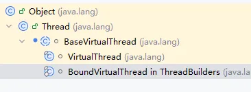
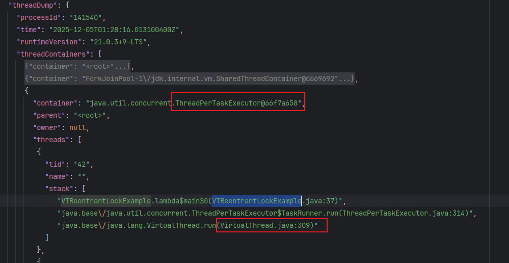
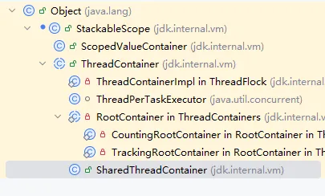
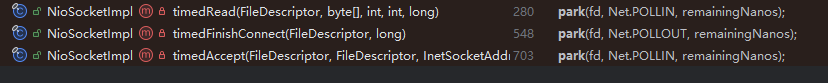
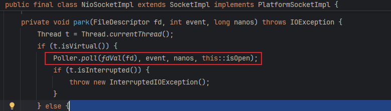

# Virtual Thread

由JEP444 发起，在JDK 21中正式发布。相比平台线程更加轻量级，在某些场景下可以显著提供程序的吞吐量，API使用也十分的简单，不需要太多的学习成本。

目前存在的问题： https://github.com/SAP/SapMachine/wiki/Essential-Information-on-Virtual-Threads
> JVM层面 虚拟线程具体实现参考：https://bytejava.cn/md/jvm/jvm/virtualthread/virtual-thread.html


常见用法
```java
public static void main(String[] args) {
    Thread.ofVirtual().start(() -> {
        System.out.println(Thread.currentThread());
    }).join();

    Thread.startVirtualThread(() -> {
        System.out.println(Thread.currentThread());
    }); //.setName("virtual thread");
    ExecutorService executorService = Executors.newVirtualThreadPerTaskExecutor();
    executorService.submit(() -> {});
}  
```

## 虚拟线程分析
VirtualThread类从Thread继承而来，Thread 支持的功能虚拟线程同样支持，可以无缝切换Thread 到虚拟线程


默认采用ForkJoinPool调度器： java.lang.VirtualThread.DEFAULT_SCHEDULER
初始化：
```java
    private static final ForkJoinPool DEFAULT_SCHEDULER = createDefaultScheduler();

private static ForkJoinPool createDefaultScheduler() {
    ForkJoinWorkerThreadFactory factory = pool -> {
        // 当创建新线程时使用的 CarrierThread， extends ForkJoinWorkerThread
        PrivilegedAction<ForkJoinWorkerThread> pa = () -> new CarrierThread(pool);
        return AccessController.doPrivileged(pa);
    };
    PrivilegedAction<ForkJoinPool> pa = () -> {
        int parallelism, maxPoolSize, minRunnable;
        String parallelismValue = System.getProperty("jdk.virtualThreadScheduler.parallelism");
        String maxPoolSizeValue = System.getProperty("jdk.virtualThreadScheduler.maxPoolSize");
        String minRunnableValue = System.getProperty("jdk.virtualThreadScheduler.minRunnable");
        Thread.UncaughtExceptionHandler handler = (t, e) -> { };
        // .... 
        boolean asyncMode = true; // FIFO
        return new ForkJoinPool(parallelism, factory, handler, asyncMode,
                0, maxPoolSize, minRunnable, pool -> true, 30, SECONDS);
    };
    return AccessController.doPrivileged(pa);
}
```
从代码中得出，默认调度器创建的线程为`CarrierThread`，因此源码中很多地方会有这样的写法来判断是否为虚拟线程 `currentCarrierThread() instanceof CarrierThread ct`


虚拟线程执行流程：
1. 当虚拟线程执行任务时，会将任务包装成一个Continuation，continuation会管理当前任务的执行状态以及堆栈信息。
2. 将runnable任务(主要执行 continuation#run) 提交给Scheduler调度器。目前是ForkJoinPool，拥有工作窃取机制，可以很高效的处理任务。
3. 任务被scheduler某个线程选中（称为Carrier线程），开始执行任务： continuation#run
4. 当任务中出现阻塞操作时，如 LockSupport.park，会执行yield暂停当前任务(内部会判断虚拟线程执行yield，如果是平台线程依然走park)，将当前运行的栈、上下文信息保存到continuation对象中。
5. Carrier线程不会阻塞，接着处理其他任务。在Carrier眼中相当于这个任务已经执行完成
6. 当任务的阻塞操作完成后，会唤醒continuation (LockSupport.unpark)，重新提交给scheduler。
7. scheduler 再次选中该runnable任务，触发continuation#run， 恢复continuation中的栈、上下文信息, 从暂停的位置继续执行程序。（现在的Carrier线程不一定跟之前的相同）


### Continuation
> Continuation作为一个执行任务载体，内部维护着任务的执行状态。当执行yield 的时候会将当前运行的上下文信息保存到堆中，放弃执行权。 当被唤醒后会重新恢复上下文信息，继续从暂停的地方执行
> continuation也可以单独使用，如下：

```java
/**
 * --add-exports java.base/jdk.internal.vm=ALL-UNNAMED
 * @date 2025/9/3
 */
public class ContinuationTest2 {
    public static void main(String[] args) {
        ContinuationScope scope = new ContinuationScope("scope");
        Continuation continuation = new Continuation(scope, () -> {
            System.out.println("continuation start execute...");
            Continuation.yield(scope);    // 暂停执行continuation
            System.out.println("continuation end execute...");
        });

        continuation.run();  // 开始执行continuation
        System.out.println(continuation.isDone());    // false: 由于continuation内部执行了yield
        continuation.run();  // 继续执行continuation

    }
}
```

输出如下：
```text
continuation start execute...
false
continuation end execute...
```

### Pinning
前面说了虚拟现在在执行continuation的时候，遇到阻塞的时候会执行yield，完成后Carrier线程会继续去处理其他任务。
但是在某些情况下执行yield 并不能立即结束当前的任务，导致该Carrier线程一直阻塞，这种情况就叫Pinning

下面情况会发生Pinning：
1. synchronized块/方法中遇到了续体yield调用(wait0,sleep0,park; mysql-connector ) 或者 等待进入synchronized块(貌似不会Pinned)，受限于轻量级锁和Object_monitor_waiter的实现，所以会一并使得当前的载体线程阻塞。    JDK 24 已经解决了 JEP 491
monitor释放之后(synchronized块/方法退出)，线程就被解除Pinning。 
2. 从Native层回调Java层时，遇到了续体yield调用，此时受限于FFI实现不应当让出当前线程，所以产生了Pinning
3. 虚拟线程加载类初始化 可能死锁。  Fixed(*) since JDK 26 by 8369238。 打破类初始化路径上的抢占
   当载体线程执行一个continuation ① 时，在类A中执行IO操作，执行yield.  然后当前载体线程的执行另外一个continuation ② 加载类B， 类B 的初始化(static) 需要 等待类A的IO完成;
   continuation ① 执行的IO操作结束.  由于当前载体线程 在执行continuation ②， 不能被抢占来执行 continuation ①， 因此形成了循环等待。
    ``` 
   "ForkJoinPool-1-worker-15" #144 [23020] daemon prio=5 
    Carrying virtual thread #45
      at jdk.internal.vm.Continuation.run(java.base@21.0.3/Continuation.java:248)
      - waiting on the Class initialization monitor for org.example.TestClassInit$ServiceEndpoint```


pinning 检查参数： -Djdk.tracePinnedThreads=short/full. (参数只会检测部分场景, jdk25 remove)  如果发生pin，将会输出： <== monitors
由于这个参数内部实现和jvmti交互有bug， 因此在debug场景下会卡死。
```java
// -Djdk.tracePinnedThreads=short,   JDK 通过 yield0 方法的返回值 来判断是否发生pinning
public class Main {
    public static void main(String[] args)  {
        Thread.startVirtualThread(() -> {
            synchronized (Main.class) {
                try {
                    TimeUnit.SECONDS.sleep(1);
                    System.out.println("finish");
                } catch (InterruptedException e) {
                    throw new RuntimeException(e);
                }
            }
        }); //.setName("virtual thread");
        LockSupport.park();
    }
}
```
输出：
```text
Thread[#31,ForkJoinPool-1-worker-1,5,CarrierThreads]
    org.example.Main.lambda$main$0(Main.java:11) <== monitors:1
finish
```
输出位置：java.lang.VirtualThread.VThreadContinuation.onPinned （JDK 25 空实现）

JEP491: 解决Synchronize 情况下发生pinning， 参数tracePinnedThreads将无用。 由JDK24 中发布，并没有完全解决pinning.


### 虚拟线程park 逻辑 : 
**LockSupport.park(time);**
---> java.lang.VirtualThread.park(Nanos)
当虚拟线程执行sleep 操作时，也会调用park方法

1. 如果是带超时参数的，首先提交unpark 定时任务到 VirtualThread-unparker 线程池， 设置虚拟线程状态 PARKING
2. 当前continuation执行yield0() --> doYield() [[非阻塞操作]()], 尝试转移当前线程控制权给调度器。 当转移失败，doYield 会返回非0， 会打印Pinned 相关日志。
3. 当yield正常转移所有权后，unpark定时任务完成后会重新提交continuation，恢复执行权，此时park正常结束。 如果yield 失败 发起**VirtualThreadPinnedEvent**，执行Carrier线程阻塞操作。

不带等待时间：java.lang.VirtualThread.park： 直接执行 `Continuation.yield`


**LockSupport.unpark(thread);**
如果线程正常park，没有pin，执行submitRunContinuation：提交continuation的任务给调度器，调度器获取到任务后继续调用continuation#run 
发生了ping： 执行U.unpark(carrier)， 唤醒载体线程
```java
 void unpark() {
        Thread currentThread = Thread.currentThread();
        if (!getAndSetParkPermit(true) && currentThread != this) {
            int s = state();
            if (s == PARKED && compareAndSetState(PARKED, RUNNABLE)) {
                if (currentThread instanceof VirtualThread vthread) {
                    vthread.switchToCarrierThread();
                    try {
                        submitRunContinuation();
                    } finally {
                        switchToVirtualThread(vthread);
                    }
                } else {
                    submitRunContinuation();
                }
            } else if (s == PINNED) {
                // unpark carrier thread when pinned.
                synchronized (carrierThreadAccessLock()) {
                    Thread carrier = carrierThread;
                    if (carrier != null && state() == PINNED) {
                        U.unpark(carrier);
                    }
                }
            }
        }
    }
```


### 虚拟线程观测 & ThreadContainer
> 在使用 jstack 或 jcmd 获取的 JDK 传统线程转储展示的是一个扁平的线程列表，不利于虚拟线程的观察，jcmd 中引入一种新型的线程转储 ，
> 以有意义的方式将虚拟线程与平台线程一起分组展示。当程序使用结构化并发时，可以展示线程之间更丰富的关系。

在执行过程可以使用下面命令可以输出线程信息：
```shell
# 输出txt。java命令直接启动的单java文件，名称为 jdk.compiler/com.sun.tools.javac.launcher.Main
jcmd jdk.compiler/com.sun.tools.javac.launcher.Main Thread.dump_to_file -overwrite out.txt   
# 输出json
jcmd <pid> Thread.dump_to_file -format=json <file>
等价于下面代码：
new HotSpotDiagnostic().dumpThreads("C:\\project\\feature23\\test.json", HotSpotDiagnosticMXBean.ThreadDumpFormat.JSON);

```

输出包含多个container。
- <root>： main 、Finalizer、Common-Cleaner等JDK系统线程。
- ForkJoinPool-1/jdk.internal.vm.SharedThreadContainer： 虚拟线程对应的ForkJoin池，即Carrier线程
- ThreadPerTaskExecutor：虚拟线程。 ThreadFactory为：Thread.ofVirtual().factory()




内部主要由ThreadContainer 对象用跟踪线程信息，有虚拟线程数量统计、线程跟踪等。在结构化并发中比较有用。
ThreadContainer继承关系：



开启虚拟线程前会设置默认container 为rootContainers --> ThreadContainers.root()： 
每个Thread对象都有一个container属性, 即使new Thread 没有设置container，默认也为<root>：

根据jdk.trackAllThreads 属性决定是用TrackingRootContainer(default)，还是CountingRootContainer。 name 都叫<root>
- TrackingRootContainer: jdk.trackAllThreads 为true，或者为空。  每次创建虚拟线程会将其加入virtualThreads集合中，结束时会清理。
- CountingRootContainer： jdk.trackAllThreads 为false。 只是统计一个数量. 此时Thread.Builder API 创建的虚拟线程将不会始终被运行时跟踪。即JCMD无法获取到虚拟线程的信息
  
除了上面的Container外，还有SharedThreadContainer(不继承RootContainer)， 用于非结构化使用，例如线程池

手动创建虚拟线程container构造过程：
start(ThreadContainers.root()): 虚拟线程执行过程
1. 使用container跟踪当前线程
2. 如果container#owner 不为空，同时有**scopedValue**，那么需要将其继承过来，放入Thread#scopedValueBindings 
3. 提交continuation 到scheduler (默认forkJoin)
-- 平台线程执行continuation： mount、run、unmount。
-- 如果完成清理资源，从container中移除。 否则yield。
4. 	清理资源，可能执行同样的清理逻辑


## 线程补偿
因为虚拟线程在某些场景下会发生pinning，在此期间载体线程无法调度其他线程，如果pinning 场景过多，可能调度器所有的载体线程都会阻塞，无法消费新的任务，导致程序死掉。
为了解决这一问题，在JDK 21 中，jvm 会主动对一些阻塞场景进行补偿线程，如：object#wait、文件IO 等
```java

public final void wait(long timeoutMillis) throws InterruptedException {
    long comp = Blocker.begin();
    try {
        wait0(timeoutMillis);
    }finally {
        Blocker.end(comp);
    }
}
 public static long begin() {
        if (VM.isBooted()
                && currentCarrierThread() instanceof CarrierThread ct && !ct.inBlocking()) {    // 当前线程为虚拟线程
            ct.beginBlocking();
            boolean completed = false;
            try {
                long comp = ForkJoinPools.beginCompensatedBlock(ct.getPool()); // 向调度器中补偿一个线程
                assert currentCarrierThread() == ct;
                completed = true;
                return comp;
            } finally {
                if (!completed) {
                    ct.endBlocking();
                }
            }
        }
        return -1;
    }
```

由于JDK 25 已经解决了synchronized 代码块 pinning 的问题，因此不会在进行补偿线程了
参考梦佬 https://dreamlike-ocean.github.io/blog/loom/synchronized%E9%80%82%E9%85%8D.html

JDK 25在面对synchronized时，如果需要阻塞时，会为虚拟线程创建一个ObjectWaiter对象挂载waitSet 队列中，然后yield 完成。 载体线程继续调度其他任务，当
虚拟线程的objectWaiter 被唤醒后，会放入一个队列中  `_ObjectMonitor::_vthread_unparker_ParkEvent`

VirtualThread中创建的线程：VirtualThread-unblocker 会不断的执行：java.lang.VirtualThread#takeVirtualThreadListToUnblock
获取_vthread_unparker_ParkEvent 中的虚拟线程， 获取到后会重新提交到调度器，等待再次被执行：
 ```java
private static void unblockVirtualThreads() {
        while (true) {
            VirtualThread vthread = takeVirtualThreadListToUnblock(); // 得到就绪的虚拟线程
            while (vthread != null) {
                assert vthread.onWaitingList;
                VirtualThread nextThread = vthread.next; // 一次性可能会有多个就绪的虚拟线程
                // remove from list and unblock
                vthread.next = null;
                boolean changed = vthread.compareAndSetOnWaitingList(true, false);
                assert changed;
                vthread.unblock();
                vthread = nextThread;
            }
        }
    }

private void unblock() {
    assert !Thread.currentThread().isVirtual();
    blockPermit = true;
    if (state() == BLOCKED && compareAndSetState(BLOCKED, UNBLOCKED)) {
        submitRunContinuation();   // 重新提交continuation任务到调度器
    }
}
```


## ScopeValue
jep481

ScopeValue： 线程间不可变，比threadlocal更加高效，且内存更低,作用域结束自动清理。 主要用于虚拟线程、结构化编程 jep480
threadLocal： 数据可变、使用不当易内存泄露、当子线程过多，继承父线程的inheritableThreadLocals可能导致内存占用较大

StructuredTaskScope:  子线程可以继承父线程的Scope

Snapshot： 快照，相当于threadlocal
相关记录位置：
Thread#scopedValueBindings： 默认Thread.class，  存放Snapshot (包含previous指针) 对象。 子线程通过这个属性复用父线程的scopedValue对象:java.lang.Thread.inheritScopedValueBindings (必须指定作用域，如结构化并发)
Thread#headStackableScopes： **指向线程栈顶元素**。  previous 记录上一个**StackableScope**。  貌似StructuredTaskScope才使用这个东西
Thread#**scopedValueCache**： 缓存当前线程的scopedValue对象， native 方法记录。  默认缓存16个ScopeValue。 key、val 挨着各占一位，即32长度

### ScopedValue.where
ScopedValue.Carrier = ScopedValue.where(scopedValue, "workd1")： 实际上是生成一个scope values 的映射对象。 key 为ScopeValue
Carrier： 一个链表结构，只有一个prev指针。 call、run相关方法都定义在这里
```java
final int bitmask;  // 记录了链上所有ScopedValue实例的bitmask
final ScopedValue<?> key;
final Object value;
final Carrier prev;  
```

ScopeValue 存放数据的实际上是Snapshot对象，Snapshot 持有Carrier
Snapshot#bitmask：
Carrier#bitmask：


### ScopedValue.Carrier.call/run
1. Cache.invalidate： 清空scopedValueCache中 属于当前Carrier链中的对象, 不属于的不会remove
2. 将**当前线程**ScopeValue对象取出(thread#scopedValueBindings),与当前ScopeValue对象形成一个链表： **Snapshot**。
2. Carrier.runWith： 会将上面生成的链表对象Snapshot 重新放入**当前线程**的scopedValueBindings
3. ScopedValueContainer.call： 
   - headStackableScopes为空：直接执行目标
   - headStackableScopes非空: 生成一个ScopedValueContainer(继承StackableScope，owner 为当前thread )对象，绑定之前的scopedValueBindings 到 previous，
   重新设置当前线程的栈顶元素**headStackableScopes**

     
### ScopeValue.get():
1. 从当前线程的缓存**scopedValueCache** 取
2. 取不到从scopedValueBindings取 （**slowGet**）
3. 遍历取到的Snapshot（**栈顶**元素），找到当前相同的key（ScopeValue对象， 同一个线程可能有多个ScopeValue对象）
   1. 遍历Snapshot
   2. 遍历Snapshot#carrier。
   3. 最后放入缓存**scopedValueCache**（native  实现）。 一个32长度的数组。 arr[n] = ScopeValue, arr[n+1] = value

    
整体来说，ScopeValue 相关对象始终都记录在Thread对象的属性中，跟ThreadLocal差不多。 线程终结相关记录都清空。


## StructuredTask
ScopeValue 在线程间共享必须不可变。

ShutdownOnSuccess: 其中一个任务完成后，即终止其他任务
ShutdownOnFailure： 有一个失败后，终止其他任务


Thread flocks： 线程群， 管理线程start， close、 会使用一个tree 结构

StructuredTaskScope# **ThreadFlock**

#scopedValueBindings： 记录当前线程的scopedValue
#container： ThreadContainerImpl （StackableScope子类）实例对象， 会存放当前线程作为owner, StackableScope#previous 记录当前线程的栈顶元素headStackableScopes

scope.fork: 
1. 为任务创建虚拟线程
2. 执行：flock.start(thread), 将线程任务交由ThreadFlock开启线程。
   - VirtualThread.start(container)
     - 设置虚拟线程的container为StructuredTaskScope的container
     - container.onStart: ThreadFlock#threadCount + 1， 将当前线程加入threads
     - 继承container#scopedValueBindings
     - 执行continuation
     - continuation 执行完成后： 最后执行终止操作：afterTerminate，  执行container#onExit --> flock.onExit(thread)：  ThreadFlock#threadCount -1, 从threads移除。
       如果此时threadCount为0， 表示现在执行完了，执行：LockSupport.unpark(owner()); 唤醒join 的线程。
3. 返回任务对象Subtask, 没有等待完成的方法

scope.join： 等待任务完成。


```java
var scopedValue = ScopedValue.newInstance();
ScopedValue.runWhere(scopedValue, "duke", () -> {
            try (var scope = new StructuredTaskScope<String>()) {
                scope.fork(() -> childTask());
                scope.fork(() -> childTask2());
                scope.join();
            } catch (InterruptedException e) {
                throw new RuntimeException(e);
            }
        });

```


## 网络IO 实现
> 在高版本JDK21中，编写传统的BIO代码时，最终都会进行转换为NIO的实现方式。 
> 对于读取操作： 
> - 如果是虚拟线程，等待过程中将会释放continuation， 当数据到达后由Poller 进行唤醒continuation继续执行。
> - 如果是平台线程，那么等待依然采用阻塞等待的方式。
> 
参考： https://juejin.cn/post/6964238184494563342

demo 演示：

Server:

```java

 public static void main(String[] args) throws Throwable {
        HttpServer httpServer = HttpServer.create(new InetSocketAddress(8080), 0);
        httpServer.createContext("/test", t -> {
            try {
                TimeUnit.MINUTES.sleep(5);
            } catch (InterruptedException e) {
                throw new RuntimeException(e);
            }
            Headers responseHeaders = t.getResponseHeaders();
            responseHeaders.add("content-type", "text/plain");
            String response = "This is the response";
            t.sendResponseHeaders(200, response.length());
            OutputStream os = t.getResponseBody();
            os.write(response.getBytes());
            os.close();
        });
        httpServer.start();
        LockSupport.park();
    }
```

```java

    static record URLData (URL url, byte[] response) { }

    static List<URLData> retrieveURLs(URL... urls) throws Exception {
        //创建虚拟线程线程池
        try (var executor = Executors.newVirtualThreadPerTaskExecutor()) {
            //生成读取对每个 url 执行 getURL 方法的任务
            var tasks = Arrays.stream(urls)
                    .map(url -> (Callable<URLData>)() -> getURL(url))
                    .toList();
            //提交任务，等待并返回所有结果
            return executor.invokeAll(tasks).stream()
                    .filter(Future::isDone)
                    .map(f -> {
                        try {
                            return f.get();
                        } catch (InterruptedException e) {
                            throw new RuntimeException(e);
                        } catch (ExecutionException e) {
                            throw new RuntimeException(e);
                        }
                    })
                    .toList();
        }
    }

    //读取url的内容
    static URLData getURL(URL url) throws IOException {
        try (InputStream in = url.openStream()) {

            return new URLData(url, in.readAllBytes());
        }
    }

    public static void main(String[] args) throws Exception {
        long pid = ProcessHandle.current().pid();
        System.out.println("进程 ID (PID): " + pid);
        List<URLData> urlData = retrieveURLs(new URL("http://localhost:8080/test"));
        System.out.println(urlData);
        for (URLData urlDatum : urlData) {
            System.out.println(new String(urlDatum.response));
        }
    }

```


在阻塞过程中可以通过JCMD命令dump 出堆栈信息。 IDEA中自带的dump 工具无法dump出虚拟线程的堆栈信息。

```shell
默认会在进程目录生成文件
jcmd 4632 Thread.dump_to_file threads.txt -overwrite


可以看到虚拟线程阻塞的堆栈信息：
#30 "" virtual
      java.base/java.lang.VirtualThread.park(VirtualThread.java:582)
      java.base/java.lang.System$2.parkVirtualThread(System.java:2643)
      java.base/jdk.internal.misc.VirtualThreads.park(VirtualThreads.java:54)
      java.base/java.util.concurrent.locks.LockSupport.park(LockSupport.java:369)
      java.base/sun.nio.ch.Poller.pollIndirect(Poller.java:139)
      java.base/sun.nio.ch.Poller.poll(Poller.java:102)
      java.base/sun.nio.ch.Poller.poll(Poller.java:87)
      java.base/sun.nio.ch.NioSocketImpl.park(NioSocketImpl.java:175)
      java.base/sun.nio.ch.NioSocketImpl.park(NioSocketImpl.java:201)
      java.base/sun.nio.ch.NioSocketImpl.implRead(NioSocketImpl.java:309)
      java.base/sun.nio.ch.NioSocketImpl.read(NioSocketImpl.java:346)
      java.base/sun.nio.ch.NioSocketImpl$1.read(NioSocketImpl.java:796)
      java.base/java.net.Socket$SocketInputStream.read(Socket.java:1099)
```


**Poller**： 
一个Poller相当于一个selector。不同平台实现不同。win为WEPoll，linux 则epoll，  mac 则 kqueue。 下面都是win的分析：

static 中会初始化readPoller，writePoller。 每个`Poller线程` 启动的时候会，同时启动一个Updater（默认情况： `USE_DIRECT_REGISTER` 为false）
jdk.readPollers 属性可以定义poller 个数，默认1.    请求采用fd % len 的方法来选择poller

readPoller： 监听EPOLLIN 事件， writePoller：监听 EPOLLOUT

核心变量：
- map: <fd, thread>.  `USE_DIRECT_REGISTER` 为true时，使用这个记录阻塞线程。 后续事件响应后 通过这里唤醒fd对应的park线程.  `-Poller`线程处理
- queue<Request>：`USE_DIRECT_REGISTER` 为false时用 (默认)。 跟踪的阻塞信息使用Request对象包装。    `-Updater` 线程处理
  Request：
    - fd： 事件fd
    - waiter： 等待Thread
    - done： 是否完成


`USE_DIRECT_REGISTER`：默认false，会启动`Updater线程`， 即间接模式，将注册fd到EPoll 交给了Updater线程。
外部线程执行 park 时，进入行pollIndirect方法
1. 外部线程 将fd 添加到map、 同时生成Request放入queue， 接着根据isOpen判读是否 执行LockSupport#park
2. Updater线程 获取 从 queue 中获取对象， 取出fd 注册到EPoll， 监听 EPOLLONESHOT（触发方式：report event(s) only once）
3. 外部线程执行awaitFinish： 如果任务没有完成继续park
4. `-Poller`线程检查到事件发生后，唤醒后阻塞fd对应的线程。
5. 外部线程执行deregister： 从map中移除fd， 同时从EPoll 中删除fd

默认使用间接模式 主要为了避免多线程同时操作 Selector 导致的并发问题（Selector 在多线程下不是完全线程安全的）
注意：检查事件，唤醒线程都是`-Poller` 线程


**连接请求**

java.net.Socket#**connect**(java.net.SocketAddress, int)

- getImpl()： 会创建一个delegate表示底层Socket实现：java.net.SocketImpl#**createPlatformSocketImpl**， 默认为 NioSocketImpl
  - sun.nio.ch.NioSocketImpl#create： 创建FD
- connect(epoint, timeout)： 调用Socket实现类 sun.nio.ch.NioSocketImpl#connnect
  - configureNonBlockingIfNeeded： 如果有超时设置，或者虚拟线程 那么设置为非阻塞模式
  - 调用NioSocketImpl#park（注册fd 到Poller中，最终执行LockSupport.park, 等待唤醒）；跟后面分析的等待server响应一样逻辑。
  - 再次执行：Net.pollConnectNow，检查是否成功建立连接。


**读取响应数据：**
sun.nio.ch.NioSocketImpl#implRead --> timedRead --> park

tryRead的时候返回-2 （IOStatus：  Nothing available (non-blocking)）， 就会执行park 逻辑： 

sun.nio.ch.**NioSocketImpl#park**(java.io.FileDescriptor, int, long)： 虚拟线程执行Poller#poll。 非虚拟线程执行默认的Net#poll，由底层平台实现。

1. 选择一个ReadPoller，注册fd 到该对象的Poller#map， 添加Rquest对象到 queue
        2. Updater线程 消费Request对象，执行 fd注册逻辑，添加：EPOLLONESHOT。
            3. ReadPoller线程，执行selector# wait，等待事件发生
2. 执行LockSupport#park。
3. 当server准备好数据后，ReadPoller收到事件，唤醒任务线程 (即执行：LockSupport.unpark(thread);)
4. 任务线程执行deregister逻辑，从Selector 中移除 fd。


**总结：**
Poller 类中会初始化创建Read、Write Poller数组。 默认1.
accept、read： 使用READ_POLLERS
write： 使用WRITE_POLLERS


NioSocketImpl 在执行链接、读、写操作时，如果是虚拟线程会执行Poller.poll, 将fd交由Poller处理，park住虚拟线程，Poller处理完成后会通过unpark唤醒虚拟线程



### Event
VirtualThreadPinnedEvent： 默认开启，threshold of 20ms
VirtualThreadSubmitFailedEvent： enabled。  threshold  0
ThreadSleepEvent
VirtualThreadStartEvent
VirtualThreadEndEvent


JDK 25, tryCompensate bounds变量的值放入了config


https://docs.oracle.com/en/java/javase/25/gctuning/parallel-collector1.html#GUID-6C8D4E24-A580-4FEA-82F0-FE610057DD15
G1
-verbose:gc command is an alias for -Xlog:gc, -Xlog is the general logging configuration option for logging in the HotSpot JVM.
To get more information about what a GC is doing, you can configure logging to print any message that has the gc tag and any other tag. The command line option for this is -Xlog:gc*.

机器2cpu，默认为server 类型。 使用G1， 允许过程中会自动调整堆空间大小

-XX:NewRatio=2： young： old
-XX:NewSize 和 -XX:MaxNewSize：  固定新生代上下限。
-XX:SurvivorRatio=8： eden: survivor.


serial collector: single thread to perform all garbage collection work. It's best-suited to single processor machines,
it can be useful on multiprocessors for applications with small data sets (up to approximately 100 MB)


parallel collector:  also known as throughput collector,it's a generational collector similar to the serial collector,multiple threads that are used to speed up garbage collection
        
    -XX:ParallelGCThreads=<N>. MaxGCPauseMillis
    
G1:  a mostly concurrent collector, It provides the capability to meet a pause-time goal with high probability, while achieving high throughput.
    intended for large multiprocessor machines with a large amount of memory.

ZGC: a fully concurrent collector, provides max pause times under a millisecond,but at the cost of some throughput.It is intended for applications, which require low latency.


## ManagementFactory
ManagementFactory.getPlatformMXBeans: 获取指定类型的MXBean 实现

JDK21 SPI：
会直接读取：module-info.java， 底层API：BootLoader.getServicesCatalog();
如果类路径上有 META-INF/services 文件，会读取它（兼容旧方式）

SPI在加载：PlatformMBeanProvider时，
jdk.management.jfr的module-info.java 有如下定义： with后的即为实现
provides sun.management.spi.PlatformMBeanProvider with
jdk.management.jfr.internal.FlightRecorderMXBeanProvider;


JDK21 PlatformMBeanProvider 实现：
PlatformMBeanProviderImpl: GC、Thread
FlightRecorderMXBeanProvider
DefaultPlatformMBeanProvider: memory、buffer. 默认添加，没有加入module-infoj.java


ManagementFactory.getPlatformMXBeans(BufferPoolMXBean.class):

1. JDK 通过SPI 加载PlatformMBeanProvider 相关实现类，加上默认DefaultPlatformMBeanProvider
2. PlatformMBeanProvider提供的所有PlatformComponent 放入ManagementFactory.PlatformMBeanFinder#componentMap
3. 从上面map 找到 PlatformComponent<BufferPoolMXBean>. 执行nameToMBeanMap(): 通过ManagementFactoryHelper 找到所有的BufferPoolMXBean
4. VM#getBufferPools 得到JDK内置的bufferPools: directBuffer,mappedBufferPool,syncMappedBufferPool(non-volatile memory).
   调用ManagementFactoryHelper#createBufferPoolMXBean封装为BufferPoolMXBean
5. 相关内存统计实际上就是执行的底层的bufferPools了: 本质上就是相关内存使用时用一个全局变量进行的计数


https://mp.weixin.qq.com/mp/appmsgalbum?__biz=Mzg2MzU3Mjc3Ng==&action=getalbum&album_id=2486138956225757185#wechat_redirect

ByteBuffer byteBuffer = ByteBuffer.allocateDirect(1024);

        List<BufferPoolMXBean> platformMXBeans = ManagementFactory.getPlatformMXBeans(BufferPoolMXBean.class);
        // BufferPoolMXBean directPool = ManagementFactory.getPlatformMXBeans(BufferPoolMXBean.class)
                // .stream()
                // .filter(b -> "direct".equals(b.getName()))
                // .filter(b -> "mapped".equals(b.getName()))
                // .filter(b -> "mapped".equals(b.getName()))
                // .findFirst()
                // .orElse(null);
    
        for (BufferPoolMXBean platformMXBean : platformMXBeans) {
            long used = platformMXBean.getMemoryUsed();
            long count = platformMXBean.getCount();
            System.out.println(used);
            System.out.println(count);
    
        }


MappedByteBuffer: 将文件直接映射到虚拟内存，后续的文件操作都发生在用户态，不需要切态，更不需要拷贝。
私有文件映射由于是私有的，所以在内核创建 PTE 的时候会将 PTE 设置为只读，目的是当进程写入的时候触发写保护类型的缺页中断进行写时复制。不会映射到磁盘
共享文件映射由于是共享的，PTE  被创建出来的时候就是可写的，后续进程在对 MappedByteBuffer 写入的时候不会触发缺页中断进行写时复制，而是直接写入 page cache 中，整个过程没有切态，没有数据拷贝。

READ_ONLY_SYNC、READ_WRITE_SYNC 标志是 Linux 内核在 4.15 版本之后新加入的两个扩展，主要用于对 non-volatile memory (persistent memory) 进行映射

page cache 所占用的是物理内存，当系统中物理内存压力大的时候，内核仍然会将 page cache 中的文件页 swap out 出去。
mlock 主要作用是将 [addr, addr+len] 这段范围内的虚拟内存背后映射的物理内存锁定在内存中，当内存资源紧张的时候，这段物理内存将不会被 swap out 出去

MappedByteBuffer#force: 将脏页刷盘， jvm执行msync 
