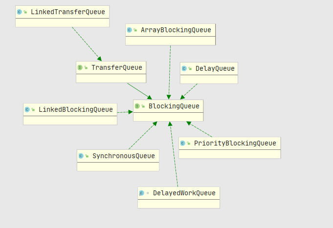
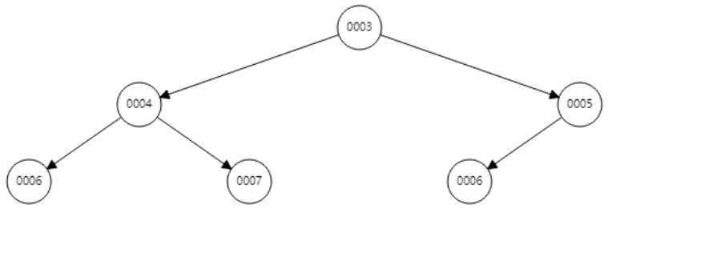
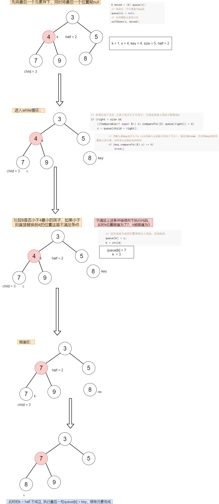
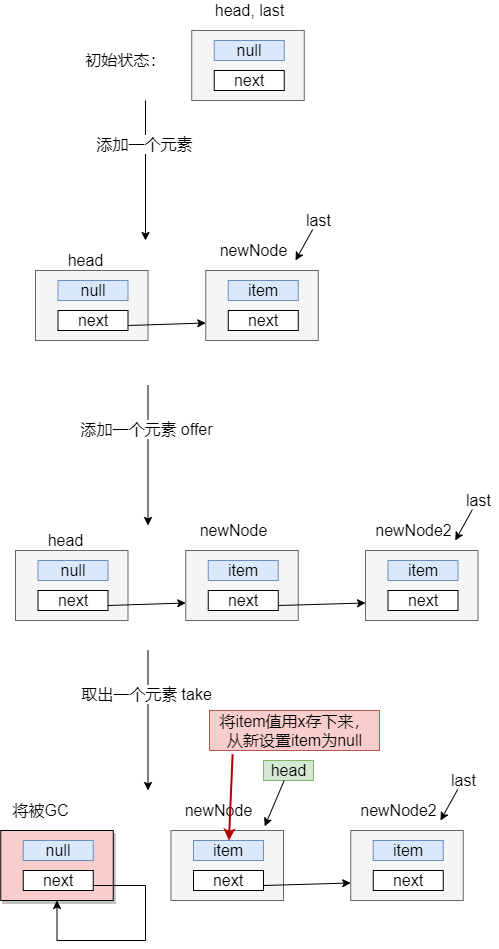
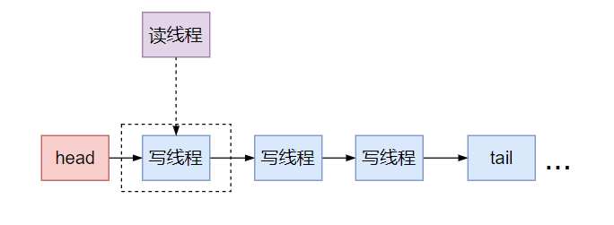
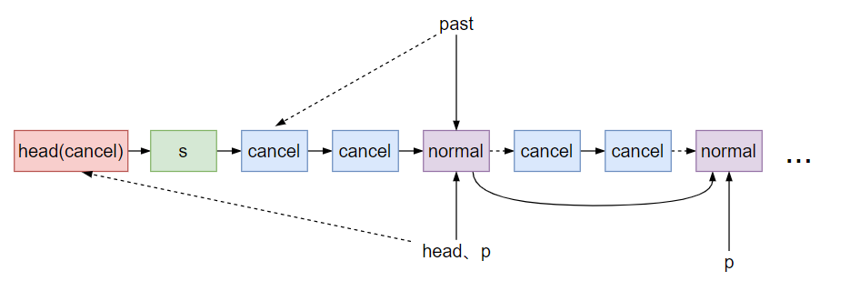
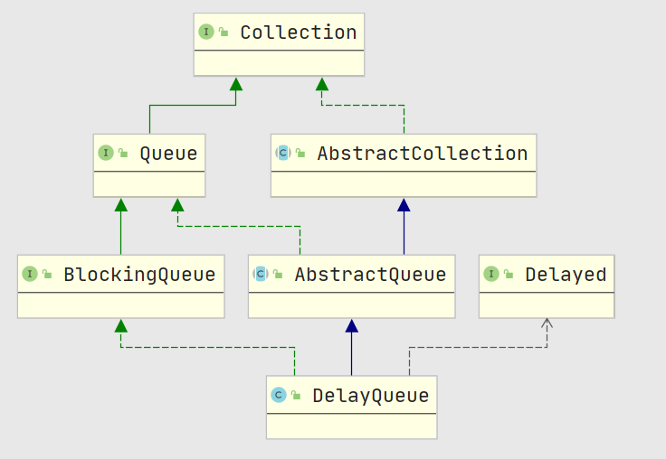
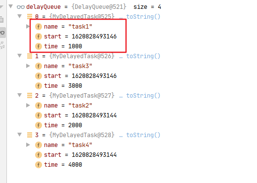
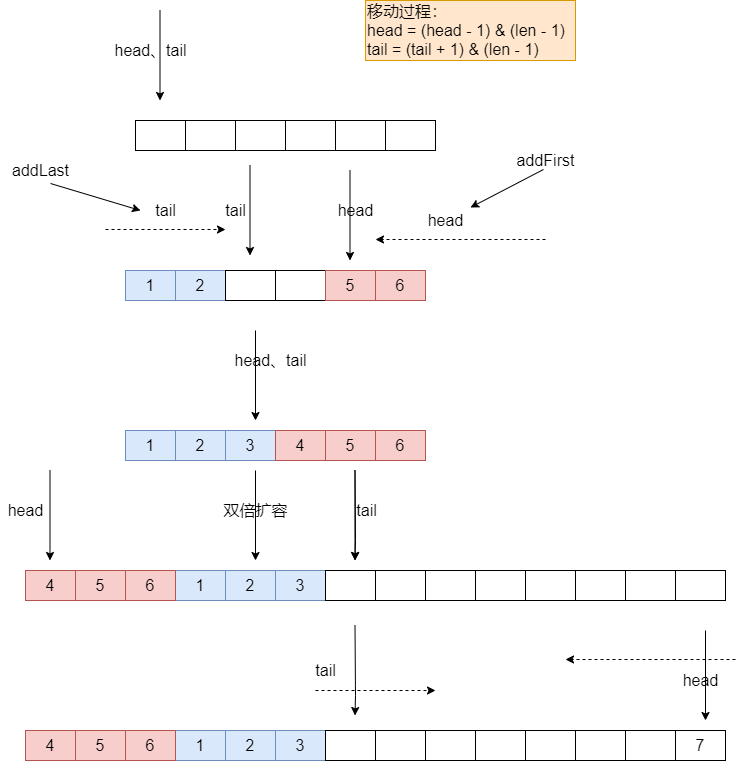

## Stack

> 后进先出的数据结构，继承Vector，线程安全，官方推荐使用功能更加完善的Deque来替换Stack

## Queue

推荐两篇 AQS 原理和相关源码分析的⽂章：

http://www.cnblogs.com/waterystone/p/4920797.html

https://www.cnblogs.com/chengxiao/archive/2017/07/24/7141160.html


|         | Throws exception | Retures special value |
| ------- | ---------------- | --------------------- |
| Insert  | add(e)           | offer(e)              |
| Remove  | remove()         | poll()                |
| Examine | element()        | peek()                |

### BlockingQueue

BlockingQueue实现类：




### Priority Queue

> 根据优先级对数据进行排列的数据结构

#### 基本介绍：

- 根据优先级来排列的队列，存储的对象一定要实现Comparable接口，否则将抛出异常
- 底层实际上也是通过`数组`来进行存储数据的， 空间不限
- 实现了Collection和Iterator接口，通过Iterator遍历数据时并不保证有序的，如果要有序输出，可以通过Arrays.sort(pq.toArray())
- 非同步，多个线程同时操作会发生并发异常，可以使用JUC中线程安全的PriorityBlockingQueue类
- 常用方法：
  - 时间复杂度 O(logN)的方法：offer、poll、remove、add， 
  - 线性时间方法：remove(object), contains(object)
  - 常数时间方法：peek、element、size
- 队列中的头元素优先级最小
- 使用堆来保证元素的有序性


#### **源码实现：**

- 采用数组，默认大小 DEFAULT_INITIAL_CAPACITY = 11
- 使用堆来保证数据的有序性，queue[0] 优先级最低，queue[n] 的两个孩子queue[2*n+1] and queue[2*(n+1)]

- 假设Comparable接口中实现的方法类似下面：

    ```java
    @Override
    public int compareTo(int o) {
    	return  this.x - o.x;
    }
    ```
    

这样我们的优先级队列中就采用`小顶堆`的数据结构来实现, 否则采用大顶堆
    

 下面**采用小顶堆的形式进行分析源码**

#### 对象初始化：

```java
// 无参构造： 默认大小11
public PriorityQueue() {
    this(DEFAULT_INITIAL_CAPACITY, null);
}

public PriorityQueue(int initialCapacity) {
    this(initialCapacity, null);
}

// 指定比较器
public PriorityQueue(Comparator<? super E> comparator) {
    this(DEFAULT_INITIAL_CAPACITY, comparator);
}
/**
有参构造方法：指定初始化大小，指定比较器
*/
public PriorityQueue(int initialCapacity,
                         Comparator<? super E> comparator) {
    if (initialCapacity < 1)
        throw new IllegalArgumentException();
    this.queue = new Object[initialCapacity];
    this.comparator = comparator;
}

// 传入一个集合来创建PriorityQueue， 如果c中实现了Comparator接口，则使用c中的Comparator
public PriorityQueue(Collection<? extends E> c) {
    if (c instanceof SortedSet<?>) {
        SortedSet<? extends E> ss = (SortedSet<? extends E>) c;
        this.comparator = (Comparator<? super E>) ss.comparator();
        initElementsFromCollection(ss);
    }
    else if (c instanceof PriorityQueue<?>) {
        PriorityQueue<? extends E> pq = (PriorityQueue<? extends E>) c;
        this.comparator = (Comparator<? super E>) pq.comparator();
        initFromPriorityQueue(pq);
    }
    else {
        this.comparator = null;
        // 通过c来初始化PriorityQueue
        initFromCollection(c);
    }
}

private void initFromPriorityQueue(PriorityQueue<? extends E> c) {
    // 如果c是由PriorityQueue实例化的，那么将c中的数据赋值给当前正在实例化的PriorityQueue
    if (c.getClass() == PriorityQueue.class) {
        this.queue = c.toArray();
        this.size = c.size();
    } else {
        initFromCollection(c);
    }
}
// 将一个Collection类型的数据初始化到当前正在创建的对象中
private void initElementsFromCollection(Collection<? extends E> c) {
    Object[] a = c.toArray();
    // If c.toArray incorrectly doesn't return Object[], copy it.
    if (a.getClass() != Object[].class)
        // copy a数组并转为 Object[]类型
        a = Arrays.copyOf(a, a.length, Object[].class);
    int len = a.length;
    // 如果a数组中含有null，那么抛出异常
    if (len == 1 || this.comparator != null)
        for (int i = 0; i < len; i++)
            if (a[i] == null)
                throw new NullPointerException();
    this.queue = a;
    this.size = a.length;
}

// 这个方法在调用initFromPriorityQueue()方法中执行，并构造一个标准的堆
private void heapify() {
    for (int i = (size >>> 1) - 1; i >= 0; i--)
        siftDown(i, (E) queue[i]);
}
```


#### 插入元素：

**动画演示：**


**新增元素：**

将元素插入最后一个位置后，此时的堆并没有满足父节点小于孩子节点规则，因此需要对堆进行相应的调整。



```java
// add 方法最终也是调用的offer
public boolean offer(E e) {
    if (e == null)
        throw new NullPointerException();
    modCount++;
    int i = size;
    // 如果待插入的位置已经超过的数组长度，则进行扩容
    if (i >= queue.length)
        grow(i + 1);
    size = i + 1;
    if (i == 0)
        queue[0] = e;
    else
        // 在位置i插入e
        siftUp(i, e);
    return true;
}
// 在k位置插入元素x后，进行上浮，判断是否满足小顶堆规则
private void siftUp(int k, E x) {
    if (comparator != null)
        siftUpUsingComparator(k, x);
    else
        siftUpComparable(k, x);
}


// PriorityQueue对象没有实现比较器的插入操作，使用待插入元素的比较器进行大小比较
private void siftUpComparable(int k, E x) {
    Comparable<? super E> key = (Comparable<? super E>) x;
    while (k > 0) {
        // 得到当前元素的父节点的位置，相当于(k - 1) / 2
        int parent = (k - 1) >>> 1;
        Object e = queue[parent];
        // 如果待插入的元素大于父节点，则说明不会破坏小顶堆的特性，直接将元素放在k位置即可
        if (key.compareTo((E) e) >= 0)
            break;
        // 待插入的元素小于父节点，将父节点放到k位置，循环向上找到x的合适位置
        queue[k] = e;
        k = parent;
    }
    queue[k] = key;
}

// PriorityQueue对象有比较器的插入操作, 类似上面的方法
private void siftUpUsingComparator(int k, E x) {
    while (k > 0) {
        int parent = (k - 1) >>> 1;
        Object e = queue[parent];
        if (comparator.compare(x, (E) e) >= 0)
            break;
        queue[k] = e;
        k = parent;
    }
    queue[k] = x;
}

private void siftDown(int k, E x) {
    if (comparator != null)
        siftDownUsingComparator(k, x);
    else
        siftDownComparable(k, x);
}
```

#### 移除元素：

这里展示移除元素4：




```java
// 移除堆顶的元素，同时调用siftDown来调整堆的结构
public E poll() {
     if (size == 0)
         return null;
     int s = --size;
     modCount++;
     E result = (E) queue[0];
     E x = (E) queue[s];
     queue[s] = null;
     if (s != 0)
         siftDown(0, x);
     return result;
 }

public boolean remove(Object o) {
    // 遍历数组找到需要remove的元素的位置
    int i = indexOf(o);
    if (i == -1)
        return false;
    else {
        removeAt(i);
        return true;
    }
}

private E removeAt(int i) {
    // assert i >= 0 && i < size;
    modCount++;
    int s = --size;
    // 如果移除的元素刚好是最后一个，直接移除即可
    if (s == i) // removed last element
        queue[i] = null;
    else {
        E moved = (E) queue[s];
        // 将最后一个位置置为null
        queue[s] = null;
        // 具体删除元素的方法，根据i位置的元素与moved比较，是否对moved下调（moved是放i位置，还是i的孩子位置）
        siftDown(i, moved);
        // 成立说明，moved刚好放到了i的位置
        if (queue[i] == moved) {
            // 判断是否对i位置的元素进行上浮操作
            siftUp(i, moved);
            // i位置的元素已经上浮
            if (queue[i] != moved)
                return moved;
        }
    }
    return null;
}

// 对元素进行下浮操作， 即k位置的元素被删除后，由x来代替i位置，对x进行下浮操作
private void siftDown(int k, E x) {
    if (comparator != null)
        siftDownUsingComparator(k, x);
    else
        siftDownComparable(k, x);
}

// k: 待删除的元素的位置， x: 数组最后一个位置的元素，最后要将x放到一个新的位置
private void siftDownComparable(int k, E x) {
    Comparable<? super E> key = (Comparable<? super E>)x;
    // 得到最后一个非叶子节点
    int half = size >>> 1;        // loop while a non-leaf
    // k 不能超过最后一个叶子节点的位置，如果超过，直接在相应位置填入key
    while (k < half) {
        // 得到待删除元素位置的左孩子位置
        int child = (k << 1) + 1; // assume left child is least
        // 得到左孩子的元素
        Object c = queue[child];
        // 右孩子位置
        int right = child + 1;
        // 如果右孩子存在 左孩子是否大于右孩子，目的是将最小的孩子赋值给c
        if (right < size &&
            ((Comparable<? super E>) c).compareTo((E) queue[right]) > 0)
            c = queue[child = right];
        // 判断元素key是否小于c（c为待插入元素最小的孩子节点），满足则break，直接将key放到待删除元素位置，这样肯定是满足堆的特性
        if (key.compareTo((E) c) <= 0)
            break;
        // 没有找到合适的位置继续向上查找，直到找到
        queue[k] = c;
        k = child;
    }
    queue[k] = key;
}

// 跟上面方法类似
@SuppressWarnings("unchecked")
private void siftDownUsingComparator(int k, E x) {
    int half = size >>> 1;
    while (k < half) {
        int child = (k << 1) + 1;
        Object c = queue[child];
        int right = child + 1;
        if (right < size &&
            comparator.compare((E) c, (E) queue[right]) > 0)
            c = queue[child = right];
        if (comparator.compare(x, (E) c) <= 0)
            break;
        queue[k] = c;
        k = child;
    }
    queue[k] = x;
}
```


#### 扩容操作：

```java
// 在插入元素时，offer方法调用： minCapacity = oldCapacity + 1
private void grow(int minCapacity) {
    int oldCapacity = queue.length;
    // Double size if small; else grow by 50%
    // 如果oldCapacity < 64 那么扩容原来的二倍 + 2，
    // 否则扩容为原来的1.5倍， 
    // 这里说明空间小的时候扩容较快
    int newCapacity = oldCapacity + ((oldCapacity < 64) ?
                                     (oldCapacity + 2) :
                                     (oldCapacity >> 1));
    // overflow-conscious code
    // 如果计算出的扩容长度超过了默认的最大值，那么调用hugeCapacity来判断是扩容到Integer.MAX_VALUE，还是MAX_ARRAY_SIZE
    if (newCapacity - MAX_ARRAY_SIZE > 0)
        newCapacity = hugeCapacity(minCapacity);
    // 将原来的数据copy到长度为newCapacity的新数组中
    queue = Arrays.copyOf(queue, newCapacity);
}

private static int hugeCapacity(int minCapacity) {
    if (minCapacity < 0) // overflow
        throw new OutOfMemoryError();
    return (minCapacity > MAX_ARRAY_SIZE) ?
        Integer.MAX_VALUE :
    MAX_ARRAY_SIZE;
}
```

### PriorityBlockingQueue

- 算法思路跟PriorityQueue一样

- 使用Reetrantlock来阻塞线程


### LinkedBlockingQueue

- 基于链表实现的阻塞队列，默认长度Integer.MAX_VALUE， head 不持有真实元素。

- 内部使用两个锁(takeLock、putLock)， 两个条件队列(notEmpty, notFull), **读写可以同时进行**，而使用数组实现的队列(如ArrayBlockingQueue)读写不能同时进行,  这是因为数组实现的队列空间长度固定，会在[0, capacity] 内循环读写，而链表只需要访问**头、尾指针**，灵活性更强

- 吞吐量通常比基于数组实现的高

  

插入元素大致逻辑：




#### 成员变量

```java
// 存储节点的信息
static class Node<E> {
        E item;
        Node<E> next;
        Node(E x) { item = x; }
}
//  存储元素的空间大小，默认Integer.MAX_VALUE
private final int capacity;

// 当前队列元素的个数, 使用CAS来保证并发安全
private final AtomicInteger count = new AtomicInteger();

// 头结点，不变量：head.item = null
transient Node<E> head;

// 尾结点， 不变量：last.next = null
private transient Node<E> last;

// 获取元素 需要的锁
private final ReentrantLock takeLock = new ReentrantLock();

// 获取元素时， 当没有获取到资源时就会将线程放入该队列
private final Condition notEmpty = takeLock.newCondition();

// 添加元素 需要的锁
private final ReentrantLock putLock = new ReentrantLock();

// 添加元素时， 当队列元素已经满了，线程将会进入notFull等待队列
private final Condition notFull = putLock.newCondition();

// 构造方法
public LinkedBlockingQueue(int capacity) {
    if (capacity <= 0) throw new IllegalArgumentException();
    this.capacity = capacity;
    last = head = new Node<E>(null);
}
```


#### offer() :

不返回异常

```java
public boolean offer(E e) {
    if (e == null) throw new NullPointerException();
    final AtomicInteger count = this.count;
    // 当前链表长度是否已经达到最大
    if (count.get() == capacity)
        return false;
    int c = -1;
    // 为新元素创建Node节点
    Node<E> node = new Node<E>(e);
    // 获取添加元素的重入锁
    final ReentrantLock putLock = this.putLock;
    putLock.lock();
    try {
        // 链表未满
        if (count.get() < capacity) {
            // 添加节点到链表尾部
            enqueue(node);
            // 返回的是旧值
            c = count.getAndIncrement();
            // 判断此时是否达到链表最大长度
            if (c + 1 < capacity)
                // 唤醒等待添加元素的等待队列
                notFull.signal();
        }
    } finally {
        putLock.unlock();
    }
    if (c == 0)
        // >= 0, 说明有元素，唤醒notEmpty等待队列的线程
        signalNotEmpty();
    return c >= 0;
}

private void enqueue(Node<E> node) {
    // assert putLock.isHeldByCurrentThread();
    // assert last.next == null;
    last = last.next = node;
}


```


#### take():

从队列中获取元素，获取不到，将`阻塞`

```java
public E take() throws InterruptedException {
    E x;
    int c = -1;
   
    final AtomicInteger count = this.count;
    // 获取元素的锁
    final ReentrantLock takeLock = this.takeLock;
    // 获取可响应中断的锁
    takeLock.lockInterruptibly();
    try {
        // 如果没有元素，则当前线程添加到notEmpty条件队列
        while (count.get() == 0) {
            notEmpty.await();
        }
        // 获取链表中的第一个元素，即head后面一个
        x = dequeue();
        c = count.getAndDecrement();
        if (c > 1)
            // c > 1 说明链表中有元素，唤醒notEmpty条件队列中的其他线程读取数据
            notEmpty.signal();
    } finally {
        takeLock.unlock();
    }
    // 由于此时取了一个元素，因此相等说明还有一个位置可以存元素，唤醒put操作的等待线程
    if (c == capacity)
        signalNotFull();
    return x;
}

private E dequeue() {
    // assert takeLock.isHeldByCurrentThread();
    // assert head.item == null;
    Node<E> h = head;
    Node<E> first = h.next;
    h.next = h; // help GC
    head = first;
    E x = first.item;
    first.item = null;
    return x;
}
```


#### poll:

等待指定时间，如果没有元素直接返回null

```java
public E poll(long timeout, TimeUnit unit) throws InterruptedException {
    E x = null;
    int c = -1;
    long nanos = unit.toNanos(timeout);
    final AtomicInteger count = this.count;
    final ReentrantLock takeLock = this.takeLock;
    takeLock.lockInterruptibly();
    try {
        while (count.get() == 0) {
            if (nanos <= 0)
                return null;
            // 等待一定时间
            nanos = notEmpty.awaitNanos(nanos);
        }
        x = dequeue();
        c = count.getAndDecrement();
        if (c > 1)
            notEmpty.signal();
    } finally {
        takeLock.unlock();
    }
    if (c == capacity)
        signalNotFull();
    return x;
}

```


#### peek:

返回链表第一个元素，即head后一个

不存在直接返回null

```java
public E peek() {
    if (count.get() == 0)
        return null;
    final ReentrantLock takeLock = this.takeLock;
    takeLock.lock();
    try {
        Node<E> first = head.next;
        if (first == null)
            return null;
        else
            return first.item;
    } finally {
        takeLock.unlock();
    }
}
```


#### remove

`fullyLock加锁， 此次不允许添加，取出元素`

```java
public boolean remove(Object o) {
    if (o == null) return false;
    fullyLock();
    try {
        // trail 用来记录 p前一个节点
        for (Node<E> trail = head, p = trail.next;
             p != null;
             trail = p, p = p.next) {
            // 如果找到待删除元素
            if (o.equals(p.item)) {
                unlink(p, trail);
                return true;
            }
        }
        return false;
    } finally {
        fullyUnlock();
    }
}
// 删除p节点，同时将p前驱trail 和 p.next 连接
void unlink(Node<E> p, Node<E> trail) {
    // assert isFullyLocked();
    // p.next is not changed, to allow iterators that are
    // traversing p to maintain their weak-consistency guarantee.
    p.item = null;
    trail.next = p.next;
    if (last == p)
        last = trail;
    if (count.getAndDecrement() == capacity)
        notFull.signal();
}

void fullyLock() {
    putLock.lock();
    takeLock.lock();
}

/**
     * Unlocks to allow both puts and takes.
     */
void fullyUnlock() {
    takeLock.unlock();
    putLock.unlock();
}
```


#### Itr

> 弱一致性，只要hasNext为true，就可以返回一个正常的元素,即时该元素已经被消费掉了

```java
private class Itr implements Iterator<E> {

	// 基于弱一致性的迭代器
    // 记录当前遍历到的节点
    private Node<E> current;
    // 记录current前一个节点
    private Node<E> lastRet;
    // 记录当前遍历的节点元素值
    private E currentElement;

    Itr() {
        fullyLock(); // 获取take，put 锁
        try {
            // 保存初始节点，因此迭代器在初始化后，即时队列已经空了，next依然可以获取第一个元素
            current = head.next; 
            if (current != null)
                currentElement = current.item;
        } finally {
            fullyUnlock();
        }
    }

    public boolean hasNext() {
        return current != null;
    }

   
    private Node<E> nextNode(Node<E> p) {
        for (;;) {
            Node<E> s = p.next;
            // 表示在fullyLock成功之前，最初的头节点已经被消费
            if (s == p)
                return head.next;
            // s == null : 可能遍历到最后一个
            // s.item != null: 正常元素
            if (s == null || s.item != null)
                return s;
            // 说明s != p, 且s != null && s.item == null，
            // fullyLock之前头结点被消费，可能由于指令重排序的影响，导致指针节点还没有指向自己，以至于上面 s == p 返回false
            p = s;
        }
    }

    public E next() {
        fullyLock();
        try {
            if (current == null)
                throw new NoSuchElementException();
            // 记录当前元素值
            E x = currentElement;
            // 将当前元素赋给lastRet
            lastRet = current;
            // current移动到下一位置
            current = nextNode(current);
            // currentElement重新赋值
            currentElement = (current == null) ? null : current.item;
            return x;
        } finally {
            fullyUnlock();
        }
    }
	// 移除lastRet元素
    public void remove() {
        if (lastRet == null)
            throw new IllegalStateException();
        fullyLock();
        try {
            // 记录lastRet
            Node<E> node = lastRet;
            lastRet = null;
            for (Node<E> trail = head, p = trail.next;
                 p != null;
                 trail = p, p = p.next) {
                // 找到了待移除的元素
                if (p == node) {
                   // 取消p节点
                    unlink(p, trail);
                    break;
                }
            }
        } finally {
            fullyUnlock();
        }
    }
}
// 将p节点从链表中删除，让p的前驱trail指向p.next, 但是p的next不会重新赋null，保证了遍历过程正常执行
void unlink(Node<E> p, Node<E> trail) {
    // assert isFullyLocked();
    // p.next is not changed, to allow iterators that are
    // traversing p to maintain their weak-consistency guarantee.
    p.item = null;
    trail.next = p.next;
    if (last == p)
        last = trail;
    if (count.getAndDecrement() == capacity)
        notFull.signal();
}
```


#### LBQSpliterator

### ArrayBlockingQueue

- 基于数组实现了阻塞队列
- 必须指定空间大小，可以设置生产、消费线程等待顺序的公平性、默认非公平
- 默认非公平锁，公平锁将会降低吞吐量，但是可以避免饥饿
- 内部只有**一个锁**，两个条件队列(notEmpty, notFull)


#### 基本属性&方法：

```java
/** The queued items */
final Object[] items;

/** items index for next take, poll, peek or remove */
int takeIndex;

/** items index for next put, offer, or add */
int putIndex;

/** Number of elements in the queue */
int count;

/*
     * Concurrency control uses the classic two-condition algorithm
     * found in any textbook.
     */
/** 访问数据时的锁 */
final ReentrantLock lock;

/** Condition for waiting takes */
// 正在等待拿数据的条件队列
private final Condition notEmpty;

/** Condition for waiting puts */
// 正在等待添加数据的条件队列
private final Condition notFull;

// 使用迭代器时的共享状态
transient Itrs itrs = null;

// 索引-1 后的下标
final int dec(int i) {
    return ((i == 0) ? items.length : i) - 1;
}
// 返回某个位置的元素
final E itemAt(int i) {
    return (E) items[i];
}
```

#### offer()

```java
public boolean offer(E e) {
    checkNotNull(e);
    final ReentrantLock lock = this.lock;
    // 加锁
    lock.lock();
    try {
        // 判断队列元素是否已经满
        if (count == items.length)
            return false;
        else {
            // 向数组中添加元素
            enqueue(e);
            return true;
        }
    } finally {
        lock.unlock();
    }
}

private void enqueue(E x) {
    // assert lock.getHoldCount() == 1;
    // assert items[putIndex] == null;
    // 使用final不可变，防止意外修改， 提升效率
    final Object[] items = this.items;
    items[putIndex] = x;
    // 更新putIndex的值
    if (++putIndex == items.length)
        putIndex = 0;
    count++;
    // 唤醒准备添加数据的线程
    notEmpty.signal();
}
```


#### poll

```java
public E poll() {
    final ReentrantLock lock = this.lock;
    lock.lock();
    try {
        // 弹出元素
        return (count == 0) ? null : dequeue();
    } finally {
        lock.unlock();
    }
}

private E dequeue() {
    // assert lock.getHoldCount() == 1;
    // assert items[takeIndex] != null;
    final Object[] items = this.items;
    @SuppressWarnings("unchecked")
    E x = (E) items[takeIndex];
    // 将takeIndex位置的元素弹出，并置空
    items[takeIndex] = null;
    if (++takeIndex == items.length)
        takeIndex = 0;
    count--;
    if (itrs != null)
        itrs.elementDequeued();
    // 唤醒需要添加元素的线程
    notFull.signal();
    return x;
}
```


#### remove()

```java
public boolean remove(Object o) {
    if (o == null) return false;
    final Object[] items = this.items;
    final ReentrantLock lock = this.lock;
    lock.lock();
    try {
        if (count > 0) {
            final int putIndex = this.putIndex;
            int i = takeIndex;
            // 从takeIndex开始寻找是否有待删除的元素存在
            do {
                if (o.equals(items[i])) {
                    // 删除i位置的元素，同时需要将i-putIndex之间的元素前移
                    removeAt(i);
                    return true;
                }
                if (++i == items.length)
                    i = 0;
            } while (i != putIndex);
        }
        // 没有找到待删除元素
        return false;
    } finally {
        lock.unlock();
    }
}

void removeAt(final int removeIndex) {
    // assert lock.getHoldCount() == 1;
    // assert items[removeIndex] != null;
    // assert removeIndex >= 0 && removeIndex < items.length;
    final Object[] items = this.items;
    // 如果待删除元素刚好就是takeInde对应的元素
    if (removeIndex == takeIndex) {
        // removing front item; just advance
        items[takeIndex] = null;
        if (++takeIndex == items.length)
            takeIndex = 0;
        count--;
        if (itrs != null)
            itrs.elementDequeued();
    } else {
        // an "interior" remove

        // slide over all others up through putIndex.
        final int putIndex = this.putIndex;
        // 将putIndex前的元素都前移
        for (int i = removeIndex;;) {
            int next = i + 1;
            if (next == items.length)
                next = 0;
            if (next != putIndex) {
                items[i] = items[next];
                i = next;
            } else {
                // 将putIndex前一个位置设置（此时为i）为null
                items[i] = null;
                this.putIndex = i;
                break;
            }
        }
        count--;
        if (itrs != null)
            itrs.removedAt(removeIndex);
    }
    // 唤醒等待添加元素的线程
    notFull.signal();
}
```


#### put

```java
public void put(E e) throws InterruptedException {
    checkNotNull(e);
    final ReentrantLock lock = this.lock;
    lock.lockInterruptibly();
    try {
        while (count == items.length)
            notFull.await();
        enqueue(e);
    } finally {
        lock.unlock();
    }
}
```


### SynchronousQueue

同步队列，不带缓冲空间，当队列中为写线程时，需要等待读线程来消费数据。当队列为读线程时，需要等待写线程来生产数据，这里的 Synchronous 指的就是读线程和写线程需要同步，一个读线程匹配一个写线程。


#### Transfer

```java
abstract static class Transferer<E> {
    // 从方法名上大概就知道，这个方法用于转移元素，从生产者手上转到消费者手上
    // 也可以被动地，消费者调用这个方法来从生产者手上取元素
    
    // 第一个参数 e 如果不是 null，代表场景为：将元素从生产者转移给消费者
    // 如果是 null，代表消费者等待生产者提供元素，然后返回值就是相应的生产者提供的元素
    // 第二个参数代表是否设置超时，如果设置超时，超时时间是第三个参数的值
    // 返回值如果是 null，代表超时，或者中断。具体是哪个，可以通过检测中断状态得到。
    abstract E transfer(E e, boolean timed, long nanos);
}
```


根据公平策略来采取不同的实现，默认非公平，使用TransferStack	

```java
public SynchronousQueue(boolean fair) {
    transferer = fair ? new TransferQueue<E>() : new TransferStack<E>();
}
```


#### put、take

```java
// 写入值

// 非阻塞
public boolean offer(E e) {
    if (e == null) throw new NullPointerException();
    return transferer.transfer(e, true, 0) != null;
}

// 阻塞
public void put(E o) throws InterruptedException {
    if (o == null) throw new NullPointerException();
    if (transferer.transfer(o, false, 0) == null) { // 1
        Thread.interrupted();
        throw new InterruptedException();
    }
}

// 读取值并移除

// 非阻塞
public E poll() {
    return transferer.transfer(null, true, 0);
}

// 阻塞
public E take() throws InterruptedException {
    Object e = transferer.transfer(null, false, 0); // 2
    if (e != null)
        return (E)e;
    Thread.interrupted();
    throw new InterruptedException();
}
```

>  From javadoop

我们看到，写操作 put(E o) 和读操作 take() 都是调用 Transferer.transfer(…) 方法，区别在于第一个参数是否为 null 值。

我们来看看 transfer 的设计思路，其基本算法如下：

1. 当调用这个方法时，如果队列是空的，或者队列中的节点和当前的线程操作类型一致（如当前操作是 put 操作，而队列中的元素也都是写线程）。这种情况下，将当前线程加入到等待队列即可。
2. 如果队列中有等待节点，而且与当前操作可以匹配（如队列中都是读操作线程，当前线程是写操作线程，反之亦然）。这种情况下，匹配等待队列的队头，出队，返回相应数据。

其实这里有个隐含的条件被满足了，队列如果不为空，肯定都是同种类型的节点，要么都是读操作，要么都是写操作。这个就要看到底是读线程积压了，还是写线程积压了。

我们可以假设出一个男女配对的场景：一个男的过来，如果一个人都没有，那么他需要等待；如果发现有一堆男的在等待，那么他需要排到队列后面；如果发现是一堆女的在排队，那么他直接牵走队头的那个女的。


#### TransferQueue



公平模式下的实现，**FIFO**

> 文字的表述可能不太准确，不管是读还是写线程 下面所有的代码都是可能到达的，文中的举例是说的队列为阻塞的写线程， 队列哪种类型主要取决于**tail节点的类型**

##### **QNode结点**

> 用来保存等待队列中的线程

```java
static final class QNode {
            volatile QNode next;          // next node in queue
            volatile Object item;         // CAS'ed to or from null
            volatile Thread waiter;       // 当前线程
            final boolean isData;		// true: 写线程， false： 读

            QNode(Object item, boolean isData) {
                this.item = item;
                this.isData = isData;
            }
    .....
}
```


> 初始化时，head 为一个dummy结点

```java
transient volatile QNode head;
/** Tail of queue */
transient volatile QNode tail;
// 保存待删除节点的前驱节点
transient volatile QNode cleanMe;

TransferQueue() {
    QNode h = new QNode(null, false); // initialize to dummy node.
    head = h;
    tail = h;
}
```


##### **transfer**

- 当超时、中断后会调用tryCancel，该方法会将item设置为this对象

- 数据被读线程正常取走后，会将写节点的item 设置为 null

```java
/**
e != null: 写线程， e == null：读线程
timed： 是否超时
nanos：超时时间
*/
E transfer(E e, boolean timed, long nanos) {
    
    QNode s = null; // constructed/reused as needed
    boolean isData = (e != null); // 标记当前是读还是写线程

    for (;;) {
        QNode t = tail;
        QNode h = head;
        if (t == null || h == null)         // 指令重排序导致未初始化？不应该吧
            continue;                       // spin

        // 队列为空， 或者队列等待的线程跟当前为同一种类型
        if (h == t || t.isData == isData) { 
            QNode tn = t.next;
            if (t != tail)                  // inconsistent read
                continue;
            if (tn != null) {               // lagging tail
                advanceTail(t, tn);
                continue;
            }
            if (timed && nanos <= 0)        // can't wait
                return null;
            if (s == null)
                s = new QNode(e, isData);
            if (!t.casNext(null, s))        // 将当前节点添加到队列
                continue;
			// 作为尾节点          
            advanceTail(t, s);              // swing tail and wait
            Object x = awaitFulfill(s, e, timed, nanos);
            if (x == s) {                   // wait was cancelled, 中断、超时
                clean(t, s);    // 需要取消该节点
                return null;
            }

            // 写线程被正常唤醒后(x == null)，需要重新set head
            if (!s.isOffList()) {           // not already unlinked
                advanceHead(t, s);          // unlink if head
                if (x != null)              // and forget fields
                    // 读线程调用下面的!m.casItem(x, e) 后触发写线程中断、超时，导致awaitFulfill方法中tryCancel失败
                    s.item = s;		// 说明被中断唤醒，awaitFulfill方法中调用s.tryCancel()
                s.waiter = null;
            }
            return (x != null) ? (E)x : e;

        } else {                            // 读线程操作
            QNode m = h.next;               // node to fulfill
            if (t != tail || m == null || h != head)
                continue;                   // inconsistent read

            Object x = m.item;
            if (isData == (x != null) ||    // false： 说明可以消费
                x == m ||                   // m cancelled， awaitFufill中调用cancel，导致，x == this
                !m.casItem(x, e)) {         // 将QNode 的item设置为 null
                advanceHead(h, m);          // dequeue and retry， 重新set head
                // 这里结束后，由于head已经为当前读线程， 因此会调用上面的条件分支，从而阻塞到读队列
                continue;
            }
            // 这里说明可以正常消费数据
            advanceHead(h, m);              // successfully fulfilled
            LockSupport.unpark(m.waiter); // 唤醒后续节点
            return (x != null) ? (E)x : e;
        }
    }
}
```


##### **awaitFulfill**

> 自旋、阻塞写线程

```java
/**
* s: transfer() 方法中创建的QNode结点
*/
Object awaitFulfill(QNode s, E e, boolean timed, long nanos) {
    /* Same idea as TransferStack.awaitFulfill */
    final long deadline = timed ? System.nanoTime() + nanos : 0L;
    Thread w = Thread.currentThread();
    // 自旋次数
    int spins = ((head.next == s) ?
                 (timed ? maxTimedSpins : maxUntimedSpins) : 0);
    for (;;) {
        if (w.isInterrupted())
            s.tryCancel(e); // 线程被中断，将当前节点item设置为当前对象，表示已取消
        Object x = s.item; // 新建节点后，item为e
        if (x != e) // 该方法唯一返回位置，这里表示元素已被读线程取走，item已被设置为null(正常情况),this(中断设置),
            return x;
        if (timed) {
            nanos = deadline - System.nanoTime();
            if (nanos <= 0L) { // 已超时，取消节点
                s.tryCancel(e);
                continue;
            }
        }
        if (spins > 0)
            --spins;
        else if (s.waiter == null)
            s.waiter = w;
        else if (!timed)
            LockSupport.park(this);
        else if (nanos > spinForTimeoutThreshold)
            LockSupport.parkNanos(this, nanos);
    }
}

void tryCancel(Object cmp) {
    UNSAFE.compareAndSwapObject(this, itemOffset, cmp, this);
}
```


##### clean

由于中断、超时导致需要取消s节点，该方法只由transfer调用

>  删除节点方法：
>
> - 如果s节点不为tail节点，直接cas:  pre.next = s.next
>
> - 如果s节点为tail 节点，那么需要将前驱pred作为cleanMe，用来标记cleanMe的next 是需要清除的节点，这里没有直接将s节点移除主要是在多线程操作下，可能写线程先加入了节点到tail后，然后这里才准备删除tail，这样的话之前加入的节点就丢失了，同时由于新节点都是加在tail后，先用cleanMe记录下来，当tail后加入了新节点，此时中间的节点就几乎不会变动，很多不会有太多的安全问题了
>
>   - cleanMe为空，直接将pre作为cleanMe，返回即可
>   - 如果此时cleanMe已经被其他节点赋值，那么尝试先将cleanMe的next移除，然后再将pre作为cleanMe
>


```java
void clean(QNode pred, QNode s) {
            s.waiter = null; // forget thread
            /*
             * 在任何时候，都不能删除最后insert(tail)的节点，出于线程安全的考虑吧，因此这里使用了cleanMe来保存pred
             */
		    // 已经被取消，可能是读线程调用advanceHead
            while (pred.next == s) { // Return early if already unlinked
                QNode h = head;
                QNode hn = h.next;   // Absorb cancelled first node as head
                if (hn != null && hn.isCancelled()) {
                    advanceHead(h, hn);
                    continue;
                }
                QNode t = tail;      // Ensure consistent read for tail
                if (t == h)
                    return;
                QNode tn = t.next;
                if (t != tail)
                    continue;
                if (tn != null) {
                    advanceTail(t, tn);
                    continue;
                }
                if (s != t) {        // If not tail, try to unsplice
                    QNode sn = s.next;
                    if (sn == s || pred.casNext(s, sn))
                        return;
                }
                QNode dp = cleanMe;
                if (dp != null) {    // Try unlinking previous cancelled node
                    QNode d = dp.next;
                    QNode dn;
                    // 需要将更新cleanMe,
                    // 如队列：head --> dp(cleanMe) --> d --> dn --> tail
                    // 这种情况需要更新 dp.next = dn,d为需要删除的节点
                    if (d == null ||               // d is gone or
                        d == dp ||                 // d is off list or
                        !d.isCancelled() ||        // d not cancelled or
                        (d != t &&                 // d not tail and
                         (dn = d.next) != null &&  //   has successor
                         dn != d &&                //   that is on list
                         dp.casNext(d, dn)))       // d unspliced
                        casCleanMe(dp, null);
                    if (dp == pred) // cleanMe 节点依然保存的是pred 节点
                        return;      // s is already saved node
                } else if (casCleanMe(null, pred))
                    return;          // Postpone cleaning s
            }
}
```


#### TransferStack

> 非公平模式下的实现，LILO

##### 基本属性

```java
// 读请求
static final int REQUEST    = 0;
// 写请求
static final int DATA       = 1;
/** Node is fulfilling another unfulfilled DATA or REQUEST */
// 节点正在执行另一个未完成的写或读
static final int FULFILLING = 2;
// 记录栈顶元素
volatile SNode head;

// true: 表示数据以及被读取
static boolean isFulfilling(int m) { return (m & FULFILLING) != 0; }
static final class SNode {
    volatile SNode next;        // 指向下一个栈， top1[栈顶] ---> top2
    // 存放匹配到的节点，如果中断、超时出发tryCancel，那么match 设置为this
    volatile SNode match;       // the node matched to this
    // awaitFulfill方法才会设置为当前线程，匹配到节点后tryMatch会设置其为null
    volatile Thread waiter;     // to control park/unpark
    Object item;                // data; or null for REQUESTs
    int mode;	// 当前节点的请求模式，读或写

    SNode(Object item) {
        this.item = item;
    }

    boolean casNext(SNode cmp, SNode val) {
        return cmp == next &&
            UNSAFE.compareAndSwapObject(this, nextOffset, cmp, val);
    }
	// 已经匹配到相应的节点，如读匹配到写的节点，那么当前节点为读，s为写
    boolean tryMatch(SNode s) {
        if (match == null &&
            // 修改match字段为匹配到的线程节点
            UNSAFE.compareAndSwapObject(this, matchOffset, null, s)) {
            Thread w = waiter;
            if (w != null) {    // waiters need at most one unpark
                waiter = null;
                LockSupport.unpark(w);
            }
            return true;
        }
        return match == s; // 是否匹配
    }
}
```


##### transfer

```java
E transfer(E e, boolean timed, long nanos) {
    SNode s = null; // constructed/reused as needed
    int mode = (e == null) ? REQUEST : DATA; // 记录当前是读还是写
    for (;;) {
        SNode h = head;
        // 如果栈为空，或者当前模式跟栈顶元素模式相同
        if (h == null || h.mode == mode) {  // empty or same-mode
            if (timed && nanos <= 0) {      // can't wait
                if (h != null && h.isCancelled())
                    // 超时导致元素被取消，重置栈顶
                    casHead(h, h.next);     // pop cancelled node
                else
                    return null;
            } 
            // 新建节点，将其作为栈顶元素(head)
            else if (casHead(h, s = snode(s, e, h, mode))) {
                // 等待节点完成本次操作， 即： 读等待匹配写，写等待匹配读
                // s.match != null才会返回，返回s.match, 正常情况下，match会写入匹配到的SNode对象，中断、超时直接写入this
                SNode m = awaitFulfill(s, timed, nanos);
                if (m == s) {               // wait was cancelled
                    clean(s); // 中断、超时，导致节点取消
                    return null;
                }
                // 正常被唤醒后，栈顶将会添加一个匹配的节点，那么此时直接重新set head 为s.next, 栈顶两个元素是相互匹配的
                if ((h = head) != null && h.next == s)
                    casHead(h, s.next);     // help s's fulfiller
                // 正常返回不为null，否则调用方法将检查是否中断
                return (E) ((mode == REQUEST) ? m.item : s.item);
            }
        } 
        // isFulfilling：m & FULFILLING) != 0, 读、写线程首次都会判断为false
        // 由于创建节点mode = FULFILLING|mode, 因此第二次都会true，走下一个分支
        else if (!isFulfilling(h.mode)) {   // try to fulfill
            if (h.isCancelled())            // already cancelled
                casHead(h, h.next);         // pop and retry
            else if (casHead(h, s=snode(s, e, h, FULFILLING|mode))) {
                for (;;) { // loop until matched or waiters disappear
                    SNode m = s.next;       // m is s's match
                    if (m == null) {        // all waiters are gone
                        // 栈中除了当前节点，没有其他节点了，将head置位null，从第一个if中重新创建节点，进行阻塞
                        casHead(s, null);   // pop fulfill node
                        s = null;           // use new node next time
                        break;              // restart main loop
                    }
                    SNode mn = m.next;
                    if (m.tryMatch(s)) { // 尝试s与m节点匹配，m的match置位s，唤醒s节点
                        casHead(s, mn);     // pop both s and m
                        return (E) ((mode == REQUEST) ? m.item : s.item);
                    } else // 当两个线程同时调用match，其中一个cas失败  // lost match
                        s.casNext(m, mn);   // help unlink
                }
            }
        } 
        // 由于竞争，导致节点在上面分支中match 失败， 会在这里继续match
        else {                            // help a fulfiller
            SNode m = h.next;               // m is h's match
            if (m == null)                  // waiter is gone
                casHead(h, null);           // pop fulfilling node
            else {
                SNode mn = m.next;
                if (m.tryMatch(h))          // help match
                    casHead(h, mn);         // pop both h and m
                else     // 竞争导致m被其他节点匹配          // lost match
                    h.casNext(m, mn);       // help unlink
            }
        }
    }
}
```


##### awaitFulfill

```java
SNode awaitFulfill(SNode s, boolean timed, long nanos) {
    /* 翻译注释：
    	当节点即将被阻塞时，会将其waiter设置为当前线程，用于匹配的线程通知该线程唤醒
    	当节点是head时，首先会自旋，避免消费者/生成者短时间匹配节点造成的线程唤醒
    	主逻辑中，中断优于普通的判断，普通的判断优于超时
    */
    final long deadline = timed ? System.nanoTime() + nanos : 0L;
    Thread w = Thread.currentThread();
    int spins = (shouldSpin(s) ?
                 (timed ? maxTimedSpins : maxUntimedSpins) : 0);
    for (;;) {
        if (w.isInterrupted())
            s.tryCancel();
        SNode m = s.match;
        if (m != null)
            return m;
        if (timed) {
            nanos = deadline - System.nanoTime();
            if (nanos <= 0L) {
                s.tryCancel();
                continue;
            }
        }
        if (spins > 0)
            spins = shouldSpin(s) ? (spins-1) : 0;
        else if (s.waiter == null)
            s.waiter = w; // establish waiter so can park next iter
        else if (!timed)
            LockSupport.park(this);
        else if (nanos > spinForTimeoutThreshold)
            LockSupport.parkNanos(this, nanos);
    }
}

/**
         * Returns true if node s is at head or there is an active
         * fulfiller.
         */
// 是否自旋，通常只需要栈顶元素(head)自旋， 减少阻塞唤醒的时间开销
boolean shouldSpin(SNode s) {
    SNode h = head;
    return (h == s || h == null || isFulfilling(h.mode));
}
```


##### clean



```java
void clean(SNode s) {
    s.item = null;   // forget item
    s.waiter = null; // forget thread

 	// 使用past 记录s节点后面的正常节点
    SNode past = s.next;
    if (past != null && past.isCancelled())
        past = past.next;

    // 从head(head ->...--> past)开始检查取消的节点，更新head
    // Absorb cancelled nodes at head
    SNode p;  // p最终为head
    while ((p = head) != null && p != past && p.isCancelled())
        casHead(p, p.next);
	
    // 将p----past 之间的取消的节点断开
    // Unsplice embedded nodes
    while (p != null && p != past) {
        SNode n = p.next;
        if (n != null && n.isCancelled())
            p.casNext(n, n.next);
        else
            p = n;
    }
}
```


### DelayQueue

#### 介绍

继承关系如下：



> DelayQueue是一个支持延时获取元素的无界阻塞队列。队列使用PriorityQueue来实现，关于PriorityQueue的方法见另一篇文章介绍，队列中的元素必须实现Delayed接口，实现getDelay方法，该方法返回指定的延迟时间，即该元素存活多久后可以从队列中提取元素

举个例子：

```java
// 参考最下的链接
public class DelayQueueTest1 {

    private static DelayQueue delayQueue  = new DelayQueue();

    public static void main(String[] args) throws InterruptedException {
		// 往延时队列中添加多个任务
        new Thread(new Runnable() {
            @Override
            public void run() {
                delayQueue.offer(new MyDelayedTask("task4",4000));
                delayQueue.offer(new MyDelayedTask("task2",2000));
                delayQueue.offer(new MyDelayedTask("task1",1000));
                delayQueue.offer(new MyDelayedTask("task3",3000));
            }
        }).start();
		// 循环去队列取元素，只有当队列中的元素延迟时间结束后才能取出元素，否则将阻塞
        while (true) {
            Delayed take = delayQueue.take();
            System.out.println(take);
        }
    }
}

/**
 *  compareTo 方法必须提供与 getDelay 方法一致的排序
 */
class MyDelayedTask implements Delayed{

    private String name ;
    private long start = System.currentTimeMillis();
    private long time ;

    public MyDelayedTask(String name,long time) {
        this.name = name;
        this.time = time;
    }

    /**
     * 需要实现的接口，获得延迟时间   用过期时间-当前时间
     * @param unit
     * @return
     */
    @Override
    public long getDelay(TimeUnit unit) {
        return unit.convert((start+time) - System.currentTimeMillis(),TimeUnit.MILLISECONDS);
    }

    /**
     * 用于延迟队列内部比较排序   当前时间的延迟时间 - 比较对象的延迟时间
     * 指定优先级队列中的排序方法，这里是按照等待时间从小到大排序，即先取出等待时间小的元素
     * @param o
     * @return
     */
    @Override
    public int compareTo(Delayed o) {
        MyDelayedTask o1 = (MyDelayedTask) o;
        return (int) (this.getDelay(TimeUnit.MILLISECONDS) - o.getDelay(TimeUnit.MILLISECONDS));
    }

    @Override
    public String toString() {
        return "MyDelayedTask{" +
                "name='" + name + '\'' +
                ", time=" + time +
                '}';
    }
}
```

调试结果如下：



可以看出延迟时间最小的元素在第一个位置，满足`小顶堆`的排序规则


延迟队列在日常工作中也十分常见，比如：

- 缓存系统的设计：可以用DelayQueue保存缓存元素的有效期，使用一个线程循环查询DelayQueue，如果从DelayQueue获取到元素，说明该元素已经到期了
- 定时任务调度：使用DelayQueue保存当天执行的任务和执行时间，一旦从DelayQueue中获取到任务就开始执行，比如TimerQueue就是使用DelayQueue实现。


下面对核心代码进行解读

#### 基本属性

```java
private final transient ReentrantLock lock = new ReentrantLock();
// 优先级队列， 使用堆排序，插入的每个任务放在这个队列中
private final PriorityQueue<E> q = new PriorityQueue<E>();

// 指定等待队列头部的线程(并不一定是AQS等待队列第一个，这里只是标记一个线程作为leader而已).
// 这作为Leader-Follower模式的一种变体用于最小化不必要的超时等待(指使用带参数的park)。当一个线程变为leader后，他仅仅等待下一次延时的过期，而此时其他线程则会无限等待(无参的park)。在从take() or poll() 方法返回前必须唤醒其他线程，除非其他线程成为了leader(见offer(e)方法，可能会修改leader，同时调用signal)。每当队列的head被一个更早过期的元素替换时，这个leader就会被置位null而无效(就是offer(e)方法)，一些等待线程将会被唤醒，并不一定是当前线程。 因此等待线程在等待期间必须做好准备获取以及丢失leader的准备
private Thread leader = null;

// 线程没有获取到元素，那么就将线程放入该等待队列中
private final Condition available = lock.newCondition();
// 构造
public DelayQueue() {}
```

#### 插入元素(offer)

```java
public boolean offer(E e) {
    final ReentrantLock lock = this.lock;
    lock.lock();
    try {
        // 往优先级队列中添加元素
        q.offer(e);
        // 如果新添加的元素是延迟时间最短的，那么唤醒等待队列中的线程，重新获取当前元素
        if (q.peek() == e) {
            leader = null;
            available.signal();
        }
        return true;
    } finally {
        lock.unlock();
    }
}
```


#### 获取元素(take)

>  当延迟时间最短的元素时间等待时间结束后才返回， 如果一直没有获取到元素，线程会一直阻塞，直到被中断

```java
public E take() throws InterruptedException {
    final ReentrantLock lock = this.lock;
    // 获取一个可中断的锁
    lock.lockInterruptibly();
    try {
        for (;;) {
            E first = q.peek();
            // 成立： 延迟队列中没有元素存放
            if (first == null)
                // 阻塞当前线程
                available.await();
            else {
                // 获取当前元素的延迟时间
                long delay = first.getDelay(NANOSECONDS);
                // 成立： 时间已到期
                if (delay <= 0)
                    // 弹出元素，先要执行finally中代码
                    return q.poll();
                first = null; // don't retain ref while waiting
                // 已经存在leader线程
                if (leader != null)
                    available.await();
                else {
                    // 线程首次调用take时会执行该处
                    Thread thisThread = Thread.currentThread();
                    leader = thisThread;
                    try {
                        // 阻塞当前元素的延迟时间
                        available.awaitNanos(delay);
                    } finally {
                        if (leader == thisThread)
                            // 赋null，让其他线程获取leader
                            leader = null;
                    }
                }
            }
        }
    } finally {
        // 没有线程持有leader 并且有任务队列中， 那么唤醒等待队列中的线程
        if (leader == null && q.peek() != null)
            available.signal();
        lock.unlock();
    }
}
```


#### 弹出元素(poll)

> 如果元素的等待时间还没有到，那么直接返回null

```java
public E poll() {
    final ReentrantLock lock = this.lock;
    lock.lock();
    try {
        // 从优先级队列中获取堆顶元素
        E first = q.peek();
        // 如果堆顶元素是null， 或则延迟时间还没有结束，那么返回null
        if (first == null || first.getDelay(NANOSECONDS) > 0)
            return null;
        else
            return q.poll();
    } finally {
        lock.unlock();
    }
}
```


#### 超时弹出元素

> 指定等待时间，如果在指定时间内还没有获取到一个过期的元素，那么直接返回null

```java
public E poll(long timeout, TimeUnit unit) throws InterruptedException {
    // 计算当前需要等待时间
    long nanos = unit.toNanos(timeout);
    final ReentrantLock lock = this.lock;
    lock.lockInterruptibly();
    try {
        for (;;) {
            E first = q.peek();
            // PriorityQueue中没有元素
            if (first == null) {
                // 等待时间已经到，返回null
                if (nanos <= 0)
                    return null;
                else
                    // 等待指定时间
                    nanos = available.awaitNanos(nanos);
            } else { // 当first不为null时
                // 获取first所需的时间
                long delay = first.getDelay(NANOSECONDS);
                // 时间到了，直接返回
                if (delay <= 0)
                    return q.poll();
                
                if (nanos <= 0)
                    return null;
                first = null; // don't retain ref while waiting
                // 先等待naos 时间
                if (nanos < delay || leader != null)
                    nanos = available.awaitNanos(nanos);
                else {
                    // 第一次需要设置当前线程为leader
                    Thread thisThread = Thread.currentThread();
                    leader = thisThread;
                    try {
                        long timeLeft = available.awaitNanos(delay);
                        nanos -= delay - timeLeft;
                    } finally {
                        if (leader == thisThread)
                            leader = null;
                    }
                }
            }
        }
    } finally {
        if (leader == null && q.peek() != null)
            available.signal();
        lock.unlock();
    }
}
```


#### 总结

该队列采用类似Leader-Follower线程模型

DelayQueue中采用的Leader-Follower模型主要流程如下：

from https://blog.csdn.net/xjk201/article/details/121751029

> 假设饭店不分角色，都是员工，但是改变了经营策略，每个客人必须预约吃饭时间，预约采用APP预约。因为加入了延时，逻辑变得复杂了一些。
>
> 1. 每次还是只能有一个员工在门口等待，比如A先在门口等待，A看了眼预约登记表，发现离预约最早到店的时间还有30分钟，A就什么都不干了，先休息30分钟。(**await指定时间**， A为leader)
> 2. 其他员工还是先在屋里歇着(**一直await**，等待唤醒)，但是因为采用APP预约，客人约几点都有可能，如果此时有客人约的是10分钟后到店，因为A要30分钟后才能醒来干活，所以如果这位客人来了，门口就没有人接待了。
> 3. 对于这个问题，饭店的软件系统在监听到最早到店时间变了的话，会再叫一个员工来门口等待，此员工可能是新员工B，也可能是叫醒了之前在门口休息的员工A（**offer入队**的时候会判断当前元素是不是堆顶的元素，如果是则重置leader，唤醒其他等待线程，只唤醒一个即可）。我们叫这位新员工X  (被唤醒后的线程)。
>    如果新员工X发现最早到店时间是现在，或者客人已经来了，就会叫一个员工C来门口接替自己（**take方法中finally中**，唤醒条件队列的线程），并立即开始为客人提供全流程服务（直接return 相应的结果）。
>    - 如果新员工X发现最早到店时间是10分钟后，新员工X就像A之前一样，什么都不干了，先休息10分钟。
>    - 如果最早到店时间没有变化，还是30分钟后，软件系统不会叫人，其他员工看到A在门口等待，自己可以安心的在屋里歇着（**leader被其他线程占有**），等着A叫人替换他。
> 4. 员工A在30分钟后醒来，客人也到了，A会叫一个同事比如B接替自己，而A为客人提供全流程服务。


参考链接：

https://www.cnblogs.com/myseries/p/10944211.html

https://blog.csdn.net/xjk201/article/details/121751029


## Deque

方法：

|         | First Element （head） |               | Last Element(Tail) |               |
| ------- | ---------------------- | ------------- | ------------------ | ------------- |
|         | throws exception       | special value | throws exception   | special value |
| Insert  | addFirst(e)            | offerFirst(e) | addLast(e)         | offerLast(e)  |
| Remove  | removeFirst()          | pollFirst()   | removeLast()       | pollLast()    |
| Examine | getFirst()             | peekFirst()   | getLast()          | peekLast()    |


### ArrayDeque

> 底层使用的数组实现： transient Object[] elements 默认初始化16
>
> 有一个头指针：transient int head;
>
> 有一个尾指针：transient int tail;

- 最开始head、tail都为0，当add时，head从elements.length 依次递减，tail从0开始递增
- 如果head == tail时，进行双倍扩容

**大致流程：**



#### add：

```java
public void addFirst(E e) {
    if (e == null)
        throw new NullPointerException();
    // 计算出下标，head默认依次为15,14,13...
    elements[head = (head - 1) & (elements.length - 1)] = e;
    if (head == tail)
        doubleCapacity();
}

public void addLast(E e) {
    if (e == null)
        throw new NullPointerException();
    // tail: 0,1,2,3
    elements[tail] = e;
    if ( (tail = (tail + 1) & (elements.length - 1)) == head)
        doubleCapacity();
}
```

#### poll：

```java
public E pollFirst() {
    int h = head;
    @SuppressWarnings("unchecked")
    E result = (E) elements[h];
    // Element is null if deque empty
    if (result == null)
        return null;
    elements[h] = null;     // Must null out slot
    head = (h + 1) & (elements.length - 1);
    return result;
}

public E pollLast() {
    // 由于addLast时添加的元素位置是tail - 1，因此去t位置的元素
    int t = (tail - 1) & (elements.length - 1);
    @SuppressWarnings("unchecked")
    E result = (E) elements[t];
    if (result == null)
        return null;
    elements[t] = null;
    tail = t;
    return result;
}
```


#### 扩容：

```java
private void doubleCapacity() {
    // 断言判断head是否等于tail，只有相等的时候才进行扩容
    assert head == tail;
    int p = head;
    int n = elements.length;
    // head位置右边的元素数量包含head位置元素
    int r = n - p; // number of elements to the right of p
    // 双倍扩容
    int newCapacity = n << 1;
    if (newCapacity < 0)
        throw new IllegalStateException("Sorry, deque too big");
    Object[] a = new Object[newCapacity];
    // 复制元素操作
    System.arraycopy(elements, p, a, 0, r);
    System.arraycopy(elements, 0, a, r, p);
    elements = a;
    head = 0;
    tail = n;
}
```