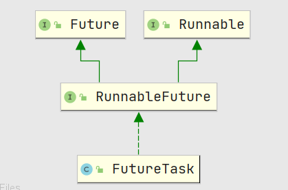
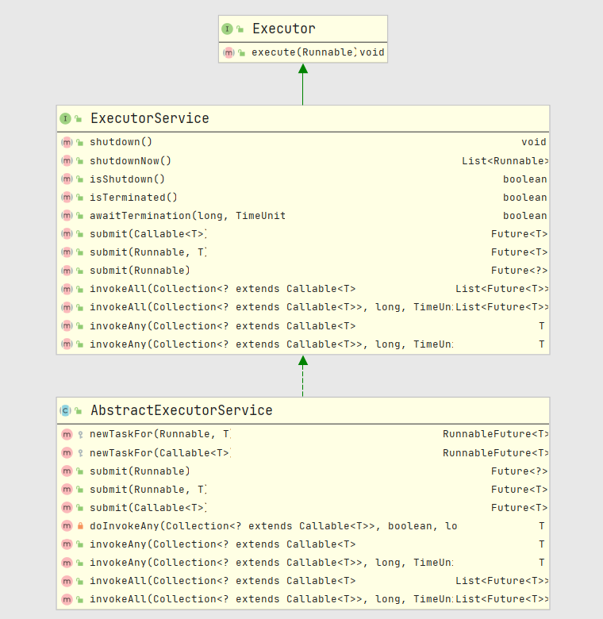
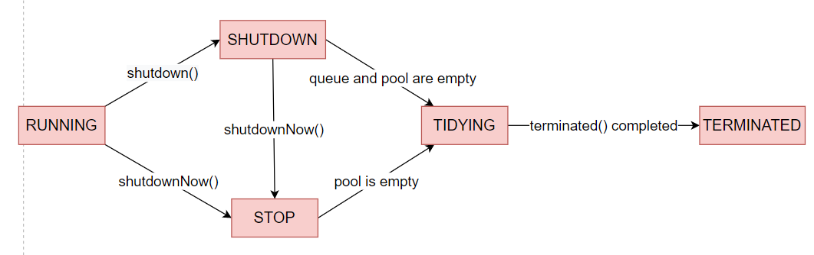
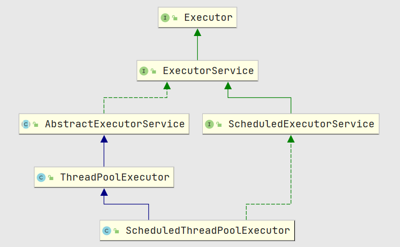
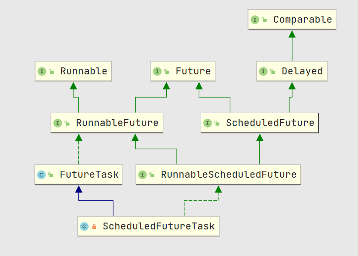
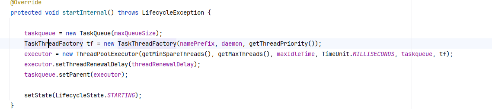
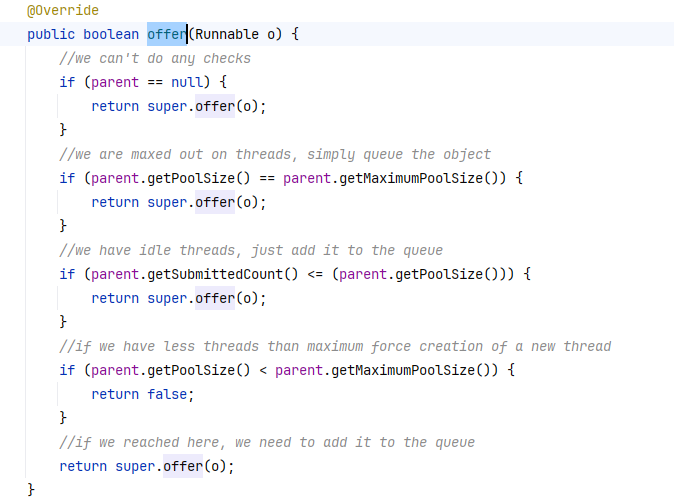

<center><h1>线程池</h1></center>

## FutureTask

先看下类的继承关系:




### 基本属性

```java
/* Possible state transitions: 
     * NEW -> COMPLETING -> NORMAL
     * NEW -> COMPLETING -> EXCEPTIONAL
     * NEW -> CANCELLED
     * NEW -> INTERRUPTING -> INTERRUPTED
     */
// 用来记录线程执行的状态
private volatile int state;
private static final int NEW          = 0;
private static final int COMPLETING   = 1;
private static final int NORMAL       = 2;
private static final int EXCEPTIONAL  = 3;
private static final int CANCELLED    = 4;
private static final int INTERRUPTING = 5;
private static final int INTERRUPTED  = 6;

// 保存线程需要执行的callable任务
private Callable<V> callable;
// 用于保存线程执行的结果，Future在调用get()方法时会获取该值
private Object outcome; // non-volatile, protected by state reads/writes
// 运行任务的线程
private volatile Thread runner;
// 等待线程的堆栈：当多个线程调用get获取结果时，任务还没有执行完毕，线程会阻塞在该链表上
private volatile WaitNode waiters;

static final class WaitNode {
    volatile Thread thread;
    volatile WaitNode next;
    WaitNode() { thread = Thread.currentThread(); }
}
```


### 构造方法

```java
public FutureTask(Callable<V> callable) {
    if (callable == null)
        throw new NullPointerException();
    this.callable = callable;
    this.state = NEW;       // ensure visibility of callable
}

public FutureTask(Runnable runnable, V result) {
    this.callable = Executors.callable(runnable, result);
    this.state = NEW;       // ensure visibility of callable
}

// Executors中的方法
public static <T> Callable<T> callable(Runnable task, T result) {
    if (task == null)
        throw new NullPointerException();
    return new RunnableAdapter<T>(task, result);
}
// 将Runnable任务进行包装
static final class RunnableAdapter<T> implements Callable<T> {
    final Runnable task;
    final T result;
    RunnableAdapter(Runnable task, T result) {
        this.task = task;
        this.result = result;
    }
    public T call() {
        task.run();
        return result;
    }
}
```

上面构造方法中可以看出不管是Runnable, 还是Callable 最终都是采用Callable的形式进行保存到**callable**变量中.


### 核心方法

#### run

> 线程start后,  唯一调用的方法

```java
public void run() {
    // 最初任务状态为0(NEW)， 这里判断当前任务是否已经被启动
    if (state != NEW ||
        // 将runner属性设置为当前线程
        !UNSAFE.compareAndSwapObject(this, runnerOffset,
                                     null, Thread.currentThread()))
        return;
    try {
        // 这里说明线程第一次执行run方法
        Callable<V> c = callable;
        if (c != null && state == NEW) {
            V result; // 保存结果
            boolean ran;
            try {
                result = c.call(); // 执行任务，同时获取执行结果，如果是RunnableAdapter，那么会返回一个任务的默认值
                ran = true; // 标记已经正常执行完成
            } catch (Throwable ex) {
                result = null;
                ran = false;
                setException(ex); // 处理异常结果，通常会唤醒waiters中的其他等待线程
            }
            if (ran)
                set(result);	// 设置结果到outcome属性中，更新状态为normal
        }
    } finally {
        // 为了防止并发调用run 方法，在run方法没有执行完成时，runner必须非空
        runner = null;
        // 再次读取state，防止中断标志泄漏
        int s = state;
        if (s >= INTERRUPTING) // 是否发生中断
            handlePossibleCancellationInterrupt(s); // 等待中断完成
    }
}
private void handlePossibleCancellationInterrupt(int s) {
    // It is possible for our interrupter to stall before getting a
    // chance to interrupt us.  Let's spin-wait patiently.
    if (s == INTERRUPTING)
        while (state == INTERRUPTING) // 等待中断状态为interrupted
            Thread.yield(); // wait out pending interrupt
}

// 设置状态： new --> completing --> normal,  表示任务执行完成
protected void set(V v) {
    if (UNSAFE.compareAndSwapInt(this, stateOffset, NEW, COMPLETING)) {
        outcome = v;
        UNSAFE.putOrderedInt(this, stateOffset, NORMAL); // final state
        finishCompletion();
    }
}
// 执行过程中发生了异常
protected void setException(Throwable t) {
    if (UNSAFE.compareAndSwapInt(this, stateOffset, NEW, COMPLETING)) {
        outcome = t;
        UNSAFE.putOrderedInt(this, stateOffset, EXCEPTIONAL); // final state
        finishCompletion();
    }
}
```


#### finishCompletion

> 当任务正常执行完成后，会调用该方法，用于唤醒waiters上的**所有等待线程**， 让调用get()方法的线程返回。

```java
private void finishCompletion() {
    // assert state > COMPLETING;
    for (WaitNode q; (q = waiters) != null;) {
        // 将waiters置空，在遍历waiters上的节点
        if (UNSAFE.compareAndSwapObject(this, waitersOffset, q, null)) {
            for (;;) {
                Thread t = q.thread;
                if (t != null) {
                    q.thread = null;
                    LockSupport.unpark(t);	// 唤醒
                }
                WaitNode next = q.next;
                if (next == null)
                    break;
                q.next = null; // unlink to help gc
                q = next; // 唤醒下一个节点
            }
            break;
        }
    }

    done();	// 执行完成后处理回调，ExecutorCompletionService中会收集完成的任务

    callable = null;        // to reduce footprint
}
```


#### get

> 获取执行的结果，如果任务还在执行过程中，那么该方法会**阻塞**

```java
public V get() throws InterruptedException, ExecutionException {
    int s = state;
    if (s <= COMPLETING) 
        s = awaitDone(false, 0L);  // 任务还没有完成
    return report(s);
}
// 处理返回结果
private V report(int s) throws ExecutionException {
    Object x = outcome;
    if (s == NORMAL)
        return (V)x; // 正常执行完毕
    if (s >= CANCELLED)
        throw new CancellationException();
    throw new ExecutionException((Throwable)x);
}
/**
timed: 是否超时
nanos: 超时时间
*/
private int awaitDone(boolean timed, long nanos)
    throws InterruptedException {
   	// 超时等待结束时间点
    final long deadline = timed ? System.nanoTime() + nanos : 0L;
    WaitNode q = null;
    boolean queued = false;
    for (;;) {
        if (Thread.interrupted()) { // 当前线程发生中断
            removeWaiter(q); // 取消该节点
            throw new InterruptedException();
        }

        int s = state;
        if (s > COMPLETING) { // 说明执行以及完成，可能是正常完成、异常、中断
            if (q != null)
                q.thread = null;
            return s;
        }
        else if (s == COMPLETING) // cannot time out yet
            Thread.yield();
        else if (q == null)
            q = new WaitNode(); // 为当前线程创建节点
        else if (!queued)	// 节点入队
            queued = UNSAFE.compareAndSwapObject(this, waitersOffset,
                                                 q.next = waiters, q);
        else if (timed) {	// 是否采用超时机制
            nanos = deadline - System.nanoTime();
            if (nanos <= 0L) { // 已经超时
                removeWaiter(q);	// 取消超时的节点
                return state;
            }
            LockSupport.parkNanos(this, nanos); // 阻塞指定时间
        }
        else
            LockSupport.park(this);  // 阻塞
    }
}

/**
尝试将中断、超时的等待节点断开连接，以避免垃圾的积累，遍历过程中出现竞争只需要重头开始再次遍历即可，不需要CAS操作，即时使用CAS结果也是一样的。 因此由于竞争的影响，当链表太长时，可能会花费较多的时间开销
*/
private void removeWaiter(WaitNode node) {
    if (node != null) {
        node.thread = null;
        retry:
        for (;;) {          // restart on removeWaiter race
            // 遍历waiters
            for (WaitNode pred = null, q = waiters, s; q != null; q = s) {
                s = q.next;
                if (q.thread != null)
                    pred = q;
                else if (pred != null) { // q节点需要断开链接
                    pred.next = s;
                    if (pred.thread == null) // check for race
                        // 由于其他线程的参与，pred节点被取消
                        continue retry;
                }
                // 这里说明waiters第一个节点被取消，那么重新设置waiters
                else if (!UNSAFE.compareAndSwapObject(this, waitersOffset,
                                                      q, s))
                    continue retry;
            }
            break;
        }
    }
}
```


#### cancel

> 尝试取消任务

```java
/**
尝试取消执行的任务，如果任务已经完成、取消、或者一些其他原因不能够取消，那么该方法会返回false。当取消成功后，该任务不能再次执行
mayInterruptIfRunning: true:任务执行后，采取中断来停止该任务。false：运行正在处理中的任务继续完成
*/
public boolean cancel(boolean mayInterruptIfRunning) {
    	// 任务还是new状态，可以进行取消， 否则直接返回false
        if (!(state == NEW &&
              UNSAFE.compareAndSwapInt(this, stateOffset, NEW,
                  mayInterruptIfRunning ? INTERRUPTING : CANCELLED)))
            return false;
        try {    // in case call to interrupt throws exception
            if (mayInterruptIfRunning) {
                try {
                    Thread t = runner;
                    if (t != null)
                        t.interrupt();	// 进行中断
                } finally { // final state
                    UNSAFE.putOrderedInt(this, stateOffset, INTERRUPTED);
                }
            }
        } finally {
            finishCompletion();	// 唤醒等待线程
        }
        return true;
    }
```


#### runAndReset

> 设计用来多次执行一个任务， ScheduledThreadPoolExecutor中使用过该方法

```java
/**
执行该任务不设置结果，执行完成后重置初始状态，如果该任务执行以及被取消或者发生了异常，那么不能够再次执行
*/
protected boolean runAndReset() {
    if (state != NEW ||
        !UNSAFE.compareAndSwapObject(this, runnerOffset,
                                     null, Thread.currentThread()))
        return false;
    // 走到这里说明：state == new， runner 为null
    // 说明该任务并没有run方法并没有执行		  
    boolean ran = false;
    int s = state;
    try {
        Callable<V> c = callable;
        if (c != null && s == NEW) {
            try {
                c.call(); // don't set result
                ran = true;
            } catch (Throwable ex) {
                setException(ex);
            }
        }
    } finally {
        // runner must be non-null until state is settled to
        // prevent concurrent calls to run()
        runner = null;
        // state must be re-read after nulling runner to prevent
        // leaked interrupts
        s = state;
        if (s >= INTERRUPTING)
            handlePossibleCancellationInterrupt(s);
    }
    return ran && s == NEW;
}
```


## ExecutorService

### 类继承关系：




### 核心方法

```java
// 关闭线程池，已提交的任务继续执行，不接受继续提交新任务
void shutdown();
// 关闭线程池，尝试停止正在执行的所有任务，不接受继续提交新任务
List<Runnable> shutdownNow();
// 返回线程池是否成功关闭
boolean isShutdown();

//如果调用了 shutdown() 或 shutdownNow() 方法后，所有任务结束了，那么返回true
// 这个方法必须在调用shutdown或shutdownNow方法之后调用才会返回true
boolean isTerminated();

// 在shutdown后，阻塞等待所有任务完成
boolean awaitTermination(long timeout, TimeUnit unit)
    throws InterruptedException;

// 提交一个callable任务，返回该任务的Future对象，可以通过Future.get()阻塞获取任务结果
<T> Future<T> submit(Callable<T> task);

// 任务完成后，Future.get()将返回result
<T> Future<T> submit(Runnable task, T result);

// 提交一个任务用于执行器执行， Runnable最终会封装为RunnableFuture， 任务完成后调用Futuren.get() 将返回null
Future<?> submit(Runnable task);

// 当所有任务都执行完毕后，返回所有任务状态的Future对象
<T> List<Future<T>> invokeAll(Collection<? extends Callable<T>> tasks)
    throws InterruptedException;

// 在指定时间内，当所有任务都执行完毕后，返回所有任务状态的Future对象
<T> List<Future<T>> invokeAll(Collection<? extends Callable<T>> tasks,
                              long timeout, TimeUnit unit)
    throws InterruptedException;

// 提交一堆任务，直到有一个完成
<T> T invokeAny(Collection<? extends Callable<T>> tasks)
    throws InterruptedException, ExecutionException;

// 在指定时间内，有一个任务完成就返回
<T> T invokeAny(Collection<? extends Callable<T>> tasks,
                long timeout, TimeUnit unit)
    throws InterruptedException, ExecutionException, TimeoutException;
```


## ExecutorCompletionService

### 基本属性

```java
// 保存执行器，ThreadPoolExcutor
private final Executor executor;
// 如果执行器为AbstractExecutorService类型，那么aes 即为executor，否则为null
private final AbstractExecutorService aes;
// 记录完成后的任务
private final BlockingQueue<Future<V>> completionQueue;

// 当任务执行完成时，记录完成的任务， 会调用done()
private class QueueingFuture extends FutureTask<Void> {
    QueueingFuture(RunnableFuture<V> task) {
        super(task, null);
        this.task = task;
    }
    protected void done() { completionQueue.add(task); }
    private final Future<V> task;
}
```


### 核心方法

```java
// 构造方法
public ExecutorCompletionService(Executor executor) {
    if (executor == null)
        throw new NullPointerException();
    this.executor = executor;
    this.aes = (executor instanceof AbstractExecutorService) ?
        (AbstractExecutorService) executor : null;
    this.completionQueue = new LinkedBlockingQueue<Future<V>>();
}
// 构造方法： 指定用于任务完成后的收集队列
public ExecutorCompletionService(Executor executor,
                                 BlockingQueue<Future<V>> completionQueue) {
    if (executor == null || completionQueue == null)
        throw new NullPointerException();
    this.executor = executor;
    this.aes = (executor instanceof AbstractExecutorService) ?
        (AbstractExecutorService) executor : null;
    this.completionQueue = completionQueue;
}

// 提交QueueingFuture任务给执行器
public Future<V> submit(Runnable task, V result) {
    if (task == null) throw new NullPointerException();
    RunnableFuture<V> f = newTaskFor(task, result);
    executor.execute(new QueueingFuture(f));
    return f;
}
// 阻塞等待
public Future<V> take() throws InterruptedException {
    return completionQueue.take();
}
// 非阻塞
public Future<V> poll() {
    return completionQueue.poll();
}
// 指定阻塞时间
public Future<V> poll(long timeout, TimeUnit unit)
    throws InterruptedException {
    return completionQueue.poll(timeout, unit);
}
```


## AbstractExecutorService


### 核心方法

> ThreadPoolExecutor类中提交的任务最终都会包装为**FutureTask**类型， 如果是Runnable对象那么会通过**RunnableAdapter**适配器进行处理成带call方法的任务，以方便FutureTask调用任务对象的**call()**方法

需要注意的是线程池调用submit(runnable, result),   这里的result为线程池执行runnable任务后返回值

```java
public <T> Future<T> submit(Callable<T> task) {
    if (task == null) throw new NullPointerException();
    RunnableFuture<T> ftask = newTaskFor(task);
    execute(ftask);
    return ftask;
}
protected <T> RunnableFuture<T> newTaskFor(Runnable runnable, T value) {
    return new FutureTask<T>(runnable, value);
}

// 将Runnable任务处理为带call方法的任务， 
static final class RunnableAdapter<T> implements Callable<T> {
    final Runnable task;
    final T result;
    RunnableAdapter(Runnable task, T result) {
        this.task = task;
        this.result = result;
    }
    public T call() {
        task.run();
        return result;
    }
}
```


### doInvokeAny

> 在指定时间类，其中有一个任务完成后就返回

```java
private <T> T doInvokeAny(Collection<? extends Callable<T>> tasks,
                          boolean timed, long nanos)
    throws InterruptedException, ExecutionException, TimeoutException {
    if (tasks == null)
        throw new NullPointerException();
    int ntasks = tasks.size();
    if (ntasks == 0)
        throw new IllegalArgumentException();
    ArrayList<Future<T>> futures = new ArrayList<Future<T>>(ntasks);
    ExecutorCompletionService<T> ecs =
        new ExecutorCompletionService<T>(this);
    try {
		// 记录异常信息
        ExecutionException ee = null;
        final long deadline = timed ? System.nanoTime() + nanos : 0L;
        Iterator<? extends Callable<T>> it = tasks.iterator();

        // 先提交一个任务
        futures.add(ecs.submit(it.next()));
        --ntasks;
        // 记录正在执行的任务
        int active = 1;

        for (;;) {
            // poll(): 没有元素，直接返回null
            Future<T> f = ecs.poll();
            if (f == null) { // true: 说明上一个任务还没有执行完成
                if (ntasks > 0) {	// 还有未提交的任务
                    --ntasks;
                    futures.add(ecs.submit(it.next()));
                    ++active;
                }
                else if (active == 0) 
                // 说明f == null && ntasks == 0 && active == 0, 说明说有任务都执行失败
                    break;
                else if (timed) { // ntasks == 0 && active > 0: 任务已经提交完，但是还没有执行完成
                    // 超时等待指定时间
                    f = ecs.poll(nanos, TimeUnit.NANOSECONDS);
                    if (f == null)
                        throw new TimeoutException();
                    nanos = deadline - System.nanoTime();
                }
                else  // 任务还没有执行完，take()将阻塞等待
                    f = ecs.take();
            }
            if (f != null) { // 获取到执行结果：FutureTask.run执行完成后，会调用finishCompletion，最终调用done方法(ExecutorCompletionService), 最终将任务添加到completionQueue中
                --active;
                try {
                    return f.get(); // 如果任务执行过程中抛出了异常，这里会检查出异常
                } catch (ExecutionException eex) {
                    ee = eex;
                } catch (RuntimeException rex) {
                    ee = new ExecutionException(rex);
                }
            }
        }

        if (ee == null)
            ee = new ExecutionException();
        throw ee;

    } finally {
        // 取消所有任务
        for (int i = 0, size = futures.size(); i < size; i++)
            futures.get(i).cancel(true);
    }
}
```


### invokeAll

> 当所有任务都执行完成后(状态非**NEW**)，返回持有所有任务状态的**Future**

```java
public <T> List<Future<T>> invokeAll(Collection<? extends Callable<T>> tasks)
    throws InterruptedException {
    if (tasks == null)
        throw new NullPointerException();
    ArrayList<Future<T>> futures = new ArrayList<Future<T>>(tasks.size());
    boolean done = false;
    try {
        for (Callable<T> t : tasks) {	// 提交任务给执行器
            RunnableFuture<T> f = newTaskFor(t);
            futures.add(f);
            execute(f);
        }  
        for (int i = 0, size = futures.size(); i < size; i++) {
            Future<T> f = futures.get(i);
            if (!f.isDone()) {	// 任务还没没有执行完成
                try {
                    f.get();	// 阻塞等待完成
                } catch (CancellationException ignore) {
                } catch (ExecutionException ignore) {
                }
            }
        }
        done = true;	// 所有任务都执行完成(可能正常完成、异常、取消)
        return futures;
    } finally {
        if (!done)	// 由于try中，线程中断、空指针、执行器抛拒绝策略
            // 取消所有未完成的任务
            for (int i = 0, size = futures.size(); i < size; i++)
                futures.get(i).cancel(true);
    }
}
```


### invokeAll

> 带超时等待参数，实现上跟上面方法差异较大。

```java
public <T> List<Future<T>> invokeAll(Collection<? extends Callable<T>> tasks,
                                     long timeout, TimeUnit unit)
    throws InterruptedException {
    if (tasks == null)
        throw new NullPointerException();
    long nanos = unit.toNanos(timeout);
    ArrayList<Future<T>> futures = new ArrayList<Future<T>>(tasks.size());
    boolean done = false;
    try {
        for (Callable<T> t : tasks)
            futures.add(newTaskFor(t));	// 先将任务添加到futures集合中

        final long deadline = System.nanoTime() + nanos;
        final int size = futures.size();

        // Interleave time checks and calls to execute in case
        // executor doesn't have any/much parallelism.
        for (int i = 0; i < size; i++) {	// 依次提价任务到执行器
            execute((Runnable)futures.get(i));
            nanos = deadline - System.nanoTime();
            if (nanos <= 0L)	// 检查超时
                return futures;
        }

        for (int i = 0; i < size; i++) {
            Future<T> f = futures.get(i);	
            if (!f.isDone()) {	// 任务是否已经完成
                if (nanos <= 0L)
                    return futures;
                try {
                    f.get(nanos, TimeUnit.NANOSECONDS); // 阻塞获取执行结果
                } catch (CancellationException ignore) {
                } catch (ExecutionException ignore) {
                } catch (TimeoutException toe) {
                    return futures;
                }
                nanos = deadline - System.nanoTime();
            }
        }
        done = true; // 当所有任务都已经完成，且没有发生超时
        return futures;
    } finally {
        if (!done)	// 在指定时间类任务没有完成，或者发生了其他异常，取消未完成的任务
            for (int i = 0, size = futures.size(); i < size; i++)
                futures.get(i).cancel(true);
    }
}
```


## ThreadPoolExecutor

> shutdown： 获取mainLock，中断所有线程获取，需要获取每个worker的锁，还在处理任务的线程将继续处理队列中的任务
> shutdownNow: 获取mainLock，中断所有线程，无需获取worker的锁，队列的任务无法继续处理

线程池状态变化：



### 基本属性

```java
// 记录线程池状态默认：111 000000000000...
private final AtomicInteger ctl = new AtomicInteger(ctlOf(RUNNING, 0));
private static final int COUNT_BITS = Integer.SIZE - 3;
private static final int CAPACITY   = (1 << COUNT_BITS) - 1;

// 高3位用来表示状态， 低29位表示启动的线程数量
private static final int RUNNING    = -1 << COUNT_BITS;
private static final int SHUTDOWN   =  0 << COUNT_BITS;
private static final int STOP       =  1 << COUNT_BITS;
private static final int TIDYING    =  2 << COUNT_BITS;
private static final int TERMINATED =  3 << COUNT_BITS;
// 任务队列
private final BlockingQueue<Runnable> workQueue;
// 用于控制并发
private final ReentrantLock mainLock = new ReentrantLock();
// 记录已结束的线程完成的任务数量，只有worker终止的时候才会修改他
 private long completedTaskCount;
// 线程池的状态
private static int runStateOf(int c)     { return c & ~CAPACITY; }
// 线程池中工作线程数量
private static int workerCountOf(int c)  { return c & CAPACITY; }
private static int ctlOf(int rs, int wc) { return rs | wc; }


private final HashSet<Worker> workers = new HashSet<Worker>();
private final Condition termination = mainLock.newCondition();
// 当前线程池的线程数量，当获取mainLock才会修改，方便统计线程池的状态
private int largestPoolSize;
// 完成的任务数量，修改时需要持有mainLock锁
private long completedTaskCount;
private volatile ThreadFactory threadFactory;
private volatile RejectedExecutionHandler handler;
private volatile long keepAliveTime;

// true: 表示核心线程数也会使用超时机制，当超时后，自动销毁线程
private volatile boolean allowCoreThreadTimeOut;

// 核心线程数，默认不会超时，除非allowCoreThreadTimeOut为true
private volatile int corePoolSize;

// 线程池的最大线程数
private volatile int maximumPoolSize;

// 用来判断线程池的状态
private static boolean runStateLessThan(int c, int s) {
    return c < s;
}
private static boolean runStateAtLeast(int c, int s) {
    return c >= s;
}
// 线程池是否处于运行态
private static boolean isRunning(int c) {
    return c < SHUTDOWN;
}
```


### Worker

> 用于执行提交的任务，内部维护了一个**Thread**对象

​			Worker类主要维护了当前线程运行任务的中断状态以及其他记录， 该类继承了**AQS**，简化了执行任务锁获取、释放的操作。这可以防止那些旨在唤醒等待任务的工作线程的中断，而打断正在运行的任务。
​    		实现了一个简单的非重入的互斥锁，而不是直接使用**ReentrantLock**，因为当调用线程池的控制方法(如：setCorePoolSize)时，我们并不想工作任务可以重入锁。

 为了防止线程还没有开始就发生中断(**interruptIdleWorkers.tryLock**)，初始化state为负数，当线程调用**start**(执行runWorker)后才清除state

```java
private final class Worker
    extends AbstractQueuedSynchronizer
    implements Runnable
{
    // 执行任务的线程，由线程工程创建
    final Thread thread;
    // 第一个需要执行的任务
    Runnable firstTask;
    // 线程完成的任务数
    volatile long completedTasks;

    
    Worker(Runnable firstTask) {
        // 防止出发中断 (interruptIdleWorkers中，调用tryLock方法)
        setState(-1); // inhibit interrupts until runWorker
        this.firstTask = firstTask;
        // 创建的线程提交的Runnable任务为this，最终执行run方法
        this.thread = getThreadFactory().newThread(this);
    }

    /** Delegates main run loop to outer runWorker  */
    public void run() {
        runWorker(this);	// 线程开始执行任务
    }

    // Lock methods
    //
    // The value 0 represents the unlocked state.  0 表示锁未被使用
    // The value 1 represents the locked state. 1 表示锁被线程持有

    protected boolean isHeldExclusively() {
        return getState() != 0;
    }

    protected boolean tryAcquire(int unused) {
        if (compareAndSetState(0, 1)) {
            setExclusiveOwnerThread(Thread.currentThread());
            return true;
        }
        return false;
    }
    protected boolean tryRelease(int unused) {
        setExclusiveOwnerThread(null);
        setState(0);
        return true;
    }
    public void lock()        { acquire(1); }
    public boolean tryLock()  { return tryAcquire(1); }
    public void unlock()      { release(1); }
    public boolean isLocked() { return isHeldExclusively(); }

    // shutdownNow方法调用时，会中断所有线程。 遍历所有worker，依次调用该方法
    void interruptIfStarted() {
        Thread t;
        if (getState() >= 0 && (t = thread) != null && !t.isInterrupted()) {
            try {
                t.interrupt();
            } catch (SecurityException ignore) {
            }
        }
    }
```


### execute

> 提交一个任务到线程池唯一方法。

如果需要提交Callable任务，需要使用submit方法，**AbstractExecutorServcice**会将Callable任务包装为**RunnableFuture**任务


下面代码主要有三个判断逻辑：

1. 如果当前线程池中的工作线程数小于核心线程数量，那么尝试开启一个新线程来执行该任务，同时将该任务作为该线程的第一个任务。
2. 将任务添加到队列，添加成功后，需要再次检查是否需要创建一个新的线程来执行该任务，因为上次检查时可能核心线程都**已经销毁**，会重新开启一个新的线程作为核心线程，**防止当前任务没有线程执行**。 如果线程池已经被关闭，那么会直接**移除当前任务**。
3. 如果添加队列失败，那么尝试创建一个新的线程来执行该任务。如果失败，则说明线程池被关闭，或者已经饱和，将触发拒绝策略

```java
public void execute(Runnable command) {
        if (command == null)
            throw new NullPointerException();
       
        int c = ctl.get();
        if (workerCountOf(c) < corePoolSize) { 	// 工作线程小于核心线程数
            if (addWorker(command, true)) // 创建一个核心线程
                return;
            c = ctl.get(); // 上面执行失败，重新获取状态
        }
	    // 尝试将任务入队
        if (isRunning(c) && workQueue.offer(command)) {
            int recheck = ctl.get();	
            // 再次检查， 线程池已经关闭，那么从队列移除任务
            if (! isRunning(recheck) && remove(command)) 
                reject(command);	// 拒绝策略
            // 线程池中没有线程了，新添加一个线程来执行当前任务
            else if (workerCountOf(recheck) == 0)	
                addWorker(null, false);
        }
    	// 如果队列为：SynchronousQueue， 可能一开始就会走这里，由于队列特性，offer首先会返回false
        else if (!addWorker(command, false))	// 新建一个非核心线程来执行任务
            reject(command); // 创建线程失败，可能线程已经达到最大了，触发拒绝策略
    }
```


### addWorker

>  检查是否可以更加当前线程池的状态和给定的线程参数(core、maximum)来创建一个新的**worker**(对应一个**Thread**)，如果可以的话，线程池的工作线程数也会做相应的调整。
>
> 当一个worker创建成功后，将会把firstTask作为第一个任务并运行，如果由于一些特殊原因导致创建任务worker失败，那么会返回false


firstTask：新创建的worker应该执行的第一个任务(如果没有则为null)， 当线程池的工作线程小于核心线程或者队列满时且小于最大线程时，被创建的Worker都会初始化一个firstTask。

​		在创建线程池时，提前初始化核心线程可以调用**prestartCoreThread**方法

core：是否为核心线程

```java
private boolean addWorker(Runnable firstTask, boolean core) {
    retry:
    for (;;) {
        int c = ctl.get();
        int rs = runStateOf(c);

        // Check if queue empty only if necessary.
        // 检查是否可以创建线程执行任务
        // 注意：如果线程池处于 SHUTDOWN，但是 firstTask 为 null，且 workQueue 非空，那么是允许创建 worker 的
        if (rs >= SHUTDOWN &&
            ! (rs == SHUTDOWN &&
               firstTask == null &&
               ! workQueue.isEmpty()))
            return false;

        for (;;) {
            int wc = workerCountOf(c);
            if (wc >= CAPACITY ||	// 线程池中的线程是否到达最大，(29位都为1)
                // 如果当前任务为核心线程任务：判断工作线程是否已经大于核心线程
                //             非核心.....: 判断是否大于最大线程数
                wc >= (core ? corePoolSize : maximumPoolSize))
                return false;	// 不能为当前任务创建线程
            if (compareAndIncrementWorkerCount(c))	// 更新线程池中的工作线程数
                break retry;
            c = ctl.get();  // Re-read ctl
            if (runStateOf(c) != rs)	// 线程池状态被改变
                continue retry;
            // else CAS failed due to workerCount change; retry inner loop
			// 多个线程同时执行CAS，重试内部循环
        }
    }

    boolean workerStarted = false;	// 记录新线程是否已启动
    boolean workerAdded = false;	// 记录工作任务是否被成功添加
    Worker w = null;
    try {
        w = new Worker(firstTask);
        final Thread t = w.thread;
        if (t != null) {
            final ReentrantLock mainLock = this.mainLock;
            mainLock.lock();
            try {
                // Recheck while holding lock.
                // Back out on ThreadFactory failure or if
                // shut down before lock acquired.
                int rs = runStateOf(ctl.get());
				// 持有锁后，再次检查线程池的状态
                if (rs < SHUTDOWN ||	// 线程池处于运行状态
                    // 线程池中的线程都已被销毁，创建一个线程来执行队列中的任务
                    (rs == SHUTDOWN && firstTask == null)) {
                    // 线程已经被启动，什么地方可以启动？
                    if (t.isAlive()) // precheck that t is startable
                        throw new IllegalThreadStateException();
                    workers.add(w); // 将当前worker添加到HashSet集合中
                    int s = workers.size();
                    if (s > largestPoolSize)
                        largestPoolSize = s;
                    workerAdded = true;
                }
            } finally {
                mainLock.unlock();
            }
            if (workerAdded) {
                t.start();	// 启动当前创建的线程
                workerStarted = true;
            }
        }
    } finally {
        if (! workerStarted)	// 启动失败
            addWorkerFailed(w);	// 移除当前的worker
    }
    return workerStarted;
}

private void addWorkerFailed(Worker w) {
    final ReentrantLock mainLock = this.mainLock;
    mainLock.lock();
    try {
        if (w != null)
            workers.remove(w);
        decrementWorkerCount();	// 较少线程池的工作线程数
        tryTerminate();	// 判断是否需要终止线程池的任务
    } finally {
        mainLock.unlock();
    }
}
```

### runWorker

> 线程拿任务队列中的任务来执行

```java
final void runWorker(Worker w) {
    Thread wt = Thread.currentThread();
    Runnable task = w.firstTask;
    w.firstTask = null;
    w.unlock(); // allow interrupts， set state to 0
    boolean completedAbruptly = true;
    try {
        // 循环获取队列中任务来执行
        while (task != null || (task = getTask()) != null) {
            w.lock(); // 加锁，防止interruptIdleWorkers执行中断操作
            // If pool is stopping, ensure thread is interrupted;
            // if not, ensure thread is not interrupted.  This
            // requires a recheck in second case to deal with
            // shutdownNow race while clearing interrupt
            
            // 如果当前线程池已经关闭(调用了shutdown)，那么确保线程已经被中断
            // 如果线程池没有关闭，确保线程不能被中断
            if (
                (runStateAtLeast(ctl.get(), STOP) ||
                // 如果有shutdown存在竞争，可能导致中断标志被清除(Thread.interrupted()会清除中断标志)，再次触发中断
                 (Thread.interrupted() && runStateAtLeast(ctl.get(), STOP))
                ) && !wt.isInterrupted())
                wt.interrupt();
            try {
                // 执行任务前的钩子，默认没有实现
                beforeExecute(wt, task);
                Throwable thrown = null;
                try {
                    task.run();	// 执行任务
                } catch (RuntimeException x) {
                    thrown = x; throw x;
                } catch (Error x) {
                    thrown = x; throw x;
                } catch (Throwable x) {
                    thrown = x; throw new Error(x);
                } finally {
                    afterExecute(task, thrown);
                }
            } finally {
                // 当前任务执行完成，completedTasks++，有助于统计线程池完成的任务数
                task = null; 
                w.completedTasks++;
                w.unlock();
            }
        }
        completedAbruptly = false;
    } finally {
        processWorkerExit(w, completedAbruptly);
    }
}
```


### getTask

> 获取队列中的任务返回给线程执行，返回null说明当前worker需要关闭

由于下面情况将返回null，使当前worker结束：

1. 由于调用了setMaximumPoolSize，导致wokers 超过了最大线程池数量
2. 线程池已经停止
3. 线程池关闭且队列为空
4. 当前worker等待任务超时(或者被中断，interruptIdleWorkers)，队列非空，且当前worker不是线程池中最后一个worker

```java
private Runnable getTask() {
    boolean timedOut = false; // Did the last poll() time out?

    for (;;) {
        int c = ctl.get();
        int rs = runStateOf(c);

        // Check if queue empty only if necessary. 仅在必要时检查队列是否为空
        // 线程池已经被关闭，线程池中线程的数量 -1，返回null，当前线程会自动结束
        if (rs >= SHUTDOWN && (rs >= STOP || workQueue.isEmpty())) {
            decrementWorkerCount();
            return null;
        }

        int wc = workerCountOf(c);

        // Are workers subject to culling?
        // 是否需要超时：
		// allowCoreThreadTimeOut: 表示核心线程是否需要超时处理
        // wc > corePoolSize: 除了核心线程外的线程 需要使用超时处理
        boolean timed = allowCoreThreadTimeOut || wc > corePoolSize;
		
        // 当前线程是否需要结束，上面已说明
        if ((wc > maximumPoolSize || (timed && timedOut))
            // wc > 1 : 表示当前worker不是线程池最后一个worker
            && (wc > 1 || workQueue.isEmpty())) {
            if (compareAndDecrementWorkerCount(c))
                return null;
            continue;
        }

        try {
            Runnable r = timed ?
                // 超时等待任务
                workQueue.poll(keepAliveTime, TimeUnit.NANOSECONDS) :
            // 阻塞等待，指导有任务才返回
            workQueue.take();
            if (r != null)
                return r;
            timedOut = true;
        } catch (InterruptedException retry) {
            timedOut = false;
        }
    }
}
```


### processWorkerExit

> 为失效的worker执行清理操作，只有runWorker方法中会调用
>
> completedAbruptly： true 表示worker执行过程中发生了异常， 只有worker执行过程中发生了异常才会为true（应该是lock() 出现问题导致，getTask出现问题不会影响这里)

```java
private void processWorkerExit(Worker w, boolean completedAbruptly) {
    // 如果是正常结束，为什么无需调整workerCount？
    // 正常结束(超时)getTask()方法中已经调用了compareAndDecrementWorkerCount
    if (completedAbruptly) // If abrupt, then workerCount wasn't adjusted
        decrementWorkerCount();

    final ReentrantLock mainLock = this.mainLock;
    mainLock.lock();
    try {
        // 修改completedTaskCount， 移除当前worker
        completedTaskCount += w.completedTasks;
        workers.remove(w);
    } finally {
        mainLock.unlock();
    }
	// 尝试终止状态
    tryTerminate();

    int c = ctl.get();
    // 线程池状态running or shutdown， 部分线程可能还在继续执行
    if (runStateLessThan(c, STOP)) {
        if (!completedAbruptly) {	
            // 属于正常关闭当前worker
            // 最小线程数
            int min = allowCoreThreadTimeOut ? 0 : corePoolSize;
            if (min == 0 && ! workQueue.isEmpty()) // 队列有任务，至少保留一个线程
                min = 1;
            if (workerCountOf(c) >= min)
                // 让正常执行的线程继续处理队列任务
                return; // replacement not needed
        }
        // worker执行过程中异常退出，那么在重新开启一个新worker替代当前worker
        addWorker(null, false);
    }
}
```


### tryTerminate

如果有下列情况：线程池状态为**SHUTDOWN**且线程数和队列都为空，或者状态**STOP**且队列为空，那么将其转换为**TERMINATED**状态。

如果有资格进行终止，由于还存在工作线程，那么会调用**interruptIdleWorkers**方法来中断工作线程，确保shutdown信号能够进行传播 (这里最多中断一个线程)，中断其中一个后，可以让其他线程来调用tryTerminate方法，最终改变线程池状态，这里应该主要是提高效率吧。

该方法必须在下面可能导致终止方法后调用：减少工作线程数(worker count)、在shutdown期间移除任务。

```java
final void tryTerminate() {
    for (;;) {
        int c = ctl.get();
        if (isRunning(c) || // 线程池还在运行
            runStateAtLeast(c, TIDYING) ||	// 已经为TIDYING或TERMINATED
            // 状态为：SHUTDOWN， 且队列不为空
            (runStateOf(c) == SHUTDOWN && ! workQueue.isEmpty()))
            return;
        // 还存在线程
        if (workerCountOf(c) != 0) { // Eligible to terminate， 有资格终止线程池
            interruptIdleWorkers(ONLY_ONE); // 中断空闲任务(最多一个)，ONLY_ONE：true
            return;
        }
		// 说明线程、队列都为空了，可以将状态过度到tidying，最终terminated
        final ReentrantLock mainLock = this.mainLock;
        mainLock.lock();
        try {
            if (ctl.compareAndSet(c, ctlOf(TIDYING, 0))) {
                try {
                    terminated();	// 默认没有实现
                } finally {
                    ctl.set(ctlOf(TERMINATED, 0));
                    // 唤醒等待终止的线程，通常为用户线程，
                    termination.signalAll();
                }
                return;
            }
        } finally {
            mainLock.unlock();
        }
        // else retry on failed CAS
    }
}
```

### awaitTermination

> 通常创建线程池后会调用该方法等待关闭，避免线程池无限期运行下去

tryTerminate() 方法执行过程中，如果状态可以设置为terminated时，会调用termination.signallAll() 来唤醒阻塞的线程。

```java
/**
timeout: 超时时间
unit: 时间单位
*/
public boolean awaitTermination(long timeout, TimeUnit unit)
    throws InterruptedException {
    long nanos = unit.toNanos(timeout);
    final ReentrantLock mainLock = this.mainLock;
    mainLock.lock();
    try {
        for (;;) {
            if (runStateAtLeast(ctl.get(), TERMINATED))
                return true;
            if (nanos <= 0)
                return false;
            // 阻塞当前线程
            nanos = termination.awaitNanos(nanos);
        }
    } finally {
        mainLock.unlock();
    }
}
```


### interruptIdleWorkers

> 尝试中断空闲 (线程执行任务时会调用**lock**方法) 的线程

```java
/**
onlyOne: true 表示执行一次循环就结束， 即最多中断一个线程， tryTerminate()方法
		 false 尝试中断所有的空闲线程， shutdown()方法
*/
private void interruptIdleWorkers(boolean onlyOne) {
    final ReentrantLock mainLock = this.mainLock;
    mainLock.lock();
    try {
        for (Worker w : workers) {
            Thread t = w.thread;
            // w.tryLock(): false 则说明当前worker处于执行任务过程中
            if (!t.isInterrupted() && w.tryLock()) {
                try {
                    t.interrupt();
                } catch (SecurityException ignore) {
                } finally {
                    w.unlock();
                }
            }
            if (onlyOne)
                break;
        }
    } finally {
        mainLock.unlock();
    }
}
```


### 可动态调整参数方法

```java
/**
设置核心线程数：
如果corePoolSize小于当前线程池核心线程数，那么多余的线程在变为空闲的时候会被终止。
大于线程池核心线程数，在下一次
*/
public void setCorePoolSize(int corePoolSize) {
    if (corePoolSize < 0)
        throw new IllegalArgumentException();
    int delta = corePoolSize - this.corePoolSize;
    this.corePoolSize = corePoolSize;
    if (workerCountOf(ctl.get()) > corePoolSize)
        // 中断空闲的线程，如果中断后核心线程还是大于当前corePoolSize，那么多余的线程只有在任务空闲的时候自动结束 
        interruptIdleWorkers();	
    else if (delta > 0) {
        // We don't really know how many new threads are "needed".
        // As a heuristic, prestart enough new workers (up to new
        // core size) to handle the current number of tasks in
        // queue, but stop if queue becomes empty while doing so.
        // 我们不知道究竟启动多少个线程合适。作为一种启发式的方法，预先启动足够的(达到核心线程数)线程来处理队列中的任务，如果队列为空，则不需要启动新线程
        int k = Math.min(delta, workQueue.size());
        while (k-- > 0 && addWorker(null, true)) {
            if (workQueue.isEmpty())
                break;
        }
    }
}

// 设置最大线程数。不允许小于核心线程数， 如果maximumPoolSize小于线程池中执行任务的线程数，那么尝试中断空闲的线程
public void setMaximumPoolSize(int maximumPoolSize) {
    if (maximumPoolSize <= 0 || maximumPoolSize < corePoolSize)
        throw new IllegalArgumentException();
    this.maximumPoolSize = maximumPoolSize;
    if (workerCountOf(ctl.get()) > maximumPoolSize)
        interruptIdleWorkers();
}

/**
设置线程空闲时间，如果当前设置的时间小于当前线程池的超时时间，那么尝试中断空闲的线程
*/
public void setKeepAliveTime(long time, TimeUnit unit) {
    if (time < 0)
        throw new IllegalArgumentException();
    if (time == 0 && allowsCoreThreadTimeOut())
        throw new IllegalArgumentException("Core threads must have nonzero keep alive times");
    long keepAliveTime = unit.toNanos(time);
    long delta = keepAliveTime - this.keepAliveTime;
    this.keepAliveTime = keepAliveTime;
    if (delta < 0)
        interruptIdleWorkers();
}

// 是否允许核心线程超时终止， 默认核心线程不会超时
public void allowCoreThreadTimeOut(boolean value) {
    if (value && keepAliveTime <= 0)
        throw new IllegalArgumentException("Core threads must have nonzero keep alive times");
    if (value != allowCoreThreadTimeOut) {
        allowCoreThreadTimeOut = value; // 设置为相反的状态
        if (value) // 需要超时，中断空闲线程
            interruptIdleWorkers();
    }
}
```


## ScheduledThreadPoolExecutor

> 线程最大为核心线程个数，内部使用的延时队列为无界队列

该类继承了ThreadPoolExecutor，同时实现了ScheduledExecutorService，使该线程池具备定时调度的特性。



### Demo演示

```java
private final ScheduledExecutorService scheduler =
            Executors.newScheduledThreadPool(1);
    public void beepForAnHour() {
        final Runnable beeper = new Runnable() {
            public void run() { System.out.println("beep" + System.currentTimeMillis());
                try {
                    TimeUnit.SECONDS.sleep(3);
                } catch (InterruptedException e) {
                    e.printStackTrace();
                }
            }
        };
        // 上一次与下一次时间间隔：5s (execute task time + period)
        // 固定延时
        final ScheduledFuture<?> beeperHandle =
                scheduler.scheduleWithFixedDelay(beeper, 3, 2, TimeUnit.SECONDS);
        // 任务间隔3s , 单个任务执行(3s)大于了delay
        // 固定速率
        final ScheduledFuture<?> beeperHandle =
                scheduler.scheduleAtFixedRate(beeper, 3, 2, TimeUnit.SECONDS);
        scheduler.schedule(new Runnable() {
            public void run() { beeperHandle.cancel(true); }
        }, 60 * 60, TimeUnit.SECONDS);
    }
}
```


### ScheduledExecutorService

看下ScheduledExecutorService接口定义的一些方法：

```java
public interface ScheduledExecutorService extends ExecutorService {
    // 提交一个定时任务在给定时间后执行
    public ScheduledFuture<?> schedule(Runnable command,
                                       long delay, TimeUnit unit);

    // 创建并执行ScheduledFuture，在给定延时后开启
    public <V> ScheduledFuture<V> schedule(Callable<V> callable,
                                           long delay, TimeUnit unit);

    /**
    创建并执行一个周期性任务，该任务在初始延时后开启，随后以给定的周期执行，也就是在 initialDelay、initialDelay+period、initialDelay + 2 * period ... 进行执行。
    任何一次执行遇到错误，后面将不会在继续执行任务。
    如果某次任务的执行时间超过了period，那么后面的任务执行将会延迟，不会同时执行。
    正常情况下，任务只能通过取消或终止执行器而终止
     */
    public ScheduledFuture<?> scheduleAtFixedRate(Runnable command,
                                                  long initialDelay,
                                                  long period,
                                                  TimeUnit unit);

    /**
    创建并执行一个周期性任务，在initialDelay后开始执行，随后的延时用于任务执行结束与下一个任务开始的时间，任何一次执行遇到错误，后面将不会在继续执行任务。
    正常情况下，任务只能通过取消或终止执行器而终止
     */
    public ScheduledFuture<?> scheduleWithFixedDelay(Runnable command,
                                                     long initialDelay,
                                                     long delay,
                                                     TimeUnit unit);

}
```


### **核心参数**

```java
    /**
     * False if should cancel/suppress periodic tasks on shutdown.
     * 线程池关闭后定时任务是否应该取消/抑制，False表示取消
     */
    private volatile boolean continueExistingPeriodicTasksAfterShutdown;
    /**
     * False if should cancel non-periodic tasks on shutdown.
     * 线程池关闭后非定时任务是否取消，False表示取消
     */
    private volatile boolean executeExistingDelayedTasksAfterShutdown = true;
    /**
     * True if ScheduledFutureTask.cancel should remove from queue
     * 调用cancel后是否从任务队列中移除该任务，默认false，表示取消后，任务队列保留任务，
     * 这种设计有什么好处？
     */
    private volatile boolean removeOnCancel = false;
    /**
     * Sequence number to break scheduling ties, and in turn to
     * guarantee FIFO order among tied entries.
     * 为任务分配发号器，当两个任务超时时间相同时，比较分配的号码大小来判断先执行哪个
     */
    private static final AtomicLong sequencer = new AtomicLong();
```


### ScheduledFutureTask

> 延时队列中的任务，类继承关系如下： 




ScheduledFutureTask.status 一直为NEW， 除非任务取消，或发生异常

```java
private class ScheduledFutureTask<V>
    extends FutureTask<V> implements RunnableScheduledFuture<V> {

    /** Sequence number to break ties FIFO */
    // 当任务超时时间相同时，对于该字段来判断谁先插入队列
    private final long sequenceNumber;

    /** The time the task is enabled to execute in nanoTime units */
    // 保存任务的超时时间，单位：纳秒
    private long time;

    /**
         * Period in nanoseconds for repeating tasks.  A positive
         * value indicates fixed-rate execution.  A negative value
         * indicates fixed-delay execution.  A value of 0 indicates a
         * non-repeating task.
         */
    // 是否为定时任务： < 0: 固定延时执行(delay, 上一个任务结束与下一个任务开始的延时)
    //				 = 0: 非定时任务
    //               > 0: 固定速率执行(rate， 固定速率执行，可能会发生延时)
    private final long period;

    /** The actual task to be re-enqueued by reExecutePeriodic */
    // 记录当前的任务，当任务为定时任务时，需要再次将其添加到队列中
    RunnableScheduledFuture<V> outerTask = this;

    /**
         * Index into delay queue, to support faster cancellation.
         */
    // 堆结构中的索引，用于取消时快速检索
    int heapIndex;
	// 创建一个非延时任务，period = 0
    ScheduledFutureTask(Runnable r, V result, long ns) {
        super(r, result);
        this.time = ns;
        this.period = 0;
        this.sequenceNumber = sequencer.getAndIncrement();
    }
	// 创建一个延时任务
    ScheduledFutureTask(Runnable r, V result, long ns, long period) {
        super(r, result);
        this.time = ns;
        this.period = period;
        this.sequenceNumber = sequencer.getAndIncrement();
    }
	// 当前任务是否已经超时，return <= 0: 表示已经超时,可以执行该任务
    public long getDelay(TimeUnit unit) {
        return unit.convert(time - now(), NANOSECONDS);
    }
	// 比较器，任务入堆结构时需要使用
    // 比较规则：1. 超时时间段的放入堆顶；
    //		   2. 如果超时时间相同，那么比较seq，seq小的放入堆顶，因为seq小说明先添加
    public int compareTo(Delayed other) {
        if (other == this) // compare zero if same object
            return 0;
        if (other instanceof ScheduledFutureTask) {
            ScheduledFutureTask<?> x = (ScheduledFutureTask<?>)other;
            long diff = time - x.time;
            if (diff < 0)
                return -1;
            else if (diff > 0)
                return 1;
            else if (sequenceNumber < x.sequenceNumber)
                return -1;
            else
                return 1;
        }
        long diff = getDelay(NANOSECONDS) - other.getDelay(NANOSECONDS);
        return (diff < 0) ? -1 : (diff > 0) ? 1 : 0;
    }
	// 是否为定时任务
    public boolean isPeriodic() {
        return period != 0;
    }
	// 计算定时任务下一次的执行时间
    private void setNextRunTime() {
        long p = period;
        if (p > 0)  // 固定时间(rate)
            time += p;
        else // p < 0， p == 0 不会调用setNextRunTime方法
            time = triggerTime(-p);
    }
    // 该方法为ScheduledThreadPoolExecutor中的方法
    long triggerTime(long delay) {
        // 这里使用now(),表示以当前时间(上一次任务执行刚好结束)为起点加上延时
        // 判断是否会越界，将结果限制在Long范围内
        return now() +
            ((delay < (Long.MAX_VALUE >> 1)) ? delay : overflowFree(delay));
    }
    private long overflowFree(long delay) {
        Delayed head = (Delayed) super.getQueue().peek();
        if (head != null) {
            long headDelay = head.getDelay(NANOSECONDS);
            if (headDelay < 0 && (delay - headDelay < 0))
                delay = Long.MAX_VALUE + headDelay;
        }
        return delay;
    }
    // 取消任务
    public boolean cancel(boolean mayInterruptIfRunning) {
        // 会更改任务的状态，后面将不会执行该任务
        boolean cancelled = super.cancel(mayInterruptIfRunning);
        // 是否从队列中移除该任务，这里为什么不直接移除？
        if (cancelled && removeOnCancel && heapIndex >= 0)
            remove(this);
        return cancelled;
    }
	// 执行任务
    public void run() {
        // 是否为定时任务
        boolean periodic = isPeriodic();
        // 当前状态是否可以执行任务，如果线程池状态为shutdown，是否能继续执行
        // shutdown状态下：默认状态：非定时任务(delay)可以继续执行，定时任务(periodic)直接cancel
        if (!canRunInCurrentRunState(periodic))
            cancel(false); // 不能执行，取消任务
        else if (!periodic) // 非定时任务，执行run方法
            ScheduledFutureTask.super.run();
        // 定时任务直接执行
        else if (ScheduledFutureTask.super.runAndReset()) {
            setNextRunTime(); // 执行完成后，设置该任务下一次执行时间
            reExecutePeriodic(outerTask); // 再次将任务入队
        }
    }
}
// 任务再次入队
void reExecutePeriodic(RunnableScheduledFuture<?> task) {
    if (canRunInCurrentRunState(true)) { 
        super.getQueue().add(task);	// 将任务添加到队列
        // 再次检查状态，如果shutdown后不能继续执行，那么从队列移除任务，同时cancel任务
        if (!canRunInCurrentRunState(true) && remove(task))
            task.cancel(false);
        else
            ensurePrestart();
    }
}
// 保证线程池中有线程存在
void ensurePrestart() {
    int wc = workerCountOf(ctl.get());
    if (wc < corePoolSize)
        addWorker(null, true); // 添加核心线程
    else if (wc == 0)  // 添加非核心线程
        addWorker(null, false); 
}
```


### DelayedWorkQueue

> 线程池中的阻塞队列，实现类似于DelayQueue、PriorityQueue， 主要区别在于该类可以为ScheduledFutureTask对象设置index，index指向队列中的索引，可以更快检索队列中的任务。
> 在cancel操作时不需要遍历队列来查找指定的元素位置，提高了时间复杂度。
>
> 如果队列中的任务不是ScheduledFutureTask，那么检索元素依然会采用线性搜索。


堆结构的所有操作都需要记录index，主要的方法有siftUp、siftDown， 当任务移除后index会设置为-1

相关方法如下：

```java
// 为任务设置索引
private void setIndex(RunnableScheduledFuture<?> f, int idx) {
    if (f instanceof ScheduledFutureTask)
        ((ScheduledFutureTask)f).heapIndex = idx;
}

// 插入元素后，调整堆结构
private void siftUp(int k, RunnableScheduledFuture<?> key) {
    while (k > 0) {
        int parent = (k - 1) >>> 1;
        RunnableScheduledFuture<?> e = queue[parent];
        if (key.compareTo(e) >= 0)
            break;
        queue[k] = e;
        setIndex(e, k); // 设置index
        k = parent;
    }
    queue[k] = key;
    setIndex(key, k);	// 设置index
}

private RunnableScheduledFuture<?> finishPoll(RunnableScheduledFuture<?> f) {
    int s = --size;
    RunnableScheduledFuture<?> x = queue[s];
    queue[s] = null;
    if (s != 0)
        siftDown(0, x);
    setIndex(f, -1);
    return f;
}
```


**添加定时任务流程**

### scheduleAtFixedRate

> 提交定时任务，以一定的速率执行

```java
public ScheduledFuture<?> scheduleAtFixedRate(Runnable command,
                                              long initialDelay,
                                              long period,
                                              TimeUnit unit) {
    if (command == null || unit == null)
        throw new NullPointerException();
    if (period <= 0)
        throw new IllegalArgumentException();
    // 创建一个ScheduledFutureTask对象
    ScheduledFutureTask<Void> sft =
        new ScheduledFutureTask<Void>(command,
                                      null,
                                      triggerTime(initialDelay, unit),
                                      unit.toNanos(period));
    // decorateTask默认直接返回sft
    RunnableScheduledFuture<Void> t = decorateTask(command, sft);
    // outerTask 用来记录下一次入队的任务
    sft.outerTask = t;
    delayedExecute(t);
    return t;
}
// 执行延时、定时任务的主要方法
private void delayedExecute(RunnableScheduledFuture<?> task) {
    if (isShutdown()) // 线程池已经关闭
        reject(task); // 触发拒绝策略
    else {
        super.getQueue().add(task); // 将当前任务添加到队列中
        // 再次检查是否能够执行
        if (isShutdown() &&
            !canRunInCurrentRunState(task.isPeriodic()) &&
            remove(task))
            // 任务无法执行，取消任务
            task.cancel(false);
        else
            // 保证线程池中有线程执行任务，最多coreCount 线程
            ensurePrestart();
    }
}

```


## Executors

提供创建线程池的工具类：

```java
Executors.newCachedThreadPool(threadFactory);        // 0个core， unlimit max，  SynchronousQueue 作为队列， 只要提交一个任务就立即执行
Executors.newWorkStealingPool(parallelism);               // 创建forkJoin线程池
Executors.newSingleThreadExecutor(threadFactory)       // core = 1, max = 1,  LinkedBlockingQueue, 无大小限制
```


## 总结

copy from Javadoop blog

1. java 线程池有哪些关键属性？

   > corePoolSize，maximumPoolSize，workQueue，keepAliveTime，rejectedExecutionHandler
   >
   > corePoolSize 到 maximumPoolSize 之间的线程会被回收，当然 corePoolSize 的线程也可以通过设置而得到回收（allowCoreThreadTimeOut(true)）。
   >
   > workQueue 用于存放任务，添加任务的时候，如果当前线程数超过了 corePoolSize，那么往该队列中插入任务，线程池中的线程会负责到队列中拉取任务。
   >
   > keepAliveTime 用于设置空闲时间，如果线程数超出了 corePoolSize，并且有些线程的空闲时间超过了这个值，会执行关闭这些线程的操作
   >
   > rejectedExecutionHandler 用于处理当线程池不能执行此任务时的情况，默认有**抛出 RejectedExecutionException 异常**、**忽略任务**、**使用提交任务的线程来执行此任务**和**将队列中等待最久的任务删除，然后提交此任务**这四种策略，默认为抛出异常。

2. 说说线程池中的线程创建时机？

   > 1. 如果当前线程数少于 corePoolSize，那么提交任务的时候创建一个新的线程，并由这个线程执行这个任务；
   > 2. 如果当前线程数已经达到 corePoolSize，那么将提交的任务添加到队列中，等待线程池中的线程去队列中取任务；
   > 3. 如果队列已满，那么创建新的线程来执行任务，需要保证池中的线程数不会超过 maximumPoolSize，如果此时线程数超过了 maximumPoolSize，那么执行拒绝策略。

   \* 注意：如果将队列设置为无界队列，那么线程数达到 corePoolSize 后，其实线程数就不会再增长了。因为后面的任务直接往队列塞就行了，此时 maximumPoolSize 参数就没有什么意义。

3. Executors.newFixedThreadPool(…) 和 Executors.newCachedThreadPool() 构造出来的线程池有什么差别？

   > 细说太长，往上滑一点点，在 Executors 的小节进行了详尽的描述。

4. 任务执行过程中发生异常怎么处理？

   > 如果某个任务执行出现异常，那么执行任务的线程会被关闭，而不是继续接收其他任务。**然后会启动一个新的线程来代替它。** 

5. 什么时候会执行拒绝策略？

   > 1. workers 的数量达到了 corePoolSize（任务此时需要进入任务队列），任务入队成功，与此同时线程池被关闭了，而且关闭线程池并没有将这个任务出队，那么执行拒绝策略。这里说的是非常边界的问题，入队和关闭线程池并发执行，读者仔细看看 execute 方法是怎么进到第一个 reject(command) 里面的。
   > 2. workers 的数量大于等于 corePoolSize，将任务加入到任务队列，可是队列满了，任务入队失败，那么准备开启新的线程，可是线程数已经达到 maximumPoolSize，那么执行拒绝策略。

6. 线程池默认拒绝策略有什么缺陷？

   ```
   DiscardPolicy： 如果提交一个任务返回Future，触发了该策略，那么Future.get()将一直得不到结果（最好指定超时时间），可能导致内存泄露
   ```


## 扩展

### tomcat线程设计：

```
org.apache.tomcat.util.threads.ThreadPoolExecutor： 改造的JDK线程池
```


初始化：

StandardThreadExecutor：




核心：**TaskQueue**， 继承 LinkedBlockingQueue

parent 实际上是ThreadPoolExecutor对象：

当线程池达到最大，入队

当提交的任务小于线程池线程数，入队；    核心线程会获取任务执行

当线程池还没有达到最大，返回false，在ThreadPoolExecutor#execute中会创建非核心线程来执行任务；


其他情况，入队， 并发场景可能发生





### Jetty线程设计

QueuedThreadPool： 执行流程类似tomcat，不过设计上有点特别。

```java
 QueuedThreadPool executor = new QueuedThreadPool(10, 2, 60, new LinkedBlockingDeque<>());
executor.start();
```