Spring AOP

## 总览

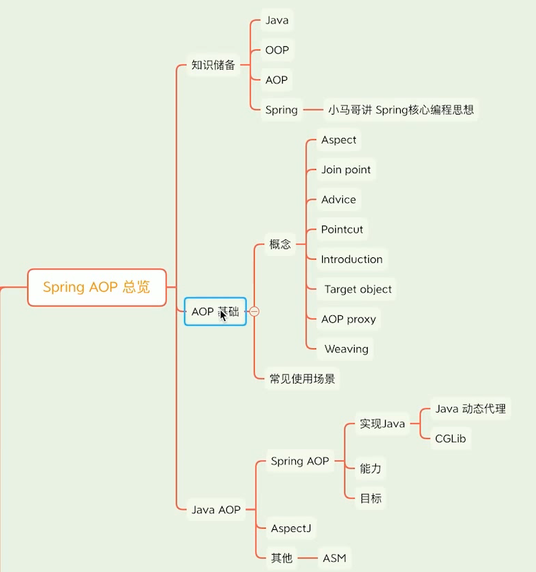


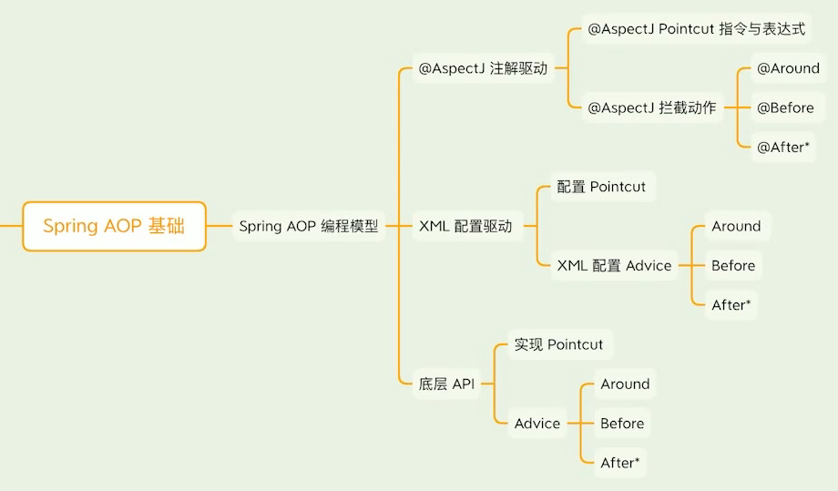

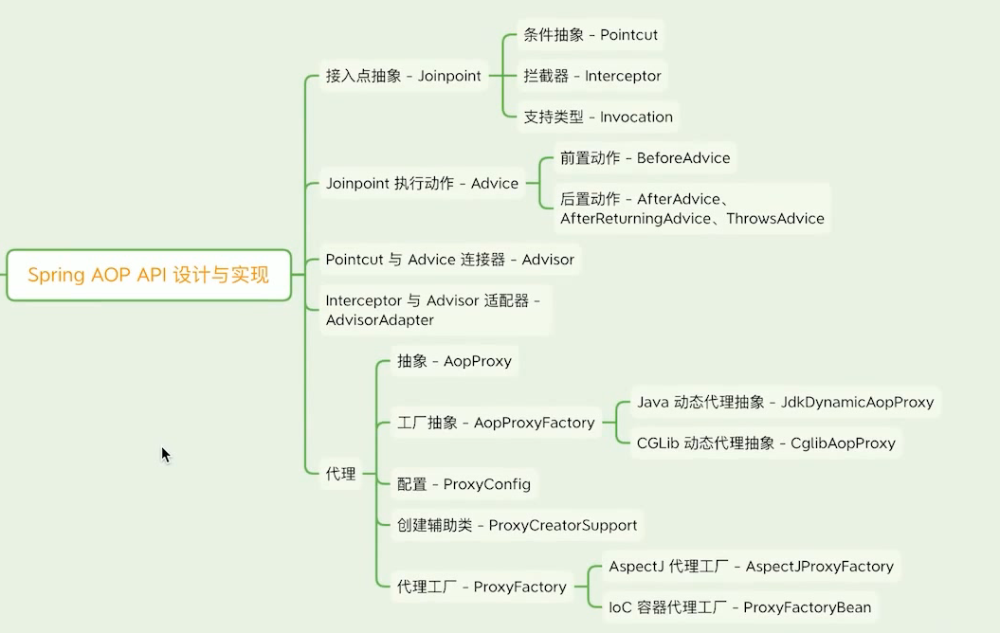

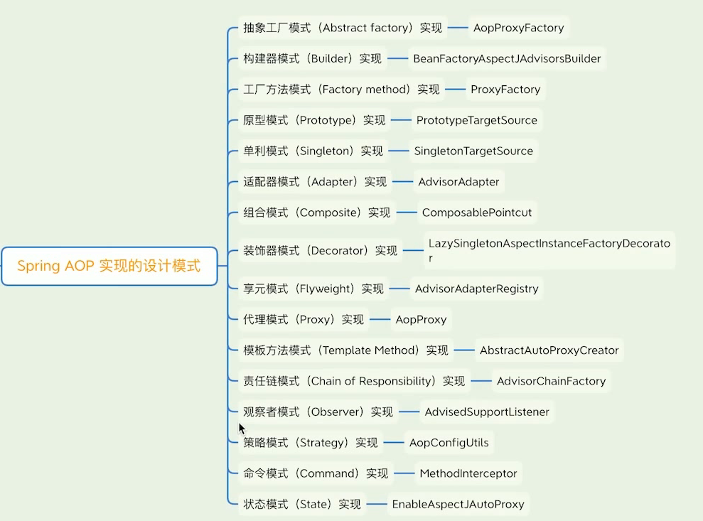

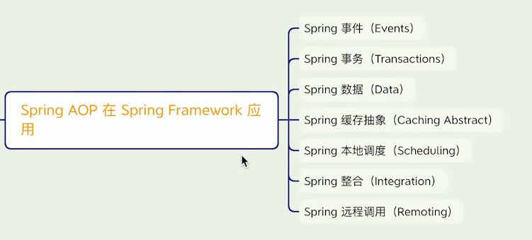


## AOP 基本使用

面向切面编程，对程序代码进行额外增强，不在逻辑代码内部添加相应的代码，使用代理来达到逻辑代码与无关代码之间解耦

### JDK 动态代理：

使用实现接口的方式来达到代理，前提是必须拥有接口和实现类


JDK生成的代理类：

```java
public final class $Proxy01 extends Proxy implements Subject {
    private static Method m1;
    private static Method m2;
    private static Method m3;
    private static Method m0;
    public final void request() throws  {
        // 代理对象在执行request方法时，在这里会调用到 自己重写的InvocationHandler 类的invoke方法
            super.h.invoke(this, m3, (Object[])null);
    }
     static {
        try {
            m2 = Class.forName("java.lang.Object").getMethod("toString");
            m3 = Class.forName("com.xiaoye.writecode.Subject").getMethod("request");
        } catch
    }
}
```


### CGLIB 动态代理

底层通过继承委托类来实现的代理，不会要求像JDK动态代理那样必须实现接口


```java
//代理委托类中任意的非 final 的方法，另外它是通过继承自委托类来生成代理的，
// 所以如果委托类是 final 的，就无法被代理了（final 类不能被继承

public class CGLIBProxyTest implements MethodInterceptor {

    @Override
    public Object intercept(Object obj, Method method, Object[] args, MethodProxy proxy) throws Throwable {
        System.out.println("Before invoke".concat(method.getName()));
        // 调用目标对象的method方法
        proxy.invokeSuper(obj, args);
        // 测试下面: 将会报错
        // method.invoke(obj, args);
        System.out.println("After invoking".concat(method.getName()));
        return null;
    }

    public static void main(String[] args) {
        System.setProperty(DebuggingClassWriter.DEBUG_LOCATION_PROPERTY, "F:\\Ideaworkplace\\algorithm\\test");
        // 创建类加强器，用来创建动态代理类
        Enhancer eh = new Enhancer();
        // 指定要创建的代理类的父类，也就是指定要为哪一个类创建代理类
        eh.setSuperclass(ServiceImpl.class);
        // 设置回调方法，当代理对象上的某个方法被调用时，此回调方法将被调用
        eh.setCallback(new CGLIBProxyTest());
        // 创建代理对象
        ServiceImpl ns = (ServiceImpl) eh.create();
        ns.process("hello world CGLIB proxy");
        System.out.println(ns.getClass().getSimpleName());
    }
}

/*
*//** 生成的动态代理类（简化版）**//*
public class ServiceImpl$$EnhancerByCGLIB$$889898c5 extends ServiceImpl {
    @Override
    public void request() {
        System.out.println("增强前");
        super.request();
        System.out.println("增强后");
    }
}*/ 
```


## AOP 使用场景

- 日志场景
  - 诊断上下文，如：log4j 或logback中的MDC
  - 辅助信息，如： 方法执行时间

- 统计场景
  - 方法调用次数
  - 执行异常次数
  - 数据抽样
  - 数值累加

- 安防场景
  - 熔断， Netflix Hystrix
  - 限流、降级，  Alibaba Sentinel
  - 认证和授权， 如：Spring Security
  - 监控， 如：JMX

- 性能场景
  - 缓存，如：Spring Cache
  - 超时控制


## AOP 具体实现 与 应用

参考文章：https://blog.csdn.net/avengerEug/article/details/118584174

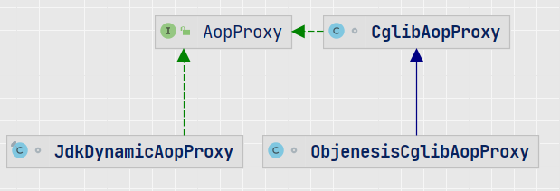

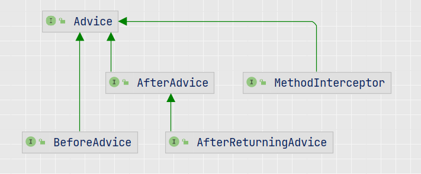


### AbstractAutoProxyCreator

AbstractAutoProxyCreator.java#wrapIfNecessary# createProxy:

```
ProxyFactory proxyFactory = new ProxyFactory();
proxyFactory.copyFrom(this); ...
```


核心类：`AbstractAutoProxyCreator`

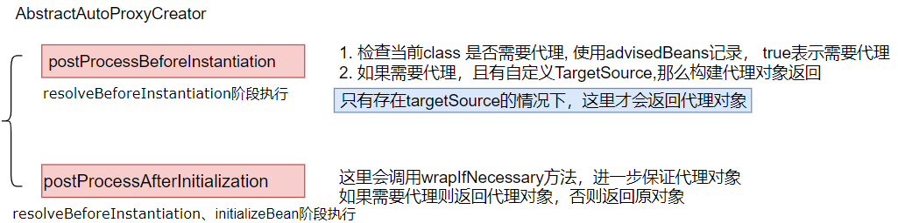


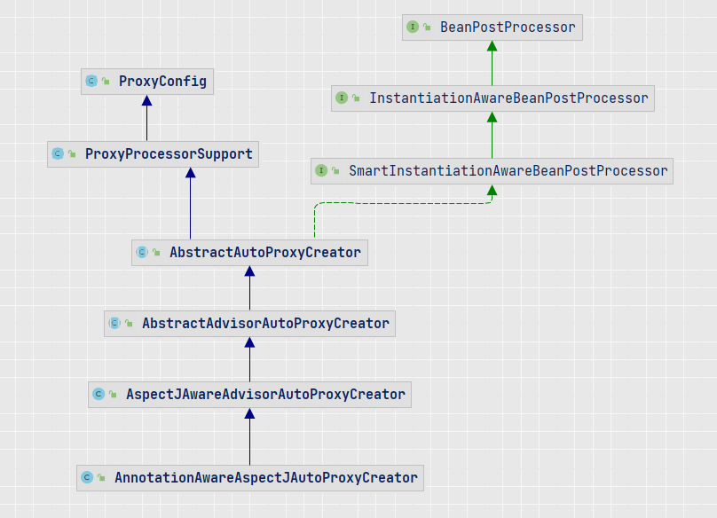


#### getEarlyBeanReference

> 三级缓存中存放的对象，如果存在循环依赖，依赖的bean将会执行该方法，提前创建好代理对象，同时记录到earlyProxyReferences 属性中

```java
public Object getEarlyBeanReference(Object bean, String beanName) {
    Object cacheKey = getCacheKey(bean.getClass(), beanName);
    this.earlyProxyReferences.put(cacheKey, bean);
    return wrapIfNecessary(bean, beanName, cacheKey);
}
```

#### postProcessAfterInitialization

> 如果没有循环引用存在的情况下，会在这里创建代理对象，否则返回原对象

```java
public Object postProcessAfterInitialization(@Nullable Object bean, String beanName) {
    if (bean != null) {
        Object cacheKey = getCacheKey(bean.getClass(), beanName);
        // 上面的方法中会在earlyProxyReferences记录已经创建的代理对象
        if (this.earlyProxyReferences.remove(cacheKey) != bean) {
            return wrapIfNecessary(bean, beanName, cacheKey);
        }
    }
    return bean;
}
```


### @EnableAspectJAutoProxy

> @Import(AspectJAutoProxyRegistrar.class)
>
> **proxyTargetClass**： 默认false，如果实现了接口，使用JDK，否则使用cglib， 具体情况得具体分析
>
> ​               如果为false，该属性可能会被更改：autoproxy.AbstractAutoProxyCreator#createProxy，
>
> ​              （没有实现接口 或者 实现了接口但没有方法， 那么设置属性true）
>
> **exposeProxy** ：默认false， true：表示在执行代理对象时，会将代理对象设置到ThreadLocal中(AopContext), 可以用来解决方法之前调用事物失效

ConfigurationClassBeanDefinitionReader#loadBeanDefinitionsFromRegistrars：在解析类时 会将该注解上的@Import 解析出来进行处理， 最终调用到下面方法


**AspectJAutoProxyRegistrar**#registerBeanDefinitions()：

​                      ---->  registerAspectJAnnotationAutoProxyCreatorIfNecessary： 

主要进行注册**AnnotationAwareAspectJAutoProxyCreator**       BeanDefinition (name:**internalAutoProxyCreator**)  order 属性： max， 记录proxyTargetClass、exposeProxy


类继承关系：


**核心类：AnnotationAwareAspectJAutoProxyCreator**，下面介绍一些核心方法

AbstractAutowireCapableBeanFactory#resolveBeforeInstantiation

AbstractAutowireCapableBeanFactory#applyBeanPostProcessorsBeforeInstantiation

AbstractAutoProxyCreator#postProcessBeforeInstantiation


#### 重要属性


BeanDefinition： 

resolvedTargetType：保存代理对象


`AbstractAutoProxyCreator`中的一些属性：

```java
private String[] interceptorNames = new String[0];

private boolean applyCommonInterceptorsFirst = true;

/**
自定义的targetSource，用于提前返回代理对象
*/
@Nullable
private TargetSourceCreator[] customTargetSourceCreators;

@Nullable
private BeanFactory beanFactory;
// 记录自定义targetSource 创建的beanName
private final Set<String> targetSourcedBeans = Collections.newSetFromMap(new ConcurrentHashMap<>(16));
// 在处理循环依赖时，会调用getEarlyBeanReference()方法(三级缓存中的ObjectFactory)，如果需要代理，那么会将调用该方法的bean对象存储，在后期调用postProcessAfterInitialization方法时会判断是否存在该bean，避免创建不同的代理对象
// <cacheKey, rawBean>， 
private final Map<Object, Object> earlyProxyReferences = new ConcurrentHashMap<>(16);

// <beanName, proxyClass>
private final Map<Object, Class<?>> proxyTypes = new ConcurrentHashMap<>(16);
// 是否跳过处理，FALSE 表示不需要处理，被代理过会设置为TRUE，后续请求postProcessor根据这个状态快速跳过不必要的流程
private final Map<Object, Boolean> advisedBeans = new ConcurrentHashMap<>(256);

```


#### postProcessBeforeInstantiation

> AbstractAutoProxyCreator#postProcessBeforeInstantiation
>
> 主要用于扫描切面相关信息

在调用createBean#resolveBeforeInstantiation时，会进入该方法

```java
public Object postProcessBeforeInstantiation(Class<?> beanClass, String beanName) {
    // 返回BeanName，如果是FactoryBean，则会加上&
    Object cacheKey = getCacheKey(beanClass, beanName);

    if (!StringUtils.hasLength(beanName) || !this.targetSourcedBeans.contains(beanName)) {
        if (this.advisedBeans.containsKey(cacheKey)) {
            return null;
        }
        // isInfrastructureClass: 判断beanClass 是否为Advise、Advisor、Pointcut、AopInfrastructureBean
        // shouldSkip: Advisor是否跳过， 这种类型AspectJPointcutAdvisor 会跳过
        if (isInfrastructureClass(beanClass) || shouldSkip(beanClass, beanName)) {
            this.advisedBeans.put(cacheKey, Boolean.FALSE);
            return null;
        }
    }

    // Create proxy here if we have a custom TargetSource.
    // Suppresses unnecessary default instantiation of the target bean:
    // The TargetSource will handle target instances in a custom fashion.
    // 得到TargetSource： 根据是否自定义targetSource生成
    TargetSource targetSource = getCustomTargetSource(beanClass, beanName);
    if (targetSource != null) {
        if (StringUtils.hasLength(beanName)) {
            this.targetSourcedBeans.add(beanName);
        }
        Object[] specificInterceptors = getAdvicesAndAdvisorsForBean(beanClass, beanName, targetSource);
        Object proxy = createProxy(beanClass, beanName, specificInterceptors, targetSource);
        this.proxyTypes.put(cacheKey, proxy.getClass());
        return proxy;
    }

    return null;
}
```


#### **shouldSkip**

> AspectJAwareAdvisorAutoProxyCreator#shouldSkip

```java
protected boolean shouldSkip(Class<?> beanClass, String beanName) {
    // TODO: Consider optimization by caching the list of the aspect names
    // 1. 会调用--> BeanFactoryAdvisorRetrievalHelper#findAdvisorBeans
	//       查找Advisor.class 类型的Bean
    // 2. BeanFactoryAspectJAdvisorsBuilder#buildAspectJAdvisors
    List<Advisor> candidateAdvisors = findCandidateAdvisors();
    for (Advisor advisor : candidateAdvisors) {
        if (advisor instanceof AspectJPointcutAdvisor &&
            ((AspectJPointcutAdvisor) advisor).getAspectName().equals(beanName)) {
            return true;
        }
    }
    return super.shouldSkip(beanClass, beanName);
}

protected List<Advisor> findCandidateAdvisors() {
    // 找到Advisor
    List<Advisor> advisors = super.findCandidateAdvisors();
    // Build Advisors for all AspectJ aspects in the bean factory.
    if (this.aspectJAdvisorsBuilder != null) {
        advisors.addAll(this.aspectJAdvisorsBuilder.buildAspectJAdvisors());
    }
    return advisors;
}
```


#### buildAspectJAdvisors： 

> BeanFactoryAspectJAdvisorsBuilder

1. 首先依赖查找所有的BeanName
2. isEligibleBean：
    AnnotationAwareAspectJAutoProxyCreator#includePatterns: 判断beanName是否满足条件
3. 找到@Aspect注解的类 ，
     创建BeanFactoryAspectInstanceFactory对象内部 包含AspectMetadata
4. 将非@Pointcut注解的方法封装为InstantiationModelAwarePointcutAdvisorImpl对象 （含有expressionPointcut）
5. InstantiationModelAwarePointcutAdvisorImpl#constructor


BeanFactoryAspectJAdvisorsBuilder类中几个重要的属性：

```
aspectBeanNames： @Aspect 注解的类
advisorsCache： @Aspect 注解类 对应的 非@Pointcut Advisor
aspectFactoryCache： @Aspect 类不是单例会保存属性到这里
```


```java
public List<Advisor> buildAspectJAdvisors() {
    List<String> aspectNames = this.aspectBeanNames;
	// if 里面只会进入一次，第一次会将所有的@Aspect类都扫描进行缓存，下次直接从缓存中取
    if (aspectNames == null) {
        synchronized (this) {
            aspectNames = this.aspectBeanNames;
            if (aspectNames == null) {
                List<Advisor> advisors = new ArrayList<>();
                aspectNames = new ArrayList<>();
                String[] beanNames = BeanFactoryUtils.beanNamesForTypeIncludingAncestors(
                    this.beanFactory, Object.class, true, false);
                for (String beanName : beanNames) {
                    // 默认返回true
                    if (!isEligibleBean(beanName)) {
                        continue;
                    }
                    // We must be careful not to instantiate beans eagerly as in this case they
                    // would be cached by the Spring container but would not have been weaved.
                    Class<?> beanType = this.beanFactory.getType(beanName);
                    if (beanType == null) {
                        continue;
                    }
                    // 是否有@Aspect 注解
                    if (this.advisorFactory.isAspect(beanType)) {
                        aspectNames.add(beanName);
                        AspectMetadata amd = new AspectMetadata(beanType, beanName);
                        if (amd.getAjType().getPerClause().getKind() == PerClauseKind.SINGLETON) {
                            MetadataAwareAspectInstanceFactory factory =
                                new BeanFactoryAspectInstanceFactory(this.beanFactory, beanName);
                            // 内部会将非@Pointcut方法进行包装成相应的Advisor返回（包含Advise），  每个Advisor 会绑定对应的@Pointcut表达式
                            // ReflectiveAspectJAdvisorFactory#getAdvisor:
                            // 创建InstantiationModelAwarePointcutAdvisorImpl 内部包含：AspectJExpressionPointcut（包含注解中的表达式）实例、Advice
                            List<Advisor> classAdvisors = this.advisorFactory.getAdvisors(factory);
                            // 缓存Advisor
                            if (this.beanFactory.isSingleton(beanName)) {
                                this.advisorsCache.put(beanName, classAdvisors);
                            }
                            else { // 非单例，缓存上面factory 对象
                                this.aspectFactoryCache.put(beanName, factory);
                            }
                            advisors.addAll(classAdvisors);
                        }
                        else {
                            // Per target or per this.
                            if (this.beanFactory.isSingleton(beanName)) {
                                throw new IllegalArgumentException("Bean with name '" + beanName +
                                                                   "' is a singleton, but aspect instantiation model is not singleton");
                            }
                            MetadataAwareAspectInstanceFactory factory =
                                new PrototypeAspectInstanceFactory(this.beanFactory, beanName);
                            this.aspectFactoryCache.put(beanName, factory);
                            advisors.addAll(this.advisorFactory.getAdvisors(factory));
                        }
                    }
                }
                this.aspectBeanNames = aspectNames;
                return advisors;
            }
        }
    }

    if (aspectNames.isEmpty()) {
        return Collections.emptyList();
    }
    // 从缓存中取，该方法最初会缓存Advisor信息
    List<Advisor> advisors = new ArrayList<>();
    for (String aspectName : aspectNames) {
        List<Advisor> cachedAdvisors = this.advisorsCache.get(aspectName);
        if (cachedAdvisors != null) {
            advisors.addAll(cachedAdvisors);
        }
        else {
            MetadataAwareAspectInstanceFactory factory = this.aspectFactoryCache.get(aspectName);
            advisors.addAll(this.advisorFactory.getAdvisors(factory));
        }
    }
    return advisors;
}
```


#### ReflectiveAspectJAdvisorFactory#getAdvisor

> 使用InstantiationModelAwarePointcut**Advisor**Impl包装非@Pointcut对应方法的Method对象

```java
public Advisor getAdvisor(Method candidateAdviceMethod, MetadataAwareAspectInstanceFactory aspectInstanceFactory,
                          int declarationOrderInAspect, String aspectName) {
    // 校验这个类是否有@Aspect注解
	validate(aspectInstanceFactory.getAspectMetadata().getAspectClass());
    // 得到该类中带 Aspect 注解的方法（Pointcut、Around、Before、After...）
    AspectJExpressionPointcut expressionPointcut = getPointcut(
        candidateAdviceMethod, aspectInstanceFactory.getAspectMetadata().getAspectClass());
    if (expressionPointcut == null) {
        return null;
    }

    return new InstantiationModelAwarePointcutAdvisorImpl(expressionPointcut, candidateAdviceMethod,
                                                          this, aspectInstanceFactory, declarationOrderInAspect, aspectName);
}


```

**InstantiationModelAwarePointcutAdvisorImpl**

会在ReflectiveAspectJAdvisorFactory#getAdvice方法中对**instantiatedAdvice** 属性赋值为对应的`Advice`

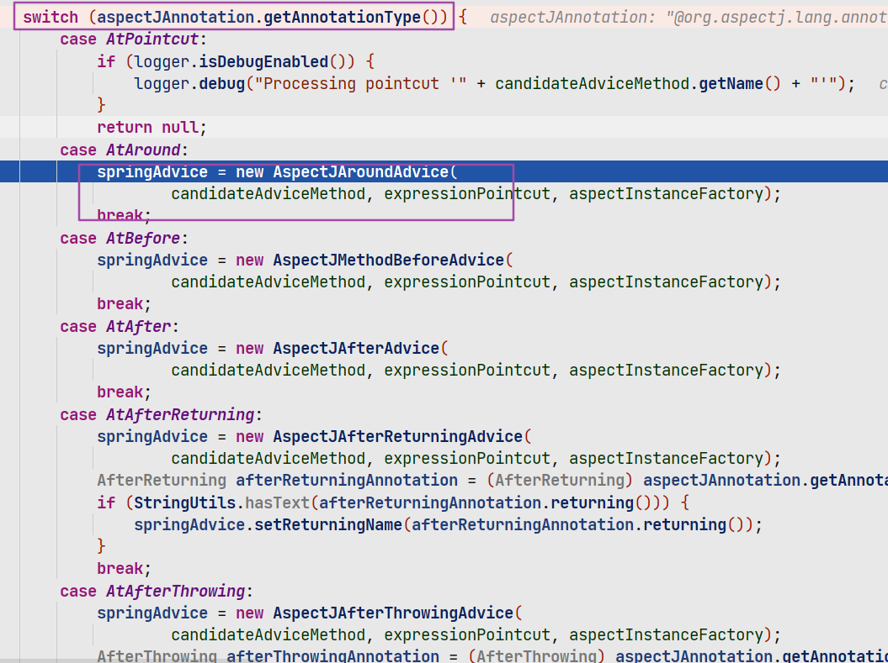


#### postProcessAfterInitialization

> 这里创建代理对象

AbstractAutoProxyCreator.class

```java
public Object postProcessAfterInitialization(@Nullable Object bean, String beanName) {
    if (bean != null) {
        Object cacheKey = getCacheKey(bean.getClass(), beanName);
        if (this.earlyProxyReferences.remove(cacheKey) != bean) {
            // 是否需要代理
            return wrapIfNecessary(bean, beanName, cacheKey);
        }
    }
    return bean;
}
```

#### wrapIfNecessary

```java
protected Object wrapIfNecessary(Object bean, String beanName, Object cacheKey) {
    if (StringUtils.hasLength(beanName) && this.targetSourcedBeans.contains(beanName)) {
        return bean;
    }
    if (Boolean.FALSE.equals(this.advisedBeans.get(cacheKey))) {
        return bean;
    }
    // 前面一样的逻辑
    if (isInfrastructureClass(bean.getClass()) || shouldSkip(bean.getClass(), beanName)) {
        this.advisedBeans.put(cacheKey, Boolean.FALSE);
        return bean;
    }

    // Create proxy if we have advice.
    // 如果这里有advice，那么会创建代理
    Object[] specificInterceptors = getAdvicesAndAdvisorsForBean(bean.getClass(), beanName, null);
    if (specificInterceptors != DO_NOT_PROXY) {
        this.advisedBeans.put(cacheKey, Boolean.TRUE);
        // 为beanclass创建AOP代理，使用ProxyFactory对象包装Advisor，然后生成代理对象(有接口用JDK，没有用cglib)
        Object proxy = createProxy(
            bean.getClass(), beanName, specificInterceptors, new SingletonTargetSource(bean));
        this.proxyTypes.put(cacheKey, proxy.getClass());
        return proxy;
    }

    this.advisedBeans.put(cacheKey, Boolean.FALSE);
    return bean;
}
protected Object[] getAdvicesAndAdvisorsForBean(
    Class<?> beanClass, String beanName, @Nullable TargetSource targetSource) {

    List<Advisor> advisors = findEligibleAdvisors(beanClass, beanName);
    if (advisors.isEmpty()) {
        return DO_NOT_PROXY;
    }
    return advisors.toArray();
}
```


#### findEligibleAdvisors

> 找到beanClass能够使用的Advisor

```java
protected List<Advisor> findEligibleAdvisors(Class<?> beanClass, String beanName) {
    // 找到所有的Advisor，前面已经缓存了
    List<Advisor> candidateAdvisors = findCandidateAdvisors();
    List<Advisor> eligibleAdvisors = findAdvisorsThatCanApply(candidateAdvisors, beanClass, beanName);
    // 添加一个DefaultPointcutAdvisor (包含：ExposeInvocationInterceptor)
    extendAdvisors(eligibleAdvisors);
    if (!eligibleAdvisors.isEmpty()) {
        // 排序
        eligibleAdvisors = sortAdvisors(eligibleAdvisors);
    }
    return eligibleAdvisors;
}
protected List<Advisor> findAdvisorsThatCanApply(
    List<Advisor> candidateAdvisors, Class<?> beanClass, String beanName) {
	// ThreadLocal: 设置当前代理beanName
    ProxyCreationContext.setCurrentProxiedBeanName(beanName);
    try {
        return AopUtils.findAdvisorsThatCanApply(candidateAdvisors, beanClass);
    }
    finally {
        ProxyCreationContext.setCurrentProxiedBeanName(null);
    }
}
```


#### findAdvisorsThatCanApply

AopUtils.java

> 得到clazz 能够应用上的Advisor

```java
public static List<Advisor> findAdvisorsThatCanApply(List<Advisor> candidateAdvisors, Class<?> clazz) {
    if (candidateAdvisors.isEmpty()) {
        return candidateAdvisors;
    }
    List<Advisor> eligibleAdvisors = new ArrayList<>();
    // 判断IntroductionAdvisor，一般都不会用这个吧
    for (Advisor candidate : candidateAdvisors) {
        if (candidate instanceof IntroductionAdvisor && canApply(candidate, clazz)) {
            eligibleAdvisors.add(candidate);
        }
    }
    boolean hasIntroductions = !eligibleAdvisors.isEmpty();
    // 判断能够匹配的advisor
    for (Advisor candidate : candidateAdvisors) {
        if (candidate instanceof IntroductionAdvisor) {
            // already processed
            continue;
        }
        if (canApply(candidate, clazz, hasIntroductions)) {
            eligibleAdvisors.add(candidate);
        }
    }
    return eligibleAdvisors;
}
```


#### canApply

> targetClass 能否应用该Advisor中的Pointcut

```java
public static boolean canApply(Advisor advisor, Class<?> targetClass, boolean hasIntroductions) {
    if (advisor instanceof IntroductionAdvisor) {
        return ((IntroductionAdvisor) advisor).getClassFilter().matches(targetClass);
    }
    else if (advisor instanceof PointcutAdvisor) {
        PointcutAdvisor pca = (PointcutAdvisor) advisor;
        // Pointcut: AspectJExpressionPointcut: 包含绑定的Pointcut 表达式
        return canApply(pca.getPointcut(), targetClass, hasIntroductions);
    }
    else {
        // It doesn't have a pointcut so we assume it applies.
        return true;
    }
}
// targetClass能否应用Pointcut， 这里会使用Aspectj的一些api
public static boolean canApply(Pointcut pc, Class<?> targetClass, boolean hasIntroductions) {
    Assert.notNull(pc, "Pointcut must not be null");
    // Pointcut 是否能够应用在这个类上
    if (!pc.getClassFilter().matches(targetClass)) {
        return false;
    }

    MethodMatcher methodMatcher = pc.getMethodMatcher();
    if (methodMatcher == MethodMatcher.TRUE) {
        // No need to iterate the methods if we're matching any method anyway...
        return true;
    }

    IntroductionAwareMethodMatcher introductionAwareMethodMatcher = null;
    if (methodMatcher instanceof IntroductionAwareMethodMatcher) {
        introductionAwareMethodMatcher = (IntroductionAwareMethodMatcher) methodMatcher;
    }

    Set<Class<?>> classes = new LinkedHashSet<>();
    // JDK: 判断当前class 是不是已经被代理(extends Proxy)
    if (!Proxy.isProxyClass(targetClass)) {
        // ClassUtils.getUserClass: 返回原始类，如果是cglib代理，返回原始类(clazz.getSuperclass())
        classes.add(ClassUtils.getUserClass(targetClass));
    }
    // 获得targetClass的接口： 被cglib 代理的类只有：EnhancedConfiguration
    classes.addAll(ClassUtils.getAllInterfacesForClassAsSet(targetClass));

    for (Class<?> clazz : classes) {
        Method[] methods = ReflectionUtils.getAllDeclaredMethods(clazz);
        // 判断当前class 的方法是否能够应用该pointcut
        for (Method method : methods) {
            if (introductionAwareMethodMatcher != null ?
                introductionAwareMethodMatcher.matches(method, targetClass, hasIntroductions) :
                methodMatcher.matches(method, targetClass)) {
                return true;
            }
        }
    }

    return false;
}
```


#### AbstractAutoProxyCreator#createProxy

> 创建代理对象

```java
protected Object createProxy(Class<?> beanClass, @Nullable String beanName,
                             @Nullable Object[] specificInterceptors, TargetSource targetSource) {

    if (this.beanFactory instanceof ConfigurableListableBeanFactory) {
        // 为BeanDefinition设置属性
//        key: ....AutoProxyUtils.originalTargetClass
//        value: beanClass
        AutoProxyUtils.exposeTargetClass((ConfigurableListableBeanFactory) this.beanFactory, beanName, beanClass);
    }

    ProxyFactory proxyFactory = new ProxyFactory();
    proxyFactory.copyFrom(this);

    if (!proxyFactory.isProxyTargetClass()) {
        // 检查preserveTargetClass 属性是否为true
        if (shouldProxyTargetClass(beanClass, beanName)) {
            proxyFactory.setProxyTargetClass(true);
        }
        else {
            // 评估beanClass 是否实现了接口，没有 或者 实现了接口但没有方法， 那么设置属性 proxyTargetClass：true，表示走cglib代理逻辑
            evaluateProxyInterfaces(beanClass, proxyFactory);
        }
    }

    Advisor[] advisors = buildAdvisors(beanName, specificInterceptors);
    proxyFactory.addAdvisors(advisors);
    proxyFactory.setTargetSource(targetSource);
    customizeProxyFactory(proxyFactory);

    proxyFactory.setFrozen(this.freezeProxy);
    if (advisorsPreFiltered()) {
        proxyFactory.setPreFiltered(true);
    }

    return proxyFactory.getProxy(getProxyClassLoader());
}
```

#### DefaultAopProxyFactory#createAopProxy

> 选择何种方式生成代理
>
> 代理类实现了接口，且代理类本身是一个接口，那么使用JDK
>
> 其他：cglib
>
> 通常情况下都是实现一个接口来写业务代码，因此默认情况下大多数都是JDK动态代理

```java
public AopProxy createAopProxy(AdvisedSupport config) throws AopConfigException {
   	// 如果没有实现接口，proxyTargetClass 会评估为true
    if (config.isOptimize() || config.isProxyTargetClass() || hasNoUserSuppliedProxyInterfaces(config)) {
        Class<?> targetClass = config.getTargetClass();
        if (targetClass == null) {
            throw new AopConfigException("TargetSource cannot determine target class: " +
                                         "Either an interface or a target is required for proxy creation.");
        }
        if (targetClass.isInterface() || Proxy.isProxyClass(targetClass)) {
            return new JdkDynamicAopProxy(config);
        }
        return new ObjenesisCglibAopProxy(config);
    }
    else {
        return new JdkDynamicAopProxy(config);
    }
}
```


#### JdkDynamicAopProxy#invoke

> JDK 动态代理回调方法， InvocationHandler#invoke

```java
public Object invoke(Object proxy, Method method, Object[] args) throws Throwable {
    Object oldProxy = null;
    boolean setProxyContext = false;

    TargetSource targetSource = this.advised.targetSource;
    Object target = null;

    try {
        if (!this.equalsDefined && AopUtils.isEqualsMethod(method)) {
            // The target does not implement the equals(Object) method itself.
            return equals(args[0]);
        }
        else if (!this.hashCodeDefined && AopUtils.isHashCodeMethod(method)) {
            // The target does not implement the hashCode() method itself.
            return hashCode();
        }
        else if (method.getDeclaringClass() == DecoratingProxy.class) {
            // There is only getDecoratedClass() declared -> dispatch to proxy config.
            return AopProxyUtils.ultimateTargetClass(this.advised);
        }
        else if (!this.advised.opaque && method.getDeclaringClass().isInterface() &&
                 method.getDeclaringClass().isAssignableFrom(Advised.class)) {
            // Service invocations on ProxyConfig with the proxy config...
            return AopUtils.invokeJoinpointUsingReflection(this.advised, method, args);
        }

        Object retVal;
		// 是否需要暴露代理对象到AopContext（ThreadLocal）
        if (this.advised.exposeProxy) {
            // Make invocation available if necessary.
            oldProxy = AopContext.setCurrentProxy(proxy);
            setProxyContext = true;
        }

        // Get as late as possible to minimize the time we "own" the target,
        // in case it comes from a pool.
        target = targetSource.getTarget();
        Class<?> targetClass = (target != null ? target.getClass() : null);

        // Get the interception chain for this method.
        List<Object> chain = this.advised.getInterceptorsAndDynamicInterceptionAdvice(method, targetClass);
		// 是否有Advisor，没有的话，直接通过反射调用目标方法
        if (chain.isEmpty()) {
            Object[] argsToUse = AopProxyUtils.adaptArgumentsIfNecessary(method, args);
            retVal = AopUtils.invokeJoinpointUsingReflection(target, method, argsToUse);
        }
        else { // 目标方法有Advisor，需要创建method invocation 
            // We need to create a method invocation...
            MethodInvocation invocation =
                new ReflectiveMethodInvocation(proxy, target, method, args, targetClass, chain);
            // Proceed to the joinpoint through the interceptor chain.
            retVal = invocation.proceed();
        }

        // 处理返回值
        Class<?> returnType = method.getReturnType();
        // 这里表示目标方法返回了this， 这里会替换为代理对象，而不是返回目标对象
        if (retVal != null && retVal == target &&
            returnType != Object.class && returnType.isInstance(proxy) &&
            !RawTargetAccess.class.isAssignableFrom(method.getDeclaringClass())) {
            retVal = proxy;
        }
        else if (retVal == null && returnType != Void.TYPE && returnType.isPrimitive()) { // 没有指定返回值
            throw new AopInvocationException(
                "Null return value from advice does not match primitive return type for: " + method);
        }
        return retVal;
    }
    finally {
        if (target != null && !targetSource.isStatic()) {
            // Must have come from TargetSource.
            targetSource.releaseTarget(target);
        }
        if (setProxyContext) { // 恢复AopContext中的值
            AopContext.setCurrentProxy(oldProxy);
        }
    }
}
```

### ReflectiveMethodInvocation.java

> 使用了责任链设计模式，依次调用数组中保存的Advice

```java
public Object proceed() throws Throwable {
		// We start with an index of -1 and increment early.
		if (this.currentInterceptorIndex == this.interceptorsAndDynamicMethodMatchers.size() - 1) {
			return invokeJoinpoint();
		}

		Object interceptorOrInterceptionAdvice =
				this.interceptorsAndDynamicMethodMatchers.get(++this.currentInterceptorIndex);
		if (interceptorOrInterceptionAdvice instanceof InterceptorAndDynamicMethodMatcher) {
			// Evaluate dynamic method matcher here: static part will already have
			// been evaluated and found to match.
			InterceptorAndDynamicMethodMatcher dm =
					(InterceptorAndDynamicMethodMatcher) interceptorOrInterceptionAdvice;
			Class<?> targetClass = (this.targetClass != null ? this.targetClass : this.method.getDeclaringClass());
			if (dm.methodMatcher.matches(this.method, targetClass, this.arguments)) {
				return dm.interceptor.invoke(this);
			}
			else {
				// Dynamic matching failed.
				// Skip this interceptor and invoke the next in the chain.
				return proceed();
			}
		}
		else {
			// It's an interceptor, so we just invoke it: The pointcut will have
			// been evaluated statically before this object was constructed.
			return ((MethodInterceptor) interceptorOrInterceptionAdvice).invoke(this);
		}
	}
```


### @EnableTransactionManagement

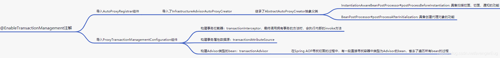

- proxyTargetClass： false
- mode： AdviceMode.PROXY;
- order： Ordered.LOWEST_PRECEDENCE

> @Import(TransactionManagementConfigurationSelector.class)

#### selectImports

> 解析配置类的时候会调用这个方法

```java
protected String[] selectImports(AdviceMode adviceMode) {
   switch (adviceMode) {
      case PROXY:
           // 默认情况：会将这两个类注册到Regsitry中， 类似于@EnableAspectJAutoProxy注解，为注册AspectJAutoProxyRegistrar
         return new String[] {AutoProxyRegistrar.class.getName(),
               ProxyTransactionManagementConfiguration.class.getName()};
      case ASPECTJ:
         return new String[] {determineTransactionAspectClass()};
      default:
         return null;
   }
}
```

#### AutoProxyRegistrar

> registerBeanDefinitions： 会注册InfrastructureAdvisorAutoProxyCreator.class BeanDefinition

而对于EnableAspectJAutoProxy注解， 则注册的是AnnotationAwareAspectJAutoProxyCreator 作为APC（internalAutoProxyCreator）

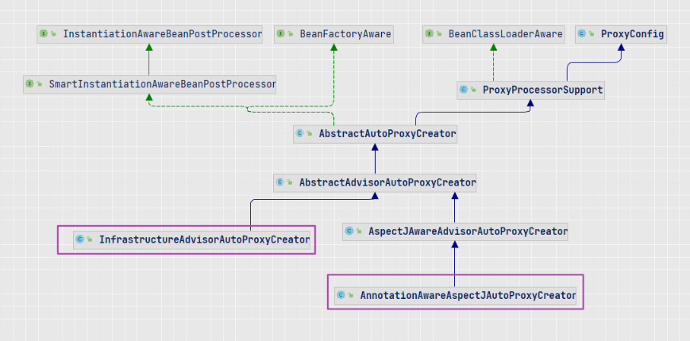


AutoProxyRegistrar作用如下：

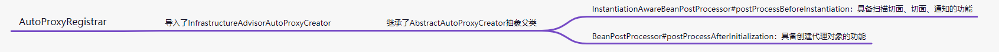


#### ProxyTransactionManagementConfiguration 

> ProxyTransactionManagementConfiguration extends AbstractTransactionManagementConfiguration

内部方法定义了如下MethodBean：

```java
BeanFactoryTransactionAttributeSourceAdvisor
AnnotationTransactionAttributeSource
TransactionInterceptor    -- 
```


```java
@Bean(name = TransactionManagementConfigUtils.TRANSACTION_ADVISOR_BEAN_NAME)
@Role(BeanDefinition.ROLE_INFRASTRUCTURE)
public BeanFactoryTransactionAttributeSourceAdvisor transactionAdvisor(
      TransactionAttributeSource transactionAttributeSource,
      TransactionInterceptor transactionInterceptor) {
    // 这里维护了事务相关的属性源
   BeanFactoryTransactionAttributeSourceAdvisor advisor = new BeanFactoryTransactionAttributeSourceAdvisor();
   advisor.setTransactionAttributeSource(transactionAttributeSource);
    // 设置事务执行相关的拦截器，用于提交回滚事务
   advisor.setAdvice(transactionInterceptor);
   if (this.enableTx != null) {
      advisor.setOrder(this.enableTx.<Integer>getNumber("order"));
   }
   return advisor;
}

@Bean
@Role(BeanDefinition.ROLE_INFRASTRUCTURE)
public TransactionAttributeSource transactionAttributeSource() {
   return new AnnotationTransactionAttributeSource();
}

@Bean
@Role(BeanDefinition.ROLE_INFRASTRUCTURE)
public TransactionInterceptor transactionInterceptor(
      TransactionAttributeSource transactionAttributeSource) {
   TransactionInterceptor interceptor = new TransactionInterceptor();
   interceptor.setTransactionAttributeSource(transactionAttributeSource);
   if (this.txManager != null) {
      interceptor.setTransactionManager(this.txManager);
   }
   return interceptor;
}
```


#### TransactionAspectSupport

TransactionAspectSupport#invokeWithinTransaction

> 事务执行的核心入口;    持久层API 也会执行到这里( SimpleJpaRepository:  save)

```java
protected Object invokeWithinTransaction(Method method, @Nullable Class<?> targetClass,
      final InvocationCallback invocation) throws Throwable {

   // If the transaction attribute is null, the method is non-transactional.
    // 得到所有方法的属性信息
   TransactionAttributeSource tas = getTransactionAttributeSource();
    // 得到class 的 @Transactional 注解配置信息
   final TransactionAttribute txAttr = (tas != null ? tas.getTransactionAttribute(method, targetClass) : null);
    // 得到事务管理器，（自己配置的）
   final TransactionManager tm = determineTransactionManager(txAttr);
.... 省略ReactiveTransactionManager相关处理
	// 合法性判断，转换为PlatformTransactionManager类型
   PlatformTransactionManager ptm = asPlatformTransactionManager(tm);
    // 得到joinpoint 标识符：即：aop.EmployeeServiceImpl.testSuccess
   final String joinpointIdentification = methodIdentification(method, targetClass, txAttr);

   if (txAttr == null || !(ptm instanceof CallbackPreferringPlatformTransactionManager)) {
      // Standard transaction demarcation with getTransaction and commit/rollback calls.
      // Statement: SET autocommit=1
       // 会调用事务平台管理器对应的doGetTransaction方法获取事务，  TransactionInfo 会记录当前事务信息，以及之前的事务信息
      TransactionInfo txInfo = createTransactionIfNecessary(ptm, txAttr, joinpointIdentification);

      Object retVal;
      try {
          // 执行目标方法
         // This is an around advice: Invoke the next interceptor in the chain.
         // This will normally result in a target object being invoked.
         retVal = invocation.proceedWithInvocation();
      }
      catch (Throwable ex) {
         // target invocation exception， 处理回滚， 
          // 会判断是否能rollback, 如果能将标记ConnectionHolder 为rollback
         completeTransactionAfterThrowing(txInfo, ex);
         throw ex;
      }
      finally {
          // 恢复transactionInfoHolder 之前保存的TransactionInfo
         cleanupTransactionInfo(txInfo);
      }

      if (vavrPresent && VavrDelegate.isVavrTry(retVal)) {
         // Set rollback-only in case of Vavr failure matching our rollback rules...
         TransactionStatus status = txInfo.getTransactionStatus();
         if (status != null && txAttr != null) {
            retVal = VavrDelegate.evaluateTryFailure(retVal, txAttr, status);
         }
      }
		// 执行commit, 
       // AbstractPlatformTransactionManager#processCommit: 会执行一些事件回调，判断是否执行真实commit
      commitTransactionAfterReturning(txInfo);
      return retVal;
   }

   else { // 编程式事务
      ....
   }
}
```


#### createTransactionIfNecessary

> 核心会调用getTransaction，如果当前已经存在事务，那么不会重新创建事务。只是重新创建一个 TransactionStatus对象

```java
public final TransactionStatus getTransaction(@Nullable TransactionDefinition definition)
			throws TransactionException {

		// Use defaults if no transaction definition given.
		TransactionDefinition def = (definition != null ? definition : TransactionDefinition.withDefaults());
		// 获取TransactionObject， 如果当前线程是第一次那么新建对象(并不会获取connection)
		Object transaction = doGetTransaction();
		boolean debugEnabled = logger.isDebugEnabled();
		
    	// 事务是否存在，第一次false
		if (isExistingTransaction(transaction)) {
			// Existing transaction found -> check propagation behavior to find out how to behave.
            // 处理之前存在的事务： 如果当前需要新开事务， 挂起之前的事务。 重新打开一个新的事务连接对象 (数据库层面)
            // 会重置当前threadLocal保存的数据，新建一个TransactionInfo(会记录之前管理的资源)
			return handleExistingTransaction(def, transaction, debugEnabled);
		}

		// Check definition settings for new transaction.
		if (def.getTimeout() < TransactionDefinition.TIMEOUT_DEFAULT) {
			throw new InvalidTimeoutException("Invalid transaction timeout", def.getTimeout());
		}

		// No existing transaction found -> check propagation behavior to find out how to proceed.
		if (def.getPropagationBehavior() == TransactionDefinition.PROPAGATION_MANDATORY) {
			throw new IllegalTransactionStateException(
					"No existing transaction found for transaction marked with propagation 'mandatory'");
		}
    	// 初始传播行为
		else if (def.getPropagationBehavior() == TransactionDefinition.PROPAGATION_REQUIRED ||
				def.getPropagationBehavior() == TransactionDefinition.PROPAGATION_REQUIRES_NEW ||
				def.getPropagationBehavior() == TransactionDefinition.PROPAGATION_NESTED) {
			SuspendedResourcesHolder suspendedResources = suspend(null);
			try {
                // 创建一个新的事务连接： 关闭自动提交：ConnectionImpl#setAutoCommit 即发送 SET autocommit=1
				return startTransaction(def, transaction, debugEnabled, suspendedResources);
			}
			catch (RuntimeException | Error ex) {
				resume(null, suspendedResources);
				throw ex;
			}
		}
		else {
			boolean newSynchronization = (getTransactionSynchronization() == SYNCHRONIZATION_ALWAYS);
			return prepareTransactionStatus(def, null, true, newSynchronization, debugEnabled, null);
		}
	}
```


#### 总结：

**TransactionSynchronizationManager**： 

```java
使用ThreadLocal来保存当前线程中的一些事务信息
    resources： <连接池,连接对象包装器（ConnectionHolder)>; 其他...；  开启事务后，会保存相关的connection对象
	currentTransactionName： 调用的目标：类名.方法名
	synchronizations：
```


执行流程：

1. 执行带@Transactional的方法，进入TransactionAspectSupport#**invokeWithinTransaction**

2. 获取**TransactionManager**， 在事务管理器中获取**TransactionInfo**对象，这里面包含了相关事务信息。

   - 这一步会查看当前线程的**ThreadLocal**中是否存在连接对象。不存在那么新建一个, 开启事务(**set autocommit = 0**;  )。 连接对象保存在**resources**

3. 执行业务逻辑

   1. 当业务逻辑中会执行save 之类的内置方法时（SimpleJpaRepository），会使用当前事务。当事务管理器为JPA时，调用save最终会执行到SharedEntityManagerCreator.SharedEntityManagerInvocationHandler#invoke： 在这里会到上面的resources中获取连接的对象， 最后使用该连接对象作为参数反射调用目标方法。

   2. 当resources 中无法获取到连接对象时，会新建一个连接对象。

      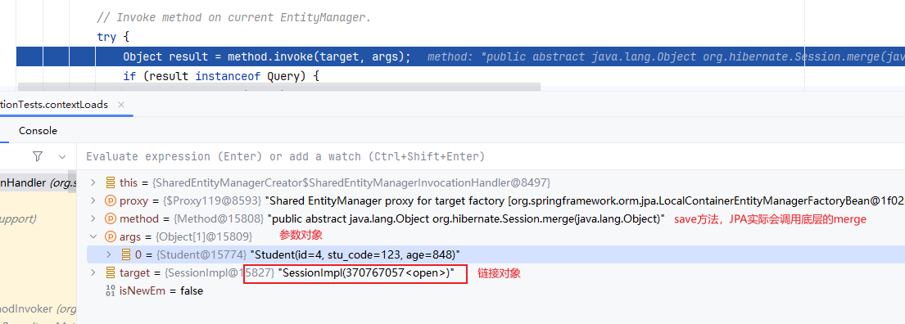

4. 提交事务:  执行回调，发送commit， 清理**TransactionSynchronizationManager**。 如果是嵌套事务，需要恢复之前的事务状态到threadLocal中


注意： 执行内部方法：SimpleJpaRepository类实现

save、saveAll：由于方法上添加了@Transactional，因此会被事务管理。

findBy： 类上带： @Transactional(readOnly = true) ， 因此默认会以只读事务开启：
				- 发送： SET TRANSACTION READ ONLY； SET autocommit=0； （顺序不重要）

- 如果findBy相关方法是在@Transactional包裹的事务中执行的，由于之前已经存在事务，那么这里不会发送read only 状态。 

自定义接口：默认情况不会有事务。


对于自定义接口包含**@Modifying**： 如果不加@Transactional注解，那么将不会执行成功。JPA默认不允许没有事务的情况下执行update

AbstractSharedSessionContract#checkTransactionNeededForUpdateOperation： 可配置更改。


### @EnableCaching

> @Import(CachingConfigurationSelector.class)

首先CachingConfigurationSelector 会注册AutoProxyRegistrar、ProxyCachingConfiguration

注册**APC**： InfrastructureAdvisorAutoProxyCreator


#### ProxyCachingConfiguration

```java
@Bean(name = CacheManagementConfigUtils.CACHE_ADVISOR_BEAN_NAME)
@Role(BeanDefinition.ROLE_INFRASTRUCTURE)
public BeanFactoryCacheOperationSourceAdvisor cacheAdvisor() {
   BeanFactoryCacheOperationSourceAdvisor advisor = new BeanFactoryCacheOperationSourceAdvisor();
   advisor.setCacheOperationSource(cacheOperationSource());
   advisor.setAdvice(cacheInterceptor());
   if (this.enableCaching != null) {
      advisor.setOrder(this.enableCaching.<Integer>getNumber("order"));
   }
   return advisor;
}

@Bean
@Role(BeanDefinition.ROLE_INFRASTRUCTURE)
public CacheOperationSource cacheOperationSource() {
   return new AnnotationCacheOperationSource();
}

// 作为Interceptor，会添加到代理对象执行的chain
@Bean
@Role(BeanDefinition.ROLE_INFRASTRUCTURE)
public CacheInterceptor cacheInterceptor() {
   CacheInterceptor interceptor = new CacheInterceptor();
   interceptor.configure(this.errorHandler, this.keyGenerator, this.cacheResolver, this.cacheManager);
   interceptor.setCacheOperationSource(cacheOperationSource());
   return interceptor;
}
```


#### CacheInterceptor

CacheInterceptor#invoke

```java
public Object invoke(final MethodInvocation invocation) throws Throwable {
    Method method = invocation.getMethod();

    CacheOperationInvoker aopAllianceInvoker = () -> {
        try {
            return invocation.proceed();
        }
        catch (Throwable ex) {
            throw new CacheOperationInvoker.ThrowableWrapper(ex);
        }
    };

    try {
        return execute(aopAllianceInvoker, invocation.getThis(), method, invocation.getArguments());
    }
    catch (CacheOperationInvoker.ThrowableWrapper th) {
        throw th.getOriginal();
    }
}
```

#### CacheAspectSupport#execute

> extends AbstractCacheInvoker
> 		implements BeanFactoryAware, InitializingBean, SmartInitializingSingleton

```java
protected Object execute(CacheOperationInvoker invoker, Object target, Method method, Object[] args) {
   // Check whether aspect is enabled (to cope with cases where the AJ is pulled in automatically)
    // 当BeanDefinition实例化完成后，会遍历SmartInitializingSingleton#afterSingletonsInstantiated 将initialized 设置为true
   if (this.initialized) {
       // 得到目标类的class 对象
      Class<?> targetClass = getTargetClass(target);
      // 得到缓存的所有的CacheOperation
      CacheOperationSource cacheOperationSource = getCacheOperationSource();
      if (cacheOperationSource != null) {
          // 找到目标方法的CacheOperation：即缓存注解信息
         Collection<CacheOperation> operations = cacheOperationSource.getCacheOperations(method, targetClass);
         if (!CollectionUtils.isEmpty(operations)) {
            return execute(invoker, method,
                  new CacheOperationContexts(operations, method, args, target, targetClass));
         }
      }
   }

   return invoker.invoke();
}
```

CacheAspectSupport#execute

```java
// CacheOperationContexts: 包含了缓存的ConcurentMapCache对象
private Object execute(final CacheOperationInvoker invoker, Method method, CacheOperationContexts contexts) {
   // Special handling of synchronized invocation
      .... 省略
    // Process any early evictions，   是否在方法调用前进行evict，默认false
		processCacheEvicts(contexts.get(CacheEvictOperation.class), true,
				CacheOperationExpressionEvaluator.NO_RESULT);

		// Check if we have a cached item matching the conditions
    	// 检查是否有符合条件的缓存
		Cache.ValueWrapper cacheHit = findCachedItem(contexts.get(CacheableOperation.class));

		// Collect puts from any @Cacheable miss, if no cached item is found
    	// 没有命中缓存，则创建需要请求获取缓存的对象，CachePutRequest
		List<CachePutRequest> cachePutRequests = new LinkedList<>();
		if (cacheHit == null) {
			collectPutRequests(contexts.get(CacheableOperation.class),
					CacheOperationExpressionEvaluator.NO_RESULT, cachePutRequests);
		}

		Object cacheValue;
		Object returnValue;
		// 缓存命中，自己取出缓存的value 
		if (cacheHit != null && !hasCachePut(contexts)) {
			// If there are no put requests, just use the cache hit
			cacheValue = cacheHit.get();
            // 是否需要Optional包装
			returnValue = wrapCacheValue(method, cacheValue);
		}
		else {
			// Invoke the method if we don't have a cache hit
            // 缓存未命中，调用目标方法，得到返回结果
			returnValue = invokeOperation(invoker);
            // 将结果对象 解除包装，即获取Optional的目标值
			cacheValue = unwrapReturnValue(returnValue);
		}

		// Collect any explicit @CachePuts， 处理CachePuts 注解的请求
		collectPutRequests(contexts.get(CachePutOperation.class), cacheValue, cachePutRequests);

		// Process any collected put requests, either from @CachePut or a @Cacheable miss
    	// 循环处理写入缓存的请求对象，CachePut可能会覆盖Cacheable
		for (CachePutRequest cachePutRequest : cachePutRequests) {
			cachePutRequest.apply(cacheValue);
		}

		// Process any late evictions， 方法调用后 进行evict，默认情况
		processCacheEvicts(contexts.get(CacheEvictOperation.class), false, cacheValue);

		return returnValue;
	}
```


CachePutRequest

```java
public void apply(@Nullable Object result) {
   if (this.context.canPutToCache(result)) {	// 是否满足unless 条件
       // 获取contex中的缓存对象，如ConcurrentMapCache， 依次写入值
      for (Cache cache : this.context.getCaches()) {
         doPut(cache, this.key, result);
      }
   }
}
```


CacheAspectSupport

> 根据注解中的unless 条件 判断是否需要缓存该内容

```java
protected boolean canPutToCache(@Nullable Object value) {
   String unless = "";
   if (this.metadata.operation instanceof CacheableOperation) {
      unless = ((CacheableOperation) this.metadata.operation).getUnless();
   }
   else if (this.metadata.operation instanceof CachePutOperation) {
      unless = ((CachePutOperation) this.metadata.operation).getUnless();
   }
   if (StringUtils.hasText(unless)) {
      EvaluationContext evaluationContext = createEvaluationContext(value);
      return !evaluator.unless(unless, this.metadata.methodKey, evaluationContext);
   }
   return true;
}
```


### @EnableAsync

实现不同于Transaction， 这里一旦产生循环依赖就会报错，可以使用@Lazy 解决

> AsyncAnnotationBeanPostProcessor

```java
// 代理对象产生位置， 非APC
AbstractAdvisingBeanPostProcessor.postProcessAfterInitialization
```

#### ProxyAsyncConfiguration

```java
@Bean(name = TaskManagementConfigUtils.ASYNC_ANNOTATION_PROCESSOR_BEAN_NAME)
@Role(BeanDefinition.ROLE_INFRASTRUCTURE)
public AsyncAnnotationBeanPostProcessor asyncAdvisor() {
    Assert.notNull(this.enableAsync, "@EnableAsync annotation metadata was not injected");
    AsyncAnnotationBeanPostProcessor bpp = new AsyncAnnotationBeanPostProcessor();
    bpp.configure(this.executor, this.exceptionHandler);
    Class<? extends Annotation> customAsyncAnnotation = this.enableAsync.getClass("annotation");
    if (customAsyncAnnotation != AnnotationUtils.getDefaultValue(EnableAsync.class, "annotation")) {
        bpp.setAsyncAnnotationType(customAsyncAnnotation);
    }
    bpp.setProxyTargetClass(this.enableAsync.getBoolean("proxyTargetClass"));
    bpp.setOrder(this.enableAsync.<Integer>getNumber("order"));
    return bpp;
}
```


#### postProcessAfterInitialization

AbstractAdvisingBeanPostProcessor.class

> initializeBean阶段执行， 创建代理对象，Advisor：AsyncAnnotationAdvisor

```java
public Object postProcessAfterInitialization(Object bean, String beanName) {
    // 如果当前bean 已经是代理对象，那么添加Advisor：AsyncAnnotationAdvisor
    if (this.advisor != null && !(bean instanceof AopInfrastructureBean)) {
        if (bean instanceof Advised) {
            Advised advised = (Advised)bean;
            if (!advised.isFrozen() && this.isEligible(AopUtils.getTargetClass(bean))) {
                if (this.beforeExistingAdvisors) {
                    advised.addAdvisor(0, this.advisor);
                } else {
                    advised.addAdvisor(this.advisor);
                }

                return bean;
            }
        }
		// 检查类或者方法是否存在@Async 注解
        if (this.isEligible(bean, beanName)) {
            // 创建代理对象
            ProxyFactory proxyFactory = this.prepareProxyFactory(bean, beanName);
            if (!proxyFactory.isProxyTargetClass()) {
                this.evaluateProxyInterfaces(bean.getClass(), proxyFactory);
            }

            proxyFactory.addAdvisor(this.advisor);
            this.customizeProxyFactory(proxyFactory);
            ClassLoader classLoader = this.getProxyClassLoader();
            if (classLoader instanceof SmartClassLoader && classLoader != bean.getClass().getClassLoader()) {
                classLoader = ((SmartClassLoader)classLoader).getOriginalClassLoader();
            }

            return proxyFactory.getProxy(classLoader);
        } else {
            return bean;
        }
    } else {
        return bean;
    }
}
```


SpringBoot 中：TaskExecutionAutoConfiguration 会构建ThreadPoolTaskExecutor

拦截类：

AsyncExecutionInterceptor#invoke

默认线程池：SimpleAsyncTaskExecutor，SpringBoot中为ThreadPoolTaskExecutor
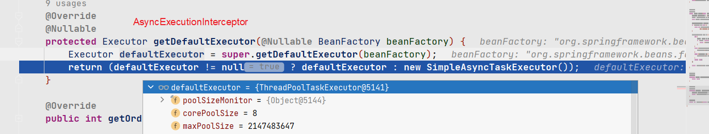


## 梳理杂项

### 元数据定义

AnnotatedTypeMetadata： 定义注解类型元信息的访问方法

ClassMetadata： 定义类的抽象元数据信息方法

AnnotationMetadata：

```
AnnotationMetadata extends ClassMetadata, AnnotatedTypeMetadata{}
```

TypeMappedAnnotations implements MergedAnnotations：


AnnotationFilter：用于过滤指定的注解类型

AttributeMethods： 用于访问注解的属性值


SimpleMetadataReader：

SimpleMetadataReader implements MetadataReader

基于ASM 实现的简单元数据读取


### AttributeMethods

> 提供以一致性顺序访问Annotation方法的快速路径和一些其他使用的方法

存储Annotation 的class对象，以及Annotation的所有method

主要封装注解的method信息

### RepeatableContainers

实现类：

StandardRepeatableContainers： 当前Annotation找不到，将使用parent查找

ExplicitRepeatableContainer： 显示映射，使用差不多

NoRepeatableContainers


### TypeMappedAnnotations

>  implements MergedAnnotations

AnnotationTypeMappings:
AnnotationTypeMapping：提供单个注解的映射信息


### **BeanDefinition定义**

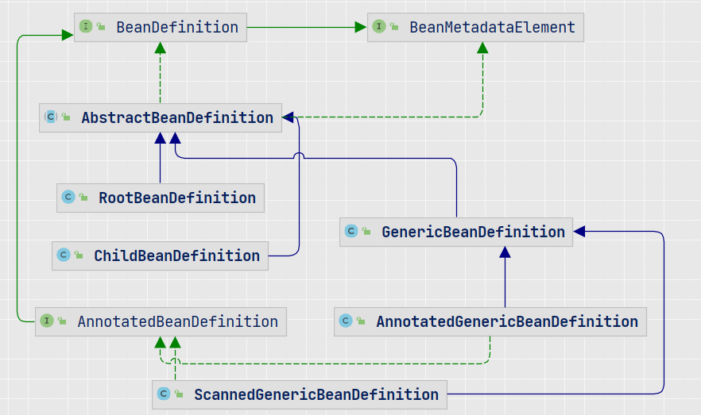


### AnnotationMetadata


### AnnotationAttributes

>

```java
public static AnnotationAttributes fromMap(@Nullable Map<String, Object> map) {
    if (map == null) {
        return null;
    }
    if (map instanceof AnnotationAttributes) {
        return (AnnotationAttributes) map;
    }
    return new AnnotationAttributes(map);
}
```

### AnnotationUtils

通用的注解工具类

```java
findAnnotation： 查找Annotation中的 注解类
getAnnotation：  得到Annotation    
```

### AnnotationConfigUtils

主要用于方便为 注解配置类注册BeanPostProcessor、BeanFactoryPostProcessor

定义了常用的Processor：

```java
internalAutowiredAnnotationProcessor、
    internalRequiredAnnotationProcessor、
    internalCommonAnnotationProcessor
```


registerAnnotationConfigProcessors(registry)：  为registry 注册所有相关的PostProcessor

主要就是将上面定义的Processor 封装为BeanDefinition，然后添加到registry


### ConditionEvaluator

> shouldSkip

```java
public boolean shouldSkip(@Nullable AnnotatedTypeMetadata metadata, @Nullable ConfigurationPhase phase) {
   if (metadata == null || !metadata.isAnnotated(Conditional.class.getName())) {
      return false;
   }

   if (phase == null) {
      if (metadata instanceof AnnotationMetadata &&
            ConfigurationClassUtils.isConfigurationCandidate((AnnotationMetadata) metadata)) {
         return shouldSkip(metadata, ConfigurationPhase.PARSE_CONFIGURATION);
      }
      return shouldSkip(metadata, ConfigurationPhase.REGISTER_BEAN);
   }

   List<Condition> conditions = new ArrayList<>();
   for (String[] conditionClasses : getConditionClasses(metadata)) {
      for (String conditionClass : conditionClasses) {
         Condition condition = getCondition(conditionClass, this.context.getClassLoader());
         conditions.add(condition);
      }
   }

   AnnotationAwareOrderComparator.sort(conditions);

   for (Condition condition : conditions) {
      ConfigurationPhase requiredPhase = null;
      if (condition instanceof ConfigurationCondition) {
         requiredPhase = ((ConfigurationCondition) condition).getConfigurationPhase();
      }
      if ((requiredPhase == null || requiredPhase == phase) && !condition.matches(this.context, metadata)) {
         return true;
      }
   }

   return false;
}
```


### AnnotationScopeMetadataResolver

> resolveScopeMetadata

```java
public ScopeMetadata resolveScopeMetadata(BeanDefinition definition) {
   ScopeMetadata metadata = new ScopeMetadata();
   if (definition instanceof AnnotatedBeanDefinition) {
      AnnotatedBeanDefinition annDef = (AnnotatedBeanDefinition) definition;
      AnnotationAttributes attributes = AnnotationConfigUtils.attributesFor(
            annDef.getMetadata(), this.scopeAnnotationType);
      if (attributes != null) {
         metadata.setScopeName(attributes.getString("value"));
         ScopedProxyMode proxyMode = attributes.getEnum("proxyMode");
         if (proxyMode == ScopedProxyMode.DEFAULT) {
            proxyMode = this.defaultProxyMode;
         }
         metadata.setScopedProxyMode(proxyMode);
      }
   }
   return metadata;
}
```

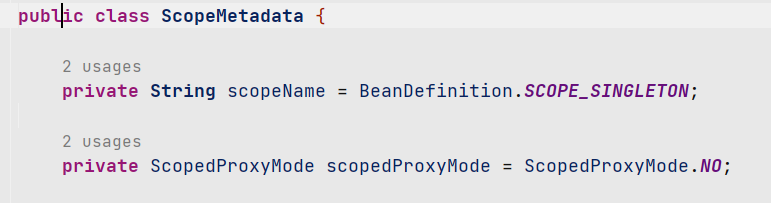


### 类扫描

> 基于XML

```

```


> 基于注解

AnnotationConfigApplicationContext#register：

```java
this.reader = new AnnotatedBeanDefinitionReader(this);
this.scanner = new ClassPathBeanDefinitionScanner(this);


AnnotatedBeanDefinitionReader#doRegisterBean(beanClass)
```


AnnotationConfigApplicationContext#scan(basePackages…):

```java
ClassPathBeanDefinitionScanner#doScan:
   ClassPathScanningCandidateComponentProvider.class#scanCandidateComponents
     isCandidateComponent(metadataReader): 
	 是否存在@Component注解， 是的话创建ScannedGenericBeanDefinition
   执行postProcessBeanDefinition，对BeanDefinition设置一些默认值
   执行AnnotationConfigUtils.processCommonDefinitionAnnotations： 看是否有Lazy、Primary、DependsOn、Role注解 
         
    注册BeanDefinition到BeanDefinitionRegistry(DefaultListableBeanFactory)
```

### ImportBeanDefinitionRegistrar

> 在处理@Configuration 类时，能够注册附加的BeanDefinition。与@Configuration 和 ImportSelector一起使用， 这个类可以提供给@Import 注解使用。
>
> 常见的实现：AOP 中的AutoProxyRegistrar

CachingConfigurationSelector extends AdviceModeImportSelector implements ImportSelector

调用链路：ConfigurationClassParse –>  AdviceModeImportSelector#selectImports
