Spring极客时间


# Spring 应用上下文生命周期

​	

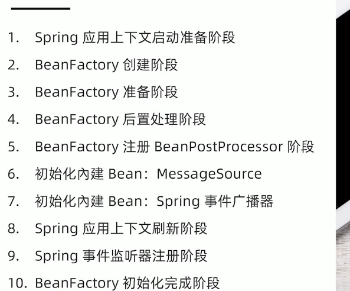

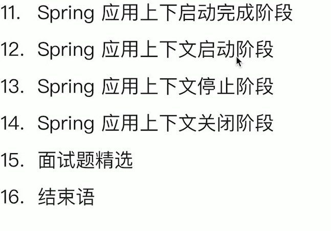

### 初始化ApplicationContext

> 如果采用XML初始化，将在refresh() 方法中进行初始化下面的Processor

AnnotationConfigApplicationContext：构造中会初始化

```java
public AnnotationConfigApplicationContext() {
		this.reader = new AnnotatedBeanDefinitionReader(this);
		this.scanner = new ClassPathBeanDefinitionScanner(this);
}
public AnnotationConfigApplicationContext(Class<?>... componentClasses) {
    this();
    register(componentClasses); // 注册启动配置类的BeanDefinition
    refresh(); // 执行核心方法
}
```

AnnotatedBeanDefinitionReader： 构造方法中会注册一些Processor 的beanDefinition

内部会执行：AnnotationConfigUtils.registerAnnotationConfigProcessors(this.registry);

BeanName格式：internalxxx

```text
ConfigurationClassPostProcessor; implement BeanDefinitionRegistryPostProcessor 
			会解析启动类中的@Scan， @Import。。。。
			                name： internalConfigurationAnnotationProcessor
AutowiredAnnotationBeanPostProcessor： 解析bean 中的@Autowire
CommonAnnotationBeanPostProcessor： 解析bean 中的@Lazy
EventListenerMethodProcessor
DefaultEventListenerFactory
```


#### ConfigurationClassPostProcessor

> 用于解析配置类的后置处理器

此时的Registry 通常为DefaultListableBeanFactory， 内部的BeanDefinitionNames如下： internalxxx + 配置类

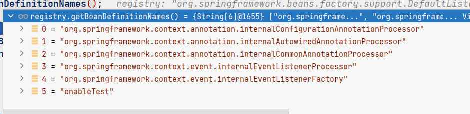

##### postProcessBeanDefinitionRegistry

ConfigurationClassPostProcessor#postProcessBeanDefinitionRegistry

```java
// registry: 通常为DefaultListableBeanFactory
public void postProcessBeanDefinitionRegistry(BeanDefinitionRegistry registry) {
   int registryId = System.identityHashCode(registry);
   this.registriesPostProcessed.add(registryId);
   processConfigBeanDefinitions(registry);
}
```

processConfigBeanDefinitions：

```java
public void processConfigBeanDefinitions(BeanDefinitionRegistry registry) {
   List<BeanDefinitionHolder> configCandidates = new ArrayList<>();
   String[] candidateNames = registry.getBeanDefinitionNames();
	// 遍历所有BeanDefinition，找到属于配置类的BeanDefinition
    // 配置类：有属性CONFIGURATION_CLASS_ATTRIBUTE
    // 	 或者有注解： @Import、@Component、@ImportResource、@ComponentScan、@Bean 方法， 如果有这些注解，会为BeanDefinition加上 CONFIGURATION_CLASS_ATTRIBUTE 属性
   for (String beanName : candidateNames) {
      BeanDefinition beanDef = registry.getBeanDefinition(beanName);
      if (beanDef.getAttribute(ConfigurationClassUtils.CONFIGURATION_CLASS_ATTRIBUTE) != null) {
         if (logger.isDebugEnabled()) {
            logger.debug("Bean definition has already been processed as a configuration class: " + beanDef);
         }
      }
       // 是否符合配置类的
      else if (ConfigurationClassUtils.checkConfigurationClassCandidate(beanDef, this.metadataReaderFactory)) {
         configCandidates.add(new BeanDefinitionHolder(beanDef, beanName));
      }
   }

   // Return immediately if no @Configuration classes were found
   if (configCandidates.isEmpty()) {
      return;
   }

   // Sort by previously determined @Order value, if applicable
   configCandidates.sort((bd1, bd2) -> {
      int i1 = ConfigurationClassUtils.getOrder(bd1.getBeanDefinition());
      int i2 = ConfigurationClassUtils.getOrder(bd2.getBeanDefinition());
      return Integer.compare(i1, i2);
   });

   // 检查BeanName 生成策略是否存在
   SingletonBeanRegistry sbr = null;
   if (registry instanceof SingletonBeanRegistry) {
      sbr = (SingletonBeanRegistry) registry;
      if (!this.localBeanNameGeneratorSet) {
         BeanNameGenerator generator = (BeanNameGenerator) sbr.getSingleton(
               AnnotationConfigUtils.CONFIGURATION_BEAN_NAME_GENERATOR);
         if (generator != null) {
            this.componentScanBeanNameGenerator = generator;
            this.importBeanNameGenerator = generator;
         }
      }
   }

   if (this.environment == null) {
      this.environment = new StandardEnvironment();
   }

   // 用于解析配置类
   ConfigurationClassParser parser = new ConfigurationClassParser(
         this.metadataReaderFactory, this.problemReporter, this.environment,
         this.resourceLoader, this.componentScanBeanNameGenerator, registry);

   Set<BeanDefinitionHolder> candidates = new LinkedHashSet<>(configCandidates);
   Set<ConfigurationClass> alreadyParsed = new HashSet<>(configCandidates.size());
    
    // 循环解析上面过滤出来的配置类
   do {
      parser.parse(candidates);
      parser.validate();
	 // 得到当前配置类中包含的一些配置信息，如@Import...
      Set<ConfigurationClass> configClasses = new LinkedHashSet<>(parser.getConfigurationClasses());
      configClasses.removeAll(alreadyParsed);

      // Read the model and create bean definitions based on its content
      if (this.reader == null) {
         this.reader = new ConfigurationClassBeanDefinitionReader(
               registry, this.sourceExtractor, this.resourceLoader, this.environment,
               this.importBeanNameGenerator, parser.getImportRegistry());
      }
      this.reader.loadBeanDefinitions(configClasses);
      alreadyParsed.addAll(configClasses);

      candidates.clear();
       // 在loadBeanDefinitions 方法中可能会调用@Import 注册的类相关方法，可能会手动注册BeanDefinition到registry
      if (registry.getBeanDefinitionCount() > candidateNames.length) {
         String[] newCandidateNames = registry.getBeanDefinitionNames();
         Set<String> oldCandidateNames = new HashSet<>(Arrays.asList(candidateNames));
         Set<String> alreadyParsedClasses = new HashSet<>();
         for (ConfigurationClass configurationClass : alreadyParsed) {
            alreadyParsedClasses.add(configurationClass.getMetadata().getClassName());
         }
         for (String candidateName : newCandidateNames) {
            if (!oldCandidateNames.contains(candidateName)) {
               BeanDefinition bd = registry.getBeanDefinition(candidateName);
                // 检查新注册的BeanDefinition 是否是一个配置类，如果是的话会继续该while
               if (ConfigurationClassUtils.checkConfigurationClassCandidate(bd, this.metadataReaderFactory) &&
                     !alreadyParsedClasses.contains(bd.getBeanClassName())) {
                  candidates.add(new BeanDefinitionHolder(bd, candidateName));
               }
            }
         }
         candidateNames = newCandidateNames;
      }
   }
   while (!candidates.isEmpty());

   // Register the ImportRegistry as a bean in order to support ImportAware @Configuration classes
    // 注册importRegistry BeanDefinition 为了让配置类支持 ImportAware 
   if (sbr != null && !sbr.containsSingleton(IMPORT_REGISTRY_BEAN_NAME)) {
      sbr.registerSingleton(IMPORT_REGISTRY_BEAN_NAME, parser.getImportRegistry());
   }

   if (this.metadataReaderFactory instanceof CachingMetadataReaderFactory) {
      // Clear cache in externally provided MetadataReaderFactory; this is a no-op
      // for a shared cache since it'll be cleared by the ApplicationContext.
      ((CachingMetadataReaderFactory) this.metadataReaderFactory).clearCache();
   }
}
```


##### postProcessBeanFactory

```java
public void postProcessBeanFactory(ConfigurableListableBeanFactory beanFactory) {
   int factoryId = System.identityHashCode(beanFactory);
   if (this.factoriesPostProcessed.contains(factoryId)) {
      throw new IllegalStateException(
            "postProcessBeanFactory already called on this post-processor against " + beanFactory);
   }
   this.factoriesPostProcessed.add(factoryId);
   if (!this.registriesPostProcessed.contains(factoryId)) {
      // BeanDefinitionRegistryPostProcessor hook apparently not supported...
      // Simply call processConfigurationClasses lazily at this point then.
      processConfigBeanDefinitions((BeanDefinitionRegistry) beanFactory);
   }
// 是否有需要增强的BeanDefinition，即创建代理
   enhanceConfigurationClasses(beanFactory);
// 添加BeanPostProcessor：ImportAwareBeanPostProcessor
   beanFactory.addBeanPostProcessor(new ImportAwareBeanPostProcessor(beanFactory));
}
```


#### ConfigurationClassParser

##### parse

```java
public void parse(Set<BeanDefinitionHolder> configCandidates) {
   for (BeanDefinitionHolder holder : configCandidates) {
      BeanDefinition bd = holder.getBeanDefinition();
      try {
          // 注解类型
         if (bd instanceof AnnotatedBeanDefinition) {
            parse(((AnnotatedBeanDefinition) bd).getMetadata(), holder.getBeanName());
         }
         else if (bd instanceof AbstractBeanDefinition && ((AbstractBeanDefinition) bd).hasBeanClass()) {
            parse(((AbstractBeanDefinition) bd).getBeanClass(), holder.getBeanName());
         }
         else {
            parse(bd.getBeanClassName(), holder.getBeanName());
         }
      }
   }
   this.deferredImportSelectorHandler.process();
}
```


```java
protected final void parse(AnnotationMetadata metadata, String beanName) throws IOException {
   processConfigurationClass(new ConfigurationClass(metadata, beanName));
}
protected void processConfigurationClass(ConfigurationClass configClass) throws IOException {
    // 判断是否解析， 内部会判断Conditional 注解
    if (this.conditionEvaluator.shouldSkip(configClass.getMetadata(), ConfigurationPhase.PARSE_CONFIGURATION)) {
        return;
    }

    ConfigurationClass existingClass = this.configurationClasses.get(configClass);
    // 检查是否以及处理过该配置类
    if (existingClass != null) {
        if (configClass.isImported()) {
            if (existingClass.isImported()) {
                existingClass.mergeImportedBy(configClass);
            }
            // Otherwise ignore new imported config class; existing non-imported class overrides it.
            return;
        }
        else {
            // Explicit bean definition found, probably replacing an import.
            // Let's remove the old one and go with the new one.
            this.configurationClasses.remove(configClass);
            this.knownSuperclasses.values().removeIf(configClass::equals);
        }
    }

    // 递归处理配置类以及父类，SourceClass：包含configClass 的元信息
    // 最终会将该配置类中的所有相关配置信息，如 @Import等 都保存到configClass中
    SourceClass sourceClass = asSourceClass(configClass);
    do {
        sourceClass = doProcessConfigurationClass(configClass, sourceClass);
    }
    while (sourceClass != null);

    this.configurationClasses.put(configClass, configClass);
}
```

##### doProcessConfigurationClass

相关注解都是在这里进行解析

> 通过读取SourceClass中的注解，方法，成员，构建一个完整的ConfigurationClass对象。当发现多个相关的source时可以多次调用

```java
protected final SourceClass doProcessConfigurationClass(ConfigurationClass configClass, SourceClass sourceClass)
    throws IOException {
	// 解析@Component
    if (configClass.getMetadata().isAnnotated(Component.class.getName())) {
        // Recursively process any member (nested) classes first
        processMemberClasses(configClass, sourceClass);
    }

    // Process any @PropertySource annotations
    for (AnnotationAttributes propertySource : AnnotationConfigUtils.attributesForRepeatable(
        sourceClass.getMetadata(), PropertySources.class,
        org.springframework.context.annotation.PropertySource.class)) {
        if (this.environment instanceof ConfigurableEnvironment) {
            processPropertySource(propertySource);
        }
        else {
            logger.info("Ignoring @PropertySource annotation on [" + sourceClass.getMetadata().getClassName() +
                        "]. Reason: Environment must implement ConfigurableEnvironment");
        }
    }

    // Process any @ComponentScan annotations
    Set<AnnotationAttributes> componentScans = AnnotationConfigUtils.attributesForRepeatable(
        sourceClass.getMetadata(), ComponentScans.class, ComponentScan.class);
    if (!componentScans.isEmpty() &&
        !this.conditionEvaluator.shouldSkip(sourceClass.getMetadata(), ConfigurationPhase.REGISTER_BEAN)) {
        for (AnnotationAttributes componentScan : componentScans) {
            // The config class is annotated with @ComponentScan -> perform the scan immediately
            Set<BeanDefinitionHolder> scannedBeanDefinitions =
                this.componentScanParser.parse(componentScan, sourceClass.getMetadata().getClassName());
            // Check the set of scanned definitions for any further config classes and parse recursively if needed
            for (BeanDefinitionHolder holder : scannedBeanDefinitions) {
                BeanDefinition bdCand = holder.getBeanDefinition().getOriginatingBeanDefinition();
                if (bdCand == null) {
                    bdCand = holder.getBeanDefinition();
                }
                if (ConfigurationClassUtils.checkConfigurationClassCandidate(bdCand, this.metadataReaderFactory)) {
                    parse(bdCand.getBeanClassName(), holder.getBeanName());
                }
            }
        }
    }

    // Process any @Import annotations
    // getImports(): 递归收集当前configClass中的所有@Import 注解信息，得到value信息
    processImports(configClass, sourceClass, getImports(sourceClass), true);

    // Process any @ImportResource annotations
    AnnotationAttributes importResource =
        AnnotationConfigUtils.attributesFor(sourceClass.getMetadata(), ImportResource.class);
    if (importResource != null) {
        String[] resources = importResource.getStringArray("locations");
        Class<? extends BeanDefinitionReader> readerClass = importResource.getClass("reader");
        for (String resource : resources) {
            String resolvedResource = this.environment.resolveRequiredPlaceholders(resource);
            configClass.addImportedResource(resolvedResource, readerClass);
        }
    }

    // Process individual @Bean methods
    Set<MethodMetadata> beanMethods = retrieveBeanMethodMetadata(sourceClass);
    for (MethodMetadata methodMetadata : beanMethods) {
        configClass.addBeanMethod(new BeanMethod(methodMetadata, configClass));
    }

    // Process default methods on interfaces
    processInterfaces(configClass, sourceClass);

    // Process superclass, if any
    if (sourceClass.getMetadata().hasSuperClass()) {
        String superclass = sourceClass.getMetadata().getSuperClassName();
        if (superclass != null && !superclass.startsWith("java") &&
            !this.knownSuperclasses.containsKey(superclass)) {
            this.knownSuperclasses.put(superclass, configClass);
            // Superclass found, return its annotation metadata and recurse
            return sourceClass.getSuperClass();
        }
    }

    // No superclass -> processing is complete
    return null;
}
```


##### processImports

> 处理Import 注解中的值，会根据@Import 中的类是 ImportSelector、ImportBeanDefinitionRegistrar 执行不同的逻辑

```java
private void processImports(ConfigurationClass configClass, SourceClass currentSourceClass,
      Collection<SourceClass> importCandidates, boolean checkForCircularImports) {

   if (importCandidates.isEmpty()) {
      return;
   }

   if (checkForCircularImports && isChainedImportOnStack(configClass)) {
      this.problemReporter.error(new CircularImportProblem(configClass, this.importStack));
   }
   else {
      this.importStack.push(configClass);
      try {
         for (SourceClass candidate : importCandidates) {
             // 是ImportSelector的子类
            if (candidate.isAssignable(ImportSelector.class)) {
               // Candidate class is an ImportSelector -> delegate to it to determine imports
               Class<?> candidateClass = candidate.loadClass();
               ImportSelector selector = ParserStrategyUtils.instantiateClass(candidateClass, ImportSelector.class,
                     this.environment, this.resourceLoader, this.registry);
               if (selector instanceof DeferredImportSelector) {
                  this.deferredImportSelectorHandler.handle(configClass, (DeferredImportSelector) selector);
               }
               else {	
// 调用目标方法，返回数组，递归继续处理返回的类
String[] importClassNames = selector.selectImports(currentSourceClass.getMetadata());
Collection<SourceClass> importSourceClasses = asSourceClasses(importClassNames);
// 返回的类中也许还有@Import 注解，进行递归
processImports(configClass, currentSourceClass, importSourceClasses, false);
               }
            }
             
             
            else if (candidate.isAssignable(ImportBeanDefinitionRegistrar.class)) {
// Candidate class is an ImportBeanDefinitionRegistrar ->
// delegate to it to register additional bean definitions
Class<?> candidateClass = candidate.loadClass();
// 实例化对象                
ImportBeanDefinitionRegistrar registrar =
     ParserStrategyUtils.instantiateClass(candidateClass, ImportBeanDefinitionRegistrar.class,
           this.environment, this.resourceLoader, this.registry);
    // 保存到configClass 的importBeanDefinitionRegistrars中
configClass.addImportBeanDefinitionRegistrar(registrar, currentSourceClass.getMetadata());
            }
            else {
               // Candidate class not an ImportSelector or ImportBeanDefinitionRegistrar ->
               // process it as an @Configuration class
               this.importStack.registerImport(
                     currentSourceClass.getMetadata(), candidate.getMetadata().getClassName());
               processConfigurationClass(candidate.asConfigClass(configClass));
            }
         }
      }
      catch (BeanDefinitionStoreException ex) {
         throw ex;
      }
      catch (Throwable ex) {
         throw new BeanDefinitionStoreException(
               "Failed to process import candidates for configuration class [" +
               configClass.getMetadata().getClassName() + "]", ex);
      }
      finally {
         this.importStack.pop();
      }
   }
}
```


##### retrieveBeanMethodMetadata

> 查找 @Bean method， 这里会使用ASM 来保证方法的顺序性，JDK 的反射默认是无序

```java
private Set<MethodMetadata> retrieveBeanMethodMetadata(SourceClass sourceClass) {
    AnnotationMetadata original = sourceClass.getMetadata();
    Set<MethodMetadata> beanMethods = original.getAnnotatedMethods(Bean.class.getName());
    if (beanMethods.size() > 1 && original instanceof StandardAnnotationMetadata) {
        // Try reading the class file via ASM for deterministic declaration order...
        // Unfortunately, the JVM's standard reflection returns methods in arbitrary
        // order, even between different runs of the same application on the same JVM.
        try {
            AnnotationMetadata asm =
                this.metadataReaderFactory.getMetadataReader(original.getClassName()).getAnnotationMetadata();
            Set<MethodMetadata> asmMethods = asm.getAnnotatedMethods(Bean.class.getName());
            if (asmMethods.size() >= beanMethods.size()) {
                Set<MethodMetadata> selectedMethods = new LinkedHashSet<>(asmMethods.size());
                for (MethodMetadata asmMethod : asmMethods) {
                    for (MethodMetadata beanMethod : beanMethods) {
                        if (beanMethod.getMethodName().equals(asmMethod.getMethodName())) {
                            selectedMethods.add(beanMethod);
                            break;
                        }
                    }
                }
                if (selectedMethods.size() == beanMethods.size()) {
                    // All reflection-detected methods found in ASM method set -> proceed
                    beanMethods = selectedMethods;
                }
            }
        }
        catch (IOException ex) {
            logger.debug("Failed to read class file via ASM for determining @Bean method order", ex);
            // No worries, let's continue with the reflection metadata we started with...
        }
    }
    return beanMethods;
}
```


##### ConfigurationClassBeanDefinitionReader#loadBeanDefinitions

> 将ConfigurationClass 中相关的BeanDefinition 进行注册

```java
public void loadBeanDefinitions(Set<ConfigurationClass> configurationModel) {
   TrackedConditionEvaluator trackedConditionEvaluator = new TrackedConditionEvaluator();
   for (ConfigurationClass configClass : configurationModel) {
      loadBeanDefinitionsForConfigurationClass(configClass, trackedConditionEvaluator);
   }
}
private void loadBeanDefinitionsForConfigurationClass(
    ConfigurationClass configClass, TrackedConditionEvaluator trackedConditionEvaluator) {
	// 检查Condition条件
    if (trackedConditionEvaluator.shouldSkip(configClass)) {
        String beanName = configClass.getBeanName();
        if (StringUtils.hasLength(beanName) && this.registry.containsBeanDefinition(beanName)) {
            this.registry.removeBeanDefinition(beanName);
        }
        this.importRegistry.removeImportingClass(configClass.getMetadata().getClassName());
        return;
    }
	// 是否已经被注册
    if (configClass.isImported()) {
        registerBeanDefinitionForImportedConfigurationClass(configClass);
    }
    for (BeanMethod beanMethod : configClass.getBeanMethods()) {
        loadBeanDefinitionsForBeanMethod(beanMethod);
    }
	// 处理importedResource
    loadBeanDefinitionsFromImportedResources(configClass.getImportedResources());
   // 处理ImportBeanDefinitionRegistrar loadBeanDefinitionsFromRegistrars(configClass.getImportBeanDefinitionRegistrars());
}
```

##### loadBeanDefinitionsFromRegistrars

> 处理ImportBeanDefinitionRegistrar， 调用目标方法

```java
private void loadBeanDefinitionsFromRegistrars(Map<ImportBeanDefinitionRegistrar, AnnotationMetadata> registrars) {
   registrars.forEach((registrar, metadata) ->
         registrar.registerBeanDefinitions(metadata, this.registry, this.importBeanNameGenerator));
}
```


AbstractApplicationContext.java#refresh()

### prepareRefresh()

- 设置启动时间、状态
- 初始化 PropertySources - initPropertySources()
- 校验Environment 中的必须属性
- 初始化事件监听器集合， applicationListeners.add(earlyApplication**Listeners**)
- 初始化早期Spring 事件集合  earlyApplication**Events** = null


### obtainFreshBeanFactory

> 让子类刷新内部BeanFactory，
>
> GenericApplicationContext or AbstractRefreshableApplicationContext

- 刷新Spring 应用上下文 底层BeanFactory -- refreshBeanFactory()
  - GenericApplicationContext ： 适用于Annotation加载，主要 设置refresh 状态、serializationId
    - 由于 AnnotationConfigApplicationContext extends GenericApplicationContext，因此在初始化AnnotationConfigApplicationContext 对象时，会调用GenericApplicationContext构造，构造方法内会初始化**DefaultListableBeanFactory**
  - AbstractRefreshableApplicationContext:  适用于XML 加载
    - 如果存在BeanFactory，销毁
    - 创建BeanFactory: DefaultListableBeanFactory, 设置Id
    - customizeBeanFactory： 设置是否允许bean重复定义，循环引用
    - loadBeanDefinitions：加载BeanDefinition，
      ---> AbstractBeanDefinitionReader#loadBeanDefinition
- 返回Spring 应用上下文 getBeanFactory()，**DefaultListableBeanFactory**


### prepareBeanFactory

> 应用当前Context对象的信息到上面生成的BeanFactory中，就是对BeanFactory 注册一些信息

- 关联ClassLoader

- 设置Bean表达式处理器: StandardBeanExpressionResolver

- 添加PropertyEditorRegistrar: ResourceEditorRegistrar

- 添加Aware回调接口(BeanPostProcessor)：ApplicationContextAwareProcessor

- 忽略Aware回调接口(ignoreDependencyInterface)：

  - ```
    EnvironmentAware
    EmbeddedValueResolverAware
    ResourceLoaderAware
    ApplicationEventPublisherAware
    MessageSourceAware
    ApplicationContextAware
    ```

- 注册ResolvableDependency（resolvableDependencies）：

  ```
  (BeanFactory.class, beanFactory);
  (ResourceLoader.class, this);
  (ApplicationEventPublisher.class, this)
  (ApplicationContext.class, this);
  ```

- 注册ApplicationListenerDetector （BeanPostProcessor）： 

  - 用于检测内部的ApplicationListenner， 记录BeanName (singletonNames)

- 判断是否注册LoadTimeWeaverAwareProcessor （BeanPostProcessor）：默认不会注册

- 注册BeanDefinition： environment、systemProperties(Java 参数)、systemEnvironment(OS 环境变量)


### postProcessBeanFactory

> 由子类覆盖。Servlet、Web

### invokeBeanFactoryPostProcessors

> **配置类的解析**会在这里进行
>
> 调用注册的Bean**Factory**PostProcessor 或BeanDefinitionRegistry的后置处理方法
>
> 内部会依赖查找BeanDefinitionRegistryPostProcessor类型
>
> ​              如：internalConfigurationAnnotationProcessor

1. 依赖查找BeanDefinitionRegistryPostProcessor类型的Bean，依次执行postProcessBeanDefinitionRegistry :
   - 先执行实现PriorityOrdered
   - 执行Ordered
   - 执行剩下的
2. 由于BeanDefinitionRegistryPostProcessor 继承了**BeanFactoryPostProcessor**，继续执行其方法：BeanFactoryPostProcessor#postProcessBeanFactory
3. 依赖查找BeanFactoryPostProcessor类型的bean，依次执行下面bean的postProcessBeanFactory
   - 执行实现了PriorityOrdered
   - Ordered
   - 其他


- PostProcessorRegistrationDelegate.invokeBeanFactoryPostProcessors

  - invokeBeanDefinitionRegistryPostProcessors：ConfigurationClassPostProcessor#processConfigBeanDefinitions：处理配置类

    创建**ConfigurationClassParser**， 调用parse(configClass)–> processConfigurationClass 

    –> doProcessConfigurationClass (处理@ComponentScan、@Import、@ImportResource、@Bean)

    --> ComponentScanAnnotationParser#parse(): 处理basePackages中的值，注册BeanDefinition

  - 在处理@Bean时，首先会采用ASM读取所有方法(由于Java反射读取没有顺序），然后按照ASM顺序得到的方法顺序得到反射得到的方法对象，得到一个一个的BeanMethod

  - ```java
    ConfigurationClassParser#configurationClasses
    
    ConfigurationClassBeanDefinitionReader#loadBeanDefinitions： 处理扫描到的类中是否有@imported、 @Bean method
    
    通过代码可以看出 @Bean method 以方法名作为beanName
    @Bean method 转换为 ConfigurationClassBeanDefinition (extends 	  RootBeanDefinition)
    ```

    

- 注册LoadTimeWeaverAwareProcessor （loadTimeWeaver beanName存在）


### registerBeanPostProcessors

> 注册beanPostProcessor （前面是BeanFactoryPostProcessor），用来拦截Bean 创建过程

将BeanPostProcessor类型的BeanDefinition 进行相应的排序，并注册到BeanFactory.beanPostProcessors

- 注册PriorityOrdered 类型 BeanPostProcessor
- 注册Ordered类型
- 注册普通 BeanPostProcessor
- 注册MergedBeanDefinitionPostProcessor 类型：internalPostProcessors
  - AutowiredAnnotationBeanPostProcessor
  - CommonAnnotationBeanPostProcessor
- 再次注册ApplicationListenerDetector（前面已经注册过），作为BeanPostProcessor的末端


### initMessageSource

> 初始化上下文的MessageSource对象

默认会使用空的MessageSource接受getMessage调用 （DelegatingMessageSource）

注册该对象到beanFactory（beanName：messageSource）


### initApplicationEventMulticaster

> 初始化事件广播器

默认会创建SimpleApplicationEventMulticaster 作为applicationEventMulticaster，并注册到BeanFactory


### onRefresh

> 在特定上下文子类中初始化其他bean

- 子类覆盖：

  - AbstractRefreshableWebApplicationContext
  - GenericWebApplicationContext
  - ServletWebServerApplicationContext： 创建WebServer：tomcat，jetty…
  - ReactiveWebServer…
  - StaticWeb…

  

### registerListeners

- 添加当前上下文关联的ApplicationListener 对象 (前面提到的早期Listener)
- 添加BeanFactory中注册的ApplicationListener BeanDefinition （这里是添加BeanName）
- 广播早期Spring 事件， 如果第二部添加了BeanName，这里可能会进行初始化对象


### finishBeanFactoryInitialization

> 实例化所有的单例bean

- BeanFactory 关联ConversionService Bean（如果存在的话）
- 添加StringValueResolver对象， 主要用于解析注解中的placeholder( ${xx})
- 查找LoadTimeWeaverAware Bean， 进行初始化
- 临时ClassLoader 设置为null
- 冻结BeanFactory配置
- **preInstantiateSingletons**： 实例化所有的非延迟加载的单例Bean


# Spring 核心源码分析

ApplicationContext： 作为一个全局的应用上下文，对外提供了BeanFactory的方法（因为实现了BeanFactory），底层核心逻辑由内部BeanFactory实现（**DefaultListableBeanFactory**）。


SpringBoot 中使用：AnnotationConfigServletWebServerApplicationContext

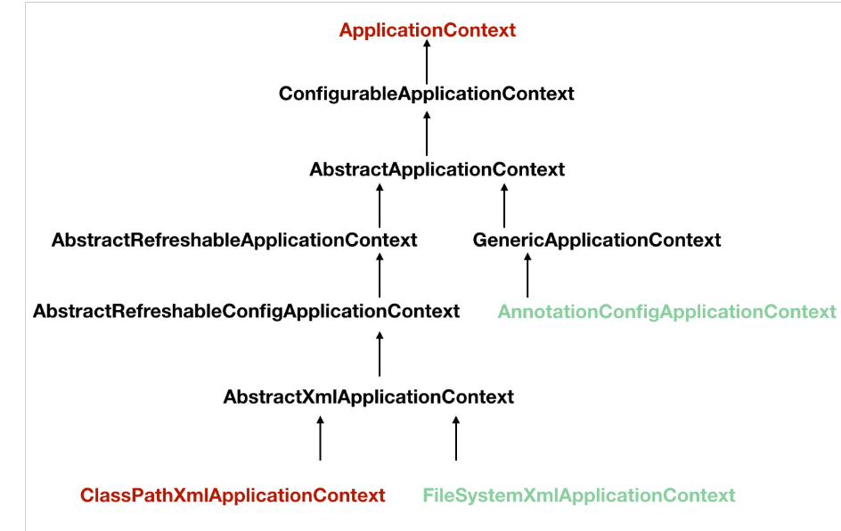


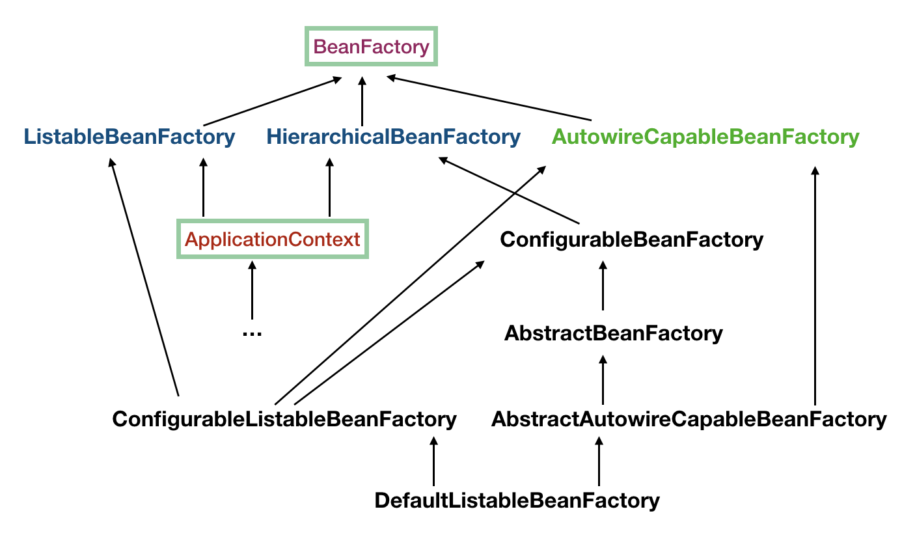

所有的BeanDefinition信息都在  DefaultListableBeanFactory类中

（extend DefaultSingletonBeanRegistry ， impl BeanDefinitionRegistry）


DefaultSingletonBeanRegistry类中保存了所有的单例Bean对象


## Bean构造流程

> Spring 不能解决构造注入的循环依赖问题，可以使用@Lazy注解解决


AbstractApplicationContext # refresh()

​     —– >   finishBeanFactoryInitialization() 对我们编写的bean包括Spring内置的beanDefinition进行初始化，懒加载的bean除外


finishBeanFactoryInitialization()  中，调用beanFactory.preInstantiateSingletons()方法


DefaultListableBeanFactory.java # preInstantiateSingletons方法中，会通过for循环来遍历BeanDefinition信息

```java
for (String beanName : beanNames) {
			RootBeanDefinition bd = getMergedLocalBeanDefinition(beanName);  // 通过beanName 从Map中获取 RootBeanDefinition
			if (!bd.isAbstract() && bd.isSingleton() && !bd.isLazyInit()) {
				if (isFactoryBean(beanName)) {
					Object bean = getBean(FACTORY_BEAN_PREFIX + beanName);
					if (bean instanceof FactoryBean) {
						FactoryBean<?> factory = (FactoryBean<?>) bean;
						boolean isEagerInit;
						if (System.getSecurityManager() != null && factory instanceof SmartFactoryBean) {
							isEagerInit = AccessController.doPrivileged(
									(PrivilegedAction<Boolean>) ((SmartFactoryBean<?>) factory)::isEagerInit,
									getAccessControlContext());
						}
						else {
							isEagerInit = (factory instanceof SmartFactoryBean &&
									((SmartFactoryBean<?>) factory).isEagerInit());
						}
						if (isEagerInit) {
							getBean(beanName);
						}
					}
				}
				else {
					getBean(beanName);
				}
			}
		}
```


经过验证bean是否为FactoryBean， 然后将mergeBeanDefinitions中定义的RootBeanDefinition中的stale字段赋值为true，


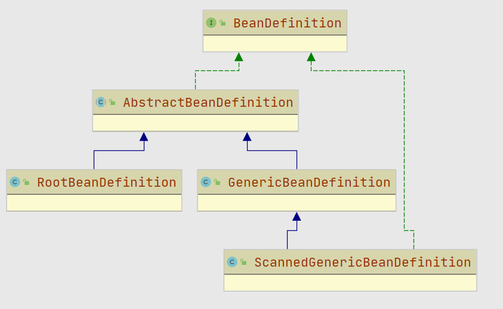

AbstractBeanFactory#getMergedBeanDefinition() 方法会将原来的rootBeanDefinition重新生成，不知道这里干啥

```java
RootBeanDefinition mbd = null;
RootBeanDefinition previous = null;

// Check with full lock now in order to enforce the same merged instance.
if (containingBd == null) {
    mbd = this.mergedBeanDefinitions.get(beanName);
}

if (mbd == null || mbd.stale) {
    previous = mbd;
    if (bd.getParentName() == null) {
        // Use copy of given root bean definition.
        if (bd instanceof RootBeanDefinition) {
            mbd = ((RootBeanDefinition) bd).cloneBeanDefinition();
        }
        else {
            // 这里会使用传入的BeanDefinition从新创建RootBeanDefinition
            mbd = new RootBeanDefinition(bd);
        }
    }
    else {
        ------
            // 将新的RootBeanDefinition放入mergeBeanDefinition中
            if (containingBd == null && isCacheBeanMetadata()) {
                this.mergedBeanDefinitions.put(beanName, mbd);
            }
    }

    if (previous != null) {
        // 将原来的rootBeanDefinition中的部分属性赋值到新生成的rootBeanDefinition中
        copyRelevantMergedBeanDefinitionCaches(previous, mbd);
    }
```


看其他方法

AbstractBeanFactory#doGetBean()


```java
// Create bean instance.
				if (mbd.isSingleton()) {
					sharedInstance = getSingleton(beanName, () -> {
						try {
							return createBean(beanName, mbd, args);
						}
						catch (BeansException ex) {
							// Explicitly remove instance from singleton cache: It might have been put there
							// eagerly by the creation process, to allow for circular reference resolution.
							// Also remove any beans that received a temporary reference to the bean.
							destroySingleton(beanName);
							throw ex;
						}
					});
					beanInstance = getObjectForBeanInstance(sharedInstance, name, beanName, mbd);
				}
```


createBean() — >   resolveBeanClass() — >   doResolveBeanClass() —- >  resolveBeanClass() 方法中会根据bean的className使用当前类加载器创建Class对象,

返回到createBean() 最终用resolvedClass接受， 貌似就紧跟下面的if 需要该变量


继续走resolveBeforeInstantiation() 方法里面 会判断是否需要执行`applyBeanPostProcessorsBeforeInstantiation` 以及`applyBeanPostProcessorsBeforeInstantiation`方法


继续在createBean()方法， 走向AbstractAutowireCapableBeanFactory#createBean() —>   doCreateBean() --> createBeanInstance()  —–>  instantiateBean()

调用getInstantialtionStrategy().instantiate() 方法进行实例化


在AutowireAnnotationBeanPostProcessor # buildAutowiringMetadata()  中会将@Autowired注解相关的信息放到List中使用InjectionMetadata包装进行返回

```
elements.addAll(0, currElements);
targetClass = targetClass.getSuperclass();
return InjectionMetadata.forElements(elements, clazz);
```

最终放到injectionMetadataCache中


回到doCreateBean() 方法：

```java
// 解决循环依赖问题
boolean earlySingletonExposure = (mbd.isSingleton() && this.allowCircularReferences &&
                                  isSingletonCurrentlyInCreation(beanName));
if (earlySingletonExposure) {
    // 核心： 先加入三级缓存
    addSingletonFactory(beanName, () -> getEarlyBeanReference(beanName, mbd, bean));
}
```


```java
// 前面只是实例化，并没有设置值，这里是为了设值
populateBean(beanName, mbd, instanceWrapper);
exposedObject = initializeBean(beanName, exposedObject, mbd);
```


```java
isAutowireCandidate()
     初始化B Class对象
    String bdName = BeanFactoryUtils.transformedBeanName(beanName)
   
    
    BeanDefinitionHolder holder = (beanName.equals(bdName) ?
                                   this.mergedBeanDefinitionHolders.computeIfAbsent(beanName,
                                                                                    key -> new BeanDefinitionHolder(mbd, beanName, getAliases(bdName))) :
                                   new BeanDefinitionHolder(mbd, beanName, getAliases(bdName)));
return resolver.isAutowireCandidate(holder, descriptor);
    
```


开始初始化B对象， 又会走到循环依赖代码

```java
// 解决循环依赖问题
boolean earlySingletonExposure = (mbd.isSingleton() && this.allowCircularReferences &&
                                  isSingletonCurrentlyInCreation(beanName));
if (earlySingletonExposure) {
    if (logger.isTraceEnabled()) {
        logger.trace("Eagerly caching bean '" + beanName +
                     "' to allow for resolving potential circular references");
    }
    addSingletonFactory(beanName, () -> getEarlyBeanReference(beanName, mbd, bean));
}
```


```java
# 创建A完成
```


getSingleton


### populate

```java
// Give any InstantiationAwareBeanPostProcessors the opportunity to modify the
		// state of the bean before properties are set. This can be used, for example,
		// to support styles of field injection.
		if (!mbd.isSynthetic() && hasInstantiationAwareBeanPostProcessors()) {
			for (InstantiationAwareBeanPostProcessor bp : getBeanPostProcessorCache().instantiationAware) {
				if (!bp.postProcessAfterInstantiation(bw.getWrappedInstance(), beanName)) {
					return;
				}
			}
		}
```


填充依赖的对象

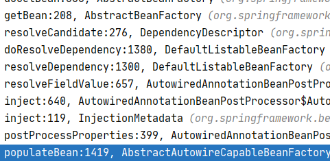

```java
for (InstantiationAwareBeanPostProcessor bp : getBeanPostProcessorCache().instantiationAware) {
    // 核心： 内部会注入属性
    PropertyValues pvsToUse = bp.postProcessProperties(pvs, bw.getWrappedInstance(), beanName);
    if (pvsToUse == null) {
        if (filteredPds == null) {
            filteredPds = filterPropertyDescriptorsForDependencyCheck(bw, mbd.allowCaching);
        }
        pvsToUse = bp.postProcessPropertyValues(pvs, filteredPds, bw.getWrappedInstance(), beanName);
        if (pvsToUse == null) {
            return;
        }
    }
    pvs = pvsToUse;
}
```


#### **getSingleton**

```java
protected Object getSingleton(String beanName, boolean allowEarlyReference) {
    //先去一级缓存拿。新创建的bean，这里一定拿不到
    Object singletonObject = this.singletonObjects.get(beanName);
    //拿不到初始化完成的bean，且该bean正在被创建中
    if (singletonObject == null && isSingletonCurrentlyInCreation(beanName)) {
        synchronized (this.singletonObjects) {
            //优先去二级缓存拿，如果没有再去三级缓存拿。有了，就直接返回。
            singletonObject = this.earlySingletonObjects.get(beanName);
            if (singletonObject == null && allowEarlyReference) {
                //最后一步，去三级缓存拿
                ObjectFactory<?> singletonFactory = this.singletonFactories.get(beanName);
                if (singletonFactory != null) {
                    //调用三级缓存ObjectFactory的getObject得到提前暴露的对象。
                    singletonObject = singletonFactory.getObject();
                    //放到二级缓存中，然后删除三级缓存。可见：同一个提前暴露的bean，只能要么在三级缓存，要么在二级缓存。
                    this.earlySingletonObjects.put(beanName, singletonObject);
                    this.singletonFactories.remove(beanName);
                }
            }
        }
    }
    return (singletonObject != NULL_OBJECT ? singletonObject : null);
}
```


#### 初始化

```java
// 填充属性在上面已经完成
populateBean(beanName, mbd, instanceWrapper);
// 这里面进行执行Aware接口， 以及BeanPostProcessor
exposedObject = initializeBean(beanName, exposedObject, mbd);
```


```java
protected Object initializeBean(String beanName, Object bean, @Nullable RootBeanDefinition mbd) {
    if (System.getSecurityManager() != null) {
    }
    else {
        // 这里执行实现了Aware的接口
        invokeAwareMethods(beanName, bean);
    }

    Object wrappedBean = bean;
    if (mbd == null || !mbd.isSynthetic()) {
        // 执行BeanPostProcessor# Before
        wrappedBean = applyBeanPostProcessorsBeforeInitialization(wrappedBean, beanName);
    }

    try {
        // 调用初始化方法
        invokeInitMethods(beanName, wrappedBean, mbd);
    }
    catch (Throwable ex) {
        throw new BeanCreationException(
            (mbd != null ? mbd.getResourceDescription() : null),
            beanName, "Invocation of init method failed", ex);
    }
    if (mbd == null || !mbd.isSynthetic()) {
        // 执行BeanPostProcessor# Before
        wrappedBean = applyBeanPostProcessorsAfterInitialization(wrappedBean, beanName);
    }

    return wrappedBean;
}
```


### finishRefresh

- 清除ResourceLoader 缓存  
- 初始化LifecycleProcessor对象
- 调用LifecycleProcessor#onRefresh方法
- 发布Spring应用上下文已刷新事件：ContextRefreshedEvent
- 向MBeanServer 托管Live Beans

## @Autowired

> 相似的注解：@Resource
>
> CommonAnnotationBeanPostProcessor： 处理@Resource （先于@Autowired处理）
>
> AutowiredAnnotationBeanPostProcessor：@Autowired，@Value

@Resource： - 

- 默认名称为变量名，默认类型为定义的类型
- 如果指定了名称，则采用名称查找(getBean(name))，否则使用类型查找（resolveDependency）

@Autowired：

- 使用类型查找：resolveDependency


resolveDependency： 会处理@Value，@Qualifier， @Primary


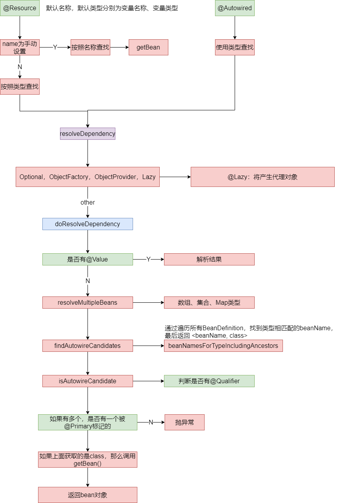


### populateBean前：

提前解析出class中持有的@Autowired 属性信息

> 核心：
>
> AbstractAutowireCapableBeanFactory#applyMergedBeanDefinitionPostProcessors  
>
> ————–>  AutowiredAnnotationBeanPostProcessor#`postProcessMergedBeanDefinition`

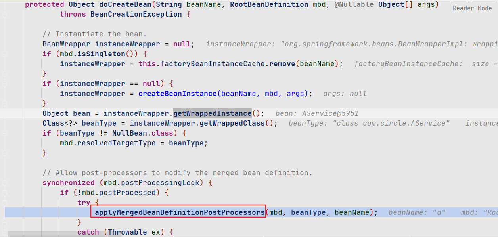


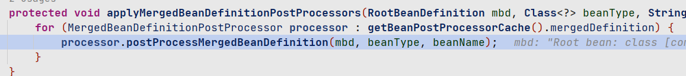

进入AutowiredAnnotationBeanPostProcessor

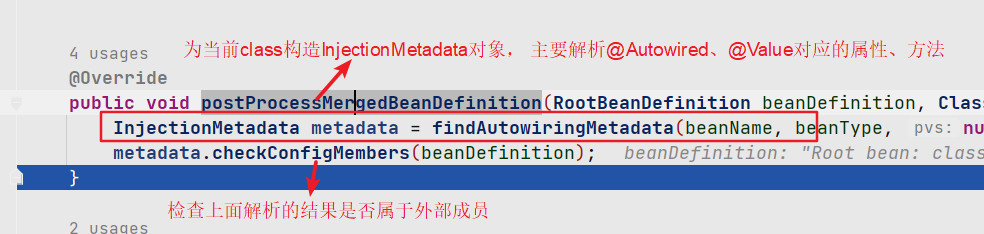

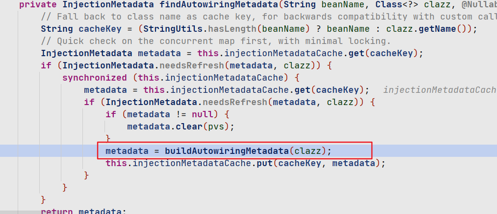

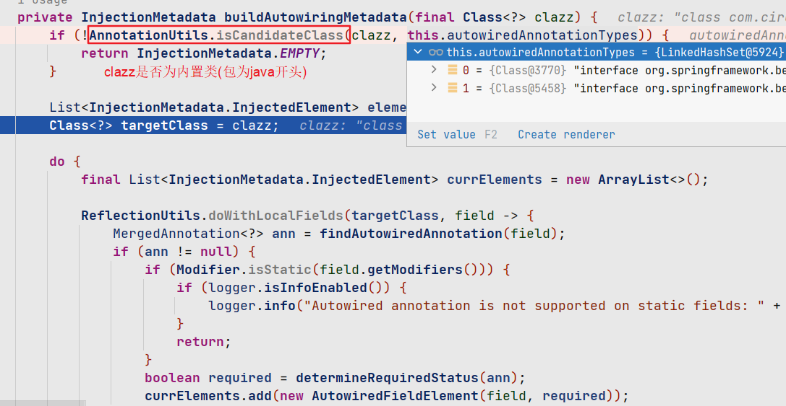

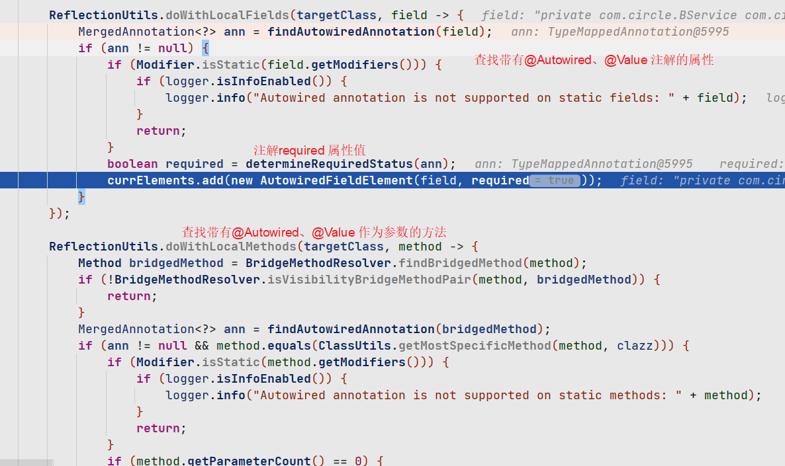


### populateBean

>  AutowiredAnnotationBeanPostProcessor#postProcessProperties

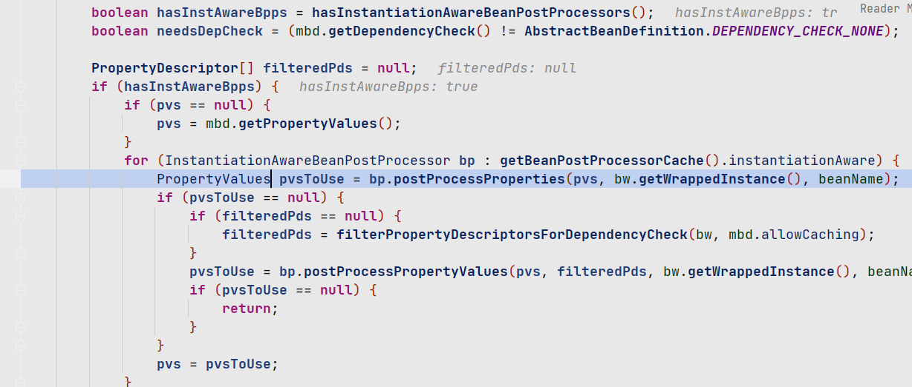

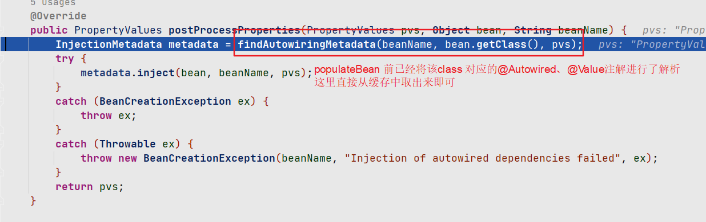

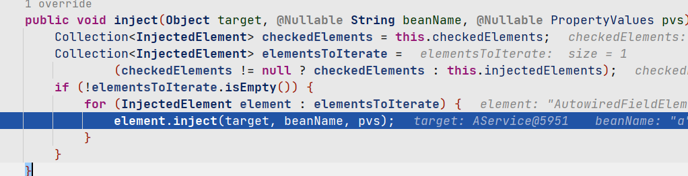

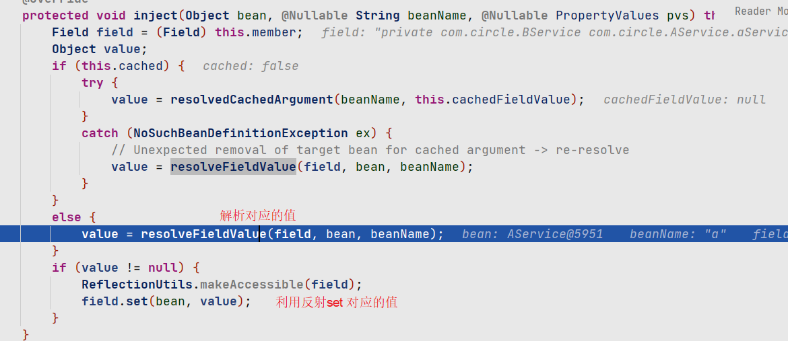

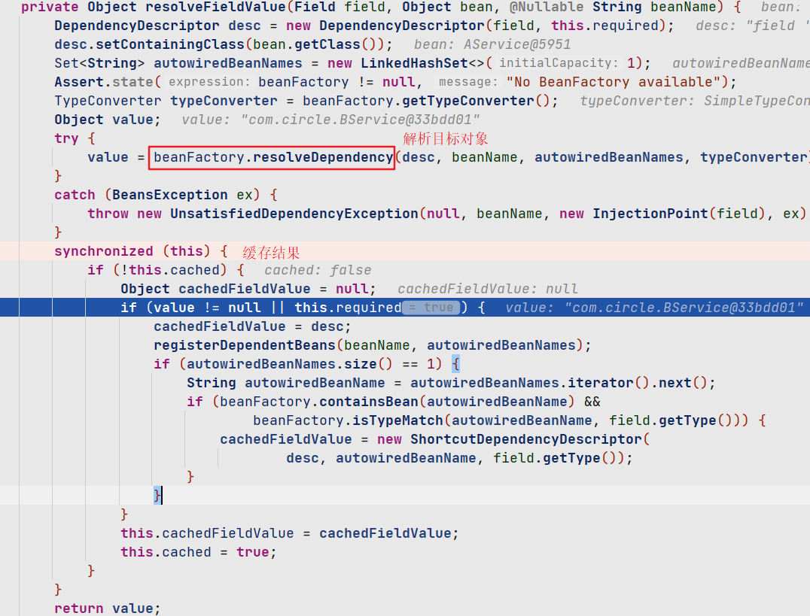

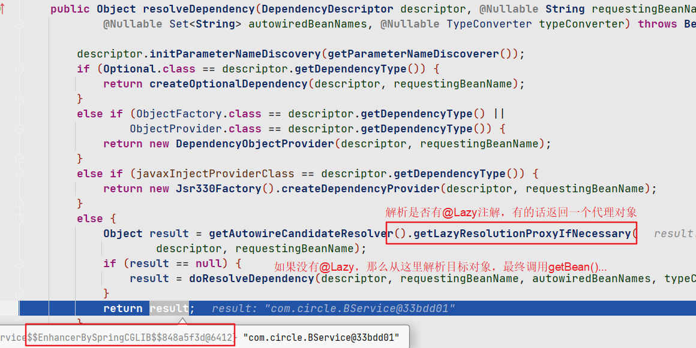

ContextAnnotationAutowireCandidateResolver.java#getLazyResolutionProxyIfNecessary

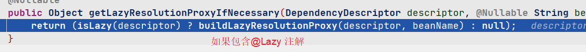

如果为@Lazy 注解，那么会在这里返回一个代理对象

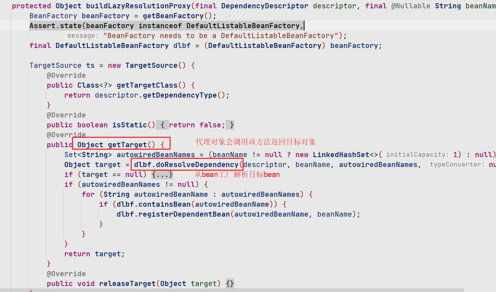


### resolveDependency：

处理过程：

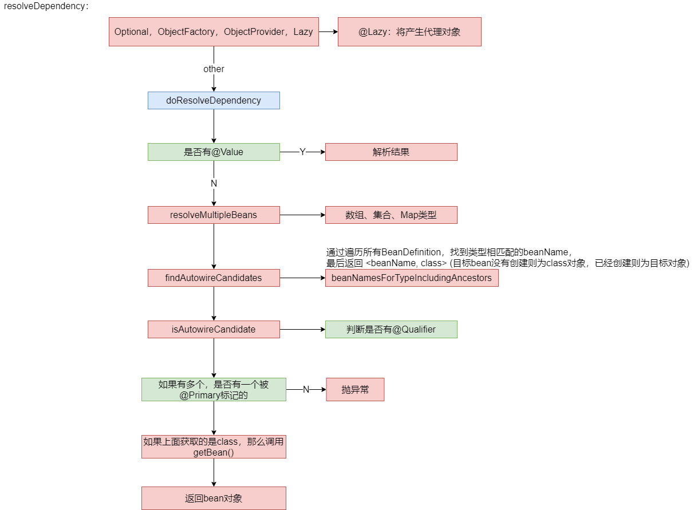

doResolveDependency：

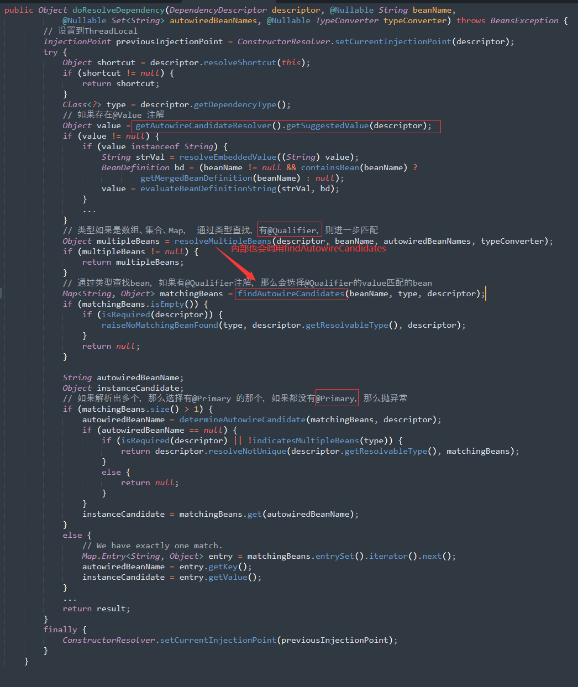


### findAutowireCandidates

> DefaultListableBeanFactory

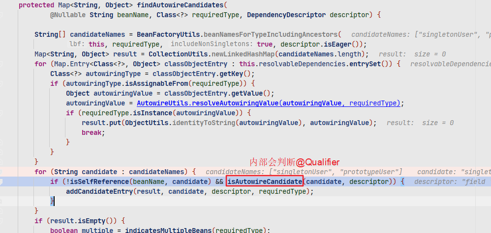

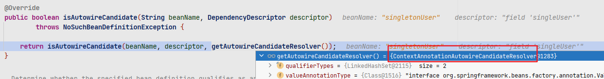


QualifierAnnotationAutowireCandidateResolver.java：

>  ContextAnnotationAutowireCandidateResolver的父类

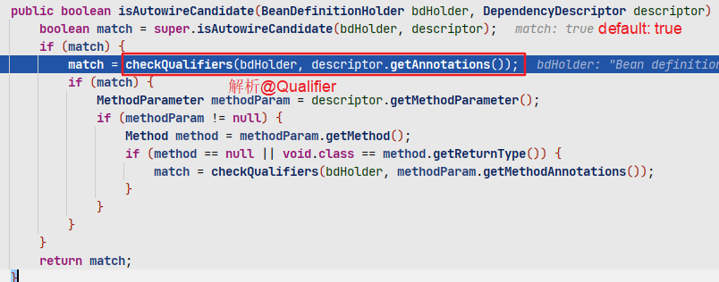

## @Lazy

> 上面已做部分说明

由于@Lazy 注解的对象为一个代理对象，因此在调用时，会进入下面逻辑（在解析@Lazy注解时TargetSource对象被定义）

ContextAnnotationAutowireCandidateResolver#buildLazyResolutionProxy

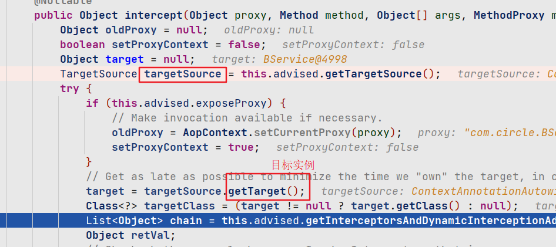


## @Configuration

```
proxyBeanMethods： 默认true。
当设置false，不会产生代理对象，内部调用会创建重复对象。
```

> **ConfigurationClassPostProcessor**:  refresh() # invokeBeanFactoryPostProcessors

#### postProcessBeanDefinitionRegistry

递归解析配置类，将其注册到DefaultListableBeanFactory中

```java
public void postProcessBeanDefinitionRegistry(BeanDefinitionRegistry registry) {
    ....
        processConfigBeanDefinitions(registry);
}
public void processConfigBeanDefinitions(BeanDefinitionRegistry registry) {
    List<BeanDefinitionHolder> configCandidates = new ArrayList<>();
    String[] candidateNames = registry.getBeanDefinitionNames();

    for (String beanName : candidateNames) {
        BeanDefinition beanDef = registry.getBeanDefinition(beanName);
        if (beanDef.getAttribute(ConfigurationClassUtils.CONFIGURATION_CLASS_ATTRIBUTE) != null) {
           ... 已经处理过
        }
        // 检查配置bean， 1.检查是否有@configuration，@Component等注解，2.class中是否有@Bean存在
        // 如果是配置bean，那么会添加属性：CONFIGURATION_CLASS_ATTRIBUTE
        // proxyBeanMethods:  true	（默认），设置为FULL， 否则Lite
        else if (ConfigurationClassUtils.checkConfigurationClassCandidate(beanDef, this.metadataReaderFactory)) {
            configCandidates.add(new BeanDefinitionHolder(beanDef, beanName));
        }
    }

    // Return immediately if no @Configuration classes were found
    if (configCandidates.isEmpty()) {
        return;
    }

    // Sort by previously determined @Order value, if applicable
    configCandidates.sort((bd1, bd2) -> {
        int i1 = ConfigurationClassUtils.getOrder(bd1.getBeanDefinition());
        int i2 = ConfigurationClassUtils.getOrder(bd2.getBeanDefinition());
        return Integer.compare(i1, i2);
    });

    // 检查自定义的BeanNameGenerator
    // Detect any custom bean name generation strategy supplied through the enclosing application context
    SingletonBeanRegistry sbr = null;
    if (registry instanceof SingletonBeanRegistry) {
        sbr = (SingletonBeanRegistry) registry;
        if (!this.localBeanNameGeneratorSet) {
            BeanNameGenerator generator = (BeanNameGenerator) sbr.getSingleton(
                AnnotationConfigUtils.CONFIGURATION_BEAN_NAME_GENERATOR);
            if (generator != null) {
                this.componentScanBeanNameGenerator = generator;
                this.importBeanNameGenerator = generator;
            }
        }
    }

    if (this.environment == null) {
        this.environment = new StandardEnvironment();
    }

    // Parse each @Configuration class
    ConfigurationClassParser parser = new ConfigurationClassParser(
        this.metadataReaderFactory, this.problemReporter, this.environment,
        this.resourceLoader, this.componentScanBeanNameGenerator, registry);

    Set<BeanDefinitionHolder> candidates = new LinkedHashSet<>(configCandidates);
    Set<ConfigurationClass> alreadyParsed = new HashSet<>(configCandidates.size());
    
    // 解析每一个配置类
    do {
        StartupStep processConfig = this.applicationStartup.start("spring.context.config-classes.parse");
        // 解析入口, 内部会递归解析@Component，@ComponentScan...,  将结果存入parser.getConfigurationClasses()
        parser.parse(candidates);
        // 校验配置类是否合法： proxyBeanMethods 为true，那么方法必须不为final（cglib限制）
        parser.validate();

        Set<ConfigurationClass> configClasses = new LinkedHashSet<>(parser.getConfigurationClasses());
        configClasses.removeAll(alreadyParsed);

        // Read the model and create bean definitions based on its content
        if (this.reader == null) {
            this.reader = new ConfigurationClassBeanDefinitionReader(
                registry, this.sourceExtractor, this.resourceLoader, this.environment,
                this.importBeanNameGenerator, parser.getImportRegistry());
        }
        // 将上面解析出来的配置类， 注册beanDefinition
        this.reader.loadBeanDefinitions(configClasses);
        alreadyParsed.addAll(configClasses);
        processConfig.tag("classCount", () -> String.valueOf(configClasses.size())).end();

        candidates.clear();
        // 判断是否有新的beanDefinition配置类， 将新的存入candidateNames中，继续循环处理
        if (registry.getBeanDefinitionCount() > candidateNames.length) {
            String[] newCandidateNames = registry.getBeanDefinitionNames();
            Set<String> oldCandidateNames = new HashSet<>(Arrays.asList(candidateNames));
            Set<String> alreadyParsedClasses = new HashSet<>();
            for (ConfigurationClass configurationClass : alreadyParsed) {
                alreadyParsedClasses.add(configurationClass.getMetadata().getClassName());
            }
            for (String candidateName : newCandidateNames) {
                if (!oldCandidateNames.contains(candidateName)) {
                    BeanDefinition bd = registry.getBeanDefinition(candidateName);
                    if (ConfigurationClassUtils.checkConfigurationClassCandidate(bd, this.metadataReaderFactory) &&
                        !alreadyParsedClasses.contains(bd.getBeanClassName())) {
                        candidates.add(new BeanDefinitionHolder(bd, candidateName));
                    }
                }
            }
            candidateNames = newCandidateNames;
        }
    }
    while (!candidates.isEmpty());
	......
}
```


##### parse


#### postProcessBeanFactory

```java
public void postProcessBeanFactory(ConfigurableListableBeanFactory beanFactory) {
    ...
    // 如果是Configuration是full，那么使用ConfigurationClassEnhancer创建代理对象，否则返回源对象
    enhanceConfigurationClasses(beanFactory);
    // 注册ImportAwareBeanPostProcessor
    beanFactory.addBeanPostProcessor(new ImportAwareBeanPostProcessor(beanFactory));
}

```


#### proxyBeanMethods实现原理

> 默认true，表示Full模式，会为配置类生成代理。 设置false表示Lite 不会生成代理对象。
>
>
> 因此使用false性能更高，减少了代理对象创建的开销。但是@Bean方法有内部调用的时候会**创建重复对象**。

Full/Lite 介绍：https://blog.csdn.net/f641385712/article/details/106127418?ops_request_misc=%257B%2522request%255Fid%2522%253A%2522da54bab95516298edd7f29f9ddbccbd3%2522%252C%2522scm%2522%253A%252220140713.130102334.pc%255Fblog.%2522%257D&request_id=da54bab95516298edd7f29f9ddbccbd3&biz_id=0&utm_medium=distribute.pc_search_result.none-task-blog-2~blog~first_rank_ecpm_v1~rank_v31_ecpm-3-106127418-null-null.nonecase&utm_term=full&spm=1018.2226.3001.4450


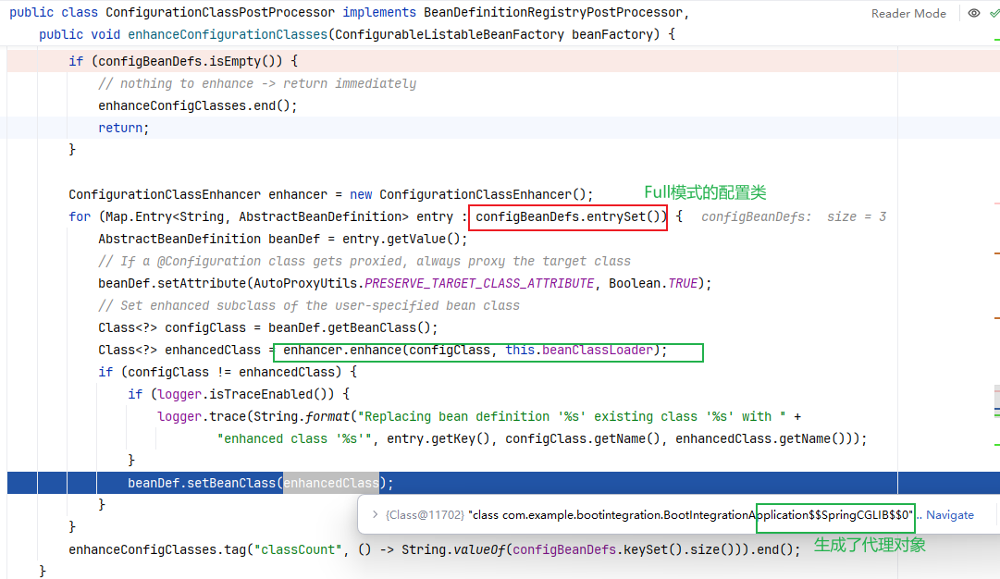


当启动完成后，获取该对象：

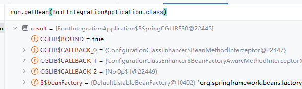

当设置proxyBeanMethods为false后：

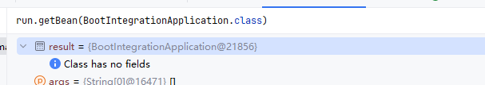


#### ConfigurationClassEnhancer

> 为配置类创建代理对象

```java
public Class<?> enhance(Class<?> configClass, @Nullable ClassLoader classLoader) {
    // 已经被代理
    if (EnhancedConfiguration.class.isAssignableFrom(configClass)) {
        return configClass;
    }
    // 创建代理对象，返回代理类的class
    Class<?> enhancedClass = createClass(newEnhancer(configClass, classLoader));
    return enhancedClass;
}

/**
	 * Creates a new CGLIB {@link Enhancer} instance.
	 */
private Enhancer newEnhancer(Class<?> configSuperClass, @Nullable ClassLoader classLoader) {
    Enhancer enhancer = new Enhancer();
    enhancer.setSuperclass(configSuperClass);
    enhancer.setInterfaces(new Class<?>[] {EnhancedConfiguration.class});
    enhancer.setUseFactory(false);
    enhancer.setNamingPolicy(SpringNamingPolicy.INSTANCE);
    enhancer.setStrategy(new BeanFactoryAwareGeneratorStrategy(classLoader));
    enhancer.setCallbackFilter(CALLBACK_FILTER);
    enhancer.setCallbackTypes(CALLBACK_FILTER.getCallbackTypes());
    return enhancer;
}

/**
	 * Uses enhancer to generate a subclass of superclass,
	 * ensuring that callbacks are registered for the new subclass.
	 */
private Class<?> createClass(Enhancer enhancer) {
    Class<?> subclass = enhancer.createClass();
    // Registering callbacks statically (as opposed to thread-local)
    // is critical for usage in an OSGi environment (SPR-5932)...
    Enhancer.registerStaticCallbacks(subclass, CALLBACKS);
    return subclass;
}
```


ConfigurationClassPostProcessor.ImportAwareBeanPostProcessor#postProcessProperties

> populateBean 阶段调用， 设置beanFactory

```java
public PropertyValues postProcessProperties(@Nullable PropertyValues pvs, Object bean, String beanName) {
    // Inject the BeanFactory before AutowiredAnnotationBeanPostProcessor's
    // postProcessProperties method attempts to autowire other configuration beans.
    if (bean instanceof EnhancedConfiguration) {
        ((EnhancedConfiguration) bean).setBeanFactory(this.beanFactory);
    }
    return pvs;
}
```

**在实例化bean过程（createBeanInstance阶段）中遇到配置类的代理类时，会采用FactoryMethod方式(@Bean方法)实例化，实例化过程会调用目标类的方法，代理类会通过下面方法拦截**


ConfigurationClassEnhancer中定义的**CALLBACKS**：

```java
private static final Callback[] CALLBACKS = new Callback[] {
    new BeanMethodInterceptor(),
    new BeanFactoryAwareMethodInterceptor(),
    NoOp.INSTANCE
};
```

##### BeanFactoryAwareMethodInterceptor

> 为代理类设置beanFactory对象， BeanMethodInterceptor中会使用该beanFactory 获取目标bean对象

```java
public Object intercept(Object obj, Method method, Object[] args, MethodProxy proxy) throws Throwable {
    Field field = ReflectionUtils.findField(obj.getClass(), BEAN_FACTORY_FIELD);
    Assert.state(field != null, "Unable to find generated BeanFactory field");
    field.set(obj, args[0]);

    // Does the actual (non-CGLIB) superclass implement BeanFactoryAware?
    // If so, call its setBeanFactory() method. If not, just exit.
    // 判断是否 实现了BeanFactoryAware，如果是为父类设置beanFactory
    if (BeanFactoryAware.class.isAssignableFrom(ClassUtils.getUserClass(obj.getClass().getSuperclass()))) {
        return proxy.invokeSuper(obj, args);
    }
    return null;
}
```


##### BeanMethodInterceptor

> 调用BeanMethod方法时的拦截器，确保多次调用返回同一个对象。

```java
public Object intercept(Object enhancedConfigInstance, Method beanMethod, Object[] beanMethodArgs,
                        MethodProxy cglibMethodProxy) throws Throwable {
	// 获取 beanFactory
    ConfigurableBeanFactory beanFactory = getBeanFactory(enhancedConfigInstance);
    String beanName = BeanAnnotationHelper.determineBeanNameFor(beanMethod);

    // Determine whether this bean is a scoped-proxy， beanMethod是否设置@Scope，scoped-proxy
    if (BeanAnnotationHelper.isScopedProxy(beanMethod)) {
        String scopedBeanName = ScopedProxyCreator.getTargetBeanName(beanName);
        if (beanFactory.isCurrentlyInCreation(scopedBeanName)) {
            beanName = scopedBeanName;
        }
    }
	..... 省略factoryBean 处理
	// 第一次调用会成立，后面的调用都走后面的逻辑
    // 在AbstractAutowireCapableBeanFactory#createBeanInstance阶段：实例化FactoryMethod， SimpleInstantiationStrategy#instantiate中会将method set 到ThreadLocal中， 因此第一次会返回true， 当调用目标@Bean后，会在SimpleInstantiationStrategy的finally中移除ThreadLocal中的值
    if (isCurrentlyInvokedFactoryMethod(beanMethod)) {
      
        return cglibMethodProxy.invokeSuper(enhancedConfigInstance, beanMethodArgs);
    }
	// 从beanFactory中获取bean对象
    return resolveBeanReference(beanMethod, beanMethodArgs, beanFactory, beanName);
}
```


## @Transactional

ReflectiveMethodInvocation.java

  TransactionInterceptor#invoke

  TransactionAspectSupport#invokeWithinTransaction:  invocation.proceedWithInvocation() ---> target.method

      1. 获取 PlatformTransactionManager(默认平台事务管理器): jdbcxxx/jpaxxx
      2. createTransactionIfNecessary(): ---> getTransaction --> startTransaction: 创建DefaultTransactionStatus(隔离级别、是否新事务)， xxxTransactionManager#doBegin：会得到Connection， bindResource，  最终返回TransactionInfo对象，包含上面的各种信息
      3. completeTransactionAfterThrowing: 处理异常
      4. cleanupTransactionInfo： 恢复上一次调用的transactionInfo （嵌套事务）


completeTransactionAfterThrowing(): txInfo.transactionAttribute.rollbackOn(该异常是否支持回滚)
                                    processRollback(): rollbackOnly： 标记是否有异常

  TransactionSynchronizationManager:  利用ThreadLocal存储了事务的一些信息
  TransactionSynchronizationManager.bindResource(method, methodMetadata)

# 面试题

### Spring 没有解决的循环依赖问题：

1. prototype 类型的循环依赖： AbstractBeanFactory#doGetBean，getSingleton 处理singleton循环依赖， prototype类型判断正在创建直接抛异常
2. constructor 注入的循环依赖
   在createBeanInstance阶段，当前**还没有加入到三级缓存中**，因此在解析构造参数时，不能找到参数，因此会创建bean，发现当前正在创建，因此抛出异常
3. @Async 类型的 Bean 的循环依赖
   这些特殊的场景，我们都可以通过 **@Lazy** 来解决。

| 依赖情况               | 依赖注入方式                                       | 循环依赖是否被解决             |
| :--------------------- | :------------------------------------------------- | :----------------------------- |
| AB相互依赖（循环依赖） | 均采用setter方法注入                               | 是                             |
| AB相互依赖（循环依赖） | 均采用构造器注入                                   | 否                             |
| AB相互依赖（循环依赖） | A中注入B的方式为setter方法，B中注入A的方式为构造器 | 是（A先于B, 资源文件默认顺序） |
| AB相互依赖（循环依赖） | B中注入A的方式为setter方法，A中注入B的方式为构造器 | 否                             |


### FactoryBean/BeanFactory 区别

FactoryBean：

> 当FactoryBean对象实例化完成后，会放入一级缓存中(beanName:  不会带&)，getObject方法返回的对象存放在FactoryBeanRegistrySupport#factoryBeanObjectCache中。
>
> Map中的bean实例都不会使用带&的名词，在使用带&前缀的名称getBean时会将&去掉


FactoryBean实例存放到一级缓存后，调用下面方法来处理FactoryBean， 最终返回getObject方法返回的对象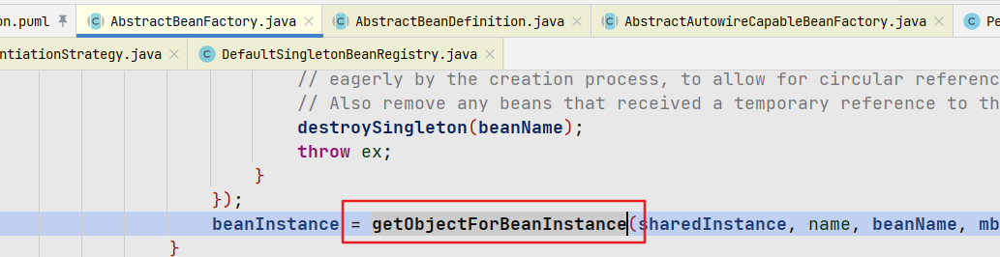

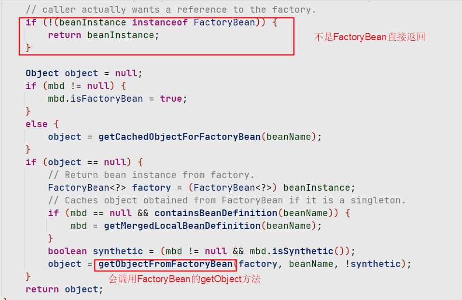


下面会将目标对象存入缓存

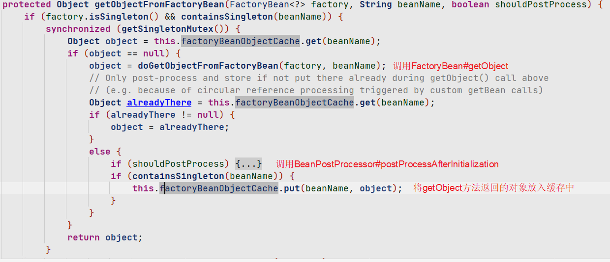


在调用getBean(“&factoryBeanName”) 获取FactoryBean对象时，调用过程如下：

会首先将&前缀去掉，因为registry中并没有存放&开头的对象，由于registry中存放的是FactoryBean对象，因此调用**getObjectFromFactoryBean**方法直接返回对象本身了，不会继续调用FactoryBean的getObject

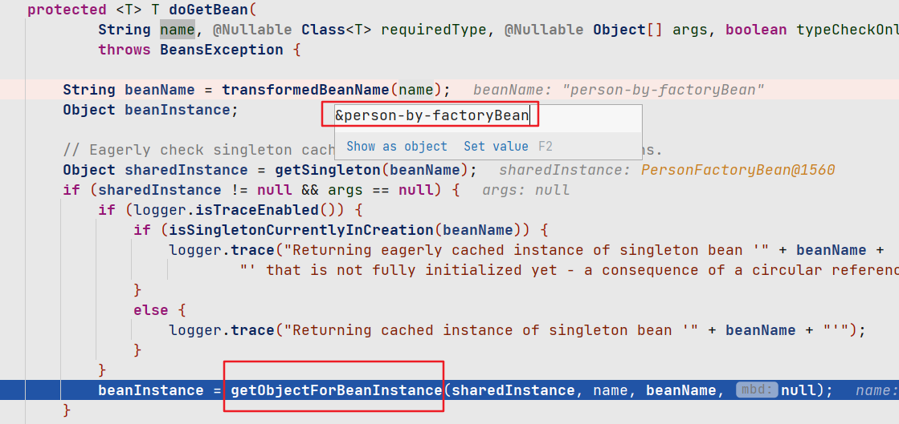