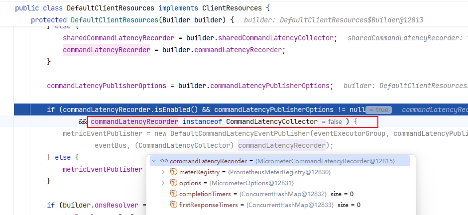

## Lettuce：连接模型、命令执行与 Pipeline 实战

如果你在 Spring Boot 或直接使用 Redis 客户端时选择了 Lettuce，最容易产生的几个问题通常是：

- `RedisClient` 要不要复用？
- `StatefulRedisConnection` 能不能跨线程共享？
- 为什么很多场景不建议上连接池？
- `pipeline` 到底有没有用，Spring 里默认为什么看起来“不够快”？

这篇文章把这些问题串起来，从 Lettuce 的资源模型、Netty 连接建立、命令发送链路，一直到 Spring Data Redis 中的 `pipeline` 刷新策略，做一次可直接落地的梳理。

### 先说结论

- `RedisClient` / `RedisClusterClient` 是重量级对象，应该长期复用，而不是每次请求都创建。
- `StatefulRedisConnection` 本身是线程安全的，普通命令场景可以复用同一个连接。
- 大部分业务场景并不需要连接池；真正需要专用连接的，通常是事务、阻塞命令、Pub/Sub、长时间占用连接的场景。
- `pipeline` 的核心价值是减少 RTT 和系统调用，提高吞吐；它不保证原子性。
- 在 Spring Data Redis 中，即使调用了 `executePipelined()`，如果不调整 flush 策略，也可能仍然接近“每条命令都 flush 一次”。

### 一个最小示例

```java
public static void main(String[] args) throws Exception {
    RedisClient redisClient = RedisClient.create("redis://localhost:6379");

    try (StatefulRedisConnection<String, String> connection = redisClient.connect()) {
        RedisAsyncCommands<String, String> asyncCommands = connection.async();

        asyncCommands.set("foo", "bar").get();
        System.out.println(asyncCommands.get("foo").get());
    } finally {
        redisClient.shutdown();
    }
}
```

这个示例背后有两点很重要：

1. `RedisClient` 通常是全局复用的。
2. `connect()` 得到的 `StatefulRedisConnection` 代表一个底层 `Channel`，后续 sync / async / reactive API 都是围绕这条连接展开。

### Lettuce 的资源模型

#### 1. `ClientResources`

`ClientResources` 是 Lettuce 的全局基础设施，负责管理共享资源，例如：
- 定时任务、事件分发、指标采集等辅助组件

- `EventLoopGroupProvider`： 执行IO 类型任务的provider
- `EventExecutorGroup`: Netty 的EventLoopGroup， 在client 创建channel就是用的这个执行器。
- EventBus： 用于 监听连接、命令执行相关时间 耗时。 使用EventExecutorGroup执行器

如果你直接创建 `RedisClient`，底层通常会自动创建 `DefaultClientResources`。多个连接可以共享这套资源，因此不应该把它当成“每次操作都重新创建一次”的轻量对象。

#### 2. `RedisClient`

`RedisClient` / `RedisClusterClient` 更像是“连接工厂 + 全局资源持有者”：

- 持有 `ClientResources`
- 创建连接时负责初始化 Netty `Bootstrap`
- 管理底层的 `ChannelGroup`

它应该是应用级别复用的对象。

#### 3. `StatefulRedisConnection`

`StatefulRedisConnection` 对应一条真实的 Redis 连接，底层绑定一个 Netty `Channel`。
它最重要的两个特征是：

- 有状态：持有 codec、endpoint、连接状态等信息
- 线程安全：普通命令场景下允许多线程共享

Lettuce 在写命令时会做并发控制，因此多个线程可以复用一个连接发送普通命令。这也是“默认不强调连接池”的关键前提。

#### 4. 三套 API 只是不同封装

Lettuce 对外提供三种常用接口：

- `async`：异步调用，返回 `RedisFuture`
- `sync`：同步阻塞风格，本质上是对 async 结果做等待
- `reactive`：响应式封装，适合和 Reactor / WebFlux 集成

底层命令发送链路本质一致，只是调用方式不同。

### 连接是怎么建立起来的

Lettuce 底层基于 Netty。以 `RedisClient.connect()` 为例，简化后的过程是：

```text
RedisClient.connect()
  -> connectStandaloneAsync()
  -> connectStatefulAsync(): 创建Netty的Bootstrap 绑定channelGroup，即线程组NioEventLoopGroup(CPU个NioEventLoop)
  -> initializeChannelAsync0(): 这里会创建PlainChannelInitializer绑定到Boostrap
  -> redisBootstrap.connect()
```

Lettuce中的PlainChannelInitializer在初始化(initChannel)的时候会将Lettuce中的handler添加到pipeline中 ：

- `RedisHandshakeHandler`: 初始化握手操作，会发生Hello命令发送redis server.  
- `CommandHandler`:
  - `write()`： 生成LatencyMeteredCommand 放入stack，耗时统计、tracing 等
  - `channelRead --> decode()`： 将数据包放入buffer缓冲区，进行解析响应， 解析到完整的数据包时，从stack获取Command，将结果塞进去
- `ConnectionEventTrigger`: 当连接发生变化的时候，发送一些event
- `ConnectionWatchdog`： 监控每个链接，当断开时支持重连。 inactive 方法
-  ChannelGroupListener: 连接、断开会发起 event
- `CommandEncoder`： 将Command 编码为ByteBuf


### 初始化阶段会发送什么命令

连接可用后，Lettuce 会在握手阶段发送初始化命令（即：RedisHandshakeHandler）。流程包括：

1. `HELLO 3`
   作用是尝试切换到 RESP3；如果服务端不支持，会退回 RESP2。
2. `SELECT`
   当你配置的不是默认库时，会切换 DB。
3. `CLIENT SETINFO`
   在较新的 Redis 版本中，客户端会把自身信息上报给服务端。

如果你在 Spring Boot Actuator 中开启 Redis 健康检查，还会看到 `INFO server` 这类探测命令 (这个并不是初始化发出的)。

### 一条命令是如何发出去的

以 `asyncCommands.set("foo", "bar")` 为例，简化后的调用链可以写成：

```text
AbstractRedisAsyncCommands.set()
  -> dispatch()
  -> DefaultEndpoint.write()
  -> channel.writeAndFlush()
```

这里 `DefaultEndpoint` 很关键，它维护了：

- 当前连接对应的 `Channel`
- `autoFlushCommands` 开关
- 命令缓冲区：autoFlushCommands 为`false`的时候 会将命令存放到这里

默认情况下，`autoFlushCommands = true`，所以命令会直接写入 socket 并 flush。

当你手动关闭自动 flush 时：

```java
connection.setAutoFlushCommands(false);
```

命令不会立刻发到网络，而是先进入缓冲队列，等你显式调用：

```java
connection.flushCommands();
```

再统一发出去。

这也是 Lettuce 实现 pipeline 的核心机制。

### 为什么大多数场景不需要连接池

很多人第一次接触 Redis 客户端时，会下意识地把“高并发”与“连接池”绑定起来。但在 Lettuce 里，这个结论通常并不成立。

原因有三个：

1. Redis 单连接就可以高效串行处理大量命令。
2. Lettuce 连接支持多路复用，普通命令可以在同一连接上并发发起。
3. 连接池本身会引入额外的借还、校验、失效处理和资源占用成本。

因此，大部分简单 KV、缓存读写、计数器、排行榜等场景，复用少量连接就够了。

更适合专用连接或连接池的场景通常是：

- Redis 事务
- 阻塞命令
- Pub/Sub
- 长时间占用连接的任务
- 需要强隔离、避免相互影响的特殊场景: 如`pipeline`
- 高并发的网关实现

### Pipeline 的真正价值

`pipeline` 的本质不是“让 Redis 一次并行执行更多命令”，而是减少客户端和服务端之间的来回往返。

没有 pipeline 时，客户端往往是：

1. 发一条命令
2. 等一个响应
3. 再发下一条命令

这会带来两个额外成本：

- RTT 叠加
- 大量 `read()` / `write()` 系统调用

而 pipeline 的做法是：

1. 连续发送多条命令
2. 统一 flush
3. 批量接收结果

这样能显著提升吞吐，特别适合批量写入、批量更新、缓存预热等场景。

但它有两个必须记住的边界：

- `pipeline` 不保证原子性，它不是事务。
- 服务端需要暂存排队中的响应，批次过大时会额外占用内存。

如果你需要“多条命令要么都成功，要么都失败”，应该考虑事务或 Lua 脚本，而不是把 pipeline 当成原子操作。

### 原生 Lettuce 中如何使用 Pipeline

最直接的方式就是关闭自动 flush：

```java
StatefulRedisConnection<String, String> connection = redisClient.connect();
RedisAsyncCommands<String, String> commands = connection.async();

connection.setAutoFlushCommands(false);
try {
    commands.set("k1", "v1");
    commands.set("k2", "v2");
    commands.set("k3", "v3");

    connection.flushCommands();
} finally {
    connection.setAutoFlushCommands(true);
}
```

这里有一个非常重要的约束：

不要在“被其他线程共享的连接”上随意关闭 `autoFlushCommands`。
否则，其他线程发出的命令也可能被一并积压到缓冲区里，直到某次 flush 才真正发出，导致延迟不可控（这也是）。


### Spring Data Redis 里的 Pipeline，为什么看起来没那么“猛”

如果你在 Spring 里使用 `StringRedisTemplate.executePipelined()`，直觉上会认为“所有命令会一次性发出”。
但默认行为并没有这么激进。

Spring Data Redis 在 Lettuce 之上还包了一层适配。一次 `opsForValue().set()` 的执行路径，简化后大致是：

```text
RedisTemplate.execute()
  -> RedisConnectionUtils.getConnection()
  -> LettuceConnection.invoke()
  -> AbstractRedisAsyncCommands.set()
  -> DefaultEndpoint.write()
```

而 `executePipelined()` 的关键流程是：

```text
redisTempalte#executePipelined：

1. LettuceConnection#openPipeline()
  -> 将 autoFlushCommands 设为 false
  -> pipeliningFlushState：生成一个专用连接
2. 执行业务回调中的 Redis 命令： 
	LettuceConnection#exec：如果开启了pipeline，执行BufferedFlushing#onCommand 判断是否flush
3. LettuceConnection#closePipeline()
  -> flush 剩余命令
  -> 读取并反序列化结果
```

更关键的一点是：Spring 为了避免共享连接被 pipeline 状态污染，通常会为这次 pipeline 使用专用底层连接，执行结束后再释放。
这也是为什么它比“直接在共享连接上关掉 autoFlush”更安全。

### flush 策略才是 Spring Pipeline 的关键

Spring 中的 pipeline 默认并不等同于“攒满一批再统一发”。
spring 中默认 flush 策略是 `FlushEachCommand`，那效果就是“虽然走了 pipeline API，但每条命令还是在及时 flush”。

为了达到真正pipeline效果，需要覆盖默认的flush策略：

```java
LettuceConnectionFactory connectionFactory =
        (LettuceConnectionFactory) stringRedisTemplate.getConnectionFactory();

connectionFactory.setPipeliningFlushPolicy(
        LettuceConnection.PipeliningFlushPolicy.buffered(3)
);
```

这个配置的含义是：

- pipeline 模式下，不是每条命令都立刻 flush
- 每累计 3 条命令再 flush 一次
- 关闭 pipeline 时，再把剩余命令统一刷出去

如果你的场景是大批量写入，可以把这个阈值调大，例如 100。
但阈值并不是越大越好，仍然要结合：

- 单批命令量
- 单条命令大小
- Redis 服务端内存
- 网络 RTT
- 可接受的结果返回延迟

### Spring 中一个可落地的配置示例

```java
@Component
public class LettuceFactoryPostProcessor implements BeanPostProcessor {

    @Override
    public Object postProcessAfterInitialization(Object bean, String beanName) {
        if (bean instanceof LettuceConnectionFactory factory) {
            factory.setPipeliningFlushPolicy(
                    LettuceConnection.PipeliningFlushPolicy.buffered(100)
            );
        }
        return bean;
    }
}
```

这段配置适合“明确有批量 pipeline 写入需求”的系统。它的目标不是降低单条命令延迟，而是减少 flush 次数和网络开销，提升整体吞吐。

### 源码视角再看一次

如果从源码角度把关键点串起来，可以得到这样一条主线：

```text
RedisTemplate.executePipelined()
  -> connection.openPipeline()
  -> LettuceConnection.doInvoke()
  -> future.get()
  -> pipeline(...)
  -> BufferedFlushing.onCommand()
  -> 满足阈值后 flushCommands()
```

`BufferedFlushing` 的核心逻辑非常直接：

```java
@Override
public void onCommand(StatefulConnection<?, ?> connection) {
    if (commands.incrementAndGet() % flushAfter == 0) {
        connection.flushCommands();
    }
}
```

也就是说，Spring pipeline 的收益，最终还是落回到一个问题上：
“命令什么时候真正 flush 到网络里？”

### Lettuce 的内存和资源开销

Lettuce 不是“零成本客户端”。至少要意识到两类资源消耗：

1. 连接本身的资源
   - Netty `Channel`
   - 事件循环绑定
   - 编解码状态
   - 连接级别的缓冲区

2. pipeline 带来的额外内存
   - 客户端缓存尚未 flush 的命令
   - 服务端缓存尚未被客户端读取的响应

从源码视角看，`CommandHandler` 在连接注册时就会准备解码用的临时 buffer，用来处理半包、粘包问题。
如果你建立了过多连接，或者单次 pipeline 批量过大，内存占用会很快放大。

### 什么时候该用，什么时候别用

适合使用 Lettuce pipeline 的场景：

- 批量写缓存
- 批量更新计数器
- 数据迁移 / 导入
- 缓存预热
- 明显受 RTT 影响的批处理任务

不适合直接上 pipeline 的场景：

- 强依赖原子性的操作
- 单条命令本身就很重、很慢的场景
- 结果必须立即逐条判断并中断流程的逻辑
- 批量过大，可能挤压 Redis 内存的场景

### 总结

Lettuce 的设计思路并不复杂，可以浓缩成四句话：

- `RedisClient` 是重量级资源，复用它。
- `StatefulRedisConnection` 在普通命令场景下可以共享，不要默认上连接池。
- `pipeline` 的价值在于减少 RTT 和 flush，不在于保证原子性。
- 在 Spring Data Redis 中，真正决定 pipeline 收益的，往往是 flush 策略，而不是你有没有调用 `executePipelined()`。

如果把这几个点想清楚，Lettuce 在连接模型、性能调优和 Spring 集成上的大部分问题，基本都能顺下来。

## Spring 自定义 Redis 超时：TTL、TTI 与 Pipeline 实战

在 Spring Cache 接入 Redis 之后，最常见的问题通常不是“能不能用”，而是“默认配置够不够用”：

- 所有缓存都用同一个过期时间，明显不合理
- 热点缓存希望访问后续期，普通缓存只需要固定 TTL
- 清理缓存时如果直接走 `KEYS`，大 key 空间下可能拖慢 Redis
- 批量预热缓存时，一条条写入 RTT 太高，希望结合 pipeline 优化

如果把这些问题拆开看，核心其实只有两件事：

1. Spring 是怎么把 `@Cacheable` 映射到 Redis 的
2. 你该在哪一层自定义过期策略和批量写入策略

### 先说结论

- `RedisCacheConfiguration` 决定缓存序列化、key 前缀、默认 TTL、是否开启 TTI。
- `RedisCacheManagerBuilderCustomizer` 适合做“不同 cacheName 对应不同过期时间”的精细化配置。
- `TTL` 是写入后固定过期，`TTI` 是访问后刷新空闲时间，两者不是一回事。
- 开启 TTI 后，读操作会改成类似 `GETEX` 的语义，因此要求 Redis 支持对应命令（redis 6）。
- `pipeline` 不会改变缓存过期策略本身，但很适合批量预热、批量回填这类高吞吐写入场景。

### Spring Cache 到 Redis 的调用链

先看一遍抽象层级，后面的配置才不容易乱：

```text
@Cacheable
  -> CacheInterceptor
  -> CacheResolver
  -> CacheManager
  -> RedisCache
  -> RedisCacheWriter
  -> RedisConnectionFactory： 从Lettuce中获取底层连接对象
  -> RedisConnection
```

从职责上理解：

- `CacheInterceptor` 负责拦截 `@Cacheable`、`@CachePut`、`@CacheEvict`
- `CacheResolver` / `CacheManager` 负责找到具体的缓存对象
- `RedisCache` 代表某个 `cacheName` 对应的一块缓存空间： 通过`RedisCacheConfiguration`构建，包含了ttl、序列化相关配置
- `RedisCacheWriter` 负责把 `get` / `put` / `evict` 翻译成底层 Redis 命令

因此，“Spring 自定义 Redis 超时”真正该改的，通常不是业务代码，而是 `RedisCacheConfiguration` 和 `RedisCacheManager`。

### 全局默认 TTL：先把基础配置定下来

如果你什么都不配，所有缓存基本都会走默认行为。这通常不适合线上系统，因为：

- 序列化格式可能不符合你的兼容性要求
- key 前缀不统一，排查问题不方便
- 所有缓存 TTL 一刀切，不利于分层治理

一个更稳妥的基础配置如下：

```java
@EnableCaching
@Configuration(proxyBeanMethods = false)
public class RedisCacheConfig {

    @Value("${spring.application.name:app}")
    private String applicationName;

    @Bean
    public RedisCacheConfiguration redisCacheConfiguration() {
        return RedisCacheConfiguration.defaultCacheConfig()
                .serializeValuesWith(
                        RedisSerializationContext.SerializationPair.fromSerializer(
                                new GenericJackson2JsonRedisSerializer()
                        )
                )
                .prefixCacheNameWith(applicationName + "::")
                .entryTtl(Duration.ofMinutes(10));
    }
}
```

这段配置做了三件事：

- value 统一使用 JSON 序列化，避免默认 JDK 序列化带来的可读性和兼容性问题
- 所有缓存 key 自动加上应用名前缀，便于隔离和排查
- 给所有 cache 一个默认 TTL，例如 10 分钟

如果你的系统只是中小规模项目，统一 TTL 已经够用；但只要业务稍微复杂一点，很快就会需要“按 cacheName 配不同过期时间”。

### 按缓存名称配置不同 TTL

这是 Spring Cache 接 Redis 最常见、也最实用的自定义能力。

例如：

- 用户基础信息缓存 30 分钟
- 热门榜单缓存 1 分钟
- 字典类缓存 12 小时

这类需求适合用 `RedisCacheManagerBuilderCustomizer` 做增量配置：

```java
@EnableCaching
@Configuration(proxyBeanMethods = false)
public class RedisCacheConfig {

    @Value("${spring.application.name:app}")
    private String applicationName;

    @Bean
    public RedisCacheConfiguration redisCacheConfiguration() {
        return RedisCacheConfiguration.defaultCacheConfig()
                .serializeValuesWith(
                        RedisSerializationContext.SerializationPair.fromSerializer(
                                new GenericJackson2JsonRedisSerializer()
                        )
                )
                .prefixCacheNameWith(applicationName + "::")
                .entryTtl(Duration.ofMinutes(10));
    }

    // 这里只是演示：实际应该定义到CacheService相关的地方，也可以通过配置文件的方式进行配置
    @Bean
    public Map<String, Duration> cacheTtls() {
        Map<String, Duration> ttlMap = new HashMap<>();
        ttlMap.put("user", Duration.ofMinutes(30));
        ttlMap.put("hot", Duration.ofMinutes(1));
        ttlMap.put("dict", Duration.ofHours(12));
        return ttlMap;
    }

    @Bean
    public RedisCacheManagerBuilderCustomizer redisCacheManagerBuilderCustomizer(
            RedisConnectionFactory redisConnectionFactory,
            RedisCacheConfiguration redisCacheConfiguration,
            ObjectProvider<Map<String, Duration>> cacheTtls) {

        Map<String, RedisCacheConfiguration> configMap = new HashMap<>();

        cacheTtls.stream()
                .flatMap(map -> map.entrySet().stream())
                .forEach(entry -> configMap.put(
                        entry.getKey(),
                        redisCacheConfiguration.entryTtl(entry.getValue())
                ));
        // 在为每个cacheName配置创建RedisCache对象时,会从configMap中获取RedisCacheConfiguration对象进行构建
        return builder -> builder
                .withInitialCacheConfigurations(configMap)
                .cacheWriter(RedisCacheWriter.nonLockingRedisCacheWriter(
                        redisConnectionFactory,
                        BatchStrategies.scan(500)
                ));
    }
}
```

这段配置的重点有两个：

1. `withInitialCacheConfigurations(configMap)`
   作用是为不同的 `cacheName` 指定不同的 `RedisCacheConfiguration`。
2. `redisCacheConfiguration.entryTtl(...)`
   不是原地修改，而是基于基础配置派生出一份新的配置对象。

这意味着你可以先定义一份“全局通用配置”，再在它的基础上按 cache 维度覆盖 TTL，而不用重复写序列化、前缀等公共设置。

### 为什么这里顺手把清理策略也配掉

上面的 `cacheWriter(...)` 不只是“顺手一写”，它其实很实用。

很多项目默认不会关注 cache clear 的实现细节，但当 key 空间变大时，`KEYS` 的阻塞风险会很快暴露出来。相比之下：

```java
BatchStrategies.scan(500)
```

更适合线上环境，因为它会通过 `SCAN` 以游标形式分批遍历 key，避免一次性扫全量 key 带来的阻塞压力。

如果你的缓存空间不大，这个差异不明显；但一旦进入高并发或大 key 空间场景，`SCAN` 策略通常更稳。

### TTL 和 TTI 不是一回事

很多文章会把“超时”混着讲，实际上至少要区分两个概念：

- `TTL`：写入之后固定多久过期
- `TTI`：空闲多久过期，读操作会刷新过期时间

如果你希望“只要一直有人访问，这个热点缓存就继续存活”，那应该考虑 TTI，而不是单纯把 TTL 调大。

Spring Data Redis 提供了对应能力：

```java
@Bean
public RedisCacheConfiguration redisCacheConfiguration() {
    return RedisCacheConfiguration.defaultCacheConfig()
            .serializeValuesWith(
                    RedisSerializationContext.SerializationPair.fromSerializer(
                            new GenericJackson2JsonRedisSerializer()
                    )
            )
            .prefixCacheNameWith("app::")
            .entryTtl(Duration.ofMinutes(10))
            .enableTimeToIdle();
}
```

这里的含义是：

- 写入时仍然有初始 TTL
- 读取命中缓存时，会刷新空闲过期时间

这很适合：

- 热点详情页缓存
- 频繁访问的用户会话缓存
- 某些只要持续命中就应该续期的热点数据

但要注意两点：

- TTI 会改变redis读取命令为 `GETEX`，该命令会携带一个 `EX` 参数，表示空闲 TTL
- 它依赖 Redis 对应命令能力，通常要确认服务端版本满足要求

如果你的 Redis 版本不支持这类读时续期命令，就不要直接开启。

### 业务代码应该长什么样

当底层配置好之后，业务代码应该尽量保持简单，而不是把 TTL 逻辑散落到各个 Service 里。

```java
@Service
public class DemoCacheService {

    // 可以在这里定义各个缓存的TTL
    @Bean
    public Map<String, Duration> cacheTtls() {
        Map<String, Duration> ttlMap = new HashMap<>();
        ttlMap.put("user", Duration.ofMinutes(30));
        retunr ttlMap;
    }
   
    @Cacheable(cacheNames = "user", key = "#id")
    public String queryUser(Long id) {
        System.out.println("load user from db...");
        return "user-" + id;
    }

    @Cacheable(cacheNames = "hot", key = "#keyword")
    public String queryHotData(String keyword) {
        System.out.println("load hot data...");
        return "hot-" + keyword;
    }
}
```

这里不需要在 `@Cacheable` 上额外写 TTL，因为 TTL 已经由 `cacheName -> RedisCacheConfiguration` 这层统一管理。

这样做的好处是：

- 业务代码更干净
- 过期策略集中治理
- 后续调整 TTL 不需要全局搜注解

### Pipeline 应该怎么融入这套方案

`pipeline` 和“自定义超时”不是一层概念，但它们在真实项目里经常一起出现。

原因很简单：

- 平时的缓存读写，交给 `@Cacheable` 就够了
- 一旦遇到批量预热、批量回填、冷启动灌缓存，逐条写入的 RTT 就会变得很明显

这时就可以把 pipeline 当成“批量写缓存的性能优化手段”。

要先明确一点：

- pipeline 不会自动帮你决定 TTL
- pipeline 的作用是减少 flush 次数、减少 RTT、提高吞吐
- 每条缓存写入仍然需要你显式设置过期时间

### 一个批量回填缓存的示例

下面这个例子适合“批量写入字符串缓存，并显式设置 TTL”的场景：

```java
@Service
public class CacheWarmService {

    private final StringRedisTemplate stringRedisTemplate;

    public CacheWarmService(StringRedisTemplate stringRedisTemplate) {
        this.stringRedisTemplate = stringRedisTemplate;
    }

    public void warmHotCache(Map<String, String> values) {
        StringRedisSerializer serializer = StringRedisSerializer.UTF_8;

        stringRedisTemplate.executePipelined((RedisCallback<Object>) connection -> {
            values.forEach((key, value) -> connection.stringCommands().setEx(
                    serializer.serialize("hot::" + key),
                    60,
                    serializer.serialize(value)
            ));
            return null;
        });
    }
}
```

这个例子里：

- `setEx` 负责写值并设置 TTL
- `executePipelined()` 负责把多条命令打包发送
- 适合缓存预热、榜单刷新、批量导入等场景

换句话说，TTL 负责“活多久”，pipeline 负责“写得快不快”，两者是互补关系。

### 如果底层是 Lettuce，需要优化 flush 策略

如果 Spring Data Redis 的底层客户端是 Lettuce，需要调整默认 pipeline 的 flush 策略。

因为Spring-lettuce默认的 pipeline 策略是每条命令都进行flush， 这里有体现：LettuceConnectionFactory#pipeliningFlushPolicy
```java
@Component
public class LettuceFactoryPostProcessor implements BeanPostProcessor {

    @Override
    public Object postProcessAfterInitialization(Object bean, String beanName) {
        if (bean instanceof LettuceConnectionFactory factory) {
            factory.setPipeliningFlushPolicy(
                    LettuceConnection.PipeliningFlushPolicy.buffered(100)
            );
        }
        return bean;
    }
}
```

这个配置的含义是：

- pipeline 模式下，不是每条命令都立刻 flush
- 每累计一定数量的命令再 flush 一次
- 关闭 pipeline 时，再把剩余命令统一刷出去

它适合：

- 批量缓存预热
- 一次性导入大量缓存数据
- 对单条请求延迟不敏感、但对整体吞吐敏感的任务

但它不适合直接套到所有场景，因为批次越大：

- 单次堆积的命令越多
- 客户端和服务端的缓冲压力越大
- 出问题时排查也更复杂

### 什么时候该用哪种方案

可以把这套能力简单分成三层：

1. 普通缓存读写
   使用 `@Cacheable` + `RedisCacheManager` 配 TTL，已经足够。
2. 热点缓存续期
   在确认 Redis 版本支持的前提下，开启 TTI。
3. 批量缓存预热或回填
   使用 `executePipelined()`，必要时再叠加 Lettuce 的 buffered flush 策略。

这样分层之后，配置和性能优化就不会混在一起。

### 总结

Spring 自定义 Redis 超时，真正要抓住的是四个点：

- 用 `RedisCacheConfiguration` 定义全局默认行为
- 用 `RedisCacheManagerBuilderCustomizer` 按 `cacheName` 精细化配置 TTL
- 用 TTI 解决“热点数据访问后续期”的问题
- 用 pipeline 解决“批量写缓存吞吐不足”的问题

如果把这四层区分清楚，Spring Cache、Redis TTL 和 Lettuce pipeline 就能自然地衔接起来，而不是各写各的、后期越改越乱。


## 性能监控

### metric
引入prometheus后，LettuceMetricsAutoConfiguration会自定注入`MicrometerCommandLatencyRecorder` 作为默认的latencyRecorder


### JFR
ClientResources会创建一个eventBus，用于通知事件回调：比如连接、断开
DefaultClientResources#eventBus --> DefaultEventBus： 使用EventLoopGroup作为执行器
如 ChannelGroupListener#channelInactive 当发起断开event时，即执行：eventBus.publish(new DisconnectedEvent))
io.lettuce.core.event.DefaultEventBus#publish：

```java
// JfrEventRecorder
 public void record(Event event) {
        LettuceAssert.notNull(event, "Event must not be null");
        jdk.jfr.Event jfrEvent = createEvent(event); // 转换为 JFR event对象
        if (jfrEvent != null) {
            jfrEvent.commit();
        }
    }
```

注意： **如果引入了micrometer**, 默认会使用MicrometerCommandLatencyRecorder 作为latencyRecorder，不满足下面条件。 导致无法创建eventPulisher，因此无法使用JFR。


我们直接排除自动装配类：LettuceMetricsAutoConfiguration， 让Lettuce 使用DefaultCommandLatencyCollector

io.lettuce.core.event.metrics.DefaultCommandLatencyEventPublisher#emitMetricsEvent
这里默认10 分钟执行一次, 如何改？ 不建议修改太短，以免采样太少不足以评估真实情况
```java
  @Bean
    public ClientResourcesBuilderCustomizer clientResourcesBuilderCustomizer() {
        return clientResourcesBuilder -> {
            DefaultEventPublisherOptions options = DefaultEventPublisherOptions.builder()
                    .eventEmitInterval(Duration.ofMinutes(5))
                    .build();
            clientResourcesBuilder.commandLatencyPublisherOptions(options);
        };
    }
```

-XX:StartFlightRecording:filename=recording.jfr,~~duration=10s~~


JFR 采样实现：
Netty CommandHandler#decode 解析出一个完成的结果后会执行recordLatency： 
io.lettuce.core.protocol.CommandHandler#recordLatency
--> DefaultCommandLatencyCollector#recordCommandLatency
-->  会创建 Latencies对象记录firstResponse(首次解析命令事件)、completion(解析完成时间)


前面定时任务执行：
DefaultCommandLatencyEventPublisher#emitMetricsEvent
```java
 @Override
    public void emitMetricsEvent() {
        // retrieveMetrics: 获取上面的Latencies，来创建 Map<CommandLatencyId, CommandMetrics>
        // 执行结束会清空 原来的Latencies
        eventBus.publish(new CommandLatencyEvent(commandLatencyCollector.retrieveMetrics()));
    }

```
执行publish时，通过CommandLatencyEvent 找到JfrCommandLatencyEvent (前缀Jfr)，创建实例对象同时 commit Event 

```java
@Category({ "Lettuce", "Command Events" })
@Label("Command Latency Trigger")
@StackTrace(false)
class JfrCommandLatencyEvent extends Event {
    private final int size;
    public JfrCommandLatencyEvent(CommandLatencyEvent commandLatencyEvent) {
        this.size = commandLatencyEvent.getLatencies().size();
        // 每个latency 创建一个JfrCommandLatency 
        commandLatencyEvent.getLatencies().forEach((commandLatencyId, commandMetrics) -> {
            new JfrCommandLatency(commandLatencyId, commandMetrics).commit();
        });
    }

}
```
这里的采用核心使用的LatencyUtils，一个开源的采样工具，会自动检查JVM 停顿发生的时间进行补偿。


## Redission 

一个client 内部创建两个Bootstrap


### 分布式锁
redissonClient.getLock


如果有其他线程持有锁，将会返回锁过期时间，然后订阅channel，当锁过期时会发布事件唤醒
redisson_lock__channel:{test_lock}


### unlock：

org.redisson.RedissonLock#unlockInnerAsync


当解锁成功时，会发送事件唤醒等待获取锁的线程。


### watchdog：


获取到锁后会生成任务放入时间轮： 延迟时间10秒， 每次续期30秒


### 延时队列
redis 本身可以通过订阅过期事件来实现延时队列，但是有一些缺点： 时效性差，只有真正删除时才通知。 丢消息：Redis 的 pub/sub 模式中的消息并不支持持久化。多服务实例下消息重复消费：Redis 的 pub/sub 模式目前只有广播模式
命令：`SUBSCRIBE __keyevent@1__:expired`， 需要配置过期发送通知事件

Redisson 通过 SortedSet (过期时间作为score)、 list、pub/sub 多种数据结构实现按时间顺序延迟消费任务。
```java
 private static void delay_queue(RedissonClient redissonClient) throws InterruptedException {
        RBlockingQueue<String> blockingQueue = redissonClient.getBlockingQueue("myDelayedQueue");
        RDelayedQueue<String> delayedQueue = redissonClient.getDelayedQueue(blockingQueue);

        Thread.ofVirtual().start(() -> {
            // 向延迟队列添加任务，延迟时间为 10 秒
            delayedQueue.offer("Delayed Task 1", 10, TimeUnit.SECONDS);
            // 向延迟队列添加任务，延迟时间为 5 秒
            delayedQueue.offer("Delayed Task 2", 5, TimeUnit.SECONDS);
        });
        // 阻塞式获取并消费任务，等待任务到期
        while (true) {
            // 注意这里不是 delayedQueue
            String task = blockingQueue.poll(); // take: 阻塞获取任务
            if (task != null) {
                System.out.println("Consuming task: " + task);
            } else {
                System.out.println("No task available or all tasks have been processed.");
            }
            Thread.sleep(1000); // 每秒检查一次
        }
    }
```

#### Stream
Redis 5.0 新增了 Stream 数据结构。这是一个基于 Radix Tree（基数树）实现的有序消息日志，天然支持消费者组和 ACK 机制，可用于构建轻量级消息队列。

### 线程模型：

redisson-timer： 时间轮，单线程， ticket 100ms， wheel：1024

redission-netty-n：NioEventLoop， 默认32

redission-3-1:   执行外部任务线程。

RedisConnection Pool： 最小空闲24 ，最大64.   subscription 最小空闲1 个，最大50。 

- org.redisson.connection.ClientConnectionsEntry#ClientConnectionsEntry

```java
Config config = new Config();
config.setNettyThreads(8);     // NioEventLoop 线程
config.setThreads(10);        // redission默认线程池大小： FixedThreadPool
config.useSingleServer()
        .setDatabase(0)
        .setConnectionMinimumIdleSize(10)
        .setConnectionPoolSize(30) // max
        .setSubscriptionConnectionMinimumIdleSize(1) // sub
        .setSubscriptionConnectionPoolSize(10)
        .setAddress("redis://127.0.0.1:6379");
RedissonClient redissonClient = Redisson.create(config);
```


初始化连接：


初始化connection、pubSubConnection


### 命令执行流程：

org.redisson.command.CommandAsyncService#syncedEval

--> 

org.redisson.command.CommandAsyncService#evalAsync

```
new RedisExecutor
--> execute:
	-- 获取redis 连接
	-- sendCommand： 
```


从ConnectionsHolder中获取一个连接


## Redission 集成Spring

将下面添加到Configuration或者启动类：由于优先扫描的关系，会自动跳过 RedisCacheConfiguration定义的默认RedisManager

```java
@Bean(destroyMethod="shutdown")
RedissonClient redisson() throws IOException {
    Config config = new Config();
    config.useSingleServer()
            .setAddress("redis://127.0.0.1:6379");
    return Redisson.create(config);
}

@Bean
public CacheManager redisCacheManagement(RedissonClient client) {

    Map<String, CacheConfig> config = new HashMap<String, CacheConfig>();
    CacheConfig cacheConfig = new CacheConfig(24 * 60 * 1000, 12 * 60 * 1000);
    config.put("test", cacheConfig);

    RedissonSpringCacheManager cacheManager = new RedissonSpringCacheManager(client, config);
    return cacheManager;
}
```


获取Cache对象时：RedissonSpringCacheManager#getCache


如果引入了micrometer-Prometheus ， CacheMetricsRegistrarConfiguration 会自动初始化定义的map对象。
