## SpringBoot

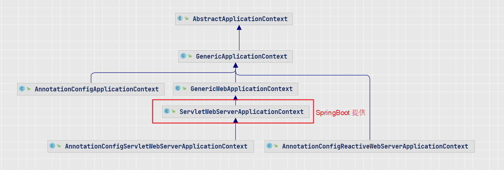

### SpringApplication

```java
public SpringApplication(ResourceLoader resourceLoader, Class<?>... primarySources) {
    this.resourceLoader = resourceLoader;
    // 配置类不能为空
    Assert.notNull(primarySources, "PrimarySources must not be null");
    this.primarySources = new LinkedHashSet<>(Arrays.asList(primarySources));
    // web类型，默认Servlet
    this.webApplicationType = WebApplicationType.deduceFromClasspath();
    // META-INF/spring.factories
    // 找出BootstrapRegistryInitializer 子类 实例化
    this.bootstrapRegistryInitializers = new ArrayList<>(
        getSpringFactoriesInstances(BootstrapRegistryInitializer.class));
    // 找出ApplicationContextInitializer 子类，并实例化
    setInitializers((Collection) getSpringFactoriesInstances(ApplicationContextInitializer.class));
    // ApplicationListener
    setListeners((Collection) getSpringFactoriesInstances(ApplicationListener.class));
    // 加载主类，main方法对于的类
    this.mainApplicationClass = deduceMainApplicationClass();
}
```


**getSpringFactoriesInstances**

```java
 // 通过SPI 机制加载META-INF/spring.factories， 获取type类
private <T> Collection<T> getSpringFactoriesInstances(Class<T> type, Class<?>[] parameterTypes, Object... args) {
    ClassLoader classLoader = getClassLoader();
    // Use names and ensure unique to protect against duplicates
    Set<String> names = new LinkedHashSet<>(SpringFactoriesLoader.loadFactoryNames(type, classLoader));
    // 实例化上面找出的类
    List<T> instances = createSpringFactoriesInstances(type, parameterTypes, classLoader, args, names);
    AnnotationAwareOrderComparator.sort(instances);
    return instances;
}
```


### run

```java
public ConfigurableApplicationContext run(String... args) {
    long startTime = System.nanoTime();
    // 创建DefaultBootstrapContext， 初始化加载的BootstrapRegistryInitializer，默认空
    DefaultBootstrapContext bootstrapContext = createBootstrapContext();
    ConfigurableApplicationContext context = null;
    // 配置属性
    configureHeadlessProperty();
    // 创建SpringApplicationRunListeners对象，同时实例化SpringApplicationRunListener(EventPublishingRunListener)
    SpringApplicationRunListeners listeners = getRunListeners(args);
    // 发送广播事件 ApplicationStartingEvent
    listeners.starting(bootstrapContext, this.mainApplicationClass);
    try {
        ApplicationArguments applicationArguments = new DefaultApplicationArguments(args);
        // 初始化环境（ApplicationServletEnvironment），发送事件：ApplicationEnvironmentPreparedEvent
        ConfigurableEnvironment environment = prepareEnvironment(listeners, bootstrapContext, applicationArguments);
        configureIgnoreBeanInfo(environment);
        // 打印Banner
        Banner printedBanner = printBanner(environment);
        // 根据web类型创建ApplicationContext，AnnotationConfigServletWebServerApplicationContext
        context = createApplicationContext();
        context.setApplicationStartup(this.applicationStartup);
        // 准备上下文，为context设置env， 转换器，初始化监听器， 发布事件ApplicationContextInitializedEvent， BeanFactory设置是否允许循环依赖，beanDefinition覆盖
        prepareContext(bootstrapContext, context, environment, listeners, applicationArguments, printedBanner);
        // 调用AbstractApplicationContext#refresh()， 方法中的onRefresh() 回调注册webServer： ServletWebServerApplicationContext#createWebServer
        refreshContext(context);
        // 回调，默认空
        afterRefresh(context, applicationArguments);
     
        // 发送事件
        listeners.started(context, timeTakenToStartup);
        // 执行IOC中的：ApplicationRunner，CommandLineRunner 
        callRunners(context, applicationArguments);
    } catch{...}

    listeners.ready(context, timeTakenToReady);

    return context;
}
```


prepareContext阶段中的applyInitializers，会向context中添加一些postProcessor，listener，等

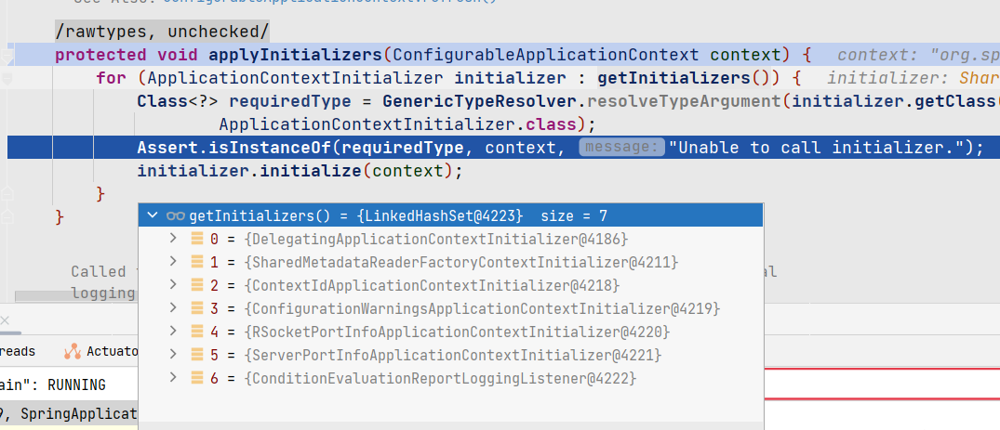


### @EnableAutoConfiguration

@SpringBootApplication 注解包含该注解，通常不需要手动引入。 自动配置bean在用户自定义bean处理完成后才会被应用

拥有了该注解即拥有了自动装配功能，对于开启事务、JPA 各种的支持 无需 在启动类中手动添加**@EnableXXX** 之类的， @EnaleXXX 由具体功能的包引入。

如果有特殊自定义的需求才考虑添加**@EnableXXX**


> 带有注解：
>
> @AutoConfigurationPackage       ---->  @Import(AutoConfigurationPackages.Registrar.class)
> @Import(AutoConfigurationImportSelector.class)

```
属性：
exclude
excludeName            
```


#### AutoConfigurationImportSelector

AutoConfigurationImportSelector implements DeferredImportSelector， ....

调用入口：

ConfigurationClassParser#parse


处理**DeferredImportSelector**类型：（AutoConfigurationImportSelector ）


register：


processGroupImports：


执行目标：


**AutoConfigurationImportSelector#process**


会读取：

spring.factories文件中EnableAutoConfiguration的配置，以及：

META-INF/spring/org.springframework.boot.autoconfigure.AutoConfiguration.imports


需要注意的是这里的filter中仅仅只是简单的判断当前class是否能够被加载，对于**OnBeanCondition**只有在后续处理@Conditional注解时单独判断才可以确定是否存在bean对象。


EnableAutoConfiguration：


AutoConfigurationImportFilter配置：会判断配置类中是否有下列注解，条件是否成立


### @Conditional

属于spring 的注解。

> @ConditionalOnMissingBean: 当某个bean不存在时，  内部使用  @Conditional(OnClassCondition.class)
>
> @Conditional(clazz.class)： 通过class 判断条件是否成立， 通常clazz 实现 Condition，  SpringBootCondition


> 在AutoConfigurationImportSelect中会处理配置类中的Conditionalxxx， 处理完成后解析配置时会使用conditionEvaluator解析@Conditional注解


#### Configuration解析时条件判断

回顾Configuration 类解析流程：

首先解析Configuration 为BeanDefinition，注册到registry。 这里的shouldSkip 通常**不会执行match** 流程，OnBeanCondition只会在**REGISTER_BEAN** 阶段 校验match 逻辑。

```shell
ConfigurationClassParser#doProcessConfigurationClass： 从启动类解析 生成BeanDefinition
解析启动类@ComponentScan， scan file， configuration class:
SimpleMetadataReader 解析class： 基于ASM 实现
ConditionEvaluator#shouldSkip: PARSE_CONFIGURATION
```


invokeBeanFactoryPostProcessors阶段 会继续处理 BeanDefinition：

这里属于**REGISTER_BEAN**阶段

这个阶段前已经把所有的BeanDefinition已经注册到registry了， 这里会继续判断BeanDefinition是否满足@Conditional条件，如果不满足将会从registry中remove掉。

```shell
ConfigurationClassPostProcessor#postProcessBeanDefinitionRegistry
ConfigurationClassBeanDefinitionReader#loadBeanDefinitionsForConfigurationClass
继续校验：conditionEvaluator.shouldSkip： REGISTER_BEAN
这个会remove BeanDefinition。
```


这里以MessageSourceAutoConfiguration 为例，分析解析顺序：

```java
@AutoConfiguration
// 内部标记了 @Conditional(OnClassCondition.class)
@ConditionalOnMissingBean(name = AbstractApplicationContext.MESSAGE_SOURCE_BEAN_NAME, search = SearchStrategy.CURRENT)
@AutoConfigureOrder(Ordered.HIGHEST_PRECEDENCE)
@Conditional(ResourceBundleCondition.class)
@EnableConfigurationProperties(MessageSourceProperties.class)
@ImportRuntimeHints(MessageSourceRuntimeHints.class)
public final class MessageSourceAutoConfiguration {
```


ConfigurationClassParser#processConfigurationClass：

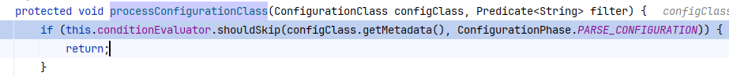


```java
public boolean shouldSkip(@Nullable AnnotatedTypeMetadata metadata, @Nullable ConfigurationPhase phase) {
    if (metadata == null || !metadata.isAnnotated(Conditional.class.getName())) {
       return false;
    }
	// 实例化标记 Conditional的class： ResourceBundleCondition、OnBeanCondition
     List<Condition> conditions = collectConditions(metadata);
    for (Condition condition : conditions) {
       ConfigurationPhase requiredPhase = null;
       if (condition instanceof ConfigurationCondition configurationCondition) {
          requiredPhase = configurationCondition.getConfigurationPhase();
       }
        // 会根据requiredPhase来判断当前是否需要执行matchs方法，确保所有condition都为true
       if ((requiredPhase == null || requiredPhase == phase) && !condition.matches(this.context, metadata)) {
          return true;
       }
    }
    return false;
}
```


SpringBootCondition#matches:

```java
public final boolean matches(ConditionContext context, AnnotatedTypeMetadata metadata) {
    String classOrMethodName = getClassOrMethodName(metadata);
    try {
        // 会调用MessageSourceAutoConfiguration.ResourceBundleCondition#getMatchOutcome
        // 如果是OnClassCondition，则会调用OnClassCondition#getMatchOutcome，内部会判断ConditionalOnClass、ConditionalOnMissingClass 是否满足
        // ConditionmOutcome 内部会包装是否验证成功，以及一些日志信息
        ConditionOutcome outcome = getMatchOutcome(context, metadata);
        logOutcome(classOrMethodName, outcome);	// 记录日志
        recordEvaluation(context, classOrMethodName, outcome);	// 记录
        return outcome.isMatch(); // getMatchOutcome 内部验证通过这里会返回true
    }
}
```


#### BeanFactory#registry

注册bean时，依然会执行match 逻辑， 流程大致如下：

```java
org.springframework.context.annotation.AnnotationConfigApplicationContext#register
org.springframework.context.annotation.AnnotatedBeanDefinitionReader#registerBean
org.springframework.context.annotation.AnnotatedBeanDefinitionReader#doRegisterBean
org.springframework.context.annotation.ConditionEvaluator#shouldSkip

org.springframework.boot.autoconfigure.condition.OnBeanCondition#getMatchOutcome: 处理 ConditionalOnBean 、ConditionalOnSingleCandidate、 ConditionalOnMissingBean
ConditionalOnMissingBean：
evaluateConditionalOnMissingBean： MatchResult 有值，就返回noMatch
OnBeanCondition#getMatchingBeans： 根据class 查找BeanDefinition， 记录到MatchResult
```


#### spring.factories 配置校验

> OnBeanCondition extends FilteringSpringBootCondition implements ConfigurationCondition
>
> 用于判断从spring.factories 文件中读取的配置 是否满足条件

```java
public boolean[] match(String[] autoConfigurationClasses, AutoConfigurationMetadata autoConfigurationMetadata) {
    ConditionEvaluationReport report = ConditionEvaluationReport.find(this.beanFactory);
    ConditionOutcome[] outcomes = getOutcomes(autoConfigurationClasses, autoConfigurationMetadata);
    boolean[] match = new boolean[outcomes.length];
    for (int i = 0; i < outcomes.length; i++) {
        match[i] = (outcomes[i] == null || outcomes[i].isMatch());
        if (!match[i] && outcomes[i] != null) {
            logOutcome(autoConfigurationClasses[i], outcomes[i]);
            if (report != null) {
                report.recordConditionEvaluation(autoConfigurationClasses[i], this, outcomes[i]);
            }
        }
    }
    return match;
}
```


### Autoconfiguration 中的配置文件：


**org.springframework.boot.autoconfigure.AutoConfiguration.imports**

> 3.0 引入，替代spring.factories文件


会与spring.factories文件，key为EnableAutoConfiguration的一起读取作为**配置类**，这里可能会有重复的，因此会进行去重

代码位置：AutoConfigurationImportSelector#getAutoConfigurationEntry


**additional-spring-configuration-metadata.json**

主要用于在IDE工具中编写配置文件，如`application.properties`或`application.yml`能够产生一些提示信息。该文件大部分都是在编译器自动生成，也可以手动编写一些配置以应对一些特殊的场景。


细节参考百度。


**spring.factories**

> 最重要的配置文件， 3.0 移除


**spring-autoconfigure-metadata.properties**

FilteringSpringBootCondition#match() : 会判断配置类是否在配置文件中添加了条件，判断是否成立。

AutoConfigurationMetadataLoader： 负责读取配置文件 META-INF/spring-autoconfigure-metadata.properties


配置文件内容：


这里仅仅是判断class是否能够被加载，处理通过会加入配置列表，对于ConditionOnBean 后续在处理@**Conditional**注解时才会判断beanFactory中是否存在


### @EnableConfigurationProperties

https://blog.csdn.net/qq_26751319/article/details/126543629

@ConfigurationProperties

ConfigurationPropertiesBindingPostProcessor#postProcessBeforeInitialization

binder


@AutoConfigureAfter

```
@EnableConfigurationProperties(ServerProperties.class)
```


ConfigFileApplicationListener： 监听器

ConfigDataEnvironmentPostProcessor


bootstrap.yaml 配置文件是由cloud 导入的， springboot 默认是不会加载该配置文件


### **AutoConfiguration顺序**

想排除依赖中定义的Bean：使用exclude 排除自动装配类。 @SpringBootApplication(exclude)


如果项目与依赖jar定义了相同的Configuration，项目优先加载。


2个jar包里面自动装配里面有redisconfig, 并且都有 conditionmissbean,那么怎么让其中一个先生效, 后面一个排除掉：

**@Autoconfigurationbefore**，  主要靠**AutoConfigurationSorter**


spring的bean里面做了 一些扩展, 比如beanfactorypostprocess, 这个怎么在cloud里面 发现被调用了2次?

在springboot里面只被调用了一次?

**可以读取是不是bootstrap触发的容器初始化**


为啥用Completablefuture 默认的线程池, 为啥在idea里面 没问题, 在线上运行的时候报类找不到?

forkjoin common pool的类加载器用的不是你用的那个。 准确来说如果你是自定义类加载器 common pool不会用这个类加载器


### AOP类

**ExposeInvocationInterceptor**:  能够获取当前AOP调用过程中的MethodInvocation对象

```
(ReflectiveMethodInvocation)ExposeInvocationInterceptor.currentInvocation().getThis(),   getProxy()
```


OriginTrackMapSourceProperty: 配置文件默认的PropertySource


### WEB容器

> 见语雀

ServletWebServerFactoryAutoConfiguration

ServletWebServerFactoryConfiguration


### 配置文件解析过程：

#### PropertySource解析：
ConfigurationClassParser#doProcessConfigurationClass


#### @ConfigurationProperties
ConfigurationPropertiesBindingPostProcessor#postProcessBeforeInitialization：


Binder.java


#### YML文件加载：
YamlPropertySourceLoader


## Spring Data JPA实现

### @EnableJpaRepositories


https://zhuanlan.zhihu.com/p/520510314

```
 ---> JpaRepositoriesRegistrar.java
```

注册Bean对象：


RepositoryBeanDefinitionRegistrarSupport.class#registerBeanDefinitions:

```java
public void registerBeanDefinitions(AnnotationMetadata metadata, BeanDefinitionRegistry registry, BeanNameGenerator generator) {
   // 有@EnableJpaRepositories 注解
    if (metadata.getAnnotationAttributes(this.getAnnotation().getName()) != null) {
        // 注解上的属性信息
        AnnotationRepositoryConfigurationSource configurationSource = new AnnotationRepositoryConfigurationSource(metadata, this.getAnnotation(), this.resourceLoader, this.environment, registry, generator);
        // JpaRepositoryConfigExtension: JPA 扩展信息
        RepositoryConfigurationExtension extension = this.getExtension();
        RepositoryConfigurationUtils.exposeRegistration(extension, registry, configurationSource);
        // 核心
        RepositoryConfigurationDelegate delegate = new RepositoryConfigurationDelegate(configurationSource, this.resourceLoader, this.environment);
        delegate.registerRepositoriesIn(registry, extension);
    }
}
```


### RepositoryConfigurationDelegate

```java
public List<BeanComponentDefinition> registerRepositoriesIn(BeanDefinitionRegistry registry,
			RepositoryConfigurationExtension extension) {

		// JpaRepositoryConfigExtension: 注册JPA 相关的一些组件
		extension.registerBeansForRoot(registry, configurationSource);

		RepositoryBeanDefinitionBuilder builder = new RepositoryBeanDefinitionBuilder(registry, extension,
				configurationSource, resourceLoader, environment);
		List<BeanComponentDefinition> definitions = new ArrayList<>();

		// 1. 自定义一个ClassPathScanningCandidateComponentProvider重写isCandidateComponent方法，
    ///调用其findCandidateComponents()方法扫描Repository相关包获取其BeanDefinition（className=Repository接口的类型类）封装成RepositoryConfiguration对象。
		Collection<RepositoryConfiguration<RepositoryConfigurationSource>> configurations = extension
				.getRepositoryConfigurations(configurationSource, resourceLoader, inMultiStoreMode);

		Map<String, RepositoryConfiguration<?>> configurationsByRepositoryName = new HashMap<>(configurations.size());

		for (RepositoryConfiguration<? extends RepositoryConfigurationSource> configuration : configurations) {

			configurationsByRepositoryName.put(configuration.getRepositoryInterface(), configuration);
// 2.创建ClassName=JpaRepositoryFactoryBean的BeanDefinition，并设置构造函数为
      // 当前Repository的类型类，用于FactoryBean的getObjectType()方法返回
			BeanDefinitionBuilder definitionBuilder = builder.build(configuration);

			extension.postProcess(definitionBuilder, configurationSource);

			if (isXml) {
				extension.postProcess(definitionBuilder, (XmlRepositoryConfigurationSource) configurationSource);
			} else {
				extension.postProcess(definitionBuilder, (AnnotationRepositoryConfigurationSource) configurationSource);
			}

			AbstractBeanDefinition beanDefinition = definitionBuilder.getBeanDefinition();
			beanDefinition.setResourceDescription(configuration.getResourceDescription());

			String beanName = configurationSource.generateBeanName(beanDefinition);

			if (logger.isTraceEnabled()) {
				logger.trace(LogMessage.format(REPOSITORY_REGISTRATION, extension.getModuleName(), beanName, configuration.getRepositoryInterface(),
						configuration.getRepositoryFactoryBeanClassName()));
			}

			beanDefinition.setAttribute(FACTORY_BEAN_OBJECT_TYPE, configuration.getRepositoryInterface());
// 3. 将封装了ClassName=JpaRepositoryFactoryBean的BeanDefinition注册到BeanDefinitionRegistry中
			registry.registerBeanDefinition(beanName, beanDefinition);
			definitions.add(new BeanComponentDefinition(beanDefinition, beanName));
		}

		potentiallyLazifyRepositories(configurationsByRepositoryName, registry, configurationSource.getBootstrapMode());

		watch.stop();

		repoScan.tag("repository.count", Integer.toString(configurations.size()));
		repoScan.end();

		if (logger.isInfoEnabled()) {
			logger.info(LogMessage.format("Finished Spring Data repository scanning in %s ms. Found %s %s repository interfaces.", //
					watch.getLastTaskTimeMillis(), configurations.size(), extension.getModuleName()));
		}

		return definitions;
	}
```


### SimpleJpaRepository

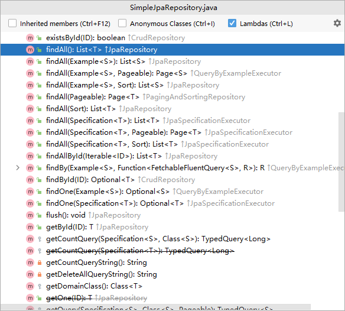

```java
private final JpaEntityInformation<T, ?> entityInformation;
private final EntityManager em;
private final PersistenceProvider provider;

private @Nullable CrudMethodMetadata metadata;
private EscapeCharacter escapeCharacter = EscapeCharacter.DEFAULT;
```


@Repository 标记的接口会作为一个FactoryBean，JpaRepositoryFactoryBean 作为resolveTargetType， 在处理**JpaRepositoryFactoryBean** 时，已经可以看到对应的属性 信息已经在BeanDefinition中存在，在populateBean 阶段注入属性时，会进一步调用getBean解析得到具体的值，最后设置到对象中

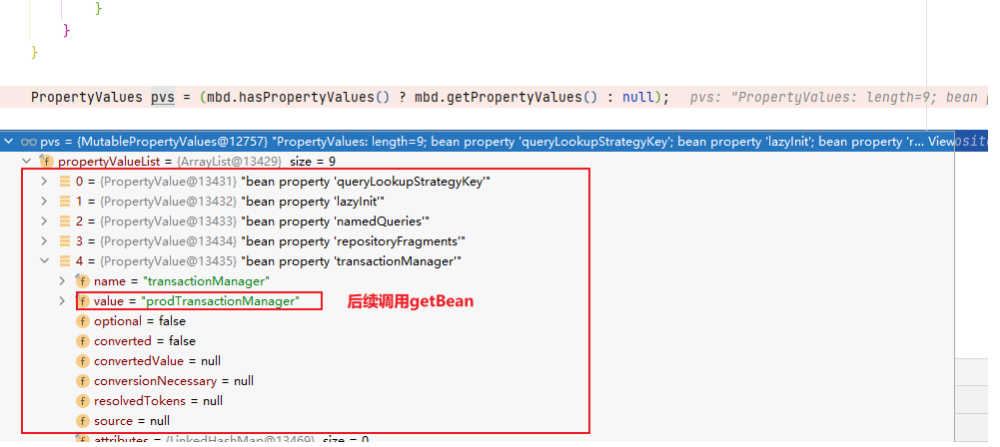

populateBean阶段完成后：

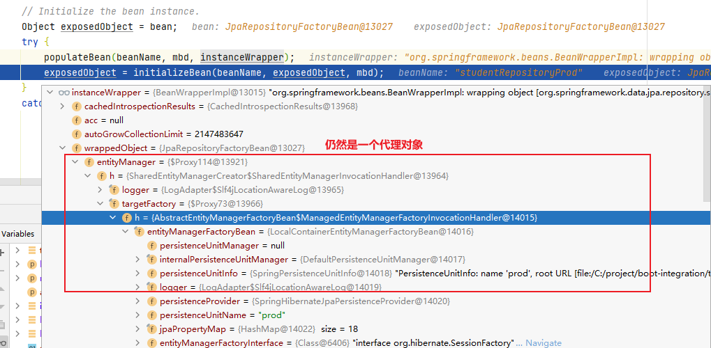


### 代理对象创建过程

JPA扫描阶段会为DAO接口创建BeanDefinition，同时设置为FactoryBean，resolveTargetType为 **JpaRepositoryFactoryBean**， 该对象在调用init方法时会调用**afterPropertiesSet**，

最后在RepositoryFactoryBeanSupport#afterPropertiesSet中完成一些属性的初始化

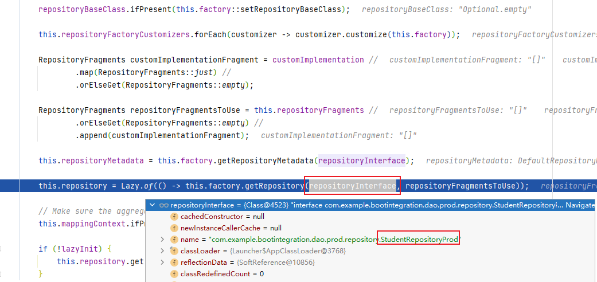


**getObject**： 即上面的repository属性

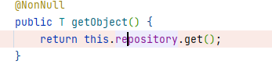

RepositoryFactorySupport#getRepository：

下面会得到接口中的泛型对象

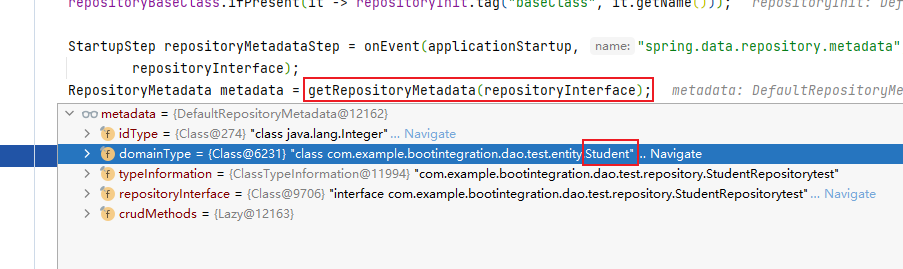

创建代理对象：

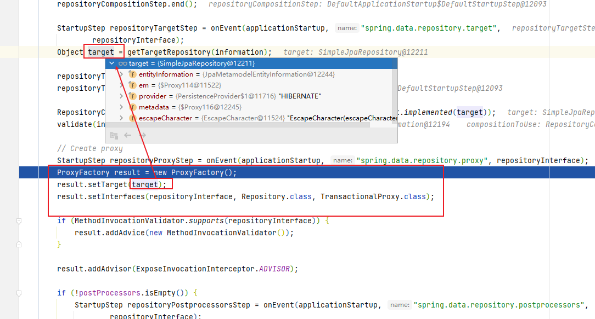


下面进行添加Advice

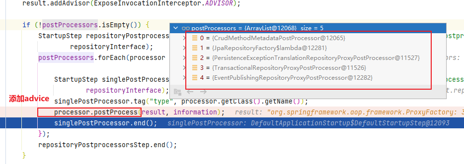


### 执行过程

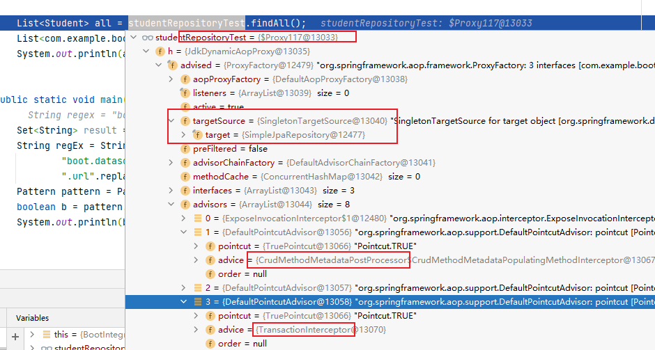


拦截链：

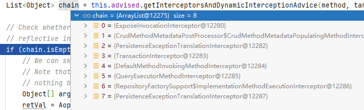

