# spring-cloud


## OpenFeign

Feign makes writing java http clients easier。 Spring Cloud Open feign添加了对 Spring MVC 注解的支持

**FeignClientConfiguration**:  构造Feign 相关对象. FeignBuilder， okhttp...

FeignClientsRegistrar 会注册@FeignClient 注解相关的bean，设置了instanceSupplier。

supplier：**FeignClientFactory#createClient**，会创建NameRoutingTarget 生成一个bean代理对象


入口：**NameRoutingTarget#apply**  实现官方的Target， 重新了url， apply 方法。

核心类：RequestTemplate：包含了请求相关参数，URL等。


调用远程方法：

入口：feign.SynchronousMethodHandler#invoke --> executeAndDecode

1. 首先执行feign拦截器，拦截器中会处理RequestTemplate对象。
2. 将RequestTemplate对象转换为Request对象
3. 调用okhttp client提交请求对象 Request
4. 将feign的的Request转为okhttp的Request
5. 调用okhttp的newCall方法

进入Okhttp内部：一个实例只有一个okhttp实例
1. RealCall#execute --> getResponseWithInterceptorChain
2. 生成一个RealInterceptorChain类，包含了okhttp的拦截器
3. 依次执行拦截器，
    - ConnectInterceptor: 处理connection信息
        - RealCall.kt#initExchange： 最终调用：java.net.Socket#connect 建立连接
    - CallServerInterceptor：发起server请求


### FeignClientsRegistrar

主类添加@EnableFeignClients注解后， import了FeignClientsRegistrar ，  会解析每个**@FeignClient** 生成BeanDefinition

全局配置bean生成一个FeignClientSpecification：

对于每个@FeignClient接口类：
生成一个FeignClientSpecification
生成一个FeignClientFactoryBean

spring.cloud.openfeign.lazy-attributes-resolution： 懒加载， instanceSupplier

spring.cloud.openfeign.client.refresh-enabled： 注册refreshScope的bean

FeignClientSpecification


FeignAutoConfiguration

创建Bean：FeignClientFactory，包含所有的Configuration （即：FeignClientSpecification）


### FeignClientFactory初始化：

继承NamedContextFactory： contexts(每个Feign接口 有一个applicationContext)。 这是spring cloud context包的，LoadBalancer 也是类似的操作创建一个context。
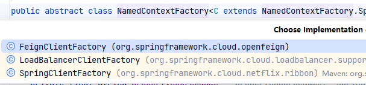


- getContext()：会创建一个AnnotationConfigApplicationContext(beanFactory作为参数)，  parent 为原来的Application
- beanFactory为新建的DefaultListableBeanFactory （extend BeanDefinitionRegistry）


将下面的注册到新创建的**ApplicationContext**：

- FeignClientSpecification配置的Configuration (即注解指定的Configuration)
- FeignClientsConfiguration： 会构建Openfeign的Encoder、Decoder、Contract、FeignLoggerFactory、Retryer etc

执行context#refresh，初始化相关的Bean


FeignClientFactoryBean： contextId区分唯一client
#getTarget:

1. feign：
    1.1 从FeignClientFactory中获取**applicationContext**， 获取到Feign.Builder、encoder、decoder、contract （都来自：FeignClientsConfiguration） 构建Feign.Builder 对象
    1.2 configureFeign: 配置builder，连接超时、requestInterceptor、responseInterceptor


2. 判断是否有URL，没有URL 走loadBalance、
   - 如果没有URL，那么将clientName 作为url，走loadBalance。 从FeiggClientFactory创建的context中获取client： FeignBlockingLoadBalancerClient，内部有一个loadbalance属性：
     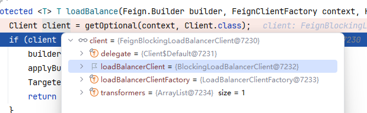

3. 最后生成ReflectiveFeign代理对象： ReflectiveFeign#newInstance

   如果是loadbalance，内部的client 就是 **FeignBlockingLoadBalancerClient**， 包含了loadBalancerClient


当调用client 接口方法时：
1. 通过dispatcher 转发到对应的SynchronousMethodHandler（一个方法对应一个MethodHander）
2. 创建RequestTemplate，执行interceptor，构建request，
3. client.execute(request,options): client 默认为JDK 的HTTPURLConnection
   loadbalance则为：

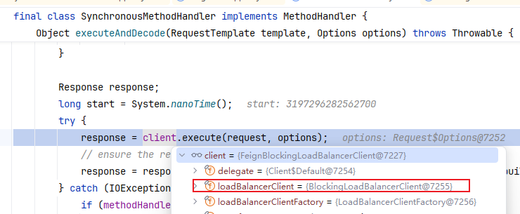


## Eureka

一文搞懂：
https://juejin.cn/post/7407782285460144163

系列文章：

https://juejin.cn/post/7020203732407156750

https://juejin.cn/post/7020208871809482766

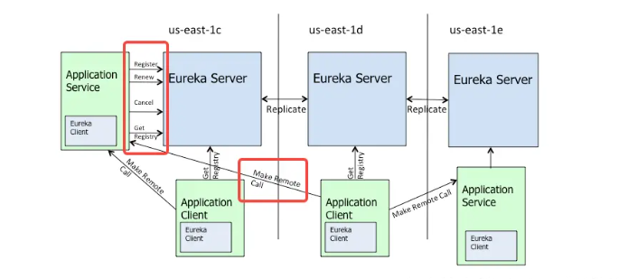

- **Register :服务注册**

  Eureka客户端向Eureka Server注册时，它提供自身的元数据，比如IP地址、端口等

- **Renew：服务续约**

  Eureka客户端会每隔30秒发送一次心跳来续约。通过续约来告知Eureka Server该客户端仍然存在。

- **Get Registries：获取注册列表信息**
[springcloud.md](springcloud.md)
  Eureka客户端从服务器获取注册表信息，将其缓存到本地。客户端会使用该信息查找其他服务，从而进行远程调用。该注册列表信息定期（每30秒）更新一次。

- **Cancel：服务下线**

  Eureka客户端在程序关闭时向Eureka服务器发送取消请求。

- **服务剔除：**

  Eureka Server在启动的时候会创建一个定时任务，每隔一段时间（默认60秒），从当前服务清单中把超时没有续约（默认90秒）的服务剔除。

- **Make Remote Call:**

  从eureka client到eureka client,远程调用


### Server 源码：

#### 服务注册：

当client 启动后发起注册请求后，eureka server 将会接受请求进行处理

com.netflix.eureka.resources.ApplicationResource#addInstance 

--> registry.register: 将信息记录到`AbstractInstanceRegistry`#registry

```java
// 记录serviceName，<ip, lease<instance>>， Lease：包含实例的注册信息、过期时间等
ConcurrentHashMap<String, Map<String, Lease<InstanceInfo>>> registry
        = new ConcurrentHashMap<String, Map<String, Lease<InstanceInfo>>>();
```


AbstractInstanceRegistry：

```java
public void register(InstanceInfo registrant, int leaseDuration, boolean isReplication) {
    read.lock();
    try {
        // 是否存在注册过的appname，如果没有注册过new 一个map
        Map<String, Lease<InstanceInfo>> gMap = registry.get(registrant.getAppName());
        if (gMap == null) {
            final ConcurrentHashMap<String, Lease<InstanceInfo>> gNewMap = new ConcurrentHashMap<String, Lease<InstanceInfo>>();
            gMap = registry.putIfAbsent(registrant.getAppName(), gNewMap);
            if (gMap == null) {
                gMap = gNewMap;
            }
        }
        Lease<InstanceInfo> existingLease = gMap.get(registrant.getId());
        // Retain the last dirty timestamp without overwriting it, if there is already a lease
        if (existingLease != null && (existingLease.getHolder() != null)) {
          // 如果之前已经注册过相同的server，如果当前的最后活跃时间小于旧的，那么就使用旧的实例，否则用新的实例覆盖旧的。  lastDirtyTimestamp
          
        } else {
           
        }
        Lease<InstanceInfo> lease = new Lease<>(registrant, leaseDuration);
        if (existingLease != null) {
            lease.setServiceUpTimestamp(existingLease.getServiceUpTimestamp());
        }
        // 存入map
        gMap.put(registrant.getId(), lease);

        // If the lease is registered with UP status, set lease service up timestamp
        if (InstanceStatus.UP.equals(registrant.getStatus())) {
            lease.serviceUp();
        }
		// 更新当前实例的缓存： 其实就是清空下 readWriteCacheMap
        invalidateCache(registrant.getAppName(), registrant.getVIPAddress(), registrant.getSecureVipAddress());
      
    } finally {
        read.unlock();
    }
}
```


#### client主动下线：

1. 首先client 会发出：POST /eureka/apps/SERVICEA HTTP/1.1\r\

​		server 处理入口也是 `AbstractInstanceRegistry`#register， 只不过status 是down， 会将实例设置为down状态。同时执行invalidateCache：会清理 readWriteCacheMap

2. 发出cancel 请求：DELETE /eureka/apps/SERVICEA/localhost:servicea:8081 HTTP/1.1\r\n

com.netflix.eureka.resources.InstanceResource#cancelLease:

立即从registry 中remove 实例， 同时执行invalidateCache 清空实例缓存

```java
protected boolean internalCancel(String appName, String id, boolean isReplication) {
    read.lock();
    try {
        CANCEL.increment(isReplication);
        Map<String, Lease<InstanceInfo>> gMap = registry.get(appName);
        Lease<InstanceInfo> leaseToCancel = null;
        if (gMap != null) {
            leaseToCancel = gMap.remove(id); // remove 实例
        }
        if (leaseToCancel == null) {
        } else {
            leaseToCancel.cancel();
            InstanceInfo instanceInfo = leaseToCancel.getHolder();
            invalidateCache(appName, vip, svip); // invalidate cache 
            logger.info("Cancelled instance {}/{} (replication={})", appName, id, isReplication);
        }
    } finally {
        read.unlock();
    }
    return true;
}
```


#### 获取服务列表：

ApplicationsResource#getContainers、getContainerDifferential
--> com.netflix.eureka.registry.ResponseCacheImpl#getValue

默认使用读写分离的形式来提高性能，减少序列号成本开销(Value：为序列化好的结果，可以直接返回给client)。

- readOnlyCacheMap: 首先重这里读取
- readWriteCacheMap： 上面读不到，从这里读取，最后放入readOnlyCacheMap
- AbstractInstanceRegistry#registry：记录注册的服务

```java
// 30s 会自动更新 readWriteCacheMap 到readOnlyCacheMap
private final ConcurrentMap<Key, Value> readOnlyCacheMap = new ConcurrentHashMap<Key, Value>();
// Caffeine 定义： 过期时间180s， 当没有读取到数据的时候，会从registery加载
// 当服务下线、过期、注册、状态变更，会执行invalidateCache()来清除缓存中的数据
private final LoadingCache<Key, Value> readWriteCacheMap;
// 记录client 注册的信息
// 底层 即 -->
// ConcurrentHashMap<String, Map<String, Lease<InstanceInfo>>> registry
//           = new ConcurrentHashMap<String, Map<String, Lease<InstanceInfo>>>();
private final AbstractInstanceRegistry registry;


Value getValue(final Key key, boolean useReadOnlyCache) { // useReadOnlyCache: default true
    Value payload = null;
        if (useReadOnlyCache) {
            final Value currentPayload = readOnlyCacheMap.get(key); // first read
            if (currentPayload != null) {
                payload = currentPayload;
            } else {
                payload = readWriteCacheMap.get(key); 
                readOnlyCacheMap.put(key, payload);
            }
        } else {
            payload = readWriteCacheMap.get(key);
        }
    return payload;
}
```


#### 续期：

DiscoveryClient#renew： client 发起

InstanceResource#renewLease --> renew： server 接受

--> 更新registry的Lease的 lastUpdateTimestamp： `当前加90s` （默认90s 过期，注册的时候client 可指定。 这个也将作为 90s内没有心跳将会移除）


#### 服务自动剔除： 

至少90s没有心跳会被移除。 会受到 心跳任务 跟 检查任务的执行时差影响


AbstractInstanceRegistry#postInit: 开启定时任务60s

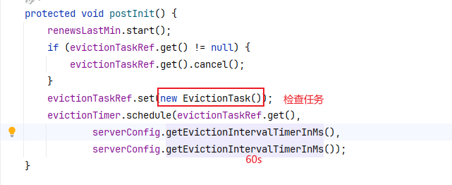


isLeaseExpirationEnabled： Eureka 的 0.85 阈值，就是“自我保护触发线”。当实际心跳续约量低于预期的 85% 时，Eureka 会停止过期剔除，避免在网络异常时把大量正常实例误删

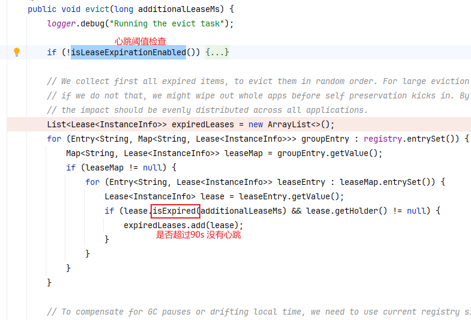


当90s 没有收到心跳，会尝试剔除服务。这里也会有自保护机制，最大剔除 过期的0.85。

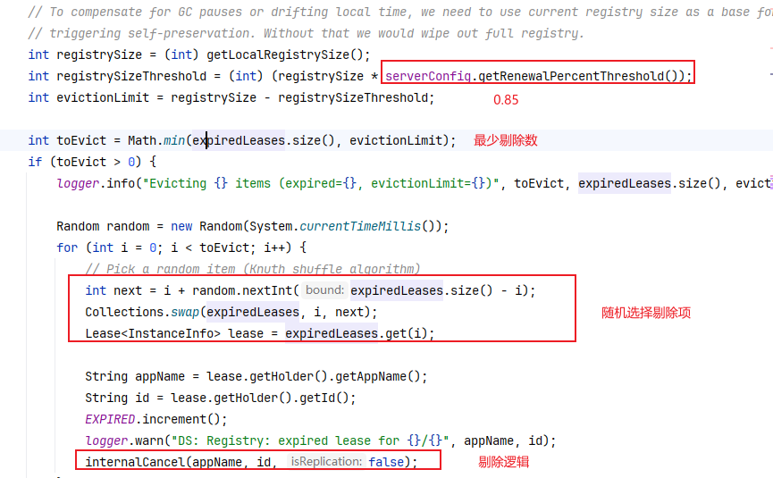


### Client 源码：

**com.netflix.discovery.DiscoveryClient**: 核心类，包含了 注册、获取实例列表、心跳续期 方法。

initScheduledTasks()： 初始化一系列定时任务

- heartbeat : 发起心跳，register 续期
  生成任务提交heartbeatExecutor：
               30s 向 eureka server 发起一次心跳。 失败的话以2倍回退， 下一次 60s， 最大 30 * 10 = 300s
               task： DiscoveryClient#renew
- cacheRefresh: 即定时抓取实例。 增量更新： http://localhost:8761/eureka/apps/delta
  上面类似30s 发送一次， task： CacheRefreshThread


#### 抓取实例：

com.netflix.discovery.shared.**Applications**： 记录了所有的实例注册信息

- AbstractQueue<Application> applications;
- private final Map<String, Application> appNameApplicationMap;
- Map<String, VipIndexSupport> secureVirtualHostNameAppMap;
- Map<String, VipIndexSupport> virtualHostNameAppMap;    // 通常从这里获取实例
  - VipIndexSupport: 记录一个service的多个实例，
    AtomicLong roundRobinIndex： 可以通过他实现轮询负载均衡 
    AbstractQueue<InstanceInfo> instances： 用于存储与某个 VIP 关联的所有服务实例（`InstanceInfo`）
    AtomicReference<List<InstanceInfo>> vipList ： 存储与当前 VIP 关联的所有服务实例的列表。 默认获取实例取这个， 跟上面没区别


由定时任务触发：获取到registry信息后存入：AtomicReference<Applications> localRegionApps

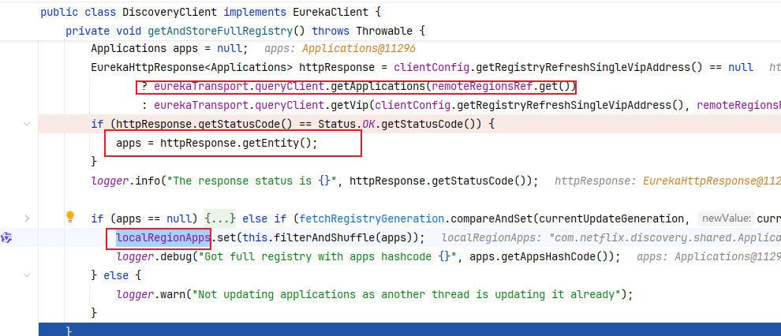


在get 的时候会取出Application：

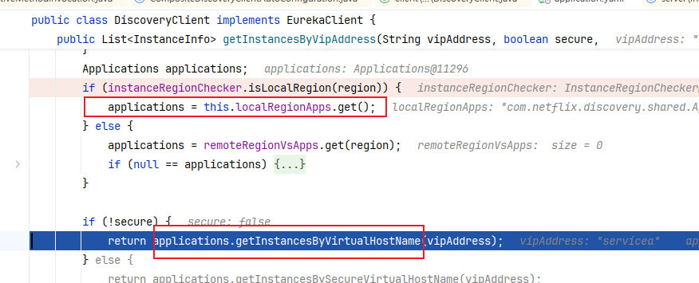


####  使用

```java
// CompositeDiscoveryClient
private final DiscoveryClient discoveryClient;
@GetMapping("helloEureka")
public String helloWorld() {
    ServiceInstance serviceInstance = discoveryClient.getInstances("servicea").get(0);
    return "";
}
```


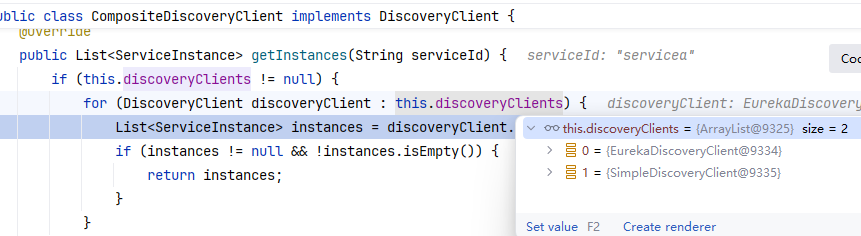

执行EurekaDiscoveryClient， 最终执行到eureka类：

com.netflix.discovery.DiscoveryClient#getInstancesByVipAddress(java.lang.String, boolean)

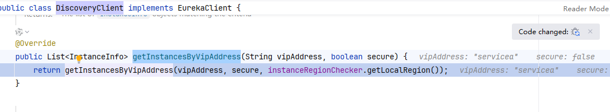


从map中获取实例：

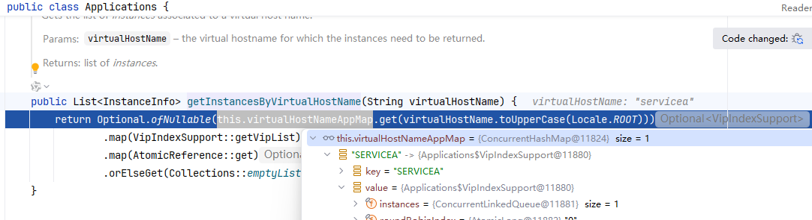


# loadbalancer
**Ribbon**：配置和功能较为复杂，支持多种负载均衡策略（如轮询、加权、随机等），但因为功能强大，也带来了较多的复杂性。 Netflix 已经不再维护 Ribbon

**Spring Cloud LoadBalancer**：更加轻量和简化，专注于负载均衡的核心功能，去掉了很多 Ribbon 中复杂的配置选项和功能。


ILoadBalancer 组件：  https://juejin.cn/post/7020600227077832740?searchId=2026031410581140FFAB33346CB1994791

spring-cloud-ribbon 使用:  https://cloud.spring.io/spring-cloud-netflix/multi/multi_spring-cloud-ribbon.html

spring cloud loadBalancer 官方doc：https://docs.spring.io/spring-cloud-commons/reference/spring-cloud-commons/loadbalancer.html?utm_source=chatgpt.com


## netflix-ribbon
解析：https://juejin.cn/post/7020585268109377550?searchId=2026031410581140FFAB33346CB1994791

引入 spring-cloud-starter-netflix-ribbon 后， 会自动引入ribbon相关库。
```xml
        <dependency>
            <groupId>org.springframework.cloud</groupId>
            <artifactId>spring-cloud-starter-netflix-ribbon</artifactId>
            <version>2.2.2.RELEASE</version>
        </dependency>
```

**RibbonAutoConfiguration**
如果没有LoadBalancerClient 就会使用 RibbonLoadBalancerClient

```java

@AutoConfigureAfter(
        name = "org.springframework.cloud.netflix.eureka.EurekaClientAutoConfiguration")
@AutoConfigureBefore({ LoadBalancerAutoConfiguration.class,     // LoadBalancerAutoConfiguration： 优先使用spring cloud load balance
        AsyncLoadBalancerAutoConfiguration.class })
public class RibbonAutoConfiguration {
    @Bean
    @ConditionalOnMissingBean(LoadBalancerClient.class)
    public LoadBalancerClient loadBalancerClient() {
        return new RibbonLoadBalancerClient(springClientFactory());
    }
}

```


### 核心

对比loadbalance：

- 自定义配置使用注解 @RibbonClients  类似 @LoadBalancerClients， 由 RibbonClientConfigurationRegistrar 处理
- LoadBalancerClient： ribbon 为：RibbonLoadBalancerClient ， 对应loadbalance的 BlockingLoadBalancerClient， 新版的spring cloud 已经不兼容 ribbon了
- 执行流程： RibbonLoadBalancerClient#execute:  getLoadBalancer 获取 ILoadBalancer ,  执行器chooseServer 得到一个server
  - 类似BlockingLoadBalancerClient #execute:  choose 获取ReactiveLoadBalancer对象， 执行choose 获取一个server


loadbalance默认实现：

- ribbon 为ZoneAwareLoadBalancer，接口ILoadBalancer
  -  loadbalance 为RoundRobinLoadBalancer

- IRule： ribbon 具体的负载均衡实现接口。默认为： ZoneAvoidanceRule： 区域亲和负载均衡算法，优先调用一个zone区间中的服务，并使用轮询算法
  Server实例中会有一个状态标记是否可用，通过Eureka client 更新状态。
  - RoundRobinRule:  轮询， 获取到失败的会继续重试， 默认10次
  - RandomRule:  随机，获取到失败重试
  - AvailabilityFilteringRule: 会过滤掉多次访问故障 处于断路器状态的服务， 以及并发数量超过阈值的服务， 对剩下的使用轮询选取
  - WeightedResponseTimeRule:  根据平均响应时间计算所有服务的权重，响应时间越快服务权重越大。 启动时信息不足，可以使用轮询策略，一定时间后采用权重策略。
  - ~~ResponseTimeWeightedRule~~： 过期，推荐使用WeightResponseTimeRule，实现都一样
  - RetryRule: 默认使用轮询，当获取到故障的服务后会 重新获取。 默认重试 500ms内
  - BestAvailableRule:  过滤掉 断路器状态服务，然后选择一个并发量最小的
  - **ZoneAvoidanceRule**: 默认规则，区域亲和负载均衡算法。优先选择相同区域的、可用性高的server。  组合了 ZoneAvoidancePredicate， AvailabilityPredicate

BaseLoadBalancer：

会缓存Server 列表，并定时更新，从Eureka client中获取最新的状态：

```java
// choose时：从这里获取后，会判断server状态，如果宕机状态需要重新选择
protected volatile List<Server> allServerList = Collections.synchronizedList(new ArrayList<Server>());
// 
protected volatile List<Server> upServerList = Collections.synchronizedList(new ArrayList<Server>());

```


## Spring cloud loadbalancer 2025 实现

跟之前版本实现不同。

- ServiceInstanceListSupplier： 获取服务实例列表，是负载均衡的基础数据来源。

- ReactiveLoadBalancer： 负载均衡器核心抽象接口，提供实现策略：轮询、随机（默认）。
- LoadBalancerClient： 提供同步阻塞方式的服务实例选择。
- ServiceInstanceListSupplier.Builder： 构造实例列表供应器的 Builder，用于结合 DiscoveryClient 自动提供可用实例列表。
- ReactorLoadBalancerExchangeFilterFunction：在 WebClient 中应用 LoadBalancer 策略的 Filter，用于实际请求路由。


```java
public final class ServiceInstanceListSupplierBuilder {
    //  DiscoveryClientServiceInstanceListSupplier
    private @Nullable Creator baseCreator;
    // delegate： CachingServiceInstanceListSupplier、SubsetServiceInstanceListSupplier...
    private final List<DelegateCreator> creators = new ArrayList<>();
}


public abstract class DelegatingServiceInstanceListSupplier
        implements ServiceInstanceListSupplier, SelectedInstanceCallback, InitializingBean, DisposableBean {

    protected final ServiceInstanceListSupplier delegate;
}
```


### @LoadBalanced 解析

- LoadBalancerWebClientBuilderBeanPostProcessor： 处理 WebClient.Builder(基于reactor模式构建的client, webFlux), 应用 DeferringLoadBalancerExchangeFilterFunction 过滤所有的WebClient.Builder instances

- AbstractLoadBalancerBlockingBuilderBeanPostProcessor:  添加ClientHttpRequestInterceptor 到对应的client

  - LoadBalancerRestClientBuilderBeanPostProcessor： 处理 RestClient.Builder (更现代的client, 可以替换RestTemplate/WebClient)

  - LoadBalancerRestTemplateBuilderBeanPostProcessor： 处理 RestTemplateBuilder( 构建RestTemplate)


**Spring-cloud-loadbalancer:**

BlockingLoadBalancerClientAutoConfiguration

```java
	@Bean
	@ConditionalOnBean(LoadBalancerClientFactory.class)
	@ConditionalOnMissingBean
	public LoadBalancerClient blockingLoadBalancerClient(LoadBalancerClientFactory loadBalancerClientFactory) {
		return new BlockingLoadBalancerClient(loadBalancerClientFactory);
	}
```


LoadBalancerClientConfiguration：

默认使用RoundRobinLoadBalancer

```java
@Bean
@ConditionalOnMissingBean
public ReactorLoadBalancer<ServiceInstance> reactorServiceInstanceLoadBalancer(Environment environment,
       LoadBalancerClientFactory loadBalancerClientFactory) {
    String name = environment.getProperty(LoadBalancerClientFactory.PROPERTY_NAME);
    return new RoundRobinLoadBalancer(
          loadBalancerClientFactory.getLazyProvider(name, ServiceInstanceListSupplier.class), name);
}
```


## Rest请求执行流程 

> 这里以RestTemplate 调用rest api 进行分析


当用户代码中 定义 restTemplate bean 后， spring-cloud 会进行自定义生成连接器
```java
@Bean
@LoadBalanced  // 本质上就是一个@Qualifier，直接标记后才会被 LoadBalancerAutoConfiguration 处理，注入interceptor等
RestTemplate restTemplate() {
    return new RestTemplate();
}
```


Spring-cloud-common:

为RestTemplate自定义拦截器

LoadBalancerAutoConfiguration.LoadBalancerInterceptorConfig

```java
@LoadBalanced // 定义的地方必须有这个
@Autowired(required = false)
private List<RestTemplate> restTemplates = Collections.emptyList();
@Bean
public LoadBalancerInterceptor loadBalancerInterceptor(LoadBalancerClient loadBalancerClient,
        LoadBalancerRequestFactory requestFactory) {
    return new LoadBalancerInterceptor(loadBalancerClient, requestFactory);
}

@Bean
@ConditionalOnMissingBean
public RestTemplateCustomizer restTemplateCustomizer(LoadBalancerInterceptor loadBalancerInterceptor) {
    return restTemplate -> {
        List<ClientHttpRequestInterceptor> list = new ArrayList<>(restTemplate.getInterceptors());
        list.add(loadBalancerInterceptor);
        restTemplate.setInterceptors(list);
    };
}
```


### RestTemplate#getForEntity

org.springframework.web.client.RestTemplate#doExecute

RestTemplate中的Interceptor如下：

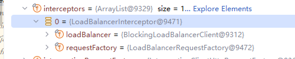


```java
protected <T> @Nullable T doExecute(URI url, @Nullable String uriTemplate, @Nullable HttpMethod method, @Nullable RequestCallback requestCallback,
       @Nullable ResponseExtractor<T> responseExtractor) throws RestClientException {

    Assert.notNull(url, "url is required");
    Assert.notNull(method, "HttpMethod is required");
    ClientHttpRequest request;
    // 会通过interceptors构建 出InterceptingClientHttpRequest
   request = createRequest(url, method);  
    // 往下执行
   response = request.execute(); 
   handleResponse(url, method, response);
   return (responseExtractor != null ? responseExtractor.extractData(response) : null);
```


InterceptingClientHttpRequest--> execute --> executeInternal:

```java
@Override
protected final ClientHttpResponse executeInternal(HttpHeaders headers, byte[] bufferedOutput) throws IOException {
    return getExecution().execute(this, bufferedOutput);
}

private ClientHttpRequestExecution getExecution() {
    ClientHttpRequestExecution execution = new EndOfChainRequestExecution(this.requestFactory);
    return this.interceptors.stream()
          .reduce(ClientHttpRequestInterceptor::andThen)
          .map(interceptor -> interceptor.apply(execution))
          .orElse(execution);
}

// ClientHttpRequestInterceptor.java
default ClientHttpRequestInterceptor andThen(ClientHttpRequestInterceptor interceptor) {
		Assert.notNull(interceptor, "ClientHttpRequestInterceptor must not be null");
		return (request, body, execution) -> {
			ClientHttpRequestExecution nextExecution =
					(nextRequest, nextBody) -> interceptor.intercept(nextRequest, nextBody, execution);
			return intercept(request, body, nextExecution);
		};
	}

default ClientHttpRequestExecution apply(ClientHttpRequestExecution execution) {
		Assert.notNull(execution, "ClientHttpRequestExecution must not be null");
		return (request, body) -> intercept(request, body, execution);
	}
```

LoadBalancerInterceptor#intercept

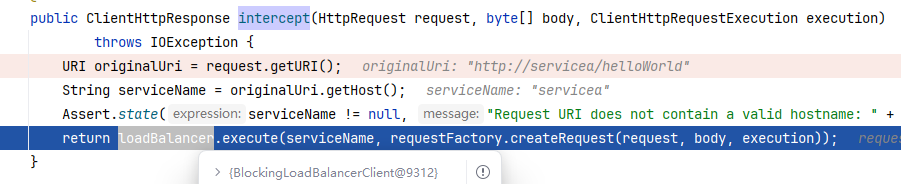

BlockingLoadBalancerClient#execute

```java
public <T> T execute(String serviceId, LoadBalancerRequest<T> request) throws IOException {
    String hint = getHint(serviceId);
    // 在serviceId对应的applicationContext中通过LoadBalancer找到合适的instance
    ServiceInstance serviceInstance = choose(serviceId, lbRequest);
    // 往下处理参数发起请求：默认SimpleClientHttpRequest#executeInternal：使用JDK HttpURLConnection 
    return execute(serviceId, serviceInstance, lbRequest); 
}

public <T> ServiceInstance choose(String serviceId, Request<T> request) {
        // 通过serviceId查找 ApplicationContext（没有则创建）， 然后查找ReactorServiceInstanceLoadBalancer（ReactiveLoadBalancer）
		ReactiveLoadBalancer<ServiceInstance> loadBalancer = loadBalancerClientFactory.getInstance(serviceId);
        // choose： 通过request 选择合适的 instance
		Response<ServiceInstance> loadBalancerResponse = Mono.from(loadBalancer.choose(request)).block();
		return loadBalancerResponse.getServer();
	}
```

getInstance： 创建ApplicationContext: 初始化bean后，会得到ReactorServiceInstanceLoadBalancer
```java
public <T> @Nullable T getInstance(String name, Class<T> type) {
    GenericApplicationContext context = getContext(name);
        return context.getBean(type);
    }
    
protected GenericApplicationContext getContext(String name) {
    if (!this.contexts.containsKey(name)) {
        synchronized (this.contexts) {
            if (!this.contexts.containsKey(name)) {
                this.contexts.put(name, createContext(name));
            }
        }
    }
    return this.contexts.get(name);
}
// 创建AnnotationConfigApplicationContext，
public GenericApplicationContext createContext(String name) {
		GenericApplicationContext context = buildContext(name);
		// there's an AOT initializer for this context
		if (applicationContextInitializers.get(name) != null) {
			applicationContextInitializers.get(name).initialize(context);
			context.refresh();
			return context;
		}
        // 注册bean configurations： EurekaLoadBalancerClientConfiguration， 如果有default 也注册
        // PropertyPlaceholderAutoConfiguration.class， 
        // LoadBalancerClientConfiguration： 会初始化 RoundRobinLoadBalancer、ServiceInstanceListSupplier
		registerBeans(name, context);
		context.refresh();
		return context;
	}
// LoadBalancerClientConfiguration.java, 上面的applicationContext会初始化ReactorLoadBalancer
public ReactorLoadBalancer<ServiceInstance> reactorServiceInstanceLoadBalancer(Environment environment,
                                                                               LoadBalancerClientFactory loadBalancerClientFactory) {
    // 上面buildContext定义了属性，即serverName
    String name = environment.getProperty(LoadBalancerClientFactory.PROPERTY_NAME);
    return new RoundRobinLoadBalancer(
            loadBalancerClientFactory.getLazyProvider(name, ServiceInstanceListSupplier.class), name);
}
// LoadBalancerClientConfiguration.BlockingSupportConfiguration.java：
// default
public ServiceInstanceListSupplier discoveryClientServiceInstanceListSupplier(
        ConfigurableApplicationContext context) {
    // withBlockingDiscoveryClient： 会查找discoveryClient，构建DiscoveryClientServiceInstanceListSupplier
    return ServiceInstanceListSupplier.builder().withBlockingDiscoveryClient().withCaching().build(context);
}

```


// ServiceInstanceListSupplierBuilder： 
// baseCreator：DiscoveryClientServiceInstanceListSupplier

这里可以看到可以获取到两个DiscoveryClient：

- EurekaDiscoveryCLient： 从eureka 发现client
- SimpleDiscoveryClient： 从配置文件yaml 中获取client

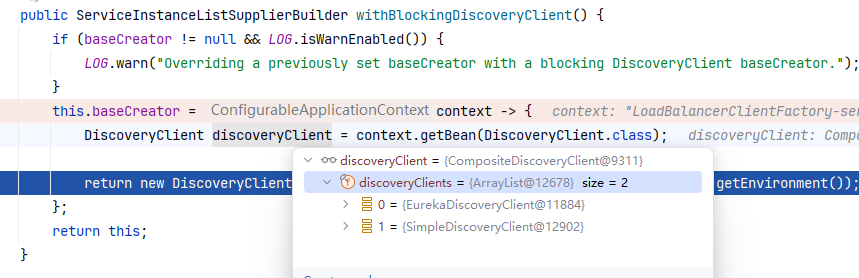


创建DiscoveryClientServiceInstanceListSupplier：

可以看到定义了一个**serviceInstances**变量。当获取实例的时候就是通过**serviceInstances**变量，执行其中的Flux 表达式获取instance， delegate 即为上面的DiscoveryClient 列表

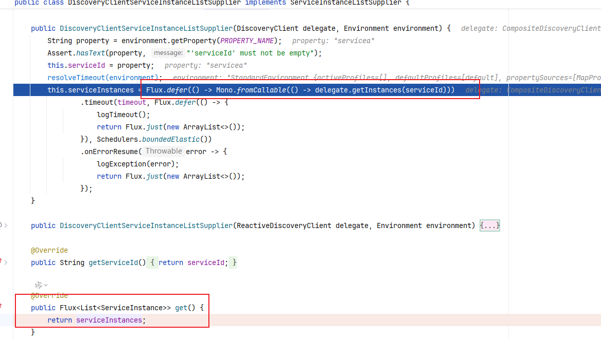


### RoundRobinLoadBalancer.java

```java
public Mono<Response<ServiceInstance>> choose(Request request) {
    // 这里即获取的：DiscoveryClientServiceInstanceListSupplier
    ServiceInstanceListSupplier supplier = serviceInstanceListSingletonSupplier.obtain();
    return supplier.get(request) // 这里即得到上面的Flux<List<ServiceInstance>>
       .next()
       .map(serviceInstances -> processInstanceResponse(supplier, serviceInstances));
}

private Response<ServiceInstance> processInstanceResponse(ServiceInstanceListSupplier supplier,
                                                          List<ServiceInstance> serviceInstances) {
    return getInstanceResponse(serviceInstances);
}

private Response<ServiceInstance> getInstanceResponse(List<ServiceInstance> instances) {
    if (instances.isEmpty()) {
        return new EmptyResponse();
    }
    if (instances.size() == 1) {
        return new DefaultResponse(instances.get(0));
    }
    int pos = this.position.incrementAndGet() & Integer.MAX_VALUE;
    ServiceInstance instance = instances.get(pos % instances.size());  // 轮询
    return new DefaultResponse(instance);
}
```


### LoadBalancerClient

通过上面的分析其实restTemplate 最终是调用的loadBalancerClient#choose方法，因此可以直接使用这个来获取实例：

```java

@Autowired
LoadBalancerClient loadBalancerClient;

ServiceInstance servicea = loadBalancerClient.choose("servicea");
```


### **总结**

1. 通过serviceId 得到ApplicationContext， 从中查找ReactiveLoadBalancer，默认是RoundRobinLoadBalancer.
    没有applicationContext 则创建新的，初始化bean： LoadBalancerClientConfiguration
    1. **LoadBalancerClientConfiguration**中会初始化：RoundRobinLoadBalancer、 ServiceInstanceListSupplier
        1. RoundRobinLoadBalancer：
        2. ServiceInstanceListSupplier： 
            即DiscoveryClientServiceInstanceListSupplier: 包含了DiscoveryClient：EurekaDiscoveryClient、SimpleDiscoveryClient
2. 执行ReactiveLoadBalancer#choose： 获取可用的实例列表
    1. 通过 ServiceInstanceListSupplier 执行执行get()
    2. Flux.next(): 调用 delegete.getInstances
    3. 执行EurekaDiscoveryClient#getInstances --> DiscoveryClient#getInstancesByVipAddress
3. RoundRobinLoadBalancer#getInstanceResponse: 通过position记录的位置 轮询


## 自定义loadBalance：


### @LoadBalancerClients

@imports： LoadBalancerClientConfigurationRegistrar

registerBeanDefinitions： 会解析LoadBalancerClients 注解，根据 name 注册 Bean： LoadBalancerClientSpecification

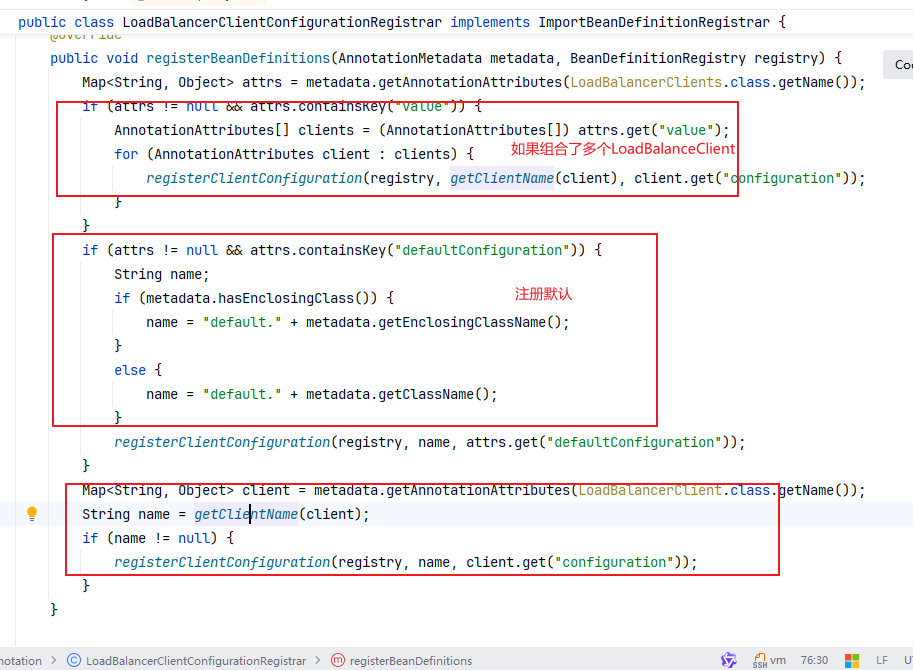


我们通过设置一个默认的配置，一个自定client的配置来设置负载均衡

启动类加上注解：

```java

@SpringBootApplication
// LoadBalancerClients内部是一个LoadBalancerClientConfigurationRegistrar： 将configuration 作为 LoadBalancerClientSpecification BeanDefinition注册进去
// 注册顺序： 先注册@LoadBalancerClients内部的 @LoadBalancerClient。然后是default.  最后是解析单独的@LoadBalancerClient
// 当调用api时，会为client生成一个IOC容器。 接着注册一些bean， NamedContextFactory#registerBeans: 中先查找指定client 的configuration， 后注册defaultConfiguration
@LoadBalancerClients(defaultConfiguration = DefaultLoadBalancerConfig.class,
        value = {@LoadBalancerClient(name = "client-a", configuration = ServiceALoadBalancer.class)})
public class EurekaClientApplication {

    public static void main(String[] args) {
        SpringApplication.run(EurekaClientApplication.class, args);
    }

    @Bean
    @LoadBalanced
        // 本质上就是一个@Qualifier，直接标记后才会被 LoadBalancerAutoConfiguration 处理，注入interceptor等
    RestTemplate restTemplate() {
        return new RestTemplate();
    }
}

// 为client-a 创建一个负载均衡器
public class ServiceALoadBalancer implements ReactorServiceInstanceLoadBalancer {
    // 会注入：EurekaRegistration 代理对象， 最终获取URL的时候会调用：EurekaRegistration.getHost， 是否从缓存中构建的？
    private final List<ServiceInstance> serviceInstances;
    private ObjectProvider<ServiceInstanceListSupplier> serviceInstanceListSupplierProvider;

    public ClientA(List<ServiceInstance> serviceInstances, ObjectProvider<ServiceInstanceListSupplier> serviceInstanceListSupplierProvider) {
        this.serviceInstances = serviceInstances;
        this.serviceInstanceListSupplierProvider = serviceInstanceListSupplierProvider;
    }

    @Override
    public Mono<Response<ServiceInstance>> choose(Request request) {
        if (serviceInstances.isEmpty()) {
            return Mono.empty(); // 没有可用实例
        }
        // 使用随机算法选择实例
        Random random = new Random();
        ServiceInstance selectedInstance = serviceInstances.get(random.nextInt(serviceInstances.size()));
        // 这里也可以得到实例列表
        List<ServiceInstance> instanceList = this.serviceInstanceListSupplierProvider.getIfAvailable().get(request).next().block();
        DefaultResponse defaultResponse = new DefaultResponse(selectedInstance);
        return Mono.just(defaultResponse); // 返回选择的实例
    }
}

// org.springframework.cloud.context.named.NamedContextFactory#registerBeans:
// 先通过clientName 找到 ServiceALoadBalancer的configuration 注入registry。 
// 注入当前bean的时候内部会执行ConditionEvaluator#shouldSkip： 判断不满足，因此不会注册BeanDefinition
@ConditionalOnMissingBean(ReactorServiceInstanceLoadBalancer.class)
// 不要在这里实现ReactorServiceInstanceLoadBalancer， 否则无法注册。
// 如果实现的话，解析阶段注册该Configuration， 注册阶段 会执行match，由于本身BeanDefinition已经存在registry，因此会判断为不满足条件最终被移除
public class DefaultLoadBalancerConfig {   

    @Bean
    public ReactorServiceInstanceLoadBalancer defaultLoadBalancer(ObjectProvider<ServiceInstanceListSupplier> serviceInstanceListSupplierProvider) {
        return new DefaultLoadBanancer(serviceInstanceListSupplierProvider);
    }
}


public class DefaultLoadBanancer  implements ReactorServiceInstanceLoadBalancer {

    private final SingletonSupplier<ServiceInstanceListSupplier> serviceInstanceListSingletonSupplier;
    public DefaultLoadBanancer(ObjectProvider<ServiceInstanceListSupplier> serviceInstanceListSupplierProvider) {
        this.serviceInstanceListSingletonSupplier = SingletonSupplier
                .of(() -> serviceInstanceListSupplierProvider.getIfAvailable(NoopServiceInstanceListSupplier::new));
    }

    @Override
    public Mono<Response<ServiceInstance>> choose(Request request) {
        List<ServiceInstance> block = this.serviceInstanceListSingletonSupplier.get().get().next().block();
        return Mono.just(new DefaultResponse(block.get(0)));
    }
}


```

注意，如果在DefaultConfig 加上注解@ConditionalOnMissingBean, 会导致无法注入，像下面这样：
```java
@LoadBalancerClients(defaultConfiguration = DefaultConfig.class,
        value = {@LoadBalancerClient(name = "eureka-client", configuration = ServiceALoadBalancer.class)})
// OnBeanCondition： REGISTER_BEAN阶段 才会执行条件处理逻辑
// PARSE_CONFIGURATION 阶段会将当前Configuration作为BeanDefinition。
// FactoryPostProcessors 会执行 REGISTER_BEAN 阶段： ConditionEvaluator.shouldSkip(AnnotatedTypeMetadata, ConfigurationPhase): REGISTER_BEAN 阶段会查找到存在自身 因而跳过注册
@ConditionalOnMissingBean(ReactorServiceInstanceLoadBalancer.class)
public class DefaultConfig implements ReactorServiceInstanceLoadBalancer {
}

```


### ServiceInstanceListSupplier

通过下面配置设置选择使用哪种策略：
weighted、same-instance-preference、subset、zone-preference、request-based-sticky-session、retry.avoid-previous-instance

default：spring.cloud.loadbalancer.configurations
spring.cloud.loadbalancer.clients.configurations


.withWeighted： 加权轮询 LazyWeightedServiceInstanceList
withSameInstancePreference: 优先调用上一次的instance
withSubset：根据配置分散取出 指定大小的实例
zone: 过滤指定区域的instance
withHealthChecks： loadbalancer 定时检查服务的监控状态
withRequestBasedStickySession： 通过request 中的 cookie 过滤instance
