# Tomcat 请求流程

## Servlet转发来源

StandardWrapper: servletClass

核心入口：

StandardWrapperValve#invoke:

   1. 获取Servlet对象（初始化时会调用init)
      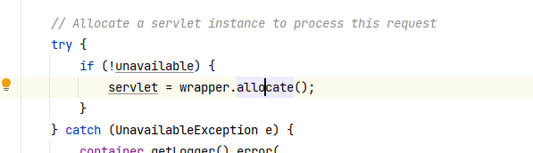
   2. 创建FilterChain对象。 ApplicationFilterChain 对象本身不需要每次创建 (跟随Http11Processor#request 缓存)，但是每次需要重context中重新构造该url所属filter。
      
   3. 调用filter链，doFilter方法（filter对象初始化会调用filter#init()）
   4. doFilter方法调用完毕后，调用servlet#service()

      ```java
      doFilter(RequestFacade, ResponseFacade)
      RequestFacade: 作为一个门面，实际执行都是由内部的connector.Request(内部还有coyoteRequest)对象执行
      ```

      


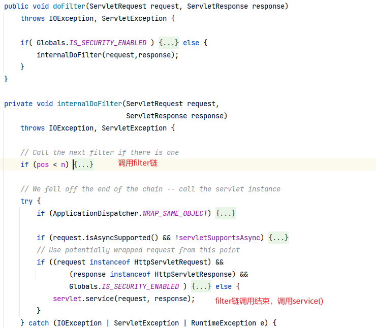


## ServletContainerInitializer

```java
SPI:
javax.servlet.ServletContainerInitializer  #onStartup(ServletContext container)
该接口在web应用程序启动阶段接收通知，注册servlet、filter、listener等


META-INF/services/javax.servlet.ServletContainerInitializer， spring-web： SpringServletContainerInitializer


@HandlesTypes(WebApplicationInitializer.class)
SpringServletContainerInitializer


ContextConfig#processServletContainerInitializers: 
    SPI 加载ServletContainerInitializer.class
    initializerClassMap: <SCI, Set>：  SpringServletContainerInitializer == set
    typeInitializerMap: <@HandleTypes, SCI set>,  
                         [WebApplicationInitializer, SpringServletContainerInitializer]

ContextConfig#processClasses:  处理@HandlesTypes
    会将自定义的WebApplicationInitializer(上面@HandleTypes)的子类 加入到initializerClassMap#set
      SpringServletContainerInitializer -->  AbstractContextLoaderInitializer、AbstractDispatcherServletInitializer、AbstractAnnotationConfigDispatcherServletInitializer、CustomerServletInitializer
      后续会排除掉抽象类

    
Call ServletContainerInitializers：
StandardContext#addServletContainerInitializer: 将上面SCI 实现类添加到initializers（等价于initializerClassMap）


onStartup():
StandardWrapper#startInternal:
--->StandardContext#startInternal：
      --> 遍历initializers entrykey，调用onStartup(sci set, servletContext)

          SpringServletContainerInitializer#onStartup():
            --> 遍历sci set, 过滤出非抽象类，剩下CustomerServletInitializer
            --> 调用onStartup
```


# Spring MVC

Tomcat调用SCI的时机：  https://blog.csdn.net/f641385712/article/details/89231174

SpringMVC、Servlet容器创建：https://blog.csdn.net/f641385712/article/details/87474907

启动过程：https://blog.csdn.net/f641385712/article/details/87883205

DispatcherServlet处理过程：https://fangshixiang.blog.csdn.net/article/details/87982095


ServletContext(ApplicationContextFacade)： 持有MVC Container， Root Container （AnnotationConfigWebApplicationContext）

dispatcherServlet： 持有MVC container （AnnotationConfigWebApplicationContext）

MVC container： 持有 ServletContext


转发请求过程：

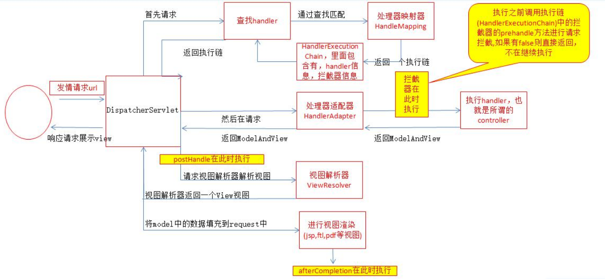


## SCI启动过程

> SpringBoot 内嵌tomcat不会执行该扫描过程

spring mvc 包中有：META-INF\services\javax.servlet.ServletContainerInitializer

```
org.springframework.web.SpringServletContainerInitializer
```

tomcat初始化时会扫描该路径，将文件解析出来，后续依次调用onStartup()

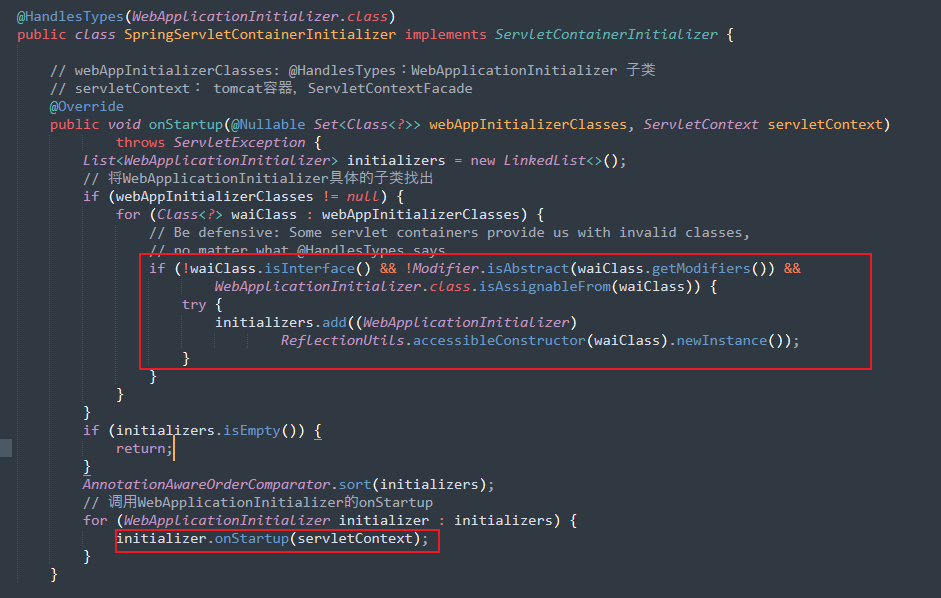


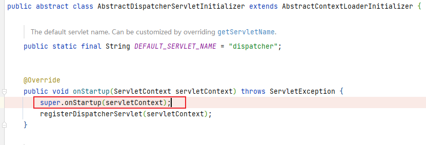

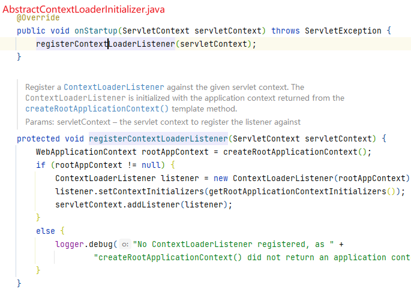


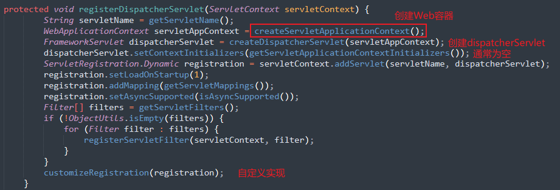


ContextLoaderListener#contextInitialized：

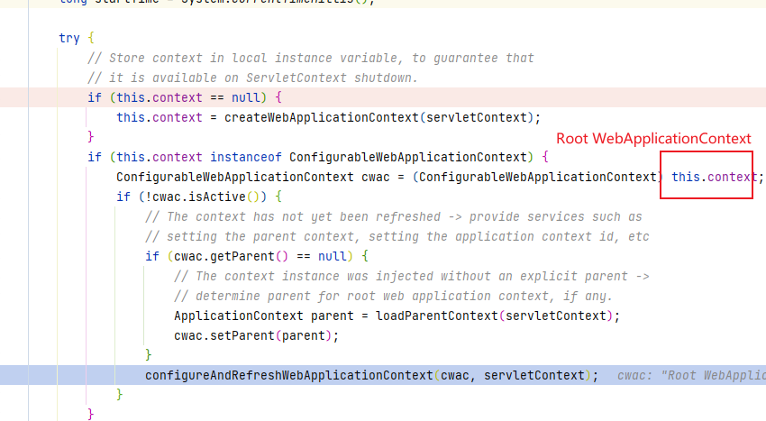

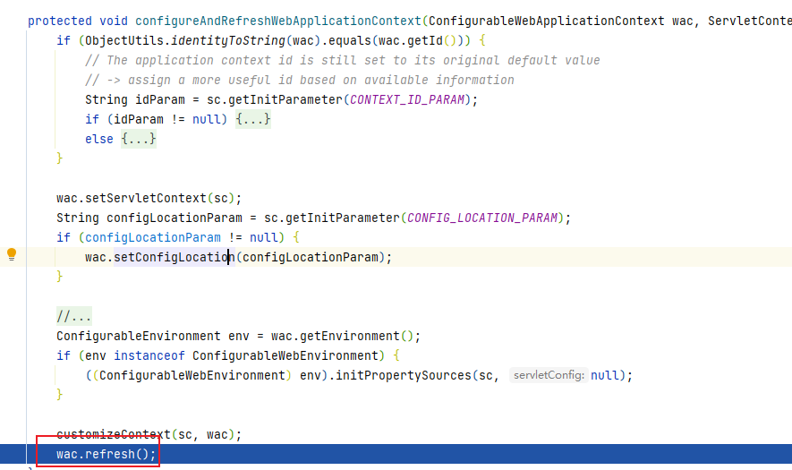


## DispatcherServlet

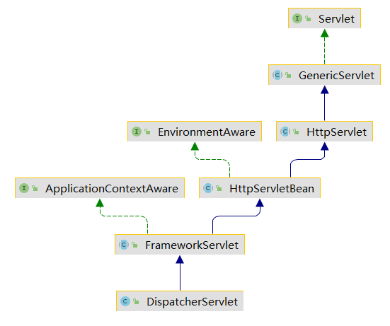


### init()

核心： 会设置WebApplicationContext的父容器RootApplicationContext

FrameworkServlet#initWebApplicationContext

```java
protected WebApplicationContext initWebApplicationContext() {
	// 从ServletContext中把上面已经创建好的根容器拿到手
	WebApplicationContext rootContext = WebApplicationContextUtils.getWebApplicationContext(getServletContext());
	WebApplicationContext wac = null;
	
	//但是，但是，但是此处需要注意了，因为本处我们是注解驱动的，在上面已经看到了，我们new DispatcherServlet出来的时候，已经传入了根据配置文件创建好的子容器web容器，因此此处肯定是不为null的，因此此处会进来，和上面一样，完成容器的初始化、刷新工作，因此就不再解释了~
	if (this.webApplicationContext != null) {
		// A context instance was injected at construction time -> use it
		wac = this.webApplicationContext;
		if (wac instanceof ConfigurableWebApplicationContext) {
			ConfigurableWebApplicationContext cwac = (ConfigurableWebApplicationContext) wac;
			if (!cwac.isActive()) {
				if (cwac.getParent() == null) {
					//此处吧根容器，设置为自己的父容器
					cwac.setParent(rootContext);
				}
				//根据绑定的配置，初始化、刷新容器
				configureAndRefreshWebApplicationContext(cwac);
			}
		}
	}

	//若是web.xml方式，会走这里，进而走findWebApplicationContext(),因此此方法，我会在下面详细去说明，这里占时略过
	if (wac == null) {
		wac = findWebApplicationContext();
	}
	if (wac == null) {
		wac = createWebApplicationContext(rootContext);
	}

	// 此处需要注意了：下面有解释，refreshEventReceived和onRefresh方法，不会重复执行~
	if (!this.refreshEventReceived) {
		onRefresh(wac);
	}

	//我们是否需要吧我们的容器发布出去，作为ServletContext的一个属性值呢？默认值为true哦，一般情况下我们就让我true就好
	if (this.publishContext) {
		// Publish the context as a servlet context attribute.
		// 这个attr的key的默认值，就是FrameworkServlet.SERVLET_CONTEXT_PREFIX，保证了全局唯一性
		// 这么一来，我们的根容器、web子容器其实就都放进ServletContext上下文里了，拿取都非常的方便了。   只是我们一般拿这个容器的情况较少，一般都是拿跟容器，比如那个工具类就是获取根容器的~~~~~~
		String attrName = getServletContextAttributeName();
		getServletContext().setAttribute(attrName, wac);
	}
	return wac;
}
```


DispatcherServlet.properties： 默认配置


### 初始化Handler：

RequestMappingHandlerMapping#afterPropertiesSet

AbstractHandlerMethodMapping#initHandlerMethods：

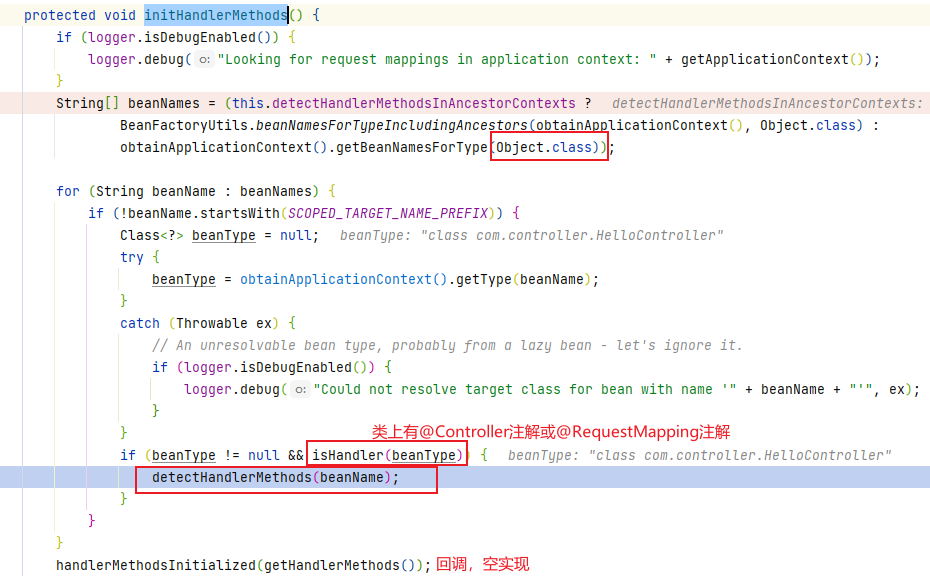

AbstractHandlerMethodMapping#detectHandlerMethods

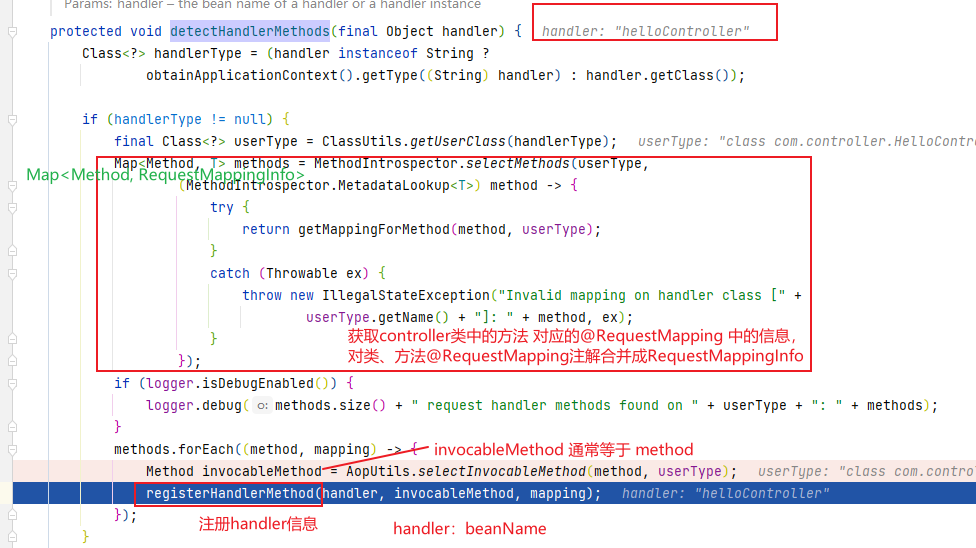

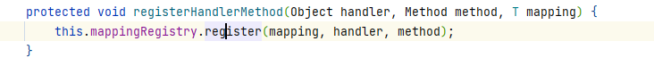

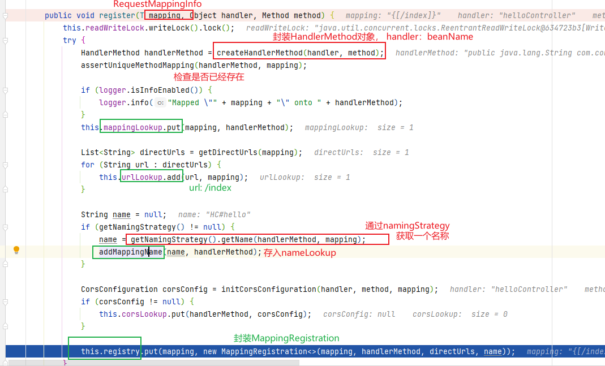


registry：

MappingRegistry 中保存Handler信息：

```java
private final Map<T, MappingRegistration<T>> registry = new HashMap<>();

private final Map<T, HandlerMethod> mappingLookup = new LinkedHashMap<>();

private final MultiValueMap<String, T> urlLookup = new LinkedMultiValueMap<>();

private final Map<String, List<HandlerMethod>> nameLookup = new ConcurrentHashMap<>();

private final Map<HandlerMethod, CorsConfiguration> corsLookup = new ConcurrentHashMap<>();

private final ReentrantReadWriteLock readWriteLock = new ReentrantReadWriteLock();
```


### 请求寻找handler过程

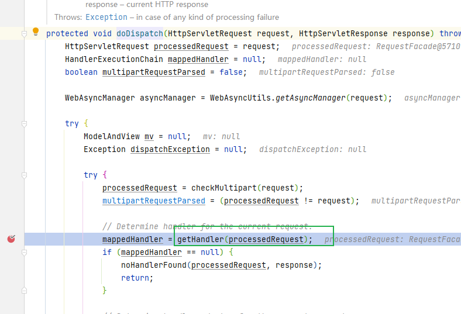

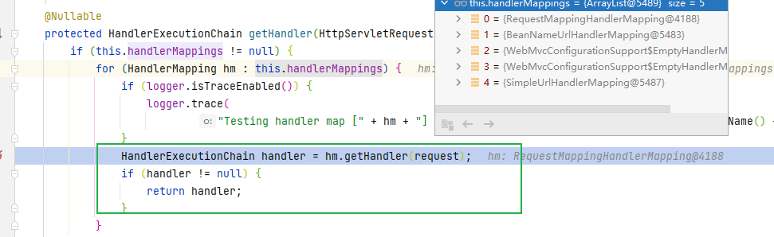

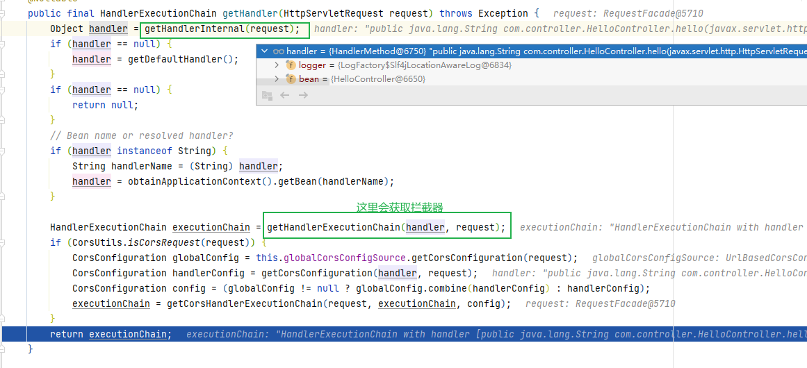


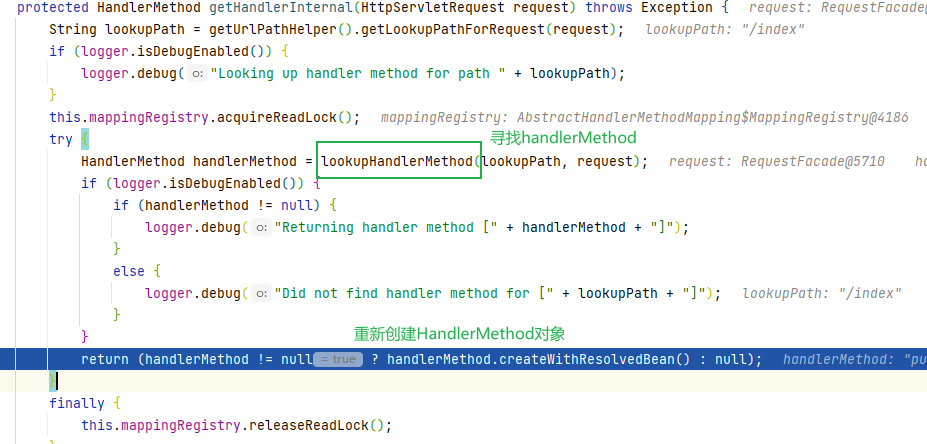


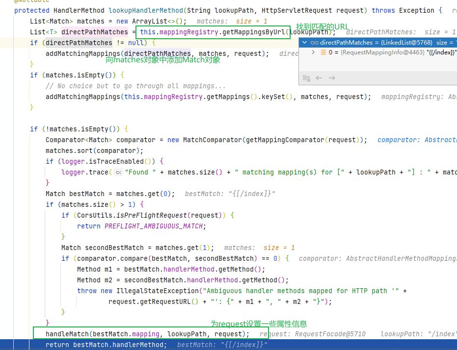

### 九大组件

https://blog.csdn.net/f641385712/article/details/87934909


在WebApplicationContext#refresh 中，调用finishRefresh()，会发布事件：

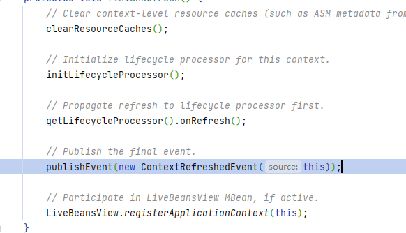

最终执行到，DispatcherServlet，初始化9大组件：

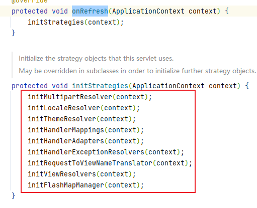


## @RestControllerAdvice

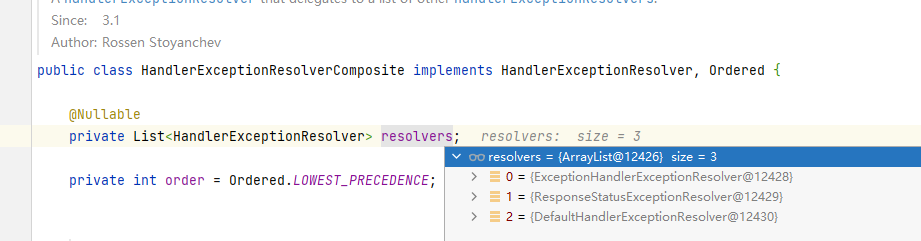


ExceptionHandlerExceptionResolver： 会解析@ExceptionHandler 方法


## SpringBoot 整合MVC

Tomcat 容器会持有该Servlet 容器

```java
@Bean(name = DEFAULT_DISPATCHER_SERVLET_BEAN_NAME)
public DispatcherServlet dispatcherServlet(WebMvcProperties webMvcProperties) {
    DispatcherServlet dispatcherServlet = new DispatcherServlet();
    dispatcherServlet.setDispatchOptionsRequest(webMvcProperties.isDispatchOptionsRequest());
    dispatcherServlet.setDispatchTraceRequest(webMvcProperties.isDispatchTraceRequest());
    dispatcherServlet.setThrowExceptionIfNoHandlerFound(webMvcProperties.isThrowExceptionIfNoHandlerFound());
    dispatcherServlet.setPublishEvents(webMvcProperties.isPublishRequestHandledEvents());
    dispatcherServlet.setEnableLoggingRequestDetails(webMvcProperties.isLogRequestDetails());
    return dispatcherServlet;
}
```


### Spring MVC


在启动过程中，<font style="color:#080808;background-color:#ffffff;">HandlerMethodMapping </font>会解析controller中的每个方法为**<font style="color:#080808;background-color:#ffffff;">MappingRegistration</font>**<font style="color:#080808;background-color:#ffffff;">对象</font>。 将其注册到 **MappingRegistry#registry**

**核心类： AbstractHandlerMethodMapping.MappingRegistry#register**

****

**当发起**请求后，会通过path路径解析寻找到对应的MappingRegistration，进而执行到目标方法。

****

#### 获取Handler：
首先通过request获取对应的handlerMethod，然后获取其执行链：  


分别遍历各种handler，看是否能够获取到改request对应的handlerExecutionChain：


<font style="color:#080808;background-color:#ffffff;">RequestMappingHandlerMapping中处理：</font>

<font style="color:#080808;background-color:#ffffff;">会调用lookupHandlerMethod方法来查找 URL对应的handlerMethod</font>


#### 执行目标方法：


会将前面找到的MethodHandler对象包装成ServletInvocableHandlerMethod对象，调用其invokeAndHandler：


#### dispatcher 请求
当发起的是dispatcher类型的请求时：

下面会替换invocableMethod，并不是原来的HandlerMethod了。

<font style="color:#080808;background-color:#ffffff;">即创建了一个包含返回值的ConcurrentResultHandlerMethod对象作为invocableMethod。在后面执行invokeAndHandle方法就不会调用原controlller 方法了。</font>


#### controller 层添加了AOP：


默认情况this.bean instanceof String 都会成立

#### 


#### 跨域分析
> 即协议、域名、端口 任意不同的时候都会作为跨域处理。 **CorsUtils#isCorsRequest**
>


解决跨域的方式很多， 这里分析最简单的使用方式。即在controller中添加注解@<font style="color:#080808;background-color:#ffffff;">CrossOrigin</font>

<font style="color:#080808;background-color:#ffffff;"></font>

<font style="color:#080808;background-color:#ffffff;">当预检通过会设置下面响应字段，用来提醒浏览器通过检查，从而可以进一步发起请求（在浏览器网络中会看到两个请求同时出现）</font>

<font style="color:#1DC0C9;">Access-Control-Allow-Origin: * </font>

<font style="color:#1DC0C9;">Access-Control-Allow-Methods: POST </font>

<font style="color:#1DC0C9;">Access-Control-Allow-Headers: content-type</font>

<font style="color:#1DC0C9;"> Access-Control-Max-Age: 1800</font>

<font style="color:rgb(31, 31, 31);"></font>

在配置跨域参数的时候：如果 allowCredentials 为true， <font style="color:#080808;background-color:#ffffff;">allowedOrigins 不能为*</font>


在引用启动过程中，下面方法中会解析method，跨域 配置，记录到registry, crosLookup 中。

**AbstractHandlerMethodMapping.MappingRegistry#register**


依次解析类上、方法上的注解信息。


##### 请求发起
如果方法有跨域信息或者请求是预检请求，会替换当前执行链的handler为 跨域**PreFlightHandler**。


在构建**PreFlightHandler过程中会尝试** 从corsLookup 查找跨域配置信息，记录到**PreFlightHandler中（没有就是空），用于后续检查请求是否允许**。


<font style="color:#080808;background-color:#ffffff;">getCorsHandlerExecutionChain：</font>


##### 预检处理
上面分析得出预检将会替换原handler为PreFlightHandler：当调用AbstractHandlerMethodAdapter#**handle** <font style="color:#080808;background-color:#ffffff;">方法时，会执行到下面方法。</font>


这里的corsProcessor 为**DefaultCorsProcessor**。


##### 预检后
如果是预检后的请求是添加的一个拦截器到最前面位置。**CorsInterceptor**


同样会执行**corsProcessor**，跟预检请求一摸一样，只是preFlightRequest参数不同。


### SpringBoot整合WEB容器启动过程
> SpringBoot中不会存在父子容器的概念，只有一个容器：默认情况下创建Servlet类型的容器：**AnnotationConfigServletWebServerApplicationContext**
>

SpringApplication#createApplicationContext：  
SpringBoot SPI，加载spring.factories ， 得到org.springframework.boot.ApplicationContextFactory 对应的value，


SpringApplication启动：

根据class判断当前使用环境，这里是**Servlet**环境


servlet类型(默认) 创建**AnnotationConfigServletWebServerApplicationContext**

#### ServletWebServerFactoryConfiguration
启动过程中会处理ServletWebServerFactoryConfiguration：

创建TomcatServletWebServerFactory，设置一些自定义的属性


bean处理完成后调用refresh():


回调子类的onRefresh()方法


创建server：

getWebServerFactory() 方法会获取注册的ServletWebServerFactory对象，该对象被SPI机制加载，主要体现在这个类：**ServletWebServerFactoryAutoConfiguration**， @Import注解会导入EmbeddedTomcat 的class， 最终根据条件得到TomcatServletWebServerFactory（见上面）


#### getWebServer:
创建Tomcat、Connector，  mergeInitializers()


**prepareContext**最终会调用下面方法，

#### mergeInitializers：
最初initializers只有一个：

org.springframework.boot.web.servlet.context.ServletWebServerApplicationContext#selfInitialize


#### configureContext
> 将initializer传入TomcatStarter
>

创建TomcatStarter，将其添加到initializers，TomcatStarter实现了SCI， 后续会调用onStartup()


#### getTomcatWebServer
会创建TomcatWebServer (SpringBoot中的类)


最后会调用StandardContext#startInternal:


#### TomcatStarter#onStartup


1、AbstractServletWebServerFactory#lamda： 设置一些参数，默认空

2、AbstractServletWebServerFactory.SessionConfiguringInitializer: 配置session、cookie

3、核心：

```java
private void selfInitialize(ServletContext servletContext) throws ServletException {
    // 将当前ApplicationContext（AnnotationConfigServletWebServerApplicationContext）作为RootWebApplication存入ServletContext，
    // 同时将ServletContext 记录到ApplicationContext#servletContext中， 貌似只用于创建容器时判断是否存在ServletContext
    prepareWebApplicationContext(servletContext);
    // 将servletContext包装为ServletContextScope 注入BeanFactory中，scope为application
    // 同时也将ServletContextScope 作为ServletContext的属性
    registerApplicationScope(servletContext);
    // 注册servletContext 到BeanFactory中， 同时注册ServletContext中的
    // 一些配置参数（context-param、attribute）到BeanFactory
    WebApplicationContextUtils.registerEnvironmentBeans(getBeanFactory(), servletContext);
    // 向ServletContext注册Filter，Servlet等...
    // getServletContextInitializerBeans： 获取BeanFactory中的一些Servlet相关的bean对象
    for (ServletContextInitializer beans : getServletContextInitializerBeans()) {
        beans.onStartup(servletContext);
    }
}
```

registerApplicationScope：


相关Servlet、Filter Bean：


#### DispatcherServletRegistrationBean#onStartup
> 由**DispatcherServletAutoConfiguration**自动注册到BeanFactory
>


#### DispatcherServlet#init()
首次执行请求时，会执行DispatcherServlet#init():

,

初始化解析器：


### SpringBoot 内嵌Tomcat容器
这里需要注意SpringBoot默认采用的内嵌tomcat作为web容器时，并不会采用SPI去扫描ServletContainerInitializer的接口，因此无法使用继承ServletContainerInitializer的方式来处理一些初始化的操作（包括实现SpringServletContainerInitializer、WebApplicationInitializer）


SpringBoot中提供了类似的接口ServletContextInitializer， 将其作为bean注入到容器中即可自动调用onStartup方法，**ServletContextInitializer**相关实现类如下


在ServletWebServerApplicationContext#selfInitialize有如下方法：

这里会获取容器中的一些Servlet相关的bean对象，调用onStartup


#### 查找ServletContextInitializer类型的bean
> 即Servlet，Filter 相关实现了**ServletContextInitializer**
>


addServletContextInitializerBeans：


#### 调用OnStartup
回到selfInitialize，循环调用

ServletContextInitializerBeans 实现了AbstractCollection#iterator方法


RegistrationBean#onStartup：


调用具体实现：

HttpEncodingAutoConfiguration、WebMvcAutoConfiguration 会注册一些默认Filter


例如：ServletRegistrationBean 注册一个Servlet到ServletContext


#### Filter、Servlet 解析
> 在上文中可知<font style="color:#080808;background-color:#ffffff;">getServletContextInitializerBeans方法会获取IOC 容器中的</font>**<font style="color:#080808;background-color:#ffffff;">ServletContextInitializer</font>**<font style="color:#080808;background-color:#ffffff;">类</font>
>

**<font style="color:#080808;background-color:#ffffff;">ServletContextInitializer 相关子类：</font>**


在SpringBoot 中添加一个Filter 可以创建一个FilterRegistrationBean 注入到容器，或者通过@<font style="color:#080808;background-color:#ffffff;">ServletComponentScan 自动扫描，代码如下：</font>

```java
// 在启动类中添加@ServletComponentScan 扫描该类即可。
@WebFilter(filterName = "myFilter",urlPatterns = "/*", dispatcherTypes={DispatcherType.REQUEST, DispatcherType.ASYNC})
public class MyFilter extends OncePerRequestFilter implements Filter {

    public MyFilter() {
        System.out.println("constructor...");
    }
     @Override
    protected void doFilterInternal(HttpServletRequest request, HttpServletResponse response, FilterChain filterChain) throws ServletException, IOException {
        System.out.println("doFilter .....");
        filterChain.doFilter(request, response);
    }
}

//  也可以不用@ServletComponentScan 自动扫描， 使用下面代码手动注入，
// 注意使用下面方法注入时，@WebFitler 类上的注解 `完全无用`。 
@Bean
public FilterRegistrationBean filterRegistrationBean(){
    FilterRegistrationBean bean = new FilterRegistrationBean();
    bean.setFilter(new MyFilter());
    bean.addUrlPatterns("/*");
    bean.setName("myFilter");
    // 这里必须手动设置才能生效，不依赖于@WebFilter 注解
    // bean.setDispatcherTypes();
    bean.setOrder(1);
    return bean;
}
```


不管使用哪种方式最终都会解析为一个FilterRegistrationBean 的对象存入IOC容器中，最终在<font style="color:#080808;background-color:#ffffff;">ServletWebServerApplicationContext#selfInitialize中调用onStartup方法：  
</font>

<font style="color:#080808;background-color:#ffffff;">内部调用其addRegistration 将filter 或Servlet 添加到ServletContext中。 </font>

<font style="color:#080808;background-color:#ffffff;">其实就是servletContext.addFilter/addServlet()</font>


当添加Filter时：

这里会处理dispacherTypes，当Filter类没有指定dispatcherTypes时（@WebFilter默认值为REQUEST），这里会自动添加：

当继承了OncePerRequestFilter，该filter会自动将所有类型包含在内。 否则只添加REQUEST


#### OncePerRequestFilter解释
OncePerRequestFilter： 即每一次调用Servlet都会执行， 在Servlet 3.0 支持异步的情况下，除了正常情况下的request类型外，开启异步后还会出现dispacher的类型的请求。因此在这种常见下一次请求就会调用多次Filter。


示例：

```java
 @GetMapping("/call_able")
    public Callable call_able(HttpServletResponse response) throws Exception {
        System.out.println("call_able");
        return (Callable<String>) () -> {
            Thread.sleep(5000); //this will cause a timeout
            return "foobar";
        };
    }


// Filter:
public class MyFilter extends OncePerRequestFilter{
    @Override
    protected void doFilterInternal(HttpServletRequest request, HttpServletResponse response, FilterChain filterChain) throws ServletException, IOException {
        logger.info("doFilter.....");
        filterChain.doFilter(request, response);
    }

    // dispatch 请求依然执行filter
    @Override
    protected boolean shouldNotFilterAsyncDispatch() {
        return false;
    }
}
```


运行结果：  可以看到5s后又执行了一次filter。


这里需要注意当在controller 中使用request.startAsyn() 手动开启异步时，tomcat 并不会触发dispatcher类型的请求，因此不会执行多次filter。 使用<font style="color:#080808;background-color:#ffffff;">DeferredResult 作为结果同样会触发两次调用</font>


虽然上面执行了两次filter，controller中方法并不会执行多次，这主要是靠Spring MVC 保证的。


### Spring MVC 中的异步
#### AsyncContext
> Servlet 原生异步对象： 用于业务线程耗时的场景，即使释放tomcat线程，同时当业务线程处理完成后，可以继续将结果写入response中
>

controller不能返回值，返回后response将会关闭，无法写入返回的信息

#### DeferredResult
> SpringMVC 提供的异步支持对象，底层依然基于AsyncContext。可以设置超时参数，用于延时获取返回的结果： 请求后tomcat释放线程，DeferredResult set相应的值后，可以通知到response对象。
>
>
>
> AI相关的**SSE** 协议，在Spring中也是基于DeferredResult来实现的。
>

[https://mp.weixin.qq.com/s/JrphMlEf4Q7s597O8yZfuw](https://mp.weixin.qq.com/s/JrphMlEf4Q7s597O8yZfuw)

<font style="color:#080808;background-color:#ffffff;">除此之外，spring mvc 还提供了其他异步对象：CompletableFuture、WebAsyncTask、CompletableFuture、Callable。</font>

```java
@RequestMapping("/test1")
public void test1(HttpServletRequest request, HttpServletResponse response) {
    String a = request.getParameter("a");
    System.out.println(Thread.currentThread().getName() + "===  Request: " +request + " " + "a: " + a );
    AsyncContext asyncContext = request.startAsync(request, response);

    new Thread(() -> {
        //            String b = request.getParameter("a");
        //            System.out.println("a: " + b );
        try {
            TimeUnit.SECONDS.sleep(2);
        } catch (InterruptedException e) {
            e.printStackTrace();
        }
        String c = request.getParameter("a");
        System.out.println(Thread.currentThread().getName() + " a: " + c );

        int i = 0;
        while (i < 10) {
            i++;
            try {
                PrintWriter writer = response.getWriter();
                writer.println("hello server");
                writer.flush();
            } catch (IOException e) {
                e.printStackTrace();
            }
        }
        asyncContext.complete();
    }).start();

    // return "test1";
}

@GetMapping("/testDeferredResult")
public DeferredResult<String> getDeferredResult(Long sleepTime) {
DeferredResult<String> result = new DeferredResult<>(5000L, "time out........");

new Thread(() -> {
    try {
        TimeUnit.SECONDS.sleep(sleepTime);
        result.setResult(" hello deferred");
    } catch (InterruptedException e) {
        e.printStackTrace();
    }
}).start();
System.out.println("deferred exit...");
return result;

}
```


相关源码：ServletInvocableHandlerMethod#invokeAndHandle

通过返回值类型 找到对应的处理器。


