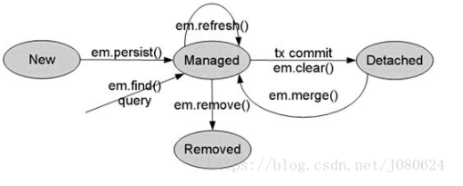
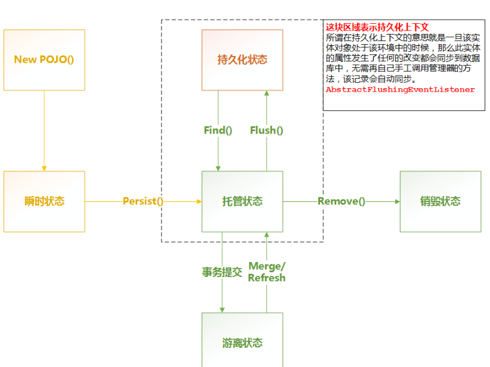
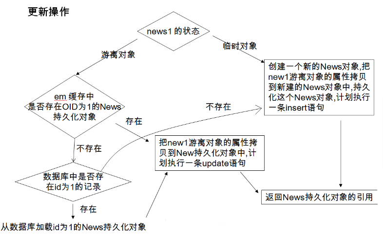
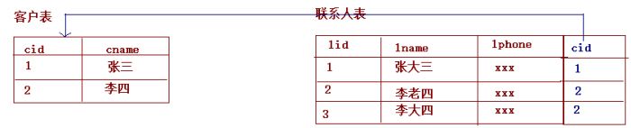
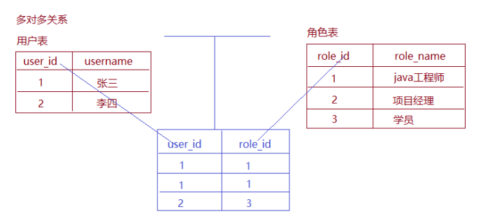
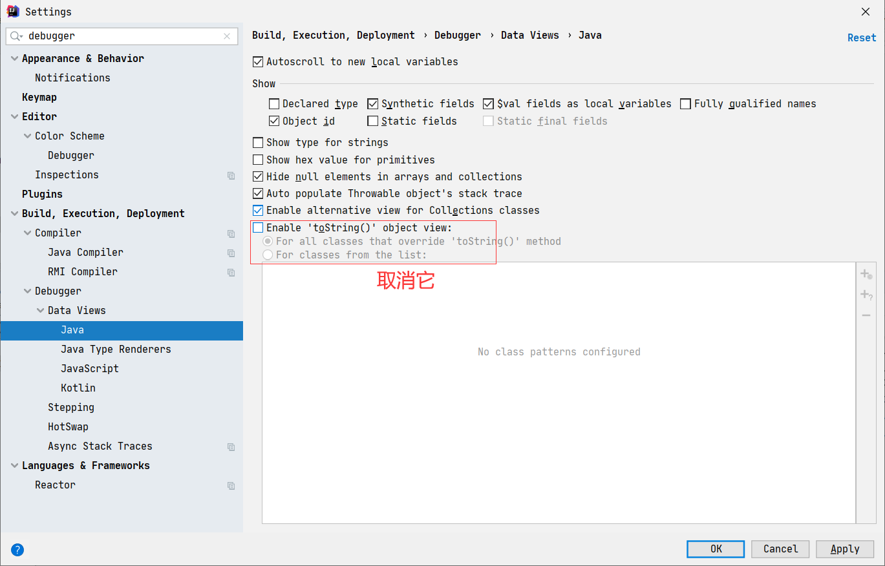

### hibernate

默认开启一级缓存: 基于session级别

二级缓存默认关闭: 基于SessionFactory级别

#### EntityManager:

> 必须使用EntityManagerFactory 创建的EntityManager对象. 否则部分操作无法执行

Entity实体四种状态: (一般分为三种: 临时/持久(托管)/游离)

- 新建状态(临时状态: new):  新创建的对象，尚未拥有持久性主键；
- 托管状态(managed,  持久态): 已经和持久化建立了上下文环境, 后续的任何改变都会自动刷新到数据库;
  - 对象处于persistence context
- 游离状态(detached)：  拥有持久化主键，但是没有与持久化建立上下文环境；
- 删除状态(removed):  拥有持久化主键，已经和持久化建立上下文环境，但是从数据库中删除。






基本API:

```
find: 基本查询方法
getReference: 懒加载方式,使用对象的时候才会发出查询SQL, 当不存在时将会抛出错误: EntityNotFoundException
persist: 必须在事务中执行
		 1.用于持久化一个对象被JPA 管理的对象(即先查询出的该对象), 主建不能修改
		 2.持久化一个新的对象(不能设置主键)
remove: 只能删除一个被JPA管理的对象
merge: 先执行select, 在根据情况执行其他SQL
flush: 将持久上下文环境的所有未保存实体的状态信息保存到数据库中。
setFlushMode: flush 模式: 
				auto: 自动更新数据库实体
				commit: 事务提交时,更新数据库实体
refresh: 用数据库实体记录的值更新实体对象的状态，即更新实例的属性值。 重新发送一条Select
clear: 清除上下文的内容
contains: 判断一个实例是否属于当前持久上下文环境管理的实体。
```


Merge操作:



EntityManager API介绍: https://blog.csdn.net/J080624/article/details/78751411

实体状态介绍: https://blog.csdn.net/qq_35422999/article/details/123605021


#### 自动更新案例

> 在事务提交时,会将托管态的对象进行持久化到数据库.

```java
@Test
public void persist_status() {
    EntityTransaction transaction = entityManager.getTransaction();
    transaction.begin();
    User user1 = entityManager.find(User.class,2);
    System.out.println(user1);
    user1.setName("fdsfdsf");
     // 调用detach 可以将对象变为游离态,  使用session的话可以调用:  session.evict();
//    entityManager.detach(user1) 
    // entityManager.detach() // persistence  context中的所有对象都变成detach
    transaction.commit();
}
```


### JPA基本概念:

- springDatajpa，jpa规范，hibernate三者之间的关系
  ​		code  -- > springDatajpa  --> jpa规范的API --> hibernate
- 符合springDataJpa规范的dao层接口的编写规则
  ​		1.需要实现两个接口（JpaRepository，JapSpecificationExecutor）
  ​		2.提供响应的泛型

		* 动态代理的方式：动态代理对象
	

### spring整合JPA的配置文件

``` xml
<?xml version="1.0" encoding="UTF-8"?>
<beans xmlns="http://www.springframework.org/schema/beans"
       xmlns:xsi="http://www.w3.org/2001/XMLSchema-instance" xmlns:aop="http://www.springframework.org/schema/aop"
       xmlns:context="http://www.springframework.org/schema/context"
       xmlns:jdbc="http://www.springframework.org/schema/jdbc" xmlns:tx="http://www.springframework.org/schema/tx"
       xmlns:jpa="http://www.springframework.org/schema/data/jpa" xmlns:task="http://www.springframework.org/schema/task"
       xsi:schemaLocation="
		http://www.springframework.org/schema/beans http://www.springframework.org/schema/beans/spring-beans.xsd
		http://www.springframework.org/schema/aop http://www.springframework.org/schema/aop/spring-aop.xsd
		http://www.springframework.org/schema/context http://www.springframework.org/schema/context/spring-context.xsd
		http://www.springframework.org/schema/jdbc http://www.springframework.org/schema/jdbc/spring-jdbc.xsd
		http://www.springframework.org/schema/tx http://www.springframework.org/schema/tx/spring-tx.xsd
		http://www.springframework.org/schema/data/jpa
		http://www.springframework.org/schema/data/jpa/spring-jpa.xsd">

    <!--配置C3P0连接池-->
    <bean id="dataSource" class="com.mchange.v2.c3p0.ComboPooledDataSource">
        <property name="driverClass" value="com.mysql.cj.jdbc.Driver"/>
        <property name="jdbcUrl" value="jdbc:mysql:///crm?serverTimezone=UTC"/>
        <property name="user" value="root" />
        <property name="password" value="123456" />
    </bean>

    <!--配置EntityManageFactory-->
    <bean id="entityManageFactory" class="org.springframework.orm.jpa.LocalContainerEntityManagerFactoryBean">
        <property name="dataSource" ref="dataSource"/>
        <property name="packagesToScan" value="com.pretext.entity"/>
        <!--配置JPA提供商-->
        <property name="persistenceProvider" >
            <bean class="org.hibernate.jpa.HibernatePersistenceProvider"/>
        </property>
        <!--JPA供应商适配器-->
        <property name="jpaVendorAdapter">
            <bean class="org.springframework.orm.jpa.vendor.HibernateJpaVendorAdapter">
                <!--<property name="generateDdl" value="false"/>-->
                <property name="database" value="MYSQL"/>
                <property name="showSql" value="true"/>
                <property name="databasePlatform" value="org.hibernate.dialect.MySQLDialect"/>
            </bean>
        </property>
        <!--主要用于适配hibernate一级,二级缓存,如果不用可以选择不配置-->
        <property name="jpaDialect">
            <bean class="org.springframework.orm.jpa.vendor.HibernateJpaDialect"/>
        </property>

        <property name="jpaProperties">
            <props>
                <prop key="hibernate.hbm2ddl.auto">update</prop>
            </props>
        </property>
    </bean>

    <!--配置事务管理器-->
    <!--JPA事务管理器-->
    <bean id="transactionManager" class="org.springframework.orm.jpa.JpaTransactionManager">
        <property name="entityManagerFactory" ref="entityManageFactory"/>
    </bean>

    <!--整合springdatajpa-->
    <jpa:repositories base-package="com.pretext.dao" transaction-manager-ref="transactionManager"
                      entity-manager-factory-ref="entityManageFactory"></jpa:repositories>

    <!--spring包扫描-->
    <context:component-scan base-package="com.pretext"></context:component-scan>
</beans>
```


### 实体类中的相关注解

``` java
@Entity	//声明这是一个实体类
@Table(name = "cst_customer")	//name指明数据库中的表名
public class Customer {

    @Id			//表示这是一个主键
    //主键的生成策略: GenerationType.IDENTITY:以mysql自增的形式(Mysql使用)
    //				GenerationType.SEQUENCE:以序列方式(oracle使用)
    //              GenerationType.AUTO:自动判断
    //				GenerationType.TABLE:自动生成一张表用来存储id值
    @GeneratedValue(strategy = GenerationType.IDENTITY)
    @Column(name = "cust_id")	//指明数据字段名
    private Long custId;
    @Column(name = "cust_name")
    private String custName;
    @Column(name = "cust_source")
    private String custSource;
    @Column(name = "cust_industry")
    private String custIndustry;
    @Column(name = "cust_level")
    private String custLevel;
    @Column(name = "cust_address")
    private String custAddress;
    @Column(name = "cust_phone")
    private String custPhone;

```

``` java
@Entity
    作用：指定当前类是实体类。
@Table
    作用：指定实体类和表之间的对应关系。
    属性：
        name：指定数据库表的名称
@Id
    作用：指定当前字段是主键。
@GeneratedValue
    作用：指定主键的生成方式。。
    属性：
        strategy ：指定主键生成策略。
@Column
    作用：指定实体类属性和数据库表之间的对应关系
    属性：
        name：指定数据库表的列名称。
        unique：是否唯一  
        nullable：是否可以为空  
        inserttable：是否可以插入  
        updateable：是否可以更新  
        columnDefinition: 定义建表时创建此列的DDL  
        secondaryTable: 从表名。如果此列不建在主表上（默认建在主表），该属性定义该列所在从表的名字搭建开发环境[重点]
```

### springdatajpa的使用:

- 编写实体类,将上面

- 编写dao

  ``` java
  
  /*
  *	JpaRepository<实体类型, 主键类型>
  	JpaSpecificationExecutor<实体类型>: 内部封装复杂的查询
  */
  public interface CustomerDao extends JpaRepository<Customer, Long>, JpaSpecificationExecutor<Customer> {
  
      /**
       * 使用jpql进行查询
       * @return
       */
      @Query(value = "update Customer set custLevel = ?2 where custId = ?1")
      @Modifying	//Modifying只是在修改数据库时才加上
      public void updateCustomer(long custId, String custLevel);
  
      /**
       * 使用sql语句进行查询
       * @return
       */
      @Query(value = "select * from cst_customer",nativeQuery = true)
      public List<Customer> findAll();
  
      /**
       * 使用命名规则进行查询:findBy开始,后面跟字段名,条件
       */
      public Customer findByCustNameLikeAndAndCustId(String name, long custId);
  }
  ```

### dao常用的方法:

``` 
findOne（id） ：根据id查询,立即加载
getOne(id)	: 懒加载
save(customer):保存或者更新（依据：传递的实体类对象中，是否包含id属性）
delete（id） ：根据id删除
findAll() : 查询全部

```

### Specifications动态查询

``` 
JpaSpecificationExecutor 方法列表
	
    T findOne(Specification<T> spec);  //查询单个对象

    List<T> findAll(Specification<T> spec);  //查询列表

    //查询全部，分页
    //pageable：分页参数
    //返回值：分页pageBean（page：是springdatajpa提供的）
    Page<T> findAll(Specification<T> spec, Pageable pageable);

    //查询列表
    //Sort：排序参数
    List<T> findAll(Specification<T> spec, Sort sort);

    long count(Specification<T> spec);//统计查询

* Specification ：查询条件
    自定义我们自己的Specification实现类
        实现
            // root：查询的根对象（查询的任何属性都可以从根对象中获取）
            // CriteriaQuery：顶层查询对象，自定义查询方式（了解：一般不用）
            // CriteriaBuilder：查询的构造器，封装了很多的查询条件
             Predicate toPredicate(Root<T> root, CriteriaQuery<?> query, CriteriaBuilder cb); //封装查询条件
		
```

示例:

``` java
	/**
     * 多条件查询
     */
    @Test
    public void speTest2() {
        Specification<Customer> spe = (root, query, cb) -> {
            Path<Object> custId = root.get("custId");
            Path<Object> custName = root.get("custName");
            Predicate equal = cb.equal(custId, 1l);
            Predicate pre = cb.equal(custName, "test1");
            cb.and(equal, pre);
            return equal;
        };
        Customer customer = customerDao.findOne(spe);
        System.out.println(customer);
    }

    /**
     * 进行模糊查询
     */
    @Test
    public void speTest3() {
        Specification<Customer> spe = (root, query, cb) -> {
            Path<Object> custName = root.get("custName");
            Predicate predicate = cb.like(custName.as(String.class), "test%");
            return predicate;
        };
        List<Customer> list = customerDao.findAll(spe);
        list.forEach(System.out::println);
    }

	/**
     * 分页查询
     */
    @Test
    public void pageTest() {
        Pageable pageable = new PageRequest(0, 2);
        Page<Customer> page = customerDao.findAll(null, pageable);
        System.out.println(page.getTotalElements());
        System.out.println(page.getTotalPages());
        page.getContent().forEach(System.out::println);
    }
```

`注意`:在使用模糊查询时,需要指定查询字段的类型,在使用equals时不用说明类型

​				Predicate predicate = cb.like(custName.as(String.class), "test%")


### ==多表操作==:

#### 一对多关系：

​			一的一方：主表
​			多的一方：从表
​			外键：需要再从表上新建一列作为外键，他的取值来源于主表的主键

​	示例:



在实体类中，由于客户是少的一方，它应该包含多个联系人，所以实体类要体现出客户中有多个联系人的信息，代码如下：

``` java
/**
 * 客户的实体类
 * 明确使用的注解都是JPA规范的
 * 所以导包都要导入javax.persistence包下的
 */
@Entity//表示当前类是一个实体类
@Table(name="cst_customer")//建立当前实体类和表之间的对应关系
public class Customer implements Serializable {
	
	@Id//表明当前私有属性是主键
	@GeneratedValue(strategy=GenerationType.IDENTITY)//指定主键的生成策略
	@Column(name="cust_id")//指定和数据库表中的cust_id列对应
	private Long custId;
	@Column(name="cust_name")//指定和数据库表中的cust_name列对应
	private String custName;
	@Column(name="cust_source")//指定和数据库表中的cust_source列对应
	private String custSource;
	@Column(name="cust_industry")//指定和数据库表中的cust_industry列对应
	private String custIndustry;
	@Column(name="cust_level")//指定和数据库表中的cust_level列对应
	private String custLevel;
	@Column(name="cust_address")//指定和数据库表中的cust_address列对应
	private String custAddress;
	@Column(name="cust_phone")//指定和数据库表中的cust_phone列对应
	private String custPhone;
	
    //配置客户和联系人的一对多关系
  	@OneToMany(targetEntity=LinkMan.class)
	@JoinColumn(name="lkm_cust_id",referencedColumnName="cust_id")
	private Set<LinkMan> linkmans = new HashSet<LinkMan>();
	
	
```

联系人实体:

``` java
/**
 * 联系人的实体类（数据模型）
 */
@Entity
@Table(name="cst_linkman")
public class LinkMan implements Serializable {
	@Id
	@GeneratedValue(strategy=GenerationType.IDENTITY)
	@Column(name="lkm_id")
	private Long lkmId;
	@Column(name="lkm_name")
	private String lkmName;
	@Column(name="lkm_gender")
	private String lkmGender;
	@Column(name="lkm_phone")
	private String lkmPhone;
	@Column(name="lkm_mobile")
	private String lkmMobile;
	@Column(name="lkm_email")
	private String lkmEmail;
	@Column(name="lkm_position")
	private String lkmPosition;
	@Column(name="lkm_memo")
	private String lkmMemo;

	//多对一关系映射：多个联系人对应客户
	@ManyToOne(targetEntity=Customer.class)
	@JoinColumn(name="lkm_cust_id",referencedColumnName="cust_id")
	private Customer customer;//用它的主键，对应联系人表中的外键
	
```


##### **注解说明:**

- @OneToMany:

    作用：建立一对多的关系映射

    属性：

    	`targetEntityClass`：指定**多的一方**的类的字节码
		
    	mappedBy：指定`从表实体类`中引用主表对象的名称。
		
    	cascade：指定要使用的级联操作
		
    	fetch：指定是否采用延迟加载
		
    	orphanRemoval：是否使用孤儿删除

- @ManyToOne

    作用：建立多对一的关系

    属性：

    	`targetEntityClass`：指定一的一方实体类字节码
		
    	cascade：指定要使用的级联操作
		
    	fetch：指定是否采用延迟加载
		
    	optional：关联是否可选。如果设置为false，则必须始终存在非空关系。

- ***\*@JoinColumn\****

     作用：用于定义主键字段和外键字段的对应关系。

     属性：

        	`name`：指定外键字段的名称
       	
        	`referencedColumnName`：指定引用主表的主键字段名称
       	
        	unique：是否唯一。默认值不唯一
       	
        	nullable：是否允许为空。默认值允许。
       	
        	insertable：是否允许插入。默认值允许。
       	
        	updatable：是否允许更新。默认值允许。
       	
        	columnDefinition：列的定义信息。

**总结:**

​		`targetEntityClass`:指定另一方实体字节码对象


##### 保存数据

如果主表跟从表都在维护外键:

``` java
@Test
    @Transactional
    @Commit
    public void testAdd() {
        Customer customer = new Customer();
        customer.setCustName("小叶");
        LinkMan linkMan = new LinkMan();
        linkMan.setLkmName("小张");
        customer.getLinkMans().add(linkMan);	//注释此句,等价于主表放弃维护权
        linkMan.setCustomer(customer);
        customerDao.save(customer);
        linkManDao.save(linkMan);
    }
```

此时将会多发送一天update语句,如果将customer.getLinkMans().add(linkMan);直接注释则不会发送多余的update.

**为了减少不必要的sql语句,可以在主表的注解中自动放弃主键的维护权**

``` java
//指明从表实体类中引用主表对象的名称。
@OneToMany(mappedBy = "customer")
```

##### 删除数据

- 删除从表数据：可以随时任意删除。


- 删除主表数据：

  - 有从表数据
     	 1、在默认情况下，它会把外键字段置为null，然后删除主表数据。如果在数据库的表                结构上，外键字段有非空约束，默认情况就会报错了。
          	2、如果配置了放弃维护关联关系的权利，则不能删除（与外键字段是否允许为null,没有关系）因为在删除时，它根本不会去更新从表的外键字段了。
          	3、如果还想删除，使用级联删除引用

  - 没有从表数据引用：随便删

  在实际开发中，级联删除请慎用！(在一对多的情况下)

##### 级联操作

​	级联操作：指操作一个对象同时操作它的关联对象

​	使用方法：只需要在操作主体的注解上配置cascade

``` java
/**
	 * cascade:配置级联操作
	 * 		CascadeType.MERGE	级联更新
	 * 		CascadeType.PERSIST	级联保存：
	 * 		CascadeType.REFRESH 级联刷新：
	 * 		CascadeType.REMOVE	级联删除：
	 * 		CascadeType.ALL		包含所有
	 */
	@OneToMany(mappedBy="customer",cascade=CascadeType.ALL)
```


#### 多对多关系:

多对多的表关系建立靠的是中间表，其中用户表和中间表的关系是一对多，角色表和中间表的关系也是一对多，如下图所示：




实体关系的建立:

一个用户可以具有多个角色，所以在用户实体类中应该包含多个角色的信息，代码如下

``` java
/**
 * 用户的数据模型
 */
@Entity
@Table(name="sys_user")
public class SysUser implements Serializable {
	
	@Id
	@GeneratedValue(strategy=GenerationType.IDENTITY)
	@Column(name="user_id")
	private Long userId;
	@Column(name="user_code")
	private String userCode;
	@Column(name="user_name")
	private String userName;
	@Column(name="user_password")
	private String userPassword;
	@Column(name="user_state")
	private String userState;
	
	//多对多关系映射
	@ManyToMany(mappedBy="users")	//放弃user的外键维护权
	private Set<SysRole> roles = new HashSet<SysRole>(0);

}

```

一个角色可以赋予多个用户，所以在角色实体类中应该包含多个用户的信息，代码如下

``` java
/**
 * 角色的数据模型
 */
@Entity
@Table(name="sys_role")
public class SysRole implements Serializable {
	
	@Id
	@GeneratedValue(strategy=GenerationType.IDENTITY)
	@Column(name="role_id")
	private Long roleId;
	@Column(name="role_name")
	private String roleName;
	@Column(name="role_memo")
	private String roleMemo;
	
	//多对多关系映射
	@ManyToMany
	@JoinTable(name="user_role_rel",//中间表的名称
			  //中间表user_role_rel字段关联当前(sys_role)表的主键字段role_id
			  joinColumns={@JoinColumn(name="role_id",referencedColumnName="role_id")},
			  //中间表user_role_rel的字段关联对方(sys_user)表的主键user_id
			  inverseJoinColumns={@JoinColumn(name="user_id",referencedColumnName="user_id")}
	)
	private Set<SysUser> users = new HashSet<SysUser>();

}
```

##### 注解说明:

@ManyToMany
	作用：用于映射多对多关系
	属性：
		cascade：配置级联操作。
		fetch：配置是否采用延迟加载。
    	targetEntity：配置目标的实体类。映射`多对多的时候不用写`。

@JoinTable
    作用：针对中间表的配置
    属性：
    	name：配置中间表的名称
    	joinColumns：中间表的外键字段关联`当前实体类`所对应表的主键字段			  			
    	inverseJoinColumn：中间表的外键字段关联`对方表`的主键字段
    	
@JoinColumn
    作用：用于定义主键字段和外键字段的对应关系。
    属性：
    	name：指定`外键字段`的名称
    	referencedColumnName：指定引用`主表的主键字段`名称
    	unique：是否唯一。默认值不唯一
    	nullable：是否允许为空。默认值允许。
    	insertable：是否允许插入。默认值允许。
    	updatable：是否允许更新。默认值允许。
    	columnDefinition：列的定义信息。


##### 保存数据:

``` java

@Test
    @Transactional
    @Commit
    public void testAdd() {
        User user = new User();
        user.setUserName("小红");
        Role role = new Role();
        role.setRoleName("老王");
    	user.getRoles().add(role);
        userDao.save(user);
        roleDao.save(role);
    }

```


由于上面role放弃了主键的维护权,因此在保存数据时,添加代码role.getUser().add(user)并没有任何作用,

如果把user.getRoles().add(role)注释掉,那么程序将不会往中间表插入数据


在多对多（保存）中，如果双向都设置关系，意味着双方都维护中间表，都会往中间表插入数据，中间表的2个字段又作为联合主键，所以`报错`，但是我验证并没有报错, 主键重复，解决保存失败的问题：只需要在任意一方放弃对中间表的维护权即可，推荐在被动的一方放弃,

上面代码中就是User放弃了中间表的维护权

##### 删除数据

``` java
@Autowired
	private UserDao userDao;
	/**
	 * 删除操作
	 * 	在多对多的删除时，双向级联删除根本不能配置
	 * 禁用
	 *	如果配了的话，如果数据之间有相互引用关系，可能会清空所有数据
	 */
	@Test
	@Transactional
	@Rollback(false)//设置为不回滚
	public void testDelete() {
		userDao.delete(1l);
	}
```

##### 	总结

​		**一对多**:   一的一方放弃外键维护,由多的一方来维护外键

​		**多对多**:   任意一方放弃对中间表的维护权


#### 多表查询

​	查询一个客户，获取该客户下的所有联系人

   ``` java
	@Autowired
	private CustomerDao customerDao;
	
	@Test
	//由于是在java代码中测试，为了解决no session问题，将操作配置到同一个事务中
	@Transactional 
	public void testFind() {
		Customer customer = customerDao.findOne(5l);
		Set<LinkMan> linkMans = customer.getLinkMans();//对象导航查询
		for(LinkMan linkMan : linkMans) {
  			System.out.println(linkMan);
		}
	}

   ```


​	查询一个联系人，获取该联系人的所有客

``` java
	@Autowired
	private LinkManDao linkManDao;
	
	
	@Test
	public void testFind() {
		LinkMan linkMan = linkManDao.findOne(4l);
		Customer customer = linkMan.getCustomer(); //对象导航查询
		System.out.println(customer);
	}
```

getOne:默认延迟

findOne:立即加载

貌似IDEA中看不出是否延迟加载

> 测试发现:延迟加载会发生两条sql,立即加载会发送一条关联查询,这是由于IDEA的原因



##### 对象导航查询的问题分析

 

***\*问题1：我们查询客户时，要不要把联系人查询出来？\****

 

分析：如果我们不查的话，在用的时候还要自己写代码，调用方法去查询。如果我们查出来的，不使用时又会白白的浪费了服务器内存。

 

解决：采用`延迟加载`的思想。通过配置的方式来设定当我们在需要使用时，发起真正的查询。

 

配置方式：

``` java
	/**
	 * 在客户对象的@OneToMany注解中添加fetch属性
	 * 		FetchType.EAGER	：立即加载
	 * 		FetchType.LAZY	：延迟加载
	 */
	@OneToMany(mappedBy="customer",fetch=FetchType.EAGER)
	private Set<LinkMan> linkMans = new HashSet<>(0);
```


***\*问题2：我们查询联系人时，要不要把客户查询出来？\****

 

分析：例如：查询联系人详情时，肯定会看看该联系人的所属客户。如果我们不查的话，在用的时候还要自己写代码，调用方法去查询。如果我们查出来的话，一个对象不会消耗太多的内存。而且多数情况下我们都是要使用的。

 

解决： 采用立即加载的思想。通过配置的方式来设定，只要查询从表实体，就把主表实体对象同时查出来

 

配置方式

``` java
	/**
	 * 在联系人对象的@ManyToOne注解中添加fetch属性
	 * 		FetchType.EAGER	：立即加载
	 * 		FetchType.LAZY	：延迟加载
	 */
	@ManyToOne(targetEntity=Customer.class,fetch=FetchType.EAGER)
	@JoinColumn(name="cst_lkm_id",referencedColumnName="cust_id")
	private Customer customer;
```


##### Specification查询

``` java
	/**
	 * Specification的多表查询
	 */
	@Test
	public void testFind() {
		Specification<LinkMan> spec = new Specification<LinkMan>() {
			public Predicate toPredicate(Root<LinkMan> root, CriteriaQuery<?> query, CriteriaBuilder cb) {
				//Join代表链接查询，通过root对象获取
				//创建的过程中，第一个参数为关联对象的属性名称，第二个参数为连接查询的方式（left，inner，right）
				//JoinType.LEFT : 左外连接,JoinType.INNER：内连接,JoinType.RIGHT：右外连接
				Join<LinkMan, Customer> join = root.join("customer",JoinType.INNER);
				return cb.like(join.get("custName").as(String.class),"传智播客1");
			}
		};
		List<LinkMan> list = linkManDao.findAll(spec);
		for (LinkMan linkMan : list) {
			System.out.println(linkMan);
		}
	}
```

