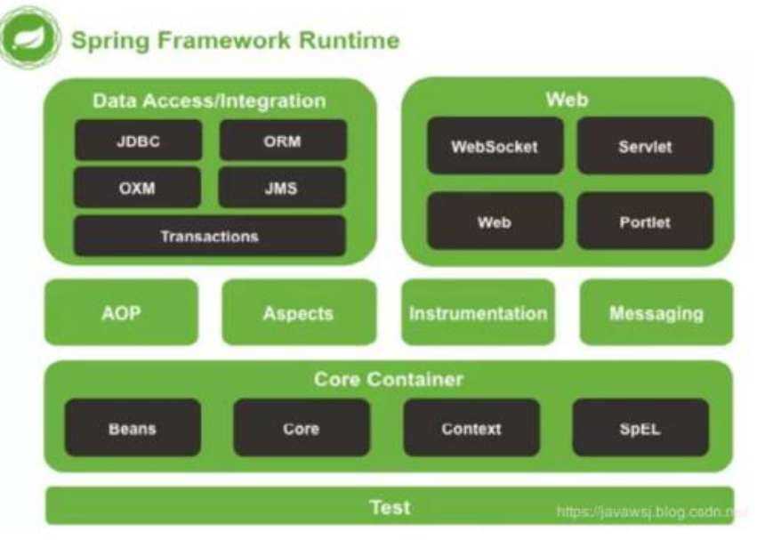
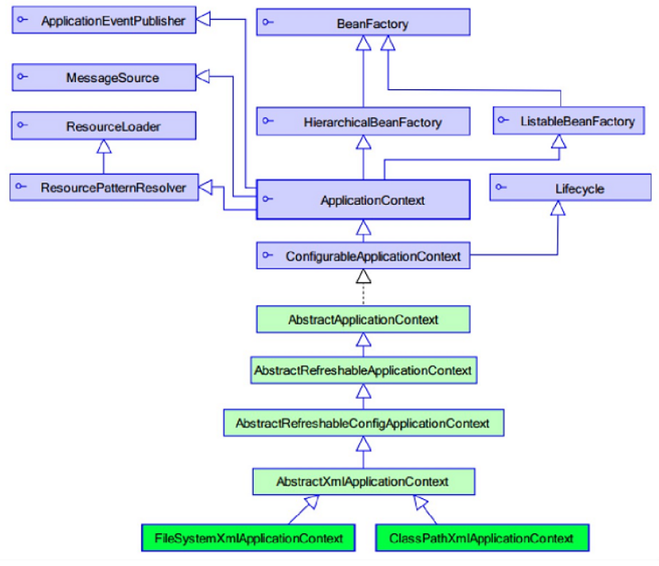
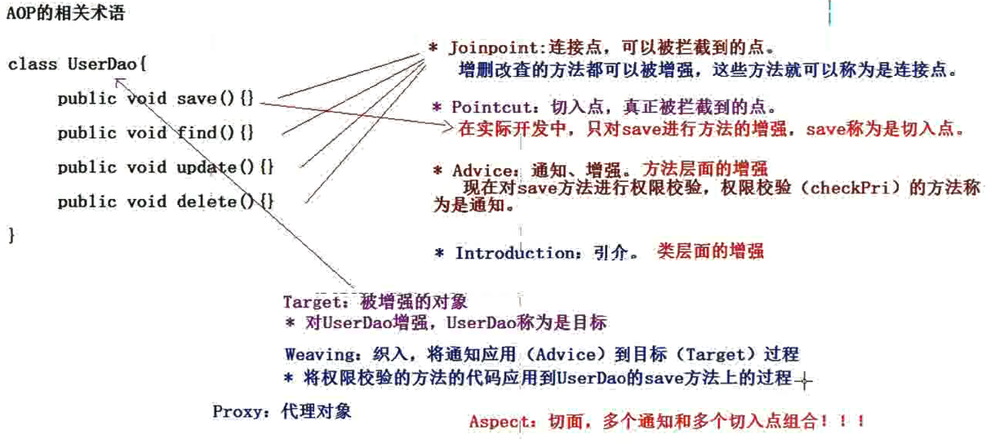
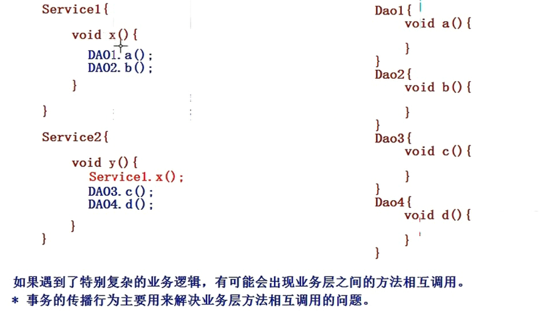

# spring入门

## 1、基本概念:




 控制反转(IOC): 将对象的创建权反转给spring管理

依赖注入(DI):  spring管理类时,将这个类需要的依赖注入进来(前提是需要注入的的类已经被spring管理)

## 2、spring的工厂结构:


 

ApplicationContext：加载配置文件的时候， 就会将spring管理的类都实例化。

ApplicationContext两个实现类：

- ClassPathXmlApplicationContext：加载类路径下的xml配置文件
- FileSystemXmlApplicationContext：加载文件系统下的配置文件


## 3、bean标签

==id==： 使用了约束中的唯一约束，里面不能出现特殊字符（常用）

name：没有使用唯一约束，理论上可以重复，但是开发过程中不允许重复

==class==：需要交给spring管理的对象类路径

`scope`：bean的作用范围

- `singleton`：默认spring会采用单例来创建对象
- `prototype`：多例模式
- request：应用在web项目中,spring创建这个类以后，将这个存入到request范围中
- session：应用在web项目中,spring创建这个类以后，将这个类存入sessin范围中
- globalsession: 应用在web项目中,必须在prolet环境下使用,但是如果没有这种环境,想当于session

Bean的生命周期配置（了解）：

-  init-method：bean被初始化的时候执行的方法
-  destroy-method：bean被销毁的时候执行的方法（Bean是单例创建，工厂关闭）

## 4、spring的bean实例化方式

1. 无参构造方法（默认）：

   ``` java
   public class Bean1 {
   
       public Bean1() {
           System.out.println("无参构造执行了。。。。。。");
       }
   }
   
    <bean id="bean1" class="com.spring.bean.Bean1"></bean>
   
   ```

   

2. 静态工厂构造方法：

   ``` java
   public class Bean2Factory {
       public static Bean2 createBean2() {
           System.out.println("Bean2 execution.....");
           return new Bean2();
       }
   }
   <bean id="bean2" class="com.spring.bean.Bean2Factory"  factory-method="createBean2"/>
   
   ```


3. 实例工厂实例化

   ``` java
public class Bean2Factory {
    public Bean1 createBean2() {
        System.out.println("Bean2Factory execution.....");
        return new Bean1();
    }
}
<bean id="bean2Factory" class="com.spring.bean.Bean2Factory" />
<bean id="bean2" factory-bean="bean2Factory" factory-method="createBean2"/>
   ```


## 5、普通属性的注入

- 构造方法注入

  ``` java
  public class Car {
      private String name;
      private Double price;
  
      public Car(String name, Double price) {
          this.name = name;
          this.price = price;
      }
  。。。。。。
      
  <bean id="car" class="com.spring.bean.Car">
          <constructor-arg name="name" value="大众"/>
          <constructor-arg name="price" value="2000"/>
   </bean>
  ```

- set方法注入(此时不能添加有参构造，否则无法注入)

  ``` java
  public class Car2 {
      private String name;
      private Double price;
      
      public void setName(String name) {
          this.name = name;
      }
      public void setPrice(Double price) {
          this.price = price;
      }
  }
  
   <bean id="car2" class="com.spring.bean.Car2">
     // value: 表示注入普通属性，如果需要注入对象，则需要使用ref
          <property name="name" value="兰博基尼"/>
          <property name="price" value="50000"/>
   </bean>
  ```

- p名称空间注入

- spel注入

## 6、集合属性的注入

``` xml
<!-- Spring的集合属性的注入============================ -->
	<!-- 注入数组类型 -->
	<bean id="collectionBean" class="com.itheima.spring.demo5.CollectionBean">
		<!-- 数组类型 -->
		<property name="arrs">
			<list>
				<value>王东</value>
				<value>赵洪</value>
				<value>李冠希</value>
			</list>
		</property>
		
		<!-- 注入list集合 -->
		<property name="list">
			<list>
				<value>李兵</value>
				<value>赵如何</value>
				<value>邓凤</value>
			</list>
		</property>
		
		<!-- 注入set集合 -->
		<property name="set">
			<set>
				<value>aaa</value>
				<value>bbb</value>
				<value>ccc</value>
			</set>
		</property>
		
		<!-- 注入Map集合 -->
		<property name="map">
			<map>
				<entry key="aaa" value="111"/>
				<entry key="bbb" value="222"/>
				<entry key="ccc" value="333"/>
			</map>
		</property>
	</bean>
```

# spring注解开发

## 1、IOC注解开发入门：

需要导入spring-aop的依赖

- 开启注解扫描

  ``` xml
  <!--开启注解扫描，是为了扫描类上的注解-->
  <context:component-scan base-package="com.spring.dao"/>
  ```

-  添加注解

  ``` java
  @Component("userDao") // 等价：<bean id="userDao" class="com.spring.dao.impl.UserDaoImpl" ></bean>
  public class UserDaoImpl implements UserDao {
      @Override
      public void save() {
          System.out.println("-------------save----");
      }
  }
  ```

  

- 注解方式：属性可以没有set方法

  - 属性如果没有set方法，直接在属性上面添加@value即可
  - 属性如果有set方法，也可以在set方法上注入，也可以在参数中添加注解

  ``` java
  public UserDao { 
      @Value("test")
  	private String name;
      
      /*public void setName(@Value("test") String name) {
          this.name = name;
      }*/
      @Override
      public void save() {
          System.out.println("-------------save----" + this.name);
      }
  ```


## 2、IOC注解详解

- @ComponentScan
  - 指定进行扫描的包，默认当前包的路径

- @Component：三个衍生注解（可以指定名称，`默认名称为类名第一个字符小写`）
  - @Controller
  - @Service
  - @Repository
  
- 属性注入的注解
  - 普通属性：
    
    - @value： 设置普通属性的值
    
      - 为了能够解析属性占位符（${jdbc.username}), 需要定义一个PropertySourcesPlaceholderConfigurer类的Bean
    
  - 对象类型的属性：
    - @Autowired：按照对象类型完成属性的注入， 类型没找到，则采用name
      - @Qualifier：如果有多个类型相同的类，单独使用Autowired将会发生异常，就需要使用Qualify来指定名称（这里的名称都指id，并不是name），结合Autowired使用
      - @Primary： 在实现类中标明此注解，表示spring优先注入这个类
    - @Resource：Java自带的注解， 按照名称完成属性的注入，默认名称为属性名，如果名称没有找到，将按照类型查找
  
- 其他注解：

  - @ImportResource：引入XML所定义的bean
  - @Import：引入配置类
    - @Import（ApplicationConfig。class）
  - @Profile（“dev”): 指明是开发环境，还是测试环境，同样也可以在XML中使用Profile
  - @ActiveProfiles（“dev”）： 指定启动时加载哪个profile
  - @PropertySource： 加载属性文件

  - @Conditional({ConditionImpl.class})：根据条件是否需要装配Bean,ConditionImpl需要实现Condition接口
    - Springboot源码中常用
  - @Scope：
    - 单例（singleton）
    - 原型（prototype）
    - 会话（session）
    - 请求（request）

``` java
@Component("userDao111") // 等价：<bean id="userDao111" class="com.spring.dao.impl.UserDaoImpl" ></bean>
public class UserDaoImpl implements UserDao {
    @Override
    public void save() {
        System.out.println("-----userDaoImpl--------save----");
    }
}


// 默认名称userImpl
@Component
public class UserImpl implements UserDao {
    @Override
    public void save() {
        System.out.println("userImpl");
    }
}

@Component
public class UserService {

    // @Autowired
    // @Qualifier("userDao111")
    @Resource(name = "userImpl")
    private UserDao userDao;

    public void save() {
        System.out.println("-----userservice");
        userDao.save();
    }
}
```


3、Bean的其他注解

- 生命周期相关的注解
  - @PostConstruct： 初始化方法
  - @PreDestroy： 销毁方法
- Bean作用范围的注解
  - @Scope: 作用范围
    - singleton：
    - prototype：
    - request：
    - session
    - globalsession

``` java
@Component
@Scope("prototype")
public class UserService {

    // @Autowired
    // @Qualifier("userDao111")
    @Resource(name = "userImpl")
    private UserDao userDao;

    public void save() {
        System.out.println("-----userservice");
        userDao.save();
    }


    @PostConstruct
    public void init() {
        System.out.println("init ......");
    }

    @PreDestroy
    public void destroy() {
        System.out.println("destroy......");
    }
}
```


## 3、 XML和注解整合开发

用得比较少（了解）

使用XML来管理Bean，使用注解来注入属性

```java
public class ProductService {

    @Autowired
    private ProductDao productDao;

    public void setProductDao(ProductDao productDao) {
        this.productDao = productDao;
    }

    public void save() {
        System.out.println("productservice...");
        productDao.save();
    }
}

// 配置文件：
 <!--在没有使用扫描的情况下，使用属性注入的注解：@Resource，@Value。。。-->
    <context:annotation-config/>

    <bean id="serviceDao" class="com.spring.bean2.ProductService">
    </bean>

    <bean id="productDao" class="com.spring.bean2.ProductDao"></bean>
```


# spring的AOP开发

## 1、代理

### 静态代理：

```java
public interface Subject {
    void request();
}

class RealSubject implements Subject {
    @Override
    public void request() {
        System.out.println("sale item.....");
    }
}

class Proxy implements Subject {
    private Subject subject;
    public Proxy(Subject subject) {
        this.subject = subject;
    }

    @Override
    public void request() {
        System.out.println("sale before...");
        subject.request();
        System.out.println("sale after...");
    }


    public static void main(String[] args) {
        Proxy proxy = new Proxy(new RealSubject());
        proxy.request();
    }
}

```

### 动态代理：

- JDK动态代理：只能对实现了接口的类产生代理 (spring默认采用JDK动态代理实现)
- CgLib动态代理（类似于javasist第三方代理技术）：可以对没有实现接口的类产生代理对象（相当于继承的目标对象），生成子类对象

> JDK动态代理

- 只能代理委托类中任意的非final的方法，他是通过继承来生成代理类，因此如果目标类时final修饰，那么就无法被代理。

```java
public class JDKProxy {
    private Object target;

    public JDKProxy(Object target) {
        this.target = target;
    }

    // 生成代理对象
    public Object getProxyInstance() {
        return Proxy.newProxyInstance(target.getClass().getClassLoader(), target.getClass().getInterfaces(),
                new InvocationHandler() {
                    @Override
                    public Object invoke(Object proxy, Method method, Object[] args) throws Throwable {
                        System.out.println("sales before...");
                        System.out.println(this.getClass());
                        method.invoke(target, args);
                        System.out.println("sales after...");
                        return null;
                    }
                });
    }

    public static void main(String[] args) {
        RealSubject subject = new RealSubject();
        JDKProxy jdkProxy = new JDKProxy(subject);
        Subject proxyInstance = (Subject) jdkProxy.getProxyInstance();
        System.out.println(proxyInstance.getClass());
        proxyInstance.request();
    }
}
```


> Cglib动态代理（第三方类库，需要引入包）

```java

/**
 * 使用Cglib产生代理对象，实际上是生成一个子类的代理对象
 */
public class CglibProxy implements MethodInterceptor {
    // 需要增强的对象
    private CustomerDao customerDao;

    public  CglibProxy(CustomerDao customerDao) {
        this.customerDao = customerDao;
    }

    /**
     * 创建代理对象
     * @return
     */
    public CustomerDao createProxy() {
        // 1. 创建cglib的核心类对象
        Enhancer enhancer = new Enhancer();
        // 2. 设置目标类的字节码文件
        enhancer.setSuperclass(customerDao.getClass());
        // 3. 设置回调：类似于InvocationHandler对象
        enhancer.setCallback(this);
        // 4. 创建代理对象
        CustomerDao proxy = (CustomerDao) enhancer.create();
        return proxy;
    }

    /**
     *
     * @param proxy 代理对象
     * @param method    父类方法
     * @param args      参数
     * @param methodProxy   代理方法
     * @return
     * @throws Throwable
     */
    @Override
    public Object intercept(Object proxy, Method method, Object[] args, MethodProxy methodProxy) throws Throwable {
        if ("save".equals(method.getName())) {
            System.out.println("check customer.......");
        }
        return methodProxy.invokeSuper(proxy, args);
    }
}
```

## 2、spring的AOP入门

> AOP思想是由AOP联盟制定的规范，spring是基于aspectj来实现aop开发的

AOP的相关术语：





- 编写需要增强的代码

  ```java
  public class MyAspectXML {
      public void checkPri() {
          System.out.println("check Privilege");
      }
  }
  ```

  

- 编写aop配置文件

  ```xml
  <bean id="productDao" class="com.spring.dao.impl.ProductDaoImpl"></bean>
  <!-- 将切面类交给spring管理，权限校验的逻辑代码-->
  <bean id="myAspect" class="com.spring.bean.MyAspectXML"></bean>
  <!-- 通过AOP的配置完成对目标类产生代理-->
  <aop:config>
      <!-- 表达式配置哪些类的哪些方法需要进行增强-->
      <aop:pointcut id="pointcut1" expression="execution(* com.spring.dao.ProductDao.add(..))"/>
  
      <!-- 配置切面-->
      <aop:aspect ref="myAspect">
          <!-- 前置增强-->
          <aop:before method="checkPri" pointcut-ref="pointcut1"/>
      </aop:aspect>
  </aop:config>
  ```

  

- spring整合单元测试进行测试程序

  ```java
  @RunWith(SpringJUnit4ClassRunner.class)
  @ContextConfiguration("classpath:applicationContext.xml")
  public class TestAop {
      @Resource
      private ProductDao productDao;
      @Test
      public void demo() {
          productDao.add();
          productDao.find();
      }
  }
  ```

  

## 3、通知详解

**相关概念：**

- 前置通知：在目标方法执行之前进行操作
- 后置通知：在目标方法执行之后进行操作
- 环绕通知：在目标方法执行前后都进行操作
- 异常抛出通知：在程序执行出现异常时，执行此操作
- 最终通知：无论代码是否有错误都是会被执行的（类似于finally）


**案例：**

**实现类：**

```java
public class ProductDaoImpl implements ProductDao {
    @Override
    public void add() {
        System.out.println("add.....");
    }

    @Override
    public void remove() {
        System.out.println("remove.......");
    }

    @Override
    public void find() {
        int i = 1/0;
        System.out.println("find.........");
    }

    @Override
    public String update() {
        System.out.println("update.........");
        return "modify success";
    }
}

```

**切面类：**

```java
public class MyAspectXML {
    /**
     * 前置通知
     */
    public void checkPri(JoinPoint joinPoint) {
        System.out.println("check Privilege" + joinPoint);
    }

    /**
     * 后置通知
     */
    public void writeLog(Object result) {
        System.out.println("后置通知。。。。。" + result);
    }

    /**
     * 环绕通知
     */
    public Object around(ProceedingJoinPoint joinPoint) throws Throwable {
        System.out.println("around before........");
        Object obj = joinPoint.proceed();
        System.out.println("around after.....");
        return obj;
    }

    /**
     *  异常通知
     */
    public void exceptionThrow(Throwable ex) {
        System.out.println("异常抛出。。。" + ex.getMessage());
    }

    /**
     *  最终通知
     */
    public void finallyNotice() {
        System.out.println("最终通知。。。。。。");
    }

}
```

**配置文件：**

```xml
<bean id="productDao" class="com.spring.dao.impl.ProductDaoImpl"></bean>
    <!-- 将切面类交给spring管理，权限校验的逻辑代码-->
    <bean id="myAspect" class="com.spring.bean.MyAspectXML"></bean>
    <!-- 通过AOP的配置完成对目标类产生代理-->
    <aop:config>
        <!-- 表达式配置哪些类的哪些方法需要进行增强-->
        <aop:pointcut id="pointcut1" expression="execution(* com.spring.dao.ProductDao.add(..))"/>
        <aop:pointcut id="pointcut2" expression="execution(* com.spring.dao.ProductDao.update(..))"/>
        <aop:pointcut id="pointcut3" expression="execution(* com.spring.dao.ProductDao.remove(..))"/>
        <aop:pointcut id="pointcut4" expression="execution(* com.spring.dao.ProductDao.find(..))"/>

        <!-- 配置切面-->
        <aop:aspect ref="myAspect">
            <!-- 前置增强-->
            <aop:before method="checkPri" pointcut-ref="pointcut1" />
            <!-- 后置增强-->
            <aop:after-returning method="writeLog" pointcut-ref="pointcut2" returning="result"/>
            <!-- 环绕增强-->
            <aop:around method="around" pointcut-ref="pointcut3" />
            <!-- 异常抛出通知-->
            <aop:after-throwing method="exceptionThrow" pointcut-ref="pointcut4"  throwing="ex"/>
            <!-- 最终通知-->
            <aop:after method="finallyNotice" pointcut-ref="pointcut4"/>

        </aop:aspect>
    </aop:config>
```


## 4、切入点表达式

语法：

- [访问修饰符] 方法返回值 包名.方法名(参数)
  - 访问修饰符可以指定注解类@Annotation
  - 指定执行的方法execution
- public void com.spring.dao.CustomerDao.save(..)      (..)表示参数
- `* *.*.*Dao.save(..)`                     所有以Dao结尾的save方法
- `* com.spring.CustomerDao+.save(..)`   CustomerDao的所有子类中的save方法  
- `* com.spring..*.*(..)`                     com.spring下的所有子包下的所有方法


## 5、AOP注解开发

- 编写配置文件

  ```xml
  <!-- 开启aop的注解开发-->
  <aop:aspectj-autoproxy />
  <bean id="productDao" class="com.spring.dao.impl.ProductDaoImpl"></bean>
  <bean id="aspectAnno" class="com.spring.dao.MyAspectAnno"></bean>
  ```

  

- 编写切面配置

  ```java
  @Aspect
  public class MyAspectAnno {
      /**
       * 前置通知
       */
      @Before(value = "execution(* com.spring.dao.ProductDao.add(..))")
      public void checkPri(JoinPoint joinPoint) {
          System.out.println("check Privilege" + joinPoint);
      }
  
      /**
       * 后置通知
       */
      @AfterReturning(value = "execution(* com.spring.dao.ProductDao.update(..))", returning = "result")
      public void writeLog(Object result) {
          System.out.println("后置通知。。。。。" + result);
      }
  
      /**
       * 环绕通知
       */
      @Around("execution(* com.spring.dao.ProductDao.find(..))")
      public Object around(ProceedingJoinPoint joinPoint) throws Throwable {
          System.out.println("around before........");
          Object obj = joinPoint.proceed();
          System.out.println("around after.....");
          return obj;
      }
  
      /**
       *  异常通知
       */
      @AfterThrowing(value = "pointcut2()", throwing = "ex")
      public void exceptionThrow(Throwable ex) {
          System.out.println("异常抛出。。。" + ex.getMessage());
      }
  
      /**
       *  最终通知
       */
      @After(value = "pointcut1()")
      public void finallyNotice() {
          System.out.println("最终通知。。。。。。");
      }
  
  
      /**
       * 切入点配置，方便引用
       */
      @Pointcut("execution(* com.spring.dao.ProductDao.remove(..))")
      private void pointcut1(){}
      @Pointcut("execution(* com.spring.dao.ProductDao.find(..))")
      private void pointcut2(){}
  }
  ```
  


# spring的JDBC模板使用

> Spring是EE开发的一站式的框架，有EE开发的每层的解决方案。Spring对持久层也提供了解决方案：ORM模块和JDBC的模板。

## JDBC模板入门

使用spring自带的数据库连接池

```java
@Test
    public void test() {
        DriverManagerDataSource dataSource = new DriverManagerDataSource();
        dataSource.setDriverClassName("com.mysql.cj.jdbc.Driver");
        dataSource.setUrl("jdbc:mysql:///sshstudy?serverTimezone=UTC");
        dataSource.setUsername("root");
        dataSource.setPassword("123456");
        JdbcTemplate jdbcTemplate = new JdbcTemplate();
        jdbcTemplate.setDataSource(dataSource);
        jdbcTemplate.update("insert into account values(null,?,?)", "老王", 1234);
    }
```

将数据库连接池和jdbc模板交给spring管理

```xml
<!-- 配置数据库连接池-->
    <bean id="dataSource" class="org.springframework.jdbc.datasource.DriverManagerDataSource">
        <property name="driverClassName" value="com.mysql.cj.jdbc.Driver"/>
        <property name="url" value="jdbc:mysql:///sshstudy?serverTimezone=UTC"/>
        <property name="username" value="root"/>
        <property name="password" value="123456"/>
    </bean>

    <!-- 配置jdbc模板-->
    <bean id="jdbcTemplate" class="org.springframework.jdbc.core.JdbcTemplate">
        <property name="dataSource" ref="dataSource"/>
    </bean>
```

**spring配置文件中引入属性文件**

使用${key}来引用属性文件中的value

```xml
 <!--引入jdbc属性文件-->
    <!--通过bean标签引入-->
    <bean class="org.springframework.context.support.PropertySourcesPlaceholderConfigurer">
        <property name="location" value="classpath:jdbc.properties"/>
    </bean>

    <!--通过context标签引入,常用-->
    <context:property-placeholder location="classpath:jdbc.properties"/>

```

## CRUD操作

增，删，改都可以使用update来实现

查：

```java
 @Test
    public void test2() {
        template.update("insert into account values(null,?,?)", "xiaohong", 1234);
    }


    /**
     * 查询单个属性
     */
    @Test
    public void test3() {
        Integer name = template.queryForObject("select name from account where id=? ", Integer.class, 1L);
        System.out.println(name);
    }

    /**
     * 统计数量
     */
    @Test
    public void test4() {
        Long aLong = template.queryForObject("select count(1) from account", Long.class);
        System.out.println(aLong);
    }

    /**
     * 查询单个对象
     */
    @Test
    public void test5() {
        Account a = template.queryForObject("select * from account where id=?", (resultSet, i) -> {
                Account account = new Account();
                account.setId(resultSet.getInt("id"));
                account.setName(resultSet.getString("name"));
                account.setMoney(resultSet.getDouble("money"));
                return account;

        }, 1);
        System.out.println(a);
    }

    @Test
    public void test6() {
        List<Account> list = template.query("select * from account", (resultSet, i) -> {
            Account account = new Account();
            account.setId(resultSet.getInt("id"));
            account.setName(resultSet.getString("name"));
            account.setMoney(resultSet.getDouble("money"));
            return account;
        });

        list.forEach(System.out::println);
    }
    
```


# Spring的事务管理

## 1、事务的基本概念

事务：逻辑上的一组操作，组成这组操作的各个单元，要么全部成功，要么全都失败

**事务的特性：**

- 原子性：事务不可分割
- 一致性：事务执行前后数据完整性保持一致
- 隔离性：一个事务的执行不应该受到其他事务的干扰
- 持久性：一旦事务结束，数据就被持久化到数据库中

**不考虑隔离性引发安全性问题：**

- 读问题： 
  - 脏读： 一个事务读到另一个事务未提交的数据
  - 不可重复读： 一个事务读到另一个事务已提交的update数据，导致一个事务多次查询的结果不一致
  - 幻读、虚度：一个事务读到另一个事务已提交的insert数据，导致一个事务多次查询的结果不一致
- 写问题
  - 丢失更新

**解决读问题**

设置隔离级别：

- Read uncommitted: 未提交读，任何问题解决不了
- ==Read committed==： 已提交读，解决脏读，但是不可重复读和虚读有可能发生。（oracle默认级别）
- ==Repeatable read==： 重复读，解决脏读和不可重复读，但是虚读有可能发生（mysql默认级别）
- Serializable：解决所有读问题（效率低下，不支持并发）


## 2、Spring的事务管理API

> Platform TransactionManager

平台事务管理器： 接口，是Spring用于管理事务的真正对象

- DataSourceTransactionManager： 底层使用JDBC管理事务
- HibernateTransactionManager： 底层使用Hibernate管理事务

> TransactionDefinition

事务定义： 用于定义事务的相关信息，隔离级别、超时信息、传播行为、是否只读

> TransactionStatus

事务状态： 用于记录在事务管理过程中，事务状态的对象


**事务管理API之间的关系**

Spring进行事务管理的时候，首先`平台事务管理器`根据`事务定义`信息进行事务的管理，在事务管理过程中，产生各种转态，将这些状态记录到`事务状态`的对象中


## 3、Spring事务传播行为

> 主要为了解决复杂业务相互调用产生的问题





**Spring中提供了七中事务的传播行为：**

- 保证多个操作在同一个事务中
  - `PROPAGATION_REQUIRED`:  默认值，如果A中有事务，使用A中的事务。如果A中没有，创建一个新的事务将操作包含进来
  - PROPAGATION_SUPPORTS: 支持事务，如果A中有事务，就使用A中的事务。如果A中没有事务，就不用事务
  - PROPAGATION_MANDATORY: 如果A中有事务，就使用A中的事务。如果A中没有事务，抛出异常

- 保证多个操作不在同一个事务中
  - `PROPAGATION_REQUIRES_NEW`：如果A中有事务，将A的事务挂起（暂停），创建新事务，只包含自身操作。如果A中没有事务，创建一个新事务，包含自身操作。
  - PROPAGATION_NOT_SUPPORTED：如果A中有事务，将A的事务挂起。不使用事务管理。
  - PROPAGATION_NEVER：如果A中有事务，报异常

- 嵌套式事务
  - `PROPAGATION_NESTED`：嵌套事务，如果A中有事务，按照A的事务执行，执行完成后，设置一个保存点，执行B中的操作，如果没有异常，执行通过，如果有异常，可以选择回滚到最初始位置，也可以回滚到保存点。

## 4、声明式事务管理

> 通过编写配置文件，底层采用AOP方式实现

**XML方式的声明式事务管理**

- 编写配置文件

  ```xml
  <!-- 配置平台事务管理器-->
      <bean id="transactionManager" class="org.springframework.jdbc.datasource.DataSourceTransactionManager">
          <!-- 保证数据库连接是同一个-->
          <property name="dataSource" ref="dataSource" />
      </bean>
  
      <!-- 配置事务的增强-->
      <tx:advice id="txAdvice" transaction-manager="transactionManager">
          <tx:attributes>
              <!-- 事务管理的规则， 常用配置-->
              <!--<tx:method name="save*" propagation="REQUIRED" isolation="DEFAULT" />
              <tx:method name="update*" propagation="REQUIRED" isolation="DEFAULT" />
              <tx:method name="find*" propagation="REQUIRED" read-only="true" />-->
  
              <tx:method name="*"/>
          </tx:attributes>
      </tx:advice>
      <!-- aop的配置-->
      <aop:config>
          <aop:pointcut id="pointct1" expression="execution(* com.spring.demo2.AccountService.*(..))"/>
          <aop:advisor advice-ref="txAdvice" pointcut-ref="pointct1"/>
      </aop:config>
  ```

- 测试

  

**注解方式的声明式事务管理**

- 编写配置文件

  ```xml
  <!-- 配置平台事务管理器-->
      <bean id="transactionManager" class="org.springframework.jdbc.datasource.DataSourceTransactionManager">
          <!-- 保证数据库连接是同一个-->
          <property name="dataSource" ref="dataSource" />
      </bean>
  
      <!-- 开启注解事务-->
      <tx:annotation-driven transaction-manager="transactionManager" />
  ```

- 添加注解

  ```java
  @Transactional
  public class AccountService {。。。}
  ```

  

`注意：在使用注解时，方法内捕获异常后一定要抛出异常，否者spring将不会检测到该方法发生的错误，也就是当方法异常时，spring将不会进行数据回滚`

## 5、编程式事务管理

> 需要手动编写代码，了解即可

1. 配置平台事务管理器

   ```xml
   <!-- 配置平台事务管理器-->
   <bean id="transactionManager" class="org.springframework.jdbc.datasource.DataSourceTransactionManager">
       <!-- 保证数据库连接是同一个-->
       <property name="dataSource" ref="dataSource" />
   </bean>
   ```

   

2. 配置事务的管理模板类

   ```
   <!--配置事务
   ```
   
   
   
3. 在业务层注入事务管理的模板

   ```
   <bean id="accountService" class="com.spring.demo2.AccountService">
           <property name="accountDao" ref="accountDao" />
           <!-- 注入事务管理器的模板-->
           <property name="template" ref="transactionTemplate" />
       </bean>
   ```

   

4. 编写事务管理的代码

   ```java
   
   public class AccountService {
       private AccountDao accountDao;
       public void setAccountDao(AccountDao accountDao) {
           this.accountDao = accountDao;
       }
   
       private TransactionTemplate template;
       public void setTemplate(TransactionTemplate template) {
           this.template = template;
       }
       public void transfer(String from, String to, Double money) {
           template.executeWithoutResult(tx -> {
               accountDao.outMoney(from, money);
               int i = 1/0;
               accountDao.inMoney(to, money);
           });
       }
   }
   ```

   


