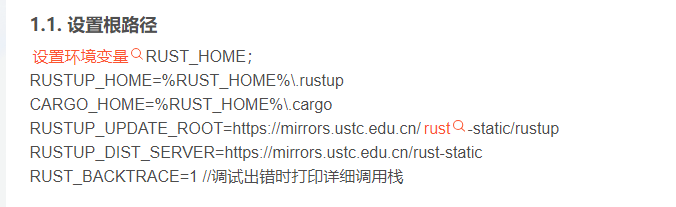
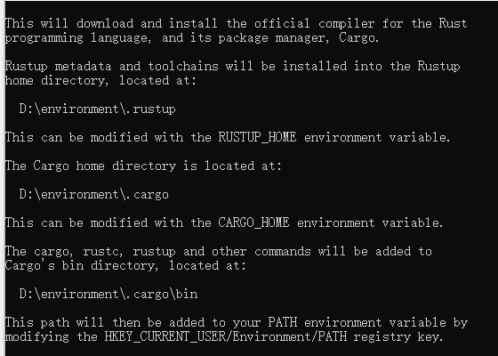
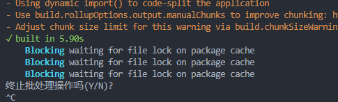

## 安装

https://blog.csdn.net/flyinmind/article/details/108437443



指定目录，默认安装到c:user/xxx/.cargo, 无法设置环境变量




提示Blocking waiting for file lock on package cache



```
原因:~\.cargo下的.package_cache被加锁阻塞
 
解决方法:删除.package_cache文件
```

