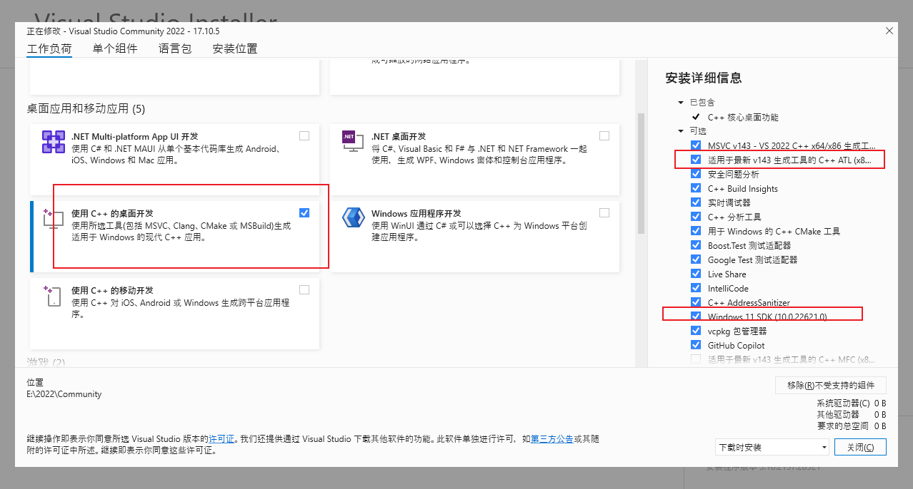
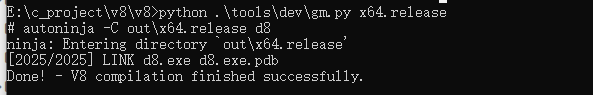
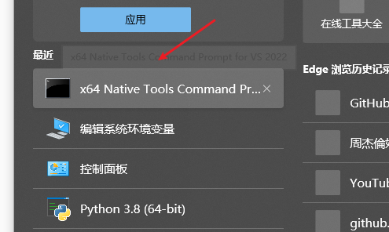
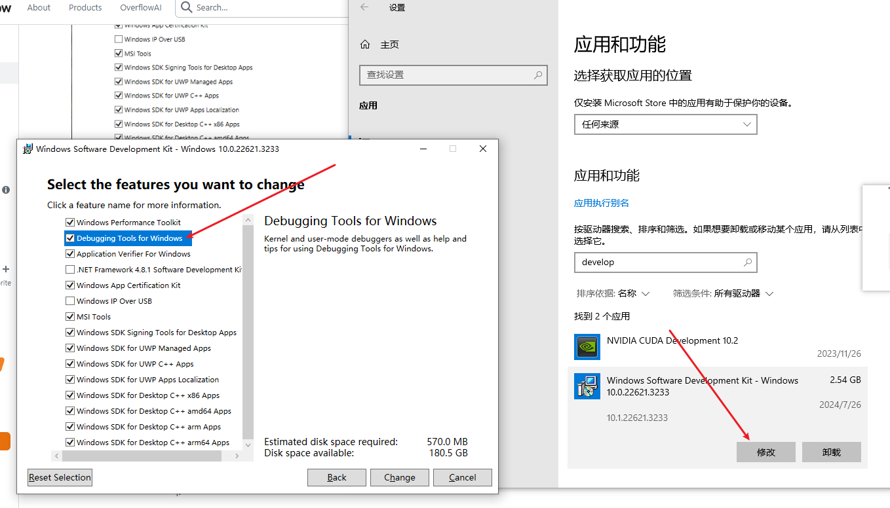
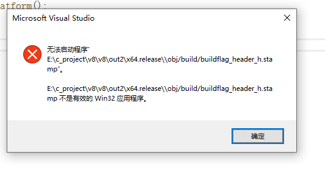

# win10 编译V8


官网相关文档：

https://v8.dev/docs/build-gn

https://chromium.googlesource.com/chromium/src/+/master/docs/windows_build_instructions.md#Setting-up-Windows


其他：

https://gist.github.com/jhalon/5cbaab99dccadbf8e783921358020159

https://medium.com/angular-in-depth/how-to-build-v8-on-windows-and-not-go-mad-6347c69aacd4


### 方法一

1. 官网下载depot_tools （https://commondatastorage.googleapis.com/chrome-infra-docs/flat/depot_tools/docs/html/depot_tools_tutorial.html#_setting_up），同时将该目录添加到PATH环境变量中，设置到最前面（避免使用系统的其他目录的python）。 用于后面可以执行gclient 命令

2. 打开CMD设置代理(外网工具打开)，如clash：

   ```shell
   # 使用socks5 部分文件无法拉取
   set http_proxy=http://127.0.0.1:7890
   set https_proxy=http://127.0.0.1:7890
   ```

3. 获取v8 源码：

   ```shell
   mkdir v8 && cd v8
   fetch v8
   # 这里会等待很久，如果一直没动卡主说明 网络有问题
   gclient sync 
   ```

4. 设置VS

   - 安装vs 2022，官网要求
   - 勾选相关的工具：检查右边是否出现了那些东西。 安装位置可以自定义
     

   - 设置环境变量：

     ```shell
     DEPOT_TOOLS_WIN_TOOLCHAIN： 0
     vs2022_install： vs安装的位置
     WINDOWSSDKDIR：D:\WindowsKits\10 （我这里由于自定义了SDK目录，默认安装在C盘，不需要设置该环境变量）
     ```

5. 开始编译：确保前面都执行好了

   ```shell
   # 进入v8源码目录， 也可以编译debug 版本， 
   python .\tools\dev\gm.py x64.release   
   ```

   完成后如下：

   

​	 release 默认是没有dll库，如果需要可以编辑args.gn文件加入：v8_static_library = true， 需要把其他文件删了重新执行命令


### 其他方法：

https://blog.csdn.net/xray2/article/details/120595202

https://www.caoccao.com/Javet/development/build_javet_from_scratch.html

1. 打开VS命令行工具：
   

2. 切换到V8目录下。

3. 执行下面命令

   ```shell
   # 会创建out/x64.release目录， 同时弹出编辑器输入参数
   gn args out/x64.release
   # 参数：
   is_debug = false
   target_cpu = "x64"
   is_component_build = true    # true: 才会生成dll
   v8_static_library = true
   
   # 生成VS 工程，可以用VS直接打开
   gn gen --ide=vs out\x64.solution
   
   # 可以直接在VS 中选择 gn_all解决方案进行构建， 或者继续在命令行编译。 目标：v8/ v8_monolith
   ninja -C out/x64.release v8_monolith -j 18  # 并行构建，18线程
   ```

   

相关问题：

- ~~我电脑还安装了一个ninja，不知道有没有用，看官网貌似没提到这个~~，   必须安装吧，上面命令都用了
- gclient 卡死不动， 检查网络，国内是挺麻烦
- 编译命令中可能会报一些简单的问题，可以自行阅读源码的python代码查看
- 如果提示下面的问题，说明vs 版本不对，即Windows SDK的版本(2022 才有下面的符号)

```
lld-link: error: undefined symbol: __tls_guard
lld-link: error: undefined symbol: __dyn_tls_on_demand_init
```

- 如果开始构建了release版本，后面继续构建debug，可能会报错：

  ```
  ERROR at dynamically parsed input that //build/toolchain/win/win_toolchain_data.gni:13:7 loaded :2:3: Invalid token
  ```

  直接删除v8的out目录，重新来 (也可以重新同步下： gclient sync）

- Debuggers\\x64\\cdb.exe' 不存在， 安装调试工具：
  

- VS中没有选择执行的目标，设置一个默认的执行解决方案即可。
  

- C++  20 警告， 打开V8目录的BUILD.gn 文件，搜索cflags，在第一个加入参数

  ```
  cflags = ["/D_SILENCE_ALL_CXX20_DEPRECATION_WARNINGS"]
  ```

  


# V8概念


