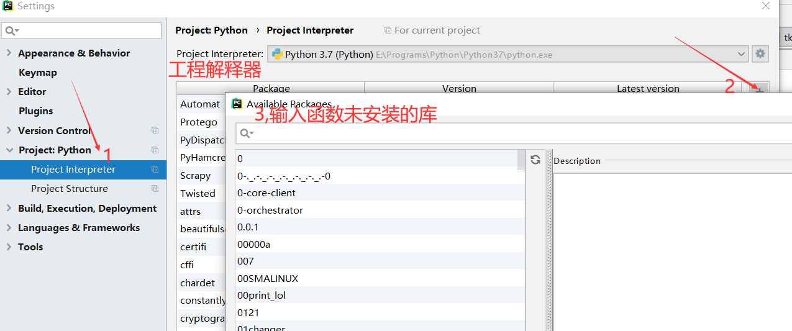
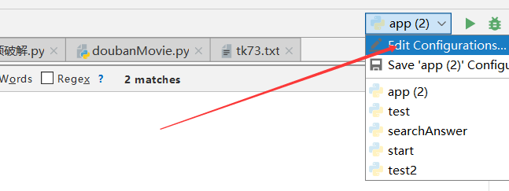
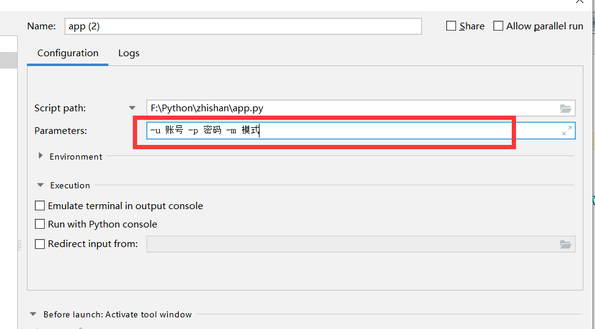
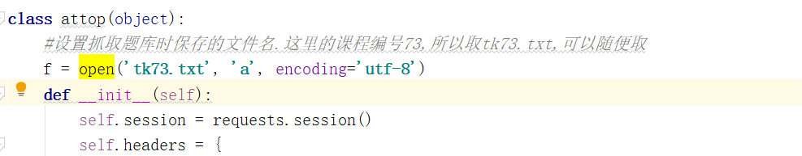
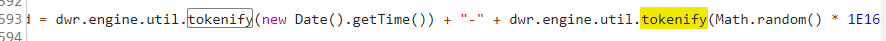
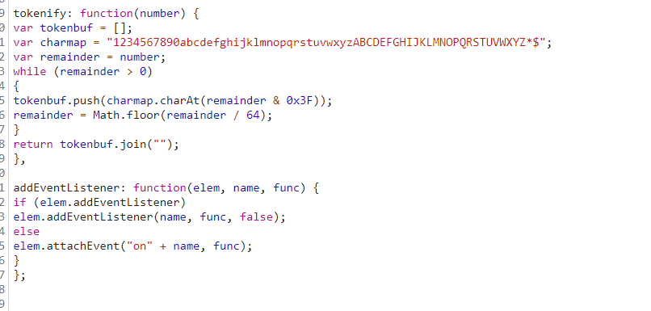

# 至善网刷课程序

> 声明: 本软件仅供学习python使用,请勿用于商业用途

此程序采用python代码编写,参考大神代码改写而成,参考地址:<a href>https://github.com/tataki/attop-auto </a>

程序功能:支持自动答题,自动评价,时长暂时不能搞

答题采用本地题库的方式进行发包,确保答题的准确性

程序代码地址:

## 使用:

博主使用的是pycharm,至于如何使用pycharm运行python代码这里不做过多解释,百度一大堆教程

>首先去我提供的地址将代码下载到电脑,复制到python的工程下

工程共有两个文件

- app.py:  python启动文件
- tk73.txt: 存放题库的文件,没有题库文件则无法进行刷题

>  启动方法

打开app.py

​	文件开头如果出现报红信息,则说明python环境没有下载相应的库,需要下载pycharm可以在报红位置alt + enter自动下载相应的函数库,前提是你需要配置好python解释器,否则会下载失败,也可以在setting中下载,如下




如果下载报错,多半是你的解释器没有配正确

直到代码都没有报红了,开始修改代码,

找到下面这段代码

``` python
def main():
    #开始请设置课程id
    #所有请求必须使用self.session,否则需要从新设置session
    #指定题库文件
    filename = 'tk73.txt'
    #课程编号 http://www.attop.com/wk/learn.htm?id=73&jid=2117
    classId = 73
    at = attop()
    at.login()
    #所有的章节id
    all_url = at.getUrl(classId)
    #获取所有的媒体id
    all_mediaId = []
    for urlId in all_url:
```

==filename: 题库名,在刷题前务必准备好此文件==,如果没有该文件,可以找一个题已经答完了的账号,去抓题库下来,下面将会介绍如何抓题库

classId:指课程编号, 链接id后面的73,jid表示的是章节编号(忽略)

>  添加参数信息

1. 进入编辑界面

2. 填写信息

   

模式:  1为刷评价,2为刷学习时长,3为刷题,4为获取题库,默认全刷

首次使用请下填4获取题库,获取题库先设置好文件名




获取成功后将会在python的工程下生成相应的文件

然后指定题库文件,修改参数为自己的账号,修改模式,直接开刷,可能评价会一次,不要怕,在运行一次

好了,使用就说到这里了
建议大家还是把本程序作为学习python使用,不要投机取巧

## 简单分析下代码吧

> ​	由于本人是一个初学者,分析难免出现错误,大佬们多多理解

* 这里的意思就是将题库转成一个列表

``` python
def answerdata(filename):
    data = {}
    file = open(filename, 'r')
    while True:
    	#去除末尾的换行符,否则每一章的最后一题都会答错
        line = file.readline().strip("\n")
        if not line:
            break
        sp = line.split('-')
        data[sp[0]] = sp[1]
    return data

```
*  根据相应的规则生成JSESSION
```python
def tokenify(number):
    tokenbuf = []
    charmap = "1234567890abcdefghijklmnopqrstuvwxyzABCDEFGHIJKLMNOPQRSTUVWXYZ*$"
    remainder = number
    while remainder > 0:
        tokenbuf.append(charmap[remainder & 0x3F])
        remainder = math.floor(remainder / 64)
    return "".join(tokenbuf)

#生成DWRSESSIONID
def ssid(DWRSESSIONID):
    t = int(time.time())
    r = random.randint(1000000000000000, 9999999999999999)
    return DWRSESSIONID + "/" + tokenify(t) + "-" + tokenify(r)


```

以上代码根据官网的js文件分析得出

下面的图是在至善网的engine.js文件中找到的






- 下面是一个attop的对象

``` python
class attop(object):
    #设置抓取题库时保存的文件名.这里的课程编号73,所以取tk73.txt,可以随便取
    f = open('tk73.txt', 'a', encoding='utf-8')
    def __init__(self):
        self.session = requests.session()
        self.headers = {
            'User-Agent': 'Mozilla/5.0 (Macintosh; Intel Mac OS X 10_13_1) AppleWebKit/537.36 (KHTML, like Gecko) Chrome/62.0.3202.94 Safari/537.36',
            'Accept-Encoding': 'gzip, deflate',
            'Accept-Language': 'zh-CN,zh;q=0.9,en;q=0.8,zh-TW;q=0.7',
            'Content-Type': 'text/plain',
            'Proxy-Connection': 'keep-alive',
            'Referer': 'http://www.attop.com/'
        }
        self.cookies = {

        }

    def login(self):
        sess = self.session.get('http://www.attop.com/', headers=self.headers)
        if sess.status_code != requests.codes.OK:
            print('打开失败')
            return False
        # for k, v in sess.cookies.items():
        #     self.cookies[k] = v

        # 获得dwrsessid
        params = {
            'callCount': '1',
            'c0-scriptName': '__System',
            'c0-methodName': 'generateId',
            'c0-id': 0,
            'batchId': 0,
            'instanceId': 0,
            'page': '%2Findex.htm',
            'scriptSessionId': '',
            'windowName': ''
        }
        sess = self.session.post('http://www.attop.com/js/ajax/call/plaincall/__System.pageLoaded.dwr',
                                 headers=self.headers, data=params)

        # 得到必要参数
        self.dwrsessid = re.search(r'[0-9a-zA-Z*$]{27}', sess.text).group(0)
        cookie = requests.utils.add_dict_to_cookiejar(self.session.cookies, {'DWRSESSIONID': self.dwrsessid})
        print("cookie:%s"%cookie)
        imgheaders = {
            'User-Agent': 'Mozilla/5.0 (Macintosh; Intel Mac OS X 10_13_1) AppleWebKit/537.36 (KHTML, like Gecko) Chrome/62.0.3202.94 Safari/537.36',
            'Accept': 'image/webp,image/apng,image/*,*/*;q=0.8',
            'Referer': 'http://www.attop.com/login_pop.htm',
            'Accept-Encoding': 'gzip, deflate',
            'Accept-Language': 'zh-CN,zh;q=0.9,en;q=0.8,zh-TW;q=0.7'
        }
        sess = self.session.get('http://www.attop.com/image.jpg', headers=imgheaders)
        rand = sess.headers['set-cookie']
        #通过传送回来的cookie获取正确的验证码
        rand = re.search('\d{4}', rand, flags=0).group(0)
        print("verifyCode" +rand)
        loginparams = {
            'callCount': '1',
            'windowName': '',
            'c0-scriptName': 'zsClass',
            'c0-methodName': 'coreAjax',
            'c0-id': '0',
            'c0-param0': 'string:loginWeb',
            'c0-e1': 'string:%s' % options.username,
            'c0-e2': 'string:%s' % options.password,
            'c0-e3': 'string:%s' % str(rand),
            'c0-e4': 'number:2',
            'c0-param1': 'Object_Object:{username:reference:c0-e1, password:reference:c0-e2, rand:reference:c0-e3, autoflag:reference:c0-e4}',
            'c0-param2': 'string:doLogin',
            'batchId': '4',
            'instanceId': '0',
            'page': '%2Flogin_pop.htm',
            'scriptSessionId': ssid(self.dwrsessid)
        }
        #print(loginparams)
        self.headers['Referer'] = 'http://www.attop.com/login_pop.htm'

        self.session.post(
            'http://www.attop.com/js/ajax/call/plaincall/zsClass.coreAjax.dwr',
            headers=self.headers,
            data=loginparams
        )

        #获取所有章节的URL

        self.headers['Referer'] = 'http://www.attop.com/index.htm'
        sess = self.session.get(
            'http://www.attop.com/wk/learn.htm?id=72&jid=2150',
            headers=self.headers
        )
        ##验证登录是否成功
        #print(sess.text)


    def doass(self, id):
        url = 'http://www.attop.com/js/ajax/call/plaincall/zsClass.dotAjax.dwr'
        header = {
            'User-Agent': 'Mozilla/5.0 (Macintosh; Intel Mac OS X 10_13_1) AppleWebKit/537.36 (KHTML, like Gecko) Chrome/62.0.3202.94 Safari/537.36',
            'Accept-Encoding': 'gzip, deflate',
            'Accept-Language': 'zh-CN,zh;q=0.9,en;q=0.8,zh-TW;q=0.7',
            'Content-Type': 'text/plain',
            'Proxy-Connection': 'keep-alive',
            'Referer': 'http://www.attop.com/wk/media_pop.htm?id={0}'.format(id)
        }
        scriptSessionId = ssid(self.dwrsessid)
        params = {
            'callCount': '1',
            'windowName': '',
            'c0-scriptName': 'zsClass',
            'c0-methodName': 'dotAjax',
            'c0-id': '0',
            'c0-param0': 'string:doWkMediaPj',
            'c0-e1': 'number:{0}'.format(id),
            'c0-e2': 'number:3',
            'c0-param1': 'Object_Object:{id:reference:c0-e1, type:reference:c0-e2}',
            'c0-param2': 'string:doWkMediaPj',
            'batchId': '1',
            'instanceId': '0',
            'page': '%2Fwk%2Fmedia_pop.htm%3Fid%3D{0}'.format(id),
            'scriptSessionId': scriptSessionId
        }

        sess = self.session.post(
            url,
            headers=header,
            data=params
        )
        #print(sess.text)
        try :
            status_code = re.search(r'flag:(\d+),', sess.text).group(1)
        except error :
            print(error)
        if status_code == '1':
            print("成功")
        elif status_code == '131':
            print("已阅读过")

        print('状态码:'+id  +"\n" +status_code)
        return True

    def doOnline(self, class_id,pageid, batchid):
        param_url = 'id=%d&jid=%d' % (class_id, pageid)
        url = 'http://www.attop.com/js/ajax/call/plaincall/zsClass.commonAjax.dwr'
        self.headers['Referer'] = 'http://www.attop.com/wk/learn.htm?id=48&jid={0}'.format(pageid)
        self.session.get(self.headers['Referer'])
        time.sleep(1)
        scriptSessionId = ssid(self.dwrsessid)
        getTopDhNum_data = {
            'callCount': '1',
            'windowName': '',
            'c0-scriptName': 'zsClass',
            'c0-methodName': 'commonAjax',
            'c0-id': '0',
            'c0-param0': 'string:getTopDhNum',
            'c0-param1': 'Object_Object:{}',
            'c0-param2': 'string:doGetTopDhNum',
            'batchId': batchid,
            'instanceId': '0',
            'page': '%2Fwk%2Flearn.htm%3Fid%3D48%26jid%3D{0}'.format(pageid),
            'scriptSessionId': scriptSessionId
        }
        batchid = batchid +1
        getWkOnlineNum2_data = {
            'callCount': '1',
            'windowName': '',
            'c0-scriptName': 'zsClass',
            'c0-methodName': 'commonAjax',
            'c0-id': '0',
            'c0-param0': 'string:getWkOnlineNum2',
            'c0-e1': 'number:{0}'.format(class_id),
            'c0-e2': 'number:{0}'.format(pageid),
            'c0-param1': 'Object_Object:{bid:reference:c0-e1, jid:reference:c0-e2}',
            'c0-param2': 'string:doGetWkOnlineNum',
            'batchId': batchid,
            'instanceId': '0',
            'page': '%2Fwk%2Flearn.htm%3Fid%3D48%26jid%3D{0}'.format(pageid),
            'scriptSessionId': scriptSessionId
        }

        batchid = batchid + 1
        getAjaxList2_data = {
            'callCount': '1',
            'windowName': '',
            'c0-scriptName': 'zsClass',
            'c0-methodName': 'commonAjax',
            'c0-id': '0',
            'c0-param0': 'string:getAjaxList2',
            'c0-e1': '%s'%(parse.quote(param_url)) ,
             'c0-e2':'string:learn_1.htm',
            'c0-e3': 'number:1',
            'c0-e4': 'string:showajaxinfo2',
            'c0-param1': 'Object_Object:{param:reference:c0-e1, pagename:reference:c0-e2, currentpage:reference:c0-e3, id:reference:c0-e4}',
            'c0-param2':'string:doShowAjaxList2',
            'batchId': batchid,
            'instanceId': '0',
            'page': '%2Fwk%2Flearn.htm%3Fid%3D48%26jid%3D{0}'.format(pageid),
            'scriptSessionId': scriptSessionId
        }
        r = self.session.post(
            url,
            headers=self.headers,
            data=getTopDhNum_data
        )
        print(r.text)


        sess = self.session.post(
            url,
            headers=self.headers,
            data=getWkOnlineNum2_data
        )
        print('doOnline' +sess.text)
        r = self.session.post(
            url,
            headers=self.headers,
            data=getAjaxList2_data
        )
        print(r.text)

    def autoans(self, capter_id, class_id, answers):
        url = 'http://www.attop.com/js/ajax/call/plaincall/zsClass.dotAjax.dwr'
        self.headers['Referer']='http://www.attop.com/wk/learn.htm?id={0}&jid={1}'.format(class_id, capter_id)
        data = {
            'callCount': '1',
            'windowName': '',
            'c0-scriptName': 'zsClass',
            'c0-methodName': 'dotAjax',
            'c0-id': '0',
            'c0-param0': 'string:doSubmitWkXtAll',
            'c0-e1': 'number:{0}'.format(class_id),  # 课程号
            'c0-e2': 'number:{0}'.format(capter_id),
            'c0-e3': 'string:{0}'.format(answers),
            'c0-param1': 'Object_Object:{bid:reference:c0-e1, jid:reference:c0-e2, msg:reference:c0-e3}',
            'c0-param2': 'string:doCommonReturn',
            'batchId': '4',
            'instanceId': '0',
            'page': '%2Fwk%2Flearn.htm%3Fid%3D48%26jid%3D{0}'.format(capter_id),
            'scriptSessionId': ssid(self.dwrsessid)
        }
        self.session.get(self.headers['Referer'])
        sess = self.session.post(
            url,
            headers=self.headers,
            data=data
        )
        print(sess)

    def get_answer(self, id, jid):
            self.headers['Referer'] = 'http://www.attop.com/wk/learn.htm?id={0}&jid={1}'.format(id,jid)
            param_url = 'id=%d&jid=%d' %(id,jid)
            url = 'http://www.attop.com/js/ajax/call/plaincall/zsClass.commonAjax.dwr'
            print(url)

            data = {
                'callCount': '1',
                'windowName': '',
                'c0-scriptName': 'zsClass',
                'c0-methodName': 'commonAjax',
                'c0-id': '0',
                'c0-param0': 'string:getAjaxList',
                'c0-e1': 'string:%s' %parse.quote(param_url),
                'c0-e2': 'string:learn.htm',
                'c0-e3' : 'number:1',
                'c0-e4' :'string:showajaxinfo',
                'c0-param1':'Object_Object:{param: reference:c0-e1, pagename: reference:c0-e2, currentpage: reference:c0-e3, showmsg: reference:c0-e4}',
                'c0-param2': 'string:doGetAjaxList',
                'batchId': '2',
                'instanceId' : '0',
                'page':'%s'%parse.quote('/wk/learn.htm?'+ param_url),
                 'scriptSessionId':ssid(self.dwrsessid)
            }
            response = self.session.post(url, headers= self.headers, data=data)
            response_html = response.text.encode('utf-8').decode('unicode_escape')
            start = response_html.find('msg:') + 5
            response_html = response_html[start:]
            tree = etree.HTML(response_html) #这
            res = tree.xpath('//ul/li[@name=\'xt\']')
            allmsg = ''
            for index, item in enumerate(res):
                res1 = html.tostring(item)
                res2 = HTMLParser().unescape(res1.decode('utf-8'))
                print(res2)
                xt_id = item.xpath("//li[@name='xt']/@id")[index][3:]
                tagtype = item.xpath("//li[@name='xt']/@tagtype")[index]
                print(xt_id + "\t" + tagtype)
                msg = ''
                # 遍历选项
                if (tagtype == '1'):  # 单选题
                    dx_id = "dx_" + xt_id
                    print(xt_id)
                    xpathstr = "//input[@name='%s' and @checked='checked']/@value" % dx_id

                    pid = item.xpath(xpathstr)
                    print(pid)
                    # if not pid:
                    msg = pid[0]

                if (tagtype == '2'):  # 多选

                    dx_id = "mx_" + xt_id
                    print(xt_id)
                    xpathstr = "//input[@name='%s' and @checked='checked']/@value" % dx_id

                    pid = item.xpath(xpathstr)
                    print(pid)
                    for it in pid:
                        if (msg == ""):
                            msg = it
                        else:
                            msg = msg + ',' + it
                if (tagtype == '3'):  # 判断
                    pd_id = "pd_" + xt_id
                    print(xt_id)
                    xpathstr = "//input[@name='%s' and @checked='checked']/@value" % pd_id

                    r = item.xpath(xpathstr)
                    # print(pid[0])

                    msg = r[0]

                if (msg != ""):
                    if (allmsg == ''):
                        allmsg = xt_id + "&=&" + msg
                    else:
                        allmsg = allmsg + "&;&" + xt_id + "&=&" + msg

            allmsg = "%d-"%(jid)+allmsg + "\n"
            print("finish..." + allmsg)
            self.f.writelines(allmsg)

    #获取所有的章节编号
    def getUrl(self, id):
        all_url = []
        self.headers['Referer'] = 'http://www.attop.com/wk/index.htm?id=73'
        url = 'http://www.attop.com/wk/learn.htm?id={0}'.format(id)
        response = self.session.get(url,headers = self.headers)
        print(response.encoding)
        tree = etree.HTML(response.text)  # 这
        print(tree)
        res = tree.xpath("//dl[@class='bookNav_list']/dd//li")
        print(res)
        for index, item in enumerate(res):
            url = item.xpath("./@id")[0][2:]
            all_url.append(url)
        print(all_url)
        return all_url

    #获取所有的媒体编号
    def get_mediaId(self, class_id, chapter_id):
        mediaId = []
        self.headers['Referer'] = 'http://www.attop.com/wk/learn.htm?id={0}&jid={1}'.format(class_id, chapter_id)
        param_url = 'id=%d&jid=%d' % (class_id, chapter_id)
        url = 'http://www.attop.com/js/ajax/call/plaincall/zsClass.commonAjax.dwr'
        print(url)

        data = {
            'callCount': '1',
            'windowName': '',
            'c0-scriptName': 'zsClass',
            'c0-methodName': 'commonAjax',
            'c0-id': '0',
            'c0-param0': 'string:getAjaxList',
            'c0-e1': 'string:%s' % parse.quote(param_url),
            'c0-e2': 'string:learn.htm',
            'c0-e3': 'number:1',
            'c0-e4': 'string:showajaxinfo',
            'c0-param1': 'Object_Object:{param: reference:c0-e1, pagename: reference:c0-e2, currentpage: reference:c0-e3, showmsg: reference:c0-e4}',
            'c0-param2': 'string:doGetAjaxList',
            'batchId': '2',
            'instanceId': '0',
            'page': '%s' % parse.quote('/wk/learn.htm?' + param_url),
            'scriptSessionId': ssid(self.dwrsessid)
        }
        response = self.session.post(url, headers=self.headers, data=data)
        response_html = response.text.encode('utf-8').decode('unicode_escape')
        start = response_html.find('msg:') + 5
        response_html = response_html[start:]
        tree = etree.HTML(response_html)  # 这//a[contains(@href,"thread")]/@href
        res = tree.xpath("//dd[@class='bIntro_text']/p[contains(@name,'media')]/@name")
        for r in res:
            mediaId.append(r[6:])
        return mediaId

```


以上代码主要难点就在于保持每个请求都携带同一个cookie,

中间写了几个爬虫,使用xpath解析数据,时长那段代码发包发不成功,不知道为啥,也许服务端做了限制,在浏览器中也没有发成功,奇怪的是把刷时长的代码注释掉,测试有几个账号居然全部刷满了,无解

