# python爬虫

## python基础语法:

- 字符串的拼接:

  ```
  'id={0}&jid={1}'.format(class_id, chapter_id)
  'id=%d&jid=%d'%(class_id, chapter_id)
  ```

- 字符串的截取:

  ``` python
  str = 'hello world'
  str = str[start: end]
  str = str[start:]  #截取到末尾
  ```

  

- unicode转码与解码:

  ``` python
  print(parse.quote('12778&=&1'))  # 12778%26%3D%261
  print(parse.unquote('id%3D73%26jid%3D211')) # id=73&jid=211
  ```

  

- 命名空间与模块的导入:

  下面是一个主程序: moduletest.py

  ``` python
  def fun1():
      print("fun1.....")
  def fun2():
      print("fun2.....")
  ```

  另一个main.py文件中导入上面的方法:

  - import moduletest:

    ``` python
    import moduletest
    moduletest.fun1() #调用fun1()
    moduletest.fun2() #调用fun2()
    ```

  - from moduletest import fun1

    ``` python
    from moduletest import fun1
    fun1()	##调用fun1()
    ```

  - from moduletest as alias

    ``` python
    from moduletest as alias #相当于取别名
    alias.fun1()	##调用fun1()
    ```

    

- 模块`__name__='__main__'`

  ``` python
  __name__='__main__':
      test()
  #用于测试主程序
  #在另一个类中调用模块时,默认会执行这个方法
  ```

- lamda表达式,下面连段代码等价

  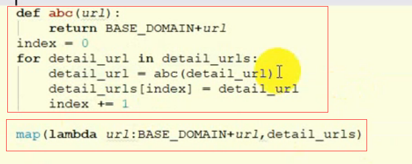

- python中的if语句

  用if..... elif  表示

- 虚拟文件

## url详解:

URL是Uniform Resource Locator的简写，统-资源定位符。一个URL由以下几部分组成: .

``` python
scheme://host:port/path/?query-stringaxxx#anchor
```


- scheme: 代表的是访问的协议，-般为http或者https以及 ftp等。
- host: 主机名，域名，比如www.baidu.com。
- port: 端口号。当你访问-一个网站的时候，浏览器默认使用80端口。
- path: 查找路径。比如: www. jianshu. com/trending/now ，后面的trending/now就是path 。
- query-string: 查询字符串，比如: ww.baidu.com/spwd=python ，后面的wd=python就是查询字符串。
- anchor: 锚点，后台一般不用管,前端用来做页面定位的。
  在浏览器中请求- -个url , 浏览器会对这个url进行- - 个编码。除英文字母，数字和部分符号外，其他的全部使用百分号+十六进制码值进行编码。

## cookie相关参数

```
#指当前时间戳
Hm_lpvt_276e4ec7ba0aa6e4db3b46c40cde6e63: 1586601932 
#指最近访问时间戳,最多允许四个时间戳
Hm_lvt_276e4ec7ba0aa6e4db3b46c40cde6e63: 1586480925,1586522414,1586526094,1586590191
#用来区分服务器的sessionid
jsessionid
#浏览器的一种缓存机制吧
memcached_zz: 
#貌似是SSO中的一种验证机制吧
ticket:
```


## urllib库

>urllib库是python中一个最基本的网络请求库,可以模拟浏览器的行为,向指定的服务器发送一个请求,并保存服务器返回的数据


### urlopen函数

在Python3 的urllib库中，所有和网络请求相关的方法，都被集到urllib.request 模块下面了，以先来看下urlopen 函数基本的使用:

``` python
from urllib import request
resp = request.urlopen("http://baidu.com")
print(resp.read())
```


实际上，快用则览器访问百度，右键查看源代码。你会发现，跟我们刚才打印出来的数据是一 模-样的。也就是说，上面的三行代码就已经帮我们把百度的首页的全部代码爬下来了。- -个基本的ur请求对应的python代码真的非常简单。
以下对urlopen函数的进行详细讲解:

1. url :请求的url。.
2. data :请求的date ，如果设置了这个值，那么将变成post请求。
3. 近回值:返回值是一个htptctient HTRsponste对象，这个对象是一一个类文件句柄对象。有read(size) 。redline 。readlines 以及getcode 等方法。

### urlretrieve函数

这个函数可以方便的将网页上的一个文件保存到本地。以下代码可以非常方便的将百度的首页下载到本地:

``` python
from urllib import request
request.urlretrieve("http://baidu.com", 'index.html')
```


### urlencode函数

用浏览器发送请求的时候，如果url中包含了中文或者其他特殊字符。那么浏览器会自动的始我们进行编码。而如果使用代码发送请求，那么就必须手动的进行编码，这时候就应该使用urlencode函数来实现。urlencode 可以把字典数据转换为URL 编码的數据。
示例代码如下:

``` python
from urllib import parse
data = {'name':'张三','age': 10}
q = parse.urlencode(data)		#q.encode('utf-8')将会把unicode字符编程二进制的unicode,前面加上了b
print(q)	#name=%E5%BC%A0%E4%B8%89&age=10
```

**parse.quote只能用于字符串编码**

### parse_qs函数

可以将经过编码的url参数进行解码,

``` python
from urllib import parse
qs = 'name=%E5%BC%A0%E4%B8%89&age=10'
print(parse.parse_qs(qs)) #{'name': ['张三'], 'age': ['10']}
```

### urlparse和urlsplit

有时候拿到一个url，想要对这个url中的各个组成部分进行分割，那么这时候就可以使用urlparse 或者是urlsplit来进行分割。示例代码加下:

``` python
from urllib import request,parse
url = 'https://www.baidu.com/s?wd=github'
result = parse.urlsplit(url) 
#parse.urlparse(url)
print('schema',result.scheme)	#schema https
print('netloc',result.netloc)	#netloc www.baidu.com
print('path',result.path)	#path /s
print('query',result.query)	#query wd=github
```

### request.Request类

如果想要在请求的时候增加- -些请求头,那么就必须使用request,Request类来实现。比如要增加-个User-Agent , 示例代码如下:

``` python
from urlib import request
headers = {
    'User-Agent': 'Mozilla/5.0 (Windows NT 10.0; Win64; x64) AppleWebKit/537.36 (KHTML, like Gecko) Chrome/80.0.3987.163 Safari/537.36'
}
req = request.Request('http://baidu.com', headers=headers)
resp = request.urlopen(req)
print(resp.read())
```


### ProxyHandler处理器(代理设置)

很多网站会检测某-段时间某 个IP的访问次数(通过流量统计，系统日志等)，如果访问次数多的不像正常人，它会禁止这个IP的访问。
所以我们可以设置一些代理服务器， 每隔- - -段时间换-一个代理,就算IP被禁止,依然可以换个IP继续爬取。
urllib中通过ProxyHandler来设置使用代理服务器，下面代码说明如何使用自定义opener来使用代理:

``` python
from urllib import request
#设置代理,传入字典
handler = request.ProxyHandler({'http':'proxyip})
opener = request.build_opener(handler)  
#这个网址可以测试ip来源                                
req = request.Request("http://httpbin.org/ip")
resp = opener.open(req)
print(resp.read())                                
```

常用的代理有:

- 西刺免费代理IP: http://www.xicidaili.com/
- 快代理: http://ww.kuaidaili.com/
- 代理云: http://www.daliyun.com/


### 什么是cookie:

在网站中, http请求是无状态的。也就是说即使第一次和服 务器连接后并且登录成功后,第二次请求服务器依然不能知道当前请求是哪个用户。cookie 的出现就是为了解决这个问题，第一次登录后服务器返回一些数据(cookie)给浏览器，然后浏览器保存在本地，当该用户发送第二次请求的时候，就会自动的把上次请求存储的cookie 数据自动的携带给服务器,服务器通过浏览器携带的数
据就能判断当前用户是哪个了。cookie 存储的数据量有限，不同的浏览器有不同的存储大小，但-般不超过4KB。因此使用cookie只能存储一些小量的数据。

**cookie的格式**

``` html
Set-Cookie: NAME=VALUE: Expires/Max-age=DATE: Path=PATH: Domain=DOMAIN NAME: SECURE
```

参数意义:

- NAME: cookie的名字。
- VALUE: cookie的值。
- Expires: cookie的过期时间。
- Path: cookie作用的路径。
- Domain: cookie作用的域名 。
- SECURE: 是否只在https协议下起作用。

### 使用cookielib库和HTTPCookieProcessor模拟登录:


Cookie是指网站服务器为了辨别用户身份和进行Session跟踪，而储存在用户浏览器上的文本文件，Cookie可以保持登录信息到用户下次与服务器的会话。
这里以人人网为例。人人网中，要访问某个人的主页,必须先登录才能访问，登录说白了就是要有cookie信息。那么如果我们想要用代码的方式访问，就必须要有正确的cookie信息才能访问。解决方案有两种，第-种是使用浏览器访问，然后将cookie信息复制下来，放到headers中。

``` python
from urllib import request
login_url = 'http://www...'
headers = {
    'User-Agent':'.......'
}
req = request.Request(url = login_url, headers = headers)
resp = request.urlopen(req)
with open('index.html', 'w', encode='utf-8') as fp:
    fp.write(resp.read().decode('utf-8'))
```


但是每次在访问需要cookie的页面都要从浏览器中复制cookie比较麻烦。在Python处理Cookie,一般是通过http.cookiejar 模块和urllib模块的HTTPCookieProcessor处理器类- 起使用。http. cookiejar 模块主要作用是提供用于存储cookie的对象。而HTTPCookieProcessor处理器主要作用是处理这些cookie对象，并构建handler对象。

**http.cookiejar模块**

该模块主要的类有CookieJar、FileCookieJar、 MoillaCookieJar. LWPCookidJaro 这四个类的作用分别如下:
1. CookieJar:管理HTTP cookie值、存储HTTP请求生成的cookie、向传出的HTTP请求添加cookie的对象。整个cookie都存储在内存中，对CookieJar实例进行垃圾回收后cookie也将丢失。
2. FileCookieJar (filename,delayload=None,policy=None):从CookieJar派生而来,用来创建FileCookieJar实例,检索cookie信息并将cookie存储到文件中。flename是存储cookie的文件名。delayload为True时 支持延迟访问访问文件，即只有在需要时才读取文件或在文件中存储数据。
3. MoillaCookieJar (filename,delayload=None,policy=None):从FileCookieJar派生而来 ,创建与Moilla浏览器cookies.txt兼容的FileCookieJar实例。
4. LWPCookieJar (flename, delayload=None,policy=None):从FileCookieJar派生而来，创建与libwww-per标准的 Set-Cookie3文件格式兼容的FileCookieJa实例。
利用http.cookiejar 和request .HTTPCookieProcessor登录人人网。相关示例代码如下:

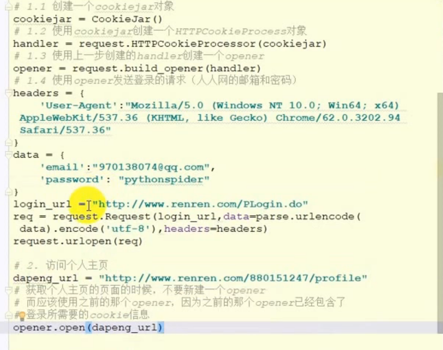

**保存cookie到本地**

可以使用cookiejar的save方法,需要指定文件名 

``` python
from urllib import request
from http.cookiejar import MozillaCookieJar
cookiejar = MozillaCookieJar('cookie.txt')
cookiejar.load(ignore_discard=True)				#过期的cookie也进行存储
handler = request.HTTPCookieProcessor(cookiejar)
opener = request.build_opener(handler)

resp = opener.open('http://httpbin.org/cookies')
for cookie in cookiejar:
    print(cookie)
```


## requests库

> 虽然Python的标准库中urlib模块已经包含了平常我们使用的大多数功能，但是它的API使用起来让人感觉不太好，而Requests宣传是"HTTP for Humans",说明使用更简洁方便。

### 发送GET请求:

1.最简单的发送get请求就是通过requests . get来调用:
response=requests. get("http://www.baidu.com/")

2.添加headers和查询参数:
如果想添加headers,可以传入headers参数来增加请求头中的headers信息。如果要将参数放在url中传递，可以利用params参数。相关示例代码如下: .

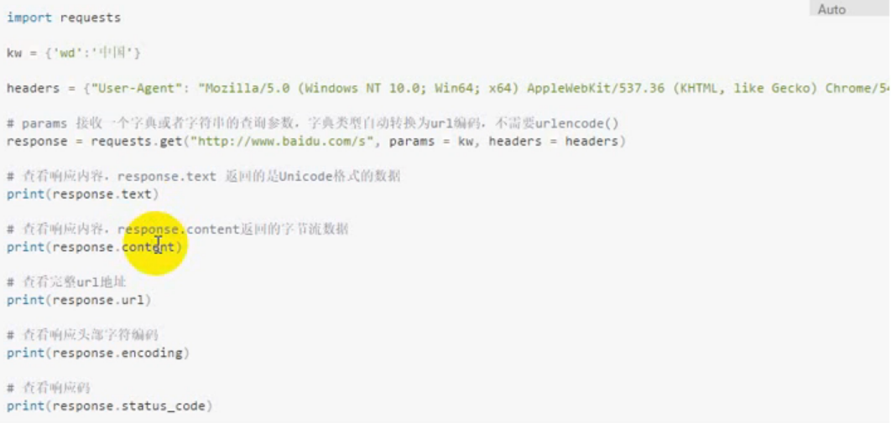

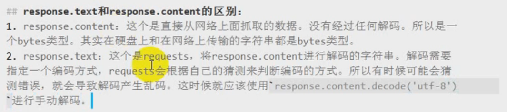

### 发送post方法

跟get类似

`response.json()方法会将一个str转换成一个列表或字典`

### 使用代理

使用requests 添加代理也非常简单，只要在请求的方法中(比如get或者post )传递proxies 参数就可以了。示例代码如下:

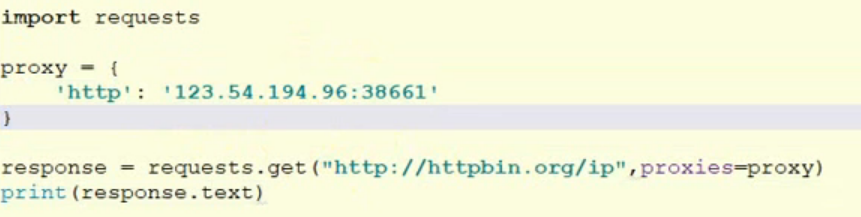

### cookie

如果在一个响应中包含了cookie，那么可以利用cookies 属性拿到这个返回的
cookie值:

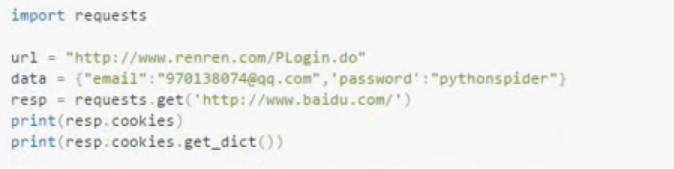

### session

之前使用|urllib库,是可以使用opener 发送多个请求,多个请求之间是可以共享cookie 的。那么如果使用requests ,也要达到共享cookie的目的，那么可以使用requests 库给我们提供的session对象。注意,这里的session不是web开发中的那个session, 这个地方只是-一个会话的对象而已。还是以登录人人网为例，使用requests来实现。示例代码如下:

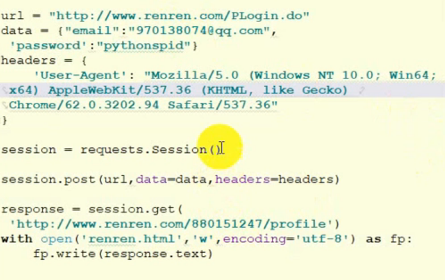

### 处理不信任的SSL证书

对于那些已经被信任的SSL整数的网站,比如http://ww.baidu.com/ ，那么使用requests 直接就可以正常的返回响应。示例代码如下:

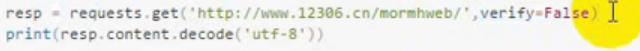													

## XPATH语法和lxml模块

### XPATH语法

#### 1. 选择节点

​	

| 表达式   | 描述                                                       |
| :------- | :--------------------------------------------------------- |
| nodename | 选取此节点的所有子节点。                                   |
| /        | 从根节点选取。                                             |
| //       | 从匹配选择的当前节点选择文档中的节点，而不考虑它们的位置。 |
| .        | 选取当前节点。                                             |
| ..       | 选取当前节点的父节点。                                     |
| @        | 选取属性。                                                 |

在下面的表格中，我们已列出了一些路径表达式以及表达式的结果:

| 路径表达式      | 结果                                                         |
| :-------------- | :----------------------------------------------------------- |
| bookstore       | 选取 bookstore 元素的所有子节点。                            |
| /bookstore      | 选取根元素 bookstore。注释：假如路径起始于正斜杠( / )，则此路径始终代表到某元素的绝对路径！ |
| bookstore/book  | 选取属于 bookstore 的子元素的所有 book 元素。                |
| //book          | 选取所有 book 子元素，而不管它们在文档中的位置。             |
| bookstore//book | 选择属于 bookstore 元素的后代的所有 book 元素，而不管它们位于 bookstore 之下的什么位置。 |
| //@lang         | 选取名为 lang 的所有属性。                                   |

#### 2. 谓语（Predicates）

谓语用来查找某个特定的节点或者包含某个指定的值的节点。

谓语被嵌在方括号中。

在下面的表格中，我们列出了带有谓语的一些路径表达式，以及表达式的结果：

| 路径表达式                          | 结果                                                         |
| :---------------------------------- | :----------------------------------------------------------- |
| /bookstore/book[1]                  | 选取属于 bookstore 子元素的第一个 book 元素。                |
| /bookstore/book[last()]             | 选取属于 bookstore 子元素的最后一个 book 元素。              |
| /bookstore/book[last()-1]           | 选取属于 bookstore 子元素的倒数第二个 book 元素。            |
| /bookstore/book[position()<3]       | 选取最前面的两个属于 bookstore 元素的子元素的 book 元素。    |
| //title[@lang]                      | 选取所有拥有名为 lang 的属性的 title 元素。                  |
| //title[@lang='eng']                | 选取所有 title 元素，且这些元素拥有值为 eng 的 lang 属性。   |
| /bookstore/book[price>35.00]        | 选取 bookstore 元素的所有 book 元素，且其中的 price 元素的值须大于 35.00。 |
| /bookstore/book[price>35.00]//title | 选取 bookstore 元素中的 book 元素的所有 title 元素，且其中的 price 元素的值须大于 35.00。 |

#### 3. 功能函数

> 使用功能函数能够更好的进行模糊搜索

| 表达式      | 描述                        | 用法                                                        | 说明                        |
| ----------- | --------------------------- | ----------------------------------------------------------- | --------------------------- |
| starts-with | 选取id值以ma开头的div节点   | xpath('//div[starts-with(@id, “ma”)]’)                      | 选择id值以ma开头的div节点   |
| contains    | 选择id值包含ma的div节点     | xpath('//div[contains(@id, "ma")]')                         | 选取id值包含ma的div节点     |
| and         | 选取id值包含ma和in的div节点 | xpath('//div[contains(@id, "ma") and contains(@id, "in")]') | 选取id值包含ma和in的div节点 |
| text()      | 选取节点文本包含ma的div节点 | xpath('//div[contains(text(), "ma")]')                      | 选取节点文本包含ma的div节点 |


### lxml库

lxml是一个HTML/XML的解析器，主要的功能是如何解析和提取HTML/XML数据。
lxm和正则-样，也是用C实现的，是一款高性能的Python HTML/XML解析器,我们可以利用之前学习的XPath语法,来快速的定位特定元素以及节点信息。

使用:

**调用etree.HTML来装入一个html文本**,得到一个Element对象,

element对象可以用来执行xpath语法

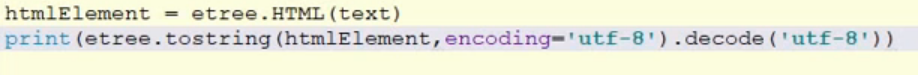

tostring方法会将html代码标签补全

**etree.parse可以用来读取html代码:**

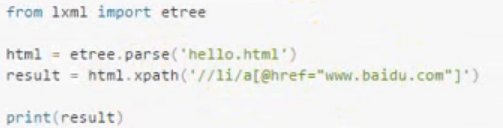

**HTMLParser方法用来专门解析html代码**

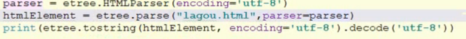

## 正则表达式和re模块

**介绍**:按照一定的规则，从某个字符串中匹配出想要的数据。这个规则就是正则表达式

match只能从开始匹配

search从全部匹配

### 正则表达式规则:

| 表达式    | 作用                                   |
| --------- | -------------------------------------- |
| .         | 匹配任意的字符,不能匹配到换行符        |
| \d        | 匹配任意的数字                         |
| \D        | 匹配任意的非数字                       |
| \s        | 匹配空白字符(包括:\n,\t,\r,空格)       |
| \w        | 匹配a-z和A-Z以及数字.下划线            |
| \W        | 匹配和\w相反的东西                     |
| +         | 匹配一个或多个                         |
| *         | 匹配0个或多个                          |
| ?         | 匹配的字符可以出现一次或0次            |
| {m}       | 匹配m个字符                            |
| {m,n}     | 匹配m到n个                             |
| ^(脱字号) | 中括号中表示取反,     外面表以什么开始 |
| $         | 表示以什么结 尾, 在最后添加$           |
| \|        | 匹配多个字符串或表达式                 |

 **转义字符**

``` python
如果符号有特殊意义,在前面加一个\表示转义
```

**原生字符串**

``` python
python中自带转义字符\
text = '\\n'
print(text)  #\n
text = r'\n'  #raw 生的
print(text) #\n
```


``` python
text = "\\c"  
#在python中等价\n
#正则表达式中:\n
ret = re.match('\\\\c', text)
#ret = re.match(r'\\c', text)
print(ret.group())   #\c
```


 ` 组合方式[]`

​	等价带换

- \d: 	[0-9]
- \D:    ` [^0-9]`
- \w     [0-9a-zA-Z_]
- \W   `  [^0-9a-zA-Z_]`

**贪婪模式**

​	匹配全部

```python
text = '<h1> title</h1>''
ret = re.match('<.+>', text)
print(ret)  #<h1> title</h1>
```

**非贪婪模式**

匹配部分

```python
text = '<h1> title</h1>''
ret = re.match('<.+?>', text)
print(ret)  #<h1>
```


### 正则案例

1.验证手机号码:手机号码的规则是以1开头,第二位可以是34587 ,后面那9位就可以随意了。示例代码如下:

``` python
 	text = 12345678943
    ret = re.match('1[34578]\d{9}',text)
```

2.验证邮箱

``` python
re.match('\w+@[a-z0-9]+\.[a-z]+',text)  #对点进行了转义
```

3.验证URL

``` python
re.match('(http|https|ftp)://[^\s]+', text)
```

4.验证身份证

``` python
regex = '\d{17}[\dxX]'
```

5.匹配0-100的数字

不能出现的.08,  101

```python
regex = '[1-9]\d?$|100$'
```

### re模块中的函数

match:从开始找

search:整个字符串找

**分组group**

在正则表达式中，可以对过滤到的字符串进行分组。分组使用圆括号的方式。
1. group :和group(0)是等价的，返回的是整个满足条件的字符串。
2. groups :返回的是里面的子组。索引从1开始。
3. group(1) :返回的是第一个子组，可以传入多个。

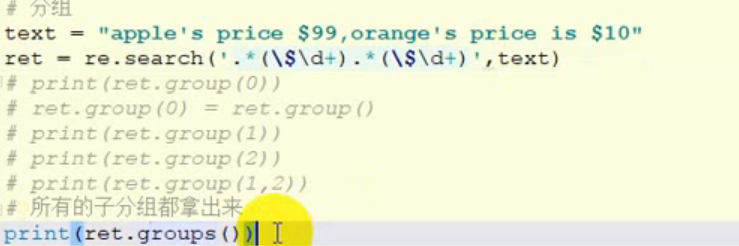

**findall**

找出所有满足条件的,返回的是一个列表

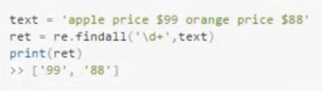

**sub**

用来替换字符串,将匹配到的字符串替换为其他字符串

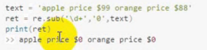

**split**

分隔字符串,返回一个列表

**compile**

对于一些经常要用到的正则表达式，可以使用compile进行编译，后期再使用的时候可以直接拿过来用，执行效率会更快。而且compile 还可以指定flag=re.VERBOSE ,在写正则表达式的时候可以做好注释。示例代码如下:

``` python
text = 'the number is 20.50'
r = re.compile('\d+\.?\d*')
ret = re.search(r, text)
print(ret.group())
```


下面这种方式可以添加注释

``` python
text = 'the number is 20.50'
r = re.compile(r"""
	\d+  	#小数点前面的数字
	\.?		#小数点本身
	\d*		#小数点后面的数字
""",re.VERBOSE)
ret = re.search(r, text)
print(ret.group())
```


## 数据存储

### json文件处理

**JSON支持数据格式:**

1.对象(字典)。使用花括号.
2.列表(数组)。使用方括号。1
3.整形、浮点型、布尔，null
4.字符串类型(`字符串必须要用双引号`，不能用单引号)。
多个数据之间使用逗号分开。
注意: json本质上就是一个字符串。

#### str转jsonStr:

使用dumps函数,会将原来的单引号转为双引号

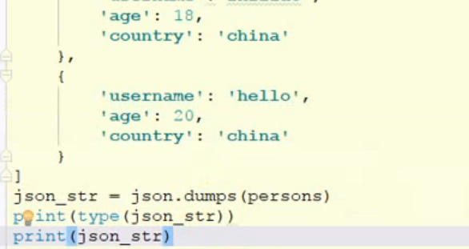

dump**函数**

可以直接将person数据转成json在写入文件

**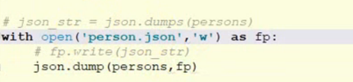**

为了防止json中有中文,存入文件时变成unicode编码,需要指定ensure_ascii=False

因为json 在dump 的时候，只能存放ascii的字符，因此会将中文进行转义，这时候我们可以使用ensure_ ascii=False 关闭这个特性。

在Python中。只有基本数据类型才能转换成ISON格式的字符串。也即: int 、float 、str 、list 、dict 、tuple 。

#### jsonstr转python类型

**load函数**

下面会转成一个python的list

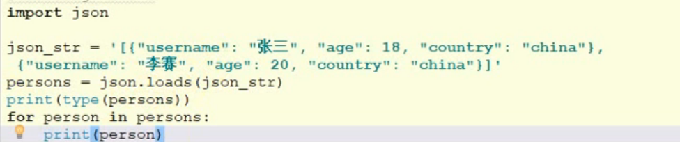

**loads函数**

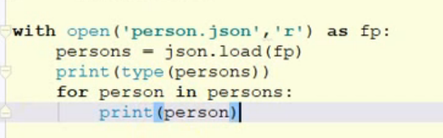