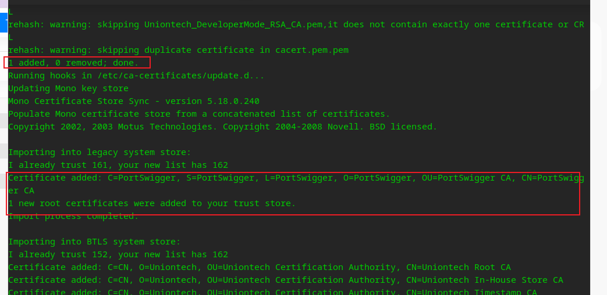
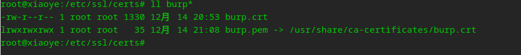
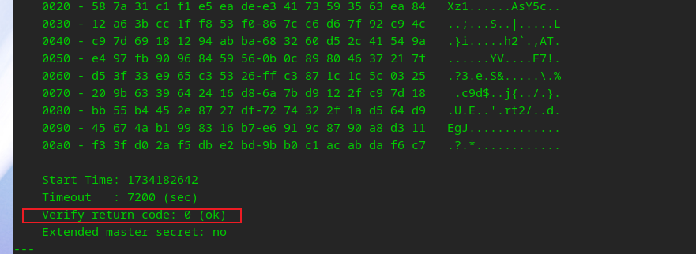
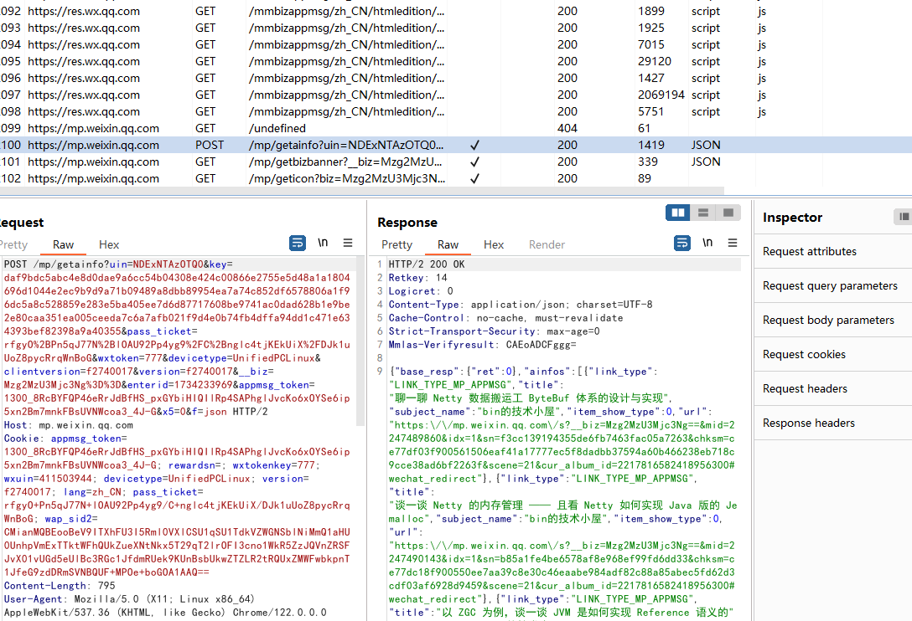
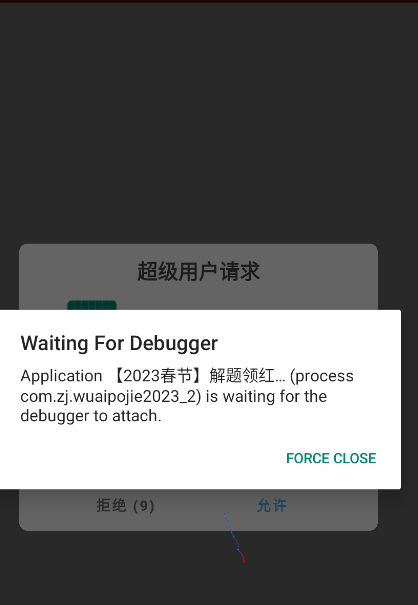
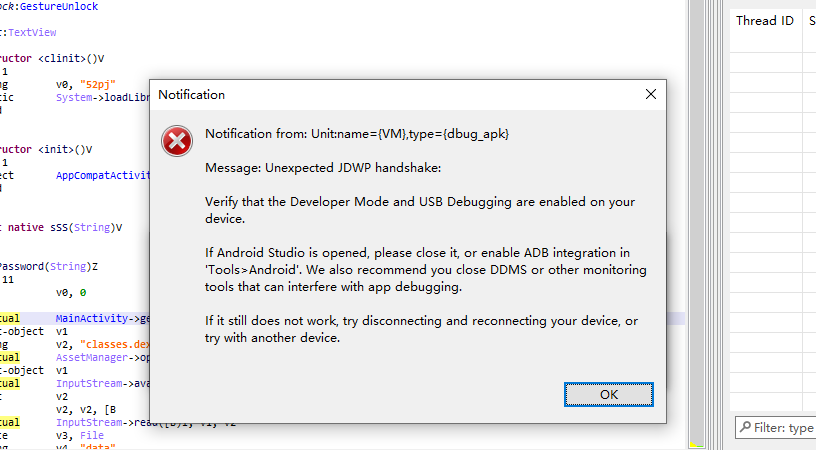
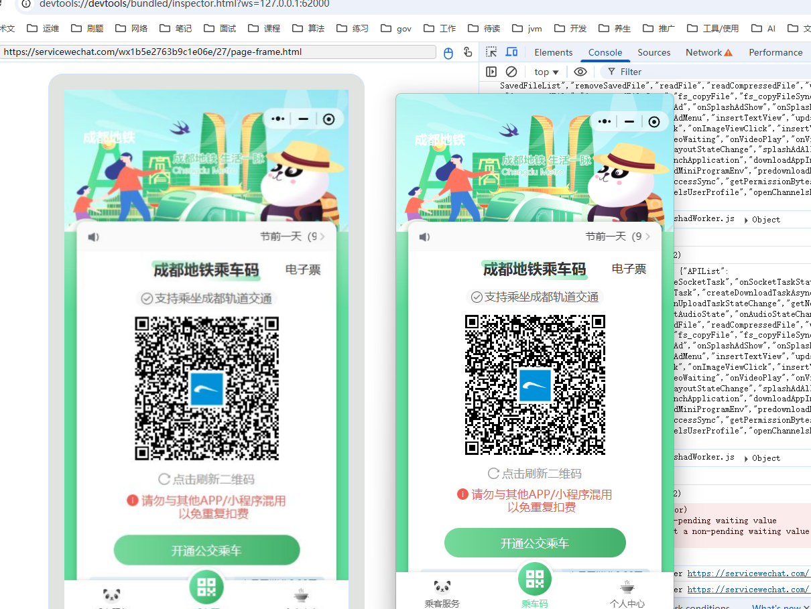
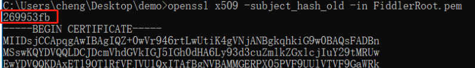

## ADB相关

> http://developer.android.com/tools/help/adb.html

1. 下载adb驱动，复制到 xxxuser/.android目录，添加adb_usb.ini文件，内容：`0x2a45`, 魅族驱动标识符

2. 链接USB，选择安装驱动程序

3. 开发者选项，开启USB调试模式

4. 在.android目录打开cmd，输入adb devices,提示有device相关信息则说明链接成功， 手机会提示秘钥比对信息

5. 输入adb shell, 进入手机终端模式


ADB命令:

```shell
# 网络连接ADB：
# 1. 先使用usb数据线连接
adb tcpip 5555
# 2. 断开usb数据线， 连接手机的ip， 与电脑在同一网络下
adb connect 192.168.31.253


# 关闭连接
adb kill-server 
# 重启
adb start-server
# 选择某一个设备
adb -s xxxxxxx

# 覆盖安装
adb install -r "wechat 8.0.38.apk"
# 降级安装(过期，无法使用)， 只有debug模式允许
adb install -r -d WeChat_v7.0.0_apkpure.com.apk     # 降级安装(过期，无法使用) r：replace , d: Downgrade

# 如果出现：Performing Streamed Install， 加--no-streaming
# shell 进入， 获取当前打开的进程
dumpsys activity top | grep ACTIVITY

# 监控打开的应用
adb shell am monitor
# 查看安装包的位置： 
adb shell pm path com.xxx.xxx
# 导出来
adb pull /data/app/info.cd120-euTuVjyMu9p6l8P3aLZGsg==/base.apk
# push
adb push LSPosed-v1.9.2-7024-zygisk-release.zip /storage/emulated/0/
```


AM 命令:

activity manage

```shell
# 启动一个activity
adb shell am start -n com.android.settings/com.android.settings.Settings(com.android.settings/.Settings)
# 调用start -n 启动activity时，必须有intent-filter（manifest.xml中的红色与蓝色activity）；而startservice则不需要。
# -e 可以自定一些参数, 代码中获取: getIntent().getStringExtra("key")
adb shell am startservice -n com.e.uu/.CoreService -e key value
# 关闭应用
adb shell am force-stop com.lt.test
# -D 以debug 模式启动,等待调试
adb shell am start -D -n com.zj.wuaipojie2024_2/com.zj.wuaipojie2024_2.MainActivity
```


## 抓包

win系统证书管理：抓不成功可以尝试删除证书

——————> certmgr.msc


### Fiddler

> https://blog.csdn.net/unhejing/article/details/119817993

安装系统证书：

export cert

将cer 转为pem文件：
openssl x509 -in .\FiddlerRoot.cer -inform DER -out .\FiddlerRoot.pem -outform PEM


如果是brup:

der 转pem:

openssl x509 -inform DER -in burp.der -out burp.pem

解析pem证书hash值： openssl x509 -subject_hash_old -in FiddlerRoot.pem  


修改pem证书文件名为： [hash].0

将文件移动到  /system/etc/security/cacerts/， 权限644，可能需要重启


adb push 269953fb.0 /system/etc/security/cacerts/

无法挂载， 使用MT 手动复制

adb push 269953fb.0 /storage/emulated/0


#### **安装到linux -统信：**  

统信OS

安装后浏览器依然提示证书问题，貌似浏览器不信任系统的，可以设置导入。

登录微信 查看公众号不提示证书问题。 聊天之类的并非使用http 通信

```shell
# 查看pem 证书内容
openssl x509 -in cacert.pem -noout -text

# 转pem格式, 保存格式为crt，与系统其他证书一致
openssl x509 -inform der -in burp.cer -outform pem -out burp.crt

# 复制到证书目录  local 目录叫用户自定义的根证书目录， 这里直接复制到系统目录
cp cacert.pem /usr/share/ca-certificates/ # 用户：/usr/local/share/ca-certificates
# 添加配置，即在文件中指定证书位置； 直接添加 burp.crt 即可（相对位置应该/usr/share/ca-certificates/）
vim /etc/ca-certificates.conf
# 更新， 会提示1 added， 同时输出添加的证书信息
update-ca-certificates
# 查看/etc/ssl/certs/目录是否存在新加的, 这个目录的证书应该是用于ssl 通信使用的
ll burp*
# 请求测试, 会输出OK。  为啥指定安装后的证书会失败： openssl s_client -connect baidu.com:443 -CAfile /etc/ssl/certs/burp.crt
openssl s_client -connect baidu.com:443
```


update-ca-certificates 执行后的结果：





为啥有两个？




测试结果：




抓包结果： 

公众号文章：




### Burp suite

1. 系统设置代理（让系统走burp的代理端口）
2. burp site 开启抓包
3. 访问localhsot：8080， 下载证书文件
4. 安装证书，安装为授信任的根证书
   


## Frida

》 安装：

```
# 直接安装最新的也没问题
python -m pip install frida==12.8.0 -i https://pypi.tuna.tsinghua.edu.cn/simple/
python -m pip install frida-tools==5.3.0 -i https://pypi.tuna.tsinghua.edu.cn/simple/

```


```shell
# 创建frida-server至 安卓系统上
adb push frida-server-16.2.1-android-arm64 /data/local/tmp  
# 赋予执行权限 并执行
chmod +x frida-server-12.8.0-android-x86_64
./frida-server-12.8.0-android-x86_64 & # 后台

# 端口转发， 用于电脑 跟frida-server 通信
adb forward tcp:27042 tcp:27042 # 默认端口


# 移除监听端口
adb forward --remove tcp:27042 

# 连接异常，重启端口冲突，查看端口进程，进行kill
netstat -tunlp| grep frida
```

### 使用命令

```shell
getprop ro.product.cpu.abi

adb -s 127.0.0.1:5555 shell

frida-ps -U

adb -s 127.0.0.1:5555 forward tcp:27042 tcp:27042

# 进入shell 执行
# 可以转发网络使用fiddler 进行抓包
settings put global http_proxy 192.168.31.15:8888
# 取消代理
settings put global http_proxy :0
```


### frida

```shell
# -U: USB， -R： Remote	-f： spawm（会重启, 老版跟包名。新版跟app名 ）  不加-f attach （新版只能输入名称,不能用包名）
frida -U -l .\capture.js  -f cn.damai
# 加载js 文件 到进程
frida -U/-R -l <script_file> --no-pause -f <process_name/pid>
# 连接设备信息
frida-ls-devices
# 包名， 函数
frida-ps -Ua   
# spawn模式：无法查看输出的日志
frida -U -l wechat.js -f com.tencent.mm
# attach
frida -U -l wechat.js 微信


```


```shell

frida-ps -U
frida-ps -Ua： 列出运行的应用
frida-ps -Uai  List installed applications
frida-ls-devices：查看链接的设备：
frida-kill -D <DEVICE-ID> <PID>： kill 应用
frida-ps -D 1d07b5f6a7a72552aca8ab0e6b706f3f3958f63e  -a 查看所有应用
```


### frida-trace：

> https://www.cnblogs.com/jingshibilei/p/16914951.html


```shell
frida-trace 命令：
  -U/D/p: USB，Device, pid
  -O: 指定命令行文件
  -I/X: include module， exclude module
  -i/x: [Module]![Function]      “msvcrt.dll!cpy”
  -j: include java method       -j 'android.net.wifi.WifiInfo*!*getMacAddress'
  -J: exclude java method
  -a: trace 没有导出的模块，使用入口地址进行trace， eg："libjpeg.so!0x4793c"
  -P: 一个可访问的全局变量：  windows：-P "{""displayPid"": true}"， linux：-P '{"displayPid": true}'， code： if (parameters.displayPid) {...}
  -S： 初始化会话脚本位置， 用于为其他脚本提供一些公共的方法，可复用脚本
        https://frida.re/docs/frida-trace/session-initialization-primer/
  -d：onEnter中打印的内容包含模块名

```

help

```js
 --runtime {qjs,v8}    script runtime to use
  --debug               enable the Node.js compatible script debugger
  --squelch-crash       if enabled, will not dump crash report to console
  -O FILE, --options-file FILE
                        text file containing additional command line options
  --version             show program's version number and exit
  -I MODULE, --include-module MODULE
                        include MODULE
  -X MODULE, --exclude-module MODULE
                        exclude MODULE
  -i FUNCTION, --include FUNCTION
                        include [MODULE!]FUNCTION
  -x FUNCTION, --exclude FUNCTION
                        exclude [MODULE!]FUNCTION
  -a MODULE!OFFSET, --add MODULE!OFFSET
                        add MODULE!OFFSET
  -T INCLUDE_IMPORTS, --include-imports INCLUDE_IMPORTS
                        include program's imports
  -t MODULE, --include-module-imports MODULE
                        include MODULE imports
  -m OBJC_METHOD, --include-objc-method OBJC_METHOD
                        include OBJC_METHOD
  -M OBJC_METHOD, --exclude-objc-method OBJC_METHOD
                        exclude OBJC_METHOD
  -y SWIFT_FUNC, --include-swift-func SWIFT_FUNC
                        include SWIFT_FUNC
  -Y SWIFT_FUNC, --exclude-swift-func SWIFT_FUNC
                        exclude SWIFT_FUNC
  -j JAVA_METHOD, --include-java-method JAVA_METHOD
                        include JAVA_METHOD
  -J JAVA_METHOD, --exclude-java-method JAVA_METHOD
                        exclude JAVA_METHOD
  -s DEBUG_SYMBOL, --include-debug-symbol DEBUG_SYMBOL
                        include DEBUG_SYMBOL
  -q, --quiet           do not format output messages
  -d, --decorate        add module name to generated onEnter log statement
```


使用：

```shell
# 会在当前目录生成handler 文件, 必须有trace的目标
frida-trace -i open -U com.demo.fridahook -j ...
# f:spawn模式, 会重启   F: attach模式
frida-trace -UF 包名 -m "*[* *sign*]"


# spawn模式
frida-trace -U -f com.zj.wuaipojie -j 'com.zj.wuaipojie.util.MD5Utils!*'
# attach模式
frida-trace -U -F com.zj.wuaipojie -j 'com.zj.wuaipojie.util.MD5Utils!*'

```


### RPC

```shell
// 定义RPC
// 格式： 外部接口名：内部函数名
// 注意： 导出名不可以有大写字母或者下划线
// (如果有大写,在python调用是需要再大写前加_)
rpc.exports = {
    orderbuild: builder,
    paramencode: paramencode
};
```


### 基础脚本

```js
Java.use("com.xxx.xxx.xxx");  // 获取类

Java.choose("com.xxx.xxx.xxx", {  // hook 实例的方法
    onMatch: function(instance) {
        instance.func()  // 实例方法主动调用
        instance.b.value = true;  // 动态实例参数修改
        instance._same_b.value = true;  // same_b 既用来做变量、又用来做方法的话，需要前面加下划线。
        var all_methods = f.class.getDeclaredMethods  // 获取类的所有方法名

        for (var i = 0; i < all_methods.length; i++){
            var m_str = all_methods[i].toString();
            var method_name = m_str.substr(m_str.indexOf(f) + f.length + 1).substr(0, substring.indexOf("("));  // 每个方法名称
            f[method_name].implementation = function() {
                return true  // 批量调用 f 类中所有方法。
            }
        }
    }
    onComplete: function(){}
})


Java.enumerateClassLoaders({    // 枚举所有 classloader, 解决 class hook 不到的问题

    onMatch: function(loader){          
        if (loader.findClass("com.xxx.xxx.xxx.xxx")) {
            Java.classFactory.loader = loader // 把当前应用的 classloader 改为 hook 到的 classloader
        }
    }, 
    onComplete: function(){}
})


Java.enumerateLoaderedClasses({
    onMatch: function(name, handler) {
        if(name.indexOf("xxx") >= 0) {   // name 是类名
            var d_class = Java.use(name)  // 动态 hook name
            d_class.xxx.implementation = function() {
                return true  // hook 每个类的 xxx 方法，并且返回 true
            }
        }
    },
    onComplete: function(){}
})

```


### 常用脚本

```javascript
// 所有内容都需要写在这里面 
Java.perform(function () {
 
 	// 获取Application的ClassLoader，防止hook 类找不到。
    var application = Java.use("android.app.Application");
    var classloader;
    application.attach.overload('android.content.Context')
        .implementation = function (context) {
            var result = this.attach(context); // run attach as it is
            classloader = context.getClassLoader(); // get real classloader
            Java.classFactory.loader = classloader;
        	// 如果依然提示class 找不到，可以在这里进行hook逻辑，添加标志位，防止重复调用。
            return result;
        }
});


# 对象转换
# fastJson
const JSONObject = Java.use('com.alibaba.fastjson.JSONObject');
JSONObject.toJSONString();

# 直接加载大佬打包的gson, 貌似attach 无法加载
Java.openClassFile("/data/local/tmp/r0gson.dex").load();
const gson = Java.use('com.r0ysue.gson.Gson');
let gsonObj = gson.$new();
console.log(gsonObj.toJson(xxx));

console.log(gson.$new().toJson(xxx));


 function HashMap2Str(params_hm) {
      var HashMap=Java.use('java.util.HashMap');
      var args_map=Java.cast(params_hm,HashMap);
      return args_map.toString();
  };


# 打印堆栈
function stack_print() {
    console.log(
        Java.use("android.util.Log")
            .getStackTraceString(
                Java.use("java.lang.Throwable").$new()
            )
    );
}
 
function print_stack() {  // 输出当前运行环境的调用栈
    const Exception = Java.use("java.lang.Exception");
    const instance = Exception.$new('print_stack');
    instance.getStackTrace().forEach(item => {
        console.log(item.toString());
    })
    instance.$dispose();
}


// 查找native 方法属于哪个so
const targetMethod = "startUseCase";
    const modules = Process.enumerateModules();
    modules.forEach(module => {
        const exports = Module.enumerateExports(module.name);
        if (exports.length > 0) {
            // console.log(`\n[Exports] ${module.name}:`);
            exports.forEach(exp => {
                if (exp.name.indexOf(targetMethod) != -1)
                console.log(`${module.name}:- ${exp.name} @ ${exp.address}`);
            });
        }
    });
// 或者下面也可以
 var dlsymAddr = Module.findExportByName("libdl.so", "dlsym");
        Interceptor.attach(dlsymAddr, {
            onEnter: function (args) {
                this.args1 = args[1];
            }, onLeave: function (retval) {
                var module = Process.findModuleByAddress(retval);
                if(module == null) return;
                if (this.args1.readCString().indexOf('CppProxy_native_') != -1) {
                    console.log(this.args1.readCString(), module.name, retval, retval.sub(module.base));

                }
            }
        });
```


### SO相关

hook so 文档：
https://blog.ahuangya.com/docs/frida-so-hook

```js
// 获取相关函数地址 
var funcPtr = Module.findExportByName("libwechatxlog.so", funcName);

// 模块基地址
 Process.findModuleByName('libwechatmm.so')
//上面类似， 只打印地址信息
Module.findBaseAddress('libwechatmm.so')
```


### 算法通杀

```js
function stack_print() {
    console.log(
        Java.use("android.util.Log")
            .getStackTraceString(
                Java.use("java.lang.Throwable").$new()
            )
    );
}

// 防止 .ClassNotFoundException:
Java.perform(function(){
    var messageDigest = Java.use("java.security.MessageDigest");
    var ByteString = Java.use("com.android.okhttp.okio.ByteString");
    //tag为标签，data为数据
    function toBase64(tag, data) {
        console.log(tag + " Base64: ", ByteString.of(data).base64());
    }
    function toHex(tag, data) {
        console.log(tag + " Hex: ", ByteString.of(data).hex());
    }
    function toUtf8(tag, data) {
        console.log(tag + " Utf8: ", ByteString.of(data).utf8());
    }
    messageDigest.update.overload('byte').implementation = function (data) {
        console.log("MessageDigest.update('byte') is called!");
        return this.update(data);
    }
    messageDigest.update.overload('java.nio.ByteBuffer').implementation = function (data) {
        console.log("MessageDigest.update('java.nio.ByteBuffer') is called!");
        return this.update(data);
    }

    messageDigest.digest.overload().implementation = function () {
        console.log("MessageDigest.digest() 被调用了！");
       var result = this.digest();
        var algorithm = this.getAlgorithm();
        var tag = algorithm + " 调用digest返回输出的数据：";
        toHex(tag, result);
        toBase64(tag, result);
        console.log("=======================================================");
        return result;
    }
    messageDigest.digest.overload('[B').implementation = function (data) {
        console.log("MessageDigest.digest('[B') 被调用了！");
        var algorithm = this.getAlgorithm();
        var tag = algorithm + " 调用digest得到的数据：";
        toUtf8(tag, data);
        toHex(tag, data);
        toBase64(tag, data);
        var result = this.digest(data);
        var tags = algorithm + " 调用digest返回输出的数据：";
        toHex(tags, result);
        toBase64(tags, result);
        console.log("=======================================================");
        return result;
    }
    messageDigest.digest.overload('[B', 'int', 'int').implementation = function (data, start, length) {
        console.log("MessageDigest.digest('[B', 'int', 'int') 被调用了！");
        var algorithm = this.getAlgorithm();
        var tag = algorithm + " 调用digest得到的数据：";
        toUtf8(tag, data);
        toHex(tag, data);
        toBase64(tag, data);
        var result = this.digest(data, start, length);
        var tags = algorithm + " 调用digest返回输出的数据：";
        toHex(tags, result);
        toBase64(tags, result);
        console.log("=======================================================", start, length);
        return result;
    }

});
```


### SSL抓包

```javascript
// sslkeyfilelog.js
function startTLSKeyLogger(SSL_CTX_new, SSL_CTX_set_keylog_callback) {
    console.log("start----")
    function keyLogger(ssl, line) {
        console.log(new NativePointer(line).readCString());
    }
    const keyLogCallback = new NativeCallback(keyLogger, 'void', ['pointer', 'pointer']);
 
    Interceptor.attach(SSL_CTX_new, {
        onLeave: function(retval) {
            const ssl = new NativePointer(retval);
            const SSL_CTX_set_keylog_callbackFn = new NativeFunction(SSL_CTX_set_keylog_callback, 'void', ['pointer', 'pointer']);
            SSL_CTX_set_keylog_callbackFn(ssl, keyLogCallback);
        }
    });
}
startTLSKeyLogger(
    Module.findExportByName('libssl.so', 'SSL_CTX_new'),
    Module.findExportByName('libssl.so', 'SSL_CTX_set_keylog_callback')
)
```


## Objection

```shell
# 查看activity
android hooking list activities
# 主动调用activity
android intent launch_activity com.facebook.ads.AudienceNetworkActivity

# 进入某个app
objection -g com.zj.wuaipojie2023_1 explore
# 主动hook某个方法的返回结果,  class_method 才会有结果
android hooking watch class_method com.zj.wuaipojie2023_1.C.cipher --dump-return


# 主动调用某个方法
# 1. 搜索需要调用的实例对象, 会得到hashcode相关信息
android heap search instances  com.zj.wuaipojie2023_2.MainActivity
# 2. 输入上面获取的hashcode
# 2.1 对于调用无参方法,
android heap execute $hashcode methodName
# 2.2 对于有参需要通过script来执行
android heap evaluate $hashcode
# 3. 会提示输入javascript内容,如下, native 测试调用失败
let s = Java.use("java.lang.String").$new("hello")
let r = clazz.decrypt(s)
console.log(r)

```


## Magisk

可用于设置排除列表，防止检查root


http://www.romleyuan.com/lec/read?id=486

删除系统 /system/xbin中的su，重启


魅族安装/解bl： https://www.coolapk.com/feed/38216557?shareKey=MjUxODI2OGMzNGRlNjM1ZTQxYWY~&shareUid=2862878&shareFrom=com.coolapk.market_12.5.0

> 使用之前的账号即可


LSposed 激活：

安装hide on listhttps://zhuanlan.zhihu.com/p/600724571


## android命令 IDA

查看ARM版本：

adb shell getprop ro.product.cpu.abi


```shell
adb push android_server64 /data/local/tmp
chmod 777 /data/local/tmp/android_server64
/data/local/tmp/android_server64

adb forward tcp:23946 tcp:23946

# am start -D -n (packageName)/(ActivityName)
adb shell am start -D -n com.wcsuh_scu.hxhapp/com.wcsuh_scu.hxhapp.activitys.home.MainActivity


```


```shell
# 链接模拟器
adb connect 127.0.0.1:62001 
# 端口查找，win，linux 都适用？
netstat -ano|findstr 13628
```


```
java  com.cxy.myndk.Cmd5Utils


adb -s {emulator-name} shell   
adb -s 892QAETB3H5F4 shell

# 链接模拟器
nox_adb.exe  connect  127.0.0.1:62001
adb connect 127.0.0.1:62001
```


## 调试APK

下面两种方法都可:

- 系统变量设置为1: getprop ro.debuggable
  - 可以用magisk hidden
- 设置apk 可被调试, AndroidManifest.xml文件中添加:  android:debuggable="true",  也可通过apktool -d参数指定生成带该参数的apk
  - xappdebug.apk


```shell
# 需要确保apk 文件名无中文,否则会提示res目录找不到
apktool d xx.apk # 反编译apk  
apktool b xx # 回编译apk

```


开启调试: 执行后apk 将提示watting for debugger

```
adb shell am start -D -n com.zj.wuaipojie2024_2/.MainActivity
```



jadx attach 进程即可


使用了jadx 连接后出现, 估计是占用了端口




## 微信调试

### h5调试

#### XWeb内核

1. 手机打开调试模式
2. usb连接电脑
3. 浏览器打开

```
微信打开：http://debugxweb.qq.com/?inspector=true
chrome内核的浏览器输入chrome://inspect/#devices
edge浏览器输入：edge://inspect/#devices
```

4. 打开inspect， 如果出现404，需要使用vpn，或者换edge

​		

5. 常见问题：
   - 如果无法看到相关网页，重启手机
   - 断线，重新开关USB调试模式


#### vConsole 主动执行WEIXIN JS

> 操作方式，手动引入vConsole 的js 文件，使用fidder 拦截，让页面返回自定义的html（引入相关js)


支付：

支付界面


### 小程序调试

https://github.com/evi0s/WMPFDebugger?tab=readme-ov-file

1. 安装程序： 当前： D:\safe-application\wxapp

```shell
git clone https://github.com/evi0s/WMPFDebugger
cd WMPFDebugger
yarn
npx ts-node src/index.ts
```

2. npx执行无错误时，打开小程序

3. 浏览器访问：devtools://devtools/bundled/inspector.html?ws=127.0.0.1:62000

   此时即可开始调试：

   


### 地铁二维码生成器


数据API：https://app.cdmetro.chengdurail.cn/platform/connectivity/wechat-mini/qrcode-seed

node 库： qrcode、wechat-miniprogram/sm-crypto


这里必须是腾讯的sm-crypto， 底层buffer转16进制跟sm-crypto 不同。

```js

function processQrCodeData(qrCodeData) {
    try {
        // 1. 获取当前时间戳 (秒)
        const timestamp = parseInt((new Date()).getTime() / 1000, 10);
        // 2. 创建4字节大端序时间戳Buffer
        const timestampBuffer = Buffer.alloc(4, 0);
        timestampBuffer.writeUInt32BE(timestamp);
        // 3. 拼接: base64解码的seed + 4字节时间戳
        const dataToSign = Buffer.concat([
            Buffer.from(qrCodeData.seed, "base64"),
            timestampBuffer
        ]);
        const privateKeyHex = Buffer.from(qrCodeData.privateKey, "base64").toString("hex")
        const publicKey = getPublicKeyFromPrivateKey(privateKeyHex)

        // 4. 使用SM2算法签名 (这里是关键的加密部分)
        const signature = doSM2Signature(dataToSign, privateKeyHex, {
            hash: true
        });
        // 5. 最终数据: 原数据 + 分隔符(21) + 签名
        return Buffer.concat([
            dataToSign,
            Buffer.alloc(1, 21),
            Buffer.from(signature, "hex")
        ]);
    } catch (error) {
        console.error('数据处理失败:', error);
        return JSON.stringify(qrCodeData); // 降级方案
    }
}

 QRCode.toString([{"data": qrData, 'mode': 'byte'}], {'type': 'svg'}, function(t, n) {
                const svg = svgData(n);
                fs.writeFileSync(`二维码_${i + 1}_.svg`, n);
 }
```


## Auto.js

```shell

console.show(); 展示控制台
log(): 打印日志

UiSelector.clickable([b = true])： 默认是clickable为true的才能点击，如果自定义了部分组件也可能不是true 也能点击
bounds(951, 67, 1080, 196).clickable().click()： 通过bound 为止点击

setText(i, text): 输入第几个文本框
input(i, text)
exits() 判断控件是否存在

children(): 得到一个控件的 子控件集合
child(i): 第几个子控件

bounds： 控件无法点击可通过bounds 获取坐标点击

findByText(str)： 搜索 text 或 desc 包含 str 的控件，并返回它们组合的集合。 会递归搜索
findOne(selector)： 根据选择器 selector 在该控件的子控件、孙控件...中搜索符合该选择器条件的控件，并返回找到的第一个控件；没有则返回null。


阻塞：
findOne(timeout)： 找到一个控件为止
untilFind()
waitFor() 等待控件出现

非阻塞：
findOnce()，  找不到返回null
findOnce(i)
find(): 找出所有集合， 可以通过empty() 判空


```


## Appium

不能使用桌面版的appium, 直接使用appium命令来启动


```
{
  "appium:deviceName": "emulator-5554",
  "appium:platformName": "Android",
  "appium:platformVersion": "8.1.0",
  "appium:appPackage": "com.android.settings",
  "appium:appActivity": ".Settings",
  "appium:automationName": "uiautomator2"
}
```


```
adb shell dumpsys activity | find “mFocusedActivity”
```


```
"C:\Program Files (x86)\Microsoft\Edge\Application"

msedge.exe --remote-debugging-port=9222 --user-data-dir="D:\python\seleniumEdge"


edge://inspect/#devices
```


## 微信密码


https://zhuanlan.zhihu.com/p/123942610

readme

https://stackoverflow.com/questions/55446420/issue-in-installing-pysqlcipher3


使用GPU 暴力破解:

未安装tclsh之前执行了命令，后面没有clean

tclsh：https://degitlab-ext.terma.com/tper/tcltk


### frida 探索

微信8.38https://blog.csdn.net/q2919761440/article/details/132216608

https://blog.csdn.net/Crazy_zh/article/details/127162654

frida 获取密码教程

https://blog.csdn.net/qq_44110340/article/details/122984839


```js
import frida 
import sys   
 
jscode = """
    Java.perform(function(){ 
        var utils = Java.use("com.tencent.wcdb.database.SQLiteDatabase"); // 类的加载路径
         
        utils.openDatabase.overload('java.lang.String', '[B', 'com.tencent.wcdb.database.SQLiteCipherSpec', 'com.tencent.wcdb.database.SQLiteDatabase$CursorFactory', 'int', 'com.tencent.wcdb.DatabaseErrorHandler', 'int').implementation = function(a,b,c,d,e,f,g){  
            console.log("Hook start......");
            var JavaString = Java.use("java.lang.String");
            var database = this.openDatabase(a,b,c,d,e,f,g);
            send(a);
            console.log(JavaString.$new(b));
            send("Hook ending......");
            return database;
        };
         
    });


"""
 
 
def on_message(message,data): #js中执行send函数后要回调的函数
    if message["type"] == "send":
        print("[*] {0}".format(message["payload"]))
    else:
        print(message)
     
process = frida.get_remote_device()
pid = process.spawn(['com.tencent.mm']) #spawn函数：进程启动的瞬间就会调用该函数
session = process.attach(pid)  # 加载进程号
script = session.create_script(jscode) #创建js脚本
script.on('message',on_message) #加载回调函数，也就是js中执行send函数规定要执行的python函数
script.load() #加载脚本
process.resume(pid)  # 重启app
sys.stdin.read()　

```


## HX


- JavaScript调试无法看到相关js代码：
  主要由于js文件太大，可以切换打开其他js文件，然后在切回

- 在浏览器中开启本地覆盖js文件不生效

  使用fiddler AutoResponser

- 使用fidder AutoResponser 返回js文件，报错

  部分加密，混淆的js文件格式化后会报错，保留原样

- 参数分析思路：
  全局搜索api关键参数、api 调用链路、观察是否有参数从storage获取、GPT分析代码


## HX抓包、破解、逆向


本文章用于记录近期研究如何在某app抢号的过程。  文章仅用于学习用途，未用于盈利。


### 抓包

要想使用程序来抢号，首先必须弄清楚该app 中一些 比较重要的api 接口 ，比如搜索某个医生是否有余号， 挂号过程是否有验证码需要输入，是否需要人脸识别，提交挂号记录api。

为了找到相应的api，可以通过抓包，可以直接逆向apk分析代码， 但凡是个正常人也不会首先就逆向apk吧。

要想对安卓APK进行抓包，首先得安装系统根证书（安卓7.0 以后不在信任用户证书），安装系统证书需要开通root权限，怕变砖误玩。


这里使用fiddler 来抓包，安装证书操作如下：

1. fiddler 中导出证书

2. export cert

3. 将cer 转为pem文件： （这里网上的命令有多个版本，有些貌似是错误的）
   openssl x509 -in .\FiddlerRoot.cer -inform DER -out .\FiddlerRoot.pem -outform PEM

4. 解析pem证书hash值： openssl x509 -subject_hash_old -in FiddlerRoot.pem  




5. 修改pem证书文件名为： [hash].0     （即：269954b.0）

6. 将文件移动到  /system/etc/security/cacerts/， 权限644，可能需要重启手机
   adb push 269953fb.0 /sdcard/

   手动复制文件。  

​	

### 逆向

抓包成功后，发现每个api不能重复发送，否则提示：


看到这个提示首先修改请求参数中的时间戳，再次尝试


仔细分析正常api，header 中有个sign，不确定sign怎么来的


用jadx 对APK反编译，得到源代码，大部分混淆过的，看不懂，目录如下：


直接全局搜索sign 字符，找到下面代码：


很明显这里就是为header 添加信息的，这里最重要的就是这个CommonUtil 类了。


继续跟进去：


最终走到这里：


这是一个Java JNI 方法调用


在APK 中的lib 目录中找到CMD5-lib.so 文件，拉入IDA 。

搜索stringFormJNI，找到该方法的汇编代码。


看不懂汇编，反编译为C代码


依然看不太懂， 主要就是上面的key， 以及md5 那一行代码，首先找到key 的定义信息，在.data 段中找到定义：


那个md5 看了也没用，反正都是看不懂的， 直接网上搜索一个md5标准实现来用用就行了。


认真看下上面的代码就知道，该函数就是将 传入的参数 拼接 key 进行md5 加密，转换32位大小字符串返回。


自己写个安卓程序引入CMD5-lib.so 作简单的测试，测试通过就转Java 重写该算法就行了。


后续就是分析下Java 拼接参数的过程


混淆过的代码，大概看一下发现是用的OkHttp 写的， 在找几篇博客学学okHttp怎么用的，后面连蒙带猜的把他搞出来就行了。


文章结束。又学了一堆没用的技术。

