# win逆向

## PE介绍

微软: https://learn.microsoft.com/zh-cn/windows/win32/debug/pe-format

分析: https://onlyf8.com/pe-format

PE图片: github.com/corkami/pics/tree/master/binary/pe101


VA: 虚拟地址,指程序加载到内存的地址

RVA: 相对虚拟地址,指相对ImageBase的地址.  PE文件中的地址都是指的RVA

**VA = RVA + ImageBase**


OPE: optionalHeader.AddressOfEntryPoint

SizeOfImage

sizeOfHeaders


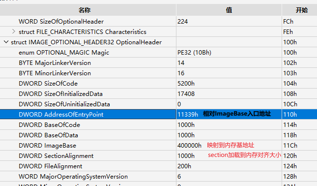

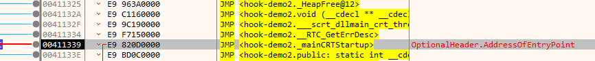


段的内存映射:

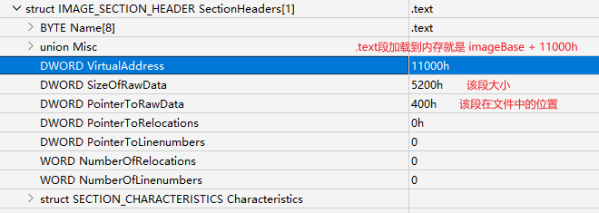

段加载到内存的虚拟地址 = OptionalHeader.ImageBase + SectionHeaders.virtualAddress

Section对齐大小 1000h

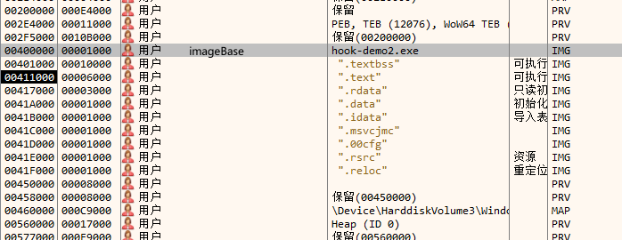


文件加载到内存映射关系:

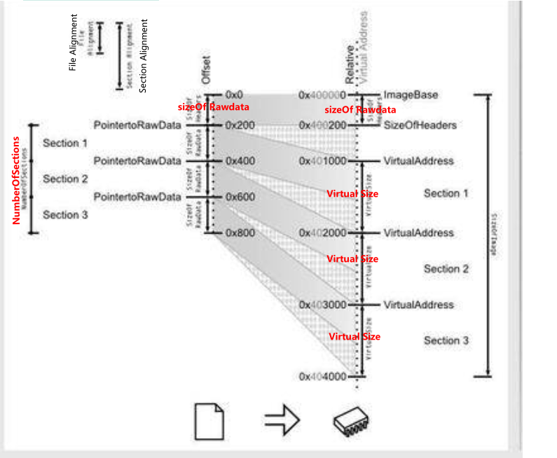


导入表、导出表定位：

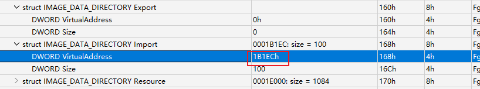

1. 先判断该地址属于哪个段中：

​	 对比SectionHeaders[x].VirtualAddress, 看处于哪个范围内。

2. 定位处于文件中的位置: RVA 指上面的`1BECh`

   File Offset = RVA - SectionHeaders[x].VirtualAddress + SectionHeaders[x].PointerToRawdata

​	 最终得出的位置即模版自动计算出的位置，定位到IMAGE_IMPORT_DESCRIPTOR：
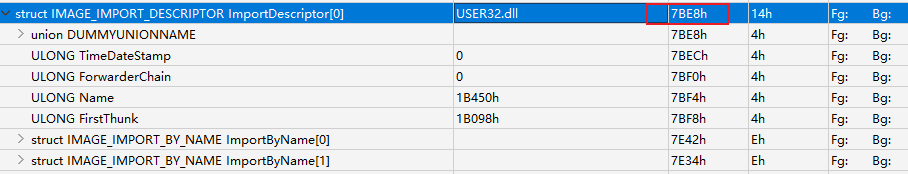


IAT：

数据目录倒数第4个， 开始位置即 .idata段的开始

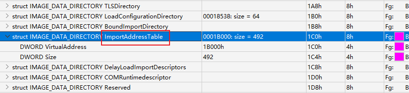


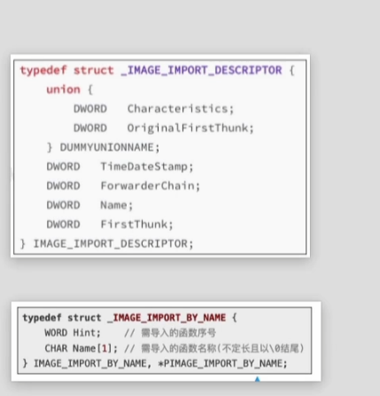


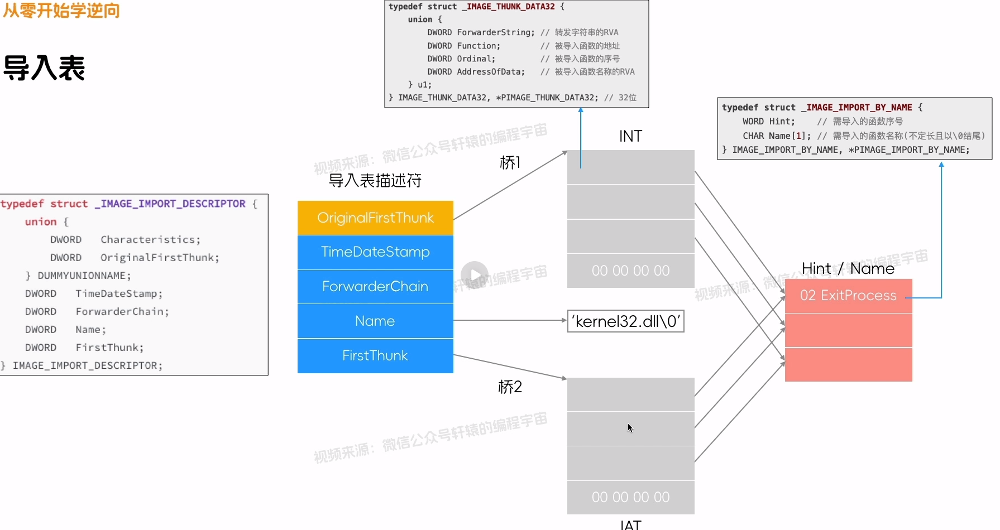


## 寄存器/汇编

esp:  Extended Stack Pointer，指向栈顶指针, 当push后 esp -4,  pop后, esp + 4 (地址信息由高地址向低地址记录, 一个单元4字节)  

ebp: Extended Base Pointer ，栈基值寄存器, 一般用在函数入口处用于保存esp的地址， 用于函数执行结束后恢复原来的esp

函数调用约定:

- _cdecl：

  1. 使用栈空间传递参数
  2. 参数从右向左的方向传递
  3. 调用者负责释放参数空间
  4. 返回值在寄存器中

- _stdcall:

  1. 使用栈空间传递参数
  2. 参数从右向左的方向传递
  3. **被调用者**负责释放参数空间
  4. 返回值在寄存器中

- _fastcall:

  1. 前两个参数使用寄存器传递
  2. 其余参数从右向左的方向传递
  3. **被调用者**负责释放参数空间
  4. 返回值在寄存器中

```java
# 调用函数的时候，通常形式如下：

push xxx； add parma to stack
call fun;
add esp, 4;  recover esp before param
 
label fun:
push ebp;
mov ebp, esp;

...
mov esp,ebp;
pop ebp;
ret;
	


```


```shell
MOVSX  destination, source: 将源操作数的符号扩展并将结果存储到目标操作数中
MOVZX          			  ： 无符号扩充 
SAR des， i： 有符号右移 i 位
SHR： 无符号右移
SETZ BYTE PTR DS:[RCX+0x05]：   Set if Zero  设置ZF的记录到 某个位置
SETE：  Set if Equal    同上
REP stos dword ptr es:[edi]：  复制eax的值到edi， 使用ecx 记录大小，这里是dword即双字。 一般为memset
	stos dst，dst
REP MOVSD：
REP MOVS DWORD PTR ES:[EDI], DWORD PTR [ESI] ； 同义词
	将双字（4 字节）大小的数据块从一个地址复制到另一个地址，并重复执行直到 ECX 寄存器的值变为零。
	MOVS：		ESI 复制到EDI
	movsb: bytes
	movsd: dword

FISTP QWORD PTR DS:[EDX]：  将栈顶的浮点数值弹出，并转换为双精度整数，并将结果存储到地址为 EDX
TEST CL, CL： 自身与运算，将结果， CL为0， 那么ZF 为0,  只影响flag 状态
AND： 与操作， 会将结果存到第一个元素中， 也会影响flag状态

sub a, b:  a = a - b
IMUL EBX, EAX, 0x1C; 相乘， 保存到EBX
BSR ： 扫描1最高位索引

```


寄存器：

```shell
RSP（Register Stack Pointer）： 栈指针寄存器，它始终指向当前栈的顶部
RBP（Register Base Pointer）： 基址指针寄存器 ，在函数的栈帧中用于访问局部变量、参数和返回地址。

AL/BL/CL/DL ： 8 bit
AX/BX/CX/DX： 16 bit
EDX：32 bit

R8： 64位
R8D: 低32
R8W: 低16
R8B: 低8

```


## Win

Win32相关API:

```shell
# 弹出界面框
1.MessageBoxA/W
2.ShellExecuteA/W
3.WinExec
4.CreateProcessA/W
5.CreateThread
# 注册表相关
6.RegCreateKeyExA/W
7.RegOpenKeyExA/W
8.RegDeleteKeyExA/W
# 弹对话框, 右下角框
Dialogxxx

# 访问internet
InternetOpenW
InternetConnectW
HttpOpenRequestW # 发出GET、POST
```

ProcessMonitor 可以查看


## windbg


F1 ： 可以打开帮助文档


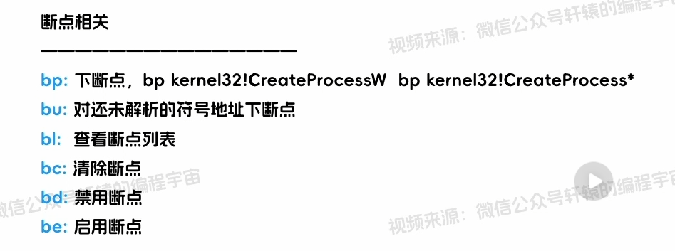


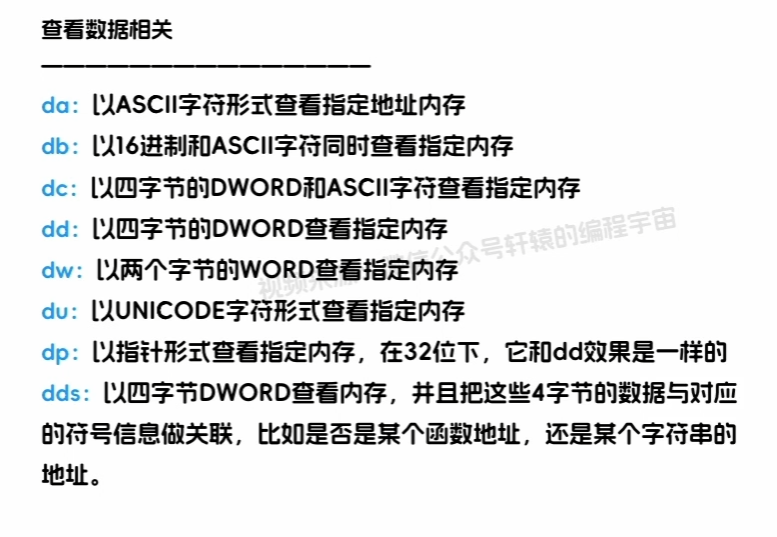

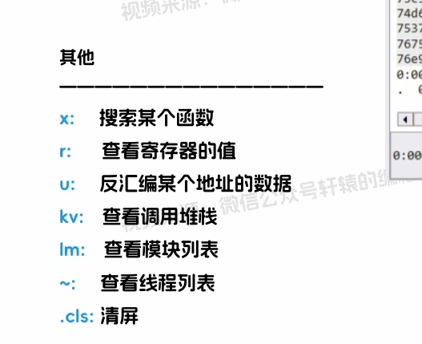


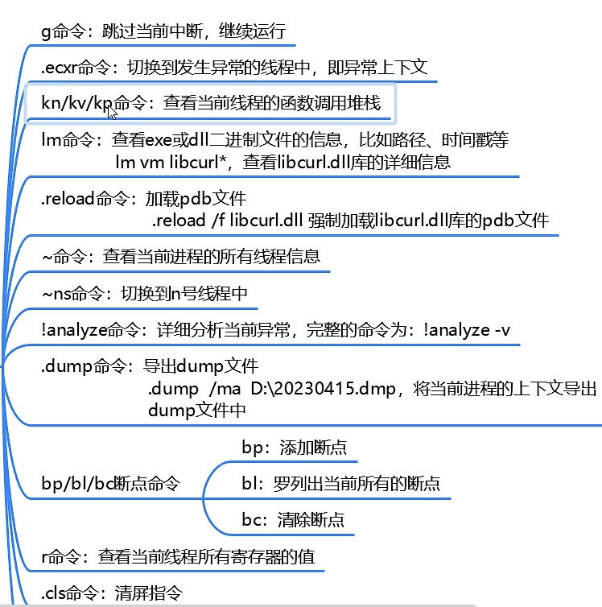


# 脱壳

## 去ASLR

> Address space layout randomization： 地址空间随机化，加载到程序是入口地址随机化
> 在脱壳之前最好先关闭该功能。也可以在修复OEP后再关闭。

可以手动修改可选头中的标记：IMAGE_DLL_CHARACTERISTICS_DYNAMIC_BASE

ImageBase地址是在系统启动时确定的，**系统重启**后这个地址会变化。未重启每次都是一样的


## UPX

属于压缩壳

### ESP定律脱壳

1. OD载入程序后，将在入口处断下，会看到执行PUSHAD，即将所有寄存器的值入栈
   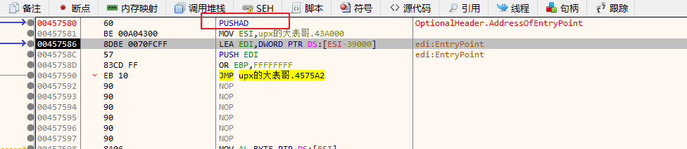


   可能某些程序没有pushad指令，是一些列的push操作，在执行最后一条push后依然可以直接下断点	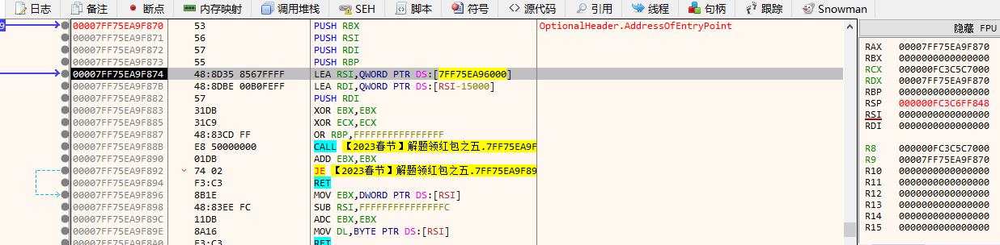

2. 执行后，直接esp（堆栈顶部地址）下断点，硬件访问类型，双字（DWORD，4字节）。

3. F9 继续执行，断下后，第一个JMP即为入口
   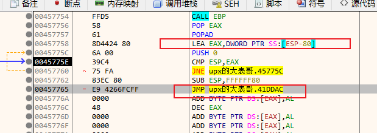

   也可能不是POPAD，是一些列POP：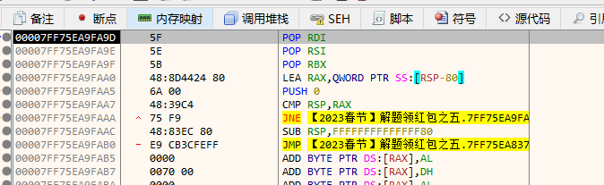

​	

4. 鼠标定位JMP位置，F4执行到该为止，f7进入JMP指令后。修复OEP。图片有问题，**点击S图标**
   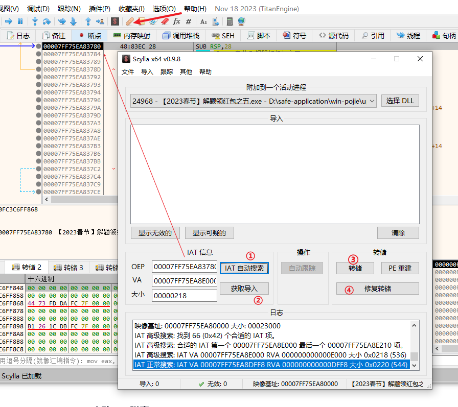

5. 如果之前没有关闭ASLR，这里也可以关闭，否则程序入口地址随机化后无法找到响应的导出表信息。出现闪退


### UPX脱壳方法2

1. 程序载入OD，入口断下后，ctrl+b 搜索：00 00 00 00 00， 在结果中选择第一个进入。 注意这里必须在程序入口处搜索
2. 向上滚动，JMP跳入的地址即为OEP
   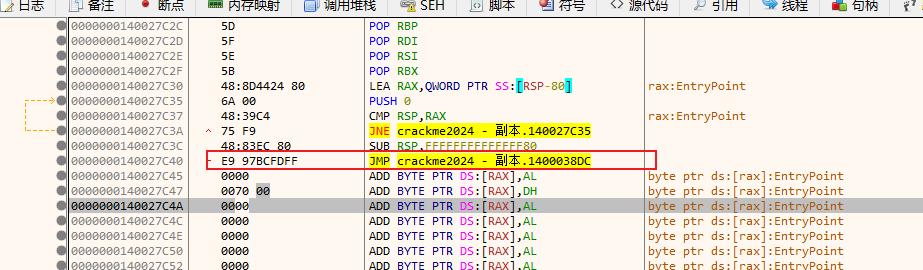


### 脚本定位，修复IAT

> 下面使用的大表哥程序

IAT表查找

```shell
call [dword]
jmp [dword]
# 常见的指令
ff15    call xxx
ff25    间接跳转到某个地址

```


进入OEP后，ctrl +B 搜索FF15： 到达OPE后应该是程序解压完成了。

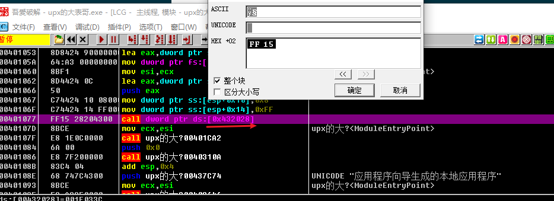

可以看到指令： call dword ptr ds:[0x432028]，  即调用数据段寄存器 0x432028地址指向的地址

回车进入可以看到一堆的内置函数：

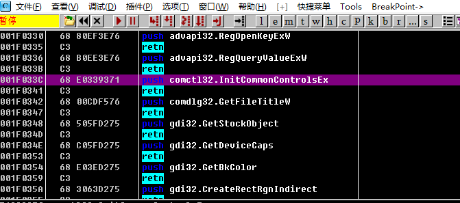

定位内存地址0x432028 也可以看到实际指向的是上图中的push 指令， 相当于IAT存储的地址被中转了一次：

```shell
# 下面代码相当于call comctl32.InitCommonControlsEx
001F033C    68 E0339371     push comctl32.InitCommonControlsEx
001F0341    C3              retn   # 返回到函数调用处(栈顶)
```

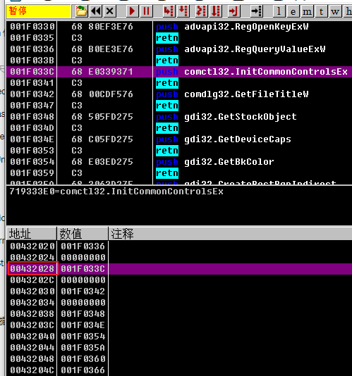

​	

向上滑动内存区域即可看到0比较多的：这里即为IAT的开始位置

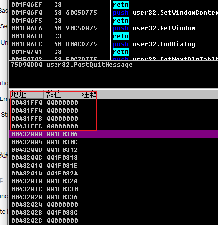

末尾如下：

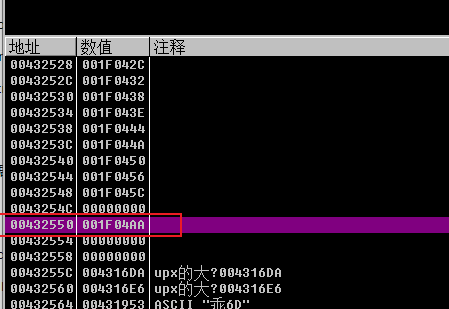


完整脚本如下：

```shell
mov iat_b, 00432000; # iat start addr
mov iat_e, 00432550; # iat end addr

sti ;pushad
bphws esp, "r"; hr esp
run;  f9
sto;
sto;
sto; jnz

bp eip ; 当前下断
@LOOP:
run
cmp esp,eax ; 代码中复制
jnz @LOOP;  不为0， 继续
sto;
sto;
sti;
msg "到达OEP";

@LOOP_IAT:
mov iat, [iat_b];
mov api, [iat+1]; 将目标地址赋值给api， +1指的 加一字节 8位， push address
mov [iat_b], api; 重建IAT

mov iat_b, iat_b + 4;
cmp iat_b, iat_e;
jnz @LOOP_IAT;

ret

```


## MPRESS 

方法类似UPX：也可以直接断点RSP

0. 入口特征：

   可以看到一对的push指令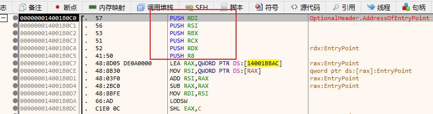

1. 在入口断下后，ctrl + B 直接搜索：00 00 00 00，进入JMP 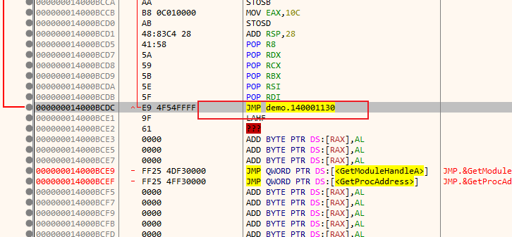

2. 跳入JMP后，一直往下面拉，可以看到一堆POP 跟入口的push 指令相对称，这里JMP 即进入OEP

   这里POP 也可以搜索来定位：41 58 5A 59 5B 5E 5F
   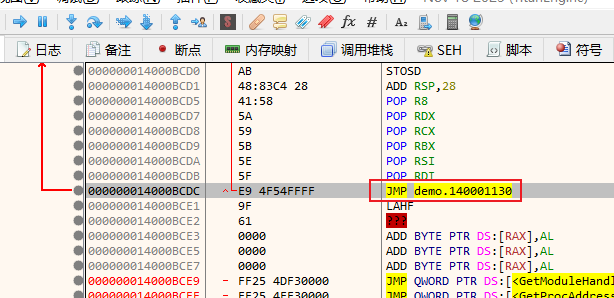


## ASPack

> 也属于压缩壳，可以看到最开始有一个pushad，使用esp定律即可。 
> 可用命令：bphws esp,r,1

参考文件： 2024 高级题

esp断点后，会停在popad下方。 后面可以看到一个push， ret， 即会执行push 的入口， 该入口即为OEP

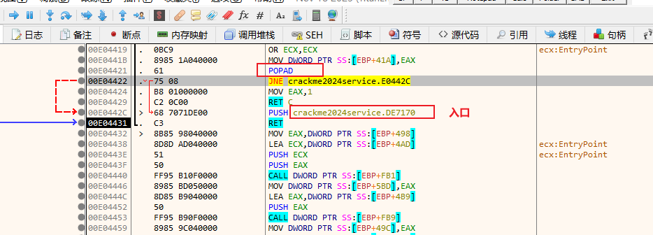


# RSA

## 基本概念：

质数（prime）：除1或本身外不能被其他数整除。

互质：两个数只有一个公因数且为1。（两个非质数也可能互质）

### 加密过程

1. 任选两个不同质数p和q,计算乘积 `N = p*q`
   $$
   r =\varphi(n) =(p - 1) * (q - 1)
   $$
   
2. 选择一个小于r的整数e作为模数（通常`65537`）， 计算e关于r的模逆元d（也叫模反），必须e与r互质，互质才会有模反元素存在
   
   $$
   e \times d \equiv 1\pmod{r}
   $$

3. 得到公私钥，销毁p,q
   公钥：
   $$
   <N, e>
   $$
   私钥：
   $$
   <N,d>
   $$

4. 加密过程：明文为m(m < N), 密文c
   $$
   c = m^e \ mod\ N
   $$

5. 解密过程：
   $$
   m = c^d \ mod\ N
   $$


上面e 也叫公钥指数， d叫私钥指数。


### 签名、验签

签名： 即将明文M计算出一个摘要信息，然后使用`私钥`对摘要信息进行加密
	  计算摘要：
$$
h = hash\ (M) \\
$$
​	  计算密文：
$$
C = h\ ^d \ mod \ N
$$


验签：将密文C使用公钥解密后，验证是否等于摘要
$$
C \ ^ e \ mod\ N \ == \ h  ?
$$


Java Demo

```java
String msg = ...
// 使用SHA1 计算摘要（20字节长度）, RSA 私钥签名
Signature signature = Signature.getInstance("SHA1withRSA");
signature.initSign(privateKey); // 指定初始化密钥
signature.update(msg);
byte[] signatureBytes = signature.sign(); // 计算签名信息，最后会校验私钥加密的结果是否等于公钥解密的结果


// -----------
// 验证签名信息, 也就是将签名信息使用公钥解密后对比， 是否跟私钥加密的结果一样
String signMsg = ...
Signature verifySignature = Signature.getInstance("SHA1withRSA");
verifySignature.initVerify(cert.getPublicKey());
verifySignature.update(signMsg);
boolean verify = verifySignature.verify(signatureBytes);
System.out.println(verify);
```


Java 中相关计算API：

BigInteger：

probablePrime： 生成一个质数

modInverse： 计算模逆元

modPow --> oddModPow: 可计算
$$
M^e \ mod \ N
$$


## 数学理论：

盲化：

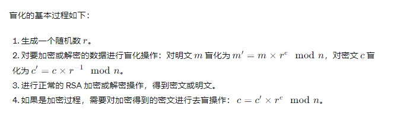

**中国剩余定理：**

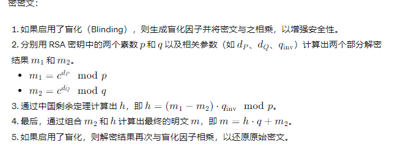


参考：维基百科


## Java核心代码：

### 生成密钥对：

sun.security.rsa.RSAKeyPairGenerator#generateKeyPair.java

```java
public KeyPair generateKeyPair() {
    // accommodate odd key sizes in case anybody wants to use them
    // keySize: 初始化指定的密钥长度
    int lp = (keySize + 1) >> 1;  // 防止为基数：(keyseize + 1) / 2
    int lq = keySize - lp;
    BigInteger e = publicExponent; // 公共指数，通常65537
    while (true) {
        // generate two random primes of size lp/lq
        // 依次生成两个质数， p、q
        BigInteger p = BigInteger.probablePrime(lp, random);
        BigInteger q, n;
        do {
            q = BigInteger.probablePrime(lq, random);
            // convention is for p > q
            if (p.compareTo(q) < 0) {
                BigInteger tmp = p;
                p = q;
                q = tmp;
            }
            // modulus n = p * q
            n = p.multiply(q);
        } while (n.bitLength() < keySize); // n不能小于keySize

        // phi = (p - 1) * (q - 1) must be relative prime to e
        // otherwise RSA just won't work ;-)
        BigInteger p1 = p.subtract(BigInteger.ONE);
        BigInteger q1 = q.subtract(BigInteger.ONE);
        // 即计算r， 必须保证r与e互质
        BigInteger phi = p1.multiply(q1);
        // 计算最大公因数是否为1，即是否互质
        if (e.gcd(phi).equals(BigInteger.ONE) == false) {
            continue;
        }

        // 私钥指数：d * e = x (mod 1)
        BigInteger d = e.modInverse(phi);

        // 1st prime exponent pe = d mod (p - 1)
        BigInteger pe = d.mod(p1);
        // 2nd prime exponent qe = d mod (q - 1)
        BigInteger qe = d.mod(q1);

        // crt coefficient coeff is the inverse of q mod p
        BigInteger coeff = q.modInverse(p);

        try {
            // 公钥对象： 只需要n，e
            PublicKey publicKey = new RSAPublicKeyImpl(rsaId, n, e);
            PrivateKey privateKey = new RSAPrivateCrtKeyImpl(
                rsaId, n, e, d, p, q, pe, qe, coeff);
            return new KeyPair(publicKey, privateKey);
        } catch (InvalidKeyException exc) {
            // invalid key exception only thrown for keys < 512 bit,
            // will not happen here
            throw new RuntimeException(exc);
        }
    }
}
```


### 公钥加密：

com.sun.crypto.provider.RSACipher#doFinal

```java
private byte[] doFinal() throws BadPaddingException, IllegalBlockSizeException {

        byte[] data;
        byte[] verifyBuffer;
        byte[] decryptBuffer;
        switch(this.mode) {
        case 1: // 加密
             // 加密数据填充
            data = this.padding.pad(this.buffer, 0, this.bufOfs);
             // 用公钥参数加密
            decryptBuffer = RSACore.rsa(data, this.publicKey);
            return decryptBuffer;
        case 2:  // 解密
             // 这里直接返回原this.buffer
            decryptBuffer = RSACore.convert(this.buffer, 0, this.bufOfs);
             // 解密
            data = RSACore.rsa(decryptBuffer, this.privateKey, false);
             // 去除填充的数据
            byte[] var4 = this.padding.unpad(data);
            return var4;
        }
   ....
}

// RSACore.class:
public static byte[] rsa(byte[] msg, RSAPublicKey key)
            throws BadPaddingException {
    return crypt(msg, key.getModulus(), key.getPublicExponent());
}
// n： 即开始的两个质数的乘积， exp： 公钥指数
private static byte[] crypt(byte[] msg, BigInteger n, BigInteger exp)
        throws BadPaddingException {
    BigInteger m = parseMsg(msg, n); // 将加密的内容转为BigInteger
    BigInteger c = m.modPow(exp, n); // 加密： c = m^e mod n
    return toByteArray(c, getByteLength(n));    // 转为byte[]
}
```


### 私钥解密：

sun.security.rsa.RSACore#crtCrypt

```java
// verify：true表示签名
public static byte[] rsa(byte[] msg, RSAPrivateKey key, boolean verify)
        throws BadPaddingException {
    if (key instanceof RSAPrivateCrtKey) { // 使用中国剩余定理（Crt）
        return crtCrypt(msg, (RSAPrivateCrtKey)key, verify);
    } else {
        return priCrypt(msg, key.getModulus(), key.getPrivateExponent());
    }
}
// 非中国剩余定理
private static byte[] priCrypt(byte[] msg, BigInteger n, BigInteger exp)
            throws BadPaddingException {

    BigInteger c = parseMsg(msg, n);
    BlindingRandomPair brp = null;
    BigInteger m;
    if (ENABLE_BLINDING) { // 默认开启盲化，提高安全性， 中间换了一些计算方式
        brp = getBlindingRandomPair(null, exp, n);
        c = c.multiply(brp.u).mod(n);
        m = c.modPow(exp, n);
        m = m.multiply(brp.v).mod(n);
    } else {
        m = c.modPow(exp, n); // m = c^e mod n
    }

    return toByteArray(m, getByteLength(n));
}
// 这里使用了中国剩余定理，提升计算效率
// msg: 需要加密的数据
private static byte[] crtCrypt(byte[] msg, RSAPrivateCrtKey key,
        boolean verify) throws BadPaddingException {
    BigInteger n = key.getModulus();   //  模数 N
    BigInteger c0 = parseMsg(msg, n); // 将 msg 转换为BigInteger
    BigInteger c = c0;
    BigInteger p = key.getPrimeP();
    BigInteger q = key.getPrimeQ();
    BigInteger dP = key.getPrimeExponentP();
    BigInteger dQ = key.getPrimeExponentQ();
    BigInteger qInv = key.getCrtCoefficient();
    BigInteger e = key.getPublicExponent();
    BigInteger d = key.getPrivateExponent();

    BlindingRandomPair brp;
    if (ENABLE_BLINDING) {
        brp = getBlindingRandomPair(e, d, n);
        c = c.multiply(brp.u).mod(n);
    }

    // m1 = c ^ dP mod p
    BigInteger m1 = c.modPow(dP, p);
    // m2 = c ^ dQ mod q
    BigInteger m2 = c.modPow(dQ, q);

    // h = (m1 - m2) * qInv mod p
    BigInteger mtmp = m1.subtract(m2);
    if (mtmp.signum() < 0) {
        mtmp = mtmp.add(p);
    }
    BigInteger h = mtmp.multiply(qInv).mod(p);

    // m = m2 + q * h
    BigInteger m = h.multiply(q).add(m2);

    if (ENABLE_BLINDING) {
        m = m.multiply(brp.v).mod(n);
    }
    if (verify && !c0.equals(m.modPow(e, n))) {  // 校验私钥加密的结果 跟 公钥解密的结果是否一致
        throw new BadPaddingException("RSA private key operation failed");
    }

    return toByteArray(m, getByteLength(n));
}
```


参考：

RSA: https://www.xuzhengtong.com/2022/07/25/secure/RSA/

https://zh.wikipedia.org/wiki/RSA%E5%8A%A0%E5%AF%86%E6%BC%94%E7%AE%97%E6%B3%95


# Jetbrains破解、CA格式

打开bat启动文件，可以在控制台看到启动过程中输出的日志信息


### 方法1：

对验证证书的方法进行hook

sun.security.rsa.RSASignature#engineVerify：

```java
byte[] digest = getDigestValue();  // 计算证书的 摘要信息， sha-256 计算的
byte[] decrypted = RSACore.rsa(sigBytes, publicKey); // 使用公钥解密， 会调用oddModPow
byte[] unpadded = padding.unpad(decrypted);
byte[] decodedDigest = decodeSignature(digestOID, unpadded);
return MessageDigest.isEqual(digest, decodedDigest);
```

hook BigInteger#oddModPow方法： 这里直接hook RSASignature#engineVerify 方法，无法激活，通过观察调用栈可以看到idea 部分调用并不走这个方法。

将返回的decrypted 构造为与digest等价的值即可。


unpad： 去除填充的数据

```java
sun.security.rsa.RSAPadding#unpadV15:  去除填充(填充0xFF)，返回数据部分

0 1      2   3    4    5        p    p+1 ....
0 type  0xFF 0xFF 0xFF 0xFF.... 0x00 0x48 ...

从type 后开始查找直到位0的位置p, 
padding: [0, p], data: [p+1, n]

```


decodeSignature： 解析真实数据

```java
-------① 解析data数据为DerInputStream

data: 48, 49, 48, 13， .....

DerInputStream：即封装data
tag: data[0]
length: data[1] ~ data[n]
other:

getLength: 
if data[1] & 1000 0000 == 0:  表示只用一个字节表示长度，  
    return data[1]
else: data[1] & 0111 1111: 计算用多少个字节表示数据长度
      ...
    
-------② 将DerInputStream解析为2个DerValue
getSequence: 
 --> readVector(2)

将data拆分为两个 DerValue： (tag, length, data)
tag: 即编码类型 ASN.1

DerValue[0] 会解析为AlgorithmId， 会校验格式是否正确，跟CA中的摘要算法是否一致
AlgorithmId： 即校验ObjectIdentifier是否相同
DerValue[0]: [6, 9, 96, -122, 72, 1, 101, 3, 4, 2, 1, 5, 0]
                 |     algid                        |  5表示 NULL params
other
DerValue[1]: [83, 58, 96, -111, 118, 126, 15, -33, 46, 115, 10, -28, -26, -6, 121, -14, 10, 2, 41, 112, 95, 24, 37, -28, -78, -6, 55, 104, 88, 78, -75, -120]

return DerValue[1]的数组 作为decodedDigest


```


构造decrypted：

1. 先计算出CA证书的摘要： digest = hash (CA)
2. 构造填充：参考RSAPadding#padV15
3. 构造AlgorithmId对象，即复制上面的DerValue[0] 即可
4. 构造DerInputStream： 即包含了DerValue[0], DerValue[1]
5. 最终结果：padding +  DerValue[1] + digest

```java
padding      + DerInputStream
               tag    |<---len    ---->|
00 01 FF FF .. 48 len DerValue[0] digest
    
数组总长度为： 
    int n = b.bitLength();
  return (n + 7) >> 3;
```


### 方法2：

官方检查license文件：

[CheckLicense.java]: https://github.com/JetBrains/marketplace-makemecoffee-plugin/blob/master/src/main/java/com/company/license/CheckLicense.java


createCertificate方法中会构建一个证书链，用来校验license中证书是否正确。 在这里可以直接hook PKIXBuilderParameters的构造方法，将trustAchors 替换为自己生成的证书， 自己的证书校验自己自然就可以通过了。

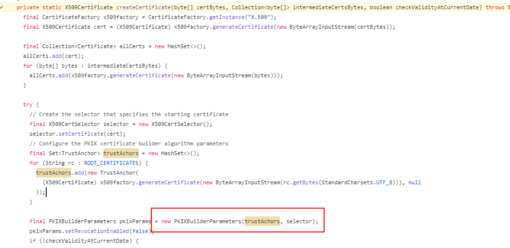


## xjar破解


```
https://hksanduo.github.io/2021/07/16/2021-07-16-Xjar-Crack/
```


# CA

## CA证书基本介绍：

**相关格式：**

1.**X.509证书**：

- ◆X.509是最常见的数字证书标准，它定义了公钥证书的格式和相关的验证流程。X.509证书**通常使用DER编码或PEM编码**。

2.**DER (Distinguished Encoding Rules)**：

- ◆DER是**一种二进制编码规则**，通常用于表示X.509证书的二进制形式。

3.**PEM (Privacy Enhanced Mail)**：

- ◆PEM是一种基于文本的编码格式，通常用于在文本协议中传输X.509证书。**PEM格式可以包含DER编码或Base64编码的数据**。

 


**格式转换：**
der 转pem： 即将der 格式的二进制文件进行base64编码， 同时在文本前加上 -----BEGIN... 

​	openssl x509 -inform der -in cacert.der -out cacert.pem

pem转der:

​	openssl x509 -outform der -in demo.pem -out demo.cer


## CA 证书校验过程

CA证书主要由两部分注册：证书信息、签名。

- 证书信息：version、serial Num、issuer、subject、public key info、extends...
- 签名：对证书信息计算摘要后，用私钥加密得出。


校验过程如下：数字证书即为CA证书文件

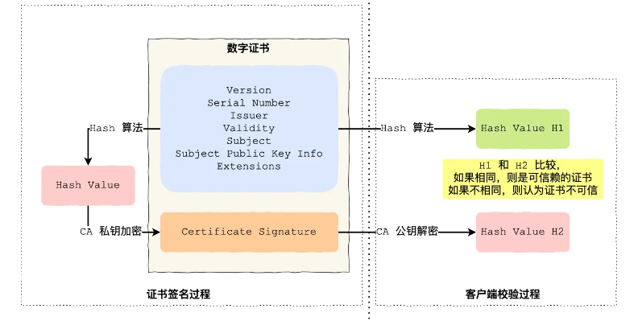

需要注意的是图中的私钥加密、公钥解密过程中使用的私钥、公钥通常是**根证书**的私钥、公钥。

对于**自签证书**，公钥私钥即为当前证书自己的。（自签证书：issuer 等于 subject， 同时能够使用证书本身的公钥进行解密校验）


在windows 打开证书文件，会有一个**指纹**的字段， 该字段并不存在证书文件中，仅仅是用来确定证书的唯一性计算得出，

对证书信息进行**sha-1** 计算得出， chrome 中的指纹是sha-256计算的。

可以使用下面命令计算指纹

openssl x509 -fingerprint -sha1 -in client.crt


**证书信任链：**

在浏览器访问网站时，会先校验根证书，然后才是校验中间证书，最后检验服务器证书

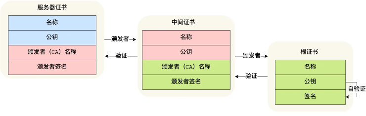


参考：

小林coding：https://www.xiaolincoding.com/network/2_http/https_rsa.html#%E5%AE%A2%E6%88%B7%E7%AB%AF%E9%AA%8C%E8%AF%81%E8%AF%81%E4%B9%A6

安卓中的证书介绍: https://mp.weixin.qq.com/s/b_tSJhC9SnjvHs2hQo4UYg


## Java流程分析

sun.security.provider.certpath.ForwardBuilder#verifyCert

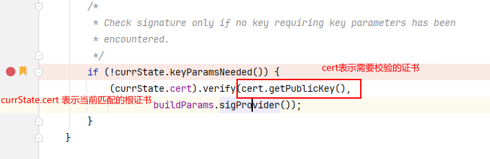

sun.security.x509.X509CertImpl#verify(java.security.PublicKey, java.lang.String)

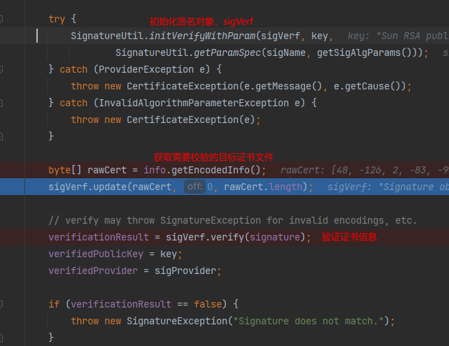


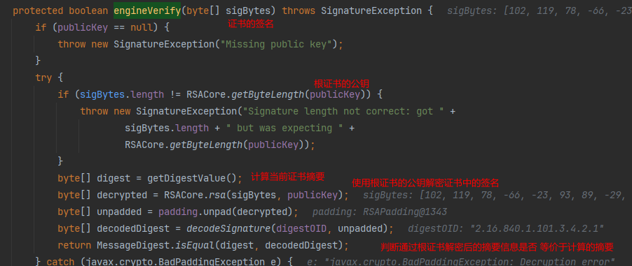


## Java CA校验分析

```java
package com.pretext.ca;

import org.bouncycastle.jce.provider.BouncyCastleProvider;
import org.bouncycastle.openssl.PEMKeyPair;
import org.bouncycastle.openssl.PEMParser;
import org.bouncycastle.openssl.jcajce.JcaPEMKeyConverter;
import sun.security.rsa.RSACore;
import sun.security.rsa.RSAPadding;
import sun.security.rsa.RSASignature;
import sun.security.x509.X509CertImpl;

import javax.crypto.BadPaddingException;
import java.io.FileInputStream;
import java.io.FileReader;
import java.io.IOException;
import java.math.BigInteger;
import java.security.*;
import java.security.cert.CertificateException;
import java.security.cert.CertificateFactory;
import java.security.cert.X509Certificate;
import java.security.interfaces.RSAKey;
import java.security.interfaces.RSAPrivateKey;
import java.security.interfaces.RSAPublicKey;

import static sun.security.x509.AlgorithmId.SHA256_oid;

public class ValidateCA {

    private static String certificateFile = "ca.crt";
    private static String privateKeyFile = "ca.key";

    public static void main(String[] args) throws Exception {

        CertificateFactory certificateFactory = CertificateFactory.getInstance("X.509");
        // 解析CA公钥证书
        X509Certificate cert = (X509Certificate) certificateFactory.generateCertificate(new FileInputStream(certificateFile));
        PrivateKey privateKey = getPrivateKey();
        // win 打开的证书文件的指纹信息就是通过 SHA-1 计算得出
        String fingerprint = X509CertImpl.getFingerprint("SHA-1", cert);
        System.out.println(fingerprint);

        // 获取生成签名长度
        // modulus.length  + 7 >> 3;
        int byteLength = RSACore.getByteLength((RSAKey) privateKey);
        // 获取DER编码的证书信息
        byte[] tbsCertificate = cert.getTBSCertificate();
        // sun.security.rsa.RSASignature.engineSign

        // CA 证书签名生成：
        // 方法一：直接使用SHA256withRSA
        byte[] signature = generateSignature(privateKey, tbsCertificate, cert);
        // 方法二： 先使用sha-256 取摘要，编码，填充，Rsa加密
        byte[] rsa = generateSignatureForDetail(tbsCertificate, byteLength, (RSAPrivateKey) privateKey);

        if (new BigInteger(cert.getSignature()).equals(new BigInteger(signature))) {
            System.out.println("私钥签名CA证书 等于 CA Signature");
        }
        if (new BigInteger(rsa).equals(new BigInteger(signature))) {
            System.out.println("法一，法二计算的结果相等");
        }
        // 校验CA 证书是否合法
        validateCA(tbsCertificate, byteLength, cert);

        System.out.println();
    }

    private static byte[] generateSignatureForDetail(byte[] tbsCertificate, int byteLength, RSAPrivateKey privateKey) throws NoSuchAlgorithmException, InvalidKeyException, InvalidAlgorithmParameterException, IOException, BadPaddingException {
        // 1. 计算摘要
        MessageDigest digest = MessageDigest.getInstance("SHA-256");
        digest.update(tbsCertificate);
        byte[] digest1 = digest.digest();
        // 2. 摘要编码
        byte[] bytes = RSASignature.encodeSignature(SHA256_oid, digest1);
        // 3. 填充数据
        RSAPadding padding = RSAPadding.getInstance
                (RSAPadding.PAD_BLOCKTYPE_1, byteLength, null);
        byte[] pad = padding.pad(bytes);
        // 4. RSA 加密
        byte[] rsa = RSACore.rsa(pad, privateKey);
        return rsa;
    }

    /**
     * 参考： sun.security.rsa.RSASignature#engineVerify(byte[])
     * @param tbsCertificate
     * @param byteLength
     * @param cert
     * @throws NoSuchAlgorithmException
     * @throws InvalidKeyException
     * @throws InvalidAlgorithmParameterException
     * @throws IOException
     * @throws BadPaddingException
     */
    private static void validateCA(byte[] tbsCertificate, int byteLength, X509Certificate cert) throws NoSuchAlgorithmException, InvalidKeyException, InvalidAlgorithmParameterException, IOException, BadPaddingException {
        // 先计算摘要
        MessageDigest digest = MessageDigest.getInstance("SHA-256");
        digest.update(tbsCertificate);
        byte[] digested = digest.digest();

        // 公钥解密
        byte[] decrypted = RSACore.rsa(cert.getSignature(), (RSAPublicKey) cert.getPublicKey());
        // 去除填充
        RSAPadding padding = RSAPadding.getInstance
                (RSAPadding.PAD_BLOCKTYPE_1, byteLength, null);
        byte[] unpad = padding.unpad(decrypted);
        byte[] bytes1 = RSASignature.decodeSignature(SHA256_oid, unpad);

        if (new BigInteger(digested).equals(new BigInteger(bytes1))) {
            System.out.println("校验通过：私钥签名CA证书 等于 CA Signature");
        }
    }

    private static byte[] generateSignature(PrivateKey privateKey, byte[] tbsCertificate, X509Certificate cert) throws NoSuchAlgorithmException, InvalidKeyException, SignatureException {
        Signature signature = Signature.getInstance("SHA256withRSA");
        signature.initSign(privateKey);
        signature.update(tbsCertificate);
        return signature.sign();
    }

    static PrivateKey getPrivateKey() throws Exception {
        Security.addProvider(new BouncyCastleProvider());
        PEMParser pemParser = new PEMParser(new FileReader(privateKeyFile));
        JcaPEMKeyConverter converter = new JcaPEMKeyConverter().setProvider("BC");
        Object object = pemParser.readObject();
        KeyPair kp = converter.getKeyPair((PEMKeyPair) object);
        return kp.getPrivate();
    }
}
```


# SpringBoot 项目开启TLS


1. **生成服务器私钥**：
   首先，生成一个服务器私钥。

   ```bash
   openssl genpkey -algorithm RSA -out server.key -pkeyopt rsa_keygen_bits:2048
   ```

2. **创建SAN配置文件**：
       创建一个SAN配置文件（例如`san.cnf`），确保包含`localhost`。

      ``` ini
      [req]
      distinguished_name = req_distinguished_name
      req_extensions = v3_req
      prompt = no
      [req_distinguished_name]
      C = CN
      ST = YourState
      L = YourCity
      O = YourOrganization
      OU = YourOrganizationalUnit
      CN = localhost
      [v3_req]
      basicConstraints = CA:FALSE
      keyUsage = nonRepudiation, digitalSignature, keyEncipherment
      subjectAltName = @alt_names
      [alt_names]
      DNS.1 = localhost
      	````


      请将`YourState`、`YourCity`、`YourOrganization`和`YourOrganizationalUnit`替换为适当的值。

3. **生成证书请求**：
   使用SAN配置文件生成证书请求。

   ```shell
   openssl req -new -key server.key -out server.csr -config san.cnf
   ```
4. **生成自签名证书**：
   使用您的私钥和证书请求生成一个自签名的证书。
   
   ```bash
   openssl x509 -req -days 365 -in server.csr -signkey server.key -out server.crt -extensions v3_req -extfile san.cnf
   ```
5. **配置您的Web服务器**：
   将生成的`server.crt`和`server.key`文件配置到您的Web服务器中。
6. **将证书添加到受信任的证书列表**：
   由于这是一个自签名证书，您的浏览器不会自动信任它。您需要将`server.crt`导入到您的浏览器的受信任证书列表中。或直接导入windows 根证书目录
7. SpringBoot项目配置证书位置：注意这里的证书文件路径。

   ```yaml
   server:
     port: 443
     servlet:
       context-path: /
     ssl:
       certificate: classpath:server.crt
       certificate-private-key: classpath:server.key
   ```

8. **重启浏览器**：
   在导入证书后，重启您的浏览器以确保证书设置生效。


# wireshark HTTPS抓包


wireshark 抓包使用private key 只适应几种简单的加密过程。推荐使用sslkeylog方式， ssl keylog在linux中也可以使用

> sslkeylog 变量由浏览器支持，因此只能浏览器抓包：

必须**完全关闭**浏览器，否则无法生效。

```bat
@echo off
set SSLKEYLOGFILE=%USERPROFILE%\Desktop\keylogfile.txt
start msedge https://localhost/index
```


小林TLS 介绍：https://www.xiaolincoding.com/network/2_http/https_rsa.html#rsa

JDK TLS相关API： https://docs.oracle.com/javase/8/docs/technotes/guides/security/jsse/JSSERefGuide.html#SSLEngine

Wireshark抓包: https://gitlab.com/wireshark/wireshark/-/wikis/TLS


