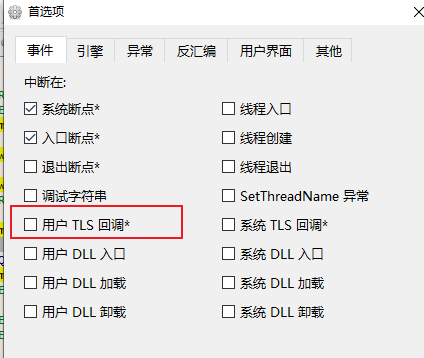
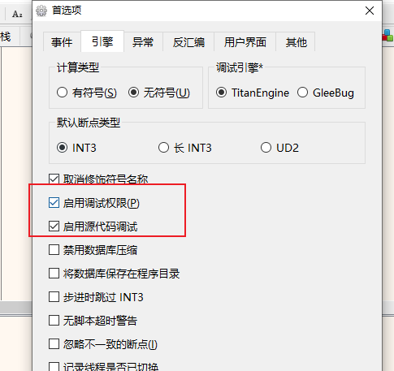
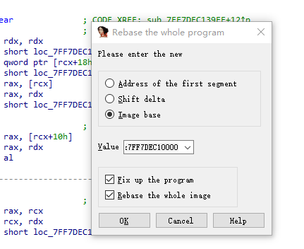
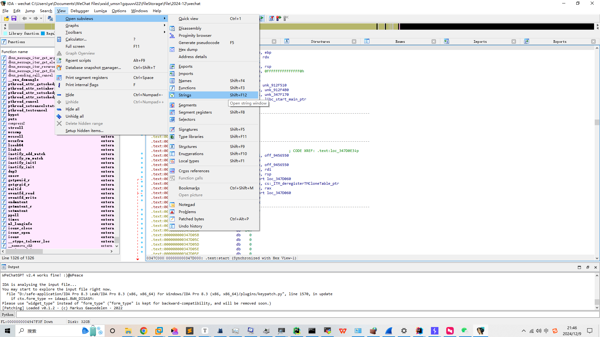
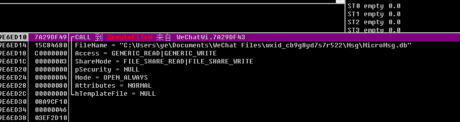
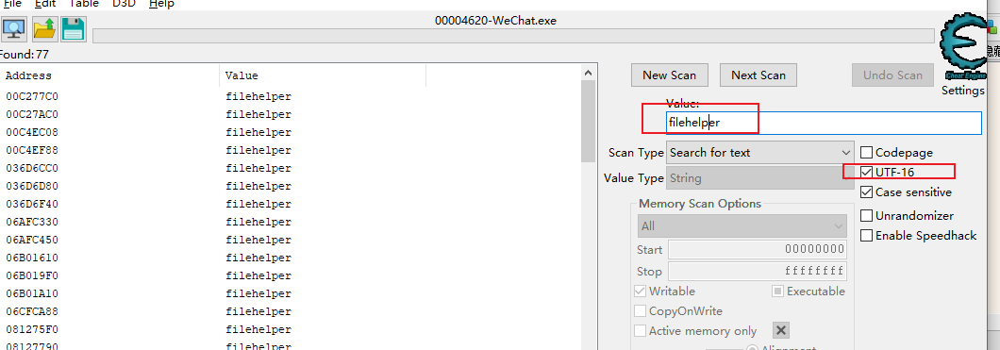
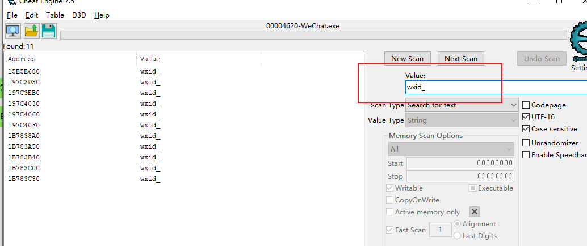
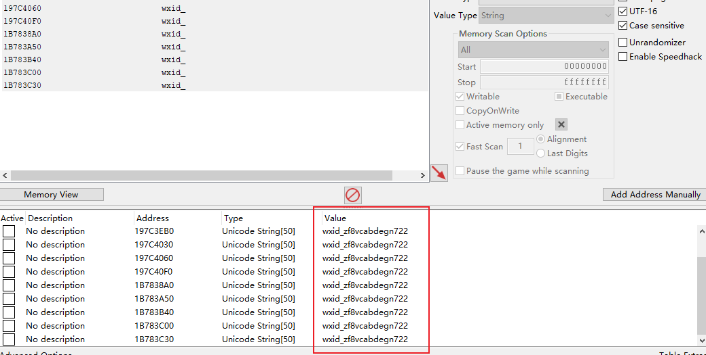

# x64dbg

```java
hello world

```


## 初始

attach 进程： 如果没有发现进程，确认目标程序是否与x64dbg 的类型一致（64,32）


配置：

默认情况下会有这个TLS断点，关闭， 避免一直停下来






补丁：


# windbg

命令：

```shell
# 查看内存地址
db addr
# 反编译内存地址的代码
u addr
```


# IDA

安装目录不能有中文，否则无法打开文件


G： 跳转到指定代码

创建结构体：shift+f1 ---> insert: 输入C语言形式的结构体


A键： 16进制转string


IDA 对应x64dbg 代码映射：

Edit -> Segment -> rebase ...:

输入x64dbg 中的模块基地址即可： 

如果关闭了ALSR，直接copy 也可




String 窗口：




# 安卓


adb 安卓apk 报错：

```log
D:\safe-application\app>adb install my_test.apk
Performing Streamed Install
adb: failed to install my_test.apk: Failure [INSTALL_FAILED_TEST_ONLY: installPackageLI]
```


由于配置中含有
android:testOnly="true"

安装的时候可以加上-t 参数

## 调试APP

前提：

```

```

步骤：

1. 启动android_server
2. adb 转发：adb forward tcp:23946 tcp:23946
3. 


**android:debuggable="true"**


# 微信

## 小程序解密：

https://github.com/Ackites/KillWxapkg?tab=readme-ov-file

```shell
KillWxapkg_2.4.1_windows_amd64.exe -in C:\Users\ye\AppData\Roaming\Tencent\xwechat\radium\Applet\packages\wx1b5e2763b9c1e06e\27 -id=wx1b5e2763b9c1e06e -pretty -sensitive -out D:\safe-application\wxapp
```


## 数据库密码




## hook

勾选了UTF-16 好像是包含界面的内容




切换用户，继续搜索




将上面的复制到地址列表，改变显示类型string，长度50，得到wxid




测试发消息，在别人的窗口发消息，实际上发给另外一个人：得到内存地址， od下内存写入断点


## 接受消息